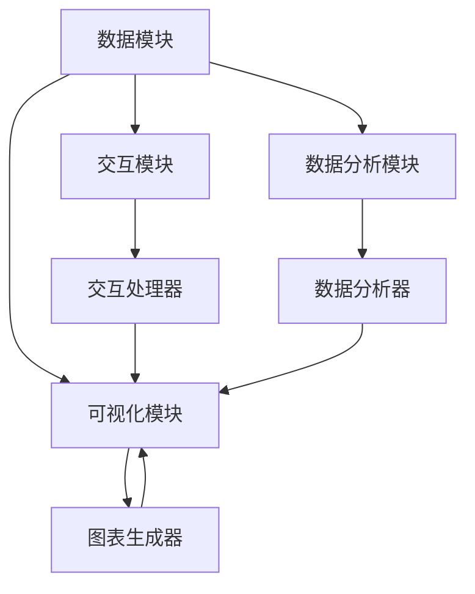

                 

### 文章标题

#### 《提示词编程的可视化工具设计》

---

**关键词：** 提示词编程，可视化工具，设计原则，用户体验，算法实现，项目实战。

---

**摘要：** 本篇文章深入探讨了提示词编程的可视化工具设计。文章首先介绍了提示词编程的基础概念和原理，随后详细分析了可视化工具的需求和架构设计。文章通过核心算法原理讲解，使用伪代码和数学模型进行详细阐述，随后通过项目实战展示了具体实现和应用。最后，文章总结了全文内容，并对未来的发展方向进行了展望。

---

## 第一部分：引言与基础概念

### 1. 引言

在信息化社会，编程已经成为一项必备技能。传统的编程方式往往依赖于文本处理，而现代编程正逐渐向可视化方向发展。提示词编程作为一种新兴的编程模式，通过可视化工具极大地提高了编程的效率和体验。本节将首先介绍本书的目的和结构，随后详细探讨提示词编程和可视化工具的基本概念。

#### 1.1 书籍目的与结构

**书籍目的：** 本书的目的是深入探讨提示词编程的可视化工具设计，旨在帮助读者理解并掌握这一新兴的编程模式，从而提升编程效率和用户体验。

**书籍结构：** 本书分为四个部分：

1. **引言与基础概念**：介绍提示词编程和可视化工具的基本概念。
2. **可视化工具设计**：详细分析可视化工具的需求、架构设计和核心功能实现。
3. **提示词编程实现**：讲解提示词编程的语法设计、实现和与可视化工具的交互。
4. **案例分析与应用**：通过具体项目实战，展示可视化工具在提示词编程中的应用。

#### 1.2 可视化工具在编程中的应用

可视化工具在编程中的应用日益广泛，它们不仅帮助开发者更直观地理解代码结构，还能提高编程效率和代码质量。可视化工具的应用场景主要包括：

1. **代码可视化**：将代码以图形化的形式展示，使开发者更容易理解代码逻辑。
2. **算法可视化**：将算法的实现过程以动画或图形方式展示，帮助开发者深入理解算法原理。
3. **交互式编程**：通过可视化界面与代码进行交互，动态调整代码运行结果。

### 2. 提示词编程概述

#### 2.1 提示词编程的原理

提示词编程是一种基于自然语言的编程模式，它通过提示词（或称为关键词）来引导程序执行。提示词通常是由开发者预设的，用于指示程序在不同情境下的行为。这种编程模式的核心在于将复杂逻辑转化为简洁的提示词，从而简化编程过程。

**提示词的概念：** 提示词是编程语言中的一个重要组成部分，它类似于自然语言中的动词或命令词，用于描述程序的行为。例如，在提示词编程中，"add" 表示执行加法操作，"display" 表示显示结果。

**提示词编程的优势：** 提示词编程具有以下优势：

1. **易于学习和使用**：提示词编程语言通常更加接近自然语言，易于开发者理解和掌握。
2. **提高编程效率**：通过提示词，开发者可以快速地实现功能，而不需要编写复杂的代码。
3. **增强代码可读性**：提示词使代码更加简洁明了，提高了代码的可读性和可维护性。

**提示词编程的基本框架：** 提示词编程通常包括以下基本框架：

1. **输入提示词**：开发者通过输入提示词来指定程序的行为。
2. **解析提示词**：程序对输入的提示词进行解析，确定相应的操作。
3. **执行操作**：根据解析结果，程序执行相应的操作。
4. **输出结果**：将执行结果以可视化或文本形式展示给开发者。

#### 2.2 可视化工具的基本概念

可视化工具是将抽象的数据和算法以图形或动画形式展示的技术，它使复杂的信息更易于理解和分析。可视化工具的基本概念包括：

**可视化的原理：** 可视化工具通过将数据或算法映射到视觉元素（如线条、颜色、形状等），使开发者可以直观地观察到数据或算法的变化和关系。

**可视化工具的种类：** 常见可视化工具包括：

1. **图表可视化**：通过图表（如折线图、柱状图、饼图等）展示数据分布和趋势。
2. **交互式可视化**：通过用户交互（如拖拽、缩放等）动态调整数据展示方式。
3. **流程图可视化**：通过图形化表示算法或程序的执行流程。

**可视化工具的交互方式：** 可视化工具通常提供多种交互方式，包括：

1. **鼠标操作**：通过鼠标点击、拖拽、滑动等操作来选择、调整可视化元素。
2. **键盘操作**：通过键盘快捷键快速执行特定操作。
3. **触摸操作**：适用于触摸屏设备，通过手指触摸来与可视化界面进行交互。

### 2.3 提示词编程与可视化工具的关系

提示词编程和可视化工具密切相关，二者相辅相成。提示词编程通过简化编程过程，使开发者能够更专注于算法和数据的可视化展示。可视化工具则通过图形化的方式，使提示词编程的结果更直观、易于理解。

**提示词编程与可视化工具的关联：**

1. **提示词引导可视化**：提示词编程的结果可以通过可视化工具进行展示，使开发者可以更直观地看到程序的执行效果。
2. **可视化辅助编程**：可视化工具可以帮助开发者更好地理解提示词编程的流程和结果，从而优化编程逻辑。

**提示词编程与可视化工具的优势结合：**

1. **提高编程效率**：通过可视化工具，开发者可以快速验证提示词编程的结果，减少调试时间。
2. **增强用户体验**：直观的可视化展示使开发者更容易理解复杂算法和数据，提高编程的乐趣和成就感。

### 2.4 本章小结

本章介绍了提示词编程和可视化工具的基本概念。通过了解提示词编程的原理和可视化工具的作用，读者可以初步认识到二者在编程中的重要性。接下来的章节将深入探讨可视化工具的设计原则、核心功能实现以及具体应用案例，帮助读者全面掌握提示词编程的可视化工具设计。

---

通过上述内容，我们为读者提供了一个清晰的认识框架，介绍了提示词编程和可视化工具的基本概念及其在编程中的应用。接下来，我们将进一步深入探讨可视化工具的设计原则和实现方法。

---

## 第二部分：可视化工具设计

### 3. 可视化工具的需求分析

#### 3.1 用户需求调查

在进行可视化工具的设计之前，了解用户需求至关重要。通过用户需求调查，我们可以明确可视化工具需要具备的功能和性能要求，从而确保设计能够满足实际应用需求。

**用户使用场景分析：**

1. **开发人员**：开发人员需要通过可视化工具快速验证代码的正确性，优化算法性能，提高编程效率。
2. **数据分析师**：数据分析师利用可视化工具对大量数据进行分析，提取关键信息，辅助决策。
3. **科研人员**：科研人员通过可视化工具展示科研成果，促进学术交流和合作。

**用户需求分类：**

1. **基本功能需求：**
   - 数据导入与导出：支持多种数据格式的导入和导出，满足不同场景的需求。
   - 数据处理：提供数据清洗、转换、归一化等功能，确保数据质量。
   - 可视化展示：提供多种图表类型，如折线图、柱状图、饼图等，满足不同数据展示需求。
   - 交互式操作：支持用户通过鼠标、键盘或触摸屏与可视化界面进行交互。

2. **高级功能需求：**
   - 动态更新：支持实时数据更新，动态展示数据变化趋势。
   - 数据分析：提供高级数据分析功能，如回归分析、聚类分析、关联规则挖掘等。
   - 多维数据展示：支持多维数据展示，通过颜色、形状、标签等元素区分不同维度的数据。

**需求优先级排序：**

在满足用户需求时，我们需要对需求进行优先级排序，以确保设计能够优先满足关键需求。以下是用户需求的优先级排序：

1. **基本功能需求**：确保所有基本功能需求得到满足，如数据导入导出、数据处理、可视化展示和交互式操作。
2. **高级功能需求**：在基本功能需求得到满足的基础上，逐步实现高级功能需求，如动态更新、数据分析和多维数据展示。

**用户需求调查方法：**

1. **问卷调查**：通过设计问卷，收集用户对可视化工具的需求和期望。
2. **用户访谈**：与用户进行面对面访谈，深入了解用户的实际使用场景和需求。
3. **用户测试**：邀请用户参与可视化工具的测试，收集用户反馈和改进意见。

### 3.2 可视化工具的设计原则

为了满足用户需求，可视化工具的设计需要遵循以下原则：

**1. 易用性：** 可视化工具应具有直观的界面和简洁的操作流程，使开发者能够快速上手使用。

**2. 可扩展性：** 可视化工具应具备良好的可扩展性，能够支持新功能和新数据类型的添加。

**3. 高性能：** 可视化工具应能够高效处理大量数据，提供实时更新和交互式操作。

**4. 兼容性：** 可视化工具应支持多种操作系统和浏览器，确保用户在不同设备和平台上都能顺畅使用。

**5. 安全性：** 可视化工具应确保数据安全和用户隐私，防止数据泄露和未经授权的访问。

#### 3.3 可视化工具的架构设计

可视化工具的架构设计是工具实现的核心，它决定了工具的性能、可扩展性和用户体验。以下是可视化工具的架构设计步骤：

**1. 功能模块划分：**

- **数据模块**：负责数据的导入、处理和存储。
- **可视化模块**：负责数据可视化展示，包括图表类型选择、数据映射和显示。
- **交互模块**：负责用户与可视化界面的交互，包括鼠标、键盘和触摸屏操作。
- **数据分析模块**：负责高级数据分析和挖掘。

**2. 模块间关系设计：**

- **数据模块**与**可视化模块**的关系：数据模块将处理后的数据传递给可视化模块，可视化模块根据数据生成相应的图表。
- **交互模块**与**可视化模块**的关系：交互模块接收用户的操作指令，传递给可视化模块进行相应的更新和交互操作。
- **数据分析模块**与**可视化模块**的关系：数据分析模块将分析结果传递给可视化模块，可视化模块根据分析结果生成相应的图表。

**3. 系统架构图绘制：**

**4. 可视化工具的性能优化：**

- **数据预处理：** 通过预处理减少数据量，提高数据处理的效率。
- **内存管理：** 优化内存使用，避免内存泄漏和占用过高。
- **渲染优化：** 优化图表渲染过程，提高显示效率。
- **并发处理：** 支持多线程和并发处理，提高系统响应速度。

### 3.4 本章小结

本章详细介绍了可视化工具的需求分析、设计原则和架构设计。通过用户需求调查，明确了可视化工具的基本功能需求和高

