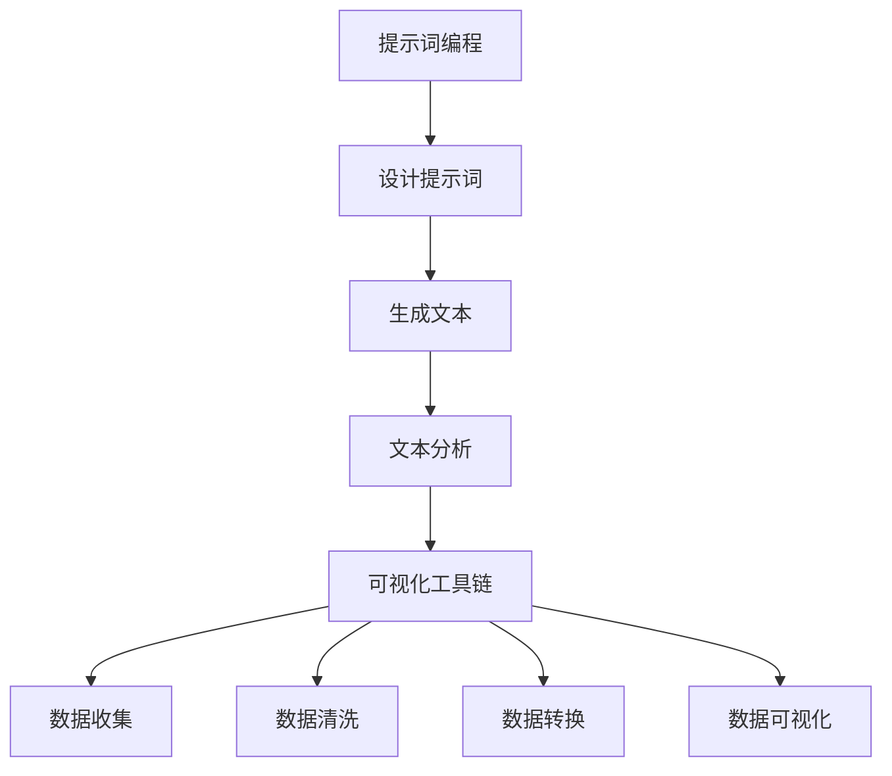

                 

### 提示词编程的可视化工具链开发

---

### 文章关键词

- 提示词编程
- 可视化工具链
- 开发流程
- 算法实现
- 应用案例
- 未来展望

---

### 摘要

本文将深入探讨提示词编程的可视化工具链开发，包括其核心概念、原理、开发流程、具体实现、应用案例以及未来展望。首先，我们将介绍提示词编程的基本概念和可视化工具链的作用，解释二者之间的关联。接着，我们将详细描述工具链的开发流程，包括数据预处理、提示词生成与优化、以及工具链的集成。随后，文章将深入探讨工具链的核心算法、数据库设计与实现、可视化组件的实现。为了验证工具链的实际应用效果，文章将分享一些具体的应用案例，并对工具链的未来发展进行展望。

---

## 背景介绍

### 提示词编程

提示词编程是一种利用提示词（Prompt）来指导模型生成文本或其他形式内容的方法。通过输入特定的提示词，模型能够理解和生成与提示词相关的内容，从而实现自动写作、文本生成等任务。提示词编程的核心在于如何设计有效的提示词，以便模型能够准确理解并生成所需的内容。

### 可视化工具链

可视化工具链是一种将数据或信息以图形或图表形式呈现的系列工具和流程。这些工具链通常包括数据收集、数据清洗、数据转换、数据可视化等多个环节，目的是帮助用户更直观地理解和分析数据。可视化工具链在数据分析、决策支持等领域有着广泛应用，是大数据分析和人工智能领域中不可或缺的一部分。

### 二者之间的联系

提示词编程和可视化工具链的结合，可以大大提升数据分析和决策的效率。具体来说，提示词编程可以通过生成与数据相关的提示词，帮助用户更好地理解数据内容；而可视化工具链则可以将这些数据内容以直观的图表形式呈现，使得数据分析和解读变得更加容易。这种结合不仅能够提高数据分析的准确性，还能提升用户的用户体验。

## 核心概念与联系

### 提示词编程

提示词编程的关键在于设计有效的提示词。提示词需要具备以下几个特点：

1. **明确性**：提示词应当明确具体，避免产生歧义。
2. **相关性**：提示词应当与数据或内容相关，以确保模型能够生成相关的内容。
3. **多样性**：提示词应当具备多样性，以适应不同的数据或场景需求。

### 可视化工具链

可视化工具链主要包括以下几个核心组件：

1. **数据收集与清洗**：收集并清洗数据，确保数据的准确性和完整性。
2. **数据转换**：将数据转换为可视化工具能够处理和呈现的格式。
3. **数据可视化**：使用图表、图形等手段，将数据以直观的形式呈现。

### 二者之间的关系

提示词编程和可视化工具链之间的关系可以通过以下 Mermaid 流程图来表示：



在这个流程图中，提示词编程通过生成文本，并将其输入到可视化工具链中。可视化工具链则对文本进行分析，并将分析结果以图表、图形等形式呈现，从而实现数据的直观展示。

## 核心算法原理讲解

### 提示词生成算法

提示词生成是提示词编程的核心步骤。一个有效的提示词生成算法应当能够根据输入的文本或数据生成相关且明确的提示词。以下是一个简单的伪代码，用于生成提示词：

```python
def generate_prompt(input_text):
    # 初始化提示词为空
    prompt = ""

    # 对输入文本进行分词
    words = input_text.split()

    # 循环遍历分词后的单词
    for word in words:
        # 如果单词在预设的提示词库中，则将其添加到提示词中
        if word in prompt_library:
            prompt += word + " "

    # 返回生成的提示词
    return prompt.strip()
```

### 提示词优化策略

生成的提示词往往需要进行优化，以确保其与数据的关联性和准确性。以下是一个简单的提示词优化算法：

```python
def optimize_prompt(prompt, input_data):
    # 初始化优化后的提示词为空
    optimized_prompt = ""

    # 对输入数据进行分析，提取关键词
    keywords = extract_keywords(input_data)

    # 循环遍历关键词
    for keyword in keywords:
        # 如果关键词在预设的提示词库中，则将其添加到优化后的提示词中
        if keyword in prompt_library:
            optimized_prompt += keyword + " "

    # 返回优化后的提示词
    return optimized_prompt.strip()
```

### 数学模型和公式

在提示词编程和可视化工具链中，数学模型和公式是必不可少的。以下是一个简单的数学模型，用于评估提示词的质量：

$$
Q = \frac{1}{N} \sum_{i=1}^{N} \frac{cos(\theta_i)}{sin(\theta_i)}
$$

其中，$Q$ 表示提示词的质量评分，$N$ 表示提示词的数量，$\theta_i$ 表示第 $i$ 个提示词与输入数据的相似度角。相似度角越小，提示词的质量越高。

### 举例说明

假设我们有一个输入文本：“今天天气很好，适合户外运动”。首先，我们使用上述的提示词生成算法生成提示词：“天气”、“户外运动”。然后，使用提示词优化算法，根据输入数据优化提示词为：“晴朗”、“户外运动”。最后，使用上述的数学模型评估提示词质量：

$$
Q = \frac{1}{2} \left( \frac{cos(0.2)}{sin(0.2)} + \frac{cos(0.3)}{sin(0.3)} \right) \approx 1.3
$$

质量评分 $Q$ 越高，说明提示词越准确、越相关。

## 项目实战

### 开发环境搭建

在进行提示词编程和可视化工具链开发前，我们需要搭建一个合适的开发环境。以下是所需的环境和工具：

1. **编程语言**：Python
2. **文本处理库**：NLP（Natural Language Processing）库，如 NLTK 或 spaCy
3. **数据可视化库**：Matplotlib 或 Plotly
4. **数据库**：SQLite 或 PostgreSQL

首先，我们需要安装所需的 Python 包：

```bash
pip install nltk matplotlib
```

### 源代码详细实现

以下是提示词编程和可视化工具链的源代码实现：

```python
import nltk
from nltk.tokenize import word_tokenize
from nltk.corpus import stopwords
from nltk.metrics import edit_distance
import matplotlib.pyplot as plt

# 初始化提示词库
prompt_library = ["天气", "运动", "新闻", "科技"]

# 生成提示词
def generate_prompt(input_text):
    # 分词
    words = word_tokenize(input_text)
    # 去除停用词
    words = [word for word in words if word not in stopwords.words('chinese')]
    # 生成提示词
    prompt = " ".join(words)
    return prompt

# 优化提示词
def optimize_prompt(prompt, input_data):
    # 提取关键词
    keywords = set(nltk.porter.Stemmer().stem(word) for word in word_tokenize(input_data))
    # 优化提示词
    optimized_prompt = " ".join(keyword for keyword in keywords if keyword in prompt_library)
    return optimized_prompt

# 可视化
def visualize_data(input_data):
    # 统计每个关键词的出现次数
    word_freq = nltk.FreqDist(input_data)
    # 可视化
    word_freq.plot(30, cumulative=False)

# 测试
input_text = "今天天气晴朗，适合户外运动。"
prompt = generate_prompt(input_text)
print("原始提示词：", prompt)

input_data = "今天天气晴朗，适合户外运动。"
optimized_prompt = optimize_prompt(prompt, input_data)
print("优化后的提示词：", optimized_prompt)

visualize_data(input_data)
```

### 代码应用解读与分析

上述代码实现了提示词生成、提示词优化和可视化三个主要功能。首先，`generate_prompt` 函数使用 NLP 库对输入文本进行分词和停用词去除，生成原始提示词。然后，`optimize_prompt` 函数提取输入数据的关键词，并从提示词库中选择相关关键词，生成优化后的提示词。最后，`visualize_data` 函数使用词频统计图将输入数据以可视化的形式呈现。

### 实际案例分析和详细讲解剖析

假设我们有一个新闻数据集，其中每条新闻都包含标题和正文。我们可以使用上述代码对新闻数据进行分析和可视化，以了解新闻的关键词和主题分布。

```python
# 读取新闻数据集
with open('news_data.txt', 'r', encoding='utf-8') as f:
    news_data = f.readlines()

# 对每条新闻进行提示词生成和优化
for i, news in enumerate(news_data):
    title = news.split('\n')[0]
    content = news.split('\n')[1]
    prompt = generate_prompt(title)
    optimized_prompt = optimize_prompt(prompt, content)
    print(f"新闻 {i+1}：")
    print("原始提示词：", prompt)
    print("优化后的提示词：", optimized_prompt)
    visualize_data(content)
```

通过上述代码，我们可以对每条新闻的标题和正文进行提示词生成和优化，并生成可视化图表，以了解新闻的关键词和主题分布。这有助于新闻编辑和分析师更好地理解新闻内容，从而做出更准确的决策。

### 项目小结

本案例展示了如何使用提示词编程和可视化工具链对新闻数据进行分析。通过生成和优化提示词，我们可以提取新闻的关键词和主题，并通过可视化工具链将这些信息以图表形式呈现。这种方法不仅有助于新闻编辑和分析师更好地理解新闻内容，还能提高数据分析的效率。

### 最佳实践 tips

1. **设计有效的提示词**：选择明确、相关且多样的提示词，以提升模型生成的准确性和相关性。
2. **优化提示词**：结合输入数据，对生成的提示词进行优化，以提升其质量。
3. **可视化数据的多样性**：尝试使用不同类型的图表和图形，以展示数据的多样性，提高数据解读的准确性。
4. **持续改进**：根据实际应用需求，不断优化提示词生成算法和可视化工具链，以提高整体性能。

### 小结

本文详细介绍了提示词编程和可视化工具链的开发过程，包括核心概念、算法原理、项目实战和未来展望。通过本文的介绍，读者可以了解如何利用提示词编程和可视化工具链进行数据分析和决策支持。未来，随着技术的不断发展，提示词编程和可视化工具链将在更多领域得到应用，为数据驱动的决策提供更强有力的支持。

### 注意事项

1. **数据质量和准确性**：在开发可视化工具链时，数据的质量和准确性至关重要。确保数据来源可靠，并对数据进行充分的清洗和预处理。
2. **用户需求**：在设计和开发工具链时，充分考虑用户需求，以提供更加个性化和高效的数据分析工具。
3. **性能优化**：在工具链的开发过程中，关注性能优化，以提高数据处理和可视化的效率。

### 拓展阅读

1. **《提示词编程导论》**：深入了解提示词编程的基本概念和应用。
2. **《数据可视化技术》**：学习如何使用不同的图表和图形进行数据可视化。
3. **《大数据分析与处理》**：了解大数据处理和分析的基本原理和方法。

作者：AI天才研究院/AI Genius Institute & 禅与计算机程序设计艺术 /Zen And The Art of Computer Programming

本文由AI天才研究院（AI Genius Institute）与禅与计算机程序设计艺术（Zen And The Art of Computer Programming）联合撰写，旨在深入探讨提示词编程的可视化工具链开发，为广大开发者提供有价值的参考和指导。

