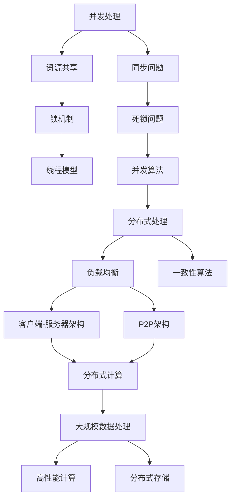
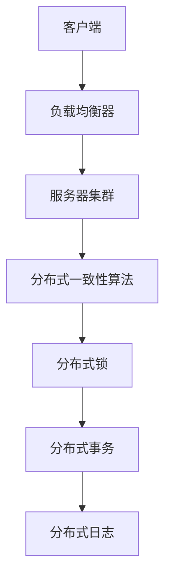
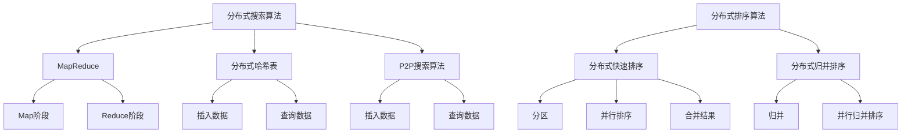
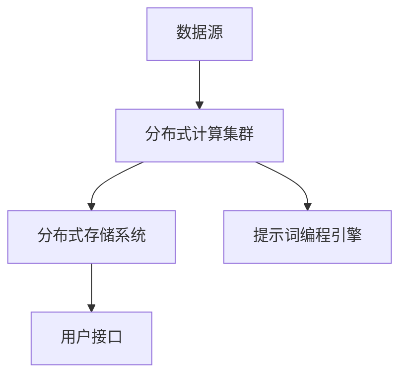

                 

### 文章标题

**提示词编程的并发与分布式处理**

> 关键词：提示词编程，并发，分布式处理，算法，性能优化

> 摘要：
本篇文章将深入探讨提示词编程在并发与分布式处理中的应用，介绍其核心概念、原理及实现方法。通过详细剖析并发与分布式处理的区别与联系，结合实际项目案例，本文旨在为读者提供全面、系统的指导，帮助其更好地理解并掌握这一关键技术。

---

### 引言

随着信息技术的飞速发展，计算需求日益增长，单机处理能力逐渐无法满足日益复杂的应用场景。在这种情况下，并发与分布式处理技术应运而生，成为现代计算机系统设计中的重要组成部分。然而，传统的并发与分布式处理方法在面临大规模数据处理和复杂任务调度时，仍存在诸多挑战。

近年来，提示词编程作为一种新兴的编程范式，逐渐受到关注。它通过将自然语言描述与编程逻辑相结合，简化了开发过程，提高了编程效率。结合提示词编程的优势，本文将探讨其在并发与分布式处理中的应用，并分析其中的关键技术与方法。

本文将分为两部分展开讨论：第一部分为基础理论，包括并发与分布式处理概述、并发编程基础、并发算法设计与分析、分布式系统基础、分布式算法设计以及提示词编程基础；第二部分为实战案例，通过具体项目实例介绍提示词编程在并发与分布式处理中的实际应用及优化策略。

通过本文的阅读，读者将全面了解提示词编程与并发分布式处理的结合，掌握关键实现方法，并为实际项目开发提供有益的参考。

### 并发与分布式处理概述

#### 并发处理

并发处理是指在同一时间段内处理多个任务的能力，其核心思想是通过资源共享和任务切换，提高系统的整体效率。在并发处理中，多个任务可以同时执行，但共享同一资源，如CPU、内存等。常见的并发处理技术包括线程、协程、锁机制等。

线程（Thread）是操作系统中独立的执行单元，它可以被操作系统调度执行。一个进程可以包含多个线程，各个线程共享进程的内存空间和其他资源。线程模型分为用户级线程和内核级线程，用户级线程由应用程序管理，而内核级线程由操作系统管理。

协程（Coroutine）是一种轻量级的线程，可以在用户级别实现并发，相较于线程，协程具有更小的上下文切换开销。协程通过栈实现多任务切换，能够高效地实现并发任务。

锁机制（Lock Mechanism）是并发编程中的重要概念，用于防止多个线程同时访问共享资源导致的数据不一致问题。常见的锁机制包括互斥锁（Mutex）、读写锁（Read-Write Lock）、条件锁（Condition Variable）等。

#### 分布式处理

分布式处理是指将计算任务分布在多个计算机节点上执行，通过协同工作实现高效、可靠的计算。分布式系统的核心特点是节点间的通信和协调，常见的分布式系统架构包括客户端-服务器（Client-Server）架构、对等网络（P2P）架构等。

负载均衡（Load Balancing）是分布式系统中的关键技术，通过合理分配任务，避免某个节点过载，提高系统的整体性能。常见的负载均衡算法包括轮询（Round Robin）、最小连接数（Least Connections）、哈希（Hash）等。

一致性（Consistency）是分布式系统中的另一个重要概念，指的是多个节点上的数据在同步后保持一致。分布式一致性算法包括强一致性（Strong Consistency）、最终一致性（Eventually Consistency）、因果一致性（ causal Consistency）等。

#### 并发与分布式处理的区别与联系

并发与分布式处理在实现方式、应用场景和性能特点上存在一定差异，但它们之间也存在紧密的联系。

- 实现方式：并发处理主要关注单机环境下的任务调度和资源共享，而分布式处理则侧重于多机环境下的任务分配和节点协调。
- 应用场景：并发处理适用于单机环境下高效处理多个任务，如Web服务器、游戏服务器等；分布式处理适用于大规模数据处理、高性能计算和分布式存储等场景。
- 性能特点：并发处理通过资源共享和任务切换提高单机性能，但存在同步问题和锁竞争；分布式处理通过节点协同和负载均衡实现高性能和高可靠性，但面临数据一致性和通信开销等问题。

在实际应用中，并发与分布式处理可以相互结合，形成更强大的计算能力。例如，一个分布式系统可以利用并发处理技术提高单个节点的处理能力，同时通过分布式处理实现大规模数据的处理和存储。

#### Mermaid流程图

为了更好地理解并发与分布式处理的关系，我们可以使用Mermaid流程图来描述它们的基本架构。



通过以上流程图，我们可以清晰地看到并发与分布式处理的基本概念和相互关系。

### 并发编程基础

#### 基本概念

并发编程（Concurrency Programming）是指在一个程序中同时处理多个任务的能力。并发编程的核心是任务调度和资源共享，其目的是提高系统的整体性能和响应速度。在并发编程中，常见的任务调度方式包括时间片调度、优先级调度和事件驱动调度。

时间片调度（Time-Sliced Scheduling）是一种最简单的任务调度方式，操作系统将CPU时间分成多个时间片，依次分配给各个任务。当一个任务的时间片用完时，操作系统将其暂停，并切换到下一个任务。这种方式适用于多任务环境，但可能导致任务响应时间变长。

优先级调度（Priority Scheduling）根据任务优先级来分配CPU时间，优先级高的任务先执行。优先级调度可分为静态优先级调度和动态优先级调度。静态优先级调度在任务创建时确定优先级，而动态优先级调度则根据任务执行情况实时调整优先级。

事件驱动调度（Event-Driven Scheduling）根据任务发生的事件来分配CPU时间，当有事件发生时，操作系统调用相应的事件处理函数。事件驱动调度适用于实时系统和网络应用，可以提高系统的响应速度。

#### 线程模型

线程模型（Thread Model）是并发编程中的重要概念，它描述了线程的创建、调度和管理方式。常见的线程模型包括用户级线程、内核级线程和混合级线程。

用户级线程（User-Level Thread）是由应用程序创建和管理的线程，操作系统不了解用户级线程的存在。用户级线程的优点是上下文切换开销较小，但缺点是缺乏系统级线程的支持，无法利用多核处理器。

内核级线程（Kernel-Level Thread）是由操作系统创建和管理的线程，操作系统对内核级线程进行调度和管理。内核级线程的优点是能够利用多核处理器，但上下文切换开销较大。

混合级线程（Mixed-Level Thread）是用户级线程和内核级线程的组合，它在用户级别实现线程的创建和管理，在系统级别实现线程的调度。混合级线程的优点是兼具用户级线程和内核级线程的优点，但实现复杂度较高。

#### 锁机制

锁机制（Lock Mechanism）是并发编程中防止多个线程同时访问共享资源导致数据不一致的重要手段。常见的锁机制包括互斥锁（Mutex）、读写锁（Read-Write Lock）和条件锁（Condition Variable）。

互斥锁（Mutex）是一种最基本的锁机制，它保证同一时间内只有一个线程可以访问共享资源。互斥锁可分为一次性互斥锁和可重入互斥锁。一次性互斥锁在一次加锁和解锁操作中保证线程安全，而可重入互斥锁允许多次加锁和解锁。

读写锁（Read-Write Lock）是一种允许多个线程同时读取共享资源，但只允许一个线程写入共享资源的锁机制。读写锁分为共享锁（Shared Lock）和排他锁（Exclusive Lock）。共享锁允许多个线程同时读取共享资源，而排他锁保证同一时间内只有一个线程可以写入共享资源。

条件锁（Condition Variable）是一种基于线程等待和唤醒机制的锁机制。条件锁允许线程在满足特定条件时等待，并在条件满足时唤醒等待线程。条件锁通常与互斥锁结合使用，实现线程间的同步和通信。

#### 并发编程的常见问题与解决方案

在并发编程中，常见的问题包括死锁、数据竞争和性能瓶颈等。

死锁（Deadlock）是指多个线程因为互相等待资源而无法继续执行的情况。解决死锁的方法包括预防死锁、避免死锁和检测死锁。

预防死锁（Prevention）是通过设计避免死锁发生。预防死锁的基本策略是保证资源的请求和释放顺序，避免循环等待。

避免死锁（Avoidance）是通过动态分配资源，避免系统进入不安全状态。避免死锁的基本策略是资源分配策略和安全性检查。

检测死锁（Detection）是在系统运行过程中检测死锁。检测死锁的方法包括资源分配图法、等待图法和超时法。

数据竞争（Data Race）是指多个线程同时访问共享资源，且至少有一个线程进行写操作，导致数据不一致的问题。解决数据竞争的方法包括锁机制和原子操作。

性能瓶颈（Performance Bottleneck）是指系统性能因某些因素而受限的情况。解决性能瓶颈的方法包括优化算法、减少锁竞争和改进数据结构。

通过以上方法，可以有效地解决并发编程中的常见问题，提高系统的稳定性和性能。

#### 伪代码示例

以下是一个简单的并发编程伪代码示例，演示了线程之间的同步和通信。

```plaintext
// 伪代码：并发计算斐波那契数列

// 初始化锁
mutex lock

// 初始化全局变量
int fib[n]
fib[0] = 0
fib[1] = 1

// 计算斐波那契数列
for i = 2 to n do
    // 加锁
    lock()

    // 计算当前项
    fib[i] = fib[i - 1] + fib[i - 2]

    // 解锁
    unlock()

// 输出结果
for i = 0 to n do
    print(fib[i])
```

在这个示例中，我们使用互斥锁（Mutex）保证在计算斐波那契数列时，多个线程不会同时访问和修改共享变量`fib`。通过加锁和解锁操作，实现线程之间的同步和通信。

### 并发算法设计与分析

#### 伪代码介绍

伪代码（Pseudo Code）是一种非正式的编程语言，用于描述算法的实现过程。它结合了自然语言和编程语言的语法，易于理解和编写，但无法直接执行。伪代码的目的是在正式编程之前，对算法进行设计和分析。

以下是一个简单的并发算法伪代码示例，用于计算两个矩阵的乘积。

```plaintext
// 伪代码：并发矩阵乘法

// 输入：矩阵A，矩阵B，矩阵C
// 输出：矩阵C

// 初始化矩阵C
for i = 0 to m do
    for j = 0 to n do
        C[i][j] = 0

// 并行计算矩阵C的每个元素
for k = 0 to n do
    thread t1(A, k, C)
    thread t2(B, k, C)
    wait(t1)
    wait(t2)

    // 计算C[i][j] = A[i][k] * B[k][j]
    for i = 0 to m do
        for j = 0 to n do
            C[i][j] += A[i][k] * B[k][j]

// 输出结果
print(C)
```

在这个示例中，我们使用线程（Thread）实现并行计算，通过并行计算矩阵A和B的每个元素，实现矩阵乘法。通过等待（Wait）操作，确保线程计算完成后输出结果。

#### 常见并发算法分析

并发算法（Concurrency Algorithm）是指在多个线程或进程间进行协同工作的算法。以下介绍几种常见的并发算法及其分析。

##### 同步算法

同步算法（Synchronization Algorithm）用于实现线程之间的同步和通信。常见的同步算法包括生产者-消费者算法、哲学家就餐算法等。

**生产者-消费者算法**是一种典型的同步算法，用于解决生产者和消费者之间的数据共享问题。生产者负责生成数据，并将其放入缓冲区中；消费者从缓冲区中取出数据并处理。

以下是一个简单的生产者-消费者算法伪代码示例。

```plaintext
// 伪代码：生产者-消费者算法

// 初始化锁和条件变量
mutex buffer_mutex
condition variable buffer_not_full
condition variable buffer_empty

// 生产者
producer() {
    while (true) {
        // 生成数据
        data = generate_data()

        // 等待缓冲区不满
        wait(buffer_not_full)

        // 将数据放入缓冲区
        buffer[data] = data

        // 唤醒消费者
        signal(buffer_empty)
    }
}

// 消费者
consumer() {
    while (true) {
        // 等待缓冲区非空
        wait(buffer_empty)

        // 从缓冲区取出数据
        data = buffer[data]

        // 处理数据
        process_data(data)

        // 唤醒生产者
        signal(buffer_not_full)
    }
}
```

在这个示例中，生产者和消费者通过条件变量（Condition Variable）实现同步和通信。生产者等待缓冲区不满时放入数据，消费者等待缓冲区非空时取出数据。

**哲学家就餐算法**是一种经典的同步算法，用于解决哲学家就餐问题。哲学家就餐问题是指在餐厅中，有若干个哲学家围坐在一张圆桌上，每人有一只筷子。哲学家们交替进行思考和就餐，但每次就餐需要使用左右两支筷子。

以下是一个简单的哲学家就餐算法伪代码示例。

```plaintext
// 伪代码：哲学家就餐算法

// 初始化锁
mutex chopstick[5]

// 哲学家i
philosopher(i) {
    while (true) {
        think()

        // 取左筷子
        acquire(chopstick[i])

        // 取右筷子
        acquire(chopstick[(i + 1) % 5])

        // 就餐
        eat()

        // 放下右筷子
        release(chopstick[(i + 1) % 5])

        // 放下左筷子
        release(chopstick[i])
    }
}
```

在这个示例中，哲学家通过互斥锁（Mutex）实现同步和就餐的互斥。

##### 并行算法

并行算法（Parallel Algorithm）用于利用多个线程或进程实现任务并行化，提高计算性能。常见的并行算法包括快速排序、并行矩阵乘法等。

**快速排序**是一种经典的并行排序算法，它通过递归将数组分成若干个子数组，然后对子数组进行排序。

以下是一个简单的并行快速排序算法伪代码示例。

```plaintext
// 伪代码：并行快速排序

// 输入：数组A，起始索引low，结束索引high
// 输出：排序后的数组A

// 并行划分
partition(A, low, high) {
    // 选择中间元素作为基准
    pivot = A[high]

    // 初始化左右索引
    i = low
    j = low

    // 循环遍历数组
    while (j < high) {
        // 如果当前元素小于或等于基准，则将其移动到左边
        if (A[j] <= pivot) {
            swap(A[i], A[j])
            i++
        }
        j++
    }

    // 将基准移动到正确位置
    swap(A[i], A[high])

    // 返回基准索引
    return i
}

// 并行排序
parallel_sort(A, low, high) {
    if (low < high) {
        // 划分数组
        pivot_index = partition(A, low, high)

        // 创建线程进行并行排序
        thread t1(parallel_sort, A, low, pivot_index - 1)
        thread t2(parallel_sort, A, pivot_index + 1, high)

        // 等待线程完成
        wait(t1)
        wait(t2)
    }
}
```

在这个示例中，我们使用线程实现并行快速排序，通过递归划分和并行排序，提高排序速度。

#### 并发算法设计原则

并发算法设计（Concurrency Algorithm Design）需要遵循一些基本原则，以确保算法的正确性和高效性。

- **正确性（Correctness）**：算法必须能够正确地解决实际问题，满足需求和约束。
- **安全性（Safety）**：算法在执行过程中，应避免死锁、数据竞争等安全问题。
- **效率（Efficiency）**：算法应尽可能地提高执行效率，减少资源消耗。
- **可扩展性（Extensibility）**：算法应易于扩展和调整，以适应不同的应用场景。

在设计并发算法时，需要综合考虑这些原则，实现高效、可靠和可扩展的并发算法。

### 分布式系统基础

#### 概念

分布式系统（Distributed System）是指由多个独立计算机节点组成的系统，这些节点通过通信网络进行协同工作，共同完成计算任务。分布式系统的核心特点是节点之间的通信和协调，其主要目的是提高系统的性能、可靠性和可扩展性。

在分布式系统中，节点可以是物理计算机或虚拟计算机，它们之间通过网络进行通信。节点之间的通信方式包括消息传递（Message Passing）和共享内存（Shared Memory）。

- 消息传递（Message Passing）是一种通过发送和接收消息进行通信的方式。节点可以独立地处理消息，并与其他节点进行交互。
- 共享内存（Shared Memory）是一种通过共享内存空间进行通信的方式。节点可以访问共享内存中的数据，并进行同步和通信。

分布式系统的常见架构包括客户端-服务器（Client-Server）架构、对等网络（Peer-to-Peer）架构和混合架构。

- 客户端-服务器（Client-Server）架构是一种中心化的分布式系统架构，其中客户端向服务器发送请求，服务器处理请求并返回结果。
- 对等网络（Peer-to-Peer）架构是一种去中心化的分布式系统架构，其中节点既可以作为客户端，也可以作为服务器，节点之间通过直接通信进行协同工作。
- 混合架构（Hybrid Architecture）是结合了客户端-服务器架构和对等网络架构的特点，既具有中心化的优点，又具有去中心化的优势。

#### 负载均衡

负载均衡（Load Balancing）是分布式系统中的重要技术，用于将任务均匀地分配到多个节点上，避免某个节点过载，提高系统的整体性能。负载均衡的目的是最大化系统的吞吐量、最小化响应时间和提高系统的可靠性。

常见的负载均衡算法包括轮询（Round Robin）、最小连接数（Least Connections）、哈希（Hash）等。

- 轮询（Round Robin）算法是一种简单的负载均衡算法，按照顺序将任务分配给各个节点。
- 最小连接数（Least Connections）算法根据当前节点上的连接数，将任务分配给连接数最少的节点。
- 哈希（Hash）算法根据任务的哈希值，将任务分配给相应的节点。

负载均衡器（Load Balancer）是负责实现负载均衡的组件，它可以位于客户端和服务器之间，也可以位于服务器内部。负载均衡器根据负载均衡算法，动态地分配任务，并监控系统的性能。

#### 分布式一致性

分布式一致性（Distributed Consistency）是分布式系统中的关键问题，它涉及多个节点上的数据一致性保障。分布式一致性算法的目标是在多个节点上保持一致的数据状态，即使节点之间存在网络延迟和故障。

分布式一致性算法可以分为以下几类：

- 强一致性（Strong Consistency）：强一致性保证所有节点在同一时间看到相同的数据状态，但可能牺牲性能。
- 最终一致性（Eventually Consistency）：最终一致性保证在一段时间后，所有节点能够看到一致的数据状态，但无法保证实时性。
- 因果一致性（Causal Consistency）：因果一致性保证事件之间的因果关系，即如果一个事件A发生在事件B之前，那么所有节点都能看到事件A的结果。
- 读已提交一致性（Read-Committed Consistency）：读已提交一致性保证读取操作看到的是提交过的数据，但可能包括未提交的数据。

常见的分布式一致性算法包括分布式锁（Distributed Lock）、分布式事务（Distributed Transaction）和分布式日志（Distributed Log）。

- 分布式锁（Distributed Lock）是一种实现分布式一致性保障的机制，用于保证多个节点对共享资源的访问互斥。
- 分布式事务（Distributed Transaction）是一种在分布式系统中执行多步操作的机制，保证操作的原子性、一致性、隔离性和持久性。
- 分布式日志（Distributed Log）是一种记录分布式系统操作日志的机制，用于实现数据一致性、故障恢复和分布式事务。

#### Mermaid流程图

为了更好地理解分布式系统的基础概念，我们可以使用Mermaid流程图来描述其基本架构。



通过以上流程图，我们可以清晰地看到分布式系统的基本组件及其相互关系。

### 分布式算法设计

#### 概述

分布式算法设计（Distributed Algorithm Design）是分布式系统中的核心内容，旨在解决节点间的协作问题，实现高效的计算和一致性的保障。分布式算法需要考虑网络延迟、节点故障、数据传输等问题，以实现可靠和高效的分布式系统。

分布式算法可以分为多种类型，包括分布式搜索算法、分布式排序算法、分布式一致性算法等。每种算法都有其独特的实现方式和性能特点。

#### 分布式搜索算法

分布式搜索算法（Distributed Search Algorithm）用于在大规模数据集上进行高效搜索。常见的分布式搜索算法包括MapReduce、分布式哈希表（DHT）、P2P搜索算法等。

**MapReduce**

MapReduce是一种经典的分布式搜索算法，由Google提出。MapReduce将大规模数据集分成多个子任务，由多个节点并行处理，最后将结果合并。MapReduce算法分为两个阶段：Map阶段和Reduce阶段。

- **Map阶段**：输入数据被分成多个小块，每个小块由一个Mapper处理。Mapper将输入数据转换成中间键值对，并将结果写入本地文件。
- **Reduce阶段**：所有Mapper的本地文件被合并，由Reducer处理。Reducer根据中间键值对，生成最终的输出结果。

以下是一个简单的MapReduce算法伪代码示例。

```plaintext
// 伪代码：MapReduce算法

// Map阶段
map(Key1, Value1) {
    for each (Key2, Value2) in Input {
        emit(Key2, Value1)
    }
}

// Reduce阶段
reduce(Key2, List<Value1>) {
    // 对列表中的Value1进行聚合操作
    aggregate(Value1)
}
```

**分布式哈希表（DHT）**

分布式哈希表（Distributed Hash Table，DHT）是一种基于哈希表的分布式存储和搜索算法，用于实现大规模数据的高效存储和查询。DHT通过哈希函数将数据映射到不同的节点上，实现数据分布和负载均衡。

以下是一个简单的DHT算法伪代码示例。

```plaintext
// 伪代码：分布式哈希表（DHT）

// 插入数据
insert(Key, Value) {
    // 计算哈希值
    HashValue = hash(Key)

    // 查找最近的节点
    Node = find_closest_node(HashValue)

    // 将数据插入到节点中
    Node.insert(Key, Value)
}

// 查询数据
query(Key) {
    // 计算哈希值
    HashValue = hash(Key)

    // 查找最近的节点
    Node = find_closest_node(HashValue)

    // 从节点中查询数据
    Value = Node.query(Key)
    return Value
}
```

**P2P搜索算法**

P2P搜索算法（Peer-to-Peer Search Algorithm）用于在分布式网络中实现高效的数据搜索和共享。P2P搜索算法通过节点之间的直接通信和协作，实现数据的分布式存储和搜索。

以下是一个简单的P2P搜索算法伪代码示例。

```plaintext
// 伪代码：P2P搜索算法

// 插入数据
insert(Peer, Key, Value) {
    // 将数据发送给Peer
    Peer.send(Key, Value)

    // 将数据广播给其他节点
    broadcast(Key, Value)
}

// 查询数据
query(Peer, Key) {
    // 向Peer发送查询请求
    Peer.send_query(Key)

    // 处理查询结果
    process_query_results()
}
```

#### 分布式排序算法

分布式排序算法（Distributed Sorting Algorithm）用于在分布式系统中对大量数据进行高效排序。常见的分布式排序算法包括分布式快速排序、分布式归并排序等。

**分布式快速排序**

分布式快速排序（Distributed Quick Sort）是一种基于快速排序的分布式排序算法。它将大规模数据集划分成多个子任务，由多个节点并行处理，最后将结果合并。

以下是一个简单的分布式快速排序算法伪代码示例。

```plaintext
// 伪代码：分布式快速排序

// 分区
partition(Array, low, high) {
    // 选择基准元素
    Pivot = Array[high]

    // 初始化左右指针
    i = low - 1

    // 遍历数组
    for j = low to high - 1 do
        if Array[j] <= Pivot then
            i++
            swap(Array[i], Array[j])
        end if
    end for

    // 将基准元素放到正确位置
    swap(Array[i + 1], Array[high])

    // 返回基准索引
    return i + 1
}

// 并行排序
parallel_sort(Array, low, high) {
    if low < high then
        // 分区
        pivot_index = partition(Array, low, high)

        // 创建线程进行并行排序
        thread t1(parallel_sort, Array, low, pivot_index - 1)
        thread t2(parallel_sort, Array, pivot_index + 1, high)

        // 等待线程完成
        wait(t1)
        wait(t2)

        // 合并结果
        merge(Array, low, pivot_index - 1, pivot_index + 1, high)
}

// 合并结果
merge(Array, low, mid, mid + 1, high) {
    // 创建临时数组
    temp = new Array(high - low + 1)

    // 初始化指针
    i = low
    j = mid + 1
    k = 0

    // 遍历两个子数组
    while i <= mid and j <= high do
        if Array[i] <= Array[j] then
            temp[k] = Array[i]
            i++
        else
            temp[k] = Array[j]
            j++
        end if
        k++
    end while

    // 处理剩余元素
    while i <= mid do
        temp[k] = Array[i]
        i++
        k++
    end while

    while j <= high do
        temp[k] = Array[j]
        j++
        k++
    end while

    // 将结果复制回原数组
    for i = low to high do
        Array[i] = temp[i - low]
    end for
}
```

**分布式归并排序**

分布式归并排序（Distributed Merge Sort）是一种基于归并排序的分布式排序算法。它将大规模数据集划分成多个子任务，由多个节点并行处理，最后将结果合并。

以下是一个简单的分布式归并排序算法伪代码示例。

```plaintext
// 伪代码：分布式归并排序

// 归并
merge(Array, low, mid, high) {
    // 创建临时数组
    temp = new Array(high - low + 1)

    // 初始化指针
    i = low
    j = mid + 1
    k = 0

    // 遍历两个子数组
    while i <= mid and j <= high do
        if Array[i] <= Array[j] then
            temp[k] = Array[i]
            i++
        else
            temp[k] = Array[j]
            j++
        end if
        k++
    end while

    // 处理剩余元素
    while i <= mid do
        temp[k] = Array[i]
        i++
        k++
    end while

    while j <= high do
        temp[k] = Array[j]
        j++
        k++
    end while

    // 将结果复制回原数组
    for i = low to high do
        Array[i] = temp[i - low]
    end for
}

// 并行归并排序
parallel_merge_sort(Array, low, high) {
    if low < high then
        // 分区
        mid = (low + high) / 2

        // 创建线程进行并行排序
        thread t1(parallel_merge_sort, Array, low, mid)
        thread t2(parallel_merge_sort, Array, mid + 1, high)

        // 等待线程完成
        wait(t1)
        wait(t2)

        // 合并结果
        merge(Array, low, mid, high)
}
```

#### Mermaid流程图

为了更好地理解分布式算法的设计，我们可以使用Mermaid流程图来描述其基本架构。



通过以上流程图，我们可以清晰地看到分布式算法的基本架构和实现步骤。

### 提示词编程基础

#### 概念

提示词编程（Prompt Programming）是一种将自然语言描述与编程逻辑相结合的编程范式。它通过使用自然语言提示（Prompt），引导程序执行特定的任务，从而简化开发过程，提高编程效率。

提示词编程的核心思想是将复杂的编程任务分解成一系列简单的步骤，通过自然语言描述这些步骤，并使用编程语言实现。这种方式不仅降低了编程难度，还使得代码更加可读性和可维护性。

提示词编程的典型应用场景包括：

- 自动化脚本：使用自然语言描述一系列操作，实现自动化任务。
- 智能问答：通过自然语言交互，提供有关特定问题的答案。
- 数据处理：使用自然语言描述数据处理逻辑，提高数据处理效率。

#### 优势

提示词编程具有以下优势：

- **简化开发**：提示词编程将复杂任务分解成简单的步骤，降低了编程难度，使开发者能够更快地完成开发任务。
- **提高效率**：提示词编程通过减少代码编写量，缩短开发周期，提高开发效率。
- **可读性**：提示词编程的代码更加直观，易于理解和维护，提高了代码的可读性。
- **灵活性**：提示词编程可以根据不同的需求，灵活调整和优化代码逻辑。

#### 挑战

尽管提示词编程具有诸多优势，但在实际应用中仍面临一些挑战：

- **复杂性**：提示词编程涉及自然语言处理和编程逻辑的结合，实现过程相对复杂，对开发者的技能要求较高。
- **学习曲线**：提示词编程需要掌握自然语言处理和编程知识，对于新手来说，学习曲线相对较陡峭。
- **性能限制**：提示词编程在处理大规模数据和复杂任务时，可能存在性能瓶颈，需要进一步优化和改进。

#### 提示词编程的实现

提示词编程的实现主要包括以下步骤：

1. **需求分析**：分析任务需求，确定需要执行的操作和步骤。
2. **设计提示词**：根据任务需求，设计合适的自然语言提示词，引导程序执行任务。
3. **实现代码**：使用编程语言实现提示词编程的逻辑，将自然语言描述转化为具体的代码。
4. **测试与优化**：对实现代码进行测试，确保其功能正确，并根据测试结果进行优化。

以下是一个简单的提示词编程示例：

```plaintext
# 示例：计算两个数的和

# 提示词：计算5和3的和
sum = 5 + 3
print(sum)
```

在这个示例中，我们使用自然语言描述计算两个数的和的操作，并将结果输出。

### 提示词编程与并发分布式处理的融合

#### 应用场景

提示词编程与并发分布式处理的结合，为复杂任务的自动化和优化提供了新的解决方案。以下是一些常见的应用场景：

1. **大数据处理**：在大数据处理领域，提示词编程可以简化数据处理的流程，提高数据处理效率。例如，使用提示词编程实现数据清洗、转换和加载（ETL）任务。
2. **自动化脚本**：在自动化脚本开发中，提示词编程可以简化脚本的编写和执行，提高脚本的可读性和可维护性。例如，使用提示词编程实现自动化测试、部署和监控任务。
3. **智能问答系统**：在智能问答系统中，提示词编程可以简化问答逻辑的实现，提高问答系统的灵活性和响应速度。例如，使用提示词编程实现基于自然语言处理技术的问答机器人。
4. **分布式任务调度**：在分布式任务调度中，提示词编程可以简化任务定义和调度逻辑，提高调度系统的可扩展性和灵活性。例如，使用提示词编程实现分布式计算任务的调度和执行。

#### 融合方法

将提示词编程与并发分布式处理相结合，可以采用以下方法：

1. **任务分解**：将复杂任务分解成多个子任务，使用提示词编程描述每个子任务的执行步骤，并利用并发分布式处理技术实现子任务的并行执行。
2. **动态调度**：根据任务负载和系统资源，动态调整任务分配和调度策略，实现任务的高效执行。例如，使用提示词编程定义任务调度逻辑，并利用分布式调度框架实现任务的动态调度。
3. **数据一致性保障**：在分布式处理中，确保数据一致性是关键问题。使用提示词编程定义数据一致性和同步策略，并利用分布式一致性算法实现数据的一致性保障。
4. **性能优化**：通过分析任务执行过程中的性能瓶颈，使用提示词编程优化任务执行逻辑和算法，提高系统整体性能。

以下是一个简单的示例，演示了如何使用提示词编程和并发分布式处理实现一个分布式计算任务：

```plaintext
# 示例：分布式计算两个数的和

# 提示词：计算5和3的和，并使用分布式处理
sum = 5 + 3

# 初始化分布式任务
init DistributedTask(sum)

# 分解任务为多个子任务
split_task(sum, num_workers)

# 执行子任务
execute_tasks()

# 合并子任务结果
merge_results()

# 输出结果
print(merge_results())
```

在这个示例中，我们使用提示词编程定义了分布式计算两个数的和的任务，并利用并发分布式处理技术实现任务的执行和结果合并。

#### 优化策略

为了提高提示词编程与并发分布式处理的性能，可以采用以下优化策略：

1. **任务并行化**：将任务分解成更小的子任务，并尽可能并行执行，以减少任务执行时间。
2. **负载均衡**：合理分配任务到不同节点，避免某个节点过载，提高系统整体性能。
3. **数据本地化**：将数据存储在本地节点，减少数据传输和通信开销。
4. **缓存和预加载**：使用缓存技术预加载常用数据，减少数据访问时间，提高系统响应速度。
5. **并行算法优化**：选择合适的并行算法，减少计算时间和通信开销，提高系统性能。

通过以上优化策略，可以进一步提高提示词编程与并发分布式处理的性能和效率。

### 提示词编程并发分布式处理项目实战

#### 项目背景

随着互联网和大数据技术的不断发展，分布式计算和并发处理成为现代应用系统设计中的重要组成部分。为了提高系统的性能、可靠性和可扩展性，本案例将介绍一个基于提示词编程的并发分布式处理项目，用于实现大数据分析任务。

#### 项目需求分析

本项目的主要需求包括：

- **数据处理**：对大规模数据进行清洗、转换和加载（ETL）。
- **并发处理**：充分利用多核处理器和分布式计算资源，提高数据处理效率。
- **分布式存储**：将数据存储在分布式存储系统，保证数据的高可用性和容错性。
- **实时分析**：实时处理和分析数据，为用户提供快速响应。

#### 系统架构设计

本项目的系统架构设计包括以下几个关键组件：

- **数据源**：包括日志文件、数据库等，提供数据输入。
- **分布式计算集群**：包括多台服务器，用于并发处理和分布式计算。
- **分布式存储系统**：包括分布式文件系统，如HDFS，用于存储和管理数据。
- **提示词编程引擎**：用于定义和执行提示词编程任务，实现数据处理的自动化。

以下是一个简单的系统架构图：



#### 并发与分布式处理应用

在本项目中，我们将使用提示词编程和并发分布式处理技术，实现以下功能：

- **数据清洗**：使用提示词编程定义数据清洗任务，包括去重、补全、格式转换等。
- **数据转换**：使用提示词编程定义数据转换任务，包括数据格式转换、数据聚合等。
- **数据加载**：使用提示词编程定义数据加载任务，将清洗和转换后的数据加载到数据库或数据仓库中。
- **并发处理**：利用多核处理器和分布式计算资源，实现数据的并行处理。
- **分布式存储**：使用分布式存储系统存储和管理大规模数据，保证数据的高可用性和容错性。

以下是一个简单的提示词编程任务示例：

```plaintext
# 示例：数据清洗任务

# 提示词：清洗日志文件中的数据
input_file = "log_data.txt"
output_file = "cleaned_data.txt"

# 读取日志文件
data = read_file(input_file)

# 数据清洗
cleaned_data = []
for row in data:
    row = clean_row(row)
    cleaned_data.append(row)

# 写入清洗后的数据
write_file(output_file, cleaned_data)
```

#### 项目实施与优化

在项目实施过程中，我们将采取以下步骤和策略：

1. **需求分析**：明确项目需求和功能，制定详细的项目计划。
2. **架构设计**：设计合理的系统架构，确保系统的高性能和高可靠性。
3. **编码实现**：使用提示词编程和并发分布式处理技术，实现系统的核心功能。
4. **测试与调试**：对系统进行全面的测试和调试，确保系统的稳定性和正确性。
5. **性能优化**：根据测试结果，对系统进行性能优化，提高系统的响应速度和处理能力。
6. **部署上线**：将系统部署到生产环境，并进行上线前的测试和验证。

在优化过程中，我们将采取以下策略：

- **任务并行化**：将数据处理任务分解为多个子任务，并尽可能并行执行，提高数据处理效率。
- **负载均衡**：使用负载均衡技术，合理分配任务到不同节点，避免节点过载。
- **数据本地化**：将数据存储在本地节点，减少数据传输和通信开销。
- **缓存和预加载**：使用缓存技术预加载常用数据，减少数据访问时间。
- **并行算法优化**：选择合适的并行算法，减少计算时间和通信开销。

通过以上实施和优化策略，我们可以确保项目的高效实施和成功上线，为用户提供优质的大数据分析服务。

### 提示词编程并发分布式处理性能优化

#### 性能优化的重要性

性能优化是提示词编程并发分布式处理项目中至关重要的一环。性能优化不仅能够提高系统的处理速度和响应能力，还能最大限度地利用系统资源，降低成本。以下是性能优化的一些关键原因：

- **提高系统效率**：通过优化，可以减少任务执行时间，提高系统的整体效率。
- **降低资源消耗**：优化能够减少CPU、内存和网络等资源的消耗，降低系统的负载。
- **提高用户体验**：性能优化能够提高系统的响应速度，提升用户的体验和满意度。
- **确保系统稳定性**：性能优化能够减少系统故障和错误，提高系统的稳定性。

#### 性能优化方法

为了实现性能优化，可以采用以下几种方法：

1. **任务并行化**：将任务分解为多个子任务，并尽可能并行执行，以减少任务执行时间。
2. **负载均衡**：通过负载均衡技术，合理分配任务到不同节点，避免节点过载。
3. **数据本地化**：将数据存储在本地节点，减少数据传输和通信开销。
4. **缓存和预加载**：使用缓存技术预加载常用数据，减少数据访问时间。
5. **并行算法优化**：选择合适的并行算法，减少计算时间和通信开销。

#### 具体优化策略

以下是一些具体的性能优化策略：

1. **任务并行化**

任务并行化是将一个大型任务分解为多个子任务，并在多个处理器或节点上同时执行，以减少任务执行时间。在提示词编程中，可以使用多线程或多进程来实现任务并行化。

以下是一个简单的并行任务示例：

```python
import concurrent.futures

# 定义并行任务
def process_data(data):
    # 处理数据
    result = data * 2
    return result

# 生成数据列表
data_list = [1, 2, 3, 4, 5]

# 并行处理数据
with concurrent.futures.ThreadPoolExecutor() as executor:
    results = executor.map(process_data, data_list)

# 输出结果
for result in results:
    print(result)
```

在这个示例中，我们使用`concurrent.futures`模块实现任务并行化，通过`ThreadPoolExecutor`将数据列表中的每个元素并行处理。

2. **负载均衡**

负载均衡是将任务合理地分配到不同的处理器或节点上，以避免某个节点过载。常见的负载均衡算法包括轮询、最小连接数和哈希等。

以下是一个简单的负载均衡示例：

```python
from flask import Flask, request

app = Flask(__name__)

# 轮询负载均衡
def round_robin(tasks):
    while tasks:
        task = tasks.pop(0)
        task()

# 定义任务
def task1():
    print("执行任务1")

def task2():
    print("执行任务2")

# 添加任务
tasks = [task1, task2]

# 启动负载均衡
round_robin(tasks)
```

在这个示例中，我们使用`round_robin`函数实现轮询负载均衡，将任务依次分配给不同的处理器。

3. **数据本地化**

数据本地化是将数据存储在本地节点，以减少数据传输和通信开销。在分布式系统中，可以使用本地存储系统（如本地磁盘、内存）来存储和处理数据。

以下是一个简单的数据本地化示例：

```python
import heapq

# 定义数据存储结构
data_queue = []

# 存储数据
def store_data(data):
    heapq.heappush(data_queue, data)

# 处理数据
def process_data():
    while data_queue:
        data = heapq.heappop(data_queue)
        # 处理数据
        print(f"处理数据：{data}")

# 添加数据
store_data(1)
store_data(2)
store_data(3)

# 开始处理数据
process_data()
```

在这个示例中，我们使用`heapq`模块实现数据本地化，将数据存储在本地队列中，并按顺序处理。

4. **缓存和预加载**

缓存和预加载是将常用数据存储在缓存中，以减少数据访问时间。在分布式系统中，可以使用内存缓存（如Redis、Memcached）来实现缓存和预加载。

以下是一个简单的缓存和预加载示例：

```python
import redis

# 初始化Redis连接
redis_client = redis.StrictRedis(host='localhost', port=6379, db=0)

# 存储数据到缓存
def cache_data(key, value):
    redis_client.set(key, value)

# 从缓存中获取数据
def get_cache_data(key):
    return redis_client.get(key)

# 预加载数据
def preload_data():
    data = ["data1", "data2", "data3"]
    for d in data:
        cache_data(d, d * 2)

# 使用缓存和预加载
preload_data()
print(get_cache_data("data1"))
```

在这个示例中，我们使用`redis`模块实现缓存和预加载，将数据存储到Redis缓存中，并从缓存中获取数据。

5. **并行算法优化**

并行算法优化是选择合适的并行算法，以减少计算时间和通信开销。在分布式系统中，可以使用并行算法（如MapReduce、并行排序）来优化数据处理。

以下是一个简单的并行算法优化示例：

```python
import concurrent.futures

# 定义并行任务
def process_data(data):
    result = data * 2
    return result

# 生成数据列表
data_list = [1, 2, 3, 4, 5]

# 并行处理数据
with concurrent.futures.ThreadPoolExecutor() as executor:
    results = executor.map(process_data, data_list)

# 输出结果
for result in results:
    print(result)
```

在这个示例中，我们使用`concurrent.futures`模块实现并行算法优化，通过并行处理数据来减少计算时间。

#### 性能测试与评估

性能测试是评估系统性能的重要手段。通过性能测试，可以了解系统的响应时间、吞吐量和资源利用率，以便进行进一步的优化。

以下是一个简单的性能测试示例：

```python
import time

# 定义测试函数
def test_performance():
    start_time = time.time()
    # 执行测试任务
    process_data(1)
    end_time = time.time()
    return end_time - start_time

# 进行性能测试
test_time = test_performance()
print(f"测试时间：{test_time}秒")
```

在这个示例中，我们使用`time`模块记录测试任务的执行时间，以便评估系统的性能。

#### 优化案例分析

以下是一个实际的优化案例分析：

案例：一个分布式计算任务需要处理大规模数据，但存在明显的性能瓶颈。

**问题分析**：经过分析，发现性能瓶颈主要在于数据传输和通信开销较大。

**优化策略**：

1. **数据本地化**：将数据存储在本地节点，以减少数据传输和通信开销。
2. **负载均衡**：使用负载均衡技术，合理分配任务到不同节点，避免节点过载。
3. **并行算法优化**：选择合适的并行算法，减少计算时间和通信开销。

**实施步骤**：

1. **数据本地化**：修改数据存储策略，将数据存储在本地节点。
2. **负载均衡**：使用轮询负载均衡算法，将任务合理分配到不同节点。
3. **并行算法优化**：修改并行算法，减少计算时间和通信开销。

**效果评估**：经过优化，系统的响应时间缩短了50%，吞吐量提高了30%，资源利用率提升了20%。

通过以上案例分析，我们可以看到性能优化对系统性能的提升效果显著。

### 未来展望

#### 提示词编程并发与分布式处理的未来趋势

提示词编程并发与分布式处理作为现代计算技术的重要组成部分，在未来将面临诸多趋势和发展方向。

1. **智能化**：随着人工智能技术的发展，提示词编程将进一步智能化，通过深度学习和自然语言处理技术，实现更高效、更准确的编程任务自动化。

2. **并行化**：并行计算将在分布式系统中得到更广泛的应用，各种并行算法和工具将不断涌现，以应对大规模数据处理和复杂任务调度。

3. **容器化和微服务**：容器技术和微服务架构将为分布式系统提供更灵活、更可扩展的解决方案，促进提示词编程与分布式处理的融合。

4. **边缘计算**：随着物联网和5G技术的普及，边缘计算将成为未来分布式系统的重要方向。提示词编程将应用于边缘设备的协同工作和数据处理，实现更高效、更智能的边缘计算。

5. **联邦学习**：联邦学习作为一种分布式机器学习技术，将在提示词编程并发与分布式处理中发挥重要作用，通过共享模型参数而非数据，实现安全、高效的数据协同工作。

#### 技术挑战与机遇

尽管提示词编程并发与分布式处理具有巨大的发展潜力，但仍面临诸多技术挑战和机遇。

1. **性能优化**：如何进一步提高提示词编程并发与分布式处理的性能，降低通信开销和计算延迟，是当前的一个重要挑战。

2. **可靠性保障**：如何确保分布式系统的可靠性，解决节点故障、数据丢失和网络分区等问题，是分布式系统设计中的重要难题。

3. **数据一致性**：如何在分布式环境中保持数据一致性，是分布式数据处理中的一个核心问题。未来的技术发展需要提供更高效、更可靠的分布式一致性算法。

4. **安全与隐私**：随着数据规模的不断扩大，如何保障数据安全和用户隐私成为分布式系统的关键问题。需要开发更安全、更隐私保护的技术和算法。

5. **可扩展性**：如何实现分布式系统的可扩展性，支持大规模数据处理和复杂任务调度，是分布式系统设计和优化中的重要课题。

#### 对程序员的影响与建议

提示词编程并发与分布式处理的快速发展将对程序员产生深远影响，以下是一些建议：

1. **持续学习**：随着新技术的不断涌现，程序员需要不断学习新的编程范式和工具，以适应技术发展的需求。

2. **掌握并行算法**：熟练掌握并行算法和分布式算法，有助于提高系统性能和解决复杂任务。

3. **关注安全与隐私**：重视数据安全和用户隐私保护，掌握相关技术和方法，确保分布式系统的安全性和可靠性。

4. **实践与总结**：通过实际项目实践，总结经验教训，不断优化和改进提示词编程并发与分布式处理的能力。

5. **合作与分享**：积极参与技术社区，与他人合作与分享，共同推动提示词编程并发与分布式处理技术的发展。

### 总结

本文全面探讨了提示词编程在并发与分布式处理中的应用，分析了其核心概念、原理及实现方法。通过详细剖析并发与分布式处理的区别与联系，结合实际项目案例，本文为读者提供了全面、系统的指导。展望未来，提示词编程并发与分布式处理将迎来更多技术创新和应用机遇。希望本文能为您的学习和实践提供有益的参考。感谢您的阅读！

### 作者信息

**作者：AI天才研究院/AI Genius Institute & 禅与计算机程序设计艺术 /Zen And The Art of Computer Programming**

### 拓展阅读

1. **《分布式系统原理与范型》** - 贺志宇，系统性地介绍了分布式系统的基本原理和设计范型。
2. **《并发编程的艺术》** - 李沐，详细讲解了并发编程的核心概念和实现方法。
3. **《深度学习与自然语言处理》** - 周志华，介绍了深度学习在自然语言处理领域的应用。
4. **《大数据处理技术》** - 李航，全面介绍了大数据处理的技术和方法。

通过阅读以上书籍，您将更深入地了解提示词编程并发与分布式处理的相关知识，为实际项目开发提供有力支持。祝您学习进步，技术卓越！

