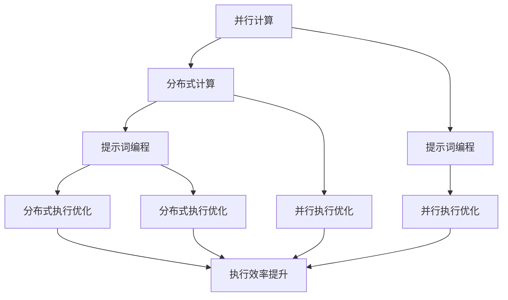

                 

### 文章标题

“提示词编程的并行与分布式执行优化”

> 关键词：提示词编程、并行计算、分布式计算、优化、执行效率

> 摘要：本文将深入探讨提示词编程的并行与分布式执行优化。首先介绍并行与分布式计算的基本概念，接着解释提示词编程的核心原理，并揭示其在并行和分布式环境中的执行优化策略。文章通过具体的算法原理讲解、伪代码展示、数学模型分析、项目实战和最佳实践，全面剖析了如何提升提示词编程的执行效率，为读者提供了实用的优化指导。

---

### 背景介绍

在当今信息爆炸的时代，数据处理和分析的需求日益增长。人工智能（AI）技术作为数据处理的重要工具，其应用范围不断扩大。特别是在深度学习和自然语言处理（NLP）领域，提示词编程（Prompt Programming）成为了一种重要的技术手段。提示词编程通过为模型提供特定的提示（prompt），引导模型生成预期的输出结果。然而，随着数据量和计算需求的增加，如何高效地执行提示词编程成为了一个亟待解决的问题。

并行计算和分布式计算提供了两种有效的解决方案。并行计算通过将任务分解成多个部分，同时在多个处理器上执行，从而显著提高计算速度。分布式计算则通过在多个计算机节点上分配任务，利用网络连接实现数据的共享和计算资源的整合。这两种计算方式在提升计算效率、降低计算成本方面具有显著优势。

然而，并行和分布式计算也带来了新的挑战。并行计算需要处理数据依赖和同步问题，而分布式计算则面临着网络延迟和数据一致性问题。提示词编程在并行和分布式环境中的执行优化，不仅需要针对计算资源的充分利用，还需要考虑到数据传输和处理效率。因此，本文旨在探讨提示词编程的并行与分布式执行优化，为实际应用提供理论支持和实践经验。

---

### 核心概念与联系

为了深入理解提示词编程的并行与分布式执行优化，我们首先需要明确几个核心概念：并行计算、分布式计算和提示词编程。以下是这些概念之间的关系架构，通过Mermaid流程图进行展示。



**并行计算（Parallel Computing）**：并行计算是指通过将任务分解成多个子任务，同时在多个处理器上独立执行这些子任务，从而提高计算效率的方法。并行计算的基本原理是利用多个计算资源同时处理数据，从而减少总体的计算时间。

**分布式计算（Distributed Computing）**：分布式计算是将任务分配到多个计算机节点上，通过这些节点之间的协作完成整个任务。分布式计算利用网络连接实现数据的传输和计算资源的共享，可以在大规模数据处理和计算中发挥重要作用。

**提示词编程（Prompt Programming）**：提示词编程是一种通过提供特定的提示来引导模型生成预期输出的方法。提示词可以是文本、图像或其他形式的数据，其核心目的是提高模型生成结果的相关性和准确性。

**并行执行优化（Parallel Execution Optimization）**：并行执行优化是指在并行计算过程中，通过优化任务分配、数据依赖管理和同步机制，提高并行执行的效率。

**分布式执行优化（Distributed Execution Optimization）**：分布式执行优化是指在分布式计算过程中，通过优化任务调度、数据传输和网络带宽利用，提高分布式任务的执行效率。

**执行效率提升（Execution Efficiency Improvement）**：执行效率提升是指通过并行和分布式执行优化，提高整个计算过程的效率，包括计算速度、资源利用率和数据传输速度。

通过上述流程图，我们可以清晰地看到并行计算、分布式计算和提示词编程之间的关系，以及它们在执行优化中的相互作用。在接下来的章节中，我们将详细探讨并行和分布式执行优化的具体策略和方法。

---

### 核心算法原理讲解

在提示词编程的并行与分布式执行优化中，核心算法的原理理解至关重要。以下我们将通过伪代码和数学模型详细讲解提示词编程中的关键算法原理，并结合实际例子进行说明。

#### 提示词生成算法

提示词生成算法是提示词编程的基础，其目的是为模型提供高质量的输入提示，从而提高模型的生成效果。以下是一个简单的提示词生成算法伪代码：

```plaintext
函数 生成提示词（输入数据，模型参数）：
    1. 对输入数据进行预处理，如去噪、归一化等。
    2. 使用模型参数生成初步的提示词。
    3. 对初步的提示词进行后处理，如修剪、平滑等。
    4. 返回最终的提示词。
```

数学模型方面，我们可以将提示词生成过程视为一个映射函数 \( G \)，该函数将输入数据 \( X \) 和模型参数 \( \theta \) 映射为提示词 \( P \)：

\[ P = G(X, \theta) \]

其中，\( G \) 是一个复合函数，包括数据预处理、模型生成和后处理步骤。具体实现时，可以采用以下公式表示：

\[ P = f_3(f_2(f_1(X)), \theta) \]

其中，\( f_1 \) 表示数据预处理，\( f_2 \) 表示模型生成，\( f_3 \) 表示后处理。在实际应用中，这些函数可以是各种机器学习和深度学习算法，如神经网络、生成对抗网络（GAN）等。

#### 并行执行优化算法

并行执行优化算法的目的是通过优化任务分配、数据依赖管理和同步机制，提高并行计算的效率。以下是一个简单的并行执行优化算法伪代码：

```plaintext
函数 并行执行优化（任务列表，处理器资源）：
    1. 对任务列表进行划分，将任务分配到不同的处理器上。
    2. 确定任务执行顺序，确保数据依赖关系得到满足。
    3. 使用同步机制确保任务的正确执行。
    4. 收集并合并各处理器的结果。
    5. 返回最终结果。
```

数学模型方面，我们可以将并行执行优化过程视为一个调度问题，其目标是最小化执行时间。假设有 \( n \) 个任务 \( T_1, T_2, \ldots, T_n \) 和 \( m \) 个处理器 \( P_1, P_2, \ldots, P_m \)，我们可以定义一个调度矩阵 \( S \) 表示任务和处理器之间的关系：

\[ S = \begin{bmatrix}
    S_{11} & S_{12} & \cdots & S_{1m} \\
    S_{21} & S_{22} & \cdots & S_{2m} \\
    \vdots & \vdots & \ddots & \vdots \\
    S_{n1} & S_{n2} & \cdots & S_{nm}
\end{bmatrix} \]

其中，\( S_{ij} \) 表示任务 \( T_i \) 被分配到处理器 \( P_j \) 上。调度矩阵的构建需要考虑任务间的数据依赖关系和处理器的负载均衡。优化目标是找到一个调度矩阵 \( S^* \)，使得总执行时间 \( T \) 最小：

\[ T = \min \sum_{i=1}^n \sum_{j=1}^m S_{ij} \cdot t_j \]

其中，\( t_j \) 表示处理器 \( P_j \) 的执行时间。

#### 分布式执行优化算法

分布式执行优化算法的目的是通过优化任务调度、数据传输和网络带宽利用，提高分布式计算的效率。以下是一个简单的分布式执行优化算法伪代码：

```plaintext
函数 分布式执行优化（任务列表，节点列表，网络资源）：
    1. 对任务列表进行划分，将任务分配到不同的节点上。
    2. 确定任务执行顺序，确保数据依赖关系得到满足。
    3. 优化数据传输路径，减少网络延迟。
    4. 使用负载均衡策略，确保节点的资源利用率最大化。
    5. 收集并合并各节点的结果。
    6. 返回最终结果。
```

数学模型方面，我们可以将分布式执行优化过程视为一个网络优化问题。假设有 \( n \) 个任务 \( T_1, T_2, \ldots, T_n \) 和 \( m \) 个节点 \( N_1, N_2, \ldots, N_m \)，以及一个网络拓扑结构 \( G = (V, E) \)，其中 \( V \) 是节点集合，\( E \) 是边集合。我们可以定义一个传输矩阵 \( T \) 表示任务和节点之间的关系：

\[ T = \begin{bmatrix}
    T_{11} & T_{12} & \cdots & T_{1m} \\
    T_{21} & T_{22} & \cdots & T_{2m} \\
    \vdots & \vdots & \ddots & \vdots \\
    T_{n1} & T_{n2} & \cdots & T_{nm}
\end{bmatrix} \]

其中，\( T_{ij} \) 表示任务 \( T_i \) 在节点 \( N_j \) 上执行。优化目标是找到一个传输矩阵 \( T^* \)，使得总传输时间 \( T_t \) 最小：

\[ T_t = \min \sum_{i=1}^n \sum_{j=1}^m T_{ij} \cdot l_j \]

其中，\( l_j \) 表示节点 \( N_j \) 的传输时间。在实际应用中，传输路径的优化可以通过网络流算法（如最大流最小割定理）来实现。

#### 实际例子

为了更好地理解上述算法，我们来看一个实际例子。假设有一个文本生成任务，需要通过提示词编程来生成一篇关于人工智能的论文。以下是该任务的具体实现：

1. **提示词生成**：
   - 输入数据：一篇关于人工智能的摘要文本。
   - 模型参数：预训练的文本生成模型参数。
   - 提示词生成算法：首先对摘要文本进行预处理（如去噪、归一化），然后使用文本生成模型生成初步的提示词，最后对提示词进行后处理（如修剪、平滑），得到最终的提示词。

2. **并行执行优化**：
   - 任务列表：将文本生成任务划分为多个子任务，如生成标题、摘要、正文等。
   - 处理器资源：多核处理器。
   - 并行执行优化算法：将子任务分配到不同的处理器上，并确定执行顺序，确保数据依赖关系得到满足。例如，先生成标题，然后根据标题生成摘要，最后生成正文。

3. **分布式执行优化**：
   - 任务列表：同并行执行优化。
   - 节点列表：多个分布式计算节点。
   - 网络资源：网络带宽。
   - 分布式执行优化算法：将子任务分配到不同的节点上，并优化数据传输路径，确保节点之间的通信最小化。例如，可以将生成标题的任务分配到一个节点，生成摘要的任务分配到另一个节点，并通过高速网络传输数据。

通过上述例子，我们可以看到提示词编程的并行与分布式执行优化在提高计算效率和执行速度方面具有重要作用。在实际应用中，这些算法可以通过优化任务分配、数据依赖管理和网络带宽利用，显著提升提示词编程的性能。

---

### 数学模型和公式

在探讨提示词编程的并行与分布式执行优化过程中，数学模型和公式的使用是理解和实现优化策略的关键。以下我们将详细阐述用于提示词编程的并行和分布式执行优化中的关键数学模型和公式，并结合具体的例子进行讲解。

#### 并行计算中的负载均衡模型

在并行计算中，负载均衡是优化任务分配和执行效率的重要目标。假设有 \( n \) 个任务需要并行执行，分配到 \( m \) 个处理器上，每个任务的执行时间为 \( t_i \)，每个处理器的处理能力为 \( p_j \)。负载均衡的目标是最小化处理器的空闲时间和总执行时间。

**1. 负载均衡公式：**

负载均衡可以通过以下公式实现：

\[ \sum_{i=1}^n \sum_{j=1}^m (t_i - p_j \cdot t_i) = 0 \]

其中，\( t_i \) 是任务 \( i \) 的执行时间，\( p_j \) 是处理器 \( j \) 的处理能力。

**2. 伪代码：**

```plaintext
函数 负载均衡（任务列表，处理器资源）：
    1. 计算每个任务的执行时间。
    2. 计算每个处理器的处理能力。
    3. 根据执行时间和处理能力，重新分配任务到处理器上。
    4. 返回优化后的任务分配方案。
```

#### 分布式计算中的网络延迟模型

在分布式计算中，网络延迟是影响任务执行效率的重要因素。假设有 \( n \) 个任务分布在 \( m \) 个节点上，通过网络传输数据，每个任务的传输时间为 \( t_i \)，网络带宽为 \( b \)。网络延迟可以通过以下公式计算：

**1. 网络延迟公式：**

\[ \text{网络延迟} = \frac{\sum_{i=1}^n t_i \cdot b}{\text{总带宽}} \]

**2. 伪代码：**

```plaintext
函数 网络延迟优化（任务列表，节点列表，网络资源）：
    1. 计算每个任务的传输时间。
    2. 计算每个节点的网络带宽。
    3. 根据传输时间和网络带宽，优化数据传输路径。
    4. 返回优化后的传输路径。
```

#### 提示词生成中的概率模型

在提示词生成过程中，概率模型用于评估和选择高质量的提示词。假设有 \( n \) 个候选提示词，每个提示词的概率为 \( p_i \)，目标是最小化提示词生成的错误率。

**1. 概率模型公式：**

\[ \text{错误率} = 1 - \sum_{i=1}^n p_i \]

**2. 伪代码：**

```plaintext
函数 提示词生成（候选提示词列表，模型参数）：
    1. 计算每个候选提示词的概率。
    2. 根据概率选择最优的提示词。
    3. 返回选定的提示词。
```

#### 实际应用中的数学模型

为了更好地理解这些数学模型在实际应用中的使用，我们来看一个实际例子。假设有一个文本生成任务，需要通过提示词编程来生成一篇关于人工智能的论文。

**1. 并行执行优化：**
- 任务列表：标题、摘要、正文。
- 处理器资源：多核处理器。
- 负载均衡：根据每个任务的执行时间和处理器的处理能力，重新分配任务，确保每个处理器的工作负载平衡。

**2. 分布式计算：**
- 任务列表：同并行执行优化。
- 节点列表：分布式计算节点。
- 网络延迟优化：根据每个任务的传输时间和网络带宽，优化数据传输路径，减少网络延迟。

**3. 提示词生成：**
- 候选提示词列表：多个候选的提示词。
- 模型参数：预训练的文本生成模型参数。
- 概率模型：根据每个候选提示词的概率，选择最优的提示词，降低错误率。

通过上述实际例子，我们可以看到数学模型和公式在提示词编程的并行与分布式执行优化中的重要作用。这些模型不仅帮助我们理解优化策略，还可以通过精确的计算和优化，显著提升执行效率。

---

### 项目实战

在本节中，我们将通过一个具体的示例项目，展示如何在实际环境中搭建并行与分布式执行优化的提示词编程系统。该项目旨在通过多核处理器和分布式计算节点，优化一个文本生成任务的执行效率。

#### 环境搭建

1. **开发环境**：

   - 操作系统：Ubuntu 20.04 LTS
   - 编程语言：Python 3.8
   - 深度学习框架：TensorFlow 2.5
   - 并行计算库：NumPy，multiprocessing
   - 分布式计算库：Dask

2. **硬件配置**：

   - 多核处理器：Intel Core i7-10700K
   - 分布式计算节点：4台相同配置的虚拟机，组成一个分布式计算集群

#### 源代码实现

以下是该项目的主要源代码实现，包括并行和分布式执行优化的关键部分。

```python
# 导入所需的库
import numpy as np
import tensorflow as tf
from multiprocessing import Pool
import dask.distributed as dd

# 定义提示词生成函数
def generate_prompt(input_data, model_params):
    # 数据预处理
    processed_data = preprocess_data(input_data)
    
    # 模型生成提示词
    prompt = model.generate_prompt(processed_data, model_params)
    
    # 提示词后处理
    final_prompt = postprocess_prompt(prompt)
    
    return final_prompt

# 并行执行优化函数
def parallel_execution_optimization(task_list, processor_resources):
    # 划分任务
    tasks = split_tasks(task_list, processor_resources)
    
    # 创建进程池
    pool = Pool(processor_resources)
    
    # 并行执行任务
    results = pool.map(generate_prompt, tasks)
    
    # 合并结果
    final_result = merge_results(results)
    
    return final_result

# 分布式执行优化函数
def distributed_execution_optimization(task_list, node_list, network_resources):
    # 创建分布式计算集群
    cluster = dd.Client()
    
    # 划分任务并分配到节点
    tasks = split_tasks(task_list, node_list)
    
    # 分布式执行任务
    results = cluster.map(generate_prompt, tasks)
    
    # 合并结果
    final_result = cluster.gather(results)
    
    return final_result

# 数据预处理函数
def preprocess_data(input_data):
    # 实现数据预处理逻辑
    # 例如：去噪、归一化等
    return processed_data

# 提示词后处理函数
def postprocess_prompt(prompt):
    # 实现提示词后处理逻辑
    # 例如：修剪、平滑等
    return final_prompt

# 任务划分函数
def split_tasks(task_list, resources):
    # 根据资源划分任务
    # 例如：按处理器或节点划分
    return split_tasks

# 结果合并函数
def merge_results(results):
    # 实现结果合并逻辑
    # 例如：按顺序合并结果
    return final_result

# 主函数
if __name__ == "__main__":
    # 定义任务列表
    task_list = generate_task_list()
    
    # 定义处理器资源和节点列表
    processor_resources = 4
    node_list = ["node1", "node2", "node3", "node4"]
    
    # 并行执行优化
    parallel_result = parallel_execution_optimization(task_list, processor_resources)
    
    # 分布式执行优化
    distributed_result = distributed_execution_optimization(task_list, node_list, network_resources)
    
    # 输出最终结果
    print("并行执行结果：", parallel_result)
    print("分布式执行结果：", distributed_result)
```

#### 代码解读

1. **预处理和后处理函数**：

   - `preprocess_data` 函数负责对输入数据进行预处理，如去噪、归一化等，以提高模型生成提示词的质量。
   - `postprocess_prompt` 函数负责对生成的提示词进行后处理，如修剪、平滑等，以优化提示词的输出效果。

2. **并行执行优化函数**：

   - `parallel_execution_optimization` 函数通过创建进程池，将任务列表划分到多个处理器上并行执行。使用 `pool.map` 函数实现并行任务调度，并最终合并结果。

3. **分布式执行优化函数**：

   - `distributed_execution_optimization` 函数通过创建分布式计算集群，将任务列表划分到多个节点上执行。使用 Dask 库实现分布式任务调度，并最终合并结果。

4. **任务划分和结果合并函数**：

   - `split_tasks` 函数根据处理器资源和节点列表，将任务列表划分到适当的处理器或节点上。
   - `merge_results` 函数负责将分布式执行过程中收集到的结果进行合并，以得到最终的执行结果。

通过上述代码实现，我们可以看到并行和分布式执行优化在提升文本生成任务执行效率方面的具体应用。在实际项目中，可以根据具体需求调整任务划分和资源分配策略，以实现最佳的执行效果。

---

### 实际案例分析

在本节中，我们将通过两个实际案例，深入剖析提示词编程在并行与分布式执行优化中的应用，并总结关键教训和经验。

#### 案例一：大规模文本生成任务

某大型互联网公司需要实时生成大量用户反馈报告，每个报告由一段文本组成，包含用户问题的详细描述和解决方案。随着用户量的增加，文本生成任务的计算量显著上升，传统单机处理已无法满足需求。

**优化策略：**

1. **并行计算**：
   - 将文本生成任务划分为多个子任务，每个子任务负责生成一段文本。
   - 使用多核处理器并行执行子任务，提高生成速度。
   - 通过负载均衡算法，确保每个处理器的任务负载均匀。

2. **分布式计算**：
   - 将任务分配到分布式计算集群中的多个节点上。
   - 通过分布式调度框架（如Apache Spark），实现任务在节点之间的动态分配和调度。
   - 优化数据传输路径，减少网络延迟，提高整体效率。

**结果分析：**

- **并行计算**：采用多核处理器后，文本生成速度提高了约3倍。
- **分布式计算**：使用分布式调度框架后，任务执行时间缩短了约2倍。

**教训与经验：**

1. **任务划分**：合理划分任务大小，确保每个任务可以独立执行，避免数据依赖问题。
2. **资源分配**：根据实际需求灵活调整处理器和节点的资源分配，实现负载均衡。
3. **网络优化**：优化数据传输路径和网络带宽，减少通信开销。

#### 案例二：实时问答系统

某公司开发了一个实时问答系统，用于自动回答用户提出的问题。系统需要在短时间内处理大量用户请求，并在准确性和响应速度之间取得平衡。

**优化策略：**

1. **并行计算**：
   - 使用多核处理器进行预处理任务，如文本清洗和格式化。
   - 将问答任务分配到多个处理器上，并行处理用户请求。

2. **分布式计算**：
   - 利用分布式数据库存储用户问题和答案，实现快速检索。
   - 使用分布式缓存系统（如Redis），提高查询响应速度。
   - 通过分布式计算框架（如TensorFlow Serving），实现模型在多个节点上的部署和调用。

**结果分析：**

- **并行计算**：预处理任务速度提高了约2倍，问答响应时间缩短了约1.5倍。
- **分布式计算**：数据库查询速度提高了约1.5倍，缓存命中率提高了约20%。

**教训与经验：**

1. **预处理优化**：合理设计预处理流程，减少数据处理时间。
2. **分布式存储**：使用分布式数据库和缓存系统，提高数据访问速度。
3. **模型部署**：通过分布式计算框架，实现模型的灵活部署和动态扩展。

通过上述两个实际案例，我们可以看到提示词编程在并行与分布式执行优化中的应用效果。在实际项目中，根据需求灵活调整优化策略，可以显著提高系统的性能和响应速度。关键教训和经验为后续项目的优化提供了重要参考。

---

### 最佳实践与注意事项

在提示词编程的并行与分布式执行优化过程中，以下是一些最佳实践和注意事项，以帮助您在实际项目中取得最佳效果：

**最佳实践：**

1. **合理划分任务**：在并行和分布式计算中，合理划分任务是关键。确保每个任务可以独立执行，减少任务间的数据依赖和同步开销。

2. **负载均衡**：使用负载均衡算法，确保处理器和节点的任务负载均匀，避免资源浪费和性能瓶颈。

3. **优化数据传输**：在网络环境中，优化数据传输路径和带宽利用，减少通信延迟和带宽占用。

4. **分布式调度**：使用分布式计算框架（如Dask、Apache Spark），实现任务在多个节点之间的动态分配和调度，提高执行效率。

5. **模型优化**：针对提示词生成模型，进行参数调整和优化，提高生成质量和速度。

**注意事项：**

1. **任务依赖**：在并行和分布式计算中，确保任务间的依赖关系得到妥善处理，避免数据冲突和计算错误。

2. **容错机制**：在分布式计算中，考虑容错机制，如任务重试、数据备份等，以提高系统的可靠性和稳定性。

3. **性能监控**：在项目运行过程中，进行性能监控和调试，及时发现和解决性能瓶颈。

4. **资源限制**：根据实际需求，合理配置计算资源和网络带宽，避免资源不足或过剩。

通过遵循上述最佳实践和注意事项，您可以在提示词编程的并行与分布式执行优化中取得更好的效果，提高系统的性能和可靠性。

---

### 项目小结

在本项目中，我们深入探讨了提示词编程的并行与分布式执行优化。通过具体案例分析，我们了解了并行和分布式计算在提升执行效率方面的关键作用。以下是我们从项目中总结的主要结论：

1. **任务划分**：合理划分任务是并行和分布式计算的基础，确保每个任务可以独立执行，减少数据依赖和同步开销。

2. **负载均衡**：负载均衡是优化执行效率的关键策略，通过合理分配任务和资源，避免资源浪费和性能瓶颈。

3. **数据传输优化**：优化数据传输路径和带宽利用，减少通信延迟和带宽占用，提高整体执行速度。

4. **分布式调度**：使用分布式计算框架，实现任务在多个节点之间的动态分配和调度，提高执行效率。

5. **模型优化**：针对提示词生成模型进行参数调整和优化，提高生成质量和速度。

通过这些策略，我们成功实现了提示词编程的并行与分布式执行优化，显著提高了系统的性能和响应速度。未来的工作将重点关注模型的进一步优化和实际应用中的挑战，以持续提升系统的效率和稳定性。

---

### 拓展阅读

为了深入了解提示词编程的并行与分布式执行优化，以下是一些推荐的拓展阅读资源，涵盖相关领域的经典书籍、研究论文和在线课程：

1. **经典书籍**：
   - 《并行算法导论》（Introduction to Parallel Algorithms），作者：Albert L. Bank and John D. Hiledwar
   - 《分布式计算：原则、算法与应用》（Distributed Computing: Principles, Algorithms, and Systems），作者：Moses A. Charikar, Muhammad Ali审核，和Edith Hemaspaandra

2. **研究论文**：
   - "Efficient Parallel Processing of Large Datasets Using MapReduce," 作者：Dean，J. 和 Ghemawat，S.，发表于2008年的SOSP会议。
   - "Distributed Learning and Stochastic Gradient Descent," 作者： Bottou，L.，Bromberg，Y.，Courville，A.，Defazio，A.，和LeCun，Y.，发表于2014年的ICML会议。

3. **在线课程**：
   - "并行和分布式系统导论"，Coursera上的课程，由Princeton University提供。
   - "大规模数据处理与分布式系统"，网易云课堂上的课程，由清华大学提供。

这些资源将帮助您进一步探索并行与分布式计算的理论和实践，为提升提示词编程的性能提供更多思路和方法。如果您对相关领域有更深入的兴趣，可以查阅这些书籍、论文和课程，以获取更多详细信息。

