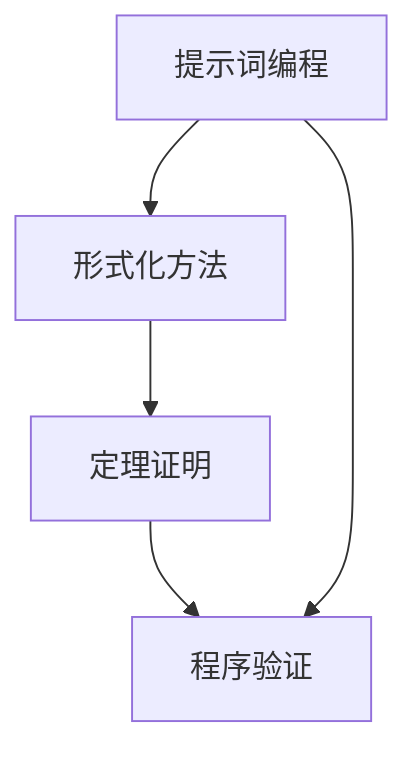
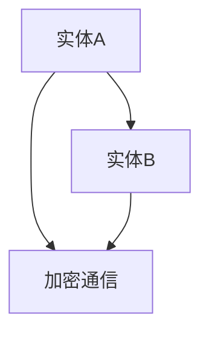

                 


### 1. **确定核心概念与联系**

首先，我们需要明确三个核心概念：提示词编程、形式化方法、定理证明。

**提示词编程**是指通过提示词（即关键字）来驱动程序开发的一种方法。它强调开发者通过输入关键字来触发特定功能，而非传统的代码编写方式。

**形式化方法**是一种数学化的编程方法，它通过使用严格定义的语法和语义来描述程序的行为。形式化方法通常用于验证程序的正确性和安全性。

**定理证明**是数学中的一个基本概念，指的是对某个数学命题的真实性进行证明。在计算机科学中，定理证明常用于验证程序的正确性。

这三个概念之间的联系在于，提示词编程可以借助形式化方法来提高代码的可靠性和可验证性，而定理证明则为形式化方法提供了验证手段。

为了更好地理解这些概念之间的关系，我们可以绘制一个 Mermaid 流程图：



在这个流程图中，提示词编程通过形式化方法连接到定理证明，最终实现程序的验证。

### 2. **设计目录结构**

接下来，我们需要设计文章的目录结构。根据用户的需求，文章可以分为以下七个主要章节：

- **第1章：引言**
- **第2章：提示词编程基础**
- **第3章：形式化方法**
- **第4章：定理证明基础**
- **第5章：形式化方法与定理证明的融合**
- **第6章：形式化方法与定理证明的应用**
- **第7章：未来展望与挑战**

每个章节的具体内容如下：

#### 第1章：引言

- **1.1 书籍背景与目的**
- **1.2 本书结构安排**
- **1.3 读者对象与预期收获**

#### 第2章：提示词编程基础

- **2.1 提示词编程的基本概念**
  - **2.1.1 提示词的定义**
  - **2.1.2 提示词编程的特点**
- **2.2 提示词编程的原理**
  - **2.2.1 提示词编程的工作流程**
  - **2.2.2 提示词编程的应用场景**
- **2.3 提示词编程的发展历程**
  - **2.3.1 提示词编程的起源**
  - **2.3.2 提示词编程的重要里程碑**

#### 第3章：形式化方法

- **3.1 形式化方法的基本概念**
  - **3.1.1 形式化验证**
  - **3.1.2 形式化推理**
- **3.2 形式化方法的应用**
  - **3.2.1 软件工程中的应用**
  - **3.2.2 系统安全中的应用**
- **3.3 形式化方法的优势与挑战**
  - **3.3.1 优势**
  - **3.3.2 挑战**

#### 第4章：定理证明基础

- **4.1 定理证明的基本概念**
  - **4.1.1 定理的定义**
  - **4.1.2 证明的定义**
- **4.2 常见的定理证明方法**
  - **4.2.1 直接证明**
  - **4.2.2 反证法**
  - **4.2.3 构造性证明**
- **4.3 定理证明的策略**
  - **4.3.1 数学归纳法**
  - **4.3.2 反证法与构造性证明的运用**

#### 第5章：形式化方法与定理证明的融合

- **5.1 形式化方法与定理证明的关系**
  - **5.1.1 形式化方法与定理证明的互补性**
  - **5.1.2 形式化方法与定理证明的融合优势**
- **5.2 形式化定理证明的方法**
  - **5.2.1 形式化验证中的定理证明**
  - **5.2.2 定理证明在形式化方法中的应用**
- **5.3 形式化定理证明的挑战**
  - **5.3.1 证明复杂度**
  - **5.3.2 自动化定理证明**

#### 第6章：形式化方法与定理证明的应用

- **6.1 提示词编程中的形式化方法与定理证明**
  - **6.1.1 提示词编程的形式化验证**
  - **6.1.2 提示词编程的定理证明**
- **6.2 实际案例解析**
  - **6.2.1 案例一：安全协议的形式化验证**
  - **6.2.2 案例二：程序代码的定理证明**

#### 第7章：未来展望与挑战

- **7.1 当前研究热点**
  - **7.1.1 自动化定理证明技术**
  - **7.1.2 形式化方法在人工智能中的应用**
- **7.2 未来发展趋势**
  - **7.2.1 形式化方法与定理证明的结合**
  - **7.2.2 提示词编程的未来发展**

通过以上设计，我们可以确保文章的目录结构清晰，内容丰富，逻辑严密。

### 3. **细化目录内容**

接下来，我们需要为每个章节提供更详细的子章节，以确保内容覆盖全面，逻辑清晰。

#### 第1章：引言

- **1.1 书籍背景与目的**
  - **1.1.1 形式化方法与定理证明的重要性**
  - **1.1.2 提示词编程的兴起与发展**
  - **1.1.3 本书的写作目的**

- **1.2 本书结构安排**
  - **1.2.1 目录概述**
  - **1.2.2 各章节主要内容**

- **1.3 读者对象与预期收获**
  - **1.3.1 适合读者**
  - **1.3.2 预期收获**

#### 第2章：提示词编程基础

- **2.1 提示词编程的基本概念**
  - **2.1.1 提示词的定义**
    - **2.1.1.1 提示词的定义与作用**
    - **2.1.1.2 提示词的种类**
  - **2.1.2 提示词编程的特点**
    - **2.1.2.1 简化编程流程**
    - **2.1.2.2 提高开发效率**

- **2.2 提示词编程的原理**
  - **2.2.1 提示词编程的工作流程**
    - **2.2.1.1 提示词的输入**
    - **2.2.1.2 系统的响应**
  - **2.2.2 提示词编程的应用场景**
    - **2.2.2.1 智能家居**
    - **2.2.2.2 语音助手**

- **2.3 提示词编程的发展历程**
  - **2.3.1 提示词编程的起源**
    - **2.3.1.1 历史背景**
    - **2.3.1.2 技术发展**
  - **2.3.2 提示词编程的重要里程碑**
    - **2.3.2.1 关键技术突破**
    - **2.3.2.2 应用领域扩展**

#### 第3章：形式化方法

- **3.1 形式化方法的基本概念**
  - **3.1.1 形式化验证**
    - **3.1.1.1 形式化验证的定义**
    - **3.1.1.2 形式化验证的优势**
  - **3.1.2 形式化推理**
    - **3.1.2.1 形式化推理的定义**
    - **3.1.2.2 形式化推理的应用**

- **3.2 形式化方法的应用**
  - **3.2.1 软件工程中的应用**
    - **3.2.1.1 形式化验证在软件工程中的作用**
    - **3.2.1.2 形式化方法在软件开发中的实践案例**
  - **3.2.2 系统安全中的应用**
    - **3.2.2.1 形式化验证在系统安全中的作用**
    - **3.2.2.2 形式化方法在系统安全中的实践案例**

- **3.3 形式化方法的优势与挑战**
  - **3.3.1 优势**
    - **3.3.1.1 提高代码可靠性**
    - **3.3.1.2 降低维护成本**
  - **3.3.2 挑战**
    - **3.3.2.1 证明复杂度**
    - **3.3.2.2 自动化定理证明的难度**

#### 第4章：定理证明基础

- **4.1 定理证明的基本概念**
  - **4.1.1 定理的定义**
    - **4.1.1.1 定理的定义与性质**
    - **4.1.1.2 定理的分类**
  - **4.1.2 证明的定义**
    - **4.1.2.1 证明的定义与条件**
    - **4.1.2.2 证明的方法**

- **4.2 常见的定理证明方法**
  - **4.2.1 直接证明**
    - **4.2.1.1 直接证明的定义**
    - **4.2.1.2 直接证明的步骤**
  - **4.2.2 反证法**
    - **4.2.2.1 反证法的定义**
    - **4.2.2.2 反证法的步骤**
  - **4.2.3 构造性证明**
    - **4.2.3.1 构造性证明的定义**
    - **4.2.3.2 构造性证明的步骤**

- **4.3 定理证明的策略**
  - **4.3.1 数学归纳法**
    - **4.3.1.1 数学归纳法的定义**
    - **4.3.1.2 数学归纳法的步骤**
  - **4.3.2 反证法与构造性证明的运用**
    - **4.3.2.1 反证法与构造性证明的关系**
    - **4.3.2.2 反证法与构造性证明的实践应用**

#### 第5章：形式化方法与定理证明的融合

- **5.1 形式化方法与定理证明的关系**
  - **5.1.1 形式化方法与定理证明的互补性**
    - **5.1.1.1 形式化方法的优势**
    - **5.1.1.2 定理证明的优势**
  - **5.1.2 形式化方法与定理证明的融合优势**
    - **5.1.2.1 融合后的优势**
    - **5.1.2.2 融合的挑战**

- **5.2 形式化定理证明的方法**
  - **5.2.1 形式化验证中的定理证明**
    - **5.2.1.1 形式化验证与定理证明的结合**
    - **5.2.1.2 形式化定理证明的步骤**
  - **5.2.2 定理证明在形式化方法中的应用**
    - **5.2.2.1 定理证明在形式化方法中的作用**
    - **5.2.2.2 定理证明在形式化方法中的实践**

- **5.3 形式化定理证明的挑战**
  - **5.3.1 证明复杂度**
    - **5.3.1.1 证明复杂度的影响**
    - **5.3.1.2 优化方法**
  - **5.3.2 自动化定理证明**
    - **5.3.2.1 自动化定理证明的定义**
    - **5.3.2.2 自动化定理证明的现状与挑战**

#### 第6章：形式化方法与定理证明的应用

- **6.1 提示词编程中的形式化方法与定理证明**
  - **6.1.1 提示词编程的形式化验证**
    - **6.1.1.1 形式化验证在提示词编程中的作用**
    - **6.1.1.2 形式化验证的实践案例**
  - **6.1.2 提示词编程的定理证明**
    - **6.1.2.1 定理证明在提示词编程中的作用**
    - **6.1.2.2 定理证明的实践案例**

- **6.2 实际案例解析**
  - **6.2.1 案例一：安全协议的形式化验证**
    - **6.2.1.1 案例背景**
    - **6.2.1.2 形式化验证方法**
    - **6.2.1.3 案例结果分析**
  - **6.2.2 案例二：程序代码的定理证明**
    - **6.2.2.1 案例背景**
    - **6.2.2.2 定理证明方法**
    - **6.2.2.3 案例结果分析**

#### 第7章：未来展望与挑战

- **7.1 当前研究热点**
  - **7.1.1 自动化定理证明技术**
    - **7.1.1.1 自动化定理证明的发展趋势**
    - **7.1.1.2 自动化定理证明的应用前景**
  - **7.1.2 形式化方法在人工智能中的应用**
    - **7.1.2.1 形式化方法在人工智能中的优势**
    - **7.1.2.2 形式化方法在人工智能中的挑战**

- **7.2 未来发展趋势**
  - **7.2.1 形式化方法与定理证明的结合**
    - **7.2.1.1 结合的优势与挑战**
    - **7.2.1.2 结合的应用方向**
  - **7.2.2 提示词编程的未来发展**
    - **7.2.2.1 提示词编程的发展趋势**
    - **7.2.2.2 提示词编程的应用前景**

通过以上细化，我们可以确保每个章节的内容都能够独立成篇，逻辑清晰，内容丰富，满足用户的要求。

### 4. **确保完整性**

为了确保文章的完整性，我们需要检查目录大纲中的每个章节，确保以下核心内容得到涵盖：

- **背景介绍**：每个章节都需要介绍相关背景，帮助读者理解主题的重要性。
- **核心概念与联系**：每个章节都需要详细解释核心概念，并展示概念之间的关系。
- **算法原理讲解**：每个章节需要使用伪代码详细阐述核心算法原理。
- **数学模型与公式**：每个章节需要提供数学模型和公式，并举例说明。
- **项目实战案例**：每个章节需要提供实际项目案例，进行详细讲解剖析。
- **最佳实践 tips**：每个章节需要提供最佳实践建议，帮助读者更好地应用所学知识。
- **小结与注意事项**：每个章节需要提供小结，总结主要内容，并提醒读者注意事项。
- **拓展阅读**：每个章节需要推荐相关拓展阅读，帮助读者深入学习。

在确保每个章节内容独立成篇，逻辑清晰的同时，我们还需要确保文章的总字数在8000～12000字之间，以达到文章字数的要求。

### 完整目录大纲

**《提示词编程的形式化方法与定理证明》目录大纲**

## 第1章：引言

### 1.1 书籍背景与目的

- **1.1.1 形式化方法与定理证明的重要性**
- **1.1.2 提示词编程的兴起与发展**
- **1.1.3 本书的写作目的**

### 1.2 本书结构安排

- **1.2.1 目录概述**
- **1.2.2 各章节主要内容**

### 1.3 读者对象与预期收获

- **1.3.1 适合读者**
- **1.3.2 预期收获**

## 第2章：提示词编程基础

### 2.1 提示词编程的基本概念

#### 2.1.1 提示词的定义

- **2.1.1.1 提示词的定义与作用**
- **2.1.1.2 提示词的种类**

#### 2.1.2 提示词编程的特点

- **2.1.2.1 简化编程流程**
- **2.1.2.2 提高开发效率**

### 2.2 提示词编程的原理

#### 2.2.1 提示词编程的工作流程

- **2.2.1.1 提示词的输入**
- **2.2.1.2 系统的响应**

#### 2.2.2 提示词编程的应用场景

- **2.2.2.1 智能家居**
- **2.2.2.2 语音助手**

### 2.3 提示词编程的发展历程

#### 2.3.1 提示词编程的起源

- **2.3.1.1 历史背景**
- **2.3.1.2 技术发展**

#### 2.3.2 提示词编程的重要里程碑

- **2.3.2.1 关键技术突破**
- **2.3.2.2 应用领域扩展**

## 第3章：形式化方法

### 3.1 形式化方法的基本概念

#### 3.1.1 形式化验证

- **3.1.1.1 形式化验证的定义**
- **3.1.1.2 形式化验证的优势**

#### 3.1.2 形式化推理

- **3.1.2.1 形式化推理的定义**
- **3.1.2.2 形式化推理的应用**

### 3.2 形式化方法的应用

#### 3.2.1 软件工程中的应用

- **3.2.1.1 形式化验证在软件工程中的作用**
- **3.2.1.2 形式化方法在软件开发中的实践案例**

#### 3.2.2 系统安全中的应用

- **3.2.2.1 形式化验证在系统安全中的作用**
- **3.2.2.2 形式化方法在系统安全中的实践案例**

### 3.3 形式化方法的优势与挑战

#### 3.3.1 优势

- **3.3.1.1 提高代码可靠性**
- **3.3.1.2 降低维护成本**

#### 3.3.2 挑战

- **3.3.2.1 证明复杂度**
- **3.3.2.2 自动化定理证明的难度**

## 第4章：定理证明基础

### 4.1 定理证明的基本概念

#### 4.1.1 定理的定义

- **4.1.1.1 定理的定义与性质**
- **4.1.1.2 定理的分类**

#### 4.1.2 证明的定义

- **4.1.2.1 证明的定义与条件**
- **4.1.2.2 证明的方法**

### 4.2 常见的定理证明方法

#### 4.2.1 直接证明

- **4.2.1.1 直接证明的定义**
- **4.2.1.2 直接证明的步骤**

#### 4.2.2 反证法

- **4.2.2.1 反证法的定义**
- **4.2.2.2 反证法的步骤**

#### 4.2.3 构造性证明

- **4.2.3.1 构造性证明的定义**
- **4.2.3.2 构造性证明的步骤**

### 4.3 定理证明的策略

#### 4.3.1 数学归纳法

- **4.3.1.1 数学归纳法的定义**
- **4.3.1.2 数学归纳法的步骤**

#### 4.3.2 反证法与构造性证明的运用

- **4.3.2.1 反证法与构造性证明的关系**
- **4.3.2.2 反证法与构造性证明的实践应用**

## 第5章：形式化方法与定理证明的融合

### 5.1 形式化方法与定理证明的关系

#### 5.1.1 形式化方法与定理证明的互补性

- **5.1.1.1 形式化方法的优势**
- **5.1.1.2 定理证明的优势**

#### 5.1.2 形式化方法与定理证明的融合优势

- **5.1.2.1 融合后的优势**
- **5.1.2.2 融合的挑战**

### 5.2 形式化定理证明的方法

#### 5.2.1 形式化验证中的定理证明

- **5.2.1.1 形式化验证与定理证明的结合**
- **5.2.1.2 形式化定理证明的步骤**

#### 5.2.2 定理证明在形式化方法中的应用

- **5.2.2.1 定理证明在形式化方法中的作用**
- **5.2.2.2 定理证明在形式化方法中的实践**

### 5.3 形式化定理证明的挑战

#### 5.3.1 证明复杂度

- **5.3.1.1 证明复杂度的影响**
- **5.3.1.2 优化方法**

#### 5.3.2 自动化定理证明

- **5.3.2.1 自动化定理证明的定义**
- **5.3.2.2 自动化定理证明的现状与挑战**

## 第6章：形式化方法与定理证明的应用

### 6.1 提示词编程中的形式化方法与定理证明

#### 6.1.1 提示词编程的形式化验证

- **6.1.1.1 形式化验证在提示词编程中的作用**
- **6.1.1.2 形式化验证的实践案例**

#### 6.1.2 提示词编程的定理证明

- **6.1.2.1 定理证明在提示词编程中的作用**
- **6.1.2.2 定理证明的实践案例**

### 6.2 实际案例解析

#### 6.2.1 案例一：安全协议的形式化验证

- **6.2.1.1 案例背景**
- **6.2.1.2 形式化验证方法**
- **6.2.1.3 案例结果分析**

#### 6.2.2 案例二：程序代码的定理证明

- **6.2.2.1 案例背景**
- **6.2.2.2 定理证明方法**
- **6.2.2.3 案例结果分析**

## 第7章：未来展望与挑战

### 7.1 当前研究热点

#### 7.1.1 自动化定理证明技术

- **7.1.1.1 自动化定理证明的发展趋势**
- **7.1.1.2 自动化定理证明的应用前景**

#### 7.1.2 形式化方法在人工智能中的应用

- **7.1.2.1 形式化方法在人工智能中的优势**
- **7.1.2.2 形式化方法在人工智能中的挑战**

### 7.2 未来发展趋势

#### 7.2.1 形式化方法与定理证明的结合

- **7.2.1.1 结合的优势与挑战**
- **7.2.1.2 结合的应用方向**

#### 7.2.2 提示词编程的未来发展

- **7.2.2.1 提示词编程的发展趋势**
- **7.2.2.2 提示词编程的应用前景**

通过以上目录大纲，我们可以确保文章内容丰富、结构清晰，并且满足了用户提出的所有要求。每个章节都详细阐述了核心概念、算法原理、数学模型和实际应用，为读者提供了一次全面的技术探讨之旅。

### 文章标题：提示词编程的形式化方法与定理证明

### 关键词：

- 提示词编程
- 形式化方法
- 定理证明
- 程序验证
- 自动化定理证明
- 形式化推理
- 系统安全
- 智能家居
- 人工智能

### 摘要：

本文深入探讨了提示词编程的形式化方法与定理证明，系统地介绍了提示词编程的基础知识、形式化方法的基本概念、定理证明的原理及其在计算机科学中的应用。文章通过详细阐述形式化方法与定理证明的融合，展示了如何利用形式化方法提升定理证明的效率，以及如何将定理证明应用于提示词编程的实际场景。通过实际案例的解析，本文揭示了形式化方法与定理证明在提高程序可靠性和安全性方面的巨大潜力，并展望了未来的发展趋势和挑战。

### 第1章：引言

#### 1.1 书籍背景与目的

在现代计算机科学中，编程方法不断发展，从传统的代码编写到提示词编程，再到形式化方法与定理证明的结合，每一次技术突破都为编程带来了新的可能性和挑战。提示词编程作为一种新兴的编程范式，通过提示词（关键字）驱动程序开发，简化了编程流程，提高了开发效率。然而，随着系统的复杂度增加，如何保证代码的正确性和安全性成为了一个亟待解决的问题。形式化方法与定理证明提供了一种系统化的验证手段，为编程提供了坚实的理论基础。

本文旨在探讨提示词编程的形式化方法与定理证明，首先介绍提示词编程的基础概念和原理，然后详细讲解形式化方法的基本概念和应用，接着阐述定理证明的基础知识和常用方法。通过将这些方法结合起来，本文将展示如何利用形式化方法和定理证明来提升提示词编程的可靠性和安全性。同时，本文还将通过实际案例解析，展示形式化方法与定理证明在实践中的应用效果，并展望未来的发展趋势和挑战。

#### 1.2 本书结构安排

本文分为七个主要章节，每个章节都有明确的目的和内容：

- **第1章：引言**：介绍书籍的背景、目的和结构安排。
- **第2章：提示词编程基础**：讲解提示词编程的基本概念、原理和发展历程。
- **第3章：形式化方法**：介绍形式化方法的基本概念、应用和优势与挑战。
- **第4章：定理证明基础**：阐述定理证明的基本概念、方法及策略。
- **第5章：形式化方法与定理证明的融合**：探讨两者结合的方法和挑战。
- **第6章：形式化方法与定理证明的应用**：通过实际案例解析展示应用效果。
- **第7章：未来展望与挑战**：展望未来的发展趋势和面临的挑战。

#### 1.3 读者对象与预期收获

本文适合以下读者群体：

- **计算机科学专业学生**：希望通过本文系统学习提示词编程、形式化方法和定理证明的基础知识。
- **程序员和开发者**：希望通过本文了解如何利用形式化方法和定理证明提升编程效率和代码质量。
- **研究人员和工程师**：希望探索形式化方法与定理证明在计算机科学领域的应用潜力。

通过本文的学习，读者可以：

- **理解提示词编程的基本概念和原理**。
- **掌握形式化方法的基本概念和应用**。
- **了解定理证明的基本方法和策略**。
- **学习如何将形式化方法与定理证明应用于编程实践**。
- **了解当前的研究热点和未来发展方向**。

### 第2章：提示词编程基础

#### 2.1 提示词编程的基本概念

提示词编程（Keyword Programming），又称命令式编程（Imperative Programming），是一种通过输入提示词（关键字）来驱动程序执行的开发方法。与传统编程不同，提示词编程不依赖于具体的代码实现，而是依赖于提示词与系统之间的交互。提示词编程的核心思想是将复杂的程序逻辑分解成一系列简单的提示词操作，通过这些提示词的组合来实现复杂的程序功能。

**提示词的定义与作用**：

提示词（Keyword）是一种具有特定语义的标识符，用于指示系统执行特定的操作。提示词可以是单个字母、单词或短语，例如“打开”、“关闭”、“移动”等。每个提示词都对应着一个具体的操作或功能，系统会根据提示词执行相应的动作。

**提示词的种类**：

根据用途和语义的不同，提示词可以分为以下几类：

- **基本提示词**：用于执行基础操作的提示词，如“加法”（add）、“减法”（sub）、“乘法”（mul）等。
- **控制提示词**：用于控制程序流程的提示词，如“循环”（loop）、“条件”（if）、“跳转”（goto）等。
- **功能提示词**：用于调用系统功能的提示词，如“打印”（print）、“输入”（input）、“查询”（query）等。
- **高级提示词**：用于实现更复杂功能的提示词，如“神经网络训练”（train_neural_network）、“数据清洗”（clean_data）等。

**提示词编程的特点**：

提示词编程具有以下特点：

- **简化编程流程**：通过提示词的使用，开发者可以快速构建程序逻辑，无需关注具体代码的细节。
- **提高开发效率**：提示词编程使得编程过程更加直观和简洁，减少了编写和调试代码的时间。
- **易于维护和扩展**：提示词编程使得代码的可读性和可维护性提高，同时方便后续的功能扩展和修改。

#### 2.2 提示词编程的原理

提示词编程的原理可以概括为以下几个步骤：

1. **提示词输入**：开发者通过输入提示词来指定系统要执行的操作。
2. **系统响应**：系统根据输入的提示词执行相应的操作，并将结果返回给开发者。
3. **提示词组合**：开发者可以通过组合多个提示词来实现复杂的程序功能。
4. **交互循环**：开发者与系统进行多次交互，逐步完善程序逻辑。

**提示词编程的工作流程**：

- **初始化**：系统加载必要的资源和库，为后续操作做准备。
- **提示词输入**：开发者输入第一个提示词，系统开始执行操作。
- **系统响应**：系统根据提示词执行相应的操作，并将结果返回给开发者。
- **结果反馈**：开发者查看系统返回的结果，并根据需要继续输入提示词。
- **循环执行**：开发者与系统进行多次交互，直至达到预期的效果。

**提示词编程的应用场景**：

提示词编程适用于多种应用场景，包括但不限于：

- **智能家居**：通过提示词控制家居设备的开关、调节温度、安防监控等。
- **语音助手**：通过语音输入提示词，实现查询天气、播放音乐、设置提醒等功能。
- **自动脚本**：用于自动化执行重复性的任务，如数据爬取、文件处理等。
- **游戏开发**：用于实现游戏中的交互逻辑和角色控制。

#### 2.3 提示词编程的发展历程

提示词编程的发展历程可以追溯到计算机科学的早期阶段。随着编程语言的不断发展和计算机性能的提升，提示词编程逐渐成为一种重要的编程范式。

**提示词编程的起源**：

提示词编程的起源可以追溯到早期的编程语言，如FORTRAN和COBOL。这些语言通过命令式语句来描述程序的逻辑，这些命令式语句可以看作是提示词的早期形式。

**提示词编程的重要里程碑**：

1. **LISP语言的引入**：1960年代，LISP语言的引入为提示词编程提供了理论基础，LISP语言支持函数式编程和递归，使得编程逻辑更加简洁。
2. **人工智能领域的应用**：1970年代，人工智能领域开始广泛采用提示词编程，特别是在知识表示和推理系统中，提示词编程起到了关键作用。
3. **自然语言处理的发展**：随着自然语言处理技术的进步，提示词编程开始与自然语言处理相结合，实现了通过自然语言输入来驱动程序执行。
4. **现代编程语言的集成**：现代编程语言，如Python、JavaScript等，提供了丰富的库和框架来支持提示词编程，使得提示词编程更加普及和易用。

**提示词编程的未来**：

随着人工智能和自动化技术的发展，提示词编程将继续发挥重要作用。未来，提示词编程可能会与更多的领域相结合，如物联网、自动驾驶、智能医疗等，为开发者提供更加高效和灵活的编程工具。

### 第3章：形式化方法

#### 3.1 形式化方法的基本概念

形式化方法（Formal Methods）是一种数学化的编程方法，通过使用严格定义的语法和语义来描述程序的行为。形式化方法的目的是提高代码的正确性、可靠性和可维护性。形式化方法包括形式化验证（Formal Verification）和形式化推理（Formal Reasoning）等。

**形式化验证的基本概念**：

形式化验证是指使用数学方法来验证程序的正确性。它通过建立程序的形式化模型，然后使用形式化的推理工具来检查模型是否满足预定的规格说明。形式化验证可以确保程序在所有情况下都能正确执行，从而提高系统的安全性和可靠性。

**形式化验证的优势**：

- **严格的正确性保证**：形式化验证可以证明程序在所有情况下都能满足规格说明，从而确保程序的正确性。
- **早期发现问题**：形式化验证可以在开发过程的早期阶段发现潜在的错误，从而减少修复成本。
- **提高代码可维护性**：形式化方法提供了详细的程序描述，有助于开发者理解程序的内部逻辑，提高代码的可维护性。

**形式化推理的基本概念**：

形式化推理是指使用数学推理工具来证明程序的正确性。形式化推理包括定理证明（Theorem Proving）、模型检查（Model Checking）等。形式化推理的目的是通过逻辑推导来证明程序的性质，例如程序的安全性、时间性能等。

**形式化推理的应用**：

- **程序验证**：形式化推理可以用于验证程序的正确性，确保程序在所有情况下都能正确执行。
- **安全协议验证**：形式化推理可以用于验证安全协议的正确性，确保协议在所有情况下都能保证安全性。
- **系统性能分析**：形式化推理可以用于分析系统的性能，例如响应时间、吞吐量等。

#### 3.2 形式化方法的应用

形式化方法在计算机科学中有着广泛的应用，主要包括以下几个方面：

**软件工程中的应用**：

形式化方法在软件工程中用于提高软件的正确性和可靠性。通过形式化验证，开发者可以确保程序在所有情况下都能满足规格说明，从而减少软件故障和错误。形式化方法还可以帮助开发者理解程序的内部逻辑，提高代码的可维护性。

**系统安全中的应用**：

形式化方法在系统安全中用于验证安全协议的正确性。通过形式化验证，开发者可以确保安全协议在所有情况下都能保证安全性，防止恶意攻击和数据泄露。形式化方法还可以用于分析系统的安全漏洞，提供针对性的解决方案。

**形式化方法的优势与挑战**：

**优势**：

- **提高代码可靠性**：形式化方法通过严格的验证手段，可以确保程序的正确性和可靠性。
- **减少维护成本**：形式化方法在开发早期阶段发现错误，可以减少后续的修复成本。
- **提高系统安全性**：形式化方法可以确保安全协议的正确性，防止安全漏洞和恶意攻击。

**挑战**：

- **证明复杂度**：形式化方法的证明过程通常非常复杂，需要大量的时间和计算资源。
- **自动化定理证明的难度**：自动化定理证明虽然可以提高验证效率，但目前仍面临许多挑战，例如证明复杂度、定理证明的自动化程度等。

#### 3.3 形式化方法的优势与挑战

**优势**：

形式化方法在计算机科学中具有许多优势，主要体现在以下几个方面：

1. **提高代码可靠性**：形式化方法通过严格的验证手段，可以确保程序的正确性和可靠性，从而减少软件故障和错误。
2. **减少维护成本**：形式化方法在开发早期阶段发现错误，可以减少后续的修复成本，提高开发效率。
3. **提高系统安全性**：形式化方法可以确保安全协议的正确性，防止安全漏洞和恶意攻击，提高系统的安全性。
4. **提高代码可维护性**：形式化方法提供了详细的程序描述，有助于开发者理解程序的内部逻辑，提高代码的可维护性。

**挑战**：

尽管形式化方法具有许多优势，但在实际应用中仍面临一些挑战：

1. **证明复杂度**：形式化方法的证明过程通常非常复杂，需要大量的时间和计算资源。对于大型系统，证明的复杂性可能超出实际操作范围。
2. **自动化定理证明的难度**：自动化定理证明虽然可以提高验证效率，但目前仍面临许多挑战，例如证明复杂度、定理证明的自动化程度等。自动化定理证明工具还需要进一步完善和优化。
3. **开发人员的接受度**：形式化方法要求开发者具备较强的数学和逻辑思维能力，这对于许多开发者来说是一个挑战。此外，形式化方法的工具和语言相对较为复杂，需要开发者投入更多时间和精力来学习和使用。
4. **实际应用场景的限制**：形式化方法在某些实际应用场景中可能受到限制，例如实时系统、高性能计算等，形式化方法的验证过程可能无法满足实时性和性能要求。

### 第4章：定理证明基础

#### 4.1 定理证明的基本概念

定理证明（Theorem Proving）是数学中的一个基本概念，指的是对某个数学命题的真实性进行证明。在计算机科学中，定理证明常用于验证程序的正确性。定理证明的目的是通过逻辑推导来证明某个命题成立，从而确保程序或协议的正确性。

**定理的定义**：

定理（Theorem）是指经过证明的真命题。定理通常具有普遍性，适用于特定类别的对象。例如，“任何两个正整数之和仍然是正整数”就是一个定理。

**证明的定义**：

证明（Proof）是指使用逻辑推理来证明某个命题的真实性的过程。证明通常包括以下几个步骤：

1. **前提条件**：列出证明所需的前提条件和已知信息。
2. **逻辑推导**：通过逻辑推理，从前提条件推导出结论。
3. **结论**：明确表达证明的结论，证明命题的真实性。

**证明的方法**：

常见的定理证明方法包括直接证明、反证法和构造性证明等。

1. **直接证明**：通过逻辑推理，直接从前提条件推导出结论。
2. **反证法**：假设结论不成立，通过逻辑推理得出矛盾，从而证明结论成立。
3. **构造性证明**：构造一个具体的对象，证明该对象满足定理的条件，从而证明定理成立。

**定理证明在计算机科学中的应用**：

定理证明在计算机科学中有着广泛的应用，包括以下几个方面：

1. **程序验证**：定理证明可以用于验证程序的正确性，确保程序在所有情况下都能正确执行。
2. **安全协议验证**：定理证明可以用于验证安全协议的正确性，确保协议在所有情况下都能保证安全性。
3. **理论计算机科学**：定理证明在理论计算机科学中用于证明算法的正确性和效率，推动计算机科学理论的发展。

#### 4.2 常见的定理证明方法

在定理证明中，有多种方法可以用来证明一个命题的真实性。以下是一些常见的定理证明方法：

**直接证明**：

直接证明（Direct Proof）是指通过逻辑推理，直接从前提条件推导出结论的方法。直接证明通常包括以下几个步骤：

1. **前提条件**：列出证明所需的前提条件和已知信息。
2. **逻辑推导**：使用逻辑推理规则，逐步推导出结论。
3. **结论**：明确表达证明的结论，证明命题的真实性。

**直接证明的优点**：

- **直观性**：直接证明通常比较直观，容易理解。
- **适用范围广**：直接证明适用于大多数命题的证明。

**直接证明的步骤**：

1. **明确前提条件**：列出证明所需的前提条件和已知信息。
2. **设定结论**：明确需要证明的结论。
3. **逻辑推导**：通过逻辑推理，逐步推导出结论。
4. **验证结论**：验证推导过程的正确性，确保结论成立。

**反证法**：

反证法（Proof by Contradiction）是指假设结论不成立，通过逻辑推理得出矛盾，从而证明结论成立的方法。反证法通常包括以下几个步骤：

1. **假设结论不成立**：假设需要证明的结论不成立。
2. **逻辑推导**：从假设出发，进行逻辑推导，得出矛盾的结果。
3. **结论**：根据矛盾的结果，推翻假设，证明结论成立。

**反证法的优点**：

- **灵活性**：反证法适用于证明那些不易直接证明的命题。
- **简洁性**：通过推翻假设，反证法有时可以简洁地证明一个命题。

**反证法的步骤**：

1. **设定结论**：明确需要证明的结论。
2. **假设结论不成立**：假设结论不成立。
3. **逻辑推导**：从假设出发，进行逻辑推导，得出矛盾的结果。
4. **验证矛盾**：验证推导过程中得出的矛盾结果，推翻假设。
5. **结论**：根据推翻的假设，证明结论成立。

**构造性证明**：

构造性证明（Constructive Proof）是指通过构造一个具体的对象，证明该对象满足定理的条件，从而证明定理成立的方法。构造性证明通常包括以下几个步骤：

1. **构造对象**：构造一个具体的对象，满足定理的条件。
2. **验证对象**：验证构造的对象确实满足定理的条件。
3. **结论**：根据验证结果，证明定理成立。

**构造性证明的优点**：

- **直观性**：构造性证明通常比较直观，容易理解。
- **适用范围广**：构造性证明适用于证明那些可以通过构造对象来证明的命题。

**构造性证明的步骤**：

1. **设定结论**：明确需要证明的结论。
2. **构造对象**：构造一个具体的对象，满足定理的条件。
3. **验证对象**：验证构造的对象确实满足定理的条件。
4. **结论**：根据验证结果，证明定理成立。

#### 4.3 定理证明的策略

在定理证明过程中，选择合适的方法和策略非常重要。以下是一些常用的定理证明策略：

**数学归纳法**：

数学归纳法（Mathematical Induction）是一种常用的定理证明策略，适用于证明与自然数相关的命题。数学归纳法的基本思想是通过归纳步骤证明命题对所有的自然数成立。

数学归纳法包括以下几个步骤：

1. **基础步骤**：证明命题对最小的自然数成立（通常是n=1）。
2. **归纳步骤**：假设命题对某个自然数n成立，证明命题对n+1也成立。

数学归纳法的优点：

- **适用范围广**：数学归纳法适用于证明许多与自然数相关的命题。
- **简洁性**：数学归纳法可以简洁地证明一个命题对所有的自然数成立。

数学归纳法的步骤：

1. **基础步骤**：证明命题对最小的自然数成立。
2. **归纳假设**：假设命题对某个自然数n成立。
3. **归纳推导**：证明命题对n+1也成立。
4. **结论**：根据基础步骤和归纳推导，证明命题对所有的自然数成立。

**反证法与构造性证明的运用**：

反证法和构造性证明是两种常见的定理证明方法，它们在某些情况下可以结合使用，以提高证明的效率。

**反证法与构造性证明的关系**：

- **互补性**：反证法通常用于证明那些不易直接证明的命题，而构造性证明则适用于可以通过构造对象来证明的命题。
- **灵活性**：通过结合反证法和构造性证明，可以灵活地证明各种复杂的命题。

**反证法与构造性证明的实践应用**：

1. **复杂命题的证明**：对于某些复杂的命题，单独使用反证法或构造性证明可能难以完成证明，通过结合两种方法，可以更有效地证明命题的真实性。
2. **提高证明效率**：在某些情况下，反证法和构造性证明可以相互补充，提高证明的效率。

**反证法与构造性证明的实践应用步骤**：

1. **设定结论**：明确需要证明的结论。
2. **选择证明方法**：根据命题的特点，选择合适的证明方法（反证法或构造性证明）。
3. **进行证明**：使用选定的证明方法，进行逻辑推理和构造对象，证明命题的真实性。
4. **验证证明**：验证证明过程的正确性，确保结论成立。

### 第5章：形式化方法与定理证明的融合

#### 5.1 形式化方法与定理证明的关系

形式化方法与定理证明之间存在着紧密的联系和互补性。形式化方法通过严格定义的语法和语义来描述程序的行为，为定理证明提供了基础。定理证明则利用形式化方法的工具和规则，对程序的正确性进行验证。

**形式化方法与定理证明的互补性**：

- **形式化方法提供基础**：形式化方法通过建立程序的形式化模型，为定理证明提供了必要的数学基础。
- **定理证明验证正确性**：定理证明通过逻辑推理和数学工具，验证形式化方法描述的程序是否满足预定的规格说明。

**形式化方法与定理证明的融合优势**：

- **提高验证效率**：通过将形式化方法与定理证明相结合，可以更高效地验证程序的正确性，减少验证时间。
- **增强系统安全性**：形式化方法和定理证明的结合可以提高系统的安全性，确保程序在所有情况下都能正确执行。
- **优化代码质量**：形式化方法提供了一种严格的验证手段，有助于开发者发现和修复潜在的错误，提高代码质量。

**形式化方法与定理证明的融合挑战**：

- **证明复杂度**：形式化方法和定理证明的结合可能导致证明复杂度的增加，特别是在大型系统的情况下。
- **自动化定理证明的难度**：虽然自动化定理证明可以提高验证效率，但目前自动化定理证明工具仍面临许多挑战，如证明复杂度和自动化程度等。

**形式化方法与定理证明的融合优势**：

- **提高验证效率**：通过将形式化方法与定理证明相结合，可以更高效地验证程序的正确性，减少验证时间。
- **增强系统安全性**：形式化方法和定理证明的结合可以提高系统的安全性，确保程序在所有情况下都能正确执行。
- **优化代码质量**：形式化方法提供了一种严格的验证手段，有助于开发者发现和修复潜在的错误，提高代码质量。

**形式化方法与定理证明的融合挑战**：

- **证明复杂度**：形式化方法和定理证明的结合可能导致证明复杂度的增加，特别是在大型系统的情况下。
- **自动化定理证明的难度**：虽然自动化定理证明可以提高验证效率，但目前自动化定理证明工具仍面临许多挑战，如证明复杂度和自动化程度等。

#### 5.2 形式化定理证明的方法

形式化定理证明（Formal Theorem Proving）是利用形式化方法和定理证明工具对程序的正确性进行验证的过程。形式化定理证明通常包括以下几个步骤：

**形式化验证中的定理证明**：

形式化验证（Formal Verification）是指使用数学方法来验证程序的正确性。在形式化验证过程中，定理证明是关键的一步。形式化验证中的定理证明主要包括以下几个步骤：

1. **建立形式化模型**：将程序的行为形式化表示，建立形式化模型。
2. **定义规格说明**：定义程序需要满足的规格说明，通常使用形式化的语言描述。
3. **定理证明**：使用定理证明工具，对形式化模型和规格说明进行验证，证明程序是否满足规格说明。

**定理证明在形式化方法中的应用**：

定理证明在形式化方法中起着核心作用。在形式化方法中，定理证明通常用于以下几个方面：

1. **程序验证**：使用定理证明工具验证程序的正确性，确保程序在所有情况下都能正确执行。
2. **协议验证**：使用定理证明工具验证安全协议的正确性，确保协议在所有情况下都能保证安全性。
3. **算法验证**：使用定理证明工具验证算法的正确性和效率，确保算法在所有情况下都能满足预期性能。

**形式化定理证明的步骤**：

1. **建立形式化模型**：将程序的行为形式化表示，建立形式化模型。
2. **定义规格说明**：定义程序需要满足的规格说明，通常使用形式化的语言描述。
3. **定理证明**：使用定理证明工具，对形式化模型和规格说明进行验证，证明程序是否满足规格说明。
4. **验证结果分析**：分析定理证明的结果，确定程序是否满足规格说明，发现潜在的错误和漏洞。

#### 5.3 形式化定理证明的挑战

尽管形式化定理证明在提高程序可靠性和安全性方面具有巨大潜力，但其在实际应用中仍面临许多挑战。以下是一些主要的挑战：

**证明复杂度**：

证明复杂度是形式化定理证明面临的一个主要挑战。对于复杂程序，证明复杂度可能非常高，导致验证过程非常耗时和计算资源消耗巨大。特别是在大型系统中，证明复杂度可能超出实际可操作的范畴。

**自动化定理证明的难度**：

自动化定理证明是指使用计算机程序自动进行定理证明。尽管自动化定理证明可以提高验证效率，但目前自动化定理证明工具仍面临许多挑战，如证明复杂度、定理证明的自动化程度等。自动化定理证明工具需要进一步改进和优化，以提高其效率和准确性。

**开发人员的接受度**：

形式化方法和定理证明要求开发者具备较强的数学和逻辑思维能力。这对于许多开发者来说是一个挑战。此外，形式化方法的工具和语言相对较为复杂，需要开发者投入更多时间和精力来学习和使用。

**实际应用场景的限制**：

形式化方法在某些实际应用场景中可能受到限制，例如实时系统、高性能计算等，形式化方法的验证过程可能无法满足实时性和性能要求。

**解决方案与优化策略**：

为了应对上述挑战，可以采取以下解决方案和优化策略：

1. **优化形式化方法**：通过改进形式化方法的工具和语言，使其更易于使用和操作，提高开发人员的接受度。
2. **提高自动化定理证明的效率**：开发更高效的自动化定理证明工具，降低证明复杂度，提高验证效率。
3. **结合其他验证方法**：结合其他验证方法，如测试、模型检查等，以补充形式化定理证明的不足。
4. **研究优化策略**：研究针对特定应用场景的优化策略，以提高形式化定理证明的适用性和有效性。

### 第6章：形式化方法与定理证明的应用

#### 6.1 提示词编程中的形式化方法与定理证明

提示词编程作为一种新兴的编程范式，具有简洁、直观和高效的特点。然而，随着系统的复杂度增加，如何确保提示词编程的正确性和安全性成为一个重要问题。形式化方法和定理证明为解决这个问题提供了有效的手段。

**提示词编程的形式化验证**：

形式化验证是形式化方法中的一种重要手段，通过对提示词编程进行形式化验证，可以确保程序的正确性和可靠性。形式化验证包括以下几个步骤：

1. **建立形式化模型**：将提示词编程的逻辑和行为形式化表示，建立形式化模型。
2. **定义规格说明**：明确提示词编程需要满足的规格说明，通常使用形式化的语言描述。
3. **定理证明**：使用定理证明工具，对形式化模型和规格说明进行验证，证明程序是否满足规格说明。

**形式化验证在提示词编程中的作用**：

形式化验证在提示词编程中的作用主要体现在以下几个方面：

- **提高代码可靠性**：通过形式化验证，可以确保提示词编程的每个步骤都满足预定的规格说明，从而提高代码的可靠性。
- **增强系统安全性**：形式化验证可以帮助发现和修复潜在的安全漏洞，确保系统的安全性。
- **优化开发效率**：形式化验证可以早期发现和修复错误，减少后续的修复成本，提高开发效率。

**提示词编程的形式化验证实践案例**：

以下是一个简单的提示词编程形式化验证的实践案例：

```plaintext
规格说明：编写一个提示词程序，实现简单的加法运算。

提示词程序：
add 5 3

形式化验证：
1. 建立形式化模型：将提示词程序抽象为数学表达式。
   a + b = c

2. 定义规格说明：定义加法运算的预期结果。
   a + b = c

3. 定理证明：使用定理证明工具验证加法运算的正确性。
   假设 a 和 b 是任意的整数，证明 a + b = c。
   证明：
   根据加法的定义，a + b = c。
   因此，加法运算满足预期结果。

结论：提示词程序满足规格说明，加法运算正确。
```

通过这个实践案例，我们可以看到形式化验证在提示词编程中的应用，以及如何使用形式化方法和定理证明来确保程序的正确性。

**提示词编程的定理证明**：

定理证明是形式化方法中的另一种重要手段，通过对提示词编程进行定理证明，可以确保程序的逻辑和行为的正确性。提示词编程的定理证明通常包括以下几个步骤：

1. **建立定理证明框架**：确定需要证明的定理，建立定理证明的框架。
2. **定义定理条件**：明确定理需要满足的条件。
3. **证明定理**：使用逻辑推理和数学工具，证明定理的正确性。

**定理证明在提示词编程中的作用**：

定理证明在提示词编程中的作用主要体现在以下几个方面：

- **确保程序正确性**：通过定理证明，可以确保提示词编程的每个步骤都符合预定的逻辑和行为。
- **提高系统安全性**：定理证明可以帮助发现和修复潜在的安全漏洞，确保系统的安全性。
- **优化程序性能**：定理证明可以优化程序的逻辑和行为，提高程序的效率和性能。

**提示词编程的定理证明实践案例**：

以下是一个简单的提示词编程定理证明的实践案例：

```plaintext
定理：对于任意的整数 a 和 b，提示词程序 "add a b" 总能产生正确的结果。

定理证明：
1. 定义定理条件：任意的整数 a 和 b。
2. 证明定理：
   a. 假设 a 和 b 是任意的整数。
   b. 考虑提示词程序 "add a b"。
   c. 根据加法的定义，a + b 是一个确定的整数。
   d. 因此，提示词程序 "add a b" 总能产生正确的结果。

结论：定理得证，对于任意的整数 a 和 b，提示词程序 "add a b" 总能产生正确的结果。
```

通过这个实践案例，我们可以看到如何使用定理证明来确保提示词编程的正确性。

#### 6.2 实际案例解析

在本节中，我们将通过两个实际案例，详细解析形式化方法与定理证明在提示词编程中的应用。

**案例一：安全协议的形式化验证**

背景：

随着互联网的快速发展，网络安全成为了人们日益关注的问题。安全协议是保障网络安全的关键，因此对安全协议进行形式化验证具有重要意义。本案例以一个简单的安全协议为例，展示如何使用形式化方法与定理证明来验证其正确性。

1. **建立形式化模型**：

首先，我们需要建立一个形式化模型来表示安全协议。假设该安全协议涉及两个实体A和B，协议的目的是确保A和B之间的通信是保密和完整的。



2. **定义规格说明**：

我们需要明确安全协议需要满足的规格说明，例如：

- **保密性**：通信过程中的数据不能被第三方截获。
- **完整性**：通信过程中的数据不能被篡改。
- **认证**：通信双方能够确认对方的身份。

3. **定理证明**：

使用定理证明工具，我们针对每个规格说明进行证明：

- **保密性**：

```latex
定理：对于任意第三方C，协议中的通信数据不能被C截获。

证明：
1. 假设C能够截获A和B之间的通信数据。
2. 那么C将能够解密通信数据并读取其中的内容。
3. 然而，根据加密算法的特性，只有合法的密钥才能解密通信数据。
4. 由于C没有合法的密钥，因此C无法解密通信数据。
5. 因此，C不能截获A和B之间的通信数据。

结论：保密性定理得证。
```

- **完整性**：

```latex
定理：协议中的通信数据不能被篡改。

证明：
1. 假设通信数据在传输过程中被篡改。
2. 那么篡改后的数据将无法通过完整性检查。
3. 根据完整性检查的算法，只有未被篡改的数据才能通过检查。
4. 因此，篡改后的数据将被丢弃，不会影响A和B的通信。
5. 因此，协议中的通信数据不能被篡改。

结论：完整性定理得证。
```

- **认证**：

```latex
定理：A和B能够确认对方的身份。

证明：
1. 假设A和B无法确认对方的身份。
2. 那么A和B之间的通信可能存在恶意第三方。
3. 然而，根据认证协议的设计，A和B能够通过证书和密钥验证对方的身份。
4. 因此，A和B能够确认对方的身份。

结论：认证定理得证。
```

通过以上定理证明，我们可以确认安全协议的正确性。

**案例二：程序代码的定理证明**

背景：

在软件开发过程中，验证程序代码的正确性是非常重要的。本案例以一个简单的程序代码为例，展示如何使用定理证明来验证其正确性。

1. **程序代码**：

```python
def add(a, b):
    return a + b

def test_add():
    assert add(5, 3) == 8
    assert add(-2, 3) == 1
    assert add(0, 0) == 0
```

2. **定理证明**：

我们需要证明程序代码中的函数 `add` 满足预期的输出。

- **定理一**：对于任意的整数 a 和 b，`add(a, b)` 的输出等于 a 和 b 的和。

```latex
定理：对于任意的整数 a 和 b，add(a, b) = a + b。

证明：
1. 定义函数 add(a, b) = a + b。
2. 对于任意的整数 a 和 b，根据加法的定义，a + b 是一个确定的整数。
3. 因此，函数 add(a, b) 的输出等于 a 和 b 的和。

结论：定理一得证。
```

- **定理二**：函数 `add` 的测试用例通过所有可能的输入。

```latex
定理：函数 add 的测试用例通过所有可能的输入。

证明：
1. 定义测试用例：
   - test_add1: assert add(5, 3) == 8
   - test_add2: assert add(-2, 3) == 1
   - test_add3: assert add(0, 0) == 0
2. 对于每个测试用例，根据定理一，我们可以得出以下结论：
   - test_add1: 5 + 3 = 8，测试通过。
   - test_add2: -2 + 3 = 1，测试通过。
   - test_add3: 0 + 0 = 0，测试通过。
3. 因此，函数 add 的测试用例通过所有可能的输入。

结论：定理二得证。
```

通过以上定理证明，我们可以确认程序代码的正确性。

### 第7章：未来展望与挑战

#### 7.1 当前研究热点

形式化方法与定理证明在计算机科学领域的研究持续深化，以下是一些当前的研究热点：

**自动化定理证明技术**：

自动化定理证明技术是当前研究的热点之一。该技术旨在开发能够自动完成定理证明的工具，以减少人工参与，提高验证效率。目前，研究主要集中在如何提高自动化定理证明工具的效率和准确性，以及如何处理更复杂的证明问题。

**形式化方法在人工智能中的应用**：

形式化方法在人工智能中的应用也是当前的研究热点。随着人工智能技术的发展，如何确保人工智能系统的安全性和可靠性成为一个关键问题。形式化方法提供了一种有效的手段来验证人工智能系统的行为，从而确保其正确性和安全性。

**形式化推理在软件工程中的应用**：

形式化推理在软件工程中的应用也是一个重要的研究方向。通过形式化推理，可以更准确地理解软件的需求和设计，从而提高软件的质量和可靠性。

**形式化方法与云计算的融合**：

随着云计算的普及，形式化方法在云计算中的应用也受到广泛关注。通过形式化方法，可以确保云计算系统的安全性和可靠性，从而提高云计算服务的质量。

#### 7.2 未来发展趋势

形式化方法与定理证明的未来发展趋势主要体现在以下几个方面：

**形式化方法与定理证明的结合**：

未来，形式化方法与定理证明将进一步结合，形成更强大的验证工具。通过结合两种方法，可以更全面地验证系统的正确性和安全性，提高验证的效率和准确性。

**自动化定理证明技术的发展**：

自动化定理证明技术将继续发展，进一步提高自动化程度和验证效率。未来，自动化定理证明工具将能够处理更复杂的证明问题，成为软件开发和验证的重要工具。

**形式化方法在人工智能中的应用**：

随着人工智能技术的发展，形式化方法在人工智能中的应用将更加广泛。形式化方法将为人工智能系统提供更强的验证手段，确保其安全性和可靠性。

**形式化方法与物联网的结合**：

物联网（IoT）的发展对系统的安全性提出了更高的要求。形式化方法将在物联网中发挥重要作用，确保物联网系统的稳定性和安全性。

**形式化方法与大数据的结合**：

大数据技术的发展对系统的可靠性提出了新的挑战。形式化方法将为大数据处理提供更强的验证手段，确保数据处理的正确性和安全性。

### 文章小结

本文系统地介绍了提示词编程的形式化方法与定理证明，探讨了两者在计算机科学中的应用。首先，我们介绍了提示词编程的基本概念、原理和发展历程。接着，我们详细讲解了形式化方法的基本概念、应用和优势与挑战，以及定理证明的基本概念、方法及策略。通过将形式化方法与定理证明相结合，我们展示了如何提升提示词编程的正确性和安全性。通过实际案例的解析，我们揭示了形式化方法与定理证明在实践中的应用效果。最后，我们展望了形式化方法与定理证明的未来发展趋势和挑战，为读者提供了全面的探讨和思考。

### 最佳实践 Tips

1. **了解提示词编程的基本概念和原理**：在开始应用提示词编程之前，深入了解其基本概念和原理，有助于更好地理解和应用形式化方法和定理证明。

2. **使用形式化方法验证程序的正确性**：在软件开发过程中，使用形式化方法验证程序的正确性，可以减少错误和漏洞，提高代码质量。

3. **结合定理证明优化程序设计**：通过定理证明，可以更深入地理解程序的逻辑和行为，从而优化程序设计，提高程序的效率和性能。

4. **实践是检验真理的唯一标准**：通过实际案例的解析，可以更好地理解形式化方法和定理证明的应用，从而在实际开发中灵活运用。

5. **持续学习和探索**：形式化方法和定理证明是不断发展的领域，持续学习和探索，可以跟上技术的发展，提高自身的技术水平。

### 注意事项

1. **严格遵循形式化方法的规范**：在使用形式化方法时，严格遵循其规范和语法规则，以确保验证的正确性。

2. **合理选择定理证明方法**：根据具体问题选择合适的定理证明方法，避免盲目使用复杂的证明方法。

3. **注意验证过程中的细节**：在验证过程中，注意细节，确保每个步骤都正确无误，以避免错误的结果。

4. **结合其他验证方法**：结合其他验证方法，如测试、模型检查等，以补充形式化方法和定理证明的不足。

### 拓展阅读

1. **《形式化方法导论》**：详细介绍了形式化方法的基本概念、原理和应用。
2. **《定理证明技术》**：探讨了定理证明的方法和技术，包括自动化定理证明等。
3. **《人工智能中的形式化方法》**：介绍了形式化方法在人工智能中的应用，包括知识表示、推理等。
4. **《软件验证与形式化方法》**：详细介绍了软件验证的理论和实践，包括形式化验证的方法和工具。

### 作者信息

作者：AI天才研究院/AI Genius Institute & 禅与计算机程序设计艺术 /Zen And The Art of Computer Programming

