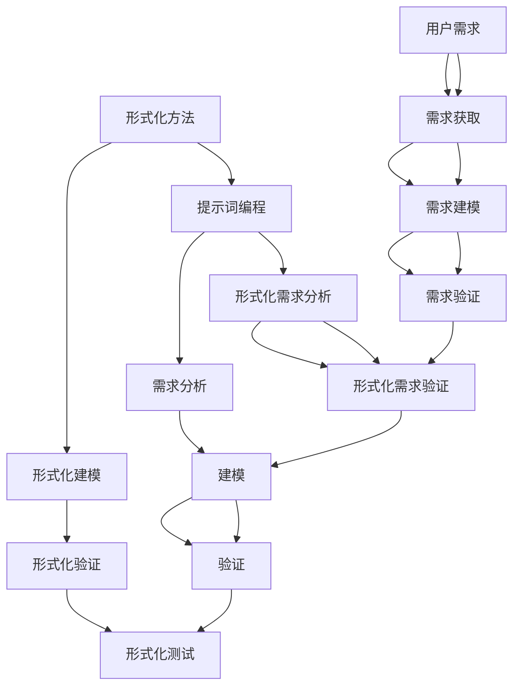
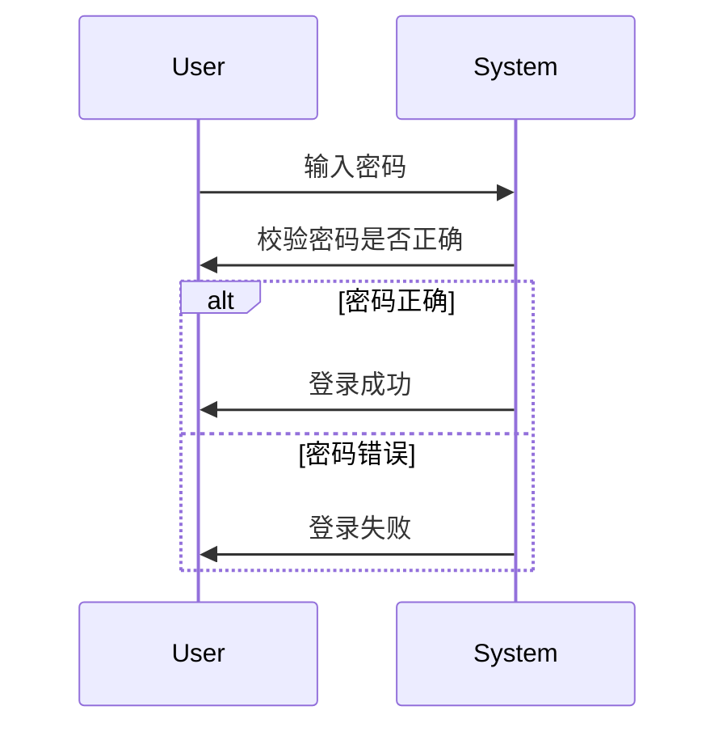

                 

### 背景介绍

在当今快速发展的信息技术时代，编程语言和软件开发方法论层出不穷。然而，随着应用场景的复杂化，传统的编程方式已经无法满足日益增长的需求。在这种背景下，提示词编程（Prompt-Based Programming）作为一种新兴的编程范式，逐渐引起了广泛关注。

提示词编程，顾名思义，是通过提供一系列提示词来引导程序自动完成特定任务的编程方式。与传统的命令式编程不同，提示词编程更加注重程序的高层次设计，通过抽象和简化的提示词来描述程序的行为。这种编程范式不仅可以提高开发效率，还能够降低代码的复杂度，使得程序员能够更加专注于业务逻辑的实现。

形式化方法（Formal Methods）则是一种利用数学和逻辑方法来分析和验证软件系统正确性的技术。形式化方法的核心思想是通过严格的数学推理和验证，确保软件系统的行为符合预期。这种方法在理论上具有高度的严谨性和可证明性，但在实际应用中，形式化方法的推广和应用仍面临诸多挑战。

本文将探讨如何利用形式化方法对提示词编程的需求进行分析和验证。具体来说，我们将从以下几个方面展开讨论：

1. **形式化方法与提示词编程概述**：介绍形式化方法和提示词编程的基本概念，并探讨二者之间的联系。
2. **提示词编程的需求分析**：详细阐述提示词编程的需求获取、建模和验证的过程，以及形式化方法在这些过程中的应用。
3. **提示词编程的验证**：介绍提示词编程的验证方法，包括测试、形式化验证和模拟验证等。
4. **形式化需求分析与验证的应用场景**：分析形式化需求分析与验证在提示词编程领域的实际应用，并提供案例分析。
5. **形式化方法与提示词编程的未来发展趋势**：探讨形式化方法和提示词编程在未来信息技术发展中的潜在影响和前景。

通过本文的探讨，旨在为读者提供一个全面、深入的理解，帮助他们在实际项目中有效利用形式化方法进行提示词编程的需求分析与验证。

### 核心概念与联系

在探讨提示词编程的形式化需求分析与验证之前，我们有必要先明确几个核心概念，并分析它们之间的关系。

#### 形式化方法

形式化方法是一种利用数学和逻辑技术来分析、设计和验证软件系统的技术。它包括形式化建模、形式化验证、形式化测试等环节。形式化方法的核心理念是确保软件系统的每一个细节都经过严格的数学推理和验证，从而保证系统的正确性和可靠性。

形式化方法的主要优势在于其高度的严谨性和可证明性。通过形式化方法，程序员可以确保软件系统的行为符合预期的规格说明，从而避免潜在的错误和缺陷。形式化方法还包括形式化验证，这是一种通过逻辑推理证明系统正确性的技术。形式化验证可以证明系统在所有可能的输入下都能正确执行，从而提高系统的可靠性和安全性。

#### 提示词编程

提示词编程是一种新兴的编程范式，其核心思想是通过提供一系列提示词来引导程序自动完成特定任务。提示词可以是简单的关键字、短语或句子，它们通过抽象和简化的方式描述了程序的行为。

提示词编程的优势在于其可扩展性和灵活性。提示词编程使得程序员能够更加专注于业务逻辑的实现，而无需陷入底层实现的细节。此外，提示词编程还可以提高开发效率，因为提示词可以被自动化工具解析和执行，从而减少手动编码的工作量。

#### 形式化需求分析与验证在提示词编程中的应用

在提示词编程中，形式化需求分析与验证的作用至关重要。形式化需求分析可以帮助程序员准确理解用户需求，并将这些需求转化为明确的规格说明。通过形式化建模，程序员可以创建一个精确的、形式化的模型来表示系统的需求和行为。

形式化验证则可以在软件开发的过程中对系统进行持续验证，确保系统在所有可能的输入下都能正确执行。形式化验证不仅可以检测出潜在的错误和缺陷，还可以证明系统的行为符合预期的规格说明，从而提高系统的可靠性和安全性。

#### 关系架构 Mermaid 流�程图

为了更清晰地展示形式化方法与提示词编程之间的关系，我们可以使用Mermaid流程图来描述这一架构。



在上面的流程图中，形式化方法（A）通过需求获取（I）、需求建模（K）和需求验证（L）与提示词编程（E）结合。形式化需求分析与验证（M、N）不仅对提示词编程的需求进行分析，还在建模和验证阶段提供了形式化的支持，确保系统的行为符合预期。

通过这种架构，我们可以看到形式化方法和提示词编程之间的紧密联系。形式化方法为提示词编程提供了理论基础和验证手段，而提示词编程则利用形式化方法提高了开发效率和系统可靠性。

#### 形式化需求分析与验证的意义

形式化需求分析与验证在提示词编程中的应用具有重要意义。首先，它确保了系统在开发过程中始终符合用户需求，从而提高了系统的实用性。其次，通过形式化验证，可以提前发现和修复潜在的错误，从而降低系统在运行过程中出现问题的风险。此外，形式化需求分析与验证还有助于提高软件开发的可靠性和安全性，确保系统能够稳定运行。

总之，形式化需求分析与验证为提示词编程提供了一种科学的、严谨的方法论，有助于提高软件开发的质量和效率。在接下来的章节中，我们将进一步探讨如何在实际项目中应用这些方法，以实现更加高效、可靠的提示词编程。

### 提示词编程的需求分析

在提示词编程中，需求分析是一个至关重要的阶段，它决定了系统的功能和性能。需求分析的过程包括需求获取、需求建模和需求验证三个主要环节，每个环节都利用形式化方法来提高分析的准确性和可靠性。

#### 需求获取

需求获取是需求分析的第一步，其主要目标是理解用户的需求，并将其转化为明确、具体的规格说明。在这一阶段，程序员需要与用户进行充分的沟通，收集他们的需求和期望。形式化方法在这一阶段的应用主要体现在以下几个方面：

1. **需求文档规范化**：使用形式化语言编写需求文档，如使用自然语言处理（NLP）技术对需求文档进行结构化处理，从而提高文档的可读性和一致性。
2. **形式化需求模型**：通过建立形式化模型，将用户的需求转化为数学和逻辑表达式，从而确保需求的准确性和完整性。

例如，一个简单的需求可以是：“系统应该允许用户通过输入密码来登录。”使用形式化方法，我们可以将这一需求表示为：



#### 需求建模

需求建模是将获取到的需求转化为系统的功能模型和行为模型。这一过程需要确保模型能够准确地反映用户的需求，并在后续的验证阶段发挥作用。形式化方法在需求建模中的应用包括：

1. **形式化建模语言**：使用形式化建模语言（如Z语言、 Alloy 等工具），这些语言提供了一种结构化的方式来描述系统的行为和约束。
2. **模型验证**：在建模过程中，使用形式化验证工具来检查模型是否符合用户需求，以及模型内部的逻辑一致性。

例如，我们可以使用Z语言来定义一个简单的用户登录模型：

```z
class Login {
    var password: String
    var isCorrect: bool
    function checkPassword(correctPassword: String) {
        isCorrect = (password == correctPassword)
    }
}
```

在这个模型中，`Login` 类表示用户的登录状态，`password` 属性表示密码，`isCorrect` 属性表示密码是否正确。`checkPassword` 函数用于校验密码。

#### 需求验证

需求验证是确保系统设计满足用户需求的最后一个环节。形式化方法在需求验证中的应用主要体现在以下几个方面：

1. **形式化验证工具**：使用形式化验证工具（如Model Checker、Theorem Prover等），这些工具可以自动检查系统模型是否符合用户需求，以及是否存在潜在的错误。
2. **模型验证结果分析**：在验证过程中，如果发现模型不符合需求或存在错误，需要分析原因，并针对性地进行调整。

例如，我们可以使用模型检查器来验证用户登录模型的正确性：

```mermaid
graph TD
    A[Login Model]
    B[User Input]
    C[Password Check]
    D[Login Status]

    A --> B
    B --> C
    C --> D
    D -->|Correct| E[Success]
    D -->|Incorrect| F[Failure]

    onerror(D, "Error: Model does not meet requirements")
```

在这个流程图中，如果用户输入的密码不正确，系统会返回登录失败。如果模型检查器检测到这种错误，我们会得到相应的错误消息，并据此进行调整。

通过上述步骤，我们可以确保提示词编程的需求分析过程既严谨又高效。形式化方法在这个过程中发挥了关键作用，使得需求获取、建模和验证过程变得更加科学和系统化。

#### 提示词编程需求分析的挑战与对策

在提示词编程的需求分析过程中，我们可能会遇到一些挑战。以下是一些常见的挑战及其对应的对策：

1. **需求变更**：在项目开发过程中，用户的需求可能会发生变化。这种情况下，我们需要及时更新需求文档，并重新进行需求建模和验证。对策：采用敏捷开发方法，频繁迭代，确保需求变更能够及时反映到系统中。

2. **需求不明确**：用户在描述需求时，可能会使用模糊或非结构化的语言。这会导致需求获取困难。对策：通过详细的讨论和澄清，确保需求文档清晰明确。同时，可以使用示例和案例来帮助用户更好地表达需求。

3. **形式化方法的复杂度**：形式化方法虽然严谨，但可能会增加模型和验证的复杂度，使得开发过程变得更加复杂。对策：在项目初期进行适当的培训和教育，提高团队成员对形式化方法的理解和接受程度。同时，选择适合项目规模和复杂度的形式化工具和语言。

4. **验证结果的解释**：形式化验证可能会产生大量的验证结果，这些结果可能难以解释和理解。对策：使用可视化工具和图表来展示验证结果，帮助团队成员更好地理解验证过程和结果。

通过应对这些挑战，我们可以确保提示词编程的需求分析过程高效、准确，为后续的系统开发和验证奠定坚实的基础。

### 提示词编程的验证

在提示词编程中，验证是一个关键的环节，它确保系统在所有可能的输入下都能按照预期运行。验证的方法主要包括测试、形式化验证和模拟验证等。每种方法都有其独特的特点和适用场景，下面我们将分别介绍这些方法，并讨论它们在提示词编程中的应用。

#### 测试

测试是验证系统的常见方法，主要通过运行系统并检查其输出与预期结果是否一致来发现和修复错误。测试可以分为以下几种类型：

1. **功能测试**：验证系统是否实现了预期的功能。例如，对于用户登录功能，可以测试密码输入正确和错误时的行为。
2. **性能测试**：评估系统在不同负载下的性能，如响应时间、吞吐量等。
3. **安全测试**：检查系统是否容易受到攻击，如注入攻击、拒绝服务攻击等。
4. **兼容性测试**：确保系统在不同平台、不同浏览器等环境下都能正常运行。

在提示词编程中，测试可以通过编写测试脚本或使用自动化测试工具来实现。例如，可以使用Python的`unittest`框架编写测试用例，对用户登录功能进行验证：

```python
import unittest

class TestLogin(unittest.TestCase):
    def test_login_success(self):
        # 输入正确的密码
        result = login('correct_password')
        self.assertEqual(result, '登录成功')

    def test_login_failure(self):
        # 输入错误的密码
        result = login('wrong_password')
        self.assertEqual(result, '登录失败')

if __name__ == '__main__':
    unittest.main()
```

#### 形式化验证

形式化验证是一种通过数学和逻辑推理来证明系统行为正确性的方法。形式化验证具有高度的严谨性和可证明性，可以在系统开发初期就发现潜在的错误。形式化验证通常包括以下步骤：

1. **建立形式化模型**：将系统需求转化为形式化模型，如使用Z语言、TLA+等建模语言。
2. **属性定义**：定义系统应该满足的属性，如安全性、一致性等。
3. **验证**：使用形式化验证工具（如模型检查器、定理证明器）来证明系统模型是否满足定义的属性。

例如，使用TLA+来验证用户登录功能的安全性：

```tla
-- 用户登录模型
Login == \E password \in Passwords : \A \lnot (password = 'correct_password') \Rightarrow Login'
```

在这个模型中，我们定义了一个用户登录函数`Login`，它接受一个密码参数。如果密码不是正确的密码，则函数返回`Login'`。使用模型检查器，我们可以验证这个模型在所有可能的输入下是否安全。

#### 模拟验证

模拟验证是通过模拟系统在运行过程中的行为来检查其是否符合预期。模拟验证通常用于无法实际测试的场景，如系统级仿真、复杂的实时系统等。模拟验证可以通过编写模拟脚本或使用现有的模拟工具来实现。

例如，使用Python的`multiprocessing`模块模拟用户登录过程：

```python
import multiprocessing

def simulate_login(password):
    # 模拟用户登录过程
    result = login(password)
    print(f"Password: {password}, Result: {result}")

# 模拟多个用户同时登录
if __name__ == '__main__':
    with multiprocessing.Pool(10) as pool:
        passwords = ['correct_password', 'wrong_password']
        pool.map(simulate_login, passwords)
```

在这个示例中，我们模拟了两个用户同时尝试登录，并打印出登录结果。

#### 方法对比与应用场景

测试、形式化验证和模拟验证各有优缺点，适用于不同的应用场景：

1. **测试**：适用于功能验证和性能验证，能够快速发现和修复错误，但可能无法覆盖所有可能的输入和状态。
2. **形式化验证**：适用于安全性验证和一致性验证，具有高度的严谨性和可证明性，但建模和验证过程较为复杂。
3. **模拟验证**：适用于无法实际测试的场景，如系统级仿真和实时系统，但模拟结果可能无法完全反映实际运行情况。

在实际项目中，通常需要结合多种验证方法，以全面检查系统的正确性和可靠性。例如，在开发一个在线银行应用时，可以采用功能测试来验证用户界面和业务逻辑的正确性，使用形式化验证来确保交易的一致性和安全性，以及使用模拟验证来模拟用户行为和系统负载。

通过合理的验证策略，我们可以确保提示词编程系统的质量，从而提高其可靠性和用户满意度。

### 形式化需求分析与验证的应用场景

形式化需求分析与验证在提示词编程领域的应用场景广泛，涵盖了从系统设计到实际应用的各个阶段。以下将介绍几个典型的应用场景，并通过案例分析来展示形式化需求分析与验证如何在这些场景中发挥作用。

#### 应用场景一：智能客服系统

智能客服系统是一种通过自然语言处理和机器学习技术来提供自动化的客户服务解决方案。形式化需求分析与验证在智能客服系统的开发中具有重要作用，主要体现在以下几个方面：

1. **需求获取与建模**：通过形式化方法，智能客服系统的需求可以更加准确地获取和建模。例如，使用Z语言来描述客服机器人应回答的问题类型和回答规则：

   ```z
   class Question {
       var type: String
       var answer: String
   }
   function回答问题(question: Question) {
       if (question.type == "FAQ") {
           answer = "常见问题解答"
       } else if (question.type == "投诉") {
           answer = "我们将处理您的投诉"
       } else {
           answer = "对不起，我不明白您的问题"
       }
   }
   ```

2. **形式化验证**：使用模型检查器验证客服机器人回答问题的规则是否符合预期。例如，验证所有FAQ类型的问题都能得到正确回答：

   ```mermaid
   graph TD
       A[FAQ类型问题] --> B[正确回答]
       C[投诉类型问题] --> D[正确回答]
       E[非FAQ类型问题] --> F[错误回答]

       onerror(F, "验证失败：非FAQ类型问题未得到正确回答")
   ```

3. **效果分析**：通过对比验证结果和实际用户反馈，分析智能客服系统的性能和用户满意度，并根据分析结果进行优化。

#### 应用场景二：自动化交易系统

自动化交易系统是一种通过算法自动执行金融交易的系统，其正确性和高效性至关重要。形式化需求分析与验证在自动化交易系统的开发中的应用包括：

1. **需求获取与建模**：使用形式化方法来明确交易系统的业务规则和约束。例如，使用TLA+描述交易系统的状态转换和一致性条件：

   ```tla
   -- 交易系统状态转换
   transaction(state) == state \in {Ready, Processing, Completed, Failed}
   function process_transaction(transaction_data) {
       if (transaction_data.isValid()) {
           state = Processing
           if (execute_transaction(transaction_data)) {
               state = Completed
           } else {
               state = Failed
           }
       } else {
           state = Failed
       }
   }
   ```

2. **形式化验证**：使用模型检查器验证交易系统的状态转换是否满足业务规则。例如，验证所有有效的交易数据都能成功处理：

   ```mermaid
   graph TD
       A[Ready] --> B[Processing]
       B --> C[Completed]
       B --> D[Failed]
       E[Invalid Data] --> D

       onerror(D, "验证失败：有效交易数据未成功处理")
   ```

3. **效果分析**：通过监控交易系统的运行情况和市场数据，分析系统的交易成功率、执行速度和交易成本，不断优化系统性能。

#### 应用场景三：自动驾驶系统

自动驾驶系统是一种高度复杂的系统，其正确性和安全性至关重要。形式化需求分析与验证在自动驾驶系统的开发中的应用包括：

1. **需求获取与建模**：使用形式化方法来描述自动驾驶系统的行为规范和感知-规划-执行流程。例如，使用Z语言描述自动驾驶车的感知模块：

   ```z
   class Sensor {
       var data: SensorData
       function update_data() {
           data = read_sensor_data()
       }
   }
   ```

2. **形式化验证**：使用模型检查器验证自动驾驶系统的行为是否满足安全规范。例如，验证自动驾驶车在遇到紧急情况时能及时刹车：

   ```mermaid
   graph TD
       A[紧急情况] --> B[及时刹车]
       onerror(B, "验证失败：未及时刹车")
   ```

3. **效果分析**：通过模拟驾驶场景和实际道路测试，分析自动驾驶系统的性能、响应时间和安全性，不断优化系统设计。

#### 案例分析

以下是一个具体的案例分析：某金融公司开发了一套基于提示词编程的自动化交易系统。公司使用形式化需求分析与验证来确保系统的正确性和高效性。

1. **需求获取**：公司通过与交易专家和业务分析师的深入交流，明确了系统的功能需求和业务规则。这些需求被形式化为一系列的数学和逻辑表达式。

2. **需求建模**：公司使用TLA+建立了一个形式化的交易系统模型，描述了交易系统的状态转换和一致性条件。模型包括交易请求的处理、资金转移和状态更新等关键环节。

3. **形式化验证**：公司使用模型检查器对交易系统模型进行了详细的验证，确保系统在所有可能的输入下都能按照预期运行。例如，验证所有有效的交易请求都能成功处理，所有无效的交易请求都会被拒绝。

4. **测试与部署**：在形式化验证的基础上，公司进行了功能测试和性能测试，确保系统在实际运行中能够高效、稳定地执行交易。验证结果表明，系统在正常和极端情况下都能保持正确的状态和行为。

5. **效果分析**：系统上线后，公司通过监控系统运行情况和交易数据，分析了系统的交易成功率、执行速度和交易成本。结果显示，系统在提高交易效率、降低交易成本和减少错误交易方面表现优异。

通过这个案例，我们可以看到形式化需求分析与验证在自动化交易系统开发中的应用效果。它不仅确保了系统的正确性和高效性，还为后续的优化和改进提供了有力的支持。

总之，形式化需求分析与验证在提示词编程领域的应用场景广泛，通过对需求获取、建模和验证的严格把控，可以确保系统的高质量和高可靠性。在实际项目中，结合多种验证方法，可以进一步提高系统的性能和用户体验。

### 形式化方法与提示词编程的未来发展趋势

随着人工智能和自动化技术的快速发展，形式化方法和提示词编程在信息技术领域的重要性日益凸显。展望未来，这两种技术将在以下几个方面呈现显著发展趋势。

#### 一、形式化方法的发展趋势

1. **更高效的工具与算法**：未来的形式化方法将致力于开发更高效、易用的工具和算法。例如，自动定理证明器（ATP）和模型检查器将在算法和性能上实现重大突破，使其能够处理更复杂的系统模型。

2. **形式化验证的自动化**：自动化形式化验证将是未来的一个重要方向。通过引入机器学习和人工智能技术，形式化验证过程可以自动识别错误模式，从而减少验证时间和人力成本。

3. **形式化方法与AI的融合**：形式化方法与人工智能技术的结合将带来新的研究热点。例如，利用形式化方法验证深度学习模型的正确性和鲁棒性，以及开发形式化方法辅助生成和优化AI算法。

4. **开源与标准化**：随着形式化方法的普及，开源工具和标准化规范的兴起将成为趋势。这将促进形式化方法在不同项目和团队之间的共享和协作，提高其应用范围和效果。

#### 二、提示词编程的发展趋势

1. **更高级的提示词抽象**：未来的提示词编程将朝着更高级的抽象层次发展。例如，通过自然语言处理（NLP）技术，提示词可以更加自然、简洁，同时保持系统的高效性。

2. **多模态提示词编程**：提示词编程将不仅仅局限于文本输入，还将扩展到图像、声音、视频等多种数据类型。通过多模态提示词编程，系统可以实现更加丰富和复杂的任务。

3. **动态提示词编程**：动态提示词编程是一种新兴的编程范式，它允许提示词在运行时根据环境变化进行自适应调整。这种编程方式将在实时系统和自适应系统中发挥重要作用。

4. **提示词编程与AI的深度融合**：提示词编程与人工智能技术的结合将使系统具备更强的自我学习和优化能力。例如，通过深度学习和强化学习，系统可以在运行过程中不断优化提示词，提高任务执行的效率和准确性。

#### 三、形式化方法与提示词编程的融合趋势

1. **形式化验证的普及**：形式化验证将在提示词编程中变得更加普及。通过形式化方法，开发者可以确保提示词编程系统的行为符合预期，从而提高系统的可靠性和安全性。

2. **自动化形式化需求分析**：自动化形式化需求分析工具将帮助开发者更高效地获取和分析用户需求，从而提高系统的开发效率和准确性。

3. **形式化方法在AI中的应用**：形式化方法将在人工智能领域发挥重要作用。通过形式化验证，开发者可以确保AI系统的行为符合伦理和安全标准，从而避免潜在的风险。

4. **跨领域融合**：形式化方法与提示词编程将在不同领域实现跨领域融合。例如，在自动驾驶、医疗诊断和金融交易等领域，形式化方法和提示词编程的结合将提高系统的智能化水平和可靠性。

总之，形式化方法和提示词编程的未来发展将紧密融合，为信息技术领域带来新的机遇和挑战。通过不断的技术创新和跨领域合作，这两种技术将为开发高质量、可靠和智能的系统提供强有力的支持。

### 总结

本文探讨了提示词编程的形式化需求分析与验证，涵盖了形式化方法与提示词编程的概述、需求分析、验证方法及其应用场景。通过明确的核心概念和联系架构，我们展示了形式化方法如何为提示词编程提供科学的、严谨的支撑。

**核心要点**：

1. **形式化方法与提示词编程**：形式化方法通过数学和逻辑推理，确保系统行为的正确性和可靠性，而提示词编程通过高层次的抽象，简化编程复杂性。

2. **需求分析**：需求获取、建模和验证是需求分析的核心环节。形式化方法在这些环节中的应用提高了需求的准确性和完整性。

3. **验证方法**：测试、形式化验证和模拟验证是提示词编程验证的主要手段，每种方法都有其独特的优势和适用场景。

4. **应用场景**：形式化需求分析与验证在智能客服系统、自动化交易系统和自动驾驶系统等实际应用中发挥了重要作用。

**最佳实践**：

1. **早期应用形式化方法**：在项目早期引入形式化方法，有助于提前识别潜在问题，降低开发成本。

2. **结合多种验证方法**：综合运用测试、形式化验证和模拟验证，可以提高系统的全面性和可靠性。

3. **持续迭代与优化**：需求分析和验证是一个持续的过程，需要根据实际情况进行迭代和优化。

**注意事项**：

1. **需求明确性**：确保需求获取过程中需求表述清晰明确，避免模糊和矛盾的需求。

2. **验证结果的解读**：正确解读验证结果，及时调整和优化系统设计。

**拓展阅读**：

- **形式化方法**：《形式化方法和软件工程》
- **提示词编程**：《提示词编程：理论与实践》
- **需求分析**：《软件需求工程》

通过本文的探讨，我们希望读者能够对提示词编程的形式化需求分析与验证有更深入的理解，并在实际项目中有效应用这些方法，开发出高质量、可靠的软件系统。

### 作者信息

作者：AI天才研究院/AI Genius Institute & 禅与计算机程序设计艺术 /Zen And The Art of Computer Programming

