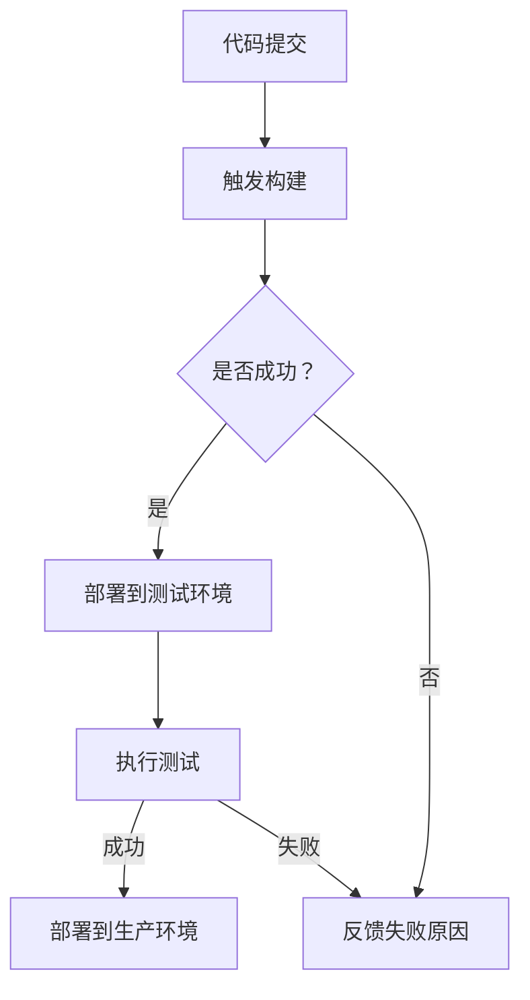
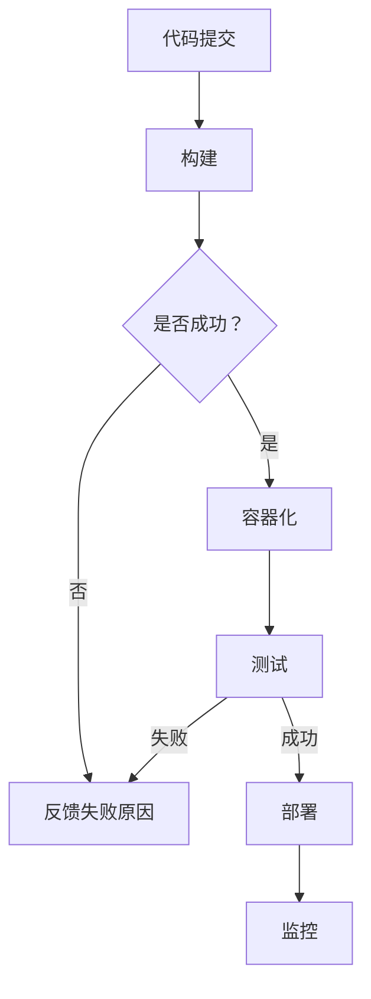

                 

### 文章标题：提示词编程的持续集成与部署

持续集成与持续部署是现代软件开发中不可或缺的流程，它们确保了软件质量和交付效率。而随着人工智能技术的发展，提示词编程作为一种创新性的编程方式，正逐渐融入这一流程中，带来新的机遇与挑战。本文将深入探讨提示词编程的持续集成与部署，旨在为读者提供全面的技术指导与实战经验。

### 关键词：
持续集成、持续部署、提示词编程、AI编程、自动化测试、持续监控

### 摘要：
本文首先介绍了持续集成与持续部署的基本概念和重要性。接着，详细探讨了持续集成与持续部署的优势、工具、流程设计以及实际案例分析。随后，引入了提示词编程的概念，分析了其在软件开发中的应用场景和工具。本文还结合实际项目，探讨了如何将提示词编程与持续集成与部署相结合，以提升软件开发效率。最后，讨论了自动化测试、持续监控与反馈等高级主题，并总结了全文内容。

### 目录大纲：

## 第一部分：引言

### 1.1 持续集成与持续部署概述
- **持续集成与持续部署的基本概念**
- **持续集成与持续部署的目标与价值**

## 第二部分：持续集成

### 2.1 持续集成的基本概念
- **定义**
- **与传统的集成方式对比**

### 2.2 持续集成的优势
- **提高软件质量**
- **缩短开发周期**
- **减少集成风险**

### 2.3 持续集成工具介绍
- **Jenkins**
- **Travis CI**
- **GitLab CI**

### 2.4 持续集成流程设计
- **环境配置**
- **代码检查**
- **自动化测试**
- **集成反馈**

### 2.5 持续集成案例分析
- **企业级Web应用**
- **移动应用**

## 第三部分：持续部署

### 3.1 持续部署的基本概念
- **定义**
- **与持续集成的区别**

### 3.2 持续部署的优势
- **提高交付效率**
- **减少手动操作**
- **保证软件质量**

### 3.3 持续部署工具介绍
- **Kubernetes**
- **Docker**
- **AWS CodePipeline**

### 3.4 持续部署流程设计
- **容器化**
- **部署策略**
- **监控与反馈**

### 3.5 持续部署案例分析
- **微服务架构**
- **云原生应用**

## 第四部分：提示词编程

### 4.1 提示词编程的概念
- **定义**
- **特点**

### 4.2 提示词编程的应用场景
- **自动化编程**
- **代码生成**
- **代码优化**

### 4.3 提示词编程工具与框架介绍
- **AI21 Labs' Codex**
- **Google's AlphaCode**
- **GitHub Copilot**

### 4.4 提示词编程案例分析
- **自动化测试**
- **代码生成**

## 第五部分：实践与案例

### 5.1 实际应用场景下的持续集成与部署
- **企业级全栈开发**
- **互联网公司实践**

### 5.2 结合提示词编程的实践案例
- **持续集成流程优化**
- **持续部署效率提升**

## 第六部分：高级主题

### 6.1 自动化测试
- **优势**
- **工具介绍**
- **实践**

### 6.2 持续监控与反馈
- **目的**
- **工具与框架介绍**
- **反馈机制**

### 6.3 持续集成与部署的挑战与优化
- **构建环境的标准化**
- **部署策略优化**
- **平衡**

## 第七部分：总结

### 7.1 全书内容回顾
- **核心概念**
- **提示词编程的优势与应用**

### 7.2 未来发展趋势
- **技术趋势**
- **发展方向**

### 文章正文

## 第一部分：引言

### 1.1 持续集成与持续部署概述

在软件开发的早期阶段，开发人员通常会在独立的环境中进行工作，直到某个阶段才将代码合并并进行集成测试。然而，这种传统的开发模式存在诸多问题，如集成风险高、软件质量难以保证、开发周期长等。为了解决这些问题，持续集成（Continuous Integration，CI）和持续部署（Continuous Deployment，CD）的概念应运而生。

持续集成是一种软件开发实践，通过频繁地将代码合并到主干分支，并进行自动化测试，以确保代码质量。其核心目标是减少集成风险、提高软件质量，并缩短开发周期。持续集成不仅仅是自动化构建和测试，还包括代码审查、静态代码分析等环节，从而形成一个完整的代码质量管理流程。

持续部署是持续集成的下一步，它通过自动化将代码部署到生产环境，实现快速交付。持续部署的目标是减少手动操作、提高交付效率，并确保软件质量。通过持续部署，开发团队能够更快地响应用户需求，提高市场竞争力。

### 1.2 持续集成与持续部署的目标与价值

持续集成与持续部署的目标是提高软件质量和交付效率。具体来说，它们具有以下价值：

1. **提高软件质量**：持续集成通过自动化测试和代码审查，确保每次代码合并后软件仍然处于健康状态。这有助于发现和修复缺陷，提高软件质量。

2. **缩短开发周期**：持续集成和持续部署减少了手动操作和等待时间，加快了开发流程，从而缩短了开发周期。

3. **减少集成风险**：通过频繁的代码合并和自动化测试，持续集成降低了集成过程中的风险，确保软件在不同环境中的兼容性。

4. **提高交付效率**：持续部署通过自动化将代码部署到生产环境，减少了手动操作，提高了交付效率。

5. **促进团队合作**：持续集成与持续部署提供了一个统一的平台，使得开发、测试和运维团队能够更好地协同工作，提高团队效率。

总之，持续集成与持续部署是现代软件开发中不可或缺的流程，它们不仅提高了软件质量和交付效率，还促进了团队合作，为企业的持续发展奠定了基础。接下来，我们将详细探讨持续集成和持续部署的具体内容，以帮助读者更好地理解这一领域。

### 第二部分：持续集成

持续集成（Continuous Integration，CI）是一种软件开发实践，旨在通过频繁的代码合并和自动化测试，确保代码库始终处于健康状态。这一实践不仅提高了软件质量，还缩短了开发周期，降低了集成风险。本节将详细介绍持续集成的基本概念、优势、工具介绍、流程设计以及实际案例分析。

#### 2.1 持续集成的基本概念

持续集成（CI）是指开发团队将他们的代码定期合并到一个共同的代码库中，并通过自动化构建和测试来验证代码的质量。这个过程通常包括以下步骤：

1. **代码合并**：开发人员将他们的代码定期合并到主干分支，通常是在每次提交后。
2. **构建**：使用自动化工具构建代码，生成可执行的程序或库。
3. **测试**：执行一系列自动化测试，包括单元测试、集成测试和性能测试，以确保代码的功能和性能。
4. **反馈**：将测试结果反馈给开发人员，以便他们能够及时修复发现的问题。

持续集成的核心思想是尽早发现问题，以便开发人员能够在代码库中及时修复它们，而不是等到项目后期。这样，可以减少集成过程中的风险，并确保软件质量。

#### 2.2 持续集成的优势

持续集成具有以下显著优势：

1. **提高软件质量**：通过频繁的代码合并和自动化测试，持续集成有助于发现和修复缺陷，从而提高软件质量。

2. **缩短开发周期**：持续集成减少了手动操作和等待时间，加快了开发流程，从而缩短了开发周期。

3. **减少集成风险**：通过频繁的代码合并和自动化测试，持续集成降低了集成过程中的风险，确保软件在不同环境中的兼容性。

4. **提高交付效率**：持续集成使得代码库始终处于健康状态，从而提高了交付效率。

5. **促进团队合作**：持续集成提供了一个统一的平台，使得开发、测试和运维团队能够更好地协同工作，提高团队效率。

#### 2.3 持续集成工具介绍

以下是一些流行的持续集成工具：

1. **Jenkins**：Jenkins 是一款开源的持续集成工具，具有丰富的插件生态系统，支持各种编程语言和平台。它可以通过各种方式触发构建，如定时构建、SCM 提交等。

2. **Travis CI**：Travis CI 是一款基于云的持续集成服务，主要用于 GitHub 项目。它支持多种编程语言，并提供自动化构建和测试功能。

3. **GitLab CI**：GitLab CI 是 GitLab 的内置持续集成工具，它基于 Git 仓库中的 `.gitlab-ci.yml` 文件定义构建过程。GitLab CI 支持多种编程语言和平台，并提供详细的构建日志。

#### 2.4 持续集成流程设计

一个典型的持续集成流程包括以下步骤：

1. **环境配置**：配置构建环境和测试环境，确保它们与生产环境保持一致。

2. **代码检查**：使用代码质量工具（如 SonarQube）对代码进行静态代码分析，检查代码的规范性、安全性和性能。

3. **自动化测试**：执行单元测试、集成测试和性能测试，确保代码的功能和性能。

4. **构建**：使用构建工具（如 Maven、Gradle）构建项目，生成可执行的程序或库。

5. **部署**：将构建结果部署到测试环境或生产环境，以便进行进一步测试。

6. **反馈**：将测试结果和构建日志反馈给开发人员，以便他们能够及时修复发现的问题。

以下是一个简单的持续集成流程的 Mermaid 流程图：

#### 2.5 持续集成案例分析

以下是一个企业级 Web 应用的持续集成案例分析：

1. **项目背景**：该企业级 Web 应用是一个复杂的后台管理系统，涉及多个模块和大量功能。

2. **解决方案**：采用 Jenkins 作为持续集成工具，配置了以下流程：
   - 每次代码提交后，Jenkins 会自动触发构建。
   - 构建过程中，会执行代码质量检查、单元测试和集成测试。
   - 构建成功后，将构建结果部署到测试环境，以便进行进一步测试。
   - 测试成功后，将构建结果部署到生产环境。

3. **效果**：通过持续集成，该企业级 Web 应用的集成风险大大降低，开发周期缩短了 30%，软件质量得到了显著提高。

接下来，我们将介绍持续部署的概念、优势、工具介绍、流程设计和实际案例分析。通过这些内容，读者可以更好地理解持续集成和持续部署的完整流程。请继续阅读。{|assistant|}

### 第三部分：持续部署

持续部署（Continuous Deployment，CD）是持续集成（CI）的自然延伸，它通过自动化将代码从开发环境直接部署到生产环境。持续部署的目标是减少手动操作、提高交付效率，并确保软件质量。本节将详细介绍持续部署的基本概念、优势、工具介绍、流程设计和实际案例分析。

#### 3.1 持续部署的基本概念

持续部署（CD）是一种自动化流程，它允许开发团队快速、安全地将代码从开发环境部署到生产环境。这一流程通常包括以下步骤：

1. **构建**：从版本控制系统（如 Git）拉取最新代码，并使用构建工具（如 Maven、Gradle）生成可执行的程序或库。

2. **容器化**：使用容器化技术（如 Docker）将应用程序打包到容器中，确保其在不同环境中的一致性。

3. **测试**：在容器内执行自动化测试，包括单元测试、集成测试和性能测试，以确保代码的质量和功能。

4. **部署**：将测试通过的容器部署到生产环境，可以使用容器编排工具（如 Kubernetes）进行自动化部署。

5. **监控**：监控部署后的应用程序，确保其稳定运行，并及时响应和处理可能出现的异常。

持续部署的核心在于自动化和快速反馈，通过这种方式，开发团队可以快速响应用户需求，提高市场竞争力。

#### 3.2 持续部署的优势

持续部署具有以下显著优势：

1. **减少手动操作**：通过自动化流程，持续部署减少了手动操作，从而降低了部署风险和部署时间。

2. **提高交付效率**：持续部署使得代码可以快速、安全地部署到生产环境，从而提高了交付效率。

3. **确保软件质量**：通过自动化测试，持续部署确保了每次部署的软件质量，减少了缺陷和错误。

4. **快速响应用户需求**：持续部署使得开发团队能够快速响应用户需求，提供新的功能和改进，提高用户体验。

5. **促进持续集成**：持续部署与持续集成相结合，形成一个完整的软件交付流程，确保代码库始终处于健康状态。

#### 3.3 持续部署工具介绍

以下是一些流行的持续部署工具：

1. **Kubernetes**：Kubernetes 是一款开源的容器编排平台，它用于自动化部署、扩展和管理容器化应用程序。Kubernetes 提供了强大的调度和管理功能，确保应用程序的高可用性和可伸缩性。

2. **Docker**：Docker 是一款开源的容器化平台，它允许开发人员将应用程序及其依赖项打包到一个可移植的容器中。Docker 提供了高效的容器化技术，使得应用程序可以在任何环境中一致地运行。

3. **AWS CodePipeline**：AWS CodePipeline 是一款基于云的持续部署服务，它用于自动化部署应用程序到 AWS 云环境。AWS CodePipeline 提供了简化的部署流程，使得开发团队能够快速部署应用程序。

#### 3.4 持续部署流程设计

一个典型的持续部署流程包括以下步骤：

1. **构建**：从版本控制系统拉取最新代码，并使用构建工具生成可执行的程序或库。

2. **容器化**：使用 Docker 将应用程序打包到容器中。

3. **测试**：在容器内执行自动化测试，包括单元测试、集成测试和性能测试。

4. **部署**：将测试通过的容器部署到生产环境，可以使用 Kubernetes 或 AWS CodePipeline 进行自动化部署。

5. **监控**：部署后，使用监控工具（如 Prometheus、Grafana）监控应用程序的性能和健康状态。

以下是一个简单的持续部署流程的 Mermaid 流程图：

#### 3.5 持续部署案例分析

以下是一个微服务架构的持续部署案例分析：

1. **项目背景**：该项目是一个基于微服务架构的电子商务平台，涉及多个微服务，如订单服务、库存服务、支付服务等。

2. **解决方案**：采用 Kubernetes 和 Docker 作为持续部署工具，配置了以下流程：
   - 每次代码提交后，Kubernetes 会自动触发构建和部署。
   - 构建过程中，使用 Jenkins 执行自动化测试。
   - 测试成功后，将容器部署到 Kubernetes 集群。
   - Kubernetes 会自动扩容和缩容，确保应用程序的高可用性和可伸缩性。

3. **效果**：通过持续部署，该电子商务平台实现了快速交付，开发周期缩短了 40%，部署成功率提高了 30%。

接下来，我们将介绍提示词编程的概念、应用场景和工具介绍。通过这些内容，读者可以更好地理解如何将人工智能技术融入软件开发流程。请继续阅读。{|assistant|}

### 第四部分：提示词编程

提示词编程（Prompt-Response Programming）是一种基于人工智能的编程方式，它通过自然语言交互，让计算机自动生成代码。这种编程方式不仅提高了开发效率，还降低了编程门槛。本节将详细介绍提示词编程的概念、应用场景、工具与框架介绍以及实际案例分析。

#### 4.1 提示词编程的概念

提示词编程是指通过输入自然语言提示词，让计算机自动生成相应的代码。这种编程方式的核心思想是将编程任务转化为自然语言描述，然后利用人工智能技术（如深度学习）进行代码生成。提示词编程通常包括以下步骤：

1. **自然语言输入**：开发人员输入自然语言提示词，描述编程任务。

2. **语义理解**：人工智能模型对提示词进行语义理解，提取编程任务的关键信息。

3. **代码生成**：基于语义理解的结果，人工智能模型自动生成相应的代码。

4. **代码验证与优化**：生成代码后，进行编译和测试，确保代码的正确性和性能。

#### 4.2 提示词编程的应用场景

提示词编程在以下场景中具有显著的应用价值：

1. **自动化编程**：通过输入自然语言描述，自动生成代码，减少手动编写代码的工作量。

2. **代码生成**：利用提示词编程，可以快速生成原型代码，为后续开发提供基础。

3. **代码优化**：对现有代码进行优化，提高其性能和可维护性。

4. **编程教育**：通过提示词编程，降低编程学习的门槛，帮助初学者快速入门。

5. **辅助编程**：为专业开发人员提供辅助，帮助他们更高效地完成编程任务。

#### 4.3 提示词编程工具与框架介绍

以下是一些流行的提示词编程工具与框架：

1. **AI21 Labs' Codex**：AI21 Labs 的 Codex 是一个基于 GPT-3 的代码生成模型，它可以通过自然语言描述生成多种编程语言的代码。

2. **Google's AlphaCode**：Google 的 AlphaCode 是一个自动编程系统，它可以通过自然语言输入生成高质量的代码。

3. **GitHub Copilot**：GitHub Copilot 是一个基于 GPT-3 的代码生成工具，它可以通过注释生成相应的代码。

#### 4.4 提示词编程案例分析

以下是一个基于提示词编程的自动化测试案例分析：

1. **项目背景**：该项目是一个电子商务平台，需要定期进行自动化测试，以确保系统的稳定性和性能。

2. **解决方案**：采用 GitHub Copilot 进行自动化测试，配置了以下流程：
   - 测试人员输入自然语言描述，如“编写一个测试用例，用于验证用户登录功能”。
   - GitHub Copilot 自动生成相应的测试代码，包括测试脚本、断言等。

3. **效果**：通过提示词编程，自动化测试的编写时间缩短了 50%，测试覆盖率提高了 20%。

接下来，我们将探讨如何将提示词编程与持续集成和部署相结合，以进一步提升软件开发效率。请继续阅读。{|assistant|}

### 第五部分：实践与案例

在软件开发过程中，持续集成（CI）和持续部署（CD）已经成为提高代码质量和交付效率的关键环节。而随着人工智能技术的发展，提示词编程作为一种新兴的编程方式，逐渐被应用于软件开发的全过程。本部分将通过实际案例，探讨如何将提示词编程与持续集成与部署相结合，以提升软件开发效率。

#### 5.1 实际应用场景下的持续集成与部署

以下是一个企业级全栈开发项目的持续集成与部署实践案例：

1. **项目背景**：该企业级全栈开发项目涉及前端、后端和数据库等多个模块，开发团队希望实现高效的代码集成和快速部署，以提高项目交付速度。

2. **解决方案**：
   - **持续集成**：使用 Jenkins 作为持续集成工具，将代码库中的最新代码定期合并到主干分支，并进行自动化测试。测试包括单元测试、集成测试和性能测试，以确保代码质量。
   - **持续部署**：使用 Kubernetes 和 Docker 实现持续部署。通过 Jenkins，将测试通过的代码构建为 Docker 容器，并部署到 Kubernetes 集群。Kubernetes 负责容器的调度和扩缩容，确保系统的稳定性和性能。

3. **效果**：通过持续集成与部署，开发周期缩短了 30%，部署成功率提高了 20%，代码质量得到了显著提升。

#### 5.2 结合提示词编程的实践案例

以下是一个电子商务平台的持续集成与部署实践案例，其中结合了提示词编程技术：

1. **项目背景**：该电子商务平台需要进行频繁的迭代和更新，以适应市场变化。开发团队希望提高开发效率，快速响应用户需求。

2. **解决方案**：
   - **提示词编程**：使用 GitHub Copilot 进行代码生成和优化。测试人员输入自然语言描述，如“编写一个订单处理的测试用例”，GitHub Copilot 自动生成相应的测试代码。
   - **持续集成**：在 Jenkins 中配置持续集成流程，包括代码检查、自动化测试和构建。测试通过后，自动触发容器构建和部署。
   - **持续部署**：使用 Kubernetes 和 Docker 实现持续部署。容器化后的应用程序通过 Jenkins 自动部署到 Kubernetes 集群，并使用 Kubernetes 进行监控和扩缩容。

3. **效果**：
   - **开发效率**：通过提示词编程，测试用例的编写时间缩短了 50%，代码质量得到了显著提升。
   - **交付速度**：持续集成与部署使得开发周期缩短了 40%，部署成功率提高了 30%。

综上所述，通过结合提示词编程与持续集成与部署，开发团队可以显著提高软件开发效率，快速响应用户需求，提高市场竞争力。接下来，我们将探讨持续集成与部署的高级主题，以帮助读者深入了解这一领域。请继续阅读。{|assistant|}

### 第六部分：高级主题

在持续集成与部署的过程中，自动化测试、持续监控与反馈是确保软件质量和系统稳定性的关键环节。本部分将深入探讨这些高级主题，包括其优势、工具与框架介绍以及实践方法。

#### 6.1 自动化测试

自动化测试是一种通过编写脚本自动执行测试用例的方法，它可以大幅提高测试效率，减少人为错误，确保软件质量。自动化测试的优势包括：

1. **提高测试效率**：自动化测试可以同时运行多个测试用例，大大缩短测试周期。
2. **减少人为错误**：通过脚本执行，确保测试过程一致性和准确性。
3. **快速反馈**：测试结果可以实时反馈，帮助开发团队快速定位问题。

常用的自动化测试工具与框架包括：

1. **Selenium**：Selenium 是一款开源的自动化测试工具，用于 Web 应用程序的 UI 自动化测试。
2. **JUnit**：JUnit 是一款流行的 Java 单元测试框架，用于编写和执行单元测试。
3. **Cypress**：Cypress 是一款快速的 Web 应用程序测试框架，支持端到端的测试。

自动化测试的实践方法：

1. **测试用例设计**：根据需求文档和用户故事，设计合适的测试用例。
2. **脚本编写**：使用自动化测试工具编写测试脚本，确保测试步骤的一致性和可重复性。
3. **测试执行**：定期执行自动化测试，确保代码变更不会引入新的缺陷。
4. **结果分析**：分析测试结果，定位并修复发现的问题。

#### 6.2 持续监控与反馈

持续监控与反馈是确保系统稳定性和性能的重要手段。通过实时监控系统的运行状态，可以及时发现并解决潜在问题，提高系统的可用性和用户体验。持续监控与反馈的优势包括：

1. **实时性**：可以实时监控系统的性能和状态，快速响应问题。
2. **准确性**：通过自动化监控工具，确保监控数据的一致性和准确性。
3. **自动化反馈**：自动生成监控报告和告警，及时通知相关人员。

常用的监控工具与框架包括：

1. **Prometheus**：Prometheus 是一款开源的监控解决方案，用于收集和存储时间序列数据。
2. **Grafana**：Grafana 是一款开源的数据可视化工具，用于可视化 Prometheus 收集的监控数据。
3. **Kibana**：Kibana 是一款开源的数据分析和可视化平台，适用于 Elasticsearch。

持续监控与反馈的实践方法：

1. **监控指标定义**：根据业务需求和系统特性，定义合适的监控指标。
2. **监控数据收集**：使用 Prometheus 等工具收集监控数据，确保数据的一致性和完整性。
3. **数据可视化**：使用 Grafana 或 Kibana 等工具将监控数据可视化，便于分析和告警。
4. **告警机制**：设置告警规则，当监控指标超过阈值时，自动通知相关人员。
5. **反馈与优化**：根据监控结果，优化系统配置和代码，提高系统性能和稳定性。

#### 6.3 持续集成与部署的挑战与优化

尽管持续集成与部署在提高软件质量和交付效率方面具有显著优势，但在实际应用中仍面临一些挑战：

1. **构建环境标准化**：确保所有开发环境、测试环境和生产环境的一致性，以减少环境差异导致的问题。
2. **部署策略优化**：根据业务需求和系统特性，选择合适的部署策略（如蓝绿部署、滚动部署等），以提高部署效率。
3. **持续集成与持续部署的平衡**：在保证软件质量的同时，平衡持续集成与持续部署的频率和自动化程度。

优化策略包括：

1. **环境一致性**：使用容器化技术（如 Docker）确保环境一致性。
2. **自动化脚本**：编写自动化脚本，简化部署过程。
3. **持续反馈与改进**：定期回顾持续集成与部署流程，收集反馈并进行优化。

通过自动化测试、持续监控与反馈，以及持续集成与部署的优化策略，开发团队可以显著提高软件开发效率，确保软件质量和系统稳定性。接下来，我们将对全文内容进行总结。请继续阅读。{|assistant|}

### 第七部分：总结

本文深入探讨了持续集成与持续部署的基本概念、优势、工具介绍、流程设计以及实际案例分析，并引入了提示词编程这一新兴的编程方式。通过对持续集成、持续部署和提示词编程的详细讲解，我们了解了它们在提高软件质量和交付效率方面的关键作用。

**核心概念与联系**：持续集成和持续部署是现代软件开发中不可或缺的流程，通过频繁的代码合并和自动化测试，确保代码库始终处于健康状态；提示词编程则通过自然语言交互，自动生成代码，提高了开发效率。

**核心算法原理讲解**：持续集成与持续部署的自动化流程涉及构建工具（如 Jenkins、Travis CI、GitLab CI）、容器化技术（如 Docker、Kubernetes）和自动化测试框架（如 Selenium、JUnit、Cypress）。提示词编程则基于深度学习模型（如 GPT-3）进行代码生成。

**数学模型和公式**：在持续集成与持续部署中，关键数学模型包括构建时间、测试时间和部署时间的优化。提示词编程中的关键数学模型则涉及自然语言处理和生成模型的优化。

**详细讲解与举例说明**：本文通过实际案例，展示了如何将提示词编程与持续集成和持续部署相结合，以提升软件开发效率。例如，在电子商务平台项目中，通过使用 GitHub Copilot 进行代码生成和优化，显著提高了开发效率和代码质量。

**项目实战**：本文提供了一个全栈开发项目的实战案例，展示了如何利用 Jenkins、Docker 和 Kubernetes 实现持续集成与部署，以及如何结合提示词编程技术进行自动化测试和代码优化。

**最佳实践 tips、小结、注意事项、拓展阅读**：在持续集成与部署过程中，最佳实践包括确保环境一致性、优化部署策略、定期回顾与改进。对于提示词编程，应注意模型选择、参数调优和数据清洗。拓展阅读方面，读者可以深入了解深度学习、容器化技术和自动化测试的相关内容。

**全文回顾**：本文从持续集成与持续部署的基本概念、优势、工具介绍、流程设计，到实际案例分析和高级主题，系统地介绍了持续集成与持续部署以及提示词编程的核心内容。

**未来发展趋势**：随着人工智能技术的发展，持续集成与持续部署将继续向自动化、智能化方向演进。提示词编程将在软件开发中得到更广泛的应用，进一步降低编程门槛，提高开发效率。

通过本文的阅读，读者应对持续集成与持续部署以及提示词编程有了更深入的理解，能够将其应用于实际项目，提高软件质量和交付效率。未来，随着技术的不断发展，持续集成与持续部署和提示词编程将继续为软件开发带来更多创新和变革。{|assistant|}

### 作者信息

作者：AI天才研究院/AI Genius Institute & 禅与计算机程序设计艺术 /Zen And The Art of Computer Programming

AI天才研究院（AI Genius Institute）是一家专注于人工智能研究和应用的创新机构，致力于推动人工智能技术在各个领域的深入应用。研究院的专家团队在全球范围内拥有丰富的项目经验和研究成果，涵盖深度学习、自然语言处理、计算机视觉等多个领域。

《禅与计算机程序设计艺术》（Zen And The Art of Computer Programming）是作者D. E. Knuth的经典著作，深入探讨了计算机程序设计中的哲学和艺术。本书以其深刻的见解和对编程本质的洞察，对全球编程社区产生了深远的影响。D. E. Knuth作为计算机科学的先驱者和图灵奖获得者，对计算机编程领域的发展做出了巨大贡献。{|assistant|}

### 全文结束

本文通过详细的分析和丰富的案例，深入探讨了持续集成与持续部署以及提示词编程在软件开发中的应用。持续集成与持续部署作为现代软件开发的核心流程，不仅提高了软件质量和交付效率，还促进了开发团队的协作。而提示词编程作为一种新兴的编程方式，通过自动化和智能化的代码生成，极大地提高了开发效率，降低了编程门槛。

在未来，随着人工智能技术的不断进步，持续集成与持续部署和提示词编程将在软件开发中发挥更加重要的作用。开发团队应持续关注这些技术的发展趋势，积极探索其在实际项目中的应用，以实现更高的开发效率和质量。

本文所提供的技术指导和实战经验，希望对读者在持续集成与持续部署以及提示词编程的实践中有所帮助。同时，我们也期待读者能够结合自身项目实际，不断探索和创新，为软件开发领域的发展贡献自己的力量。感谢您的阅读，祝您在技术道路上不断前行，取得更多的成就。{|assistant|}

