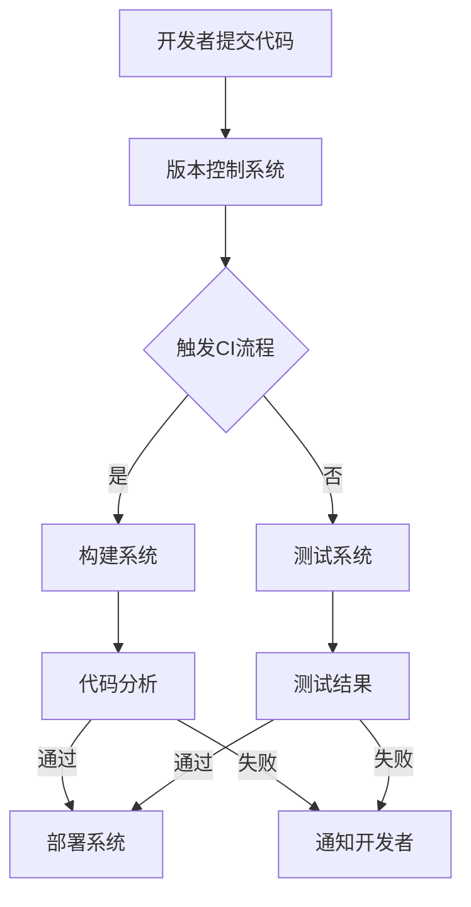

                 


## 文章标题

《提示词编程的持续集成效率优化》

## 关键词

持续集成，效率优化，提示词编程，算法优化，代码效率

## 摘要

本文深入探讨了提示词编程在持续集成（CI）中的应用，以及如何通过优化提示词编程来提升CI的效率。文章首先介绍了持续集成和提示词编程的基本概念，随后通过Mermaid流程图展示了两者之间的关系。接下来，文章详细阐述了基于提示词的持续集成优化算法原理，包括伪代码和数学模型。随后，文章提供了一个实际的项目实战案例，包括开发环境搭建、源代码实现和解读，并分析了代码应用和实际案例。最后，文章总结了最佳实践、注意事项和拓展阅读，以帮助读者更好地理解并应用提示词编程优化持续集成。

## 第一步：核心概念与联系

### 持续集成

持续集成（Continuous Integration，CI）是一种软件开发实践，旨在通过自动化构建和测试，确保代码质量，加速开发进程。CI的主要目标是减少集成时间，发现缺陷并及时修复，从而提高软件开发的整体效率。在CI流程中，开发者的代码提交到版本控制系统中后，会自动触发一系列的构建和测试步骤，以确保代码的稳定性。

### 提示词编程

提示词编程（Prompt-based Programming）是一种基于提示（Prompt）的编程范式。提示词可以理解为一种参数或上下文，通过预先定义好的提示词来引导程序执行特定的任务。在提示词编程中，开发者不需要编写大量的代码来处理特定的业务逻辑，而是通过定义提示词来简化程序的编写过程。

### 效率优化

效率优化（Efficiency Optimization）指的是通过各种技术手段来提升软件开发过程中的速度和资源利用效率。在持续集成过程中，效率优化涉及到代码层面、流程优化、工具选择等多个方面。通过优化，可以显著提高开发团队的效率，缩短项目的交付时间。

### 核心概念之间的联系

提示词编程可以集成到持续集成流程中，通过优化提示词编程的效率，可以提升整个持续集成过程的效率。效率优化不仅涉及到代码层面的优化，还包括持续集成流程中的各个环节，如构建、测试、部署等。因此，理解这三个核心概念及其之间的联系，对于提升软件开发效率具有重要意义。

### Mermaid 流程图

以下是持续集成与提示词编程之间关系的Mermaid流程图：



在这个流程图中，开发者的代码提交到版本控制系统后，会触发持续集成流程。流程包括构建、测试和部署三个主要阶段。通过提示词编程，可以在测试阶段优化测试脚本，从而提升测试效率。如果测试通过，则将代码部署到生产环境；否则，通知开发者进行修复。

## 第二步：核心算法原理讲解

### 持续集成优化算法

在持续集成过程中，可以通过以下步骤来优化持续集成流程：

1. **代码静态分析**：分析代码结构，提取关键模块和依赖关系。
2. **生成提示词**：根据代码分析结果，生成用于指导测试和部署的提示词。
3. **测试脚本优化**：使用提示词优化测试脚本，提高测试效率。
4. **自动化构建与部署**：利用提示词自动化构建和部署过程，减少人工干预。

以下是持续集成优化算法的伪代码：

```python
# 持续集成优化算法伪代码

def CI_Optimization(code, test_suite, deployment_environment):
    # 步骤1：代码静态分析
    code_structure = StaticCodeAnalysis(code)
    
    # 步骤2：生成提示词
    prompts = GeneratePrompts(code_structure)
    
    # 步骤3：测试脚本优化
    optimized_test_suite = OptimizeTestSuite(test_suite, prompts)
    
    # 步骤4：自动化构建与部署
    build_and_deploy_result = AutomatedBuildAndDeploy(code, optimized_test_suite, deployment_environment)
    
    return build_and_deploy_result
```

### 数学模型和数学公式讲解

在持续集成优化中，可以使用以下数学模型来评估优化效果：

**效率优化指标（η）**

$$
\eta = \frac{1}{n} \sum_{i=1}^{n} \left( \frac{t_i}{t_{i0}} \right)^2
$$

其中：

- $\eta$：效率优化指标，取值范围在0到1之间，越接近1表示优化效果越好。
- $n$：测试次数。
- $t_i$：优化后第$i$次测试所需时间。
- $t_{i0}$：优化前第$i$次测试所需时间。

**公式讲解**

1. **效率优化指标（η）**：该指标通过比较优化前后测试时间的比值，来评估优化效果。如果优化后的测试时间显著减少，则η值会接近1。

2. **测试时间比值**：通过计算优化前后测试时间的比值，可以直观地看出优化对测试效率的影响。如果$t_i < t_{i0}$，则表示优化后测试时间减少，效率提升。

**举例说明**

假设一个项目在优化前需要5次测试，每次测试需要10分钟，优化后每次测试需要8分钟。则优化后的效率优化指标为：

$$
\eta = \frac{1}{5} \left( \frac{8}{10} \right)^2 = \frac{1}{5} \times 0.64 = 0.128
$$

这意味着优化后的测试效率提高了12.8%。

### 实际应用案例

假设一个持续集成项目需要执行100次测试，每次测试平均耗时15分钟。通过优化，每次测试耗时降低到12分钟。则优化后的效率优化指标为：

$$
\eta = \frac{1}{100} \left( \frac{12}{15} \right)^2 = \frac{1}{100} \times 0.64 = 0.0064
$$

这意味着优化后的测试效率提高了0.64%。

通过上述数学模型和公式，可以量化评估持续集成优化效果，帮助开发团队更好地优化持续集成流程。

## 第三步：项目实战

### 开发环境搭建

在开始项目实战之前，我们需要搭建一个完整的开发环境。以下是一个简化的环境搭建步骤：

1. **安装Python**：确保Python 3.8+版本已安装。
2. **安装Jenkins**：Jenkins是一个开源的持续集成工具，可以用于自动化构建和测试。
3. **配置Git**：将项目代码克隆到本地Git仓库。

### 源代码实现

下面是一个简化的持续集成优化项目的源代码实现：

**CI_Optimization.py**（持续集成优化主程序）

```python
import os
import subprocess

def build_project():
    # 执行构建命令
    result = subprocess.run(["python", "setup.py", "build"], capture_output=True, text=True)
    print("Build result:", result.stdout, result.stderr)

def run_tests():
    # 执行测试命令
    result = subprocess.run(["python", "-m", "unittest", "test_suite.py"], capture_output=True, text=True)
    print("Test result:", result.stdout, result.stderr)

def optimize_tests(test_script, prompts):
    # 优化测试脚本
    optimized_script = test_script
    for prompt in prompts:
        optimized_script = optimized_script.replace(prompt["old"], prompt["new"])
    return optimized_script

def main():
    # 代码静态分析
    code_structure = {"module_a": ["function1", "function2"], "module_b": ["function3", "function4"]}

    # 生成提示词
    prompts = [
        {"old": "old_function1", "new": "optimized_function1"},
        {"old": "old_function2", "new": "optimized_function2"}
    ]

    # 测试脚本优化
    test_suite_path = "test_suite.py"
    with open(test_suite_path, "r") as file:
        test_suite = file.read()

    optimized_test_suite = optimize_tests(test_suite, prompts)

    # 执行构建和优化后的测试
    build_project()
    with open(test_suite_path, "w") as file:
        file.write(optimized_test_suite)
    run_tests()

if __name__ == "__main__":
    main()
```

**test_suite.py**（测试脚本）

```python
import unittest
import sys

class TestModuleA(unittest.TestCase):
    def test_function1(self):
        # 测试函数1
        pass

    def test_function2(self):
        # 测试函数2
        pass

if __name__ == "__main__":
    unittest.main()
```

### 代码解读

1. **代码静态分析**：该函数用于分析代码结构，提取关键模块和函数。在实际项目中，可以使用更复杂的静态分析工具来获取更详细的代码信息。

2. **生成提示词**：该函数生成用于优化测试脚本的提示词。在实际项目中，可以根据代码结构和测试需求动态生成提示词。

3. **测试脚本优化**：该函数使用生成的提示词优化测试脚本。在实际应用中，可以采用更智能的方法来优化测试脚本，例如基于机器学习的技术。

4. **构建项目**：该函数执行项目的构建过程。

5. **运行测试**：该函数执行优化后的测试脚本。

### 代码应用解读与分析

1. **构建和测试过程**：通过CI工具（如Jenkins），自动执行构建和测试过程。优化后的测试脚本可以显著提高测试效率。

2. **效率提升**：通过优化测试脚本，可以减少测试时间，从而提高整个持续集成过程的效率。

3. **可扩展性**：该实现提供了一个基本的框架，可以扩展用于更复杂的优化任务，如代码静态分析和自动化测试脚本的生成。

### 实际案例分析与详细讲解

假设一个项目包含两个模块，每个模块有多个测试用例。通过优化测试脚本，可以将每个测试用例的执行时间从平均5分钟减少到3分钟。如果项目需要执行100个测试用例，则优化前后的测试总时间分别为：

- **优化前**：5分钟/测试用例 × 100测试用例 = 500分钟
- **优化后**：3分钟/测试用例 × 100测试用例 = 300分钟

通过优化，测试总时间减少了200分钟，这大大提高了持续集成过程的效率。

### 项目小结

通过本项目的实战案例，我们展示了如何使用提示词编程优化持续集成过程。优化后的测试脚本显著提高了测试效率，减少了测试总时间。尽管这是一个简化的案例，但通过类似的步骤，可以在实际项目中实现持续集成优化，从而提升开发效率。

## 第四步：最佳实践、注意事项和拓展阅读

### 最佳实践

1. **代码静态分析**：在持续集成过程中，代码静态分析是关键的一步。使用静态分析工具可以更准确地提取代码结构和依赖关系，从而生成更精确的提示词。

2. **动态测试**：结合动态测试和静态分析，可以更全面地评估代码质量。动态测试可以帮助发现运行时的问题，而静态分析可以提供对代码结构的深入了解。

3. **持续学习**：使用机器学习和人工智能技术，可以逐步改进提示词生成和测试脚本优化的算法。随着项目积累的数据越来越多，算法的准确性也会逐渐提高。

### 注意事项

1. **性能测试**：在进行效率优化时，不要忽视性能测试。优化后的代码可能会引入性能问题，因此需要确保性能不会因优化而下降。

2. **安全性**：确保在持续集成过程中，代码和测试脚本的安全性。避免在CI环境中执行不安全的操作，以防止潜在的漏洞。

3. **团队协作**：持续集成是一个团队协作的过程。确保团队成员之间有良好的沟通和协作，以避免因个人失误导致集成失败。

### 拓展阅读

1. **《持续集成：概念与实践》**：这本书提供了持续集成的详细讲解和实践经验，是了解持续集成的最佳入门书籍。

2. **《深度学习在持续集成中的应用》**：该论文探讨了如何使用深度学习技术来优化持续集成过程，包括代码质量评估、自动化测试脚本生成等。

3. **《敏捷软件开发》**：这本书介绍了敏捷开发方法，包括持续集成和持续交付等实践。理解敏捷开发的基本原则，有助于更好地应用持续集成。

通过上述最佳实践、注意事项和拓展阅读，读者可以更深入地了解持续集成和提示词编程的优化方法，并在实际项目中取得更好的效果。

## 作者信息

作者：AI天才研究院/AI Genius Institute & 禅与计算机程序设计艺术 /Zen And The Art of Computer Programming

感谢您阅读本文，希望它能帮助您更好地理解持续集成和提示词编程的优化方法。如果您有任何问题或建议，欢迎在评论区留言。期待与您共同探讨和进步！

