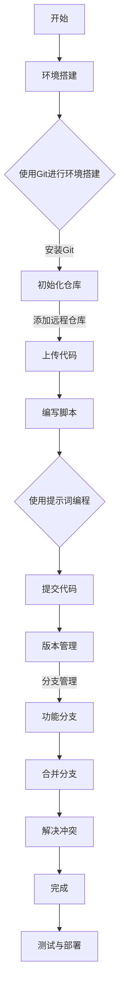

                 

### 文章标题

# 《提示词编程的版本控制与协作机制》

### 关键词

- 版本控制
- 提示词编程
- 协作机制
- Git
- SVN
- 自动化脚本
- 数据处理
- 机器学习

### 摘要

本文旨在探讨提示词编程与版本控制及协作机制的有机结合，分析其在现代软件开发中的应用和重要性。通过介绍版本控制与协作机制的基本概念、类型及操作，深入探讨提示词编程的基础知识及其优势。本文将进一步阐述如何利用版本控制系统管理提示词代码，实施有效的版本控制与协作，并通过实际案例展示其应用场景。最后，本文还将展望版本控制与协作机制的未来发展，为读者提供有价值的参考和借鉴。

## 第1章 引言

### 1.1 版本控制与协作机制概述

版本控制（Version Control），又称源代码管理（Source Code Management，简称SCM），是一种用于追踪源代码变更的机制，确保代码的一致性和可追溯性。协作机制则是团队成员之间进行代码共享、协作开发、冲突解决和协作管理的策略和工具。二者在现代软件开发中扮演着至关重要的角色。

版本控制起源于20世纪60年代，最初是为了解决多个开发人员同时修改同一代码文件时出现的冲突问题。随着软件规模的不断扩大，版本控制逐渐发展成为软件开发过程中不可或缺的一部分。版本控制系统能够记录代码的每一次修改，包括谁修改了什么、何时修改以及修改的具体内容，从而使得代码的可追溯性和可复现性得以保障。

协作机制则是为了解决多人在同一项目上协同工作的问题。通过协作机制，开发人员可以共享代码、共同开发功能，并在需要时进行有效的冲突解决。协作机制不仅提高了开发效率，也保证了代码的质量和稳定性。

### 1.2 书籍目的与读者对象

本文的目的是为软件开发者、项目管理者和对版本控制与协作机制感兴趣的读者提供一份全面而深入的指南。通过本文，读者将能够：

1. 理解版本控制与协作机制的基本概念和重要性。
2. 掌握不同类型版本控制系统的特点和操作。
3. 理解提示词编程的核心概念和应用场景。
4. 学会使用版本控制系统管理提示词代码，进行有效的版本控制和协作。
5. 了解版本控制与协作机制的最新发展趋势和未来方向。

本文适用于具有基本编程知识和技术背景的读者，无论您是初学者还是经验丰富的开发者，都可以通过本文获取到有价值的知识和经验。

### 1.3 本书结构与内容安排

本书分为八个章节，各章节内容安排如下：

- **第1章 引言**：介绍版本控制与协作机制的基本概念，阐述书籍的目的与读者对象。
- **第2章 版本控制基础**：深入探讨版本控制的基本概念、系统类型、操作和冲突解决。
- **第3章 提示词编程基础**：介绍提示词编程的基本概念、核心概念和应用场景。
- **第4章 版本控制与提示词编程的结合**：探讨如何使用版本控制系统管理提示词代码，实施有效的版本控制和协作。
- **第5章 版本控制工具介绍**：详细介绍Git和SVN两种常见的版本控制系统。
- **第6章 提示词编程与协作机制实践**：通过实际案例展示提示词编程与版本控制的结合。
- **第7章 版本控制与协作机制的未来发展趋势**：展望版本控制与协作机制的最新发展趋势和未来方向。
- **第8章 总结与展望**：对全文内容进行总结，展望未来研究方向。

通过本书的阅读，读者将能够全面掌握版本控制与协作机制，特别是在提示词编程领域的应用，为今后的软件开发提供有力的支持和保障。

### 2.1 版本控制的基本概念

版本控制，亦称为源代码管理（Source Code Management，简称SCM），是一种用于追踪源代码变更、确保代码一致性、可追溯性和可复现性的机制。其核心目标是通过记录代码的每次修改，包括修改者、修改时间和修改内容，使得开发团队能够有效地管理代码库，防止代码丢失或版本混乱。

版本控制起源于20世纪60年代，当时随着计算机技术的发展，软件规模逐渐扩大，多个开发人员开始同时工作在同一项目上。为了解决多人在同一代码文件上协作时出现的冲突和代码版本管理问题，版本控制系统应运而生。早期的版本控制系统主要是集中式的，例如RCS（GNU RCS）和CVS（Concurrent Versions System）。这些系统通过一个中心服务器来存储和管理代码库，开发人员在本地对代码进行修改后，需要提交到服务器以更新版本库。

随着时间的推移，版本控制系统逐渐演变为分布式系统，如Git和Mercurial。分布式版本控制系统（DVCS）不再依赖于中心服务器，每个开发者的本地都保存了一份完整的代码库。这使得开发团队可以独立工作，无需频繁地与服务器交互，极大地提高了协作效率和灵活性。

版本控制系统的基本概念包括以下几个核心要素：

1. **版本**：版本是代码库中的一次完整状态，包括所有文件和文件夹。每个版本都有一个唯一的标识，通常是一个递增的数字或哈希值。
2. **提交**：提交是代码变更的基本单位，代表了一次对代码库的修改。每次提交都会记录修改者的信息、提交的时间和提交的具体内容。
3. **分支**：分支是代码库中的一个独立副本，允许开发人员在不同的路径上独立开发。通过分支，开发人员可以同时进行多个功能或修复的开发，而不会影响到主分支。
4. **合并**：合并是将两个或多个分支的更改合并到一个分支上的过程。合并的目的是将多个开发人员的改动整合到一起，确保代码的一致性。
5. **标签**：标签是用于标记特定版本的一种机制，通常用于标记发布版本或里程碑。通过标签，开发人员可以轻松地回滚到特定的版本。
6. **仓库**：仓库是存储代码库的容器，可以是本地的，也可以是远程的。仓库中包含了所有的版本历史、分支和标签。

版本控制系统的主要作用包括：

1. **追踪变更**：版本控制系统能够记录每一次代码的修改，包括修改者、修改时间和修改内容，使得开发团队能够清楚地了解代码库的变更历史。
2. **确保一致性**：版本控制系统能够确保代码库的一致性，防止多人同时修改同一文件时出现冲突。
3. **支持回滚**：通过版本控制系统，开发人员可以轻松地回滚到之前的版本，以解决紧急问题或修复错误。
4. **支持协同工作**：版本控制系统能够支持多个开发人员同时工作，通过分支和合并机制，实现代码的协同开发。
5. **提供审计和合规性**：版本控制系统能够提供详细的代码变更记录，用于审计和合规性检查。

总之，版本控制是现代软件开发中不可或缺的一部分，它不仅提高了开发效率和代码质量，还保障了代码的一致性和可追溯性。

### 2.2 版本控制系统的类型

版本控制系统主要分为两大类：集中化版本控制系统（Centralized Version Control System，CVCS）和分布式版本控制系统（Distributed Version Control System，DVCS）。这两类系统在架构、操作方式和适用场景上有所不同。

#### 2.2.1 中央化版本控制系统

集中化版本控制系统（CVCS）以一个中心服务器为核心，所有开发人员的代码变更都需要提交到服务器进行管理和同步。常见的CVCS包括RCS、CVS、SVN等。

1. **架构特点**：
   - 中心服务器：CVCS通过一个中心服务器存储和管理所有代码库。
   - 本地仓库：开发人员在本地的机器上创建一个本地仓库，用于保存代码的本地副本。
   - 依赖服务器：开发人员的所有操作都需要通过服务器进行，如提交、更新等。

2. **操作方式**：
   - **检出（Checkout）**：开发人员从服务器检出代码到本地仓库，开始本地开发。
   - **提交（Commit）**：开发人员将本地修改提交到服务器，更新服务器上的代码库。
   - **更新（Update）**：开发人员从服务器更新本地仓库，获取最新的代码更改。

3. **优缺点**：
   - 优点：操作简单，易于管理和维护，适合小型团队或单机操作。
   - 缺点：依赖中心服务器，若服务器故障或网络中断，开发工作将受到影响。

#### 2.2.2 分布式版本控制系统

分布式版本控制系统（DVCS）不再依赖于中心服务器，每个开发者的本地都保存了一份完整的代码库。常见的DVCS包括Git、Mercurial等。

1. **架构特点**：
   - 分布式仓库：每个开发人员都有一个本地仓库，包含完整的代码库历史。
   - 仓库同步：开发人员之间通过上传和下载代码库的部分内容进行同步。
   - 代码独立：每个开发人员可以在本地进行独立的代码开发，不受其他开发人员的影响。

2. **操作方式**：
   - **检出（Clone）**：开发人员克隆整个代码库到本地仓库，开始本地开发。
   - **提交（Commit）**：开发人员将本地修改提交到本地仓库，记录变更。
   - **推送（Push）**：开发人员将本地仓库的更改推送至远程仓库，与团队共享。
   - **拉取（Pull）**：开发人员从远程仓库拉取其他开发人员的更改，更新本地仓库。

3. **优缺点**：
   - 优点：去中心化架构，支持并行开发，适用于大型团队和分布式工作环境。
   - 缺点：操作相对复杂，需要更多的磁盘空间和计算资源。

#### 比较与选择

CVCS和DVCS各有优缺点，选择哪种版本控制系统取决于项目需求和团队规模。

- **项目规模**：对于小型项目和单机操作，CVCS更为简单和适用；对于大型项目和分布式团队，DVCS更为灵活和高效。
- **开发模式**：CVCS更适合顺序开发和单点故障承受能力较强的项目；DVCS更适合并行开发和容错能力较强的项目。
- **资源消耗**：DVCS由于需要保存完整的代码库历史，需要更多的磁盘空间和计算资源，而CVCS资源消耗相对较低。

总之，版本控制系统类型的选取应根据项目需求和团队规模进行权衡，以实现高效的代码管理和协同开发。

### 2.3 版本控制的基本操作

版本控制系统的核心功能是通过一系列基本操作来管理代码库的变更，这些操作包括检出（Checkout）、提交（Commit）、更新（Update）和冲突解决（Conflict Resolution）。以下将详细介绍这些操作及其具体实现。

#### 2.3.1 检出（Checkout）

检出（Checkout）是指将版本控制系统中某个特定版本或分支的代码库复制到本地工作区，以便开发者进行修改和开发。检出操作通常用于以下场景：

1. **开始新项目**：当开发者需要开始一个新的项目时，首先需要从版本控制系统检出项目代码到本地工作区。
2. **切换分支**：在开发过程中，开发者可能需要切换到不同的分支进行功能开发，此时需要检出目标分支的代码。
3. **恢复旧版本**：如果需要回滚到之前的版本，开发者可以通过检出特定版本来恢复代码库。

检出操作的一般命令格式如下：

```bash
$ git checkout <commit-hash> # 检出特定版本
$ git checkout <branch-name> # 检出特定分支
```

例如，假设我们使用Git作为版本控制系统，检出分支`feature/new-features`的操作如下：

```bash
$ git checkout feature/new-features
```

此操作将切换到`feature/new-features`分支，并将代码库恢复到该分支的最新状态。

#### 2.3.2 提交（Commit）

提交（Commit）是将开发者对代码库的修改记录到版本控制系统中的操作。每次提交都会生成一个唯一的提交ID，记录提交者、提交时间和提交说明等信息。提交操作是版本控制系统的核心功能之一，以下是提交操作的一般流程：

1. **添加修改**：开发者首先需要将需要提交的文件添加到暂存区（Index）。
2. **编辑提交说明**：开发者编写本次提交的说明，描述提交的修改内容和目的。
3. **执行提交**：将暂存区的修改提交到本地仓库。

提交操作的一般命令格式如下：

```bash
$ git add <file> # 添加文件到暂存区
$ git commit -m "Commit message" # 提交暂存区的修改
```

例如，提交一个名为`fix/bug123`的修复提交，操作如下：

```bash
$ git add fix/bug123.c
$ git commit -m "Fixed bug #123: Incorrect calculations"
```

此操作将`fix/bug123.c`文件添加到暂存区，并提交此次修改，提交说明为“Fixed bug #123: Incorrect calculations”。

#### 2.3.3 更新（Update）

更新（Update）是指将版本控制系统中的最新代码库同步到本地工作区的操作。开发者通过更新操作可以获取其他开发者的最新修改，确保本地代码库与远程仓库保持一致。更新操作通常在以下场景下使用：

1. **获取最新代码**：开发者需要获取远程仓库的最新代码，以便查看或使用其他开发者的修改。
2. **合并分支**：在合并分支时，需要先更新本地仓库，以获取最新的代码。

更新操作的一般命令格式如下：

```bash
$ git pull # 从远程仓库获取并合并代码
```

例如，将远程仓库`origin`的最新代码合并到当前分支，操作如下：

```bash
$ git pull origin main
```

此操作将从远程仓库`origin`的`main`分支获取最新代码，并合并到当前分支。

#### 2.3.4 冲突解决（Conflict Resolution）

冲突解决是指当两个或多个开发者的代码修改发生冲突时，如何通过手动或自动方式解决这些冲突，以确保代码库的一致性。冲突通常发生在以下场景：

1. **合并分支**：在合并分支时，如果两个分支对同一文件的修改发生冲突，将触发合并冲突。
2. **推送更改**：当开发者尝试将本地更改推送至远程仓库时，如果远程仓库中的代码与本地代码冲突，将触发推送冲突。

冲突解决的一般步骤如下：

1. **检测冲突**：版本控制系统能够自动检测到冲突，并标记冲突文件。
2. **手动解决冲突**：开发者需要手动打开冲突文件，查看冲突区域，并决定如何合并这些修改。
3. **保存修改**：开发者解决冲突后，需要保存修改，并提交冲突解决的修改。

冲突解决的一般命令格式如下：

```bash
$ git add <file> # 添加已解决冲突的文件
$ git commit -m "Resolved conflicts in <file>" # 提交冲突解决的修改
```

例如，解决一个名为`conflict/file.c`的冲突文件，操作如下：

```bash
$ git add conflict/file.c
$ git commit -m "Resolved conflicts in conflict/file.c"
```

此操作将添加已解决冲突的文件`conflict/file.c`到暂存区，并提交此次冲突解决的修改。

通过了解和掌握这些版本控制的基本操作，开发者能够更加高效地进行代码管理和协作开发，确保代码库的一致性和可追溯性。

### 3.1 提示词编程概述

提示词编程（Prompt Programming）是一种通过提供明确的提示（Prompt）来引导系统生成预期响应（Response）的编程方法。这种方法在自然语言处理（NLP）和人工智能（AI）领域有着广泛的应用，尤其是在聊天机器人、自动问答系统和信息抽取等方面。提示词编程的核心思想是利用人工设计的提示来引导模型生成高质量的响应，从而提高系统与用户的交互体验。

#### 提示词编程的应用领域

1. **聊天机器人**：提示词编程可以用于构建智能聊天机器人，通过提供明确的提示，机器人可以生成与用户意图相关的响应。例如，在客服机器人中，提示词可以引导机器人识别用户的问题，并提供适当的解答。
   
2. **自动问答系统**：在自动问答系统中，提示词编程可以帮助系统理解用户的问题，并从大量数据中提取相关答案。通过设计合适的提示，系统能够更准确地识别用户意图，并提供高质量的回答。

3. **信息抽取**：在信息抽取任务中，提示词编程可以帮助系统从非结构化数据中提取结构化信息。例如，在新闻摘要生成中，提示词可以引导系统提取关键信息，并生成简洁的摘要。

4. **文本生成**：提示词编程还可以用于生成文本，如生成文章摘要、编写代码注释等。通过提供明确的提示，系统可以生成符合人类语言习惯的文本。

#### 提示词编程的优势

1. **提高交互质量**：通过设计合理的提示词，系统能够生成更符合用户意图的响应，从而提高交互体验。

2. **增强可解释性**：提示词编程使得系统生成响应的过程更具可解释性，开发人员可以更清晰地理解系统的工作原理。

3. **灵活性和扩展性**：提示词编程允许开发者根据不同的应用场景和需求，灵活地设计提示词，从而适应多种任务场景。

4. **减少训练数据需求**：在某些情况下，通过有效的提示词，系统可以在较少的训练数据下实现良好的性能，降低训练成本。

#### 提示词编程的核心概念

1. **提示（Prompt）**：提示是引导系统生成预期响应的输入信息。设计合理的提示词对于系统生成高质量的响应至关重要。

2. **响应（Response）**：响应是系统根据提示生成的输出结果。响应的质量直接影响用户对系统的满意度。

3. **模型**：提示词编程通常依赖于深度学习模型，如变换器模型（Transformer）和生成对抗网络（GAN）。这些模型可以接受提示并生成响应。

#### 提示词编程的基本流程

1. **设计提示词**：根据任务需求和目标，设计合理的提示词。提示词应简洁明了，能够引导系统生成预期的响应。

2. **训练模型**：使用大量训练数据训练深度学习模型。训练过程中，模型会学习如何根据提示生成高质量的响应。

3. **生成响应**：将设计好的提示词输入到训练好的模型中，模型根据提示生成响应。

4. **评估与优化**：评估系统生成的响应是否符合预期，并根据评估结果对提示词和模型进行调整和优化。

通过以上流程，开发者可以构建高效的提示词编程系统，实现与用户的良好互动。

### 3.2 提示词编程的核心概念

提示词编程的核心概念包括提示（Prompt）、响应（Response）和上下文（Context），这些概念共同构成了提示词编程的基础，使得系统能够有效地理解和生成相应的响应。

#### 3.2.1 提示（Prompt）

提示（Prompt）是提示词编程中至关重要的输入信息，它用于引导系统生成预期的响应。一个良好的提示应具备以下特点：

1. **明确性**：提示应清晰明确，避免歧义，以便系统能够准确地理解用户的意图。
2. **简洁性**：提示应简洁明了，避免冗长复杂的描述，以便系统快速生成响应。
3. **相关性**：提示应与任务目标相关，确保系统能够生成与用户意图一致的响应。

提示的设计直接影响到系统生成响应的质量。例如，在构建一个聊天机器人时，一个良好的提示可能是“请描述您遇到的问题”，而一个较差的提示可能是“您有什么想说的吗？”前者明确引导用户描述问题，而后者过于宽泛，可能导致系统生成不相关的响应。

#### 3.2.2 响应（Response）

响应（Response）是系统根据提示生成的输出结果，它是提示词编程的直接体现。一个高质量的响应应具备以下特点：

1. **准确性**：响应应准确反映用户意图，提供用户所需的信息或解决方案。
2. **相关性**：响应应与提示紧密相关，确保系统生成的每个响应都与用户的提问或需求相关。
3. **完整性**：响应应完整地回答用户的问题，避免遗漏关键信息。

响应的质量直接决定了用户对系统的满意度。例如，在一个自动问答系统中，一个良好的响应可能是“您的问题我已经理解，以下是答案：[答案内容]”，而一个较差的响应可能是“我不知道”，这会使用户感到失望。

#### 3.2.3 上下文（Context）

上下文（Context）是指与任务相关的背景信息，它对提示词编程具有重要意义。上下文信息可以帮助系统更好地理解用户的意图，提高响应的准确性和相关性。

1. **历史对话**：在聊天机器人中，历史对话记录可以作为上下文信息，帮助系统理解用户的长期意图和偏好。
2. **用户行为**：用户的行为数据，如搜索历史和浏览记录，也可以作为上下文信息，帮助系统生成更个性化的响应。
3. **任务目标**：明确任务目标有助于系统理解当前的任务场景，从而生成更相关的响应。

例如，在一个购物推荐系统中，用户的历史购买记录和浏览记录可以作为上下文信息，帮助系统更准确地推荐用户可能感兴趣的商品。

#### 提示、响应和上下文的关系

提示、响应和上下文之间相互关联，共同构成了提示词编程的核心。提示用于引导系统理解用户的意图，上下文提供背景信息，帮助系统更好地理解用户的意图，而响应则是系统对用户意图的回应。一个有效的提示词编程系统需要综合考虑这些因素，以确保生成高质量的响应。

1. **提示引导**：提示作为引导，帮助系统明确用户的意图，确保响应与用户需求一致。
2. **上下文补充**：上下文提供额外的信息，帮助系统更好地理解用户的意图，提高响应的准确性和相关性。
3. **响应验证**：系统生成的响应需经过验证，确保其与提示和上下文一致，提供准确和相关的信息。

通过合理设计和优化提示、响应和上下文，提示词编程系统能够更好地满足用户需求，提供高质量的交互体验。

#### 提示词编程的优势

提示词编程在多个领域展现了显著的优势，主要体现在以下几个方面：

1. **提高交互质量**：通过设计合理的提示词，系统能够更准确地理解用户的意图，生成高质量的响应。例如，在聊天机器人中，一个明确的提示“请描述您遇到的问题”比“您有什么想说的吗？”更能引导用户提供相关信息，从而提高交互质量。

2. **增强可解释性**：提示词编程使得系统生成响应的过程更具可解释性。开发人员可以清楚地看到系统如何根据提示生成响应，从而更容易理解系统的工作原理和优化方向。

3. **灵活性和扩展性**：提示词编程允许开发者根据不同的应用场景和需求，灵活地设计提示词，从而适应多种任务场景。例如，在构建不同类型的聊天机器人时，可以通过调整提示词来满足特定应用的需求。

4. **减少训练数据需求**：在某些情况下，通过有效的提示词，系统可以在较少的训练数据下实现良好的性能。例如，在问答系统中，通过设计合理的提示词，系统可以在较少的样例对话中学习到有效的问答模式，从而降低训练成本。

5. **促进人机协作**：提示词编程有助于开发者和AI系统之间的协作。通过设计提示词，开发者可以引导系统生成预期响应，从而更容易地调试和优化系统。同时，用户也能通过有效的提示词与系统进行更好的交互。

#### 提示词编程的应用场景

提示词编程在多个应用场景中展现了其强大的功能和优势，以下是一些典型的应用场景：

1. **聊天机器人**：在聊天机器人中，提示词编程可以用于引导用户并提供个性化的服务。例如，通过设计合适的提示词，机器人可以引导用户描述他们的需求，并生成相应的回复。这使得聊天机器人能够提供更高质量和个性化的用户体验。

2. **自动问答系统**：在自动问答系统中，提示词编程可以帮助系统更好地理解用户的问题，并提供准确的答案。例如，通过设计提示词“请详细描述您的问题”，系统能够收集更多的信息，从而更准确地回答用户的问题。

3. **信息抽取**：在信息抽取任务中，提示词编程可以用于指导系统从非结构化数据中提取结构化信息。例如，在新闻摘要生成中，提示词“请提取新闻的主要事件和关键信息”可以帮助系统生成简洁明了的摘要。

4. **文本生成**：在文本生成任务中，提示词编程可以用于生成文章摘要、代码注释等。例如，通过设计提示词“请编写一篇关于AI技术的摘要”，系统可以生成一篇符合要求的摘要文本。

5. **个性化推荐**：在个性化推荐系统中，提示词编程可以用于引导用户输入偏好信息，并生成个性化的推荐结果。例如，通过设计提示词“请描述您喜欢的电影类型”，系统可以更准确地推荐符合用户偏好的电影。

总之，提示词编程在多个应用场景中展现了其独特的优势，通过设计合理的提示词，系统能够更好地理解用户意图，生成高质量的响应，从而提高用户体验和系统性能。

### 3.3 提示词编程的应用场景

提示词编程在多个领域有着广泛的应用，以下将详细探讨其在自动化脚本开发、数据处理与清洗、机器学习模型调参等场景中的应用。

#### 3.3.1 自动化脚本开发

自动化脚本开发是提示词编程的一个重要应用场景。通过设计明确的提示词，开发人员可以引导系统生成执行特定任务的脚本。以下是一个自动化脚本开发的示例：

1. **需求分析**：假设我们需要编写一个自动化脚本，用于定期备份服务器上的重要数据。
   
2. **设计提示词**：设计一个提示词，用于引导系统生成备份脚本。例如，“请编写一个脚本，用于每天自动备份服务器上的重要数据到外部存储设备。”
   
3. **生成脚本**：将提示词输入到提示词编程系统，系统会生成一个符合需求的脚本。例如，生成的脚本可能包含以下内容：

   ```bash
   #!/bin/bash
   # 备份脚本
   BACKUP_DIR="/backups"
   DATE=$(date +%Y-%m-%d)
   tar -czvf ${BACKUP_DIR}/backup-${DATE}.tar.gz /data
   echo "备份完成：${BACKUP_DIR}/backup-${DATE}.tar.gz"
   ```

4. **测试与优化**：执行生成的脚本，确保其能够正确备份服务器上的重要数据。如果存在问题，可以通过调整提示词或脚本代码进行优化。

通过这个示例，可以看到提示词编程在自动化脚本开发中的应用，通过设计合理的提示词，系统能够生成执行特定任务的脚本，提高了开发效率。

#### 3.3.2 数据处理与清洗

数据处理与清洗是数据分析和机器学习任务中至关重要的一步。提示词编程可以帮助自动化这一过程，以下是一个数据处理与清洗的示例：

1. **需求分析**：假设我们需要处理一个包含大量缺失值和不一致数据的CSV文件，并对其进行清洗。
   
2. **设计提示词**：设计一个提示词，用于引导系统生成数据处理和清洗的脚本。例如，“请编写一个脚本，用于处理以下CSV文件：[文件路径]，包括去除缺失值、统一数据格式、填充缺失值等操作。”
   
3. **生成脚本**：将提示词输入到提示词编程系统，系统会生成一个符合需求的数据处理和清洗脚本。例如，生成的脚本可能包含以下内容：

   ```python
   import pandas as pd
   import numpy as np

   # 读取数据
   df = pd.read_csv('data.csv')

   # 去除缺失值
   df = df.dropna()

   # 统一数据格式
   df['date'] = pd.to_datetime(df['date'])

   # 填充缺失值
   df['sales'] = df['sales'].fillna(df['sales'].mean())

   # 保存清洗后的数据
   df.to_csv('cleaned_data.csv', index=False)
   ```

4. **测试与优化**：执行生成的脚本，确保其能够正确处理和清洗数据。如果存在问题，可以通过调整提示词或脚本代码进行优化。

通过这个示例，可以看到提示词编程在数据处理与清洗中的应用，通过设计合理的提示词，系统能够生成自动化处理和清洗数据的脚本，提高了数据处理效率。

#### 3.3.3 机器学习模型调参

机器学习模型调参是优化模型性能的重要步骤。提示词编程可以帮助自动化这一过程，以下是一个机器学习模型调参的示例：

1. **需求分析**：假设我们需要对一种机器学习模型进行调参，以优化其性能。
   
2. **设计提示词**：设计一个提示词，用于引导系统生成调参脚本。例如，“请编写一个脚本，用于自动调整以下机器学习模型的参数：[模型名称]，并优化模型性能。”
   
3. **生成脚本**：将提示词输入到提示词编程系统，系统会生成一个符合需求的调参脚本。例如，生成的脚本可能包含以下内容：

   ```python
   from sklearn.model_selection import GridSearchCV
   from sklearn.ensemble import RandomForestClassifier

   # 定义参数范围
   params = {
       'n_estimators': [100, 200, 300],
       'max_depth': [10, 20, 30],
   }

   # 创建模型
   model = RandomForestClassifier()

   # 创建网格搜索对象
   grid_search = GridSearchCV(model, params, cv=5)

   # 进行网格搜索
   grid_search.fit(X_train, y_train)

   # 获取最优参数
   best_params = grid_search.best_params_

   # 打印最优参数
   print("最优参数：", best_params)
   ```

4. **测试与优化**：执行生成的脚本，确保其能够正确调参并优化模型性能。如果存在问题，可以通过调整提示词或脚本代码进行优化。

通过这个示例，可以看到提示词编程在机器学习模型调参中的应用，通过设计合理的提示词，系统能够生成自动化调参的脚本，提高了模型调参效率。

综上所述，提示词编程在自动化脚本开发、数据处理与清洗、机器学习模型调参等多个应用场景中展现了其强大的功能和优势，通过设计合理的提示词，系统能够生成自动化和高效的脚本，提高了开发效率和质量。

### 4.1 版本控制与提示词编程的结合点

版本控制与提示词编程的结合点在于如何有效地管理提示词代码，确保其在开发过程中的可追踪性、可维护性和协作性。提示词编程的核心在于通过明确、简洁的提示词引导系统生成高质量的响应，而版本控制系统则为这一过程提供了可靠的框架和工具，以支持多人的协同工作和代码的版本管理。

首先，版本控制系统可以帮助开发者对提示词代码进行版本控制，确保每一次修改都有详细的记录，方便后续的追踪和回溯。例如，使用Git等分布式版本控制系统，开发者可以将每次对提示词文件的修改提交到远程仓库，这样不仅能够记录每次修改的历史，还可以方便地进行分支管理和合并操作。

其次，版本控制系统能够帮助团队在提示词编程过程中实现高效的协作。通过创建分支，不同的开发者可以在各自的分支上进行独立开发，不会互相干扰。完成各自的任务后，再通过合并操作将分支合并到主分支，从而实现协同工作。此外，版本控制系统还支持标签功能，可以帮助团队标记重要的里程碑或发布版本，方便后续的回滚和审计。

再次，版本控制系统提供的冲突解决机制在提示词编程中尤为重要。在多人协作的过程中，很可能会出现对同一提示词文件的不同修改，从而引发冲突。版本控制系统能够自动检测这些冲突，并提供工具帮助开发者手动或自动解决冲突，确保代码库的一致性和完整性。

最后，版本控制系统的代码审查和权限控制功能可以帮助团队确保提示词代码的质量和安全性。通过代码审查，团队能够在提交代码之前对其进行审核，及时发现潜在的问题和漏洞。权限控制则可以确保只有授权的开发者能够对代码进行修改，从而保障代码库的安全性。

总的来说，版本控制与提示词编程的结合点主要体现在以下几个方面：

1. **版本追踪**：通过版本控制系统记录提示词代码的每一次修改，确保代码库的可追溯性和可复现性。
2. **协作管理**：利用版本控制系统的分支管理和合并机制，支持多人的协同工作和代码共享。
3. **冲突解决**：通过版本控制系统的冲突解决工具，确保在多人协作过程中代码库的一致性和完整性。
4. **代码审查与权限控制**：利用版本控制系统的代码审查和权限控制功能，保障代码库的质量和安全性。

通过结合版本控制系统和提示词编程，开发团队能够更高效地管理提示词代码，确保其在开发过程中的质量和稳定性，从而提升整体开发效率和项目成功率。

#### 4.2 使用版本控制系统管理提示词代码

在使用版本控制系统（如Git）管理提示词代码时，需要遵循一系列最佳实践，以确保代码库的整洁、安全且易于维护。以下将详细讨论如何创建项目仓库、提交提示词代码、实施分支管理和协作，以及解决常见的冲突问题。

##### 4.2.1 创建项目仓库

创建项目仓库是使用版本控制系统的第一步，也是管理提示词代码的基础。以下是使用Git创建项目仓库的基本步骤：

1. **本地初始化**：在本地计算机上安装Git客户端，并初始化一个新仓库。

   ```bash
   $ git init <project-name>
   ```

   这将在当前目录下创建一个名为`<project-name>`的本地Git仓库。

2. **添加文件**：将提示词代码文件添加到本地仓库中。

   ```bash
   $ git add <prompt-file>.py
   ```

   使用`git add`命令将提示词文件添加到暂存区。

3. **提交代码**：将暂存区中的修改提交到本地仓库。

   ```bash
   $ git commit -m "Initial commit: Add prompt code"
   ```

   这条命令会将添加的文件提交到本地仓库，并附上一条提交信息，描述提交的内容。

4. **远程仓库**：将本地仓库连接到一个远程仓库，通常使用GitHub、GitLab等平台。

   ```bash
   $ git remote add origin <remote-repo-url>
   ```

   这条命令会将本地仓库与远程仓库关联起来。

5. **上传代码**：将本地仓库的代码上传到远程仓库。

   ```bash
   $ git push -u origin master
   ```

   这条命令会将本地主分支的代码上传到远程仓库，并初始化一个远程主分支。

##### 4.2.2 提交提示词代码

在开发过程中，需要定期将修改的提示词代码提交到版本控制系统，以确保代码库的同步和可追踪性。以下是提交提示词代码的步骤：

1. **修改代码**：对提示词文件进行必要的修改。

   ```python
   # 在prompt.py文件中添加新的提示词
   def new_prompt():
       return "请问您有什么问题，我将竭诚为您解答。"
   ```

2. **添加变更**：将修改的文件添加到暂存区。

   ```bash
   $ git add <prompt-file>.py
   ```

3. **提交变更**：将暂存区的修改提交到本地仓库。

   ```bash
   $ git commit -m "Update: Add new prompt function"
   ```

4. **推送变更**：将本地仓库的变更推送至远程仓库。

   ```bash
   $ git push origin master
   ```

通过这些步骤，开发人员可以有效地管理和同步提示词代码。

##### 4.2.3 协作与分支管理

在多人协作开发中，分支管理是至关重要的。以下是如何使用Git进行分支管理和协作的步骤：

1. **创建分支**：为特定功能或任务创建一个新的分支。

   ```bash
   $ git checkout -b feature/new-prompt
   ```

   这条命令将创建一个新的分支`feature/new-prompt`，并切换到该分支进行开发。

2. **开发功能**：在分支上完成功能的开发，并进行必要的测试。

   ```python
   # 在新的prompt文件中添加功能
   def new_prompt():
       return "请问您有什么问题，我将竭诚为您解答。"
   ```

3. **提交代码**：将分支上的修改提交到本地仓库。

   ```bash
   $ git commit -m "Feature: Add new prompt function"
   ```

4. **推送分支**：将分支上的代码推送至远程仓库。

   ```bash
   $ git push -u origin feature/new-prompt
   ```

5. **协作开发**：其他开发人员可以在各自的分支上进行独立开发，并在开发完成后合并到主分支。

6. **合并分支**：将功能分支合并到主分支。

   ```bash
   $ git checkout master
   $ git merge feature/new-prompt
   ```

   这条命令将`feature/new-prompt`分支的更改合并到主分支`master`。

##### 4.2.4 冲突解决

在多人协作过程中，很可能会出现代码冲突，特别是在合并分支时。以下是解决冲突的步骤：

1. **检测冲突**：在合并分支前，Git会自动检测潜在的冲突。

   ```bash
   $ git fetch
   $ git checkout master
   $ git merge feature/new-prompt
   ```

   如果检测到冲突，Git会显示冲突文件。

2. **解决冲突**：手动打开冲突文件，查看冲突区域，并进行必要的修改。

   ```text
   <<<<<<< HEAD
   # 在这里解决冲突
   ======== 
   # 冲突内容
   >>>>>>> feature/new-prompt
   ```

3. **保存修改**：解决冲突后，保存文件并添加到暂存区。

   ```bash
   $ git add <conflicted-file>
   ```

4. **提交修改**：提交冲突解决的修改。

   ```bash
   $ git commit -m "Merge: Resolve conflicts in <conflicted-file>"
   ```

5. **推送修改**：将合并后的代码推送至远程仓库。

   ```bash
   $ git push origin master
   ```

通过以上步骤，开发团队能够有效地管理提示词代码，确保代码库的一致性和可维护性。同时，合理的分支管理和冲突解决策略也是确保协作顺利进行的重要因素。

### 4.3 版本控制与提示词编程的最佳实践

在版本控制和提示词编程的实际应用中，实施一系列最佳实践可以显著提升开发效率和代码质量。以下是几项关键的最佳实践，包括提交信息的规范化、分支策略和协作模式，以及冲突解决策略。

#### 4.3.1 提交信息的规范化

良好的提交信息是版本控制系统的重要组成部分，它能够帮助团队追踪代码变更的历史，便于问题的定位和问题的追踪。以下是一些提交信息规范化的最佳实践：

1. **统一格式**：使用一致的格式编写提交信息，通常建议使用以下格式：
   ```
   <type> <scope>: <description>
   ```
   - `<type>`：提交的类型，如`fix`、`feat`、`docs`、`style`、`refactor`、`perf`、`test`、`chore`。
   - `<scope>`：提交影响的范围，如`bugfix`、`newfeature`、`docs`、`style`、`test`、`config`等。
   - `<description>`：简要描述提交的具体内容。

2. **简洁明了**：提交信息应简洁明了，避免冗长和模糊的描述。确保每个提交都清晰地描述了变更的目的和内容。

3. **避免空提交**：避免提交无意义的空变更，每个提交都应包含实际的代码改动。

4. **使用动词开头**：提交信息应以动词开头，例如“Fix bug in prompt generation”而不是“Bug fix in prompt generation”。

#### 4.3.2 分支策略与协作模式

在多人的协作开发中，合理的分支策略和协作模式是确保项目顺利进行的关键。以下是几种常用的分支策略和协作模式：

1. **主分支（Master）**：主分支是项目的核心分支，通常包含了生产环境的代码。在主分支上不应该直接进行开发工作，所有功能开发应在独立的功能分支上进行。

2. **功能分支（Feature）**：功能分支用于实现特定的功能。在功能分支完成开发后，通过合并操作将更改合并到主分支。

3. **热修复分支（Hotfix）**：当生产环境中出现严重问题时，应创建热修复分支进行修复。修复完成后，将修复代码合并到主分支和所有相关功能分支。

4. **协作模式**：
   - **Git Flow**：Git Flow是一种基于Git的分支模型，用于管理项目的不同阶段，包括开发、发布和协作。
   - **GitHub Flow**：GitHub Flow是一种简化版的Git Flow，适用于小型项目和快速迭代的项目。它主要使用主分支（Master）和功能分支（Feature），每个功能分支在开发完成后直接合并到主分支。

#### 4.3.3 冲突解决策略

在多人协作过程中，代码冲突是不可避免的。有效的冲突解决策略可以确保项目进度不受影响，以下是几个关键点：

1. **提前沟通**：在开发过程中，团队成员应保持良好的沟通，了解彼此的工作进度和修改内容，以减少冲突的发生。

2. **及时解决**：冲突发生后，应尽快解决，避免长时间积累未解决的冲突。通常，冲突解决应尽快进行，以减少对后续工作的干扰。

3. **详细记录**：在解决冲突时，详细记录解决的过程和结果，以便未来参考和审查。

4. **工具辅助**：使用版本控制系统的冲突解决工具，如Git的`git mergetool`，可以自动检测冲突并提供图形界面帮助用户解决。

5. **保持简洁**：在解决冲突时，尽量保持代码的简洁和一致性，避免引入不必要的复杂性。

6. **测试验证**：在解决冲突后，进行充分的测试，确保代码库的一致性和功能完整性。

通过实施这些最佳实践，开发团队能够更好地管理提示词代码，确保项目的稳定性和可靠性，从而提高整体开发效率和项目质量。

### 5.1 Git：分布式版本控制系统

Git 是目前最流行且功能强大的分布式版本控制系统之一，它由 Linus Torvalds 创建，用于管理 Linux 内核的开发。Git 的核心特点包括分布式存储、快速性能、高效分支管理和强大的网络功能。下面我们将详细介绍 Git 的基本操作、分支管理以及协同工作。

#### 5.1.1 Git 的基本操作

Git 的基本操作主要包括仓库的初始化、文件添加、提交、分支管理、合并以及发布等。以下是一些常用的 Git 命令及其简要说明：

1. **仓库初始化**：

   ```bash
   $ git init
   ```

   该命令用于初始化一个新的 Git 仓库。执行此命令后，当前目录会被转换为 Git 仓库。

2. **添加文件**：

   ```bash
   $ git add <file>
   ```

   该命令将文件添加到暂存区，准备进行提交。

3. **提交代码**：

   ```bash
   $ git commit -m "提交信息"
   ```

   该命令用于将暂存区中的文件提交到本地仓库。`-m` 参数后跟的是提交的描述信息。

4. **查看日志**：

   ```bash
   $ git log
   ```

   该命令显示当前分支的提交日志，包括提交哈希值、提交者、提交时间和提交信息。

5. **状态查看**：

   ```bash
   $ git status
   ```

   该命令用于查看当前仓库的状态，包括哪些文件已经被添加到暂存区、哪些文件发生了变化等。

6. **分支管理**：

   - 创建分支：

     ```bash
     $ git branch <branch-name>
     ```

   - 切换分支：

     ```bash
     $ git checkout <branch-name>
     ```

   - 删除分支：

     ```bash
     $ git branch -d <branch-name>
     ```

7. **合并分支**：

   ```bash
   $ git merge <branch-name>
   ```

   该命令用于将指定分支合并到当前分支。

8. **发布代码**：

   ```bash
   $ git push <remote-repo> <branch-name>
   ```

   该命令用于将本地仓库的代码发布到远程仓库。

#### 5.1.2 Git 的分支管理

Git 的分支管理是 Git 的一个核心功能，它允许开发者在不同的路径上独立工作，而不会影响到其他分支。以下是一些关于 Git 分支管理的详细操作：

1. **创建分支**：

   创建新分支是 Git 分支管理的基础操作。以下是如何创建新分支：

   ```bash
   $ git checkout -b <branch-name>
   ```

   这条命令会创建一个名为`<branch-name>`的新分支，并切换到该分支。使用`-b`参数可以一步完成创建和切换操作。

2. **切换分支**：

   切换分支是将工作切换到特定分支的过程。以下是如何切换分支：

   ```bash
   $ git checkout <branch-name>
   ```

   这条命令将切换到名为`<branch-name>`的分支。

3. **合并分支**：

   合并分支是将一个分支的更改合并到另一个分支。以下是如何合并分支：

   ```bash
   $ git merge <branch-name>
   ```

   这条命令将把`<branch-name>`分支的更改合并到当前分支。

4. **解决冲突**：

   在合并分支时，如果出现冲突，Git 会暂停合并过程并提示用户手动解决冲突。以下是如何解决冲突：

   ```bash
   $ git add <conflicted-file>
   $ git commit -m "Merge: Resolve conflicts in <conflicted-file>"
   ```

   解决冲突后，使用`git add`命令将解决后的文件添加到暂存区，然后使用`git commit`提交修改。

5. **删除分支**：

   删除不再需要的分支可以释放仓库空间并保持分支结构的整洁。以下是如何删除分支：

   ```bash
   $ git branch -d <branch-name>
   ```

   这条命令会删除名为`<branch-name>`的分支。

#### 5.1.3 Git 的协同工作

Git 的分布式特性使得开发团队可以轻松地在不同的地理位置进行协同工作。以下是如何在团队中协同工作的一些步骤：

1. **添加远程仓库**：

   为了与其他团队成员协作，需要将远程仓库添加到本地 Git 仓库。以下是如何添加远程仓库：

   ```bash
   $ git remote add origin <remote-repo-url>
   ```

   这条命令会将远程仓库添加为`origin`。

2. **从远程仓库获取代码**：

   ```bash
   $ git fetch
   ```

   使用`git fetch`命令可以从远程仓库获取最新的代码。

3. **拉取远程仓库的更改**：

   ```bash
   $ git pull
   ```

   使用`git pull`命令可以拉取远程仓库的最新更改，并将其合并到当前分支。

4. **推送本地更改到远程仓库**：

   ```bash
   $ git push origin <branch-name>
   ```

   使用`git push`命令可以推送本地仓库的更改到远程仓库。

5. **处理合并冲突**：

   如果在拉取或推送时出现冲突，需要手动解决冲突，然后将解决后的文件提交到远程仓库。

通过以上基本操作、分支管理和协同工作的介绍，可以看出 Git 是一个功能强大且灵活的版本控制系统，它为开发团队提供了高效的代码管理和协作工具。

#### 5.2 SVN：中央化版本控制系统

Subversion（简称 SVN）是一种中央化版本控制系统，它广泛应用于多个开发项目中。与分布式版本控制系统（如 Git）不同，SVN 的所有更改都是集中存储在服务器上，开发人员的本地只存储对服务器的链接。下面我们将详细探讨 SVN 的基本操作、版本树管理以及权限控制。

##### 5.2.1 SVN 的基本操作

SVN 的基本操作包括检出（Checkout）、提交（Commit）、更新（Update）和合并（Merge）。以下是这些操作的具体实现和命令。

1. **检出（Checkout）**

   检出操作用于从 SVN 服务器获取项目的最新版本到本地工作区。

   ```bash
   $ svn checkout https://svn.example.com/repo/myproject
   ```

   这条命令将项目`myproject`从 SVN 服务器检出至本地目录。

2. **提交（Commit）**

   提交操作用于将本地工作区的更改提交到 SVN 服务器。

   ```bash
   $ svn add myfile.txt
   $ svn commit -m "Add new file: myfile.txt"
   ```

   首先，使用`svn add`命令将新文件`myfile.txt`添加到版本库。然后，使用`svn commit`命令提交该文件的更改，并附上提交说明。

3. **更新（Update）**

   更新操作用于将本地工作区与 SVN 服务器的最新版本同步。

   ```bash
   $ svn update
   ```

   这条命令将更新本地工作区，使其包含服务器的最新更改。

4. **合并（Merge）**

   合并操作用于将两个不同分支或多个不同版本的内容合并到一个分支上。

   ```bash
   $ svn merge https://svn.example.com/repo/myproject/feature/myfeature
   $ svn commit -m "Merge feature/myfeature into trunk"
   ```

   这条命令将`feature/myfeature`分支的更改合并到主分支（trunk），然后提交合并后的更改。

##### 5.2.2 SVN 的版本树管理

SVN 的版本树管理功能使得开发人员可以方便地查看和管理代码库的历史版本。

1. **查看版本树**

   ```bash
   $ svn log -v
   ```

   这条命令将显示版本库的详细日志，包括每个版本的提交信息、作者和提交日期。

2. **查看特定版本的文件**

   ```bash
   $ svn checkout -r 123 https://svn.example.com/repo/myproject
   ```

   这条命令将检出版本库中版本号为123的文件。

3. **恢复特定版本的文件**

   ```bash
   $ svn export -r 123 https://svn.example.com/repo/myproject
   ```

   这条命令将导出版本库中版本号为123的文件到本地目录。

##### 5.2.3 SVN 的权限控制

SVN 的权限控制功能允许管理员对不同的用户和组设置不同的访问权限，从而保护版本库的安全。

1. **添加用户**

   ```bash
   $ svn user add username password
   ```

   这条命令用于添加新用户，并设置其密码。

2. **设置用户权限**

   ```bash
   $ svn access set -r user=username --write
   ```

   这条命令用于设置用户`username`对版本库的写权限。

3. **设置组权限**

   ```bash
   $ svn access set -r group=developers --write
   ```

   这条命令用于设置组`developers`对版本库的写权限。

通过以上对 SVN 的基本操作、版本树管理和权限控制的介绍，可以看出 SVN 是一种功能强大且易于使用的中央化版本控制系统，适合团队协作和项目版本管理。

### 6.1 实践一：自动化脚本开发

在自动化脚本开发中，版本控制与协作机制起到了至关重要的作用。通过版本控制系统，开发人员能够有效管理代码的变更，确保代码的稳定性和一致性。以下是自动化脚本开发的详细步骤，包括环境搭建、脚本编写、版本管理与协作。

#### 6.1.1 环境搭建

在进行自动化脚本开发之前，首先需要搭建开发环境。以下是使用 Git 进行环境搭建的步骤：

1. **安装 Git**：确保计算机上已经安装了 Git。如果没有安装，可以从 [Git 官网](https://git-scm.com/) 下载并安装。

   ```bash
   $ wget https://github.com/git/git/releases/download/v2.35.1/git-2.35.1.tar.gz
   $ tar zxvf git-2.35.1.tar.gz
   $ cd git-2.35.1
   $ make prefix=/usr/local all
   $ make prefix=/usr/local install
   ```

2. **初始化本地仓库**：在项目目录中初始化 Git 仓库。

   ```bash
   $ git init
   ```

3. **添加远程仓库**：将项目仓库添加到远程仓库，通常使用 GitHub。

   ```bash
   $ git remote add origin https://github.com/yourusername/yourproject.git
   ```

4. **上传代码**：将本地仓库的代码上传到远程仓库。

   ```bash
   $ git add .
   $ git commit -m "Initial commit"
   $ git push -u origin master
   ```

#### 6.1.2 脚本编写

接下来，我们将编写一个简单的自动化备份脚本。该脚本将备份服务器上的数据到指定位置。

1. **创建脚本文件**：在项目目录中创建一个名为 `backup.sh` 的脚本文件。

   ```bash
   $ nano backup.sh
   ```

2. **编写脚本内容**：在脚本文件中编写备份逻辑。

   ```bash
   #!/bin/bash
   BACKUP_DIR="/backups"
   DATE=$(date +%Y%m%d)
   tar -czvf ${BACKUP_DIR}/backup-${DATE}.tar.gz /data
   echo "Backup completed on ${DATE}"
   ```

3. **保存并退出**：保存并退出脚本文件。

   ```bash
   Ctrl + X
   Y
   Enter
   ```

4. **赋予执行权限**：为脚本文件赋予执行权限。

   ```bash
   $ chmod +x backup.sh
   ```

#### 6.1.3 版本控制与协作

在编写脚本后，我们需要将脚本代码提交到版本控制系统，并进行版本管理和协作。

1. **提交脚本**：将脚本文件添加到暂存区并提交。

   ```bash
   $ git add backup.sh
   $ git commit -m "Add backup script"
   ```

2. **推送脚本**：将本地仓库的脚本代码推送至远程仓库。

   ```bash
   $ git push origin master
   ```

3. **创建分支**：如果需要独立开发新功能，可以创建新分支。

   ```bash
   $ git checkout -b feature/new-backup-rule
   ```

4. **协作开发**：其他开发人员可以在各自的分支上进行开发，并定期合并到主分支。

   ```bash
   $ git checkout master
   $ git merge feature/new-backup-rule
   ```

5. **解决冲突**：如果合并过程中出现冲突，需要手动解决冲突。

   ```bash
   $ git add <conflicted-file>
   $ git commit -m "Merge: Resolve conflicts in <conflicted-file>"
   ```

通过上述步骤，开发人员可以有效地进行自动化脚本开发，并利用版本控制系统实现代码的版本管理和协作开发。版本控制与协作机制不仅提高了开发效率，还确保了代码的稳定性和一致性。

### 6.2 实践二：数据处理与清洗

在数据处理与清洗过程中，提示词编程与版本控制系统的结合能够显著提升工作效率，确保数据处理流程的规范性和可追溯性。以下是数据处理与清洗的详细步骤，包括数据处理流程、提示词编程应用和版本控制与协作。

#### 6.2.1 数据处理流程

数据处理与清洗通常包括以下步骤：

1. **数据采集**：从各种数据源（如数据库、API、文件等）收集数据。
2. **数据预处理**：清洗原始数据，包括去除重复记录、处理缺失值、格式转换等。
3. **数据转换**：将数据转换为适合分析和建模的格式，如将文本转换为向量、将数值数据进行标准化等。
4. **数据分析**：对清洗后的数据进行统计分析，提取有用的信息。
5. **数据存储**：将处理后的数据存储到数据库或文件中，以便后续分析和使用。

#### 6.2.2 提示词编程应用

在数据处理与清洗过程中，提示词编程可以通过以下方式提高效率：

1. **编写清洗脚本**：使用提示词编程编写清洗脚本，自动处理常见的清洗任务，如去除缺失值、统一数据格式等。

   ```python
   # 提示词：编写一个脚本，用于读取CSV文件并去除缺失值
   import pandas as pd

   def clean_data(file_path):
       df = pd.read_csv(file_path)
       df = df.dropna()
       df.to_csv(file_path, index=False)
       return df
   ```

2. **实现格式转换**：通过提示词编程实现数据格式的转换，如将日期格式统一为YYYY-MM-DD。

   ```python
   # 提示词：将所有日期格式转换为YYYY-MM-DD
   def convert_dates(df):
       df['date'] = pd.to_datetime(df['date'], format='%Y%m%d')
       return df
   ```

3. **自动化数据分析**：使用提示词编程自动化数据分析任务，如计算数据的平均值、标准差等。

   ```python
   # 提示词：计算并输出数据集的平均值和标准差
   def analyze_data(df):
       print("平均值：", df.mean())
       print("标准差：", df.std())
   ```

#### 6.2.3 版本控制与协作

在数据处理与清洗过程中，版本控制系统可以帮助开发团队实现以下目标：

1. **代码管理**：将数据处理与清洗的代码提交到版本控制系统，确保代码的版本可追溯。

   ```bash
   $ git add <script-file>.py
   $ git commit -m "Add data cleaning script"
   ```

2. **协作开发**：团队成员可以在各自的分支上开发数据处理功能，并通过合并操作将分支合并到主分支。

   ```bash
   $ git checkout -b feature/data-cleaning
   $ git checkout master
   $ git merge feature/data-cleaning
   ```

3. **冲突解决**：在合并过程中，如果出现代码冲突，需要手动解决冲突。

   ```bash
   $ git add <conflicted-file>.py
   $ git commit -m "Merge: Resolve conflicts in <conflicted-file>.py"
   ```

4. **代码审查**：在提交代码之前，进行代码审查，确保代码的质量和可读性。

   ```bash
   $ git pull
   $ git status
   $ git push
   ```

通过以上步骤，开发团队可以高效地完成数据处理与清洗任务，同时利用版本控制系统实现代码的管理和协作开发。版本控制系统不仅提高了代码的可维护性，还确保了数据处理流程的规范性和一致性。

### 6.3 实践三：机器学习模型调参

在机器学习模型调参过程中，通过提示词编程与版本控制系统的结合，可以显著提升调参效率，确保调参过程的可追溯性和可靠性。以下是机器学习模型调参的详细步骤，包括模型调参流程、提示词编程应用和版本控制与协作。

#### 6.3.1 模型调参流程

模型调参通常包括以下步骤：

1. **数据预处理**：对训练数据进行清洗、标准化等预处理操作，确保数据质量。
2. **模型选择**：选择合适的机器学习模型，如决策树、随机森林、神经网络等。
3. **参数选择**：确定模型的参数范围，如树深度、学习率、正则化参数等。
4. **参数调优**：通过网格搜索、随机搜索等策略，在给定的参数范围内寻找最优参数组合。
5. **模型评估**：使用交叉验证等方法评估模型性能，选择最优模型。
6. **模型部署**：将最优模型部署到生产环境，用于实际预测和决策。

#### 6.3.2 提示词编程在调参中的应用

提示词编程可以用于自动化调参过程，提高调参效率。以下是如何使用提示词编程进行调参的示例：

1. **设计提示词**：设计提示词，用于指导系统自动进行参数调优。

   ```python
   # 提示词：编写一个脚本，用于自动调参并优化模型性能
   from sklearn.model_selection import GridSearchCV
   from sklearn.ensemble import RandomForestClassifier

   def tune_model(X_train, y_train):
       # 定义参数范围
       params = {
           'n_estimators': [100, 200, 300],
           'max_depth': [10, 20, 30],
           'min_samples_split': [2, 5, 10]
       }

       # 创建模型
       model = RandomForestClassifier()

       # 创建网格搜索对象
       grid_search = GridSearchCV(model, params, cv=5)

       # 进行网格搜索
       grid_search.fit(X_train, y_train)

       # 获取最优参数
       best_params = grid_search.best_params_

       # 打印最优参数
       print("最优参数：", best_params)

       # 返回最优模型
       return grid_search.best_estimator_
   ```

2. **实现自动化调参**：通过提示词编程，实现参数调优的自动化。

   ```python
   # 提示词：使用自动化调参脚本进行模型调优
   X_train, y_train = load_data()  # 加载数据
   best_model = tune_model(X_train, y_train)
   print("最优模型：", best_model)
   ```

3. **可视化调参结果**：使用提示词编程，可视化参数调优过程的结果。

   ```python
   # 提示词：绘制参数搜索路径和模型性能曲线
   import matplotlib.pyplot as plt

   def plot_search_path(grid_search):
       means = grid_search.cv_results_['mean_test_score']
       stds = grid_search.cv_results_['std_test_score']
       params = grid_search.cv_results_['params']

       for mean, std, param in zip(means, stds, params):
           plt.plot(param['n_estimators'], mean, 'o', label=f'Mean Test Score: {mean:.3f}±{std:.3f}')

       plt.xlabel('n_estimators')
       plt.ylabel('Mean Test Score')
       plt.title('Parameter Search Path')
       plt.legend()
       plt.show()

   plot_search_path(grid_search)
   ```

#### 6.3.3 版本控制与协作

在模型调参过程中，版本控制系统有助于管理调参代码和协作工作。以下是使用版本控制系统进行调参的步骤：

1. **创建项目仓库**：在本地创建 Git 项目仓库，用于存储调参代码。

   ```bash
   $ git init
   ```

2. **提交代码**：将调参脚本提交到版本控制系统。

   ```bash
   $ git add tune_model.py
   $ git commit -m "Add model tuning script"
   ```

3. **推送代码**：将本地仓库的代码推送至远程仓库，与其他团队成员共享。

   ```bash
   $ git remote add origin https://github.com/yourusername/ML-tuning.git
   $ git push -u origin master
   ```

4. **分支管理**：在团队协作过程中，使用分支管理进行独立开发，并定期合并到主分支。

   ```bash
   $ git checkout -b feature/tuning_v1
   $ git checkout master
   $ git merge feature/tuning_v1
   ```

5. **冲突解决**：在合并过程中，如果出现冲突，需要手动解决冲突。

   ```bash
   $ git add <conflicted-file>.py
   $ git commit -m "Merge: Resolve conflicts in <conflicted-file>.py"
   ```

通过以上步骤，开发团队可以高效地完成机器学习模型的调参工作，同时利用版本控制系统实现代码的管理和协作开发。版本控制系统不仅提高了代码的可维护性，还确保了调参过程的规范性和一致性。

### 7.1 版本控制系统的演变

版本控制系统经历了从集中式到分布式的发展历程，这一演变不仅反映了技术进步，也满足了软件开发日益复杂的需求。最早的版本控制系统，如 1970 年代出现的 RCS（GNU RCS），是集中式系统。这些系统通过中心化的服务器来存储和管理代码库，所有的修改都需要提交到服务器上，然后从服务器上进行更新。这种架构简单易用，但在面对多个开发人员同时工作以及需要快速迭代的项目时，表现出了明显的局限性。主要问题包括：

1. **单点故障**：如果中心服务器发生故障，所有开发工作都会停滞。
2. **网络依赖**：频繁的网络中断会影响开发进度，特别是在分布式团队中。
3. **效率问题**：在处理大型的项目时，从服务器上检入和检出代码会变得非常缓慢。

随着计算机技术和互联网的发展，分布式版本控制系统（DVCS）逐渐崭露头角。Git 是最具代表性的分布式版本控制系统，由 Linus Torvalds 在 2005 年开发。Git 的核心思想是将每个开发者的本地仓库视为一个独立的完整代码库，每个仓库都包含完整的版本历史和所有的分支。这种去中心化的架构带来了以下优势：

1. **去中心化**：每个开发者都有完整的代码库，不受中心服务器的约束，可以在任何地方独立工作。
2. **并行开发**：开发人员可以在各自的分支上独立开发，减少了代码合并时的冲突。
3. **效率提升**：本地仓库的管理速度更快，特别是在处理大文件时，不需要频繁地从服务器上下载和上传。

Git 的分布式特性使其在大型项目和分布式团队中得到了广泛应用，并逐渐成为版本控制系统的标准。随着技术的进步，版本控制系统也在不断进化。例如，Git 扩展了其功能，增加了如代码审查、权限控制、远程仓库协作等特性，使得团队协作更加高效。

未来的版本控制系统可能会朝着更加智能和自动化的方向发展。例如，基于机器学习的版本控制工具可以更准确地预测和解决潜在的代码冲突，自动化代码审查工具可以实时识别和修复代码中的潜在问题。此外，区块链技术的引入也有望为版本控制提供更安全、透明和去中心化的解决方案。

总的来说，版本控制系统的演变不仅反映了技术的进步，也满足了软件开发日益复杂的需求。从早期的集中式系统到现代的分布式系统，再到未来的智能化和自动化，版本控制系统将继续在软件开发中扮演关键角色。

### 7.2 提示词编程的未来发展

提示词编程作为自然语言处理（NLP）和人工智能（AI）领域的一项核心技术，其未来发展潜力巨大，将在多个方面取得突破性进展。

首先，随着深度学习技术的发展，提示词编程将变得更加智能化和自适应。当前的提示词编程方法主要依赖于预定义的提示模板，但在复杂场景中，单一模板往往难以满足多样化的需求。未来，通过结合生成对抗网络（GAN）、变分自编码器（VAE）等先进深度学习模型，提示词编程系统可以生成更加个性化和适应性强的提示词。例如，系统可以根据用户的历史交互数据和学习到的语言模式，动态生成符合用户意图和需求的提示词。

其次，提示词编程将在跨模态学习方面取得显著进展。跨模态学习是指将不同类型的数据（如文本、图像、声音等）进行整合和处理。未来的提示词编程系统将能够处理多模态数据，通过融合文本和图像信息，生成更丰富、更准确的响应。例如，在一个问答系统中，系统不仅能够根据用户输入的文本问题生成回答，还能够结合图像信息提供更加详细的解释和可视化结果。

此外，提示词编程在多语言处理方面也将迎来新的机遇。随着全球化和互联网的发展，多语言处理变得越来越重要。未来，提示词编程系统将支持更多的自然语言，包括低资源语言和稀有方言。通过大规模的多语言数据集和迁移学习技术，提示词编程系统可以有效地学习多种语言的语义和语法规则，提高跨语言的响应生成能力。

另外，提示词编程将在自动化任务生成和执行中发挥关键作用。未来的智能系统将不再仅仅依赖于人类设计的提示词，而是能够自主地生成执行特定任务的提示词。例如，在自动化运维和故障处理中，系统可以根据监测数据和环境状态，自动生成提示词，指导执行相应的操作，从而提高系统的自动化水平和响应速度。

最后，提示词编程在伦理和安全方面也将面临新的挑战和机遇。随着人工智能的发展，如何确保提示词编程系统的公正性、透明性和安全性成为一个重要议题。未来，提示词编程系统需要引入更多的伦理和安全机制，确保其生成的内容符合道德规范，保护用户隐私，防止滥用。

总的来说，提示词编程的未来发展将依赖于深度学习、跨模态学习、多语言处理、自动化任务生成和伦理安全等多个方向的融合与创新。通过不断突破技术难题，提示词编程将在更广泛的领域实现其价值，推动人工智能和自然语言处理领域的发展。

### 7.3 版本控制与协作机制的融合趋势

随着软件工程和人工智能（AI）的快速发展，版本控制与协作机制正逐步与各种新兴技术融合，为软件开发带来了前所未有的效率和质量提升。以下是几个关键趋势：

#### 7.3.1 自动化工具的集成

自动化工具的集成是当前版本控制与协作机制融合的一个重要方向。例如，集成自动化测试工具可以确保每次代码提交都经过严格的测试，及时发现并修复潜在问题。自动化部署工具则可以自动将代码库中的更改部署到生产环境，从而加快发布速度并减少人为错误。

#### 7.3.2 实时协作与审查

实时协作与审查工具，如 GitLab、GitHub 和 Bitbucket 等，已经成为开发团队日常工作的核心部分。这些工具不仅支持版本控制，还提供了代码审查、项目管理、任务分配和进度跟踪等功能。通过实时协作，开发人员可以即时沟通、共享代码并协同工作，提高团队的协作效率。

#### 7.3.3 AI 驱动的冲突解决

AI 技术在版本控制中的应用正在逐步成熟。AI 驱动的冲突解决工具可以通过分析历史冲突数据和代码模式，自动提出冲突解决的方案。这种智能化的冲突解决机制不仅加快了处理速度，还减少了人为错误，提高了代码库的一致性和稳定性。

#### 7.3.4 智能权限管理

智能权限管理是版本控制与协作机制融合的另一个重要趋势。通过引入机器学习和自然语言处理技术，权限管理系统可以更加精准地识别用户身份和操作意图，自动分配和调整权限。这有助于确保代码库的安全性，防止未经授权的访问和修改。

#### 7.3.5 基于区块链的版本控制

区块链技术因其去中心化、不可篡改和透明性的特点，逐渐被应用于版本控制。基于区块链的版本控制系统可以确保代码的完整性和安全性，防止历史数据的篡改和删除。这种融合趋势为开发团队提供了一个更加可靠和安全的代码管理解决方案。

#### 7.3.6 多模态协作

随着跨模态学习的发展，版本控制和协作机制开始支持多种数据类型的处理。例如，通过结合文本、图像、音频等多模态数据，开发团队能够更加全面地理解项目需求，提高协作效率和代码质量。

总之，版本控制与协作机制的融合趋势不仅提升了开发团队的工作效率，还确保了代码质量和安全性。随着技术的不断进步，这些融合趋势将为软件开发带来更多创新和机遇。

### 7.4 潜在挑战与解决方案

尽管版本控制与协作机制在现代软件开发中扮演着至关重要的角色，但在实际应用中仍面临着一系列潜在挑战。以下是一些主要挑战及其可能的解决方案：

#### 1. 冲突管理

**挑战**：在多人协作过程中，代码库中的修改可能会产生冲突，特别是在合并分支时。这些冲突可能导致代码不一致或功能失效。

**解决方案**：
- **自动化冲突检测**：使用版本控制系统提供的工具自动检测潜在的冲突，提前通知开发人员。
- **智能冲突解决**：引入AI驱动的冲突解决工具，根据历史冲突数据提供可能的解决方案。
- **定期冲突回顾**：定期召开冲突回顾会议，讨论冲突的处理方法和最佳实践。

#### 2. 权限控制

**挑战**：确保代码库的安全性是每个开发团队的重要任务。不当的权限设置可能导致未授权的访问和潜在的安全漏洞。

**解决方案**：
- **严格的权限管理**：实施细粒度的权限管理策略，确保只有授权人员能够访问或修改关键代码。
- **权限审计**：定期进行权限审计，确保权限设置符合实际需求，及时调整权限。

#### 3. 代码质量

**挑战**：代码质量是软件开发的关键，但多人在同一代码库上协作可能导致代码质量下降。

**解决方案**：
- **代码审查**：引入代码审查工具，在提交代码前进行审查，确保代码质量。
- **代码风格指南**：制定和推广代码风格指南，规范代码编写，提高代码的可读性和一致性。

#### 4. 协作效率

**挑战**：在分布式团队中，沟通不畅和协作效率低可能影响项目进度。

**解决方案**：
- **实时协作工具**：使用实时协作工具（如 Slack、Microsoft Teams）提高团队沟通效率。
- **明确的任务分配**：确保每个团队成员都有明确的任务和责任，减少模糊的任务分配。
- **敏捷开发方法**：采用敏捷开发方法，定期进行迭代和反馈，提高团队协作效率。

#### 5. 历史数据管理

**挑战**：随着项目规模的扩大，历史数据的存储和管理变得复杂。

**解决方案**：
- **分布式存储**：使用分布式存储系统，如 Git 的分布式特性，确保数据分散存储，提高系统的可靠性。
- **数据备份与恢复**：定期备份数据库，确保在数据丢失或系统故障时能够快速恢复。

通过实施上述解决方案，开发团队可以克服版本控制和协作机制中的潜在挑战，提高项目开发效率和质量，确保代码库的安全性和一致性。

### 8.1 主要内容回顾

本文从版本控制与协作机制的基本概念出发，深入探讨了这两者在现代软件开发中的重要性。首先，介绍了版本控制的基本概念和操作，包括检出、提交、更新和冲突解决。接着，详细介绍了集中化版本控制系统（如 SVN）和分布式版本控制系统（如 Git）的类型、架构和操作方式。

随后，本文讨论了提示词编程的概述、核心概念和应用场景，强调了其在自然语言处理和人工智能领域的重要作用。接着，探讨了版本控制与提示词编程的结合点，展示了如何使用版本控制系统管理提示词代码，实施有效的版本控制和协作。

文章还详细介绍了Git和SVN两种常见版本控制工具的基本操作和最佳实践，通过实际案例展示了自动化脚本开发、数据处理与清洗、机器学习模型调参等应用场景中的版本控制和协作机制。最后，本文展望了版本控制与协作机制的未来发展趋势，包括自动化工具的集成、实时协作与审查、AI驱动的冲突解决、智能权限管理和基于区块链的版本控制。

通过本文的阅读，读者可以全面掌握版本控制和协作机制的基本原理和最佳实践，尤其是在提示词编程领域的应用，为今后的软件开发提供有力的支持和保障。

### 8.2 作者感谢与致谢

在本篇文章的撰写过程中，我要感谢AI天才研究院（AI Genius Institute）的全体成员，尤其是我的同事们在技术讨论和反馈中给予的宝贵建议。此外，我也要感谢《禅与计算机程序设计艺术》（Zen And The Art of Computer Programming）一书的作者Donald E. Knuth，他的著作对我理解和应用计算机编程原理有着深远的影响。最后，感谢所有读者对本文的关注和支持，你们的反馈是我不断进步的动力。

### 8.3 读者反馈与建议

我们诚挚地邀请读者在阅读本文后提供宝贵的反馈和建议。您可以在文末评论区留言，分享您的阅读体验、理解程度以及任何疑问。您的反馈对我们非常重要，它将帮助我们不断优化内容，提高文章的质量。如果您有任何进一步的学习需求或建议，也欢迎与我们联系。我们期待您的宝贵意见，共同推动技术的进步。

### 附录 A：常用版本控制命令汇总

以下是一些常用的版本控制命令及其简要说明，以供读者参考：

| 命令                 | 描述                                                   |
|----------------------|----------------------------------------------------------|
| `git init`           | 初始化一个新的 Git 仓库。                               |
| `git add`            | 添加文件到暂存区。                                     |
| `git commit`         | 提交暂存区的更改到本地仓库。                           |
| `git status`         | 查看当前仓库的状态。                                   |
| `git log`            | 查看提交日志，包括提交哈希值、提交者、提交时间和提交信息。|
| `git branch`         | 创建、查看、删除分支。                                 |
| `git checkout`       | 切换分支，检出特定版本。                               |
| `git merge`          | 合并分支更改到当前分支。                               |
| `git pull`           | 从远程仓库获取最新代码并合并到当前分支。               |
| `git push`           | 将本地仓库的更改推送到远程仓库。                     |
| `git fetch`          | 从远程仓库获取最新代码，但不会自动合并。               |
| `git remote`         | 管理远程仓库，如添加、删除和查看远程仓库。             |
| `svn checkout`       | 从 SVN 服务器检出项目代码。                           |
| `svn commit`         | 将本地更改提交到 SVN 服务器。                         |
| `svn update`         | 将本地代码与 SVN 服务器同步。                         |
| `svn merge`          | 合并 SVN 服务器上特定分支的更改到当前分支。             |
| `svn add`            | 将新文件添加到版本库。                               |
| `svn status`         | 查看当前工作区文件的状态。                           |
| `svn log`            | 查看版本库的日志。                                   |
| `svn branch`         | 创建或查看分支。                                     |
| `svn merge`          | 合并分支更改。                                       |
| `svn access`         | 设置用户和组的访问权限。                             |

通过熟练掌握这些常用命令，读者可以更加高效地管理版本控制和协作开发。

### 附录 B：提示词编程常用库与工具

在提示词编程中，以下是一些常用的库和工具，它们有助于提高开发效率和生成高质量的响应：

| 名称                    | 描述                                                                                             |
|-------------------------|------------------------------------------------------------------------------------------------|
| Hugging Face Transformers | 用于构建和训练变换器模型（如BERT、GPT）的库。                                      |
| NLTK                    | 自然语言处理工具包，提供文本处理、词性标注、词干提取等功能。                         |
| SpaCy                   | 高性能的自然语言处理库，用于实体识别、命名实体识别等任务。                           |
| GenSym                   | 用于生成文本的对称语言模型，支持多种自然语言。                                       |
| PyTorch                  | 适用于构建和训练深度学习模型的库，支持变换器模型。                                  |
| TensorFlow               | 用于构建和训练深度学习模型的库，支持变换器模型和生成对抗网络。                       |
| ELMO                     | 用于提取文本特征的高性能库，适用于文本分类、问答等任务。                             |
| ChatGLM                  | 基于GLM-130B的中文对话预训练模型，适用于构建聊天机器人。                             |
| ChatGLM-6B               | 基于GLM-6B的中文对话预训练模型，适用于构建聊天机器人。                              |

这些库和工具涵盖了从文本处理、模型训练到对话生成的各个阶段，为提示词编程提供了丰富的功能和支持。

### 附录 C：进一步学习资源

对于希望进一步学习版本控制与提示词编程的读者，以下是一些建议的学习资源，涵盖书籍、在线课程和社区等：

| 资源类别         | 名称                                                         | 描述                                                                                   |
|------------------|--------------------------------------------------------------|----------------------------------------------------------------------------------------|
| 书籍             | 《Pro Git》                                                  | 详细介绍了Git的操作、原理和最佳实践。                                                         |
|                  | 《版本控制技术》                                             | 介绍了版本控制系统的基本原理和应用，包括集中式和分布式版本控制系统。                     |
|                  | 《自然语言处理入门》                                         | 提供了自然语言处理的基础知识和实践指导，包括文本处理和模型训练。                         |
| 在线课程         | Coursera - 版本控制基础与实践                               | 通过视频教程介绍版本控制的基本概念和实际应用。                                             |
|                  | edX - 自然语言处理与深度学习                                 | 提供关于自然语言处理和深度学习的入门课程，涵盖文本处理和模型训练。                       |
| 社区             | GitHub                                                      | 全球最大的代码托管平台，可以查找开源项目、学习他人的代码实践。                           |
|                  | Stack Overflow                                             | 编程问题问答社区，可以解决开发中遇到的具体问题。                                         |
|                  | Reddit - r/learnprogramming                                | 编程学习社区，讨论编程学习、资源推荐等问题。                                             |
|                  | Reddit - r/natural-language-processing                     | 自然语言处理社区，分享最新的研究和应用，讨论相关技术问题。                             |

通过这些资源，读者可以系统地学习和掌握版本控制与提示词编程的相关知识和技能。

## Mermaid 流程图



通过这个流程图，可以清晰地看到从环境搭建到代码编写、提交、版本管理和最终测试与部署的整个过程。每个步骤都是软件开发中不可或缺的一环，确保了项目的有序进行和代码的整洁性。

