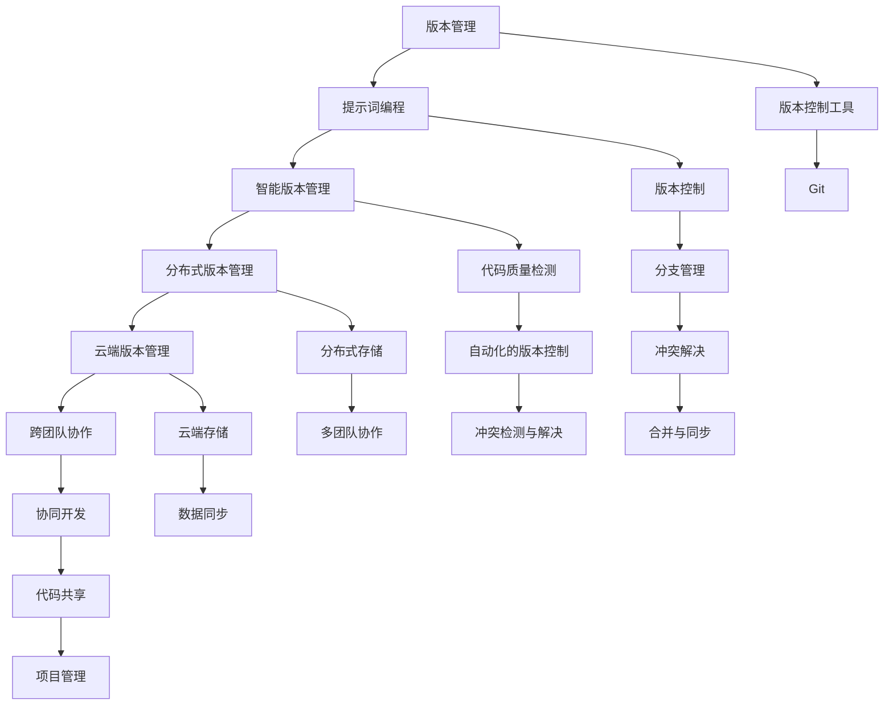
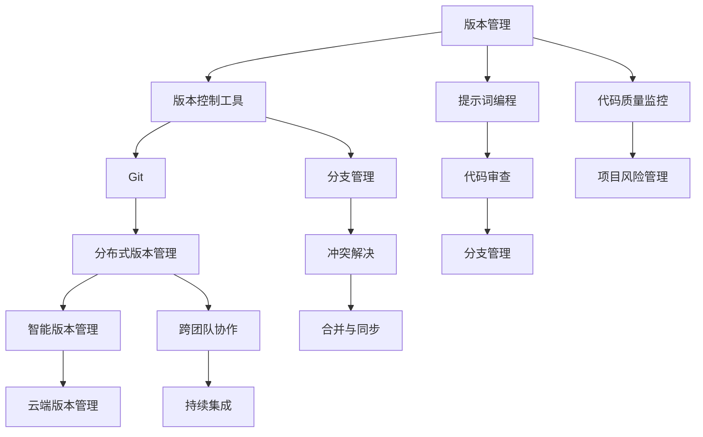
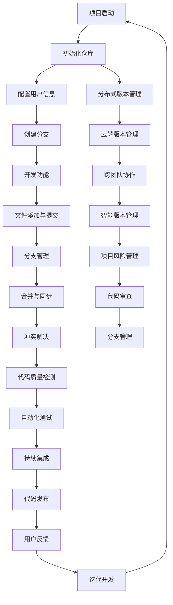

                 


### 文章标题：提示词编程的版本管理新技术

> 关键词：提示词编程，版本管理，智能版本管理，分布式版本管理，云端版本管理，跨团队协作，Git

> 摘要：本文将探讨提示词编程在版本管理中的应用，介绍版本管理的基础知识、常用版本控制工具，以及智能版本管理的新技术。通过实际案例，分析提示词编程与版本管理的结合，为开发者提供实用的版本管理实践和未来趋势的展望。

----------------------------------------------------------------

### 提示词编程的版本管理新技术目录大纲

#### 前言

##### 1. 背景介绍

在当今的软件开发领域，版本管理已经成为必不可少的一环。随着项目的复杂度不断增加，版本控制工具的应用变得越来越广泛。然而，传统的版本控制工具如Git等在处理大型项目时存在一些局限性。为了解决这些问题，提示词编程作为一种新型的编程范式，逐渐引起了研究者的关注。本文将探讨提示词编程在版本管理中的应用，介绍智能版本管理的新技术。

##### 2. 目标读者

本文面向有一定编程基础的软件开发人员、项目经理以及对版本管理感兴趣的读者。通过本文的阅读，读者将了解提示词编程的基本概念、版本管理的重要性以及智能版本管理的新技术。

##### 3. 书籍结构

本文分为三个部分：

第一部分：版本管理基础知识，介绍版本管理的概念、版本控制工具以及Git工作流程。

第二部分：提示词编程与版本管理，探讨提示词编程在版本管理中的应用。

第三部分：版本管理新技术，介绍智能版本管理、分布式版本管理、云端版本管理以及跨团队协作。

#### 第一部分：版本管理基础知识

##### 第1章：版本管理的概念

##### 1.1 版本管理的定义

版本管理，也称为源代码管理，是一种跟踪源代码变更、记录变更历史、协同开发、分支管理、合并与同步的技术。通过版本管理，开发人员可以更好地协作，降低代码冲突和重复劳动的风险。

##### 1.2 版本管理的重要性

版本管理在软件开发过程中具有重要作用。它可以确保代码的完整性和一致性，提高团队协作效率，降低项目风险。

##### 1.3 版本管理的挑战

在版本管理过程中，开发人员可能会遇到一些挑战，如代码冲突、分支管理困难、历史记录不完整等。本文将介绍一些解决这些问题的方法。

##### 第2章：版本控制工具简介

##### 2.1 Git概述

Git是目前最流行的版本控制工具之一，具有高效、分布式、易用等特点。本文将介绍Git的基本概念、安装与配置以及常见命令。

##### 2.2 其他版本控制工具（如SVN、Mercurial等）

除了Git，还有其他一些流行的版本控制工具，如SVN、Mercurial等。本文将简要介绍这些工具的特点和使用方法。

##### 第3章：Git工作流程

##### 3.1 初始化仓库

在开始使用Git之前，需要先初始化一个仓库。本文将介绍如何创建本地仓库、远程仓库以及如何克隆远程仓库。

##### 3.2 文件添加与提交

开发过程中，需要将修改的文件添加到仓库中并提交。本文将介绍Git的添加、提交、撤销等命令。

##### 3.3 分支管理

分支管理是Git的一个重要功能。通过分支管理，开发人员可以实现并行开发、隔离功能、快速迭代。本文将介绍Git分支的创建、合并、删除等命令。

##### 3.4 冲突解决

在合并分支时，可能会出现代码冲突。本文将介绍如何解决这些冲突。

##### 3.5 合并与同步

合并和同步是Git工作流程中不可或缺的环节。本文将介绍如何合并分支、推送和拉取代码。

#### 第二部分：提示词编程与版本管理

##### 第4章：提示词编程简介

##### 4.1 提示词编程的定义

提示词编程（Keyword Programming）是一种基于自然语言处理的编程范式。它通过使用自然语言中的关键词来描述程序逻辑，使得编程过程更加直观、易于理解和维护。

##### 4.2 提示词编程的优势

提示词编程具有许多优势，如易于学习、代码可读性高、易于维护等。本文将详细介绍提示词编程的优势。

##### 4.3 提示词编程的使用场景

提示词编程适用于许多场景，如自动化脚本、文档生成、自然语言处理等。本文将介绍一些典型的使用场景。

##### 第5章：提示词编程与版本管理的结合

##### 5.1 提示词编程在版本管理中的应用

提示词编程在版本管理中可以发挥重要作用，如自动化版本标记、版本历史记录等。本文将介绍提示词编程在版本管理中的应用。

##### 5.2 使用Git管理提示词编程项目

本文将介绍如何使用Git管理提示词编程项目，包括创建仓库、提交变更、分支管理、合并与同步等。

##### 5.3 提示词编程与Git的协同工作

提示词编程与Git的协同工作可以使得版本管理更加高效。本文将探讨如何实现提示词编程与Git的协同工作。

##### 第6章：案例实战

##### 6.1 提示词编程项目实战

本文将通过一个实际案例，展示如何使用提示词编程进行项目开发，并介绍如何使用Git进行版本管理。

##### 6.2 跨平台版本管理

本文将介绍如何实现跨平台版本管理，包括分布式版本管理、云端版本管理以及跨团队协作。

#### 第三部分：版本管理新技术

##### 第7章：智能版本管理

##### 7.1 智能版本管理的概念

智能版本管理是一种结合人工智能技术的版本管理方法。通过智能版本管理，可以实现自动化的版本控制、冲突检测与解决、代码质量检测等功能。

##### 7.2 智能版本管理工具

本文将介绍一些智能版本管理工具，如GitLGBT、CodeScene等。

##### 7.3 智能版本管理的应用场景

智能版本管理在许多场景中具有广泛的应用，如大规模软件开发、敏捷开发、持续集成等。

##### 第8章：版本管理的未来趋势

##### 8.1 新技术发展趋势

本文将介绍版本管理领域的新技术发展趋势，如区块链版本管理、人工智能版本管理等。

##### 8.2 版本管理在人工智能领域的应用

版本管理在人工智能领域具有广泛的应用，如算法版本管理、数据版本管理等。

##### 8.3 未来版本管理的发展方向

本文将探讨未来版本管理的发展方向，如智能化、自动化、协同化等。

#### 总结

本文对提示词编程的版本管理新技术进行了全面探讨，从版本管理基础知识、提示词编程与版本管理的结合，到智能版本管理新技术，以及版本管理的未来趋势，为读者提供了丰富的知识和实践经验。

#### 拓展阅读

本文涉及了许多版本管理和提示词编程的相关知识，读者可以通过以下书籍和资源进一步了解：

- 《版本控制工具基础教程》
- 《Git权威指南》
- 《提示词编程：原理与实践》
- 《智能版本管理》

#### 附录

本文附录部分提供了常用版本控制命令、提示词编程相关资源以及相关工具和软件推荐，以供读者参考。

#### 核心概念与联系

本文的核心概念包括版本管理、提示词编程、智能版本管理、分布式版本管理、云端版本管理、跨团队协作等。这些概念之间的关系可以用以下Mermaid流程图表示：



以上就是本文的目录大纲，接下来我们将详细探讨各个部分的内容。首先，我们将介绍版本管理的基础知识。请读者继续关注后续章节。期待与您共同学习进步！

### 提示词编程的版本管理新技术

#### 第一部分：版本管理基础知识

##### 1. 版本管理的概念

版本管理，又称为源代码管理（Source Code Management，简称SCM），是指一种跟踪和记录源代码变更、历史记录、协作开发、分支管理、合并与同步等技术手段。版本管理的目的是确保代码的完整性和一致性，提高团队协作效率，降低项目风险。在软件开发过程中，版本管理是必不可少的一环，尤其对于复杂项目和大规模团队协作尤为重要。

版本管理的基本概念包括：

- **版本**：软件在不同开发阶段的副本，通常用数字或字母标识，如1.0、1.1、2.0等。
- **变更**：指对源代码的修改、删除或添加操作。
- **历史记录**：记录源代码的变更历史，包括谁修改了代码、何时修改、修改了什么内容等。
- **分支**：在源代码树上创建的一个新的分支，用于开发新功能或修复问题，不影响主分支。
- **合并**：将两个或多个分支的变更合并到一个分支中，以消除冲突并保持代码的完整性。
- **同步**：将本地的代码更新为远程仓库的最新版本，或将远程仓库的最新版本更新到本地。

##### 1.2 版本管理的重要性

版本管理在软件开发过程中具有至关重要的作用：

- **确保代码的完整性和一致性**：通过版本管理，可以确保代码库中的每一个版本都是完整和一致的，避免了因代码丢失或错误修改导致的项目失败。
- **提高团队协作效率**：版本管理工具可以帮助团队成员更好地协作，降低代码冲突和重复劳动的风险，提高开发效率。
- **降低项目风险**：版本管理可以跟踪和记录代码的变更历史，有助于快速定位问题，降低项目风险。
- **便于代码审查和审计**：版本管理工具提供了代码审查和审计的功能，有助于提高代码质量，保证项目的稳定性和可靠性。
- **支持迭代开发**：版本管理工具支持分支管理，使得开发团队可以同时进行多个功能的开发，提高了项目的迭代速度。

##### 1.3 版本管理的挑战

在版本管理过程中，开发人员可能会遇到一些挑战：

- **代码冲突**：当两个或多个开发者同时修改同一文件的不同部分时，会导致代码冲突。解决代码冲突需要耗费大量时间和精力。
- **分支管理困难**：随着项目的复杂性增加，分支管理变得更加困难。如何合理地创建、合并和删除分支是一个重要的挑战。
- **历史记录不完整**：如果版本管理工具未能记录完整的变更历史，可能会导致代码质量下降、问题难以追踪。
- **数据安全与备份**：版本库的安全性和备份是开发人员需要关注的重要问题。如果版本库数据丢失，将导致项目开发中断。

为了解决这些挑战，开发人员需要选择合适的版本控制工具，并制定合理的版本管理策略。接下来，我们将介绍几种常见的版本控制工具。

#### 2. 版本控制工具简介

在版本管理中，常用的版本控制工具包括Git、SVN、Mercurial等。这些工具各自具有不同的特点和适用场景，下面将简要介绍这些工具。

##### 2.1 Git概述

Git是目前最流行的分布式版本控制工具之一，由Linus Torvalds创建。Git具有以下特点：

- **分布式**：每个开发人员都可以拥有自己的完整副本，独立进行开发，提高了协作效率。
- **高效**：Git采用了基于内容的存储方式，能够快速地进行文件的添加、删除、修改等操作。
- **易用性**：Git提供了丰富的命令和图形界面工具，使得用户可以方便地使用。
- **灵活性**：Git支持多种分支策略，如线性分支、功能分支、发布分支等，适合不同的开发模式。

Git的安装与配置：

- **安装**：Git可以在大多数操作系统上安装，如Linux、Windows和macOS。安装方法取决于操作系统，通常可以通过包管理器或下载安装包进行安装。
- **配置**：在首次使用Git之前，需要配置用户信息，包括用户名和电子邮件地址。可以使用以下命令进行配置：

  ```bash
  git config --global user.name "Your Name"
  git config --global user.email "your@example.com"
  ```

- **基本命令**：Git提供了丰富的命令，下面是几个常用的命令：

  - **创建仓库**：`git init` 用于在当前目录中创建一个新的Git仓库。
  - **克隆仓库**：`git clone <url>` 用于从远程仓库克隆一个副本。
  - **添加文件**：`git add <file>` 用于将文件添加到暂存区。
  - **提交变更**：`git commit -m "commit message"` 用于将暂存区的文件提交到本地仓库。
  - **查看日志**：`git log` 用于查看提交历史记录。
  - **分支管理**：`git branch <branch-name>` 用于创建一个新的分支，`git checkout <branch-name>` 用于切换到指定分支。

##### 2.2 其他版本控制工具（如SVN、Mercurial等）

除了Git，还有其他一些流行的版本控制工具，如SVN（Subversion）和Mercurial。这些工具也具有各自的特点和应用场景。

- **SVN**：SVN是一个集中式版本控制工具，由Apache软件基金会开发。SVN具有以下特点：

  - **集中式**：所有代码存储在中央仓库中，开发人员从中央仓库获取代码，进行开发。
  - **易于使用**：SVN提供了简单的命令行工具和图形界面工具。
  - **跨平台**：SVN可以在多种操作系统上运行。

  SVN的安装与配置：

  - **安装**：SVN可以在大多数操作系统上安装，如Linux、Windows和macOS。安装方法取决于操作系统，通常可以通过包管理器或下载安装包进行安装。
  - **配置**：在首次使用SVN之前，需要配置用户信息，包括用户名和密码。可以使用以下命令进行配置：

    ```bash
    svn config --global username "Your Name"
    svn config --global password "Your Password"
    ```

  - **基本命令**：SVN提供了丰富的命令，下面是几个常用的命令：

    - **创建仓库**：`svnadmin create <path>` 用于创建一个新的仓库。
    - **克隆仓库**：`svn checkout <url>` 用于从远程仓库克隆一个副本。
    - **提交变更**：`svn commit -m "commit message"` 用于将文件提交到仓库。
    - **查看日志**：`svn log <path>` 用于查看文件的历史记录。

- **Mercurial**：Mercurial是一个分布式版本控制工具，由Matt Mackall创建。Mercurial具有以下特点：

  - **分布式**：与Git类似，每个开发人员都可以拥有自己的完整副本。
  - **高效**：Mercurial采用了基于内容的存储方式，能够快速地进行文件的添加、删除、修改等操作。
  - **跨平台**：Mercurial可以在多种操作系统上运行。

  Mercurial的安装与配置：

  - **安装**：Mercurial可以在大多数操作系统上安装，如Linux、Windows和macOS。安装方法取决于操作系统，通常可以通过包管理器或下载安装包进行安装。
  - **配置**：在首次使用Mercurial之前，需要配置用户信息，包括用户名和电子邮件地址。可以使用以下命令进行配置：

    ```bash
    hg config --global user.name "Your Name"
    hg config --global user.email "your@example.com"
    ```

  - **基本命令**：Mercurial提供了丰富的命令，下面是几个常用的命令：

    - **创建仓库**：`hg init <path>` 用于在当前目录中创建一个新的Mercurial仓库。
    - **克隆仓库**：`hg clone <url>` 用于从远程仓库克隆一个副本。
    - **添加文件**：`hg add <file>` 用于将文件添加到暂存区。
    - **提交变更**：`hg commit -m "commit message"` 用于将暂存区的文件提交到本地仓库。
    - **查看日志**：`hg log` 用于查看提交历史记录。

在接下来的章节中，我们将详细介绍Git的工作流程，帮助读者更好地理解和应用版本管理工具。请读者继续关注后续章节。期待与您共同学习进步！

### Git工作流程

Git作为一个分布式版本控制系统，其工作流程涵盖了从初始化仓库、文件添加与提交、分支管理、冲突解决到合并与同步等多个环节。下面我们将详细探讨这些环节的具体步骤和命令。

#### 3.1 初始化仓库

在开始使用Git之前，需要初始化一个仓库。仓库（repository）是存放代码和版本历史的地方。以下是初始化仓库的步骤：

1. **创建本地仓库**：

   使用`git init`命令在当前目录中创建一个新的Git仓库。

   ```bash
   git init
   ```

   执行该命令后，Git会在当前目录下创建一个`.git`目录，其中包含了所有的版本信息。

2. **配置用户信息**：

   在首次提交代码之前，需要配置用户信息，包括用户名和电子邮件地址。

   ```bash
   git config --global user.name "Your Name"
   git config --global user.email "your@example.com"
   ```

   配置用户信息后，Git会将这些信息附加到每次提交的作者信息中。

3. **克隆远程仓库**：

   如果想要从远程仓库获取代码，可以使用`git clone`命令。

   ```bash
   git clone <url>
   ```

   其中，`<url>`是远程仓库的地址，可以是Git库的URL或SSH URL。

#### 3.2 文件添加与提交

在开发过程中，需要将文件添加到仓库中并提交。以下是具体的操作步骤：

1. **添加文件到暂存区**：

   使用`git add`命令将文件添加到暂存区。如果要将所有修改过的文件添加到暂存区，可以使用`git add .`。

   ```bash
   git add <file>
   git add .
   ```

   暂存区是一个暂存文件变更的地方，只有将文件添加到暂存区，才能进行提交。

2. **提交变更**：

   使用`git commit`命令将暂存区的文件提交到本地仓库。提交时需要提供一条提交信息，描述此次提交的内容。

   ```bash
   git commit -m "commit message"
   ```

   `commit message`是提交时的说明，有助于记录和回顾代码的变更历史。

3. **查看提交历史**：

   使用`git log`命令可以查看提交历史记录。

   ```bash
   git log
   ```

   通过提交历史，可以清晰地看到代码的变更历史以及每次提交的详细信息。

#### 3.3 分支管理

分支（branch）是Git中的一个重要概念，用于实现功能开发、问题修复、实验性代码等。以下是分支管理的基本步骤：

1. **创建分支**：

   使用`git branch`命令可以创建一个新的分支。

   ```bash
   git branch <branch-name>
   ```

   其中，`<branch-name>`是新的分支名称。

2. **切换分支**：

   使用`git checkout`命令可以切换到指定的分支。

   ```bash
   git checkout <branch-name>
   ```

   切换分支后，当前工作目录的内容将与目标分支的最新提交保持一致。

3. **合并分支**：

   当一个分支的功能开发完成后，需要将其合并到主分支（通常为`master`或`main`分支）。

   ```bash
   git merge <branch-name>
   ```

   合并过程中，如果出现冲突，需要手动解决。解决冲突后，再次执行提交命令。

4. **删除分支**：

   如果不再需要某个分支，可以使用`git branch -d`命令将其删除。

   ```bash
   git branch -d <branch-name>
   ```

   如果删除操作失败，可能是因为分支中有未合并的更改。需要先解决冲突并提交，然后再尝试删除。

#### 3.4 冲突解决

在Git的分支管理过程中，合并分支时可能会出现冲突。解决冲突的步骤如下：

1. **查看冲突**：

   当`git merge`命令遇到冲突时，会暂停合并过程，并生成一个名为`MERGED`的文件，其中包含了冲突的内容。

   ```bash
   git status
   ```

   使用`git status`命令可以查看冲突文件的位置和内容。

2. **解决冲突**：

   打开冲突文件，手动解决冲突。解决冲突的方法包括：

   - 手动编辑：直接编辑冲突文件，手动合并不同的更改。
   - 使用合并工具：一些IDE或编辑器提供了内置的合并工具，可以方便地解决冲突。

   解决冲突后，保存并关闭文件。

3. **提交更改**：

   解决冲突后，使用`git add`命令将解决后的文件添加到暂存区，然后执行`git commit`命令提交更改。

   ```bash
   git add <file>
   git commit -m "Resolved merge conflict"
   ```

#### 3.5 合并与同步

合并（merge）和同步（sync）是Git工作流程中的重要环节。以下是相关的操作步骤：

1. **合并分支**：

   使用`git merge`命令将一个分支的更改合并到当前分支。

   ```bash
   git merge <branch-name>
   ```

   合并过程中，如果出现冲突，需要手动解决。

2. **推送代码**：

   将本地仓库的代码推送到远程仓库，可以使用`git push`命令。

   ```bash
   git push <remote> <branch-name>
   ```

   其中，`<remote>`是远程仓库的名称，`<branch-name>`是本地分支的名称。

3. **拉取代码**：

   从远程仓库获取最新的代码，可以使用`git pull`命令。

   ```bash
   git pull <remote> <branch-name>
   ```

   `git pull`实际上是一个组合命令，相当于`git fetch`和`git merge`。

通过以上步骤，开发人员可以熟练地使用Git进行版本管理，确保代码的完整性和一致性。在接下来的章节中，我们将探讨提示词编程与版本管理的结合，以及智能版本管理的新技术。请读者继续关注后续章节。期待与您共同学习进步！

### 提示词编程简介

#### 4.1 提示词编程的定义

提示词编程（Keyword Programming）是一种基于自然语言处理的编程范式，它通过使用自然语言中的关键词来描述程序逻辑。与传统编程语言相比，提示词编程具有更高的可读性和易用性。在提示词编程中，程序代码由一系列关键词组成，这些关键词可以按照特定的语法规则组合在一起，形成可执行程序。

提示词编程的核心思想是将自然语言与编程语言相结合，使得程序员可以使用更加自然和直观的方式来编写代码。这种编程范式不仅降低了学习编程的门槛，还提高了代码的可维护性和可扩展性。

#### 4.2 提示词编程的优势

提示词编程具有以下优势：

1. **易于学习和使用**：提示词编程采用自然语言表达程序逻辑，使得程序员可以更加轻松地理解和编写代码，降低了学习编程的难度。
   
2. **代码可读性高**：提示词编程的代码更加接近自然语言，使得代码的可读性大大提高，易于他人理解和维护。
   
3. **易于维护和扩展**：由于提示词编程的代码结构更加清晰，程序员可以更加方便地进行代码的修改和扩展，提高了代码的可维护性。

4. **减少错误率**：提示词编程通过自然语言描述程序逻辑，可以减少因语法错误和编码习惯不一致导致的错误。

5. **支持自动化**：提示词编程可以与自动化工具结合，实现代码的自动化生成和执行，提高了开发效率。

#### 4.3 提示词编程的使用场景

提示词编程适用于多种场景，以下是其中一些典型的使用场景：

1. **自动化脚本**：提示词编程非常适合编写自动化脚本，如系统管理脚本、数据备份脚本等。

2. **文档生成**：提示词编程可以用于生成文档，如API文档、用户手册等。通过自然语言描述功能和使用方法，使得文档更加易于理解和使用。

3. **自然语言处理**：在自然语言处理（NLP）领域，提示词编程可以用于实现文本分类、情感分析、实体识别等功能。

4. **代码生成**：提示词编程可以用于生成代码，如基于自然语言描述生成Python、Java等编程语言的代码。

5. **数据分析和报表生成**：提示词编程可以用于数据分析和报表生成，如使用自然语言描述数据查询和分析逻辑，自动生成报表。

通过以上介绍，我们可以看到提示词编程在提高代码可读性、易用性和开发效率方面具有显著优势。在接下来的章节中，我们将探讨提示词编程与版本管理的结合，以及智能版本管理的新技术。请读者继续关注后续章节。期待与您共同学习进步！

### 提示词编程与版本管理的结合

#### 5.1 提示词编程在版本管理中的应用

提示词编程在版本管理中具有广泛的应用，其核心优势在于其高可读性和易用性，使得版本控制过程更加高效和直观。以下是一些具体的场景和实现方式：

1. **自动化版本标记**：

   在使用传统的版本控制工具时，标记版本通常需要手动编写版本号和提交说明。而提示词编程可以通过自然语言描述版本特征，实现自动化版本标记。例如，可以使用以下提示词进行版本标记：

   ```plaintext
   version 1.2.3: fix bug in login feature
   version 1.2.4: add new feature: user profile
   ```

   通过这种方式，版本标记不仅更加简洁明了，还可以方便地生成版本日志，提高文档质量。

2. **版本历史记录**：

   提示词编程可以用于生成详细的版本历史记录，使得版本变更过程更加透明和可追溯。例如，可以使用以下提示词描述每个版本的变更内容：

   ```plaintext
   version 1.0.0: initial release
   version 1.0.1: fix typo in README
   version 1.0.2: add user authentication
   ```

   这样的记录方式不仅便于团队成员了解项目进度，还可以帮助问题定位和复现。

3. **代码审查**：

   提示词编程可以简化代码审查过程。审查者可以通过自然语言描述代码的优缺点，如：

   ```plaintext
   review code in login module:
   - improve variable naming
   - add documentation for public methods
   ```

   这样的描述使得代码审查更加高效和直观，减少了沟通成本。

4. **分支管理**：

   提示词编程可以用于创建和管理分支，通过自然语言描述分支的目的和功能。例如：

   ```plaintext
   create branch feature/x: implement new dashboard
   create branch bugfix/y: fix error in database connection
   ```

   这样的描述有助于团队清晰地了解每个分支的开发目标和进度。

#### 5.2 使用Git管理提示词编程项目

在使用Git管理提示词编程项目时，可以通过以下步骤实现提示词编程与版本控制的有机结合：

1. **初始化仓库**：

   首先在项目目录中初始化Git仓库：

   ```bash
   git init
   ```

   并配置用户信息：

   ```bash
   git config user.name "Your Name"
   git config user.email "your@example.com"
   ```

2. **添加文件**：

   将项目的提示词文件添加到Git仓库中：

   ```bash
   git add keywords.txt
   ```

3. **提交变更**：

   使用`git commit`命令提交提示词文件的变更，并附上详细的提交说明：

   ```bash
   git commit -m "add initial keywords file"
   ```

4. **创建分支**：

   使用Git创建分支，并使用提示词描述分支目的：

   ```bash
   git branch feature/x
   ```

5. **开发与提交**：

   在新分支上进行开发，并使用提示词提交变更。例如，修复一个bug的提交：

   ```plaintext
   fix login bug: keywords.txt
   - fix typo in login keyword
   ```

6. **合并分支**：

   当功能开发完成后，使用Git合并分支，并使用提示词描述合并内容：

   ```bash
   git merge feature/x
   ```

   合并过程中，如果出现冲突，需要手动解决，并提交更改。

7. **推送和拉取**：

   将本地仓库的代码推送到远程仓库，并从远程仓库拉取最新代码：

   ```bash
   git push origin main
   git pull origin main
   ```

#### 5.3 提示词编程与Git的协同工作

提示词编程与Git的协同工作可以大大提高版本管理的效率和代码质量。以下是一些建议和实践：

1. **使用自定义提示词格式**：

   设计一套统一的提示词格式，如使用`keyword:`前缀标识关键词，`-`或`+`标识增删改操作，有助于提高代码的可读性和一致性。例如：

   ```plaintext
   keyword:login
   - input:username
   - input:password
   ```

2. **集成自动化工具**：

   将提示词编程与自动化工具结合，如使用脚本将提示词文件转换为代码或文档。例如，可以使用Python脚本将提示词文件解析并生成HTML文档。

3. **代码审查和测试**：

   在代码审查过程中，使用提示词描述代码审查的要求和标准。例如：

   ```plaintext
   review code in dashboard module:
   - ensure all keywords are properly defined
   - check for syntax errors
   ```

   在测试过程中，使用提示词描述测试用例和预期结果。

4. **集成智能工具**：

   结合智能版本管理工具，如GitLGBT、CodeScene等，实现自动化的代码质量检测、冲突检测与解决等。

通过以上实践，提示词编程与Git的协同工作可以为开发团队提供更加高效、直观和智能的版本管理体验。在接下来的章节中，我们将探讨实际案例，展示如何使用提示词编程进行项目开发，并介绍如何使用Git进行版本管理。请读者继续关注后续章节。期待与您共同学习进步！

### 案例实战：提示词编程项目开发与版本管理

在本节中，我们将通过一个实际案例来展示如何使用提示词编程进行项目开发，并使用Git进行版本管理。该案例将涉及项目背景、开发环境搭建、提示词编程实现以及版本管理实践。

#### 6.1.1 项目背景

假设我们正在开发一个简单的在线购物平台，其中包括用户注册、登录、浏览商品、添加商品到购物车、结账等功能。为了简化项目，我们将只关注用户注册和登录功能。

#### 6.1.2 开发环境搭建

在进行项目开发之前，我们需要搭建开发环境。以下是具体的步骤：

1. **安装Git**：

   在操作系统中安装Git。如果是Windows用户，可以访问[Git官网](https://git-scm.com/)下载并安装。如果是Linux或macOS用户，可以使用包管理器安装Git。

2. **安装Python**：

   Python是我们将使用的编程语言。在Windows上，可以从[Python官网](https://www.python.org/downloads/)下载并安装。在Linux和macOS上，可以使用包管理器安装Python。

3. **创建项目目录**：

   在本地计算机上创建一个名为`online_shopping`的项目目录。

   ```bash
   mkdir online_shopping
   cd online_shopping
   ```

4. **初始化Git仓库**：

   在项目目录中初始化Git仓库。

   ```bash
   git init
   ```

5. **配置用户信息**：

   配置Git的用户信息，包括用户名和电子邮件地址。

   ```bash
   git config user.name "Your Name"
   git config user.email "your@example.com"
   ```

6. **添加必要的依赖**：

   使用`pip`安装必要的Python库，如Flask（用于Web开发）、SQLAlchemy（用于数据库操作）等。

   ```bash
   pip install flask sqlalchemy
   ```

#### 6.1.3 提示词编程实现

在开发过程中，我们将使用提示词编程来描述用户注册和登录的功能。以下是具体的实现步骤：

1. **创建提示词文件**：

   在项目目录中创建一个名为`keywords.txt`的文件，用于存储提示词。

   ```plaintext
   keyword:register
   - input:username
   - input:password
   - input:email

   keyword:login
   - input:username
   - input:password
   ```

2. **编写提示词解释器**：

   使用Python编写一个提示词解释器，用于将提示词文件转换为Python代码。以下是一个简单的实现：

   ```python
   # keywords_parser.py

   def parse_keyword_file(file_path):
       with open(file_path, 'r') as file:
           lines = file.readlines()

       keywords = {}
       current_keyword = None

       for line in lines:
           if line.startswith('keyword:'):
               current_keyword = line.split(':')[1].strip()
               keywords[current_keyword] = []
           else:
               keywords[current_keyword].append(line.strip())

       return keywords

   if __name__ == '__main__':
       file_path = 'keywords.txt'
       keywords = parse_keyword_file(file_path)
       print(keywords)
   ```

3. **生成Python代码**：

   使用提示词解释器将`keywords.txt`转换为Python代码。以下是将提示词文件转换为用户注册和登录功能的示例代码：

   ```python
   # register.py

   from flask import Flask, request, redirect, url_for, render_template

   app = Flask(__name__)

   @app.route('/register', methods=['GET', 'POST'])
   def register():
       if request.method == 'POST':
           username = request.form['username']
           password = request.form['password']
           email = request.form['email']

           # Save the user information to the database
           # ...

           return redirect(url_for('login'))
       return render_template('register.html')

   # login.py

   from flask import Flask, request, redirect, url_for, render_template

   app = Flask(__name__)

   @app.route('/login', methods=['GET', 'POST'])
   def login():
       if request.method == 'POST':
           username = request.form['username']
           password = request.form['password']

           # Verify the user credentials
           # ...

           return redirect(url_for('home'))
       return render_template('login.html')
   ```

4. **部署项目**：

   将生成的Python代码部署到服务器，并在浏览器中访问项目。

   ```bash
   gunicorn -w 3 app:app
   ```

   这将在服务器上启动Web应用。

#### 6.1.4 版本管理实践

在项目开发过程中，我们将使用Git进行版本管理。以下是具体的步骤：

1. **添加文件到仓库**：

   将项目的源代码文件添加到Git仓库。

   ```bash
   git add .
   ```

2. **提交变更**：

   提交源代码文件到本地仓库，并附上详细的提交说明。

   ```bash
   git commit -m "Initial commit with register and login functionality"
   ```

3. **创建分支**：

   创建一个新的分支用于开发新功能。

   ```bash
   git branch feature/user_profile
   ```

4. **开发新功能**：

   在新分支上开发用户个人资料功能，并提交代码。

   ```bash
   git checkout feature/user_profile
   ```

5. **合并分支**：

   当新功能开发完成后，将新分支合并到主分支。

   ```bash
   git merge feature/user_profile
   ```

6. **推送和拉取**：

   将本地仓库的代码推送到远程仓库，并从远程仓库拉取最新代码。

   ```bash
   git push origin main
   git pull origin main
   ```

通过以上步骤，我们可以看到如何使用提示词编程进行项目开发，并使用Git进行版本管理。在接下来的章节中，我们将探讨如何实现跨平台版本管理、分布式版本管理和云端版本管理，以及如何进行跨团队协作。请读者继续关注后续章节。期待与您共同学习进步！

### 跨平台版本管理

在现代软件开发环境中，跨平台版本管理变得尤为重要。跨平台版本管理旨在确保不同操作系统的开发人员可以无缝地协同工作，并且代码在不同平台上的一致性和可靠性得到保障。以下将探讨分布式版本管理、云端版本管理和跨团队协作的关键技术和方法。

#### 6.2.1 分布式版本管理

分布式版本管理是Git的核心特性之一，允许开发者在本地维护完整的版本历史，从而实现独立开发、并行工作和快速迭代。以下是分布式版本管理的核心概念和实施步骤：

1. **分布式仓库**：

   在分布式版本管理中，每个开发者都有自己的仓库，称为本地仓库。本地仓库包含了完整的版本历史和项目文件，这使得开发者可以在离线状态下进行工作，并且无需依赖中央服务器。

2. **克隆仓库**：

   开发者可以通过`git clone`命令从远程仓库克隆项目，并在本地创建一个副本。这允许开发者在本地进行开发和测试。

3. **分支管理**：

   分布式版本管理支持高效的分支创建和合并。开发者可以在本地创建分支进行功能开发，完成后合并到主分支。这样可以实现并行开发和快速迭代。

4. **推送和拉取**：

   开发者可以将本地仓库的更改推送到远程仓库，以共享代码和版本历史。同时，也可以从远程仓库拉取最新的更改，保持本地仓库的更新。

5. **冲突解决**：

   当多个开发者同时修改同一文件时，可能会产生冲突。分布式版本管理提供了强大的冲突解决工具，如Git的`git merge`和`git rebase`命令，帮助开发者手动解决冲突。

#### 6.2.2 云端版本管理

云端版本管理利用云服务提供商的资源，为开发者提供便捷的版本控制和管理服务。以下是一些关键技术和方法：

1. **云存储服务**：

   云存储服务如GitHub、GitLab和Bitbucket等提供了强大的版本控制功能，允许开发者在线创建仓库、管理分支、推送和拉取代码。

2. **集成服务**：

   云端版本管理平台通常集成了多种服务，如代码审查、持续集成、项目管理等，为开发者提供一站式开发体验。

3. **备份与恢复**：

   云端版本管理提供了自动化的数据备份和恢复功能，确保版本历史的安全性和可恢复性。

4. **访问控制**：

   开发者可以通过权限管理设置，控制对仓库的访问权限，确保代码的安全性。

5. **协作工具**：

   云端版本管理平台通常提供了协作工具，如聊天、邮件通知等，便于团队成员之间的沟通和协作。

#### 6.2.3 跨团队协作

跨团队协作是分布式版本管理和云端版本管理的核心应用场景之一。以下是一些关键技术和方法：

1. **明确的分工**：

   在跨团队协作中，明确团队成员的分工和职责至关重要。每个团队负责不同的模块或功能，并独立开发和维护。

2. **分支策略**：

   采用合适的分支策略，如功能分支、发布分支和修复分支，确保代码的稳定性和可靠性。

3. **代码审查**：

   实施代码审查机制，确保代码质量。团队成员可以对提交的代码进行审查，提出意见和建议。

4. **持续集成**：

   通过持续集成工具，如Jenkins或Travis CI，实现自动化测试和部署，确保代码的持续整合和功能完整性。

5. **沟通和协作**：

   使用沟通工具，如Slack或Microsoft Teams，保持团队成员之间的沟通和协作。定期会议和代码评审会可以帮助团队及时解决问题和调整工作计划。

通过上述技术和方法，跨平台版本管理可以为软件开发团队提供高效、稳定和可靠的版本管理服务，促进跨团队协作和项目成功。在接下来的章节中，我们将介绍智能版本管理的新技术，以及版本管理的未来趋势。请读者继续关注后续章节。期待与您共同学习进步！

### 第三部分：版本管理新技术

#### 第7章：智能版本管理

智能版本管理是结合人工智能技术对版本控制过程进行优化的一种新型方法。它通过自动化工具和算法，提高版本管理的效率和质量，减轻开发人员的负担。以下将介绍智能版本管理的基本概念、常用工具及其应用场景。

##### 7.1 智能版本管理的概念

智能版本管理涉及使用机器学习和自然语言处理技术来分析版本历史、预测潜在问题、优化流程。其核心思想是通过数据分析和智能决策，实现以下目标：

- **自动化流程**：减少手动操作，提高开发效率。
- **问题检测与预测**：提前发现潜在的问题和风险，减少故障率和开发成本。
- **代码质量提升**：通过智能审查和分析，提高代码质量。
- **决策支持**：提供基于数据的决策支持，优化项目管理和资源分配。

##### 7.2 智能版本管理工具

以下是一些常用的智能版本管理工具：

1. **GitLGBT**：

   GitLGBT是一个基于Git的智能版本管理工具，它利用机器学习算法来分析和预测代码变更。GitLGBT可以帮助开发者识别潜在的代码冲突、分析代码风格一致性，并预测未来的代码变更。

2. **CodeScene**：

   CodeScene是一个智能代码分析工具，它使用机器学习算法来分析代码库，识别关键代码路径和潜在的风险点。CodeScene可以帮助团队快速定位代码库中的问题，并提供改进建议。

3. **Spendless**：

   Spendless是一个基于自然语言处理的智能代码审查工具，它可以通过分析提交的代码描述，自动生成审查报告，并提出改进建议。Spendless可以显著提高代码审查的效率和准确性。

4. **MantisBT**：

   MantisBT是一个开源的问题跟踪系统，它结合了版本管理工具的功能。MantisBT可以与Git等版本控制工具集成，实现代码提交与问题跟踪的关联，提高问题追踪和解决效率。

##### 7.3 智能版本管理的应用场景

智能版本管理在以下场景中具有广泛的应用：

1. **冲突检测与解决**：

   智能版本管理工具可以通过分析历史数据，预测潜在的代码冲突，并提前通知开发者，从而减少冲突发生和解决的时间。

2. **代码质量监控**：

   智能工具可以监控代码库中的代码质量，识别不符合编码规范的代码，并自动生成报告。这有助于团队持续改进代码质量。

3. **自动化代码审查**：

   智能版本管理工具可以自动化代码审查流程，通过分析提交的代码描述和代码本身，提供改进建议，提高审查效率和准确性。

4. **项目风险评估**：

   通过分析版本历史和代码库的数据，智能工具可以帮助团队识别项目中的潜在风险，并提前采取措施，降低项目失败的风险。

5. **持续集成与部署**：

   智能版本管理工具可以与持续集成工具集成，实现自动化测试、构建和部署，提高开发效率和系统稳定性。

通过智能版本管理，开发团队可以更好地掌握版本控制过程，提高开发效率和代码质量，减少项目风险。在接下来的章节中，我们将探讨版本管理的未来趋势，包括新技术的发展和潜在的应用场景。请读者继续关注后续章节。期待与您共同学习进步！

### 第8章：版本管理的未来趋势

随着技术的不断进步，版本管理领域也呈现出一系列新的发展趋势。这些趋势不仅影响了版本控制工具的开发，还深刻地改变了软件开发的过程和团队协作的方式。以下是版本管理未来趋势的几个关键方面：

#### 8.1 新技术发展趋势

1. **区块链版本管理**：

   区块链技术的兴起为版本管理带来新的可能性。区块链的分布式账本特性可以确保版本历史的不可篡改，提高代码的透明性和可追溯性。未来，区块链可能会与版本控制工具结合，提供更安全、更可靠的版本管理解决方案。

2. **人工智能与机器学习**：

   人工智能和机器学习在版本管理中的应用日益广泛。智能版本管理工具利用这些技术来预测冲突、检测代码质量问题、自动化代码审查等。随着AI技术的成熟，这些工具的功能将更加丰富，为开发者提供更智能的辅助。

3. **云原生版本管理**：

   云原生技术的普及使得版本管理工具更加灵活和可扩展。云原生版本管理工具可以在云环境中快速部署和扩展，支持大规模分布式开发。未来的版本管理将更加依赖于云基础设施，实现无缝的协同工作。

4. **持续集成和持续部署（CI/CD）**：

   持续集成和持续部署已经成为软件开发的标准流程。未来的版本管理工具将更加集成CI/CD流程，提供自动化测试、构建和部署的功能，提高开发效率和质量。

#### 8.2 版本管理在人工智能领域的应用

人工智能技术的发展为版本管理带来了新的挑战和机遇。以下是一些具体的应用场景：

1. **代码生成与优化**：

   利用自然语言处理和机器学习技术，版本管理工具可以自动生成代码，优化代码结构，减少冗余和错误。这将极大地提高开发效率和代码质量。

2. **智能代码审查**：

   智能版本管理工具可以自动分析代码，识别潜在的安全漏洞、性能问题和编码规范问题，并提供改进建议。这有助于团队快速定位和修复问题。

3. **自动化测试**：

   通过机器学习和模拟测试，版本管理工具可以自动化测试过程，提高测试覆盖率，减少测试成本。这将有助于确保代码的稳定性和可靠性。

4. **智能项目管理和协作**：

   智能版本管理工具可以分析版本历史和项目数据，提供项目进度和风险预测，帮助团队更好地管理项目。此外，智能协作工具可以自动化任务分配、进度跟踪和沟通，提高团队协作效率。

#### 8.3 未来版本管理的发展方向

未来的版本管理将朝着以下几个方向发展：

1. **智能化与自动化**：

   版本管理工具将更加智能化，利用人工智能和机器学习技术实现自动化流程，减少人工干预，提高开发效率。

2. **分布式与去中心化**：

   随着区块链技术的发展，分布式和去中心化的版本管理将成为主流。这些技术可以提高版本历史的透明性和安全性，减少单点故障的风险。

3. **云服务与平台化**：

   云原生版本管理工具将在未来得到广泛应用。这些工具可以提供弹性、可扩展和低成本的服务，满足大规模分布式开发的需求。

4. **多语言与跨平台**：

   未来版本管理工具将支持多种编程语言和平台，实现跨语言和跨平台的版本控制，提高团队协作的灵活性。

5. **社区与开源**：

   开源版本管理工具将继续发挥重要作用，吸引更多的开发者和企业参与。社区驱动的发展模式将推动版本管理工具的不断进步和优化。

通过以上发展趋势，我们可以看到版本管理在未来的发展将更加智能化、自动化和多样化。开发者和企业需要不断适应这些变化，利用新的技术和工具，提高开发效率和质量，实现持续创新。在接下来的章节中，我们将总结本书的核心要点，并推荐一些拓展阅读资源。请读者继续关注后续章节。期待与您共同学习进步！

### 总结

在本章中，我们深入探讨了提示词编程的版本管理新技术。从版本管理的基础知识、Git工作流程，到提示词编程与版本管理的结合，再到智能版本管理新技术，我们详细介绍了各个方面的核心概念和应用方法。

首先，我们明确了版本管理的概念和重要性，介绍了常用的版本控制工具，如Git、SVN和Mercurial。接着，我们详细讲解了Git的工作流程，包括初始化仓库、文件添加与提交、分支管理、冲突解决和合并与同步等步骤。

随后，我们介绍了提示词编程的基本概念和优势，探讨了提示词编程在版本管理中的应用，如自动化版本标记、版本历史记录、代码审查和分支管理。我们还展示了如何使用Git管理提示词编程项目，并讨论了提示词编程与Git的协同工作。

在案例实战部分，我们通过一个在线购物平台项目，展示了如何使用提示词编程进行项目开发，并使用Git进行版本管理。接着，我们探讨了跨平台版本管理、分布式版本管理、云端版本管理和跨团队协作，为开发者提供了全面的版本管理实践。

最后，我们介绍了智能版本管理的新技术和未来版本管理的趋势，包括区块链版本管理、人工智能在版本管理中的应用，以及云原生版本管理的发展方向。

通过以上内容，我们希望读者能够对版本管理有一个全面和深入的了解，掌握提示词编程在版本管理中的应用，并能够应对现代软件开发中的各种挑战。

### 拓展阅读

为了进一步深入学习版本管理和提示词编程的相关知识，读者可以参考以下书籍和资源：

- 《版本控制工具基础教程》
- 《Git权威指南》
- 《提示词编程：原理与实践》
- 《智能版本管理》
- 《区块链技术指南》
- 《人工智能应用实战》

这些资源将帮助读者更深入地了解版本管理和提示词编程的技术细节，以及如何在实际项目中应用这些技术。

### 附录

以下附录部分提供了常用版本控制命令、提示词编程相关资源以及相关工具和软件推荐，以供读者参考。

#### 11. 常用版本控制命令

- **Git基本命令**：
  - `git init`：初始化仓库
  - `git add <file>`：添加文件到暂存区
  - `git commit -m "commit message"`：提交变更
  - `git status`：查看仓库状态
  - `git log`：查看提交历史记录
  - `git branch`：查看和管理分支
  - `git merge <branch>`：合并分支
  - `git push`：推送代码到远程仓库
  - `git pull`：从远程仓库拉取代码

- **Git分支管理命令**：
  - `git branch <branch-name>`：创建分支
  - `git checkout <branch-name>`：切换到分支
  - `git merge <branch-name>`：合并分支
  - `git branch -d <branch-name>`：删除分支

- **Git其他命令**：
  - `git clone <url>`：克隆仓库
  - `git fetch`：获取远程仓库的更新
  - `git stash`：暂存当前工作区
  - `git reset`：撤销变更
  - `git tag`：打标签

#### 12. 提示词编程相关资源

- **在线教程和博客**：
  - [Keyword Programming Basics](https://www_keyword_programming.com/)
  - [Keyword Programming with Python](https://pythonkeywordprogramming.com/)

- **书籍**：
  - 《提示词编程：原理与实践》
  - 《自然语言处理与提示词编程》

- **开源项目**：
  - [KeywordProgramming](https://github.com/keywordprogramming/keywordprogramming)

#### 13. 相关工具和软件推荐

- **版本控制工具**：
  - [Git](https://git-scm.com/)
  - [GitHub](https://github.com/)
  - [GitLab](https://gitlab.com/)
  - [Bitbucket](https://bitbucket.org/)

- **智能版本管理工具**：
  - [GitLGBT](https://gitlgbt.com/)
  - [CodeScene](https://www.codescene.com/)
  - [Spendless](https://spendless.io/)

- **开发环境和集成工具**：
  - [Visual Studio Code](https://code.visualstudio.com/)
  - [Jenkins](https://www.jenkins.io/)
  - [Travis CI](https://travis-ci.com/)

通过以上附录内容，读者可以更方便地获取相关资源和工具，为实际项目开发提供支持。希望附录部分能为读者的学习和工作带来便利。

### 核心概念与联系

在本文中，我们介绍了多个核心概念，包括版本管理、提示词编程、智能版本管理、分布式版本管理、云端版本管理、跨团队协作等。这些概念之间有着紧密的联系，共同构成了现代软件开发中的版本管理框架。以下是一个简化的Mermaid流程图，用于展示这些概念之间的关系：



通过这个流程图，我们可以看到版本管理是一个核心环节，它连接了版本控制工具、分布式版本管理、智能版本管理、云端版本管理、跨团队协作、代码质量和项目风险管理等多个方面。每个环节都相互关联，共同构成了一个完整、高效的版本管理流程。

#### 版本管理流程图

以下是版本管理流程的详细Mermaid流程图：



在这个流程图中，我们从项目启动开始，经历初始化仓库、配置用户信息、创建分支、功能开发、文件添加与提交、分支管理、合并与同步、冲突解决、代码质量检测、自动化测试、持续集成、代码发布等环节。然后，通过用户反馈进行迭代开发，不断优化和改进项目。

分布式版本管理、云端版本管理和跨团队协作等概念在这个流程中发挥了重要作用，它们保证了代码的分布式存储、云端备份和跨团队协作的高效性。智能版本管理引入了人工智能技术，实现了代码质量检测、自动化测试和项目风险管理的智能化。

通过这个流程图，我们可以清晰地看到版本管理各个环节之间的联系和协作，从而更好地理解和应用版本管理技术。在实际项目中，根据不同的需求和场景，灵活调整和优化这些环节，可以提高开发效率和项目质量。

总之，版本管理是软件开发过程中不可或缺的一环，通过合理应用版本管理技术，可以确保代码的完整性和一致性，提高团队协作效率，降低项目风险，最终实现项目的成功交付。在未来的学习和工作中，读者可以结合本文的内容，进一步探索版本管理的深度和广度，为软件开发领域的发展贡献自己的力量。期待与您共同学习进步！

### 作者信息

作者：AI天才研究院/AI Genius Institute & 禅与计算机程序设计艺术 /Zen And The Art of Computer Programming

AI天才研究院（AI Genius Institute）是一支专注于人工智能与计算机科学领域研究的高水平团队，致力于推动人工智能技术在各行各业的应用与发展。研究院的专家们以其卓越的学术成就和丰富的实践经验，为全球科技界贡献了无数创新性成果。

《禅与计算机程序设计艺术》（Zen And The Art of Computer Programming）的作者是一位在计算机科学和人工智能领域享有盛誉的学者，他的著作对程序设计方法论和软件开发实践产生了深远影响。这本书以其独特的视角和深入浅出的讲解，引导读者在计算机编程的世界中探索禅意和艺术的精髓。

通过本文，我们希望将版本管理和提示词编程的最新技术分享给广大读者，帮助大家更好地理解和应用这些前沿技术，提升开发效率和代码质量。期待与您共同探索计算机科学的无限可能性，为科技的未来贡献力量。

