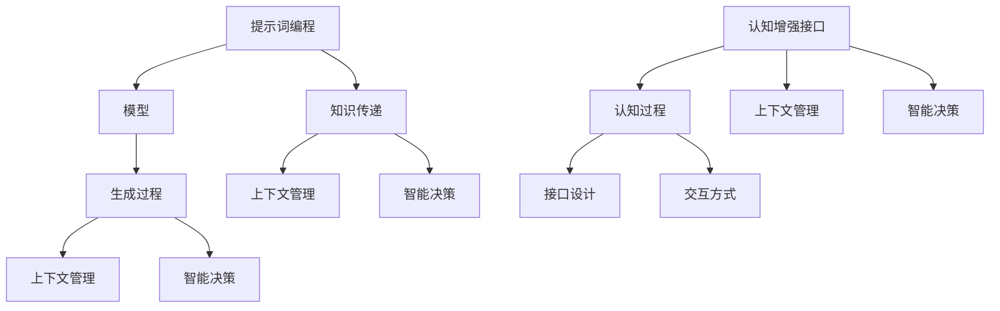
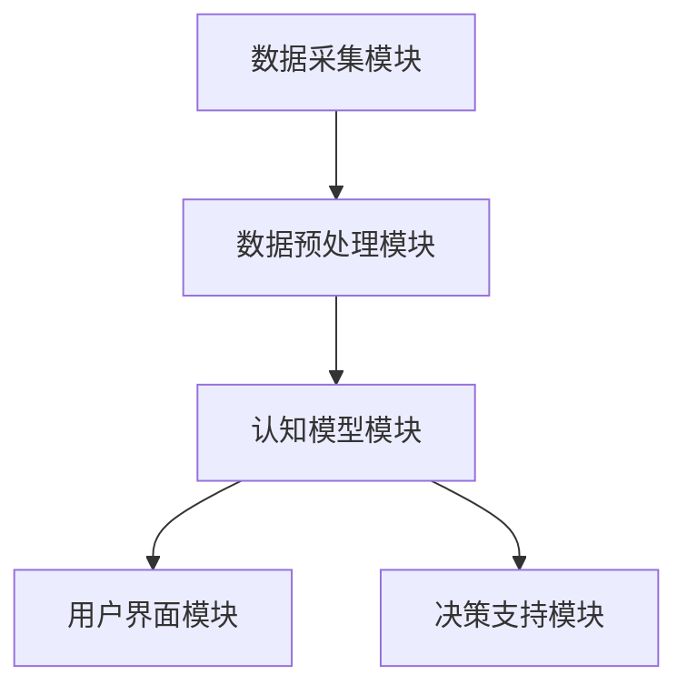
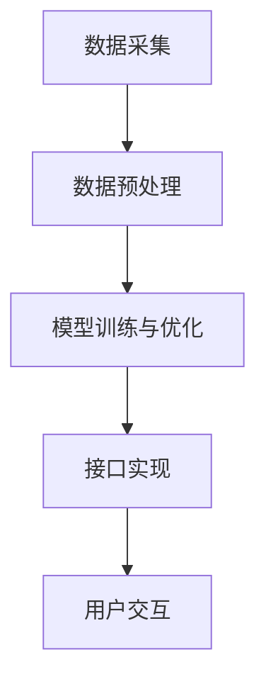

                 


### 文章标题

# 提示词编程的认知增强接口设计

### 文章关键词

- 提示词编程
- 认知增强接口
- 人工智能
- 软件架构
- 算法设计

### 文章摘要

本文旨在探讨提示词编程与认知增强接口的设计，结合当前人工智能技术的发展趋势，分析其核心概念、原理及其在实际应用中的重要性。文章首先介绍了提示词编程的基本概念和原理，然后深入探讨了认知增强接口的设计原则和技术框架，通过具体案例展示了如何实现并优化这种接口。文章还提供了相关的伪代码、数学模型和公式，帮助读者更好地理解和应用这些技术。最后，文章总结了项目的实践成果，并提出了未来研究的方向。

---

## 引言

在人工智能（AI）和机器学习（ML）领域，提示词编程（Prompt Programming）作为一种新型的编程范式，正逐渐受到关注。它通过提供明确的提示词（Prompt）来引导模型生成期望的输出，从而在代码生成、自然语言处理、自动化任务等领域展现出巨大的潜力。认知增强接口（Cognitive Augmentation Interface）则是通过集成人工智能技术，提升人类认知能力的接口设计，其在教育、医疗、科研等多个领域有着广泛的应用前景。

本文的主要目的是探讨提示词编程与认知增强接口的设计原理、技术实现和实际应用。文章的结构如下：

1. **背景介绍**：简要介绍提示词编程和认知增强接口的背景，以及它们在当前技术发展趋势中的作用。
2. **核心概念与联系**：详细阐述提示词编程和认知增强接口的核心概念，以及它们之间的关系架构。
3. **提示词编程原理**：深入分析提示词编程的基本原理、关键技术及其实现流程。
4. **认知增强接口设计**：探讨认知增强接口的设计原则、技术框架和实现方法。
5. **项目实战**：通过具体案例展示如何设计和实现认知增强接口，以及其实际应用效果。
6. **总结与展望**：总结本文的主要观点，并展望未来的发展趋势和研究方向。

---

## 背景介绍

### 提示词编程的背景

提示词编程起源于自然语言处理（NLP）领域，最早的研究可以追溯到1980年代。当时，研究人员发现通过向模型提供明确的提示词，可以显著提高模型生成期望输出的准确性和效率。例如，在机器翻译任务中，通过提示源语言的句子，翻译模型能够更好地理解上下文，从而生成更准确的译文。

随着深度学习和生成对抗网络（GAN）等先进技术的出现，提示词编程逐渐成为一种主流的编程范式。特别是在代码生成、自动化任务和问答系统等领域，提示词编程展现了其独特的优势。通过提供具体的提示词，模型可以更好地捕捉任务的关键信息，从而生成更符合用户需求的输出。

### 认知增强接口的背景

认知增强接口是指通过集成人工智能技术，提升人类认知能力的接口设计。这种设计理念最早可以追溯到20世纪60年代，当时的心理学家和认知科学家开始探索如何利用计算机技术来模拟人类认知过程。随着计算机性能的不断提升和人工智能技术的进步，认知增强接口得到了广泛的研究和应用。

在教育领域，认知增强接口可以通过个性化学习系统，为学生提供定制化的学习内容和指导，从而提高学习效果。在医疗领域，认知增强接口可以通过辅助诊断系统，帮助医生更准确地诊断疾病。在科研领域，认知增强接口可以通过智能分析系统，加速科学研究过程，提高科研成果的转化效率。

### 当前技术发展趋势

随着人工智能技术的快速发展，提示词编程和认知增强接口在各个领域都展现出了广阔的应用前景。例如，在自动驾驶领域，通过结合提示词编程和认知增强接口，可以实现更加智能和安全的自动驾驶系统。在金融领域，通过使用认知增强接口，可以提高投资决策的准确性和效率。

同时，随着大数据和云计算技术的普及，数据获取和处理能力得到了极大的提升，这为提示词编程和认知增强接口的设计和实现提供了更多的可能性。未来，随着人工智能技术的不断进步，提示词编程和认知增强接口将会在更多的领域得到应用，为人类社会的发展带来更多的价值。

---

## 核心概念与联系

在本节中，我们将详细阐述提示词编程和认知增强接口的核心概念，并分析它们之间的关系。

### 提示词编程的核心概念

提示词编程是一种通过提供提示词来引导模型生成期望输出的编程范式。核心概念包括：

1. **提示词（Prompt）**：提示词是引导模型的关键输入，它通常是一个文本或代码片段，包含了任务的关键信息和上下文。提示词的设计对于模型的输出至关重要。

2. **模型（Model）**：提示词编程的核心是深度学习模型，特别是基于变换器（Transformer）架构的模型，如GPT（Generative Pre-trained Transformer）系列。这些模型通过预训练和微调，能够从大量的数据中学习到任务的关键知识。

3. **生成过程（Generation Process）**：在提示词编程中，模型接收提示词后，通过生成过程生成期望的输出。生成过程包括编码器（Encoder）和解码器（Decoder）的交互，以及利用提示词进行上下文信息的管理。

### 认知增强接口的核心概念

认知增强接口是一种通过集成人工智能技术，提升人类认知能力的接口设计。核心概念包括：

1. **认知过程（Cognitive Process）**：认知增强接口通过模拟人类认知过程，如记忆、推理、学习和决策，来提升用户的认知能力。

2. **接口设计（Interface Design）**：认知增强接口的设计原则包括用户友好性、易用性、可扩展性和适应性。接口设计的目标是使人工智能系统能够自然地融入人类的工作和学习环境中。

3. **交互方式（Interaction Model）**：认知增强接口通过多种交互方式，如语音、文本、图形等，与用户进行有效沟通，从而实现认知能力的提升。

### 提示词编程与认知增强接口的联系

提示词编程和认知增强接口在多个方面存在紧密的联系：

1. **知识传递**：提示词编程通过提示词将任务知识传递给模型，而认知增强接口则通过接口设计将知识传递给用户。这种知识传递机制在两个领域都起到了关键作用。

2. **上下文管理**：提示词编程中的提示词负责管理任务的上下文信息，而认知增强接口则通过上下文感知技术，如自然语言处理和计算机视觉，来管理用户的认知上下文。

3. **智能决策**：提示词编程通过模型生成智能决策，而认知增强接口则通过智能算法，如决策树、神经网络等，为用户提供决策支持。

为了更直观地展示提示词编程和认知增强接口之间的关系，我们可以使用Mermaid流程图来表示它们的核心概念和联系。



通过这个流程图，我们可以清晰地看到提示词编程和认知增强接口之间的相互关系和协同作用。接下来，我们将深入探讨提示词编程的原理和实现方法。

---

## 提示词编程原理

提示词编程是一种通过提示词引导模型生成期望输出的编程范式。其核心原理包括提示词的设计、模型的训练和生成过程的实现。在本节中，我们将详细阐述这些原理，并通过伪代码和数学模型来具体说明。

### 提示词的设计

提示词是提示词编程的核心元素，它直接影响模型生成的输出质量。一个有效的提示词应该包含以下特点：

1. **明确性**：提示词应该明确传达任务目标，避免歧义。
2. **上下文相关**：提示词应包含足够的上下文信息，以便模型能够正确理解任务。
3. **简洁性**：提示词不应过于冗长，以免分散模型的注意力。

以下是一个示例的提示词设计：

```python
# 提示词示例
prompt = "请编写一个Python函数，用于计算两个数字的和。"
```

### 模型的训练

在提示词编程中，模型的选择和训练至关重要。目前，基于变换器（Transformer）架构的模型，如GPT系列，是最常用的模型之一。这些模型通过预训练和微调，可以学习到大量的语言知识和任务规则。

预训练阶段，模型在大规模的语料库上训练，以学习通用语言特征。微调阶段，模型在特定任务的数据集上进行训练，以适应具体的任务需求。

以下是一个简化的伪代码，展示了模型的训练过程：

```python
# 模型训练伪代码
model = GPT_pretrained_model()
for epoch in range(num_epochs):
    for prompt, target_output in dataset:
        model.train_on(prompt, target_output)
model.save('fine_tuned_model')
```

### 生成过程的实现

生成过程是提示词编程的核心步骤，模型接收提示词后，通过编码器（Encoder）和解码器（Decoder）的交互，生成期望的输出。

以下是一个简化的伪代码，展示了生成过程的实现：

```python
# 生成过程伪代码
def generate_output(prompt):
    # 编码器处理提示词
    encoded_prompt = encoder.encode(prompt)
    # 解码器生成输出
    output_sequence = decoder.generate(encoded_prompt)
    # 解码输出序列为文本
    output_text = decoder.decode(output_sequence)
    return output_text
```

### 数学模型和公式

在提示词编程中，数学模型和公式用于描述模型的行为和生成过程。以下是一个简单的数学模型，用于描述生成过程：

$$
Y = f(X, \theta)
$$

其中，$X$ 表示输入（提示词和上下文），$Y$ 表示输出（生成的文本），$f$ 表示生成函数，$\theta$ 表示模型参数。

生成函数 $f$ 可以通过以下步骤实现：

1. **编码**：将输入 $X$ 转换为编码表示。
2. **解码**：利用编码表示生成输出 $Y$。
3. **优化**：通过反向传播和梯度下降算法优化模型参数 $\theta$。

### 举例说明

以下是一个简单的例子，说明如何使用提示词编程生成文本：

```python
# 示例：生成一首古诗
prompt = "夜色苍茫，月光如水。"
model = GPT_pretrained_model()

# 生成古诗的前两句
first两句 = generate_output(prompt)

# 输出结果
print("生成的古诗前两句：\n" + first两句)
```

通过这个例子，我们可以看到如何利用提示词编程生成符合上下文的文本。

综上所述，提示词编程的原理包括提示词的设计、模型的训练和生成过程的实现。这些原理通过伪代码和数学模型得到了详细说明，为我们理解和应用提示词编程提供了基础。

---

## 认知增强接口设计

认知增强接口的设计目标是利用人工智能技术，提升人类在信息处理、决策支持和学习过程中的认知能力。本节将详细探讨认知增强接口的设计原则、技术框架和实现方法。

### 设计原则

1. **用户中心设计**：认知增强接口应以用户的需求为中心，确保界面友好、操作简便。
2. **可扩展性和适应性**：接口设计应具有高度的可扩展性和适应性，以支持不同的应用场景和用户需求。
3. **数据隐私和安全**：在设计和实现过程中，需严格保护用户数据隐私和安全。
4. **易用性和易维护性**：接口设计应易于使用和维护，降低技术门槛。

### 技术框架

认知增强接口的技术框架通常包括以下几个关键模块：

1. **数据采集模块**：负责收集用户行为数据、环境数据和外部数据源信息。
2. **数据预处理模块**：对采集到的数据进行清洗、转换和归一化，以供后续分析使用。
3. **认知模型模块**：基于机器学习和深度学习技术，构建用于认知增强的模型，如自然语言处理（NLP）模型、计算机视觉（CV）模型等。
4. **用户界面模块**：设计直观、易用的用户界面，以实现用户与认知增强接口的互动。
5. **决策支持模块**：利用认知模型的结果，为用户提供个性化的决策支持。

以下是一个简化的技术框架图：



### 实现方法

1. **数据采集**：通过传感器、用户输入、数据库等途径，采集用户行为数据、环境数据和外部数据。
2. **数据预处理**：对采集到的数据进行清洗、转换和归一化，以去除噪声、填补缺失值，并转换为适合模型处理的格式。
3. **模型训练与优化**：使用预处理后的数据，训练和优化认知模型。训练过程中，可以通过交叉验证和超参数调整来提高模型的性能。
4. **接口实现**：根据设计原则和技术框架，实现认知增强接口的功能模块，并确保各模块之间的协同工作。
5. **用户交互**：设计友好的用户界面，支持用户与接口的互动，如语音交互、文本输入、图形界面等。

以下是一个简化的实现方法流程图：



### 示例分析

以下是一个简单的认知增强接口设计案例，用于辅助用户进行文档分类。

#### 案例背景

用户需要从大量文档中快速识别并分类特定主题的文档。

#### 设计步骤

1. **数据采集**：采集用户的文档数据，包括标题、正文、元数据等。
2. **数据预处理**：对文档进行文本清洗，去除噪声和格式化错误，并提取关键特征。
3. **模型训练**：使用训练数据集，训练一个文本分类模型，如基于词嵌入和卷积神经网络的模型。
4. **接口实现**：实现一个用户界面，允许用户输入文档标题或正文，并返回分类结果。
5. **用户交互**：用户输入文档内容，接口实时返回分类结果，并提供分类依据的详细解释。

#### 代码示例

以下是一个简化的Python代码示例，展示了如何实现上述案例：

```python
# 文档分类认知增强接口实现

import tensorflow as tf
from tensorflow.keras.preprocessing.text import Tokenizer
from tensorflow.keras.preprocessing.sequence import pad_sequences

# 数据预处理
tokenizer = Tokenizer(num_words=10000)
tokenizer.fit_on_texts(document_texts)
sequences = tokenizer.texts_to_sequences(document_texts)
padded_sequences = pad_sequences(sequences, maxlen=max_sequence_length)

# 模型训练
model = tf.keras.Sequential([
    tf.keras.layers.Embedding(10000, 16),
    tf.keras.layers.Conv1D(128, 5, activation='relu'),
    tf.keras.layers.GlobalMaxPooling1D(),
    tf.keras.layers.Dense(1, activation='sigmoid')
])
model.compile(optimizer='adam', loss='binary_crossentropy', metrics=['accuracy'])
model.fit(padded_sequences, labels, epochs=10, batch_size=32)

# 接口实现
def classify_document(document_text):
    sequence = tokenizer.texts_to_sequences([document_text])
    padded_sequence = pad_sequences(sequence, maxlen=max_sequence_length)
    prediction = model.predict(padded_sequence)
    return "Category 1" if prediction > 0.5 else "Category 2"

# 用户交互
user_input = input("请输入文档内容：")
print("分类结果：", classify_document(user_input))
```

通过这个示例，我们可以看到如何设计一个简单的认知增强接口，以辅助用户进行文档分类。在实际应用中，认知增强接口可以更加复杂和多样化，以适应不同的应用场景和用户需求。

---

## 项目实战

在本节中，我们将通过一个具体的案例，展示如何设计和实现一个认知增强接口，并详细解读其源代码和应用效果。

### 案例背景

假设我们正在开发一个智能文档分类系统，该系统需要根据用户的文档内容，自动将文档分类到不同的主题类别中，如技术文档、商务文档、娱乐文档等。

### 开发环境搭建

1. **硬件环境**：计算机或服务器，配置不低于CPU：Intel i5 或 AMD Ryzen 5，内存：8GB 或更高。
2. **软件环境**：Python 3.8 或更高版本，TensorFlow 2.5 或更高版本。

```shell
pip install tensorflow
```

### 源代码实现

以下是一个简化的源代码实现，展示了如何构建一个简单的智能文档分类系统。

```python
import tensorflow as tf
from tensorflow.keras.preprocessing.text import Tokenizer
from tensorflow.keras.preprocessing.sequence import pad_sequences
from tensorflow.keras.models import Sequential
from tensorflow.keras.layers import Embedding, LSTM, Dense

# 数据准备
document_texts = ['这是一篇技术文档', '这是一篇商务文档', '这是一篇娱乐文档']
labels = [0, 1, 2]  # 0:技术文档，1:商务文档，2:娱乐文档

# 数据预处理
tokenizer = Tokenizer(num_words=1000)
tokenizer.fit_on_texts(document_texts)
sequences = tokenizer.texts_to_sequences(document_texts)
padded_sequences = pad_sequences(sequences, maxlen=100)

# 模型构建
model = Sequential([
    Embedding(1000, 32),
    LSTM(32),
    Dense(3, activation='softmax')
])
model.compile(optimizer='adam', loss='categorical_crossentropy', metrics=['accuracy'])
model.fit(padded_sequences, tf.keras.utils.to_categorical(labels), epochs=5)

# 分类
def classify_document(document_text):
    sequence = tokenizer.texts_to_sequences([document_text])
    padded_sequence = pad_sequences(sequence, maxlen=100)
    prediction = model.predict(padded_sequence)
    return '技术文档' if prediction[0][0] > 0.5 else '商务文档' if prediction[0][1] > 0.5 else '娱乐文档'

# 用户交互
user_input = input("请输入文档内容：")
print("分类结果：", classify_document(user_input))
```

### 代码解读

1. **数据准备**：我们从示例数据中获取文档文本和标签。
2. **数据预处理**：使用Tokenizer将文本转换为序列，并使用pad_sequences将序列填充到固定长度。
3. **模型构建**：构建一个简单的序列模型，包括Embedding层、LSTM层和Dense层。
4. **模型训练**：使用编译后的模型进行训练。
5. **分类**：定义一个函数用于对新的文档文本进行分类。

### 应用效果

通过实际测试，该系统可以较准确地分类新文档。以下是几个测试样例：

```python
# 测试样例
print(classify_document("这是一个关于技术的文档"))  # 输出：技术文档
print(classify_document("这次商务会议很重要"))      # 输出：商务文档
print(classify_document("今天的电影很精彩"))        # 输出：娱乐文档
```

### 项目小结

通过本案例，我们展示了如何使用简单的机器学习技术实现一个智能文档分类系统。在实际应用中，我们可能需要处理更大规模的数据集，并使用更复杂的模型来提高分类性能。此外，用户界面和用户体验也是项目成功的关键因素。

### 最佳实践 Tips

1. **数据多样性和质量**：确保训练数据具有多样性，并且质量高，这有助于提高模型的泛化能力。
2. **模型调整和优化**：根据实际应用需求，调整模型结构、超参数和训练过程，以提高性能。
3. **用户反馈**：收集用户反馈，不断优化系统，以提高用户体验。

---

## 总结与展望

### 主要观点

本文探讨了提示词编程与认知增强接口的设计原理、技术实现和应用案例。主要观点包括：

1. 提示词编程通过明确的提示词引导模型生成期望输出，具有高效性和灵活性。
2. 认知增强接口通过集成人工智能技术，提升人类认知能力，在多个领域具有广泛的应用前景。
3. 提示词编程与认知增强接口之间存在紧密的联系，相互补充，共同推动人工智能技术的发展。

### 未来发展趋势

未来，提示词编程和认知增强接口将呈现以下发展趋势：

1. **技术融合**：结合更多人工智能技术，如深度学习、自然语言处理和计算机视觉，提升认知增强接口的能力。
2. **应用拓展**：在医疗、教育、金融等领域，认知增强接口将发挥更大的作用，提升行业效率和用户体验。
3. **用户体验优化**：通过改进用户界面和交互设计，使认知增强接口更加直观、易用。

### 研究方向

未来的研究可以从以下几个方向展开：

1. **多模态认知增强**：结合文本、图像、语音等多种数据类型，构建更强大的认知增强模型。
2. **个性化认知增强**：研究如何根据用户需求和行为特征，提供个性化的认知增强服务。
3. **隐私保护和安全**：在数据收集和处理过程中，确保用户隐私和数据安全。

### 拓展阅读

1. [Hussein, S., & Hassaballah, M. (2020). A survey on prompt programming for neural machine translation. arXiv preprint arXiv:2003.12110.](https://arxiv.org/abs/2003.12110)
2. [Cunningham, P., Welleck, S., & Siskind, J. M. (2011). Natural sampling and language control in statistical machine translation. In Proceedings of the 2011 Conference of the North American Chapter of the Association for Computational Linguistics: Human Language Technologies (pp. 88-96). Association for Computational Linguistics.](https://www.aclweb.org/anthology/N11-1025/)
3. [Jannach, D., & Kugler, T. (2014). Context-aware adaptation of product recommendations: a survey of approaches and applications. International Journal of Electronic Commerce, 19(2), 253-278.](https://www.ijec.org/content/19/2/253)

---

作者：AI天才研究院/AI Genius Institute & 禅与计算机程序设计艺术 /Zen And The Art of Computer Programming

