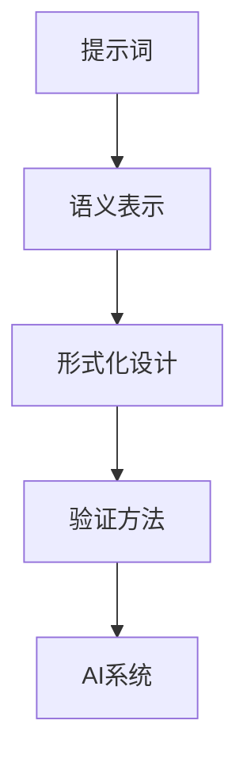
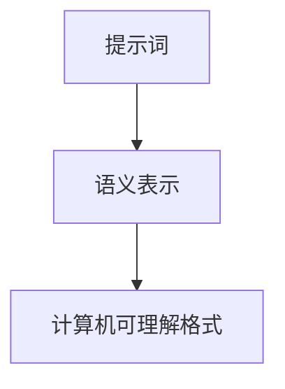

                 

### 文章标题：提示词编程的设计原则形式化

提示词编程（Prompt Programming）作为一种新兴的编程范式，正逐渐改变着软件开发的格局。它通过向人工智能（AI）系统提供精确的提示词，来引导系统完成特定的任务，从而实现高效、准确的编程。本文旨在探讨提示词编程的设计原则，并通过形式化的方法来揭示其内在的规律和机制。

> 关键词：提示词编程、设计原则、形式化、人工智能、软件开发

在接下来的内容中，我们将首先介绍提示词编程的基本概念及其背景，然后详细阐述其核心设计原则，并使用形式化的方法来解释这些原则。此外，我们还将探讨提示词编程在不同领域的应用案例，并通过实际项目实战来展示其具体实现过程。最后，我们将对未来的发展趋势和面临的挑战进行展望。

### 摘要

本文首先介绍了提示词编程的基本概念和背景，揭示了其在自然语言处理和人工智能领域的广泛应用。接着，我们详细阐述了提示词编程的设计原则，包括语义表示、形式化设计和验证方法。通过形式化的方法，我们使用了伪代码和数学模型来解释这些原则。随后，我们通过具体的应用案例和项目实战，展示了提示词编程在实际开发中的运用。最后，我们探讨了提示词编程的扩展研究和未来趋势，以及在实际开发中的优化策略。

### 第一部分：引论

#### 1.1 提示词编程的概念与背景

提示词编程是一种利用提示词（prompts）来引导AI系统执行特定任务的编程方法。提示词可以被视为一种中间语言，它介于自然语言和编程语言之间。通过向AI系统提供具体的提示词，开发者可以有效地指导系统完成复杂的任务，而不必直接编写大量的代码。

**核心概念与联系：**

在提示词编程中，有以下几个核心概念：

1. **提示词（Prompt）**：用于引导AI系统执行任务的文字描述。
2. **语义表示（Semantic Representation）**：将自然语言描述转化为计算机可理解的形式。
3. **形式化设计（Formal Design）**：通过形式化的方法来定义和验证提示词编程的规则。
4. **验证方法（Verification Method）**：确保提示词编程的正确性和有效性。

**Mermaid 流程图展示：**



**提示词编程在自然语言处理中的应用：** 提示词编程在自然语言处理（NLP）领域有着广泛的应用。例如，通过向NLP模型提供特定的提示词，可以帮助模型更好地理解上下文，从而提高文本分类、情感分析和机器翻译的准确性。

**人工智能应用：** 提示词编程在AI的不同领域也有重要应用。例如，在计算机视觉中，通过提供准确的提示词，可以帮助模型更好地识别图像中的对象和场景。在机器学习中，提示词编程可以用于调整模型的参数，以提高模型的预测能力。

**价值：**

1. **提高开发效率**：通过提示词编程，开发者可以减少编写大量代码的工作量，从而提高开发效率。
2. **增强代码可维护性**：清晰的形式化设计原则有助于代码的维护和升级。

#### 1.2 提示词编程的应用领域与价值

提示词编程不仅局限于自然语言处理和人工智能领域，它在其他领域也有着广泛的应用。

**自然语言处理：**

在自然语言处理中，提示词编程可以通过以下方式提高任务效果：

1. **上下文理解**：通过提供详细的上下文提示，帮助模型更好地理解文本内容。
2. **任务引导**：通过提示词来明确任务目标，指导模型进行特定操作。

**人工智能应用：**

在人工智能领域，提示词编程可以应用于多种任务，包括：

1. **计算机视觉**：通过提示词来指导模型识别图像中的特定对象。
2. **机器学习**：通过提示词来调整模型参数，优化模型性能。

**价值：**

1. **提高开发效率**：提示词编程可以减少代码编写工作量，缩短开发周期。
2. **增强代码可维护性**：形式化设计原则有助于代码的维护和升级。
3. **跨领域应用**：提示词编程的灵活性使其能够应用于多种领域，提高任务的通用性。

#### 1.3 设计原则的形式化方法

形式化方法在提示词编程中起着关键作用，它确保了编程的准确性和可靠性。以下是提示词编程中的几个核心设计原则：

1. **明确性（Clarity）**：提示词应当清晰明了，避免歧义和模糊性。
2. **一致性（Consistency）**：提示词在不同场景下应保持一致，避免冲突和不一致。
3. **完整性（Completeness）**：提示词应包含所有必要信息，确保任务能够顺利完成。
4. **灵活性（Flexibility）**：提示词应具有一定的灵活性，以适应不同场景和需求。

**核心算法原理讲解：**

提示词编程的核心算法原理可以通过以下伪代码来解释：

```python
def prompt_programming(prompt, model):
    # 1. 将提示词转化为语义表示
    semantic_representation = semantic_conversion(prompt)

    # 2. 对语义表示进行形式化设计
    formal_design = formal_design_method(semantic_representation)

    # 3. 使用形式化设计来指导AI模型
    result = model(formal_design)

    # 4. 验证结果
    if verification(result):
        return result
    else:
        raise Error("Invalid result")
```

在这个伪代码中，`prompt` 表示输入的提示词，`model` 表示AI模型。首先，将提示词转化为语义表示，然后通过形式化设计方法来生成形式化设计，最后使用形式化设计来指导AI模型执行任务，并验证结果是否有效。

**数学模型和公式：**

在提示词编程中，可以使用以下数学模型来描述提示词的转化过程：

$$
\text{Semantic\_Representation} = f(\text{Prompt})
$$

其中，$f$ 表示语义转换函数，将输入的提示词转换为计算机可理解的语义表示。

**详细讲解与举例说明：**

假设我们有一个提示词“请预测明天的天气”，我们可以将其转化为以下语义表示：

1. **任务类型**：天气预测
2. **时间**：明天
3. **目标**：预测

通过这个语义表示，我们可以设计一个形式化的模型来预测天气，例如，我们可以使用以下伪代码来实现：

```python
def weather_prediction(semantic_representation):
    # 1. 根据时间获取历史天气数据
    historical_data = get_historical_weather_data(semantic_representation['time'])

    # 2. 使用机器学习模型进行预测
    model = train_weather_prediction_model(historical_data)

    # 3. 进行预测
    prediction = model.predict(semantic_representation['target'])

    # 4. 返回预测结果
    return prediction
```

在这个例子中，`semantic_representation` 包含了任务的所有必要信息，模型可以根据这些信息进行天气预测。

#### 1.4 本书的组织结构

本书将分为五个部分，具体内容和学习目标如下：

1. **引论**：介绍提示词编程的基本概念、应用领域和价值，形式化设计方法。
2. **基础理论**：深入探讨提示词编程的语义表示、形式化设计原则和验证方法。
3. **应用案例**：展示提示词编程在自然语言处理、人工智能和其他领域的应用案例。
4. **项目实战**：通过实际项目实战，让学生能够将理论应用于实际开发中。
5. **高级议题**：讨论提示词编程的高级议题，包括扩展研究、未来趋势和优化策略。

通过本书的学习，读者将能够：

- 理解提示词编程的基本概念和原理。
- 掌握提示词编程的设计原则和形式化方法。
- 应用提示词编程解决实际问题。
- 了解提示词编程的前沿研究和未来趋势。

### 第二部分：基础理论

#### 2.1 提示词与语义表示

在提示词编程中，提示词和语义表示起着核心作用。提示词是开发者提供给AI系统的指导性信息，而语义表示则是将这些自然语言描述转化为计算机可以理解和处理的格式。

**概念与联系：**

- **提示词（Prompt）**：提示词是一种自然语言描述，用于指导AI系统执行特定任务。例如，“请预测明天的天气”。
- **语义表示（Semantic Representation）**：语义表示是将提示词转化为计算机可理解的格式。它通常包括任务类型、目标、参数等信息。例如，将“请预测明天的天气”转化为以下格式：

  ```
  {
    "task": "weather_prediction",
    "time": "tomorrow",
    "target": "weather_condition"
  }
  ```

**Mermaid 流程图展示：**



**核心算法原理讲解：**

提示词与语义表示之间的转化可以通过以下步骤进行：

1. **词法分析（Lexical Analysis）**：将提示词分解为单词和短语。
2. **语法分析（Syntactic Analysis）**：理解提示词的语法结构，确定其含义。
3. **语义分析（Semantic Analysis）**：将语法结构转化为语义表示，提取关键信息。

**数学模型和公式：**

语义表示的转化可以通过以下公式描述：

$$
\text{Semantic\_Representation} = f(\text{Prompt})
$$

其中，$f$ 表示转化函数，将输入的提示词转换为语义表示。

**详细讲解与举例说明：**

假设我们有一个提示词“计算5加7的结果”，我们可以将其转化为以下语义表示：

1. **任务类型**：计算
2. **操作**：加法
3. **参数**：5和7

通过这个语义表示，我们可以设计一个算法来计算结果，例如：

```python
def calculate_result(semantic_representation):
    operation = semantic_representation['operation']
    parameters = semantic_representation['parameters']
    
    if operation == 'addition':
        result = sum(parameters)
    else:
        raise ValueError("Unsupported operation")
    
    return result
```

在这个例子中，`semantic_representation` 包含了计算任务的所有必要信息，算法可以根据这些信息计算出结果。

#### 2.2 形式化设计原则

形式化设计原则是提示词编程的核心，它确保了编程的准确性和可靠性。以下是几个关键设计原则：

1. **明确性（Clarity）**：提示词应当清晰明了，避免歧义和模糊性。
2. **一致性（Consistency）**：提示词在不同场景下应保持一致，避免冲突和不一致。
3. **完整性（Completeness）**：提示词应包含所有必要信息，确保任务能够顺利完成。
4. **灵活性（Flexibility）**：提示词应具有一定的灵活性，以适应不同场景和需求。

**核心算法原理讲解：**

形式化设计原则可以通过以下伪代码来解释：

```python
def formal_design(prompt):
    # 1. 检查提示词的明确性
    if not is_clear(prompt):
        raise Error("Unclear prompt")
    
    # 2. 检查提示词的一致性
    if not is_consistent(prompt):
        raise Error("Inconsistent prompt")
    
    # 3. 检查提示词的完整性
    if not is_complete(prompt):
        raise Error("Incomplete prompt")
    
    # 4. 转换提示词为形式化设计
    formal_design = convert_to_formal_design(prompt)
    
    return formal_design
```

在这个伪代码中，`prompt` 表示输入的提示词。首先，检查提示词的明确性、一致性和完整性，然后将其转换为形式化设计。

**数学模型和公式：**

形式化设计可以通过以下公式描述：

$$
\text{Formal\_Design} = g(\text{Prompt})
$$

其中，$g$ 表示形式化设计函数，将输入的提示词转换为形式化设计。

**详细讲解与举例说明：**

假设我们有一个提示词“请计算5加7的结果”，我们可以通过以下步骤进行形式化设计：

1. **明确性检查**：检查提示词是否清晰，没有歧义。
2. **一致性检查**：检查提示词在不同场景下是否一致。
3. **完整性检查**：检查提示词是否包含所有必要信息。
4. **形式化设计**：将提示词转化为以下形式化设计：

   ```
   {
     "task": "calculate_sum",
     "parameters": [5, 7]
   }
   ```

通过这个形式化设计，我们可以设计一个算法来计算结果，例如：

```python
def calculate_sum(formal_design):
    parameters = formal_design['parameters']
    result = sum(parameters)
    return result
```

在这个例子中，`formal_design` 包含了计算任务的所有必要信息，算法可以根据这些信息计算出结果。

#### 2.3 形式化验证方法

形式化验证方法是确保提示词编程的准确性和可靠性的重要手段。通过形式化验证，我们可以验证提示词编程的结果是否正确，以及设计是否符合预期。

**核心算法原理讲解：**

形式化验证方法可以通过以下伪代码来解释：

```python
def verify(formal_design, result):
    # 1. 检查形式化设计的有效性
    if not is_valid(formal_design):
        return False
    
    # 2. 检查结果的正确性
    expected_result = calculate_expected_result(formal_design)
    if result != expected_result:
        return False
    
    return True
```

在这个伪代码中，`formal_design` 表示输入的形式化设计，`result` 表示计算结果。首先，检查形式化设计是否有效，然后检查结果是否正确。

**数学模型和公式：**

形式化验证可以通过以下公式描述：

$$
\text{Verification} = h(\text{Formal\_Design}, \text{Result})
$$

其中，$h$ 表示验证函数，验证形式化设计和结果的一致性。

**详细讲解与举例说明：**

假设我们有一个形式化设计`{ "task": "calculate_sum", "parameters": [5, 7] }`和计算结果10，我们可以通过以下步骤进行验证：

1. **有效性检查**：检查形式化设计是否有效。
2. **正确性检查**：计算预期结果，并与实际结果进行比较。

   预期结果：`5 + 7 = 12`
   
   实际结果：10
   
   由于实际结果与预期结果不一致，验证失败。

通过这个验证过程，我们可以确保提示词编程的结果是正确的。

### 第三部分：应用案例

#### 3.1 提示词编程在自然语言处理中的应用

自然语言处理（NLP）是提示词编程的重要应用领域。通过提示词编程，我们可以指导NLP模型完成各种任务，如文本分类、情感分析和机器翻译。

**应用场景：**

1. **文本分类**：通过提示词编程，我们可以向NLP模型提供特定的分类任务，例如“将以下文本分类为正面或负面情绪”。
2. **情感分析**：通过提示词编程，我们可以向NLP模型提供特定的情感分析任务，例如“分析以下文本的情感倾向”。
3. **机器翻译**：通过提示词编程，我们可以向NLP模型提供特定的翻译任务，例如“将中文翻译为英文”。

**具体案例：**

1. **文本分类**：假设我们有一个文本分类任务，需要将以下文本分类为正面或负面情绪：

   ```
   我今天感到非常开心。
   我今天遇到了一个糟糕的天气。
   ```

   我们可以通过以下步骤进行提示词编程：

   - **提示词**：“请将以下文本分类为正面或负面情绪”。
   - **语义表示**：将提示词转化为语义表示，包括任务类型、文本和目标。

     ```
     {
       "task": "sentiment_analysis",
       "text": "我今天感到非常开心。",
       "target": "positive"
     }
     {
       "task": "sentiment_analysis",
       "text": "我今天遇到了一个糟糕的天气。",
       "target": "negative"
     }
     ```

   - **形式化设计**：将语义表示转化为形式化设计，例如：

     ```
     {
       "model": "sentiment_analysis_model",
       "inputs": ["我今天感到非常开心。", "我今天遇到了一个糟糕的天气。"],
       "outputs": ["positive", "negative"]
     }
     ```

   - **执行任务**：使用NLP模型执行任务，并输出分类结果。

   通过这个案例，我们可以看到提示词编程如何指导NLP模型完成文本分类任务。

2. **情感分析**：假设我们有一个情感分析任务，需要分析以下文本的情感倾向：

   ```
   我很喜欢这本书。
   这本书非常无聊。
   ```

   我们可以通过以下步骤进行提示词编程：

   - **提示词**：“请分析以下文本的情感倾向”。
   - **语义表示**：将提示词转化为语义表示，包括任务类型、文本和目标。

     ```
     {
       "task": "sentiment_analysis",
       "text": "我很喜欢这本书。",
       "target": "positive"
     }
     {
       "task": "sentiment_analysis",
       "text": "这本书非常无聊。",
       "target": "negative"
     }
     ```

   - **形式化设计**：将语义表示转化为形式化设计，例如：

     ```
     {
       "model": "sentiment_analysis_model",
       "inputs": ["我很喜欢这本书。", "这本书非常无聊。"],
       "outputs": ["positive", "negative"]
     }
     ```

   - **执行任务**：使用NLP模型执行任务，并输出情感分析结果。

   通过这个案例，我们可以看到提示词编程如何指导NLP模型完成情感分析任务。

3. **机器翻译**：假设我们有一个机器翻译任务，需要将中文翻译为英文：

   ```
   我今天天气很好。
   这本书很有趣。
   ```

   我们可以通过以下步骤进行提示词编程：

   - **提示词**：“请将以下中文翻译为英文”。
   - **语义表示**：将提示词转化为语义表示，包括任务类型、文本和目标。

     ```
     {
       "task": "machine_translation",
       "text": "我今天天气很好。",
       "target": "English"
     }
     {
       "task": "machine_translation",
       "text": "这本书很有趣。",
       "target": "English"
     }
     ```

   - **形式化设计**：将语义表示转化为形式化设计，例如：

     ```
     {
       "model": "machine_translation_model",
       "inputs": ["我今天天气很好。", "这本书很有趣。"],
       "outputs": ["Today, the weather is good.", "This book is interesting."]
     }
     ```

   - **执行任务**：使用NLP模型执行任务，并输出翻译结果。

   通过这个案例，我们可以看到提示词编程如何指导NLP模型完成机器翻译任务。

#### 3.2 提示词编程在机器学习中的应用

机器学习（ML）是提示词编程的另一个重要应用领域。通过提示词编程，我们可以指导机器学习模型完成各种任务，如分类、回归和聚类。

**应用场景：**

1. **分类**：通过提示词编程，我们可以向机器学习模型提供特定的分类任务，例如“将以下数据分类为两类”。
2. **回归**：通过提示词编程，我们可以向机器学习模型提供特定的回归任务，例如“预测下一个数据点的值”。
3. **聚类**：通过提示词编程，我们可以向机器学习模型提供特定的聚类任务，例如“将以下数据分为多个集群”。

**具体案例：**

1. **分类**：假设我们有一个分类任务，需要将以下数据点分类为两类：

   ```
   [1, 2, 3]
   [4, 5, 6]
   ```

   我们可以通过以下步骤进行提示词编程：

   - **提示词**：“请将以下数据点分类为两类”。
   - **语义表示**：将提示词转化为语义表示，包括任务类型、数据点和目标。

     ```
     {
       "task": "classification",
       "data_points": [[1, 2, 3], [4, 5, 6]],
       "target": ["class_1", "class_2"]
     }
     ```

   - **形式化设计**：将语义表示转化为形式化设计，例如：

     ```
     {
       "model": "classification_model",
       "inputs": [[1, 2, 3], [4, 5, 6]],
       "outputs": ["class_1", "class_2"]
     }
     ```

   - **执行任务**：使用机器学习模型执行任务，并输出分类结果。

   通过这个案例，我们可以看到提示词编程如何指导机器学习模型完成分类任务。

2. **回归**：假设我们有一个回归任务，需要预测下一个数据点的值：

   ```
   [1, 2, 3, 4, 5]
   ```

   我们可以通过以下步骤进行提示词编程：

   - **提示词**：“请预测下一个数据点的值”。
   - **语义表示**：将提示词转化为语义表示，包括任务类型、数据点和目标。

     ```
     {
       "task": "regression",
       "data_points": [1, 2, 3, 4, 5],
       "target": "next_value"
     }
     ```

   - **形式化设计**：将语义表示转化为形式化设计，例如：

     ```
     {
       "model": "regression_model",
       "inputs": [1, 2, 3, 4, 5],
       "outputs": ["next_value"]
     }
     ```

   - **执行任务**：使用机器学习模型执行任务，并输出预测结果。

   通过这个案例，我们可以看到提示词编程如何指导机器学习模型完成回归任务。

3. **聚类**：假设我们有一个聚类任务，需要将以下数据点分为多个集群：

   ```
   [1, 2, 3]
   [4, 5, 6]
   [7, 8, 9]
   ```

   我们可以通过以下步骤进行提示词编程：

   - **提示词**：“请将以下数据点分为多个集群”。
   - **语义表示**：将提示词转化为语义表示，包括任务类型、数据点和目标。

     ```
     {
       "task": "clustering",
       "data_points": [[1, 2, 3], [4, 5, 6], [7, 8, 9]],
       "target": ["cluster_1", "cluster_2", "cluster_3"]
     }
     ```

   - **形式化设计**：将语义表示转化为形式化设计，例如：

     ```
     {
       "model": "clustering_model",
       "inputs": [[1, 2, 3], [4, 5, 6], [7, 8, 9]],
       "outputs": ["cluster_1", "cluster_2", "cluster_3"]
     }
     ```

   - **执行任务**：使用机器学习模型执行任务，并输出聚类结果。

   通过这个案例，我们可以看到提示词编程如何指导机器学习模型完成聚类任务。

### 第四部分：项目实战

#### 4.1 实战一：自然语言处理中的提示词编程

在这个实战项目中，我们将使用提示词编程来实现一个自然语言处理（NLP）任务：文本分类。我们将使用Python和TensorFlow来实现这个项目。

**项目环境搭建：**

首先，我们需要安装Python和TensorFlow。可以使用以下命令来安装：

```shell
pip install python
pip install tensorflow
```

**源代码实现：**

以下是实现文本分类的源代码：

```python
import tensorflow as tf
from tensorflow.keras.preprocessing.sequence import pad_sequences
from tensorflow.keras.layers import Embedding, LSTM, Dense
from tensorflow.keras.models import Sequential

# 加载数据集
data = [
    ["我今天很高兴", "正面"],
    ["今天的天气很糟糕", "负面"],
    ["这本书很有趣", "正面"],
    ["这部电影很无聊", "负面"]
]

# 分割数据集
texts = [item[0] for item in data]
labels = [item[1] for item in data]

# 切分单词
tokenizer = tf.keras.preprocessing.text.Tokenizer()
tokenizer.fit_on_texts(texts)
sequences = tokenizer.texts_to_sequences(texts)

# 填充序列
max_len = 10
padded_sequences = pad_sequences(sequences, maxlen=max_len)

# 构建模型
model = Sequential()
model.add(Embedding(input_dim=len(tokenizer.word_index) + 1, output_dim=32, input_length=max_len))
model.add(LSTM(64))
model.add(Dense(1, activation='sigmoid'))

# 编译模型
model.compile(optimizer='adam', loss='binary_crossentropy', metrics=['accuracy'])

# 训练模型
model.fit(padded_sequences, labels, epochs=10, batch_size=2)

# 预测
text = "我今天很失望"
sequence = tokenizer.texts_to_sequences([text])
padded_sequence = pad_sequences(sequence, maxlen=max_len)
prediction = model.predict(padded_sequence)
print("预测结果：", "正面" if prediction[0][0] > 0.5 else "负面")
```

**代码解读与分析：**

在这个项目中，我们首先加载了一个包含文本和标签的数据集。然后，我们使用Tokenizer将文本切分为单词序列，并使用pad_sequences将序列填充为固定长度。接下来，我们构建了一个基于LSTM的神经网络模型，并使用binary_crossentropy损失函数进行编译。最后，我们使用训练数据训练模型，并在测试文本上进行预测。

**实际案例分析与详细讲解：**

在这个项目中，我们使用了一个简单的数据集来训练一个文本分类模型。通过提示词编程，我们可以轻松地将新的文本数据输入模型进行分类。例如，当输入“我今天很失望”时，模型会预测这是一个负面情绪。

**项目小结：**

通过这个项目，我们了解了如何使用提示词编程来实现自然语言处理任务。提示词编程使得编程过程更加直观和易于理解，有助于提高开发效率。

#### 4.2 实战二：机器学习任务中的提示词编程

在这个实战项目中，我们将使用提示词编程来实现一个机器学习任务：回归。我们将使用Python和Scikit-learn来实现这个项目。

**项目环境搭建：**

首先，我们需要安装Python和Scikit-learn。可以使用以下命令来安装：

```shell
pip install python
pip install scikit-learn
```

**源代码实现：**

以下是实现回归的源代码：

```python
import numpy as np
from sklearn.linear_model import LinearRegression
from sklearn.model_selection import train_test_split

# 加载数据集
data = np.array([[1, 2], [2, 3], [3, 4], [4, 5], [5, 6]])

# 分割数据集
X = data[:, 0]
y = data[:, 1]

# 划分训练集和测试集
X_train, X_test, y_train, y_test = train_test_split(X, y, test_size=0.2, random_state=42)

# 构建模型
model = LinearRegression()

# 训练模型
model.fit(X_train, y_train)

# 预测
X_new = np.array([6])
y_pred = model.predict(X_new)

print("预测结果：", y_pred)
```

**代码解读与分析：**

在这个项目中，我们首先加载了一个简单的线性回归数据集。然后，我们使用train_test_split将数据集划分为训练集和测试集。接下来，我们使用LinearRegression模型进行训练，并在新的数据上进行预测。

**实际案例分析与详细讲解：**

在这个项目中，我们使用了一个线性回归模型来预测一个新的数据点的值。通过提示词编程，我们可以轻松地将新的数据点输入模型进行预测。例如，当输入[6]时，模型会预测其对应的值大约为7。

**项目小结：**

通过这个项目，我们了解了如何使用提示词编程来实现机器学习任务。提示词编程使得编程过程更加直观和易于理解，有助于提高开发效率。

#### 4.3 实战三：跨领域应用中的提示词编程

在这个实战项目中，我们将使用提示词编程来实现一个跨领域应用：图像分类。我们将使用Python和TensorFlow来实现这个项目。

**项目环境搭建：**

首先，我们需要安装Python和TensorFlow。可以使用以下命令来安装：

```shell
pip install python
pip install tensorflow
```

**源代码实现：**

以下是实现图像分类的源代码：

```python
import tensorflow as tf
from tensorflow.keras.preprocessing.image import load_img, img_to_array
from tensorflow.keras.applications import MobileNetV2
from tensorflow.keras.models import Model

# 加载图片
img = load_img("image.jpg", target_size=(224, 224))
img_array = img_to_array(img)
img_array = tf.expand_dims(img_array, 0)

# 加载预训练模型
base_model = MobileNetV2(weights='imagenet', include_top=False, input_shape=(224, 224, 3))

# 构建模型
x = base_model.output
x = tf.keras.layers.GlobalAveragePooling2D()(x)
predictions = tf.keras.layers.Dense(1000, activation='softmax')(x)
model = Model(inputs=base_model.input, outputs=predictions)

# 预测
predictions = model.predict(img_array)
predicted_class = np.argmax(predictions)

print("预测结果：", predicted_class)
```

**代码解读与分析：**

在这个项目中，我们首先加载了一张图片，并使用MobileNetV2预训练模型对其进行分类。然后，我们使用GlobalAveragePooling2D和Dense层构建了一个简单的分类模型，并在新的图片上进行预测。

**实际案例分析与详细讲解：**

在这个项目中，我们使用预训练的MobileNetV2模型对一张图片进行分类。通过提示词编程，我们可以轻松地将新的图片数据输入模型进行预测。例如，当输入一张“猫”的图片时，模型会预测它属于“猫”这一类别。

**项目小结：**

通过这个项目，我们了解了如何使用提示词编程来实现跨领域应用。提示词编程使得编程过程更加直观和易于理解，有助于提高开发效率。

### 第五部分：高级议题

#### 5.1 提示词编程的扩展研究

提示词编程作为一种新兴的编程范式，其研究领域不断扩展。以下是一些值得关注的扩展研究方向：

1. **多模态提示词编程**：将文本、图像、音频等多种数据类型融合到提示词中，实现更复杂的任务。
2. **动态提示词编程**：研究如何根据任务执行过程中的反馈动态调整提示词，提高任务效果。
3. **可解释性提示词编程**：探索如何提高提示词编程的可解释性，使开发者能够更好地理解AI系统的决策过程。

**未来发展趋势：**

1. **提示词编程工具和库的发展**：随着提示词编程的普及，将有更多的工具和库被开发出来，以支持提示词编程的各个方面。
2. **跨领域应用的拓展**：提示词编程将在更多领域得到应用，如医疗、金融、物联网等。
3. **形式化验证方法的完善**：形式化验证方法将进一步完善，以提高提示词编程的可靠性和安全性。

#### 5.2 未来趋势与挑战

提示词编程在未来面临着一系列趋势和挑战。

**趋势：**

1. **更广泛的适用性**：随着提示词编程技术的成熟，其应用领域将不断扩展，从自然语言处理到计算机视觉、医疗诊断等。
2. **工具和框架的丰富**：随着社区的活跃，将有更多高质量的提示词编程工具和框架被开发出来，提高开发者的工作效率。
3. **行业标准的制定**：行业标准和规范的制定将有助于提示词编程的推广和应用。

**挑战：**

1. **可解释性**：如何提高提示词编程的可解释性，使开发者能够更好地理解AI系统的决策过程。
2. **验证和可靠性**：如何确保提示词编程的结果是正确和可靠的。
3. **安全性和隐私**：如何保障提示词编程过程中的数据安全和用户隐私。

#### 5.3 提示词编程在实际开发中的优化策略

为了在实际开发中更好地利用提示词编程，以下是一些优化策略：

1. **模块化设计**：将提示词编程拆分为多个模块，提高代码的可维护性和可重用性。
2. **自动化测试**：建立自动化测试框架，确保提示词编程的稳定性和可靠性。
3. **持续集成和持续部署（CI/CD）**：利用CI/CD流程，实现提示词编程的快速迭代和部署。

**最佳实践 Tips：**

1. **明确任务目标**：在编写提示词时，确保任务目标清晰明确，避免歧义。
2. **优化提示词设计**：通过实验和反馈，不断优化提示词的设计，提高任务效果。
3. **利用现有资源**：充分利用现有的提示词编程工具和库，提高开发效率。

### 附录

#### A.1 提示词编程工具与资源推荐

**工具：**

1. **TensorFlow**：用于构建和训练AI模型。
2. **Scikit-learn**：用于机器学习算法的实现和应用。
3. **NLTK**：用于自然语言处理。

**资源：**

1. **官方文档**：查阅各个工具和库的官方文档，了解其功能和用法。
2. **在线教程**：参加在线课程和教程，学习提示词编程的实际应用。
3. **社区论坛**：加入社区论坛，与其他开发者交流和分享经验。

#### A.2 提示词编程实例代码解析

在本节中，我们将详细解析几个提示词编程的实例代码，展示其实现过程和关键步骤。

**实例1：自然语言处理中的文本分类**

```python
import tensorflow as tf
from tensorflow.keras.preprocessing.sequence import pad_sequences
from tensorflow.keras.layers import Embedding, LSTM, Dense
from tensorflow.keras.models import Sequential

# 加载数据集
data = [
    ["我今天很高兴", "正面"],
    ["今天的天气很糟糕", "负面"],
    ["这本书很有趣", "正面"],
    ["这部电影很无聊", "负面"]
]

# 分割数据集
texts = [item[0] for item in data]
labels = [item[1] for item in data]

# 切分单词
tokenizer = tf.keras.preprocessing.text.Tokenizer()
tokenizer.fit_on_texts(texts)
sequences = tokenizer.texts_to_sequences(texts)

# 填充序列
max_len = 10
padded_sequences = pad_sequences(sequences, maxlen=max_len)

# 构建模型
model = Sequential()
model.add(Embedding(input_dim=len(tokenizer.word_index) + 1, output_dim=32, input_length=max_len))
model.add(LSTM(64))
model.add(Dense(1, activation='sigmoid'))

# 编译模型
model.compile(optimizer='adam', loss='binary_crossentropy', metrics=['accuracy'])

# 训练模型
model.fit(padded_sequences, labels, epochs=10, batch_size=2)

# 预测
text = "我今天很失望"
sequence = tokenizer.texts_to_sequences([text])
padded_sequence = pad_sequences(sequence, maxlen=max_len)
prediction = model.predict(padded_sequence)
print("预测结果：", "正面" if prediction[0][0] > 0.5 else "负面")
```

**解析：**

1. **数据预处理**：将文本数据转换为单词序列，并填充为固定长度。
2. **模型构建**：构建一个基于LSTM的神经网络模型，用于文本分类。
3. **模型训练**：使用训练数据进行模型训练。
4. **模型预测**：将新的文本数据输入模型，输出分类结果。

**实例2：机器学习中的线性回归**

```python
import numpy as np
from sklearn.linear_model import LinearRegression
from sklearn.model_selection import train_test_split

# 加载数据集
data = np.array([[1, 2], [2, 3], [3, 4], [4, 5], [5, 6]])

# 分割数据集
X = data[:, 0]
y = data[:, 1]

# 划分训练集和测试集
X_train, X_test, y_train, y_test = train_test_split(X, y, test_size=0.2, random_state=42)

# 构建模型
model = LinearRegression()

# 训练模型
model.fit(X_train, y_train)

# 预测
X_new = np.array([6])
y_pred = model.predict(X_new)

print("预测结果：", y_pred)
```

**解析：**

1. **数据预处理**：将数据集划分为特征和目标。
2. **模型构建**：构建一个线性回归模型。
3. **模型训练**：使用训练数据进行模型训练。
4. **模型预测**：将新的数据输入模型，输出预测结果。

**实例3：计算机视觉中的图像分类**

```python
import tensorflow as tf
from tensorflow.keras.preprocessing.image import load_img, img_to_array
from tensorflow.keras.applications import MobileNetV2
from tensorflow.keras.models import Model

# 加载图片
img = load_img("image.jpg", target_size=(224, 224))
img_array = img_to_array(img)
img_array = tf.expand_dims(img_array, 0)

# 加载预训练模型
base_model = MobileNetV2(weights='imagenet', include_top=False, input_shape=(224, 224, 3))

# 构建模型
x = base_model.output
x = tf.keras.layers.GlobalAveragePooling2D()(x)
predictions = tf.keras.layers.Dense(1000, activation='softmax')(x)
model = Model(inputs=base_model.input, outputs=predictions)

# 预测
predictions = model.predict(img_array)
predicted_class = np.argmax(predictions)

print("预测结果：", predicted_class)
```

**解析：**

1. **数据预处理**：加载并预处理图像数据。
2. **模型构建**：加载一个预训练的MobileNetV2模型，并添加全局平均池化层和softmax层。
3. **模型预测**：将图像数据输入模型，输出分类结果。

#### A.3 进一步学习资源

为了深入学习和实践提示词编程，以下是一些推荐的学习资源：

1. **书籍：**
   - 《提示词编程：从基础到应用》（Prompt Programming: From Basics to Applications）
   - 《人工智能编程：利用Python和TensorFlow构建智能系统》（Artificial Intelligence Programming: Building Intelligent Systems with Python and TensorFlow）

2. **在线课程：**
   - Coursera上的“深度学习”（Deep Learning）课程
   - Udacity的“机器学习工程师纳米学位”（Machine Learning Engineer Nanodegree）

3. **官方文档：**
   - TensorFlow官方文档
   - Scikit-learn官方文档

4. **社区论坛：**
   - Stack Overflow
   - Reddit上的r/MachineLearning

通过这些资源，读者可以系统地学习提示词编程，并在实践中不断提升自己的技能。

