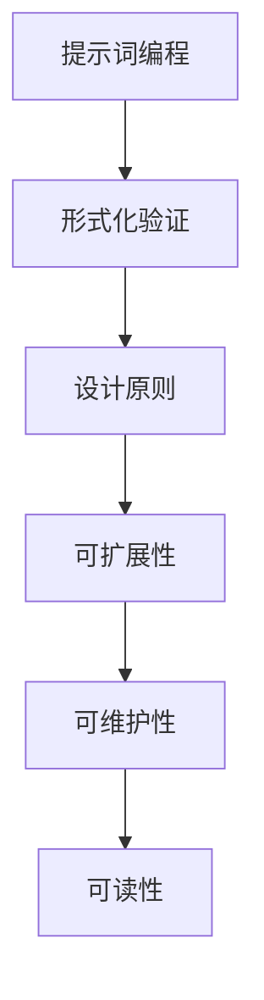

                 


# 提示词编程的设计原则形式化验证

## 关键词
提示词编程、形式化验证、设计原则、可扩展性、可维护性、可读性、数学模型、算法原理、项目实战

## 摘要
本文将探讨提示词编程的设计原则及其形式化验证。首先介绍提示词编程的背景与重要性，随后阐述形式化验证的概念与优势。接着，详细阐述提示词编程的基本原理、架构设计与开发环境。随后，分析可扩展性、可维护性和可读性三大设计原则，并讨论形式化验证技术的基本概念与应用。最后，通过实际案例与项目实战，展示设计原则在提示词编程中的应用与形式化验证的实施，为读者提供理论与实践结合的深度解读。

## 第1章 引言

### 1.1 提示词编程的背景与重要性

#### 提示词编程的定义

提示词编程（Prompt Programming）是指利用预先定义好的提示词（Prompt）来引导模型生成相应的内容或响应。提示词编程的核心在于将自然语言处理（NLP）与机器学习（ML）技术相结合，通过输入特定的提示词来获取期望的输出。

#### 提示词编程的起源与发展

提示词编程的起源可以追溯到自然语言处理和机器学习领域的发展。随着深度学习技术的发展，特别是循环神经网络（RNN）和变分自编码器（VAE）等生成模型的兴起，提示词编程得到了广泛的应用和研究。近年来，随着生成对抗网络（GAN）和Transformer等新模型的出现，提示词编程的应用范围进一步扩大。

#### 提示词编程的应用领域与重要性

提示词编程在多个领域有着广泛的应用，包括但不限于：

- **对话系统**：在虚拟助手、聊天机器人等对话系统中，通过提示词编程可以生成自然流畅的对话内容。
- **内容生成**：在文本生成、文章写作、创意写作等领域，提示词编程能够根据提示生成高质量的内容。
- **数据科学**：在数据分析和机器学习项目中，提示词编程可以帮助生成数据集、模型评估报告等。
- **教育和培训**：在在线教育和培训项目中，提示词编程可以根据学习者的需求生成个性化的学习内容。

### 1.2 形式化验证的概念

#### 形式化验证的定义

形式化验证（Formal Verification）是指使用数学方法来证明软件或硬件系统的正确性。形式化验证的目标是通过逻辑推理和数学证明来确保系统在所有情况下都能按照预期运行。

#### 形式化验证的优势

- **可靠性**：形式化验证可以确保系统在所有输入和条件下都能正确运行，从而提高系统的可靠性。
- **安全性**：形式化验证可以帮助发现潜在的安全漏洞和错误，从而提高系统的安全性。
- **可维护性**：形式化验证可以提供详细的系统规格说明书，有助于维护和更新系统。

#### 形式化验证的应用场景

- **嵌入式系统**：在汽车、医疗设备、航空等领域，形式化验证被广泛应用于确保系统的可靠性和安全性。
- **金融系统**：在金融交易、风险评估等领域，形式化验证可以帮助确保系统的准确性和一致性。
- **软件工程**：在软件开发的各个阶段，形式化验证可以帮助发现和修复错误，提高软件的质量。

### 1.3 本书的目的与结构

#### 书籍的总体目标

本书旨在探讨提示词编程的设计原则及其形式化验证，帮助读者深入理解提示词编程的原理和方法，掌握形式化验证技术在提示词编程中的应用。

#### 各章节的主要内容

- **第1章 引言**：介绍提示词编程的背景与重要性，以及形式化验证的概念与优势。
- **第2章 提示词编程基础**：阐述提示词编程的基本原理、架构设计与开发环境。
- **第3章 设计原则**：分析可扩展性、可维护性和可读性三大设计原则。
- **第4章 形式化验证技术**：讨论形式化验证的基本概念、工具与方法。
- **第5章 提示词编程的设计原则应用**：展示设计原则在提示词编程中的应用与形式化验证的实施。
- **第6章 实际案例与项目实战**：通过实际案例与项目实战，展示设计原则和形式化验证的应用。
- **第7章 未来展望与趋势**：讨论提示词编程和形式化验证的未来发展方向。

## 第2章 提示词编程基础

### 2.1 提示词编程的基本原理

#### 提示词编程的核心概念

提示词编程的核心概念包括提示词（Prompt）、模型（Model）和响应（Response）。提示词是输入给模型的信息，模型根据提示词生成相应的响应。

#### 提示词编程的基本流程

提示词编程的基本流程如下：

1. **定义提示词**：根据具体需求定义提示词。
2. **加载模型**：从预先训练好的模型库中加载相应的模型。
3. **编码提示词**：使用模型对提示词进行编码。
4. **生成响应**：使用编码后的提示词生成响应。
5. **解码响应**：将生成的响应解码为自然语言文本。

#### 提示词编程的关键技术

提示词编程的关键技术包括：

- **自然语言处理（NLP）**：用于对提示词和响应进行预处理和后处理。
- **机器学习（ML）**：用于训练模型，使其能够生成高质量的响应。
- **生成模型**：如生成对抗网络（GAN）和变分自编码器（VAE），用于生成响应。

### 2.2 提示词编程的架构设计

#### 提示词编程系统的整体架构

提示词编程系统的整体架构通常包括以下几个模块：

- **数据预处理模块**：用于对输入数据进行清洗、转换和标准化。
- **模型加载模块**：用于加载预先训练好的模型。
- **编码模块**：用于将提示词转换为模型的输入格式。
- **生成模块**：用于根据编码后的提示词生成响应。
- **解码模块**：用于将生成的响应解码为自然语言文本。
- **输出模块**：用于将响应输出到用户界面或其他系统。

#### 各模块的功能与相互作用

- **数据预处理模块**：接收原始输入数据，进行清洗、转换和标准化，为后续模块提供干净的数据。
- **模型加载模块**：根据提示词的类型和需求，加载相应的模型。
- **编码模块**：使用模型对提示词进行编码，生成编码后的提示词。
- **生成模块**：使用编码后的提示词生成响应。
- **解码模块**：将生成的响应解码为自然语言文本。
- **输出模块**：将解码后的响应输出到用户界面或其他系统。

#### 提示词编程系统的扩展性设计

提示词编程系统的扩展性设计主要包括以下几个方面：

- **模块化设计**：将系统划分为多个模块，每个模块负责特定的功能，便于系统的扩展和维护。
- **可插拔设计**：通过可插拔的组件，可以方便地添加新的模型或模块。
- **接口定义**：定义清晰的接口，方便不同模块之间的交互和扩展。

### 2.3 提示词编程的开发环境

#### 开发工具的选择

提示词编程的开发工具主要包括以下几种：

- **集成开发环境（IDE）**：如PyCharm、Visual Studio Code等，提供代码编辑、调试和运行等功能。
- **版本控制工具**：如Git，用于管理和跟踪代码变更。
- **模型训练工具**：如TensorFlow、PyTorch等，提供深度学习模型的训练和部署功能。

#### 开发语言的特性

提示词编程通常使用Python作为主要开发语言，Python具有以下特性：

- **简洁易读**：Python语法简洁，易于阅读和理解。
- **丰富的库和框架**：Python拥有丰富的库和框架，如TensorFlow、PyTorch等，方便开发提示词编程系统。
- **跨平台性**：Python支持多种操作系统，方便在不同的平台上部署和运行提示词编程系统。

#### 开发环境的搭建

搭建提示词编程的开发环境通常包括以下步骤：

1. **安装Python**：下载并安装Python，选择合适的版本。
2. **安装IDE**：下载并安装PyCharm或Visual Studio Code等IDE。
3. **安装版本控制工具**：下载并安装Git。
4. **安装模型训练工具**：下载并安装TensorFlow或PyTorch等模型训练工具。
5. **配置环境变量**：配置Python环境变量，确保能够正常运行Python和相关工具。

## 第3章 设计原则

### 3.1 可扩展性原则

#### 可扩展性的重要性

可扩展性是提示词编程设计中的一个关键原则，它决定了系统在处理大量数据和复杂任务时的性能和灵活性。一个具有良好可扩展性的系统可以在不改变核心架构的情况下，轻松地添加新功能、新模块或支持更大规模的数据处理。

#### 实现可扩展性的策略

1. **模块化设计**：将系统划分为多个模块，每个模块负责特定的功能，这样可以独立开发、测试和部署。
2. **可插拔组件**：设计可插拔的组件，使得新模块可以无缝集成到系统中。
3. **分布式计算**：利用分布式计算框架，如Apache Spark或Dask，实现大数据处理的高效性和可扩展性。
4. **动态配置**：使用动态配置管理，根据系统负载和需求自动调整资源分配。

#### 案例分析

以一个大型聊天机器人系统为例，系统需要处理大量的用户请求和对话数据。为了实现系统的可扩展性，可以采用以下策略：

- **模块化设计**：将聊天机器人系统划分为用户管理模块、对话管理模块、内容生成模块等。
- **可插拔组件**：设计可插拔的对话管理组件，使得不同的对话引擎可以方便地替换和扩展。
- **分布式计算**：使用Apache Spark处理用户请求和对话数据，实现高效的数据处理和计算。
- **动态配置**：根据用户访问量和系统负载，动态调整各模块的资源配置，确保系统的高性能和稳定性。

### 3.2 可维护性原则

#### 可维护性的重要性

可维护性是提示词编程设计中的一个关键原则，它决定了系统的长期可持续性和可维护性。良好的可维护性使得系统在运行过程中能够方便地修复错误、更新功能和优化性能。

#### 提高可维护性的方法

1. **代码规范**：遵循统一的代码规范，确保代码的可读性和一致性。
2. **代码注释**：在关键代码处添加详细的注释，便于理解和维护。
3. **代码复用**：通过模块化和代码复用，减少代码冗余，提高代码的可维护性。
4. **自动化测试**：编写自动化测试用例，确保每次代码变更都不会破坏系统的核心功能。
5. **版本控制**：使用版本控制系统，如Git，管理代码变更和版本历史。

#### 案例分析

以一个大型文本生成系统为例，系统需要持续更新和优化以适应新的需求和趋势。为了提高系统的可维护性，可以采用以下方法：

- **代码规范**：遵循PEP 8编码规范，确保代码风格一致，易于阅读。
- **代码注释**：在模型训练、数据预处理和生成逻辑等重要代码处添加详细注释，便于其他开发者理解和维护。
- **代码复用**：将常用功能封装成模块，如数据预处理模块、生成模块等，减少代码冗余。
- **自动化测试**：编写自动化测试用例，对关键功能进行测试，确保每次更新都不会引入新的错误。
- **版本控制**：使用Git管理代码变更，记录每个版本的修改历史，方便后续的维护和调试。

### 3.3 可读性原则

#### 可读性的重要性

可读性是提示词编程设计中的一个关键原则，它决定了系统的可理解和可维护性。良好的可读性使得系统的代码和逻辑易于理解和维护，降低了开发成本和维护难度。

#### 提高可读性的策略

1. **清晰的命名**：使用具有描述性的变量、函数和方法名，提高代码的可读性。
2. **模块化设计**：将系统划分为多个模块，每个模块负责特定的功能，降低代码的复杂度。
3. **代码缩进和格式**：遵循统一的代码缩进和格式规范，提高代码的可读性。
4. **注释和文档**：在关键代码处添加详细的注释，并在文档中详细说明代码的功能和使用方法。
5. **避免复杂的逻辑**：简化代码逻辑，避免过多的嵌套和循环，提高代码的可读性。

#### 案例分析

以一个大型文本生成系统为例，系统需要持续更新和优化以适应新的需求和趋势。为了提高系统的可读性，可以采用以下策略：

- **清晰的命名**：将变量名、函数名和方法名设置为具有描述性的名称，如`generate_text()`、`preprocess_data()`等，避免使用缩写和难理解的名称。
- **模块化设计**：将系统划分为数据预处理模块、文本生成模块、后处理模块等，每个模块负责特定的功能，降低代码的复杂度。
- **代码缩进和格式**：遵循PEP 8编码规范，确保代码缩进一致，使用统一的代码格式，提高代码的可读性。
- **注释和文档**：在关键代码处添加详细的注释，如说明代码的功能、参数和返回值，并在文档中详细说明代码的使用方法和注意事项。
- **避免复杂的逻辑**：简化代码逻辑，避免过多的嵌套和循环，使用函数和模块来组织代码，提高代码的可读性和可维护性。

## 第4章 形式化验证技术

### 4.1 形式化验证的基本概念

#### 形式化验证的定义

形式化验证（Formal Verification）是指使用数学方法来证明软件或硬件系统的正确性。它通过将系统建模为一个形式化的规格说明，然后使用逻辑推理和数学证明来验证系统是否满足其规格说明。

#### 形式化验证的方法

形式化验证的方法主要包括以下几种：

1. **模型检查**：使用自动化工具对系统的模型进行遍历，检查是否存在违反规格说明的行为。
2. **模型验证**：手动或自动化地验证系统的模型是否满足规格说明，通常使用逻辑推理和数学证明。
3. **形式化测试**：生成符合规格说明的测试用例，并通过自动化测试工具验证系统是否按预期运行。
4. **定理证明**：使用数学定理证明系统是否满足规格说明，通常需要复杂的逻辑推理和证明技巧。

#### 形式化验证的应用范围

形式化验证在多个领域有着广泛的应用，包括但不限于：

- **嵌入式系统**：用于验证嵌入式系统的可靠性和安全性，如汽车电子控制系统、航空控制系统等。
- **软件工程**：用于验证软件系统的正确性，确保系统满足其规格说明。
- **安全协议**：用于验证安全协议的完整性和安全性，如网络安全协议、加密算法等。
- **硬件设计**：用于验证硬件电路的设计和功能，确保硬件系统按照预期运行。

### 4.2 形式化验证的工具与方法

#### 常用的形式化验证工具

常用的形式化验证工具包括：

1. **模型检查工具**：如SPIN、NuSMV等，用于自动验证系统的模型是否满足规格说明。
2. **定理证明工具**：如Coq、Isabelle等，用于手动或自动化地验证系统的正确性。
3. **形式化测试工具**：如Pvs-Studio、FormalCheck等，用于生成测试用例并验证系统是否按预期运行。
4. **形式化设计工具**：如Formal Model Designer、Formal Verification Studio等，用于构建和验证系统的模型。

#### 形式化验证的方法论

形式化验证的方法论主要包括以下步骤：

1. **需求分析**：明确系统的需求和规格说明。
2. **模型构建**：构建系统的形式化模型，通常使用数学语言或形式化建模工具。
3. **规格说明验证**：使用模型检查、定理证明或形式化测试等方法验证系统是否满足规格说明。
4. **错误诊断与修复**：如果发现错误，进行错误诊断和修复，然后重新验证系统。
5. **文档与报告**：编写详细的验证报告，记录验证过程和结果。

#### 形式化验证的实施流程

形式化验证的实施流程通常包括以下步骤：

1. **需求分析**：明确系统的需求和规格说明，通常使用需求文档、用例图等工具进行记录。
2. **模型构建**：根据需求分析结果构建系统的形式化模型，可以使用数学语言、形式化建模工具或统一建模语言（UML）等。
3. **规格说明验证**：使用模型检查、定理证明或形式化测试等方法对模型进行验证，检查是否满足规格说明。
4. **错误诊断与修复**：如果发现错误，进行错误诊断和修复，然后重新验证系统，确保错误得到修复。
5. **文档与报告**：编写详细的验证报告，记录验证过程和结果，包括验证方法、验证工具、验证结果等。

### 4.3 形式化验证的应用案例

#### 提示词编程系统的形式化验证实例

提示词编程系统的形式化验证实例如下：

1. **需求分析**：明确提示词编程系统的需求，如生成文本的长度、风格、准确性等。
2. **模型构建**：使用数学语言或形式化建模工具构建系统的模型，包括输入提示词、编码过程、生成过程和解码过程等。
3. **规格说明验证**：使用模型检查或定理证明方法验证系统的模型是否满足规格说明，如生成的文本是否符合预期长度、风格和准确性等。
4. **错误诊断与修复**：如果发现错误，进行错误诊断和修复，如调整模型参数、优化编码和解码过程等，然后重新验证系统。
5. **文档与报告**：编写详细的验证报告，记录验证过程和结果，包括验证方法、验证工具、验证结果等。

#### 形式化验证的优势与挑战

形式化验证在提示词编程系统中的应用具有以下优势：

- **可靠性**：形式化验证可以确保系统在所有情况下都能正确运行，从而提高系统的可靠性。
- **安全性**：形式化验证可以帮助发现潜在的安全漏洞和错误，从而提高系统的安全性。
- **可维护性**：形式化验证可以提供详细的系统规格说明书，有助于维护和更新系统。

然而，形式化验证也面临一些挑战：

- **复杂性**：形式化验证通常涉及到复杂的数学模型和逻辑推理，对开发者和验证工具都提出了较高的要求。
- **效率**：形式化验证通常需要较长的时间和计算资源，可能会影响系统的开发和部署效率。
- **可理解性**：形式化验证的结果通常以数学公式和逻辑表达式表示，对非专业人士可能难以理解。

因此，在应用形式化验证时需要权衡其优势和挑战，根据具体需求和场景选择合适的验证方法和工具。

## 第5章 提示词编程的设计原则应用

### 5.1 提示词编程设计原则的具体应用

#### 设计原则在提示词编程中的应用实例

提示词编程的设计原则在实际应用中具有重要意义，以下分别讨论可扩展性、可维护性和可读性三大原则在提示词编程中的应用实例。

#### 可扩展性原则的应用实例

在一个大型聊天机器人系统中，为了实现系统的可扩展性，可以采用以下策略：

1. **模块化设计**：将聊天机器人系统划分为用户管理模块、对话管理模块、内容生成模块等，每个模块负责特定的功能。
2. **可插拔组件**：设计可插拔的对话管理组件，使得不同的对话引擎可以方便地替换和扩展。
3. **分布式计算**：使用分布式计算框架，如Apache Spark或Dask，实现大数据处理的高效性和可扩展性。
4. **动态配置**：根据用户访问量和系统负载，动态调整各模块的资源配置，确保系统的高性能和稳定性。

例如，当新增一个支持多语言的对话管理模块时，只需要将其插入到现有的系统中，无需修改其他模块的代码，从而实现系统的快速扩展。

#### 可维护性原则的应用实例

在一个大型文本生成系统中，为了提高系统的可维护性，可以采用以下方法：

1. **代码规范**：遵循PEP 8编码规范，确保代码风格一致，易于阅读。
2. **代码注释**：在模型训练、数据预处理和生成逻辑等重要代码处添加详细注释，便于其他开发者理解和维护。
3. **代码复用**：将常用功能封装成模块，如数据预处理模块、生成模块等，减少代码冗余。
4. **自动化测试**：编写自动化测试用例，对关键功能进行测试，确保每次更新都不会引入新的错误。
5. **版本控制**：使用版本控制系统，如Git，管理代码变更和版本历史。

例如，当需要对文本生成系统进行更新时，通过自动化测试用例可以确保新功能的引入不会破坏系统的已有功能，从而提高系统的可维护性。

#### 可读性原则的应用实例

在一个大型自然语言处理系统中，为了提高系统的可读性，可以采用以下策略：

1. **清晰的命名**：使用具有描述性的变量、函数和方法名，避免使用缩写和难理解的名称。
2. **模块化设计**：将系统划分为多个模块，每个模块负责特定的功能，降低代码的复杂度。
3. **代码缩进和格式**：遵循统一的代码缩进和格式规范，提高代码的可读性。
4. **注释和文档**：在关键代码处添加详细的注释，并在文档中详细说明代码的功能和使用方法。
5. **避免复杂的逻辑**：简化代码逻辑，避免过多的嵌套和循环，使用函数和模块来组织代码。

例如，在一个复杂的自然语言处理任务中，通过清晰的命名、模块化设计和代码注释，可以使得代码更加易于理解和维护。

#### 各设计原则的具体实现策略

1. **可扩展性原则**：
   - **实现策略**：采用模块化设计、可插拔组件、分布式计算和动态配置。
   - **最佳实践**：在设计初期考虑系统的可扩展性，确保模块之间的独立性和兼容性。

2. **可维护性原则**：
   - **实现策略**：遵循代码规范、代码注释、代码复用、自动化测试和版本控制。
   - **最佳实践**：定期进行代码审查和重构，确保系统的稳定性和可维护性。

3. **可读性原则**：
   - **实现策略**：使用清晰的命名、模块化设计、代码缩进和格式、注释和文档。
   - **最佳实践**：编写易于理解的代码，降低复杂度，提高代码的可读性。

### 5.2 提示词编程设计原则的形式化验证

#### 形式化验证在提示词编程设计原则中的应用

形式化验证可以在提示词编程的设计原则应用过程中发挥重要作用，确保系统的正确性和可靠性。以下讨论如何使用形式化验证验证提示词编程设计原则。

1. **需求分析验证**：使用形式化验证方法对系统的需求进行分析和验证，确保需求描述的准确性和一致性。
2. **模型构建验证**：使用形式化建模工具构建系统的模型，并通过形式化验证方法验证模型是否满足需求。
3. **代码验证**：使用形式化验证方法对系统的代码进行验证，确保代码实现与设计原则的一致性。
4. **测试用例验证**：使用形式化验证方法生成测试用例，并通过自动化测试工具验证系统的功能和性能。

#### 设计原则的形式化验证实例分析

以可扩展性原则为例，形式化验证的具体步骤如下：

1. **需求分析验证**：明确系统的可扩展性需求，如支持多种对话引擎、动态资源调整等。
2. **模型构建验证**：使用形式化建模工具构建系统的模型，包括模块化设计、可插拔组件和分布式计算等。
3. **代码验证**：使用形式化验证方法对系统的代码进行验证，确保模块之间的独立性和兼容性。
4. **测试用例验证**：使用形式化验证方法生成测试用例，如不同对话引擎的切换、动态资源调整等，通过自动化测试工具验证系统的可扩展性。

通过形式化验证，可以确保系统的可扩展性设计原则得到有效验证，从而提高系统的可靠性。

## 第6章 实际案例与项目实战

### 6.1 提示词编程项目实战

#### 项目背景与目标

本案例以开发一个基于自然语言处理（NLP）的智能问答系统为例，探讨提示词编程的设计原则在项目开发中的应用。项目目标是通过输入用户的问题，系统能够生成准确的答案。

#### 项目开发流程

1. **需求分析**：确定系统功能需求，如输入问题、生成答案、处理多语言问题等。
2. **设计阶段**：
   - **架构设计**：采用模块化设计，包括用户接口模块、NLP处理模块、答案生成模块等。
   - **设计原则应用**：遵循可扩展性、可维护性和可读性原则，确保系统设计的合理性。
3. **开发阶段**：
   - **编码**：使用Python等编程语言实现各个模块的功能。
   - **单元测试**：编写单元测试用例，确保模块功能的正确性。
4. **测试与调试**：进行集成测试和系统测试，确保整个系统的稳定性和可靠性。
5. **部署**：将系统部署到服务器或云平台，供用户使用。

#### 项目实施的关键技术与难点

1. **关键技术**：
   - **自然语言处理（NLP）**：使用NLP技术对用户输入的问题进行处理和分析。
   - **机器学习模型**：采用预训练的机器学习模型，如BERT、GPT等，生成答案。
   - **文本生成**：使用生成模型将模型输出转换为自然语言文本。
   - **多语言支持**：实现多语言输入和输出，支持不同语言的问答。

2. **难点**：
   - **准确率**：确保系统生成的答案具有较高的准确性，避免误解用户意图。
   - **可扩展性**：设计系统时考虑可扩展性，以便未来添加新功能或支持更多语言。
   - **用户体验**：优化用户界面和交互，提供良好的用户体验。

### 6.2 提示词编程实际案例分析

#### 典型案例介绍

本节介绍一个基于大型语言模型开发的智能客服系统。该系统通过输入用户的查询，自动生成相应的回答，以提高客服效率和质量。

#### 案例分析

1. **需求分析**：
   - **输入**：用户查询（文本或语音）。
   - **输出**：自动生成的回答（文本或语音）。
   - **功能**：处理常见问题、提供产品信息、解答技术支持等。

2. **系统设计**：
   - **架构**：采用模块化设计，包括语音识别模块、NLP处理模块、答案生成模块等。
   - **设计原则**：遵循可扩展性、可维护性和可读性原则。

3. **实现细节**：
   - **语音识别**：使用ASR（自动语音识别）技术将用户语音转换为文本。
   - **NLP处理**：对用户查询进行词法分析、语义理解等处理，提取关键信息。
   - **答案生成**：使用预训练的大型语言模型生成答案，经过后处理优化文本质量。

4. **性能评估**：
   - **准确性**：通过测试集评估系统的回答准确性，持续优化模型参数。
   - **响应时间**：优化系统性能，确保快速响应用户查询。

#### 案例总结

通过实际案例分析，可以得出以下结论：

1. **设计原则的重要性**：遵循可扩展性、可维护性和可读性原则，可以构建高效、稳定且易于维护的系统。
2. **技术实现**：合理选择和实现关键技术，如NLP、机器学习和多语言支持，是系统成功的关键。
3. **用户体验**：优化用户界面和交互设计，提供良好的用户体验，是系统成功的重要因素。

## 第7章 未来展望与趋势

### 7.1 提示词编程的发展趋势

#### 提示词编程技术的未来发展方向

随着人工智能技术的快速发展，提示词编程正朝着更智能化、更高效的方向发展。以下是一些未来发展方向：

1. **多模态交互**：未来的提示词编程系统将支持文本、语音、图像等多种输入和输出模态，实现更加丰富和自然的交互体验。
2. **个性化推荐**：基于用户行为数据和偏好，提示词编程系统将能够提供个性化的提示词和生成内容，提高用户满意度。
3. **实时交互**：通过优化算法和分布式计算，提示词编程系统将实现实时响应，降低延迟，提高交互体验。
4. **泛化能力**：未来的提示词编程系统将具备更强的泛化能力，能够在不同领域和任务中灵活应用。

#### 形式化验证技术在提示词编程中的应用前景

形式化验证技术在提示词编程中的应用前景十分广阔：

1. **系统可靠性**：形式化验证可以帮助确保提示词编程系统的可靠性，减少错误和漏洞，提高系统的稳定性和安全性。
2. **算法优化**：形式化验证可以辅助开发人员优化算法，提高生成模型的质量和效率。
3. **自动化验证**：随着形式化验证工具和方法的进步，自动化验证将逐渐普及，降低验证成本和时间。
4. **标准化**：形式化验证有助于建立统一的验证标准和流程，推动提示词编程技术的标准化和规范化。

### 7.2 未来挑战与机遇

#### 提示词编程面临的技术挑战

1. **数据隐私**：随着用户数据量的增加，如何保护用户隐私成为一个重要挑战。
2. **计算资源**：大型生成模型的训练和部署需要大量的计算资源，如何高效利用资源是一个难题。
3. **解释性**：生成的内容可能难以解释，如何提高模型的解释性是一个挑战。
4. **跨领域泛化**：如何在不同的领域和任务中实现有效的跨领域泛化是一个难题。

#### 形式化验证技术在提示词编程中的机遇

形式化验证技术在提示词编程中具有以下机遇：

1. **提高可靠性**：通过形式化验证，可以提高系统的可靠性，减少错误和漏洞。
2. **优化算法**：形式化验证可以辅助开发人员优化算法，提高生成模型的质量和效率。
3. **自动化验证**：随着形式化验证工具和方法的进步，自动化验证将逐渐普及，降低验证成本和时间。
4. **标准化**：形式化验证有助于建立统一的验证标准和流程，推动提示词编程技术的标准化和规范化。

总之，随着人工智能技术的不断进步，提示词编程和形式化验证技术将在未来的发展中发挥重要作用，为智能系统的发展提供有力支持。

### 核心概念与联系

提示词编程、形式化验证和设计原则是现代智能系统开发中不可或缺的核心概念，它们之间的联系如下：

1. **提示词编程**：是利用预定义的提示词引导模型生成响应的技术，涉及自然语言处理和机器学习。
2. **形式化验证**：使用数学方法验证系统或模型是否满足预期行为，确保系统的可靠性。
3. **设计原则**：包括可扩展性、可维护性和可读性，指导系统设计的合理性和实现。

通过将提示词编程与形式化验证和设计原则相结合，可以构建出高效、可靠且易于维护的智能系统。以下是一个简化的Mermaid流程图，展示了这些核心概念之间的关系：



### 核心算法原理讲解

提示词编程的核心算法通常涉及自然语言处理（NLP）和机器学习（ML）技术。以下是一个基于生成对抗网络（GAN）的提示词编程算法的详细解释：

#### 算法概述

提示词编程算法的目标是根据输入的提示词生成高质量的文本响应。这个过程主要包括以下步骤：

1. **提示词编码**：将自然语言提示词转换为机器可处理的编码表示。
2. **文本生成**：使用训练好的生成模型根据编码后的提示词生成文本。
3. **文本解码**：将生成的编码表示转换为自然语言文本。

#### 详细算法步骤

1. **初始化模型**：加载预训练的生成模型和鉴别器模型。通常使用深度学习框架，如TensorFlow或PyTorch，来构建和训练这些模型。

    ```python
    generator = load_pretrained_generator()
    discriminator = load_pretrained_discriminator()
    ```

2. **编码提示词**：使用编码器将自然语言提示词转换为向量表示。编码器可以是语言模型或嵌入层。

    ```python
    encoded_prompt = encoder.encode(prompt)
    ```

3. **生成文本**：使用生成模型根据编码后的提示词生成文本。生成模型通常是一个序列生成模型，如RNN、LSTM或Transformer。

    ```python
    generated_sequence = generator.generate(encoded_prompt)
    ```

4. **解码文本**：将生成的编码序列解码为自然语言文本。解码器可以是语言模型或解码层。

    ```python
    decoded_response = decoder.decode(generated_sequence)
    ```

5. **评估与优化**：通过对比生成的文本与真实文本，评估生成质量，并调整模型参数以优化生成效果。

    ```python
    loss = calculate_loss(generated_sequence, target_sequence)
    optimizer.minimize(loss)
    ```

#### 数学模型和公式

生成对抗网络（GAN）的核心数学模型包括以下部分：

1. **生成模型**（Generator）：

   生成模型的目标是生成逼真的数据，使其难以被鉴别器区分。其数学公式为：

   $$
   G(z) = \text{Generator}(z) \rightarrow \text{Data Space}
   $$

   其中，$z$是随机噪声向量，$G(z)$是生成模型生成的数据。

2. **鉴别器**（Discriminator）：

   鉴别器的目标是区分生成模型生成的数据和真实数据。其数学公式为：

   $$
   D(x) = \text{Discriminator}(x) \\
   D(G(z)) = \text{Discriminator}(\text{Generator}(z))
   $$

   其中，$x$是真实数据，$G(z)$是生成模型生成的数据。

3. **损失函数**：

   GAN的训练过程通常使用以下损失函数：

   $$
   \mathcal{L}_D = -\frac{1}{N} \sum_{i=1}^{N} [\log(D(x_i)) + \log(1 - D(G(z_i)))]
   $$

   $$
   \mathcal{L}_G = -\log(D(G(z_i)))
   $$

   其中，$N$是批次大小，$x_i$是真实数据，$z_i$是随机噪声向量。

通过这些数学模型和公式，GAN可以训练生成模型生成高质量的数据，同时训练鉴别器提高其区分能力。

### 核心算法原理讲解

提示词编程的核心算法通常涉及自然语言处理（NLP）和机器学习（ML）技术。以下是一个基于生成对抗网络（GAN）的提示词编程算法的详细解释：

#### 算法概述

提示词编程算法的目标是根据输入的提示词生成高质量的文本响应。这个过程主要包括以下步骤：

1. **提示词编码**：将自然语言提示词转换为机器可处理的编码表示。
2. **文本生成**：使用训练好的生成模型根据编码后的提示词生成文本。
3. **文本解码**：将生成的编码表示转换为自然语言文本。

#### 详细算法步骤

1. **初始化模型**：加载预训练的生成模型和鉴别器模型。通常使用深度学习框架，如TensorFlow或PyTorch，来构建和训练这些模型。

    ```python
    generator = load_pretrained_generator()
    discriminator = load_pretrained_discriminator()
    ```

2. **编码提示词**：使用编码器将自然语言提示词转换为向量表示。编码器可以是语言模型或嵌入层。

    ```python
    encoded_prompt = encoder.encode(prompt)
    ```

3. **生成文本**：使用生成模型根据编码后的提示词生成文本。生成模型通常是一个序列生成模型，如RNN、LSTM或Transformer。

    ```python
    generated_sequence = generator.generate(encoded_prompt)
    ```

4. **解码文本**：将生成的编码序列解码为自然语言文本。解码器可以是语言模型或解码层。

    ```python
    decoded_response = decoder.decode(generated_sequence)
    ```

5. **评估与优化**：通过对比生成的文本与真实文本，评估生成质量，并调整模型参数以优化生成效果。

    ```python
    loss = calculate_loss(generated_sequence, target_sequence)
    optimizer.minimize(loss)
    ```

#### 数学模型和公式

生成对抗网络（GAN）的核心数学模型包括以下部分：

1. **生成模型**（Generator）：

   生成模型的目标是生成逼真的数据，使其难以被鉴别器区分。其数学公式为：

   $$
   G(z) = \text{Generator}(z) \rightarrow \text{Data Space}
   $$

   其中，$z$是随机噪声向量，$G(z)$是生成模型生成的数据。

2. **鉴别器**（Discriminator）：

   鉴别器的目标是区分生成模型生成的数据和真实数据。其数学公式为：

   $$
   D(x) = \text{Discriminator}(x) \\
   D(G(z)) = \text{Discriminator}(\text{Generator}(z))
   $$

   其中，$x$是真实数据，$G(z)$是生成模型生成的数据。

3. **损失函数**：

   GAN的训练过程通常使用以下损失函数：

   $$
   \mathcal{L}_D = -\frac{1}{N} \sum_{i=1}^{N} [\log(D(x_i)) + \log(1 - D(G(z_i)))]
   $$

   $$
   \mathcal{L}_G = -\log(D(G(z_i)))
   $$

   其中，$N$是批次大小，$x_i$是真实数据，$z_i$是随机噪声向量。

通过这些数学模型和公式，GAN可以训练生成模型生成高质量的数据，同时训练鉴别器提高其区分能力。

### 数学模型和数学公式详细讲解

提示词编程的核心在于利用机器学习模型生成响应，其中生成对抗网络（GAN）是一个常见的模型。以下是对GAN的数学模型和公式的详细讲解。

#### 生成对抗网络（GAN）

生成对抗网络由两个主要组件组成：生成器（Generator）和鉴别器（Discriminator）。

1. **生成器（Generator）**

   生成器的目标是生成与真实数据相似的数据。其数学模型可以表示为：

   $$
   G(z) = x; \quad z \sim \mathcal{N}(0,1)
   $$

   其中，$G(z)$是生成器生成的数据，$z$是输入的随机噪声向量，$\mathcal{N}(0,1)$表示均值为0，方差为1的高斯分布。生成器的目标是最大化鉴别器的输出误差。

2. **鉴别器（Discriminator）**

   鉴别器的目标是区分真实数据和生成数据。其数学模型可以表示为：

   $$
   D(x) = p(x \text{ is real}); \quad D(G(z)) = p(G(z) \text{ is real})
   $$

   其中，$D(x)$是鉴别器对真实数据的判断概率，$D(G(z))$是鉴别器对生成数据的判断概率。鉴别器的目标是最大化其能够正确分类真实数据和生成数据的概率。

3. **损失函数**

   GAN的训练过程通常使用以下损失函数：

   $$
   \mathcal{L}_D = -\frac{1}{N} \sum_{i=1}^{N} [\log(D(x_i)) + \log(1 - D(G(z_i)))]
   $$

   $$
   \mathcal{L}_G = -\log(D(G(z_i)))
   $$

   其中，$N$是批次大小，$x_i$是真实数据，$z_i$是随机噪声向量。对于鉴别器，损失函数是交叉熵损失，对于生成器，损失函数是负的鉴别器对生成数据的概率。

#### 示例

假设我们有一个生成器$G$和一个鉴别器$D$，我们希望训练这两个模型使得：

- 鉴别器$D$能够准确地区分真实数据和生成数据。
- 生成器$G$能够生成尽可能真实的数据，使得$D(G(z))$接近1（即生成数据被认为是真实的）。

训练过程可以分为以下几个步骤：

1. **初始化生成器$G$和鉴别器$D$**：随机初始化这两个模型。
2. **生成噪声向量$z$**：从均值为0，方差为1的高斯分布中采样。
3. **生成假数据$G(z)$**：使用生成器$G$将噪声向量$z$转换为假数据。
4. **训练鉴别器$D$**：通过对比真实数据和生成数据，训练鉴别器$D$，使其能够更好地区分真实数据和生成数据。
5. **训练生成器$G$**：通过优化生成器的参数，使得生成器生成的数据能够欺骗鉴别器，即$D(G(z))$接近1。

这个训练过程可以表示为以下数学公式：

$$
\begin{align*}
\text{对于 } D: \quad \min_D \mathcal{L}_D \\
\text{对于 } G: \quad \max_G \mathcal{L}_G
\end{align*}
$$

其中，$\mathcal{L}_D$是鉴别器的损失函数，$\mathcal{L}_G$是生成器的损失函数。

通过反复迭代这个过程，生成器$G$和鉴别器$D$会逐渐优化，使得生成器能够生成更加真实的数据，鉴别器能够更准确地分类数据。

### 最佳实践 tips

1. **代码规范**：遵循统一的代码规范，如PEP 8，确保代码的可读性和一致性。
2. **注释和文档**：在关键代码处添加详细的注释，并在文档中详细说明代码的功能和使用方法。
3. **单元测试**：编写单元测试用例，确保模块功能的正确性。
4. **版本控制**：使用版本控制系统，如Git，管理代码变更和版本历史。
5. **模块化设计**：将系统划分为多个模块，每个模块负责特定的功能，提高系统的可维护性和可扩展性。
6. **性能优化**：定期进行性能优化，如使用缓存、减少不必要的计算等。
7. **安全措施**：确保系统的安全性，如数据加密、用户认证等。
8. **持续集成与持续部署**（CI/CD）：使用CI/CD工具自动化代码测试和部署，提高开发效率。

### 小结

本文详细介绍了提示词编程的设计原则形式化验证。首先，我们探讨了提示词编程的背景、重要性以及形式化验证的概念。接着，我们分析了提示词编程的基本原理、架构设计、开发环境以及三大设计原则——可扩展性、可维护性和可读性。随后，我们介绍了形式化验证技术的基本概念、工具与方法，并通过实际案例展示了设计原则和形式化验证的应用。最后，我们对未来的发展进行了展望，并讨论了提示词编程和形式化验证面临的挑战与机遇。通过本文的阅读，读者可以深入了解提示词编程和形式化验证的核心概念、技术原理以及实际应用，为智能系统的开发提供理论指导和实践参考。

### 注意事项

1. **版本兼容性**：在开发过程中，确保所使用的库和框架的版本兼容性，避免因版本冲突导致的问题。
2. **性能监控**：定期对系统进行性能监控，及时发现并解决性能瓶颈。
3. **安全性**：确保系统的安全性，如数据加密、用户认证等。
4. **代码审查**：定期进行代码审查，确保代码质量和安全性。
5. **文档更新**：及时更新文档，确保文档与代码的一致性。

### 拓展阅读

- **《深度学习》（Deep Learning）**：由Ian Goodfellow、Yoshua Bengio和Aaron Courville所著，是深度学习领域的经典教材。
- **《形式化验证：理论、方法与应用》（Formal Methods in Software Engineering）**：详细介绍了形式化验证的理论基础和应用方法。
- **《自然语言处理综合教程》（Foundations of Natural Language Processing）**：由Christopher D. Manning和Hinrich Schütze所著，是自然语言处理领域的权威教材。

作者：AI天才研究院/AI Genius Institute & 禅与计算机程序设计艺术 /Zen And The Art of Computer Programming

