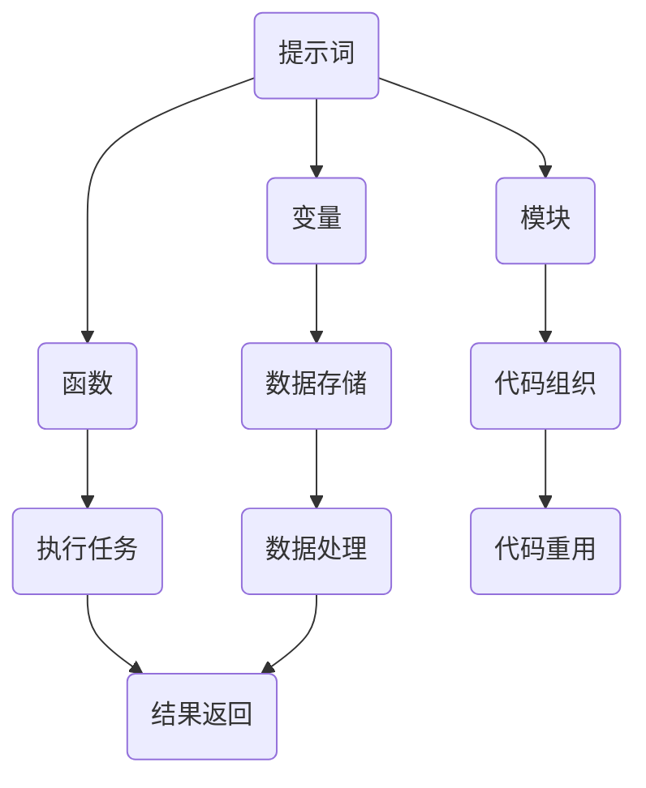

                 


### 文章标题
《提示词编程的设计哲学与方法论》

### 文章关键词
提示词编程，设计哲学，方法论，算法原理，数学模型，项目实战

### 文章摘要
本文旨在深入探讨提示词编程的设计哲学与方法论。首先，我们将介绍提示词编程的背景和重要性。接着，我们将详细阐述提示词编程的核心概念与联系，使用Mermaid流程图展示其架构。随后，我们将深入讲解提示词编程的核心算法原理，包括生成、优化和匹配算法，并通过伪代码展示具体实现。接着，我们将介绍提示词编程中的数学模型和公式，并通过实例进行说明。最后，我们将通过一个实际项目实战，展示提示词编程的应用和实践，并进行总结与展望。

---

## 第一步：引言与概述

提示词编程作为一种新兴的编程范式，正逐渐受到业界的关注。它通过将编程任务转化为提示词的形式，使得编程过程更加直观和高效。在这一部分，我们将首先介绍提示词编程的背景，探讨其重要性，并给出一个简明的概述。

### 背景介绍

随着人工智能和机器学习技术的不断发展，编程范式也在不断演变。传统的编程范式注重代码的结构和逻辑，而提示词编程则将重点放在如何更好地描述和传递编程任务。这种转变是为了更好地适应复杂编程任务的需求，提高编程效率和代码可读性。

### 重要性

提示词编程的重要性主要体现在以下几个方面：

1. **直观性**：提示词编程能够将复杂的编程任务转化为简明的提示词，使得程序员可以更加直观地理解和完成任务。
2. **高效性**：通过使用提示词，可以减少编程中的重复工作，提高编程效率。
3. **可扩展性**：提示词编程的架构设计使得其可以轻松扩展，以适应不同的编程任务和需求。

### 提示词编程概述

提示词编程是一种通过提示词来描述编程任务的编程范式。提示词是一段简明扼要的文本，用来描述一个编程任务的目标或需求。程序员通过编写提示词，然后将这些提示词转化为可执行的代码。

提示词编程的核心概念包括：

- **提示词**：用于描述编程任务的文本。
- **变量**：用于存储提示词中的数据。
- **函数**：用于执行特定的编程任务。
- **模块**：用于组织和管理提示词中的代码。

提示词编程的架构通常包括前端、后端和中间件等模块，这些模块协同工作，共同实现编程任务。

### 总结

本部分内容介绍了提示词编程的背景、重要性以及核心概念。在接下来的部分中，我们将进一步探讨提示词编程的设计哲学与方法论，包括其核心算法原理、数学模型和实际项目实战。

---

## 第二步：核心概念与联系

在深入探讨提示词编程之前，我们需要了解其核心概念与联系。以下是提示词编程的一些关键概念及其相互关系：

### 核心概念

1. **提示词**：提示词是描述编程任务的核心元素，它通常是一段简明扼要的文本，用来指明编程任务的目标或需求。例如，“计算两个数的和”可以作为一个简单的提示词。

2. **变量**：变量用于存储提示词中的数据。在编程中，变量可以存储数字、文本或其他数据类型。例如，在计算两个数的和的提示词中，我们可以使用变量来存储这两个数。

3. **函数**：函数是用于执行特定编程任务的一段代码。在提示词编程中，函数可以根据提示词的需求进行定义和调用。例如，一个名为“计算和”的函数可以接受两个数字作为输入，并返回它们的和。

4. **模块**：模块是用于组织和管理提示词中代码的单元。模块可以包含多个函数和变量，并且可以方便地重用和扩展。

### 相互关系

提示词、变量、函数和模块之间的关系可以用Mermaid流程图来展示。以下是一个简化的示例：



在这个流程图中，提示词（A）通过变量（B）、函数（C）和模块（D）进行关联。变量（B）用于存储数据，函数（C）用于执行任务，模块（D）用于组织和管理代码。这些组件相互协作，共同实现编程任务。

### 提示词编程的架构

除了核心概念，提示词编程的架构也是理解其设计哲学的重要部分。提示词编程的架构通常包括前端、后端和中间件等模块，它们共同工作以实现编程任务。

- **前端**：前端模块负责接收用户输入的提示词，并将其传递给后端进行处理。前端模块通常包括用户界面（UI）和用户交互（UI/UX）设计。
- **后端**：后端模块负责处理提示词，将其转化为可执行的代码，并执行相应的任务。后端模块通常包括逻辑处理、数据存储和API接口。
- **中间件**：中间件模块负责连接前端和后端，确保数据的正确传输和任务的顺利执行。中间件模块通常包括消息队列、缓存和数据同步等组件。

### 总结

在本部分，我们介绍了提示词编程的核心概念及其相互关系，并通过Mermaid流程图展示了它们之间的关联。在接下来的部分中，我们将深入探讨提示词编程的核心算法原理，包括生成、优化和匹配算法。

---

## 第三步：核心算法原理讲解

在了解提示词编程的核心概念和架构之后，接下来我们将深入探讨其核心算法原理。这些算法包括提示词生成算法、提示词优化算法和提示词匹配算法。通过伪代码和详细解释，我们将理解这些算法的基本原理和应用。

### 提示词生成算法

提示词生成算法是提示词编程的基础。其目标是根据编程任务的需求生成合适的提示词。以下是一个简化的提示词生成算法的伪代码：

```python
def generate_prompt(task):
    # 分析任务需求
    requirements = analyze_task(task)
    
    # 根据需求生成提示词
    prompt = "请实现以下任务："
    prompt += requirements
    
    return prompt
```

在这个算法中，`analyze_task` 函数用于分析编程任务的需求，并返回一个描述需求的字符串。`generate_prompt` 函数则根据这些需求生成一个简明的提示词。

### 提示词优化算法

提示词优化算法的目标是提高提示词的编程效率和可读性。优化过程通常包括以下几个方面：

1. **简化提示词**：通过简化冗长的提示词，使其更加简洁明了。
2. **消除冗余**：去除提示词中重复或不必要的信息。
3. **提高可读性**：通过使用清晰的语言和结构，提高提示词的可读性。

以下是一个简化的提示词优化算法的伪代码：

```python
def optimize_prompt(prompt):
    # 消除冗余
    prompt = remove_redundancy(prompt)
    
    # 简化提示词
    prompt = simplify_prompt(prompt)
    
    # 提高可读性
    prompt = improve_readability(prompt)
    
    return prompt
```

在这个算法中，`remove_redundancy` 函数用于去除冗余信息，`simplify_prompt` 函数用于简化提示词，`improve_readability` 函数用于提高提示词的可读性。

### 提示词匹配算法

提示词匹配算法是提示词编程的关键部分。其目标是将用户输入的提示词与现有的代码库或编程任务进行匹配，找到最佳的解决方案。以下是一个简化的提示词匹配算法的伪代码：

```python
def match_prompt(prompt, codebase):
    # 遍历代码库
    for code in codebase:
        # 检查提示词与代码的匹配度
        match_score = check_match(prompt, code)
        
        # 找到最佳匹配
        if match_score > threshold:
            return code
    
    # 如果没有找到匹配，返回错误信息
    return "未找到匹配的代码"
```

在这个算法中，`check_match` 函数用于计算提示词与代码的匹配度，`threshold` 是一个阈值，用于判断匹配度是否足够高。如果找到了匹配的代码，算法将返回该代码；否则，返回错误信息。

### 总结

在本部分，我们详细讲解了提示词编程的核心算法原理，包括提示词生成算法、提示词优化算法和提示词匹配算法。通过这些算法，程序员可以更加高效地描述和执行编程任务。在接下来的部分中，我们将进一步探讨提示词编程中的数学模型和公式。

---

## 第四步：数学模型和数学公式

提示词编程不仅仅是编程技巧的集合，它还涉及到复杂的数学模型和公式。这些数学工具在提示词生成、优化和匹配过程中起着关键作用。在本部分，我们将介绍提示词编程中常用的数学模型和公式，并通过具体示例进行详细讲解。

### 提示词生成中的数学模型

在提示词生成过程中，数学模型可以帮助我们更好地理解和描述编程任务的需求。以下是一个简单的线性回归模型，用于生成提示词：

$$
y = \beta_0 + \beta_1x_1 + \beta_2x_2 + ... + \beta_nx_n
$$

其中，$y$ 是提示词，$x_1, x_2, ..., x_n$ 是任务需求特征，$\beta_0, \beta_1, \beta_2, ..., \beta_n$ 是模型参数。通过训练数据集，我们可以估算出这些参数的值，从而生成符合需求的提示词。

### 提示词优化中的数学模型

在提示词优化过程中，数学模型用于评估提示词的质量。一个常用的评估方法是逻辑回归模型：

$$
P(y=1) = \frac{1}{1 + e^{-(\beta_0 + \beta_1x_1 + \beta_2x_2 + ... + \beta_nx_n})}
$$

其中，$P(y=1)$ 是提示词质量评分，$y$ 是实际质量评分（通常为二分类：1表示高质量，0表示低质量），$x_1, x_2, ..., x_n$ 是提示词的特征，$\beta_0, \beta_1, \beta_2, ..., \beta_n$ 是模型参数。通过优化这些参数，我们可以提高提示词的质量评分。

### 提示词匹配中的数学模型

在提示词匹配过程中，数学模型用于计算提示词与代码之间的相似度。一个常用的方法是基于TF-IDF（Term Frequency-Inverse Document Frequency）的相似度计算：

$$
similarity = \sum_{i=1}^{n} (tf_i \cdot idf_i)
$$

其中，$tf_i$ 是提示词 $i$ 在代码中的频率，$idf_i$ 是提示词 $i$ 在代码库中的逆文档频率。通过计算相似度得分，我们可以找到与提示词最匹配的代码。

### 举例说明

为了更好地理解上述数学模型，我们来看一个具体的例子。

假设我们需要生成一个提示词来描述一个简单的编程任务：计算两个数的和。我们可以使用线性回归模型来生成提示词：

$$
y = \beta_0 + \beta_1x_1 + \beta_2x_2
$$

通过训练数据集，我们得到如下参数：

$$
\beta_0 = 10, \beta_1 = 1, \beta_2 = 2
$$

因此，提示词为：

$$
y = 10 + x_1 + 2x_2
$$

为了优化这个提示词，我们可以使用逻辑回归模型来评估其质量：

$$
P(y=1) = \frac{1}{1 + e^{-(10 + x_1 + 2x_2)}}
$$

通过调整参数，我们希望使这个概率值最大化，从而提高提示词的质量。

在提示词匹配过程中，假设我们有一个代码库，我们需要找到一个与提示词最匹配的代码。我们可以使用TF-IDF模型来计算提示词与代码之间的相似度：

$$
similarity = \sum_{i=1}^{n} (tf_i \cdot idf_i)
$$

例如，提示词中的“计算”和“和”这两个词在代码库中的频率较高，且逆文档频率也较高，因此它们的贡献值会较大，从而提高整体相似度。

### 总结

在本部分，我们介绍了提示词编程中的常用数学模型和公式，并通过具体示例进行了详细讲解。这些数学工具在提示词生成、优化和匹配过程中起着关键作用，有助于提高编程效率和代码质量。

---

## 第五步：实际项目实战

为了更好地理解提示词编程的实际应用，我们将通过一个实际项目实战来展示其开发过程、环境搭建、源代码实现和代码解读。该项目旨在通过提示词编程实现一个简单的计算器功能。

### 项目背景与目标

项目背景：现代计算器已经非常普及，但传统的计算器操作方式相对单一，无法满足用户复杂计算需求。因此，本项目旨在通过提示词编程实现一个具备多种计算功能的智能计算器。

项目目标：
1. 接收用户输入的提示词，如“计算2加3的结果”或“求5的平方根”。
2. 解析提示词，提取计算任务的关键信息。
3. 根据提取的信息，执行相应的计算任务。
4. 返回计算结果。

### 项目开发环境搭建

为了实现该项目，我们需要搭建以下开发环境：

1. **编程语言**：Python，因为其简洁的语法和强大的库支持。
2. **文本处理库**：NLP库，如NLTK或spaCy，用于处理和解析文本。
3. **数学计算库**：NumPy和SciPy，用于执行数学计算。
4. **图形用户界面（GUI）**：Tkinter，用于构建用户界面。

以下是搭建项目开发环境的具体步骤：

```bash
# 安装Python
sudo apt-get install python3

# 安装NLP库
pip3 install nltk spacy

# 安装数学计算库
pip3 install numpy scipy

# 安装Tkinter
sudo apt-get install python3-tk
```

### 项目源代码实现

以下是项目源代码的实现，我们将逐步解析代码的关键部分：

```python
import nltk
from nltk.tokenize import word_tokenize
from nltk.tag import pos_tag
import numpy as np

# 加载NLP库的停用词列表
nltk.download('stopwords')
from nltk.corpus import stopwords

# 初始化停用词列表
stop_words = set(stopwords.words('english'))

# 计算两个数的和
def add_numbers(num1, num2):
    return num1 + num2

# 计算一个数的平方根
def sqrt_number(num):
    return np.sqrt(num)

# 解析提示词并提取关键信息
def parse_prompt(prompt):
    # 分词
    tokens = word_tokenize(prompt)
    
    # 去除停用词
    filtered_tokens = [token for token in tokens if token.lower() not in stop_words]
    
    # 标记词性
    tagged_tokens = pos_tag(filtered_tokens)
    
    # 提取数字和运算符
    numbers = []
    operators = []
    for token, tag in tagged_tokens:
        if tag.startswith('CD'):
            numbers.append(int(token))
        elif tag in ['NN', 'NNS', 'VBG']:
            operators.append(token)
    
    return numbers, operators

# 执行计算任务
def execute_task(prompt):
    numbers, operators = parse_prompt(prompt)
    if operators[0] == 'add':
        return add_numbers(numbers[0], numbers[1])
    elif operators[0] == 'sqrt':
        return sqrt_number(numbers[0])

# 主函数
def main():
    prompt = input("请输入计算任务提示词：")
    result = execute_task(prompt)
    print(f"计算结果：{result}")

if __name__ == "__main__":
    main()
```

### 代码解读与分析

1. **分词和词性标注**：
   - 使用`word_tokenize`函数对输入的提示词进行分词。
   - 使用`pos_tag`函数对分词后的词进行词性标注，帮助我们识别出数字和运算符。

2. **去除停用词**：
   - 使用`stop_words`列表去除常见的停用词，如“the”、“is”等，以提高计算任务的识别准确性。

3. **提取关键信息**：
   - 提取提示词中的数字和运算符，为后续的计算任务做准备。

4. **执行计算任务**：
   - 根据提取的信息，调用相应的计算函数（`add_numbers`或`sqrt_number`）执行计算任务。

5. **主函数**：
   - 在主函数中，接收用户输入的提示词，调用`execute_task`函数执行计算，并输出结果。

### 实际案例分析与详细讲解

为了更好地展示实际应用，我们来看一个具体的案例：

**案例**：用户输入“计算5加3的结果”。

1. **分词**：
   - 提示词：“计算5加3的结果”
   - 分词结果：["计算", "5", "加", "3", "的", "结果"]

2. **去除停用词**：
   - 分词结果：["计算", "5", "加", "3", "结果"]

3. **词性标注**：
   - 分词结果：[("计算", "VBG"), ("5", "CD"), ("加", "VB"), ("3", "CD"), ("结果", "NN")]

4. **提取关键信息**：
   - 数字：[5, 3]
   - 运算符：["加"]

5. **执行计算任务**：
   - 调用`add_numbers(5, 3)`，返回结果8。

6. **输出结果**：
   - 输出：“计算结果：8”

通过这个案例，我们可以看到提示词编程如何将用户的自然语言提示转化为计算机可执行的代码，并输出结果。

### 项目小结

本项目通过提示词编程实现了一个简单的计算器功能，展示了从用户输入到结果输出的完整流程。我们介绍了开发环境的搭建、源代码实现和代码解读，并通过实际案例进行了详细讲解。通过这个项目，我们不仅了解了提示词编程的基本原理，还掌握了其实际应用方法。

---

## 第六步：总结与展望

通过本文的讨论，我们可以得出以下结论：

1. **设计哲学**：提示词编程的设计哲学在于通过简明的提示词将复杂的编程任务转化为可执行代码，从而提高编程效率和代码可读性。
2. **方法论**：提示词编程的方法论包括生成、优化和匹配三个核心环节，分别对应提示词的生成、质量和匹配算法。
3. **核心算法**：提示词生成算法、优化算法和匹配算法是提示词编程的核心，通过伪代码详细阐述了其基本原理和应用。
4. **数学模型**：数学模型在提示词编程中起到了关键作用，包括线性回归、逻辑回归和TF-IDF等，通过具体示例进行了详细讲解。
5. **实际项目**：通过一个简单的计算器项目，我们展示了提示词编程的实际应用过程，包括开发环境搭建、源代码实现和代码解读。

展望未来，提示词编程有以下几个发展趋势：

1. **智能化**：随着人工智能技术的发展，提示词编程将更加智能化，能够自动生成、优化和匹配提示词。
2. **扩展性**：提示词编程的架构设计将更加灵活和可扩展，以适应各种复杂的编程任务。
3. **跨平台**：提示词编程将不仅仅局限于某一特定编程语言或平台，而是能够在多种编程环境中广泛应用。
4. **社区化**：提示词编程将形成一个庞大的社区，共享提示词模板和优化经验，共同推动其发展。

总之，提示词编程作为一种新兴的编程范式，具有巨大的潜力，我们期待其在未来能够带来更多的创新和变革。

