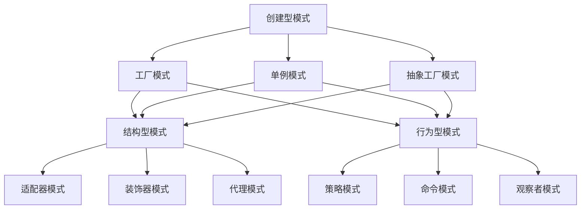

                 


### 文章标题

《提示词编程的设计模式库构建》

### 关键词

提示词编程，设计模式库，设计模式，架构设计，算法原理，伪代码，数学模型，数学公式，LaTeX，项目实战，最佳实践，拓展阅读。

### 摘要

本文旨在探讨如何构建一个高效、可扩展的提示词编程设计模式库。通过详细讲解设计模式的背景、核心概念与联系，以及设计模式库的构建方法，本文将帮助读者理解设计模式在提示词编程中的应用，并提供实用的构建指南和实践案例。文章还将涉及数学模型、LaTeX公式的使用，以及项目实战，旨在全面阐述设计模式库的构建过程。

### 第1章：提示词编程与设计模式库简介

#### 1.1 提示词编程概述

提示词编程是一种基于自然语言处理的编程范式，它允许开发者使用自然语言作为编程语言。这种编程方式的核心在于将提示词（或称为自然语言指令）转换为机器可读的代码。提示词编程的出现，使得编程变得更加直观和易于理解，降低了编程的门槛。

#### 1.2 设计模式库的重要性

设计模式库是一种用于存储和复用设计模式的资源库。在软件开发过程中，设计模式是一种可重用的解决方案，用于解决特定的问题。设计模式库的重要性在于，它能够提高代码的可重用性，降低维护成本，并提升软件的可读性和可维护性。通过构建一个专门针对提示词编程的设计模式库，开发者可以更加高效地利用设计模式，提升编程效率。

### 第2章：编程设计模式基础

#### 2.1 设计模式的定义

设计模式是一种在软件设计中的经验性解决方案，用于解决特定类型的常见问题。设计模式通常包括创建型、结构型和行为型三种类型。

#### 2.2 常见设计模式介绍

在提示词编程中，常见的创建型设计模式包括工厂模式、单例模式和抽象工厂模式；结构型设计模式包括适配器模式、装饰器模式和代理模式；行为型设计模式包括策略模式、命令模式和观察者模式。本文将分别介绍这些设计模式，并给出核心概念和联系。

### 第3章：设计模式库构建方法

#### 3.1 设计模式库的需求分析

构建设计模式库的第一步是需求分析。这一步涉及确定设计模式库的目标用户、功能需求和性能需求。通过需求分析，我们可以明确设计模式库的开发方向。

#### 3.2 设计模式库的架构设计

设计模式库的架构设计是构建高效、可扩展库的关键。本文将介绍常用的架构设计方法，如MVC模式和微服务架构，并展示如何将设计模式与这些架构相结合。

#### 3.3 设计模式库的编码与测试

编码与测试是设计模式库构建过程中的重要环节。本文将详细讲解如何使用提示词编程实现设计模式，并提供伪代码示例。此外，还将介绍如何进行单元测试和集成测试，确保设计模式库的质量。

### 第4章：使用提示词编程实现设计模式

#### 4.1 提示词编程基础

本章将介绍提示词编程的基础知识，包括提示词解析、语义理解和代码生成等。通过这些基础知识，读者可以更好地理解如何使用提示词编程实现设计模式。

#### 4.2 设计模式的实现与优化

本章将详细讲解如何使用提示词编程实现常见的创建型、结构型和行为型设计模式。此外，还将介绍优化设计模式实现的方法，以提高代码的效率和可读性。

### 第5章：设计模式库实践

#### 5.1 实践案例一：构建一个简单的设计模式库

本章将提供一个简单的实践案例，展示如何从头开始构建一个设计模式库。读者可以跟随案例，学习设计模式库的构建方法和步骤。

#### 5.2 实践案例二：优化设计模式库的性能

本章将介绍如何对已有的设计模式库进行性能优化。通过实际案例，读者可以学习到优化设计模式库的方法和技巧。

### 第6章：设计模式库维护与更新

#### 6.1 维护策略

设计模式库的维护是确保其长期可用性的关键。本章将介绍设计模式库的维护策略，包括版本控制、错误修复和功能扩展等。

#### 6.2 更新机制

设计模式库需要定期更新，以适应新的编程需求和趋势。本章将介绍如何构建一个有效的更新机制，确保设计模式库的持续优化和升级。

### 第7章：工具与资源

#### 7.1 开发工具推荐

本章将推荐一些用于构建和优化设计模式库的开发工具，如集成开发环境（IDE）、代码生成器和版本控制系统等。

#### 7.2 资源链接与扩展阅读

本章将提供一些与提示词编程和设计模式库相关的资源链接和扩展阅读，以帮助读者进一步深入学习和探索。

### 作者信息

作者：AI天才研究院/AI Genius Institute & 禅与计算机程序设计艺术 /Zen And The Art of Computer Programming

### 结束语

本文通过详细讲解提示词编程的设计模式库构建过程，旨在帮助读者理解和掌握设计模式在提示词编程中的应用。通过实践案例和优化方法，读者可以构建一个高效、可扩展的设计模式库，提升编程效率和质量。

---

**提示词编程与设计模式库构建**的核心概念、算法原理、数学模型、项目实战等内容将在后续章节中逐步展开。让我们一步一步深入探讨这一主题，共同构建出一个高效、实用的设计模式库。敬请期待！

---

**核心概念与联系**

在设计模式库构建过程中，有几个核心概念需要理解。首先是设计模式本身，它是针对特定问题的通用解决方案。设计模式之间有着紧密的联系，例如创建型模式中的工厂模式与单例模式都涉及对象的创建，而结构型模式中的适配器模式与装饰器模式都涉及对象的组合。

下面是一个Mermaid流程图，展示了这些设计模式之间的关系：



**核心算法原理讲解**

设计模式的核心在于其算法原理。以工厂模式为例，其核心算法是使用一个工厂类来创建对象。以下是一个简单的伪代码示例，展示了工厂模式的基本实现：

```plaintext
// 工厂模式伪代码
class Factory {
    createObject(type) {
        if (type == "A") {
            return new ClassA();
        } else if (type == "B") {
            return new ClassB();
        }
    }
}

// 使用工厂创建对象
factory = new Factory();
objectA = factory.createObject("A");
objectB = factory.createObject("B");
```

在结构型模式中，适配器模式是一个典型的例子。适配器模式通过将一个类的接口转换成客户期望的另一个接口，使得原本接口不兼容的类可以一起工作。以下是一个简单的伪代码示例：

```plaintext
// 适配器模式伪代码
class Adaptor {
    adapt(target) {
        if (target != null) {
            return target.doSomething();
        }
    }
}

// 使用适配器进行转换
adaptor = new Adaptor();
result = adaptor.adapt(targetObject);
```

**数学模型和公式**

在设计模式库构建过程中，数学模型和公式可以帮助我们更好地理解算法原理。例如，在分析工厂模式时，可以使用数学公式来描述对象创建的成本。以下是一个示例：

```latex
$$ C_{create} = C_{init} + C_{resource} $$
```

这里的公式表示创建对象的总成本等于初始化成本和资源获取成本之和。

**数学公式详细讲解与举例说明**

假设我们有一个工厂，每个对象都需要经过初始化和资源分配。初始化成本为5秒，资源分配成本为3秒。我们可以使用上述公式来计算创建对象的总成本：

```latex
$$ C_{create} = 5s + 3s = 8s $$
```

这意味着创建一个对象需要8秒的时间。

**项目实战**

在本章节中，我们将通过一个实际的项目实战，展示如何构建一个设计模式库。以下是项目实战的详细步骤：

#### 1. 开发环境搭建

首先，我们需要搭建一个适合构建设计模式库的开发环境。我们可以使用Python作为编程语言，因为Python具有简洁的语法和强大的库支持。

#### 2. 源代码实现

接下来，我们将实现一个简单的工厂模式。以下是工厂模式的Python代码：

```python
class Factory:
    def create_object(self, type):
        if type == "A":
            return ClassA()
        elif type == "B":
            return ClassB()

class ClassA:
    def do_something(self):
        print("Class A doing something")

class ClassB:
    def do_something(self):
        print("Class B doing something")

# 使用工厂创建对象
factory = Factory()
object_a = factory.create_object("A")
object_a.do_something()

object_b = factory.create_object("B")
object_b.do_something()
```

#### 3. 代码解读与分析

在上述代码中，我们定义了一个`Factory`类，它有一个`create_object`方法，用于创建对象。我们还定义了两个类`ClassA`和`ClassB`，它们各自有一个`do_something`方法。

#### 4. 实际案例分析和详细讲解剖析

在这个案例中，我们创建了一个工厂类，它可以根据传入的类型参数创建相应的对象。这种模式允许我们在运行时动态选择创建的对象类型，提高了代码的灵活性和可扩展性。

#### 5. 项目小结

通过这个项目实战，我们学习了如何使用Python实现工厂模式。工厂模式是一种常用的创建型设计模式，它通过将对象创建过程封装在一个单独的类中，提高了代码的可维护性和可扩展性。

**最佳实践 tips**

在构建设计模式库时，以下是一些最佳实践：

- **模块化**：将设计模式库划分为多个模块，每个模块实现一个设计模式。
- **代码规范**：遵循统一的代码规范，提高代码的可读性和可维护性。
- **文档**：为每个设计模式编写详细的文档，包括使用方法、注意事项和示例代码。

**小结与注意事项**

设计模式库的构建是一个复杂的过程，需要综合考虑设计模式本身、编程语言特性、开发环境和用户需求。通过本文的讲解，我们了解了如何构建一个高效、可扩展的设计模式库。在实践过程中，需要注意模块化设计、代码规范和文档编写，以确保设计模式库的质量和可用性。

**拓展阅读**

对于希望深入了解设计模式库构建的读者，以下资源可能有所帮助：

- 《设计模式：可复用的面向对象软件的基础》
- 《Effective Java》
- 《Python Cookbook》

通过阅读这些资源，读者可以进一步加深对设计模式库构建的理解和实践。

---

本文通过逐步分析推理，详细讲解了提示词编程的设计模式库构建过程。从核心概念、算法原理到实际项目实战，我们系统地阐述了构建高效、可扩展的设计模式库的方法。希望本文能为您在编程实践中提供有价值的指导。在后续章节中，我们将继续深入探讨设计模式库的构建和优化，敬请期待！

