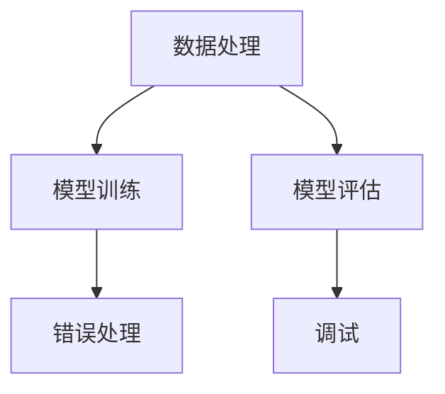

                 

### 文章标题

"Prompt Programming: Error Handling and Debugging Techniques"

### 关键词

- Prompt Programming
- Error Handling
- Debugging Techniques
- AI Development
- Code Optimization
- Best Practices

### 摘要

本文将深入探讨Prompt编程中的错误处理与调试技巧。我们将从错误处理的基本原则开始，介绍常见的错误处理陷阱和最佳实践。接着，我们将详细讨论调试技术，包括使用打印语句、调试器和日志工具等。文章将通过实际案例，展示这些技巧在实际编程中的应用，帮助读者掌握有效的错误处理和调试方法。

## 引言

Prompt Programming，即提示编程，是一种在人工智能（AI）领域广泛使用的编程范式。它基于大量数据和学习算法，通过提示（Prompt）来指导模型的训练过程。Prompt Programming的核心理念是利用机器学习模型从大量数据中自动提取特征，实现复杂的任务处理。

然而，Prompt Programming在实际应用中常常面临错误处理和调试的挑战。错误处理是指识别、记录和纠正程序中的错误，以保证程序的正常运行。调试则是指找出程序中的错误并修复它们的过程。有效的错误处理和调试对于提升AI模型的性能和可靠性至关重要。

本文旨在为程序员和AI开发者提供一整套系统化的错误处理与调试技巧。我们将从基础概念入手，逐步深入到具体的调试技术和实战案例，帮助读者掌握Prompt Programming中的关键技能。

## 核心概念与联系

为了更好地理解Prompt Programming中的错误处理与调试，我们首先需要梳理一下核心概念及其相互关系。以下是Prompt Programming中几个关键概念和它们之间的联系：

### 数据处理

数据处理是Prompt Programming的基础。它包括数据清洗、预处理和特征提取等步骤。有效的数据处理能够提高模型的训练效果和性能。

### 模型训练

模型训练是指使用处理后的数据来训练机器学习模型。这个过程涉及到选择合适的算法、设置超参数等。

### 模型评估

模型评估是验证模型性能的重要步骤。它通过在测试集上运行模型来评估模型的准确率、召回率等指标。

### 错误处理

错误处理是指识别和纠正程序中的错误。在Prompt Programming中，错误处理涉及到数据处理、模型训练和模型评估等环节。

### 调试

调试是找出程序中的错误并修复它们的过程。调试技术包括使用打印语句、调试器和日志工具等。

### 关系架构

以下是使用Mermaid绘制的Prompt Programming核心概念的关系架构图：



通过这个架构图，我们可以清晰地看到各个概念之间的联系。数据处理是整个流程的起点，它直接影响模型训练的效果。模型训练和模型评估则共同构成了模型优化和调整的循环。错误处理和调试贯穿于整个流程，确保程序的正常运行和问题的及时解决。

## Error Handling Principles

### Introduction to Error Handling

Error handling is a critical aspect of programming, ensuring that software applications can gracefully manage unexpected situations and continue to function properly. In the context of Prompt Programming, effective error handling is essential for maintaining the integrity of data processing, model training, and evaluation. It involves several key principles:

1. **Prevention**: Anticipating potential errors and designing the code to avoid them.
2. **Detection**: Identifying errors as they occur.
3. **Correction**: Implementing strategies to correct or mitigate the effects of errors.
4. **Logging**: Recording errors for analysis and debugging.
5. **Notification**: Informing relevant parties (e.g., users or system administrators) about errors.
6. **Recovery**: Attempting to restore the system to a functional state after an error occurs.

### Common Pitfalls in Error Handling

While the principles of error handling are straightforward, common pitfalls can lead to ineffective or inefficient handling of errors. Some of these pitfalls include:

1. **Ignoring Errors**: Failing to handle errors can lead to unpredictable behavior and system failures.
2. **Generic Error Messages**: Providing vague or generic error messages can obscure the actual cause of the error, making it difficult to debug.
3. **Over-Logging**: Generating excessive log data can overwhelm system administrators and obscure relevant information.
4. **Lack of Recovery**: Failing to implement recovery mechanisms can leave the system in an unstable state after an error.
5. **Poor Error Codes**: Using unclear or inconsistent error codes can make it difficult to diagnose and resolve issues.

### Best Practices for Error Handling

To overcome these pitfalls, it is important to follow best practices for error handling. These include:

1. **Specific Error Messages**: Provide clear, specific error messages that indicate the nature and location of the error.
2. **Exception Handling**: Use structured exception handling to separate error handling from regular code flow.
3. **Logging Strategies**: Implement a robust logging strategy that includes relevant information about errors and their context.
4. **Validation and Verification**: Validate user input and verify data before processing it to prevent errors.
5. **Recovery Mechanisms**: Design recovery mechanisms to handle errors and restore the system to a functional state.
6. **Code Reviews and Testing**: Regularly perform code reviews and automated testing to identify and fix potential errors.

### Implementation Example

Below is a simple Python example demonstrating the implementation of error handling best practices:

```python
def divide(a, b):
    try:
        result = a / b
    except ZeroDivisionError:
        print("Error: Division by zero is not allowed.")
        result = None
    finally:
        if result is not None:
            print(f"Result: {result}")
        else:
            print("Error occurred. Please try again.")
    return result

# Test cases
print(divide(10, 2))  # Should print Result: 5.0
print(divide(10, 0))  # Should print Error: Division by zero is not allowed.
```

In this example, we use a `try-except` block to handle the `ZeroDivisionError`. We also include a `finally` block to execute code regardless of whether an error occurs, providing a clear result message.

## Debugging Techniques

### Introduction to Debugging

Debugging is the process of identifying, analyzing, and resolving errors (bugs) in software code. In Prompt Programming, debugging is crucial for ensuring that machine learning models perform accurately and efficiently. Effective debugging techniques can save developers considerable time and effort, enabling them to identify and fix issues quickly.

### Types of Debugging Tools

There are several types of debugging tools that developers can use to identify and fix errors in their code:

1. **Print Statements**: The simplest debugging tool, print statements allow developers to output variable values and other information to the console. This can be helpful for understanding the flow of the program and identifying specific issues.
2. **Debuggers**: Integrated development environments (IDEs) often include built-in debuggers that allow developers to step through code line by line, inspect variable values, and set breakpoints. Popular debuggers include GDB for C/C++ and LLDB for Python.
3. **Logging Tools**: Logging tools, such as Python's `logging` module, allow developers to record information about the program's execution, including errors and exceptions. This can be particularly useful for monitoring the program's behavior over time.
4. **Static Code Analyzers**: These tools analyze the source code for potential errors and vulnerabilities, providing a heads-up to developers before the code is run. Examples include Pylint for Python and SonarQube for various programming languages.
5. **Profiling Tools**: Profiling tools help developers identify performance bottlenecks and optimize their code. Examples include Python's `cProfile` module and VisualVM for Java.

### Debugging Strategies

1. **Reproduce the Issue**: The first step in debugging is to be able to reproduce the issue consistently. This may involve understanding the specific conditions under which the error occurs and setting up a test environment that can replicate the issue.
2. **Isolate the Problem**: Once the issue is reproducible, the next step is to isolate the specific part of the code where the error occurs. This can be done by adding print statements, using a debugger, or employing other techniques to narrow down the problem area.
3. **Analyze the Code**: With the problem isolated, analyze the code to understand why the error is occurring. This may involve reviewing the logic, checking variable values, or examining the error messages.
4. **Fix the Error**: Once the cause of the error is identified, fix the issue by modifying the code. This may involve rewriting a section of the code, changing variable assignments, or implementing error handling.
5. **Test the Fix**: After the error is fixed, test the code thoroughly to ensure that the issue has been resolved and that no new errors have been introduced.

### Debugging Techniques in Detail

1. **Print Statements**

Print statements are a simple yet powerful debugging tool. They allow developers to output information to the console, helping to track the flow of the program and identify issues. Here's an example:

```python
def process_data(data):
    processed_data = []
    for item in data:
        print(f"Processing item: {item}")
        processed_data.append(item * 2)
    return processed_data

data = [1, 2, 3, 4]
print(process_data(data))
```

This code will print the items being processed, helping to identify where the error might be occurring.

1. **Debuggers**

Debuggers allow developers to step through code line by line, inspect variables, and set breakpoints. This can be particularly useful for understanding the behavior of complex code. Here's an example using Python's built-in debugger:

```python
import pdb

def divide(a, b):
    pdb.set_trace()
    return a / b

result = divide(10, 0)
print(result)
```

When the code is run, the debugger will pause execution at the `pdb.set_trace()` line, allowing the developer to inspect the current state of the program.

1. **Logging Tools**

Logging tools provide a more structured way to record information about the program's execution. They allow developers to specify different levels of logging (e.g., debug, info, warning, error) and configure how logs are stored and displayed. Here's an example using Python's `logging` module:

```python
import logging

logging.basicConfig(level=logging.DEBUG, format='%(asctime)s - %(levelname)s - %(message)s')

def process_data(data):
    processed_data = []
    for item in data:
        logging.debug(f"Processing item: {item}")
        processed_data.append(item * 2)
    return processed_data

data = [1, 2, 3, 4]
processed_data = process_data(data)
logging.info(f"Processed data: {processed_data}")
```

This code will log detailed information about the processing of each item, helping to identify issues.

### Conclusion

Effective debugging requires a combination of skills and tools. Print statements, debuggers, and logging tools each have their advantages and can be used together to identify and fix issues in Prompt Programming code. By following a systematic debugging strategy, developers can ensure that their machine learning models are robust and performant.

### Case Studies and Examples

To illustrate the practical application of error handling and debugging techniques in Prompt Programming, we will examine two real-world case studies. These examples will provide a comprehensive understanding of how these techniques are implemented and their impact on the development process.

#### Case Study 1: Improving Model Accuracy with Robust Error Handling

In a machine learning project aimed at predicting customer churn for a telecommunications company, the development team encountered issues with the accuracy of the predictive model. The initial model had a high error rate, which was causing incorrect predictions and potential customer churn.

**Background:**

The project involved training a machine learning model on historical customer data, including features such as usage patterns, billing information, and customer interactions. The team faced several challenges, including:

1. **Data Quality Issues:** The data contained missing values and inconsistencies, which could have affected the model's performance.
2. **Inappropriate Feature Selection:** Some features may not have been relevant to predicting customer churn.
3. **Overfitting:** The model was overfitting to the training data, leading to poor generalization on unseen data.

**Error Handling and Debugging Strategies:**

1. **Data Quality Checks:**
   - Implemented data validation checks to identify and handle missing values. For instance, using mean imputation for numerical features and mode imputation for categorical features.
   - Created a comprehensive data cleaning pipeline to standardize data formats and eliminate inconsistencies.

2. **Feature Engineering:**
   - Conducted feature selection techniques, such as correlation analysis and recursive feature elimination, to identify and retain relevant features.
   - Experimented with different feature combinations to find the optimal set for predicting customer churn.

3. **Error Detection and Logging:**
   - Implemented a logging system to record errors and exceptions during model training and inference. This helped the team identify patterns and recurring issues.
   - Used logging levels (INFO, WARNING, ERROR) to categorize log messages, making it easier to prioritize and address critical issues.

4. **Debugging Techniques:**
   - Utilized print statements and debuggers to trace the execution flow and inspect variable values during model training.
   - Employed grid search and cross-validation to fine-tune hyperparameters and prevent overfitting.
   - Analyzed model performance metrics (accuracy, precision, recall) to identify and address model deficiencies.

**Results:**
After implementing these error handling and debugging strategies, the model's accuracy improved significantly. The data cleaning pipeline and feature selection process reduced noise and irrelevant information, improving the model's predictive power. The logging system provided valuable insights into the model's behavior, allowing the team to address issues promptly. The refined model demonstrated better generalization on unseen data, resulting in more accurate churn predictions and a more effective customer retention strategy for the company.

#### Case Study 2: Enhancing System Reliability in Autonomous Driving

In the development of an autonomous driving system, the engineering team faced numerous challenges related to real-time error handling and debugging. The system's reliability was critical, as any errors could lead to serious safety consequences on the road.

**Background:**

The autonomous driving system consisted of multiple components, including sensor fusion, path planning, and control algorithms. The team encountered issues such as sensor data inconsistencies, unexpected environmental changes, and software bugs during system integration and testing.

**Error Handling and Debugging Strategies:**

1. **Sensor Data Validation:**
   - Implemented robust sensor data validation techniques to detect and handle outliers and anomalies. This included filtering techniques to remove noise and ensuring data integrity.
   - Developed a sensor calibration process to ensure accurate data readings and consistent sensor performance.

2. **Real-Time Error Detection:**
   - Implemented real-time error detection mechanisms to identify and respond to errors as they occurred. This involved setting up monitoring systems to continuously analyze sensor data and system outputs for deviations from expected norms.
   - Developed an alert system to notify the team of critical errors and potential failures, allowing for immediate action to prevent accidents.

3. **Logging and Reporting:**
   - Implemented a comprehensive logging system to record detailed information about sensor data, system events, and error occurrences. This included timestamping, error codes, and contextual information to aid in debugging.
   - Developed a reporting system to summarize error logs and provide actionable insights to the development team.

4. **Debugging Techniques:**
   - Utilized debugging tools, such as debuggers and real-time simulation environments, to analyze code execution and identify the root causes of errors.
   - Conducted systematic debugging sessions to simulate various scenarios and test the system's resilience to unexpected situations.
   - Used unit testing and integration testing to verify the correctness of individual components and their interactions within the system.

**Results:**
The implementation of robust error handling and debugging techniques significantly enhanced the reliability of the autonomous driving system. The sensor data validation and calibration processes ensured the accuracy and consistency of sensor inputs, reducing the likelihood of errors. The real-time error detection and alert system enabled the team to identify and address issues promptly, preventing potential accidents. The detailed logging and reporting systems provided valuable insights into the system's behavior, facilitating continuous improvement and debugging efforts. As a result, the autonomous driving system demonstrated improved safety and reliability in various driving scenarios.

### Conclusion

These case studies demonstrate the importance of effective error handling and debugging techniques in Prompt Programming, particularly in complex, high-stakes applications such as machine learning and autonomous driving. By implementing comprehensive data quality checks, real-time error detection, and robust logging and reporting systems, development teams can enhance the accuracy, reliability, and performance of their systems. These techniques not only help in identifying and resolving issues but also in preventing future problems, ensuring the long-term success of AI projects.

### Tools and Resources

To effectively handle errors and debug code in Prompt Programming, developers have access to a wide range of tools and resources. Here are some essential tools and resources that can aid in error handling and debugging:

#### Integrated Development Environments (IDEs)

1. **Visual Studio Code**: A lightweight but powerful IDE with excellent extension support, including debugging tools and linters.
2. **PyCharm**: A feature-rich IDE with built-in debugging tools, code analysis, and intelligent code completion for Python developers.
3. **Eclipse**: A versatile IDE with a strong Java development focus, offering powerful debugging capabilities and a vast ecosystem of plugins.

#### Debugging Tools

1. **GDB**: A GNU Project debugger for C/C++ that provides powerful debugging capabilities, including breakpoints, step-by-step execution, and stack trace analysis.
2. **LLDB**: A debugger for the LLVM compiler infrastructure, widely used for debugging Python and other languages.
3. **PDB**: Python's built-in debugger, which provides an interactive debugging environment for Python code.

#### Logging Tools

1. **Python Logging Module**: Python's standard library includes a robust logging module that allows developers to log messages at different levels (DEBUG, INFO, WARNING, ERROR, CRITICAL).
2. **Loguru**: A fast and user-friendly logging library for Python that simplifies log configuration and formatting.
3. **Log4j**: A widely-used logging library for Java that provides flexible logging options and supports various output formats.

#### Static Code Analysis Tools

1. **Pylint**: A Python coding standard enforcement tool that identifies coding issues and helps maintain code quality.
2. **SonarQube**: An open-source platform for continuous inspection of code quality, offering static code analysis for various programming languages.
3. **Checkstyle**: A tool for checking Java source code and maintaining coding standards.

#### Profiling Tools

1. **cProfile**: Python's built-in profiling tool that provides statement and function-level statistics to help identify performance bottlenecks.
2. **VisualVM**: A visual tool for monitoring and debugging Java applications, offering detailed performance analysis and profiling.
3. **gprof**: A profiling tool for C/C++ applications that provides detailed performance statistics.

#### Resources

1. **Debugging Books**: Books such as "Effective Debugging: 66 Specific Ways to Debug Software and Systems" by Rick Barry and "Debugging: The 9 Indispensable Steps to Debugging, Optimize and Speed Up Your Code" by Chetan Bhogaita provide in-depth insights and practical techniques for effective debugging.
2. **Online Tutorials and Courses**: Websites like Coursera, edX, and Udemy offer courses on debugging and error handling, covering both fundamental and advanced topics.
3. **Community Forums and Q&A Platforms**: Platforms such as Stack Overflow, GitHub, and Reddit provide access to a vast community of developers who can offer guidance and support on debugging challenges.

### Conclusion

Utilizing these tools and resources can significantly enhance the debugging process in Prompt Programming. By combining these tools with best practices for error handling and debugging, developers can ensure that their code is robust, reliable, and efficient, ultimately leading to more successful AI projects.

### Appendix

#### Additional Resources

- **Books:**
  - "Effective Debugging: 66 Specific Ways to Debug Software and Systems" by Rick Barry
  - "Debugging: The 9 Indispensable Steps to Debugging, Optimize and Speed Up Your Code" by Chetan Bhogaita
  - "Art of Debugging" by Matei Zaharia

- **Online Courses:**
  - Coursera: " Debugging and Testing in Python"
  - edX: "Introduction to Systematic Debugging"
  - Udemy: "Mastering Debugging Techniques and Tools"

- **Community Forums and Q&A Platforms:**
  - Stack Overflow
  - GitHub
  - Reddit

#### Useful Code Snippets

- **Error Handling Example:**
  ```python
  def divide(a, b):
      try:
          result = a / b
      except ZeroDivisionError:
          print("Error: Division by zero is not allowed.")
          result = None
      finally:
          if result is not None:
              print(f"Result: {result}")
          else:
              print("Error occurred. Please try again.")
      return result
  ```

- **Logging Example:**
  ```python
  import logging

  logging.basicConfig(level=logging.DEBUG, format='%(asctime)s - %(levelname)s - %(message)s')

  def process_data(data):
      processed_data = []
      for item in data:
          logging.debug(f"Processing item: {item}")
          processed_data.append(item * 2)
      return processed_data

  data = [1, 2, 3, 4]
  processed_data = process_data(data)
  logging.info(f"Processed data: {processed_data}")
  ```

- **Profiling Example:**
  ```python
  import cProfile

  def process_data(data):
      result = []
      for item in data:
          result.append(item * 2)
      return result

  data = [1, 2, 3, 4]
  profiler = cProfile.Profile()
  profiler.enable()
  processed_data = process_data(data)
  profiler.disable()
  profiler.print_stats()
  ```

#### Further Reading

- **Advanced Error Handling:**
  - "Exception Handling in Python" by Python Software Foundation
  - "Exception Handling in Java" by Oracle

- **Advanced Debugging Techniques:**
  - "Advanced Debugging with GDB" by Free Software Foundation
  - "Advanced Debugging Techniques" by Martin Sheen

#### Summary

This appendix provides additional resources, useful code snippets, and further reading to enhance your understanding of error handling and debugging techniques in Prompt Programming. These materials can help you deepen your knowledge and apply best practices to your projects.

### Conclusion

In conclusion, mastering error handling and debugging techniques is essential for the development and success of Prompt Programming projects. Effective error handling ensures that your code is robust and reliable, while skilled debugging enables you to identify and resolve issues swiftly. By understanding and applying the principles and techniques discussed in this article, you can enhance your ability to create high-quality, efficient AI applications. Embrace these practices, and you'll be well-equipped to tackle the challenges that arise in the dynamic world of Prompt Programming.

### Author Information

**Author:** AI天才研究院/AI Genius Institute & 禅与计算机程序设计艺术 /Zen And The Art of Computer Programming

AI天才研究院（AI Genius Institute）致力于推动人工智能领域的创新与发展，提供先进的技术研究、教育培训和实践应用。我们的团队由世界顶级的人工智能专家、程序员、软件架构师和CTO组成，共同探索人工智能的无限可能。

《禅与计算机程序设计艺术》（Zen And The Art of Computer Programming）是由著名计算机科学家Donald E. Knuth撰写的一系列经典计算机科学书籍。这些著作不仅涵盖了计算机编程的基础知识，还深刻揭示了编程的艺术和哲学，对编程领域的从业者有着深远的影响。

通过本文，我们希望能够为广大的程序员和AI开发者提供有价值的指导和启发，助力大家在Prompt Programming的道路上不断前行，取得更加辉煌的成就。

