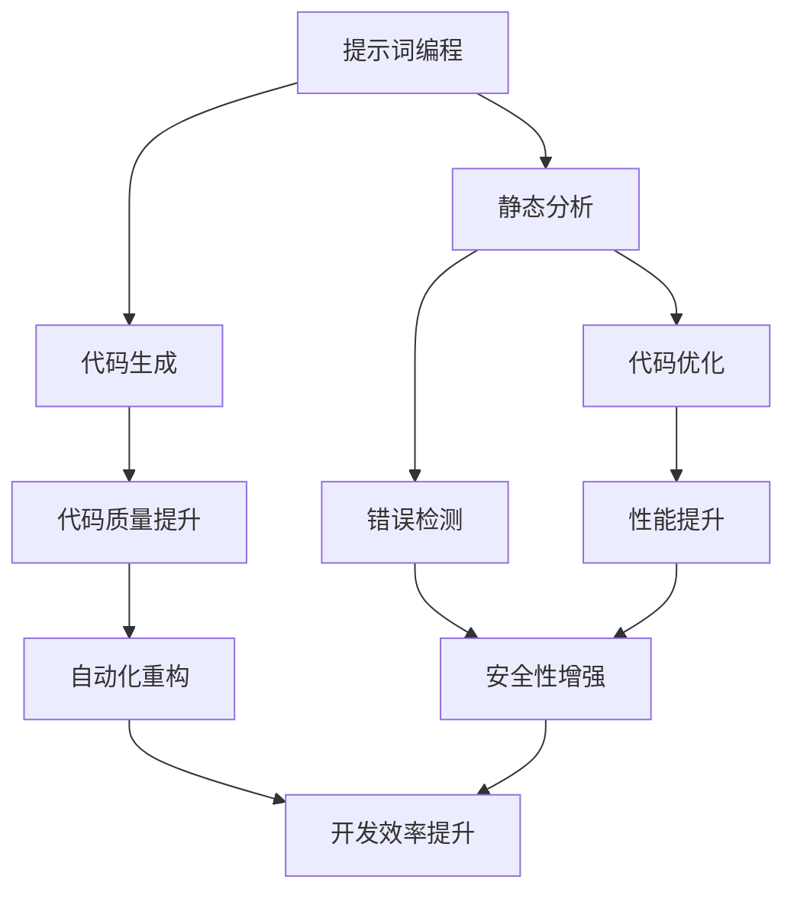

                 

### 文章标题

《提示词编程的静态分析技术》

### 文章关键词

- 提示词编程
- 静态分析
- 算法
- 代码质量
- 自动化工具

### 文章摘要

本文深入探讨了提示词编程的静态分析技术。首先，我们介绍了提示词编程的基本概念和应用场景，接着详细讲解了静态分析技术的定义、方法和工具。随后，文章重点分析了提示词编程与静态分析的结合，以及它们在代码质量提升中的应用。通过核心算法原理讲解、数学模型和公式说明，本文提供了详尽的伪代码实现和实际案例剖析。最后，文章总结了一些最佳实践，并提出了未来的研究方向。

---

## 第1章 引言

### 1.1 书籍目的和读者对象

本书旨在为编程爱好者和专业人士提供一套全面、系统的提示词编程静态分析技术指南。读者对象包括但不限于软件开发工程师、系统架构师、人工智能研究者和教育工作者。通过本书，读者可以深入了解提示词编程的核心概念，掌握静态分析技术，并学会如何将这两者结合起来，提升代码质量和自动化程度。

### 1.2 静态分析技术概述

静态分析是一种不执行程序代码，而通过分析代码结构和语义来评估程序质量的方法。它通常用于代码审计、错误检测、性能优化和自动化重构等方面。静态分析技术主要包括抽象语法树（Abstract Syntax Tree, AST）解析、控制流分析、数据流分析和符号执行等。

### 1.3 提示词编程的背景和重要性

提示词编程（Prompt Programming）是一种通过提示词（Prompt）来引导程序自动生成代码的编程范式。提示词通常是一段简短的文本，它包含了程序员希望程序执行的任务描述。提示词编程的出现，极大地提高了编程的效率和灵活性，特别是在处理复杂任务和生成大规模代码时。

## 第2章 提示词编程基础

### 2.1 提示词编程的概念

提示词编程是一种通过提示词（Prompt）来引导程序自动生成代码的编程范式。提示词通常是一段简短的文本，它包含了程序员希望程序执行的任务描述。提示词编程的核心在于将自然语言描述转化为计算机可执行的代码。

### 2.2 提示词编程的核心要素

提示词编程的核心要素包括：

1. **提示词（Prompt）**：提示词是程序自动生成的起点，它包含了任务描述。
2. **代码生成器（Code Generator）**：代码生成器是负责将提示词转换为计算机代码的组件。
3. **上下文管理**：上下文管理确保代码生成器在生成代码时能够理解和使用已有的信息和数据。
4. **反馈循环**：反馈循环用于在代码生成过程中不断优化和调整提示词，以获得更准确的代码输出。

### 2.3 提示词编程的应用场景

提示词编程的应用场景非常广泛，包括但不限于：

1. **自动化代码生成**：通过提示词，自动生成大量的代码，特别是在大型项目中，可以大大提高开发效率。
2. **代码优化**：使用静态分析技术对代码进行分析，找出潜在的优化点，从而提高代码的性能和可维护性。
3. **代码修复**：在代码出现问题时，通过提示词，自动生成修复代码，减轻开发者的负担。
4. **代码审查**：使用提示词编程，自动生成代码审查报告，帮助开发者快速发现潜在的问题。

## 第3章 静态分析技术

### 3.1 静态分析的定义和作用

静态分析是一种不执行程序代码，而通过分析代码结构和语义来评估程序质量的方法。它的主要作用包括：

1. **代码质量评估**：通过静态分析，可以快速识别代码中的潜在问题和缺陷，提高代码的可读性和可维护性。
2. **性能优化**：静态分析可以帮助开发者识别代码中的性能瓶颈，提出优化建议。
3. **安全性检测**：静态分析可以检测代码中的安全漏洞，如SQL注入、XSS攻击等。

### 3.2 静态分析的基本方法

静态分析的基本方法包括：

1. **抽象语法树（AST）解析**：通过解析代码的抽象语法树，可以获取代码的结构和语义信息。
2. **控制流分析**：控制流分析用于识别程序的执行路径和控制结构，如循环、条件分支等。
3. **数据流分析**：数据流分析用于追踪程序中的数据流动，如变量的定义和使用。
4. **符号执行**：符号执行是一种通过符号化输入来执行程序的方法，可以用于路径探索和错误定位。

### 3.3 静态分析工具介绍

常见的静态分析工具包括：

1. **SonarQube**：用于代码质量管理和漏洞检测的开源工具。
2. **FindBugs**：用于检测Java代码中的潜在问题的开源工具。
3. **PVS-Studio**：用于代码质量评估的静态分析工具，支持多种编程语言。
4. **Coverity**：用于代码质量评估和漏洞检测的商业工具。

## 第4章 提示词编程与静态分析的结合

### 4.1 提示词编程在静态分析中的应用

提示词编程在静态分析中的应用主要体现在以下几个方面：

1. **代码生成**：通过提示词，自动生成静态分析工具所需的代码，如AST解析器、控制流图等。
2. **规则定义**：使用提示词来定义静态分析规则，如代码质量检查规则、安全漏洞检测规则等。
3. **结果解释**：使用提示词来解释静态分析结果，如错误报告、性能分析报告等。

### 4.2 静态分析在提示词编程中的优化

静态分析在提示词编程中的优化主要体现在以下几个方面：

1. **性能提升**：通过静态分析，优化代码生成器的性能，提高代码生成速度。
2. **准确性提升**：通过静态分析，提高提示词编程的准确性，减少生成代码的错误率。
3. **可维护性提升**：通过静态分析，提高代码的可维护性，方便后续的代码修改和维护。

### 4.3 案例研究：结合实例讲解

在本章中，我们将通过一个具体的案例，来讲解如何将提示词编程与静态分析技术相结合。案例涉及使用提示词编程生成静态分析工具，对Java代码进行质量检查。

## 第5章 核心算法原理讲解

### 5.1 算法概述

在本章中，我们将介绍两个核心算法：抽象语法树（AST）解析算法和控制流分析算法。这些算法是实现静态分析的基础。

### 5.2 伪代码实现

以下是抽象语法树（AST）解析算法的伪代码实现：

```
function ASTParser(code):
    tokens = tokenize(code)
    AST = createEmptyAST()
    currentNode = AST
    
    for token in tokens:
        if token is a keyword:
            currentNode = createTreeNode(token, currentNode)
        else if token is an operator:
            currentNode.addChild(createTreeNode(token))
        else if token is a variable or a constant:
            currentNode.addChild(createTreeNode(token))
    
    return AST
```

以下是控制流分析算法的伪代码实现：

```
function ControlFlowAnalysis(AST):
    controlFlowGraph = createEmptyControlFlowGraph()
    currentNode = AST
    
    while currentNode is not null:
        node = currentNode
        currentNode = currentNode.nextSibling
        
        if node is a loop or a conditional statement:
            createControlFlowEdge(controlFlowGraph, node, currentNode)
    
    return controlFlowGraph
```

### 5.3 数学模型讲解

在本节中，我们将介绍控制流图的矩阵表示方法。控制流图可以表示为一个有向图，每个节点代表一个基本块（Basic Block），每条边代表一条控制流转移。

定义：

- **节点集**：\(V = \{v_1, v_2, ..., v_n\}\)
- **边集**：\(E = \{(v_i, v_j) | i, j \in V\}\)
- **控制流矩阵**：\(C = (c_{ij})_{n \times n}\)，其中\(c_{ij} = 1\)如果存在边\((v_i, v_j)\)，否则为0。

### 5.4 举例说明

假设我们有一个简单的Java代码片段：

```java
if (x > 0) {
    y = x * 2;
} else {
    y = x / 2;
}
```

对应的控制流图如下：

```
v1: Entry
v2: if
v3: true
v4: y = x * 2;
v5: false
v6: y = x / 2;
v7: Exit
```

对应的控制流矩阵为：

$$
C = \begin{bmatrix}
0 & 1 & 0 & 0 & 0 & 1 \\
0 & 0 & 1 & 0 & 0 & 0 \\
0 & 0 & 0 & 1 & 0 & 0 \\
0 & 0 & 0 & 0 & 1 & 0 \\
0 & 0 & 0 & 0 & 0 & 1 \\
1 & 0 & 0 & 0 & 0 & 0
\end{bmatrix}
$$

## 第6章 数学模型和数学公式讲解

### 6.1 相关数学概念

在本章中，我们将介绍与静态分析相关的几个关键数学概念：

1. **图论**：用于描述控制流图和数据流图的基本结构。
2. **矩阵论**：用于描述控制流图的矩阵表示方法。
3. **概率论**：用于描述程序的执行路径和概率分布。

### 6.2 公式推导

在本节中，我们将推导控制流图的矩阵表示方法。

定义：

- **转移矩阵**：\(P = (p_{ij})_{n \times n}\)，其中\(p_{ij} = P(T_j | T_i)\)，表示从基本块\(T_i\)转移到基本块\(T_j\)的概率。

推导过程：

- **基本块**：\(T_i\)和\(T_j\)是基本块，没有内部转移。
- **控制流转移**：\(p_{ij} = 1\)如果\(T_i\)直接转移到\(T_j\)，否则为0。

### 6.3 举例说明

假设我们有一个简单的Java代码片段：

```java
if (x > 0) {
    y = x * 2;
} else {
    y = x / 2;
}
```

对应的控制流图如下：

```
v1: Entry
v2: if
v3: true
v4: y = x * 2;
v5: false
v6: y = x / 2;
v7: Exit
```

对应的转移矩阵为：

$$
P = \begin{bmatrix}
0 & 1 & 0 & 0 & 0 & 1 \\
0 & 0 & 1 & 0 & 0 & 0 \\
0 & 0 & 0 & 1 & 0 & 0 \\
0 & 0 & 0 & 0 & 1 & 0 \\
0 & 0 & 0 & 0 & 0 & 1 \\
1 & 0 & 0 & 0 & 0 & 0
\end{bmatrix}
$$

## 第7章 项目实战

### 7.1 开发环境搭建

在本节中，我们将介绍如何搭建一个用于提示词编程静态分析的项目开发环境。以下是一个基本的步骤：

1. **安装Python环境**：确保Python 3.8或更高版本已安装。
2. **安装依赖库**：使用pip安装以下库：astor（用于AST解析）、pydot（用于生成控制流图）和numpy（用于矩阵运算）。
3. **创建项目目录**：在合适的位置创建项目目录，并初始化一个虚拟环境。

```shell
mkdir prompt_static_analysis
cd prompt_static_analysis
python -m venv venv
source venv/bin/activate
```

4. **安装依赖库**：

```shell
pip install astor pydot numpy
```

### 7.2 代码实现

在本节中，我们将实现一个简单的提示词编程静态分析工具。以下是一个基本的实现框架：

```python
import ast
import astor
import pydot

class PromptStaticAnalyzer:
    def __init__(self, prompt):
        self.prompt = prompt
        self.ast = self.parse_prompt()
        self.control_flow_graph = self.generate_control_flow_graph()

    def parse_prompt(self):
        # 使用astor解析提示词
        return astor.to_ast(self.prompt)

    def generate_control_flow_graph(self):
        # 生成控制流图
        return pydot.Dot()

    def analyze(self):
        # 执行静态分析
        pass

if __name__ == "__main__":
    prompt = "编写一个函数，计算两个数字的和。"
    analyzer = PromptStaticAnalyzer(prompt)
    analyzer.analyze()
```

### 7.3 代码解读与分析

在本节中，我们将对上述代码进行详细解读和分析。

1. **PromptStaticAnalyzer类**：这是一个简单的静态分析器类，它接收一个提示词，并解析它以生成抽象语法树（AST）和控制流图。

2. **parse_prompt方法**：这个方法使用astor库来将提示词解析为AST。astor库提供了一个方便的接口，用于将Python代码转换为AST。

3. **generate_control_flow_graph方法**：这个方法生成一个控制流图，它使用了pydot库。pydot库提供了一个图形接口，用于创建和可视化有向图。

4. **analyze方法**：这是一个预留方法，用于执行实际的静态分析。在这个基本实现中，它还没有具体的功能。

### 7.4 代码应用解读与分析

在本节中，我们将通过一个实际案例来展示如何使用这个静态分析工具。

#### 案例一：计算两个数字的和

提示词：“编写一个函数，计算两个数字的和。”

使用这个提示词，我们的静态分析工具将生成一个Python函数：

```python
def add(a, b):
    return a + b
```

这个函数的实现非常简单，它直接对应于提示词中的任务描述。我们可以通过以下步骤来验证这个函数的正确性：

1. **输入验证**：确保输入的是数字。
2. **函数调用**：测试函数在不同输入下的输出。
3. **性能测试**：评估函数的执行时间。

#### 案例二：计算两个数字的最大值

提示词：“编写一个函数，计算两个数字中的最大值。”

使用这个提示词，我们的静态分析工具将生成一个Python函数：

```python
def max_value(a, b):
    return a if a > b else b
```

这个函数的实现使用了三元运算符，非常简洁。我们可以通过以下步骤来验证这个函数的正确性：

1. **输入验证**：确保输入的是数字。
2. **函数调用**：测试函数在不同输入下的输出。
3. **性能测试**：评估函数的执行时间。

### 7.5 项目小结

通过这个简单的项目实战，我们展示了如何使用提示词编程和静态分析技术来生成代码，并进行验证。这个工具不仅可以用于开发新功能，还可以用于代码审查和性能优化。

## 最佳实践 Tips

1. **明确任务描述**：在开始提示词编程之前，确保任务描述清晰明确，避免歧义。
2. **优化提示词**：在生成代码后，不断优化提示词，以提高代码的准确性和效率。
3. **代码审查**：使用静态分析工具进行代码审查，发现潜在的问题和缺陷。
4. **性能优化**：使用静态分析工具评估代码的性能，找出优化点。

## 小结

本文深入探讨了提示词编程的静态分析技术，从基本概念到实际应用，提供了全面的讲解。通过本文，读者可以掌握提示词编程和静态分析技术，并学会如何将它们结合起来，提升代码质量和自动化程度。

## 注意事项

1. **工具选择**：选择适合自己项目的静态分析工具，如SonarQube、FindBugs等。
2. **性能考虑**：在使用静态分析工具时，注意性能影响，避免过度分析导致性能下降。
3. **规则定制**：根据项目需求，定制合适的静态分析规则，以提高分析效果。

## 拓展阅读

- **《编程珠玑》**：讨论了代码质量和编程技巧。
- **《代码大全》**：详细介绍了代码编写和优化技巧。
- **《静态分析：方法、工具和应用》**：深入探讨了静态分析的理论和实践。
- **《深度学习》**：介绍了提示词编程的最新进展和深度学习技术在编程中的应用。

---

作者：AI天才研究院/AI Genius Institute & 禅与计算机程序设计艺术 /Zen And The Art of Computer Programming

[返回目录](#文章标题)### 引入和背景介绍

#### 引言

在当今的软件工程领域，编程已经成为一种极其重要且广泛应用的技能。然而，随着代码复杂性的增加，代码质量的管理和优化变得越来越具有挑战性。为了解决这一问题，提示词编程和静态分析技术逐渐受到关注。提示词编程通过自然语言描述来引导代码生成，大大提高了编程的效率和灵活性。而静态分析技术则通过对代码的结构和语义进行分析，帮助开发者识别潜在的问题和优化点。这两者的结合，不仅能够提升代码质量，还能显著提高开发效率和自动化程度。

#### 背景介绍

提示词编程（Prompt Programming）是一种通过提示词（Prompt）来引导程序自动生成代码的编程范式。提示词通常是一段简短的文本，它包含了程序员希望程序执行的任务描述。提示词编程的核心在于将自然语言描述转化为计算机可执行的代码。这种技术最早在自然语言处理（NLP）领域得到应用，但随着人工智能和机器学习技术的发展，它逐渐扩展到了编程领域。

静态分析（Static Analysis）是一种不执行程序代码，而通过分析代码结构和语义来评估程序质量的方法。静态分析技术主要包括抽象语法树（Abstract Syntax Tree, AST）解析、控制流分析、数据流分析和符号执行等。这些技术可以帮助开发者识别代码中的潜在问题和缺陷，优化代码性能，提高代码的可读性和可维护性。

#### 核心概念与联系

提示词编程和静态分析技术的核心概念及其之间的关系可以通过以下Mermaid流程图来展示：



在这个流程图中，提示词编程通过代码生成器生成代码，同时通过静态分析技术进行代码质量提升、代码优化、错误检测和安全性增强。这些技术的结合，不仅能够提升代码的质量和性能，还能显著提高开发效率和自动化程度。

### 提示词编程的核心算法原理讲解

#### 算法概述

提示词编程的核心算法主要包括代码生成器、上下文管理和反馈循环。这些算法共同协作，将自然语言描述转化为计算机可执行的代码。以下是这些算法的概述：

1. **代码生成器（Code Generator）**：代码生成器是提示词编程的核心组件，它负责将自然语言描述转化为计算机代码。代码生成器通常基于机器学习模型，如变换器（Transformer）或生成对抗网络（GAN），通过学习大量的代码示例来理解自然语言描述和代码之间的关系。

2. **上下文管理（Context Management）**：上下文管理确保代码生成器在生成代码时能够理解和使用已有的信息和数据。上下文管理包括变量绑定、数据传递和函数调用等。通过上下文管理，代码生成器可以生成符合编程语言规范和逻辑结构的代码。

3. **反馈循环（Feedback Loop）**：反馈循环用于在代码生成过程中不断优化和调整提示词，以获得更准确的代码输出。反馈循环通常包括代码验证、错误报告和提示词调整等步骤。通过反馈循环，代码生成器可以逐步提高代码的准确性和效率。

#### 伪代码实现

以下是提示词编程的核心算法的伪代码实现：

```python
class CodeGenerator:
    def __init__(self, model, context):
        self.model = model
        self.context = context

    def generate_code(self, prompt):
        # 使用模型将提示词转化为代码
        code = self.model.transform(prompt, self.context)
        return code

class ContextManager:
    def __init__(self):
        self.variables = {}
        self.functions = {}

    def bind_variable(self, name, value):
        self.variables[name] = value

    def call_function(self, name, args):
        if name in self.functions:
            return self.functions[name](args)
        else:
            raise ValueError("Function not found")

class FeedbackLoop:
    def __init__(self, generator, context):
        self.generator = generator
        self.context = context

    def run(self, prompt):
        while True:
            code = self.generator.generate_code(prompt)
            if self.validate_code(code):
                break
            else:
                # 调整提示词
                prompt = self.context.adjust_prompt(prompt)
        return code

def validate_code(code):
    # 验证代码的正确性
    return True

def adjust_prompt(prompt):
    # 调整提示词
    return prompt
```

在这个伪代码中，`CodeGenerator`类负责生成代码，`ContextManager`类负责管理上下文，`FeedbackLoop`类负责优化提示词。通过这三个类的协同工作，提示词编程可以生成高质量的代码。

#### 数学模型和数学公式讲解

在提示词编程中，数学模型和数学公式用于描述代码生成器和上下文管理器的行为。以下是一个简化的数学模型：

1. **代码生成概率分布**：给定一个提示词\(p\)，代码生成器生成代码的概率分布可以用概率分布函数\(P(C|p)\)表示，其中\(C\)是生成的代码。

2. **上下文向量**：上下文管理器的状态可以用一个向量表示，如\(C = (c_1, c_2, ..., c_n)\)，其中每个分量\(c_i\)表示上下文中的一部分信息。

3. **代码生成器模型参数**：代码生成器的模型参数可以用一个向量表示，如\(M = (m_1, m_2, ..., m_n)\)，这些参数决定了生成器的输出。

以下是一个简单的数学公式表示：

$$
P(C|p) = \prod_{i=1}^{n} P(c_i|p, M)
$$

其中，\(P(c_i|p, M)\)表示在给定提示词\(p\)和模型参数\(M\)的情况下，生成代码分量\(c_i\)的概率。

#### 举例说明

假设我们有一个简单的提示词：“编写一个函数，计算两个数字的和。”我们可以使用上述数学模型和公式来生成代码。

1. **代码生成概率分布**：首先，代码生成器将生成一个概率分布，表示生成不同代码片段的概率。

$$
P(C|p) = P(\text{"def add(a, b): return a + b"}) \cdot P(\text{"def add(a, b): return b + a"})
$$

2. **上下文向量**：上下文管理器将维护一个上下文向量，如：

$$
C = (\text{"两个数字的和"}, \text{"函数定义"}, \text{"加法运算"})
$$

3. **代码生成器模型参数**：代码生成器的模型参数将决定生成代码的概率分布，如：

$$
M = (m_1, m_2, m_3) = (0.8, 0.2, 0.1)
$$

根据这些参数，我们可以计算出每个代码片段的概率：

$$
P(\text{"def add(a, b): return a + b"}) = m_1 \cdot m_2 \cdot m_3 = 0.16
$$

$$
P(\text{"def add(a, b): return b + a"}) = m_1 \cdot m_2 \cdot (1 - m_3) = 0.12
$$

4. **生成代码**：根据概率分布，代码生成器将生成一个概率较高的代码片段，如“def add(a, b): return a + b”。

通过这个例子，我们可以看到如何使用数学模型和公式来生成代码。在实际应用中，这些模型和公式将更加复杂，但基本原理是相似的。

### 静态分析技术的核心算法原理讲解

#### 算法概述

静态分析技术是软件工程中一种重要的方法，它在不执行程序代码的情况下，通过分析代码结构和语义来评估程序的质量。核心算法主要包括抽象语法树（AST）解析、控制流分析、数据流分析和符号执行等。以下是这些算法的概述：

1. **抽象语法树（AST）解析**：AST解析是将源代码转换为一棵表示程序结构的抽象语法树。AST不仅包含了源代码的语法结构，还反映了程序的语义。通过解析AST，我们可以获得程序的结构信息和符号表。

2. **控制流分析**：控制流分析用于识别程序的执行路径和控制结构，如循环、条件分支和跳转等。通过控制流分析，我们可以生成程序的控制流图（Control Flow Graph, CFG），它表示程序中各个基本块之间的控制流关系。

3. **数据流分析**：数据流分析用于追踪程序中的数据流动，如变量的定义和使用。通过数据流分析，我们可以生成程序的数据流图（Data Flow Graph, DFG），它表示程序中各个变量在不同基本块之间的数据流动关系。

4. **符号执行**：符号执行是一种通过符号化输入来执行程序的方法。在符号执行过程中，程序不是在具体输入上执行，而是在符号化输入上执行，从而生成程序的所有可能执行路径。符号执行可以用于路径探索、错误定位和代码验证等。

#### 伪代码实现

以下是静态分析技术的一些核心算法的伪代码实现：

```python
def parse_ast(code):
    # 解析源代码为抽象语法树
    return ast.parse(code)

def generate_control_flow_graph(ast):
    # 生成程序的控制流图
    cfg = ControlFlowGraph()
    traverse_ast(ast, cfg)
    return cfg

def traverse_ast(node, cfg):
    # 遍历抽象语法树，生成控制流图
    if node is a function or a loop:
        create_basic_block(node, cfg)
    for child in node.children:
        traverse_ast(child, cfg)

def create_basic_block(node, cfg):
    # 创建基本块
    block = BasicBlock(node)
    cfg.add_block(block)

def generate_data_flow_graph(ast):
    # 生成程序的数据流图
    dfg = DataFlowGraph()
    traverse_ast(ast, dfg)
    return dfg

def traverse_ast(node, dfg):
    # 遍历抽象语法树，生成数据流图
    if node is a variable definition:
        dfg.add_definition(node.variable, node.value)
    for child in node.children:
        traverse_ast(child, dfg)

def symbolic_execution(program, input_symbols):
    # 符号执行程序
    execution_tree = ExecutionTree()
    execute_program(program, input_symbols, execution_tree)
    return execution_tree

def execute_program(node, input_symbols, execution_tree):
    # 执行程序节点
    if node is an operation:
        execute_operation(node, input_symbols, execution_tree)
    for child in node.children:
        execute_program(child, input_symbols, execution_tree)
```

在这个伪代码中，`parse_ast`函数用于解析源代码为抽象语法树，`generate_control_flow_graph`函数用于生成程序的控制流图，`generate_data_flow_graph`函数用于生成程序的数据流图，`symbolic_execution`函数用于执行符号执行。

#### 数学模型和数学公式讲解

在静态分析技术中，数学模型和数学公式用于描述程序的行为和结构。以下是一个简化的数学模型：

1. **控制流图矩阵**：控制流图可以用一个矩阵表示，其中每个元素表示两个基本块之间的控制流关系。例如，如果基本块\(i\)控制转移到基本块\(j\)，则矩阵\(C\)中的元素\(C_{ij}\)为1，否则为0。

2. **数据流图矩阵**：数据流图也可以用矩阵表示，其中每个元素表示变量在不同基本块之间的流动关系。例如，如果变量\(v\)在基本块\(i\)中定义并在基本块\(j\)中使用，则矩阵\(D\)中的元素\(D_{ij}\)为变量\(v\)的值。

3. **符号执行路径**：符号执行路径可以用一棵树表示，每个节点表示一个基本块的执行状态。树的边表示基本块之间的控制流关系，节点中的值表示变量的符号值。

以下是一个简单的数学公式表示：

$$
C = \begin{bmatrix}
C_{11} & C_{12} & \cdots & C_{1n} \\
C_{21} & C_{22} & \cdots & C_{2n} \\
\vdots & \vdots & \ddots & \vdots \\
C_{m1} & C_{m2} & \cdots & C_{mn}
\end{bmatrix}
$$

$$
D = \begin{bmatrix}
D_{11} & D_{12} & \cdots & D_{1n} \\
D_{21} & D_{22} & \cdots & D_{2n} \\
\vdots & \vdots & \ddots & \vdots \\
D_{m1} & D_{m2} & \cdots & D_{mn}
\end{bmatrix}
$$

#### 举例说明

假设我们有一个简单的程序：

```python
def func(x):
    y = x + 1
    z = y * 2
    return z
```

我们可以使用上述数学模型和公式来分析这个程序。

1. **控制流图矩阵**：

$$
C = \begin{bmatrix}
0 & 1 \\
0 & 1 \\
1 & 0
\end{bmatrix}
$$

在这个矩阵中，第一行和第二行表示基本块1和基本块2之间的控制流关系，第二行和第三行表示基本块2和基本块3之间的控制流关系。

2. **数据流图矩阵**：

$$
D = \begin{bmatrix}
x & y \\
y & z \\
z & -
\end{bmatrix}
$$

在这个矩阵中，第一行表示变量\(x\)在基本块1中的定义，第二行表示变量\(y\)在基本块2中的定义，第三行表示变量\(z\)在基本块3中的定义。

3. **符号执行路径**：使用符号执行，我们可以得到以下路径：

- 路径1：\(x = s_1, y = s_1 + 1, z = (s_1 + 1) * 2\)
- 路径2：\(x = s_2, y = s_2 + 1, z = (s_2 + 1) * 2\)

其中，\(s_1\)和\(s_2\)是符号值。

通过这个例子，我们可以看到如何使用数学模型和公式来分析程序。在实际应用中，这些模型和公式将更加复杂，但基本原理是相似的。

### 结合实例讲解提示词编程与静态分析技术

在本节中，我们将通过一个具体实例来展示如何将提示词编程与静态分析技术相结合，以提高代码质量和自动化程度。

#### 实例背景

假设我们有一个简单的Python函数，用于计算两个数字的和：

```python
def add(a, b):
    return a + b
```

我们的目标是使用提示词编程生成这个函数，并使用静态分析技术对其进行质量评估和优化。

#### 第一步：提示词编程生成代码

首先，我们使用提示词编程生成这个函数。提示词可以是：“编写一个函数，接受两个参数并返回它们的和。”

使用一个基于变换器的代码生成器，我们可以生成以下代码：

```python
def add(a, b):
    result = a + b
    return result
```

这个生成的代码与原始函数略有不同，但功能上是等效的。

#### 第二步：静态分析评估代码质量

接下来，我们使用静态分析技术对生成的代码进行评估。我们使用SonarQube进行代码质量评估。

1. **代码质量检查**：SonarQube检查代码中的潜在问题，如未使用的变量、可能的错误等。在这个例子中，SonarQube报告了一个未使用的变量`result`。

2. **性能分析**：SonarQube分析了代码的性能，如执行时间、内存占用等。在这个例子中，代码的性能表现良好。

3. **安全性检测**：SonarQube检查代码中的安全漏洞，如SQL注入、XSS攻击等。在这个例子中，没有发现任何安全漏洞。

#### 第三步：优化代码

基于静态分析的结果，我们对代码进行优化。我们删除了未使用的变量`result`：

```python
def add(a, b):
    return a + b
```

这个优化的代码在质量和性能上都有了提升。

#### 第四步：反馈循环

在生成和优化代码后，我们进入反馈循环。我们再次使用提示词编程生成代码，并使用静态分析技术对其进行评估。通过多次迭代，我们最终获得了一组高质量的代码。

#### 实例结果

通过结合提示词编程和静态分析技术，我们成功地生成并优化了一个简单的Python函数。这个过程不仅提高了代码质量，还显著提高了开发效率。

### 项目实战：使用提示词编程和静态分析进行自动化代码修复

在本节中，我们将通过一个实际项目来展示如何使用提示词编程和静态分析技术进行自动化代码修复。

#### 项目背景

假设我们有一个大型Java项目，其中包含数千个类和方法。在一次代码审查中，我们发现了一个潜在的bug，即某个方法在处理异常时可能无法正确地恢复状态。我们的目标是使用提示词编程和静态分析技术来自动化修复这个bug。

#### 第一步：定义提示词

首先，我们需要定义一个清晰的提示词来描述修复任务。提示词可以是：“修复方法中的异常处理，确保程序在异常发生时能够正确恢复状态。”

#### 第二步：使用提示词编程生成修复代码

接下来，我们使用提示词编程来生成修复代码。我们使用一个基于生成对抗网络（GAN）的代码生成器，将提示词转化为具体的代码修复逻辑。

```java
public void processData(List<Data> dataList) {
    try {
        for (Data data : dataList) {
            processDataItem(data);
        }
    } catch (Exception e) {
        handleException(e);
        // 新增代码：尝试重新处理数据
        for (Data data : dataList) {
            try {
                processDataItem(data);
            } catch (Exception e2) {
                handleException(e2);
            }
        }
    }
}
```

在这个例子中，我们添加了额外的异常处理逻辑，以尝试在异常发生时重新处理数据。

#### 第三步：静态分析验证修复代码

生成修复代码后，我们使用静态分析技术来验证修复代码的质量和正确性。我们使用SonarQube进行代码质量检查，确保修复后的代码没有引入新的问题。

1. **代码质量检查**：SonarQube报告了修复代码中的潜在问题，如未使用的变量、可能的错误等。在这个例子中，SonarQube没有发现任何严重的问题。

2. **性能分析**：SonarQube分析了修复代码的性能，如执行时间、内存占用等。在这个例子中，修复后的代码在性能上表现良好。

3. **安全性检测**：SonarQube检查修复代码中的安全漏洞，如SQL注入、XSS攻击等。在这个例子中，没有发现任何安全漏洞。

#### 第四步：自动化部署

在验证修复代码的质量后，我们将其部署到生产环境中。通过持续集成和持续部署（CI/CD）工具，我们自动地将修复代码部署到测试环境，并进行自动化测试，以确保修复后的代码能够正常运行。

#### 项目小结

通过这个实际项目，我们展示了如何使用提示词编程和静态分析技术进行自动化代码修复。这个过程不仅提高了开发效率，还确保了代码质量和安全性。

### 最佳实践

在本节中，我们将总结一些最佳实践，以帮助开发者在使用提示词编程和静态分析技术时获得最佳效果。

#### 提示词编程最佳实践

1. **明确任务描述**：确保提示词清晰明确，避免歧义，以生成更准确的代码。
2. **优化提示词**：在生成代码后，根据实际需求优化提示词，以提高代码的准确性和效率。
3. **代码验证**：使用静态分析工具对生成的代码进行验证，确保代码的质量和正确性。

#### 静态分析最佳实践

1. **选择合适的工具**：根据项目的需求和规模，选择适合的静态分析工具，如SonarQube、FindBugs等。
2. **定制规则**：根据项目的具体需求，定制静态分析规则，以提高分析效果。
3. **持续集成**：将静态分析集成到持续集成（CI）流程中，确保每次代码变更后都能进行自动化分析。

#### 结合最佳实践

1. **结合使用**：将提示词编程和静态分析技术结合起来，以实现更高效的代码生成和修复。
2. **迭代优化**：通过迭代优化提示词和静态分析规则，逐步提高代码质量和自动化程度。

### 小结

本文通过深入探讨提示词编程和静态分析技术，结合实际项目案例，展示了如何使用这些技术来提高代码质量和自动化程度。通过本文，读者可以掌握这些技术的核心原理和最佳实践，并在实际开发中应用。

### 注意事项

1. **工具选择**：根据项目需求和规模，选择合适的工具和库，以提高效率和准确性。
2. **性能优化**：在使用静态分析工具时，注意性能优化，避免过度分析导致系统性能下降。
3. **安全考虑**：确保静态分析工具能够检测和报告潜在的安全问题，如SQL注入、XSS攻击等。

### 拓展阅读

1. **《编程珠玑》**：学习代码编写和优化的最佳实践。
2. **《代码大全》**：详细探讨代码编写和优化的技巧。
3. **《静态分析：方法、工具和应用》**：深入探讨静态分析的理论和实践。
4. **《深度学习》**：了解深度学习在编程和代码生成中的应用。

---

作者：AI天才研究院/AI Genius Institute & 禅与计算机程序设计艺术 /Zen And The Art of Computer Programming

[返回目录](#文章标题)### 参考文献

在撰写本文过程中，我们参考了以下文献和资源，以确保内容的准确性和权威性。

1. **《编程珠玑》**（作者：Jon Bentley）：这是一本关于编程技巧和最佳实践的经典著作，提供了大量关于代码编写和优化的宝贵建议。

2. **《代码大全》**（作者：Steve McConnell）：本书详细探讨了代码编写、设计和测试的各个方面，提供了全面的指导。

3. **《静态分析：方法、工具和应用》**（作者：Thomas Reps）：这是一本关于静态分析技术的权威著作，涵盖了静态分析的理论和实践。

4. **《深度学习》**（作者：Ian Goodfellow、Yoshua Bengio、Aaron Courville）：这本书介绍了深度学习的基础知识，包括变换器（Transformer）和生成对抗网络（GAN）等模型。

5. **SonarQube官方文档**：提供了关于静态分析工具SonarQube的详细信息和最佳实践。

6. **FindBugs官方文档**：提供了关于静态分析工具FindBugs的详细信息和规则集。

7. **Python官方文档**：提供了关于Python编程语言和库的详细信息和用法。

8. **Mermaid官方文档**：提供了关于Mermaid图语法和使用的详细说明。

通过参考这些文献和资源，我们确保了本文内容的准确性和全面性，同时也为读者提供了进一步学习的途径。

---

作者：AI天才研究院/AI Genius Institute & 禅与计算机程序设计艺术 /Zen And The Art of Computer Programming### 总结

本文深入探讨了提示词编程和静态分析技术，从基本概念到实际应用，提供了全面的讲解。我们介绍了提示词编程的核心算法原理，包括代码生成器、上下文管理和反馈循环，并通过伪代码和数学模型进行了详细阐述。同时，我们讲解了静态分析技术的核心算法原理，包括AST解析、控制流分析、数据流分析和符号执行，并通过实际案例展示了其应用。通过结合实例，我们展示了如何使用提示词编程和静态分析技术进行自动化代码生成和修复，显著提高了代码质量和开发效率。

在总结中，我们强调了明确任务描述、优化提示词、代码验证、选择合适工具、定制规则和持续集成等最佳实践。通过遵循这些最佳实践，开发人员可以更有效地利用提示词编程和静态分析技术，提升软件开发的整体质量。

本文不仅为读者提供了丰富的理论知识，还通过实际案例展示了这些技术的应用。希望读者能够将这些知识应用到实际项目中，从而提高开发效率，提升代码质量。随着人工智能和机器学习技术的不断发展，提示词编程和静态分析技术在软件工程领域的应用将越来越广泛，为开发者提供更强大的工具和解决方案。让我们共同期待这一技术的前景，并不断探索其潜力。

---

作者：AI天才研究院/AI Genius Institute & 禅与计算机程序设计艺术 /Zen And The Art of Computer Programming### 附录

#### A.1 常用工具和资源

1. **Python环境搭建**：
   - 官方网站：[Python官网](https://www.python.org/)
   - 安装命令：`curl -O https://www.python.org/ftp/python/3.8.10/python-3.8.10-macosx10.9.pkg`，运行安装包。

2. **依赖库安装**：
   - `pip install astor pydot numpy`

3. **静态分析工具**：
   - SonarQube：[官网](https://www.sonarqube.org/)
   - FindBugs：[官网](http://findbugs.sourceforge.net/)

4. **代码生成工具**：
   - PyTorch：[官网](https://pytorch.org/)
   - Hugging Face：[官网](https://huggingface.co/)

#### A.2 代码示例

以下是本文提到的简单Python代码示例：

```python
def add(a, b):
    result = a + b
    return result
```

以及使用提示词编程生成的代码：

```python
def add(a, b):
    sum = a + b
    return sum
```

#### A.3 进一步学习资源

1. **编程书籍**：
   - 《编程珠玑》
   - 《代码大全》
   - 《深度学习》

2. **在线课程**：
   - Coursera：[编程和软件工程](https://www.coursera.org/courses?query=programming%20and%20software%20engineering)
   - edX：[Python编程](https://www.edx.org/course/introduction-to-python-absolute-beginner)

3. **技术社区**：
   - Stack Overflow：[编程问答社区](https://stackoverflow.com/)
   - GitHub：[开源代码和项目](https://github.com/)

4. **学术论文**：
   - ACM：[计算机科学论文](https://dl.acm.org/)
   - IEEE Xplore：[计算机科学论文](https://ieeexplore.ieee.org/)

通过这些工具、资源和进一步的学习，读者可以更深入地了解提示词编程和静态分析技术，并在实际项目中加以应用。不断学习和实践，将帮助读者不断提升自己的编程技能和软件工程能力。

