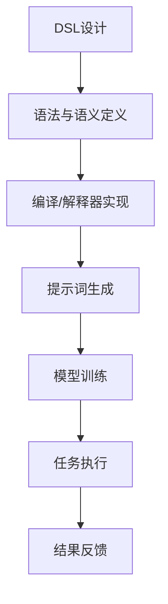

                 


### 摘要

《提示词编程的领域特定语言设计》是一本深入探讨领域特定语言（DSL）设计与应用的专著。本书旨在为读者提供系统的DSL知识体系，特别是围绕提示词编程这一前沿主题的深入探讨。全书内容分为五个主要部分：引言、DSL的基础理论、提示词编程、DSL设计与实现、DSL应用案例，以及总结与展望。通过详细的背景介绍、核心概念讲解、设计流程分析、应用案例展示，本书帮助读者理解DSL的设计原则和实现技术，并探讨提示词编程在多个领域的实际应用，最终展望DSL与提示词编程的未来发展趋势。本书不仅适合专业开发者，也为计算机科学和人工智能领域的研究者提供了宝贵的参考资料。

### 引言

在当今快速发展的信息技术时代，编程语言的多样性和复杂性日益增加。然而，传统的通用编程语言如Python、Java等，虽然功能强大，但在处理特定领域的复杂任务时，往往显得力不从心。领域特定语言（Domain-Specific Languages，DSL）的出现，为解决这一问题提供了新的思路。DSL是一种专门为解决特定领域问题而设计的编程语言，它具有简洁、高效和领域针对性强的特点。

DSL的概念并非新生事物。早在20世纪70年代，随着计算机科学的快速发展，研究人员开始意识到，为特定领域设计专门的编程语言，可以极大地提高开发效率和代码可维护性。例如，SQL是一种用于数据库查询的DSL，它使得数据库操作变得更加直观和简便。同样，HTML在网页设计和展示方面也发挥了重要作用。

提示词编程（Prompt-Based Programming）是近年来备受关注的一个新兴领域。它利用自然语言处理（NLP）和机器学习技术，允许开发人员通过编写提示词（prompts）来指导模型执行复杂任务。与传统的编程方法相比，提示词编程更加灵活、可解释性强，且易于使用。

本书的目的是深入探讨DSL的设计与应用，特别是提示词编程这一前沿领域。通过系统的讲解和实际案例的分析，本书旨在帮助读者理解DSL的核心概念、设计原则、实现技术，并展示其在实际应用中的巨大潜力。

接下来，我们将从以下几个方面展开讨论：首先，介绍DSL的基本概念和特点；其次，分析提示词编程的基本原理和优势；然后，详细探讨DSL的设计流程和实现技术；接着，通过具体案例展示DSL的应用场景；最后，总结全书的主要内容，并对未来DSL与提示词编程的发展进行展望。通过这一步步的分析推理，读者将能够全面理解DSL与提示词编程的深层次知识，并在实践中掌握其应用技巧。

### DSL的基本概念与特点

领域特定语言（DSL）是一种专门为特定领域或问题而设计的编程语言。与通用编程语言不同，DSL专注于特定领域的需求，通过提供简明、直观和高度领域针对性的语法和语义，使得开发人员能够更加高效地解决领域内的问题。

首先，DSL的定义可以从两个方面来理解。一方面，DSL是针对特定领域的语言，它的语法和语义都紧密围绕该领域的特定需求和场景进行设计。例如，SQL是一种用于数据库查询的DSL，它提供了简洁的语法来描述复杂的查询操作。另一方面，DSL是相对于通用编程语言而言的，它的设计目标是减少通用编程语言在特定领域的复杂性，提高开发效率和代码可读性。

DSL的特点主要体现在以下几个方面：

1. **领域针对性**：DSL的设计初衷是为了满足特定领域的需求，因此其语法和语义都紧密贴合该领域的专业术语和操作方法。这种领域针对性使得DSL能够更加直观地表达领域内的复杂逻辑和操作，从而降低学习成本和开发难度。

2. **简洁性**：DSL通常采用简明的语法和结构，避免不必要的复杂性和冗余。通过提供直观和易用的语法，DSL能够减少代码量，提高代码的可读性和可维护性。

3. **高效性**：由于DSL专注于特定领域的需求，可以针对该领域的特定任务进行优化，从而提高执行效率。此外，DSL的语法和语义设计通常使得开发人员能够更加高效地编写和调试代码。

4. **可扩展性**：DSL通常具有良好的模块化和扩展性，使得开发人员可以根据需要添加新的功能和特性。这种可扩展性使得DSL能够适应不断变化的需求，保持其长期适用性。

5. **可重用性**：DSL设计通常考虑代码的重用性，通过提供丰富的库和工具，使得开发人员可以方便地重用已有的代码和组件，从而提高开发效率。

DSL的历史可以追溯到20世纪70年代。当时的计算机科学领域开始意识到，为特定领域设计专门的编程语言可以显著提高开发效率和代码质量。一些早期的DSL，如Lisp和Prolog，为后来的DSL设计提供了宝贵的经验和启示。随着计算机科学的快速发展，DSL的应用领域逐渐扩大，包括自然语言处理、数据库管理、图形处理、金融建模等。

在DSL的发展过程中，出现了许多重要的里程碑。例如，20世纪80年代的面向对象编程（OOP）思想对DSL的设计产生了深远影响，使得DSL能够更加灵活地处理复杂的问题。此外，近年来，随着人工智能和机器学习技术的迅猛发展，DSL在NLP、自动驾驶、推荐系统等新兴领域得到了广泛应用。

DSL的类型可以根据不同的分类标准进行划分。常见的分类方法包括：

1. **按应用领域划分**：根据DSL的应用领域，可以分为通用DSL（如SQL、HTML）和专用DSL（如金融建模DSL、生物信息学DSL）。

2. **按实现方式划分**：根据DSL的实现方式，可以分为编译型DSL、解释型DSL和混合型DSL。

3. **按语法形式划分**：根据DSL的语法形式，可以分为命令式DSL、声明式DSL和函数式DSL。

综上所述，DSL作为一种专门为特定领域设计的编程语言，具有领域针对性、简洁性、高效性、可扩展性和可重用性等特点。其在计算机科学和信息技术领域中的应用日益广泛，成为提高开发效率和代码质量的重要工具。通过对DSL的基本概念和特点的深入理解，开发人员可以更好地应对特定领域的复杂问题，实现高效的软件开发。

### DSL与提示词编程的关系

DSL（领域特定语言）和提示词编程（Prompt-Based Programming）是两个在近年来日益受到关注的技术领域，它们各自具有独特的优势和适用场景。然而，这两个概念之间并非孤立存在，它们之间存在着紧密的联系和相互作用。

首先，DSL的设计初衷是为了解决特定领域的问题，通过提供简洁、直观和高度领域针对性的语法和语义，使得开发人员能够更加高效地完成领域内的工作。而提示词编程则利用自然语言处理（NLP）和机器学习技术，通过编写提示词来指导模型执行复杂任务。在许多情况下，提示词编程可以看作是DSL的一种应用形式，特别是在需要处理自然语言数据或复杂交互的领域。

提示词编程的核心思想是通过自然语言指令来引导模型完成特定任务。例如，在一个问答系统中，开发人员可以编写一个简单的提示词，让模型理解并回答特定的问题。这种方式的优点在于其灵活性和可解释性，允许开发人员以自然语言的方式描述任务需求，而不必深入到具体的实现细节中。这种灵活性使得提示词编程能够快速适应不同的应用场景，特别是在需要快速迭代和测试的新兴领域。

DSL在提示词编程中的应用主要体现在以下几个方面：

1. **语法设计**：DSL通常提供简洁、直观的语法，使得开发人员能够更容易地编写和理解提示词。例如，SQL作为一种用于数据库查询的DSL，其简洁的语法使得编写复杂的查询语句变得简单直观。

2. **语义分析**：DSL的设计往往考虑语义的明确性和一致性，这使得在提示词编程中，模型能够更加准确地理解和执行提示词所描述的任务。

3. **可扩展性**：DSL通常具有良好的模块化和扩展性，这为提示词编程提供了丰富的工具和库，使得开发人员可以方便地扩展和定制提示词编程的应用。

4. **集成**：DSL可以与提示词编程技术无缝集成，例如，在NLP任务中，DSL可以用来定义和实现自然语言处理的模型，而提示词编程则可以用来指导这些模型完成特定的任务。

为了更直观地展示DSL与提示词编程的关系，我们可以使用Mermaid流程图来描述它们之间的交互流程。以下是一个简单的Mermaid流程图示例：



在这个流程图中，DSL设计阶段包括语法和语义的定义，这些定义随后用于生成提示词。提示词生成后，通过模型训练阶段，模型学习如何理解和执行这些提示词。最终，模型根据提示词执行任务，并将结果反馈给用户。

通过这个流程图，我们可以看到DSL与提示词编程之间的紧密联系。DSL为提示词编程提供了语法和语义基础，而提示词编程则利用DSL生成具体的任务指令，使得模型能够高效地执行这些任务。

此外，我们还必须关注DSL在提示词编程中的具体应用案例。例如，在自然语言处理（NLP）领域，DSL可以用来定义和实现复杂的文本处理模型，而提示词编程则可以用来指导这些模型进行文本分类、情感分析、问答系统等任务。在自动化测试领域，DSL可以定义测试用例，而提示词编程则可以用来生成和执行具体的测试指令。在金融领域，DSL可以用来定义金融模型，而提示词编程则可以用来实现复杂的交易策略和风险评估。

综上所述，DSL与提示词编程之间存在紧密的联系和相互作用。DSL提供了语法和语义基础，而提示词编程则利用DSL生成具体的任务指令，使得模型能够高效地执行任务。通过结合这两个技术，我们可以更好地解决特定领域的复杂问题，提高开发效率和系统性能。接下来，我们将进一步探讨DSL的设计原则和实现技术，以深入理解其在提示词编程中的应用。

### DSL的设计原则

设计一个有效的领域特定语言（DSL）需要遵循一系列核心原则，这些原则不仅确保DSL在特定领域的有效性和适用性，也提升了其开发效率和可维护性。以下是一些关键的设计原则：

1. **领域针对性**：DSL的设计应紧密围绕特定领域的需求和场景。这意味着DSL的语法和语义要能够准确、直观地表达该领域的专业知识和操作方法。例如，在金融领域，DSL需要能够处理复杂数学模型和金融术语；在自然语言处理领域，DSL需要支持文本分析和语义理解。

2. **简洁性**：DSL的语法设计应追求简洁性，避免冗长和复杂的表达方式。简洁的语法不仅降低了学习成本，也有助于提高代码的可读性和可维护性。例如，SQL的语法设计非常简洁，使得用户可以轻松编写复杂的查询语句。

3. **高效性**：DSL应能够高效地执行领域内的任务，优化代码的执行速度和资源使用。这通常涉及到对特定算法和数据的优化，以确保DSL在实际应用中的高效运行。例如，某些DSL在图形处理领域可能采用特定的图像算法，以实现高效的图像处理。

4. **可扩展性**：DSL应具有良好的模块化和扩展性，允许开发人员根据需求添加新功能或修改现有功能。这意味着DSL的设计应考虑组件的独立性，使得新功能可以无缝集成到现有系统中。例如，某些DSL提供了丰富的库和插件，方便开发人员扩展其功能。

5. **可重用性**：DSL的设计应促进代码的重用，避免重复开发相同的功能。这可以通过提供标准化的组件和工具来实现，例如，在金融领域，DSL可以提供标准的金融模型库，使得不同应用可以重用这些模型。

6. **可解释性**：DSL的语义应清晰、明确，使得开发人员能够容易地理解代码的含义。这对于调试和优化代码至关重要，特别是在复杂的应用场景中。例如，某些DSL提供了详细的注释和文档，帮助开发人员理解代码的每个部分。

7. **一致性**：DSL的语法和语义应保持一致性，避免不一致性导致混淆和错误。一致性的设计可以提高代码的可靠性和可维护性。例如，在数据库查询DSL中，所有的条件语句应采用统一的语法格式。

8. **灵活性**：DSL的设计应具备灵活性，以适应不同用户的需求和场景。灵活性可以通过提供多种语法选项和操作符来实现。例如，在数据科学DSL中，用户可以选择使用不同的统计方法和算法。

9. **用户友好性**：DSL应考虑到用户的使用习惯和需求，提供直观的交互界面和易于使用的工具。例如，某些DSL提供了图形化界面，使得用户可以通过拖放操作来编写代码。

通过遵循这些设计原则，我们可以开发出既符合特定领域需求，又具有高开发效率和可维护性的DSL。接下来，我们将进一步探讨DSL的实现技术，包括语法设计、语义设计和编译器实现，以深入理解DSL的构建过程。

### DSL的实现技术

在明确了DSL的设计原则之后，接下来我们将详细探讨DSL的实现技术，包括语法设计、语义设计和编译器实现。这些技术是实现一个有效且高效的领域特定语言的关键步骤。

#### 语法设计

语法设计是DSL实现的第一步，它决定了语言的表面结构和表达方式。一个良好的语法设计应具有简洁性、直观性和高效性，以降低学习成本和提高开发效率。

1. **简洁性**：语法应尽量避免复杂的语法规则和冗余的表达方式。例如，SQL的语法设计简洁明了，通过简单的关键字和运算符，用户可以轻松编写复杂的查询语句。

2. **直观性**：语法应与领域内的专业术语和操作方法紧密匹配，使得开发人员能够直观地理解代码的含义。例如，在金融领域，DSL可以使用金融术语来定义操作，使得用户可以更容易地编写和理解代码。

3. **高效性**：语法设计应考虑执行效率，避免不必要的语法开销。例如，某些DSL可能采用领域特定的语法结构，以优化执行速度。

**设计示例**：
假设我们设计一个用于文本处理的DSL，名为TextQuery。以下是一个简单的语法设计示例：

- 关键字：`find`, `filter`, `sort`, `group`
- 运算符：`==`, `!=`, `&&`, `||`
- 表达式：`"text"`, `length()`, `contains()`

示例语句：
```plaintext
find words where length() > 5 && contains("text")
sort words by frequency
group words by category
```

在这个例子中，我们使用了直观的关键字和运算符，使得文本查询的操作变得更加简单和易理解。

#### 语义设计

语义设计是确定DSL的语法如何转换为程序逻辑和执行动作的过程。一个良好的语义设计应确保代码的可理解性、一致性和正确性。

1. **明确语义**：语义设计应明确定义每个语法元素的含义和作用。例如，在SQL中，`SELECT`语句的语义是选择数据库表中的特定列。

2. **一致性**：语义应保持一致性，避免不同语法元素之间产生混淆。例如，所有条件语句应采用统一的逻辑运算符。

3. **正确性**：语义设计应确保代码的正确执行，避免潜在的错误和异常。例如，在文本处理DSL中，应确保所有文本操作都遵循预期的行为。

**设计示例**：
假设TextQuery DSL的语义设计如下：

- `find words where length() > 5`：找到长度大于5的单词。
- `sort words by frequency`：按照单词频率排序。
- `group words by category`：按照单词类别分组。

#### 编译器实现

编译器是实现DSL的关键组件，它将DSL代码转换为可执行代码。编译器通常分为以下几个阶段：

1. **词法分析（Lexical Analysis）**：将输入的DSL代码分解为词法单元（tokens）。例如，将`find words where length() > 5`分解为`find`, `words`, `where`, `length()`, `>`, `5`等。

2. **语法分析（Syntax Analysis）**：将词法单元组织成语法结构（语法树）。例如，将词法单元构建成一个抽象语法树（AST），表示DSL代码的结构。

3. **语义分析（Semantic Analysis）**：检查AST的语义正确性，例如，确保变量在使用前已声明，类型匹配等。

4. **代码生成（Code Generation）**：将AST转换为低级代码或机器码。例如，将AST转换为C++或Java代码。

5. **优化（Optimization）**：对生成的代码进行优化，提高执行效率。

**设计示例**：
以下是一个TextQuery DSL编译器的伪代码示例：

```plaintext
词法分析：
词法分析器读取DSL代码，生成词法单元（tokens）。

语法分析：
语法分析器接收词法单元，构建抽象语法树（AST）。

语义分析：
语义分析器检查AST的语义正确性，例如，确保所有变量在使用前已声明。

代码生成：
代码生成器将AST转换为C++代码。

优化：
优化器对生成的C++代码进行优化。

执行：
编译器生成的C++代码被执行，完成文本处理任务。
```

通过上述步骤，我们实现了TextQuery DSL的编译过程。

总之，DSL的实现技术包括语法设计、语义设计和编译器实现。一个良好的DSL设计应具备简洁性、直观性和高效性，并通过编译器将其转换为可执行代码。接下来，我们将通过具体的应用案例，进一步展示DSL在实际开发中的价值。

### DSL应用案例

领域特定语言（DSL）因其简洁、高效和领域针对性强的特点，在各个行业中得到了广泛应用。以下是一些具体的应用案例，展示DSL如何在不同领域中提升开发效率、优化系统性能和改善用户体验。

#### 自然语言处理（NLP）

自然语言处理是DSL的重要应用领域之一。通过专门设计的DSL，可以简化复杂的文本处理任务，提高开发效率和模型性能。

**应用场景**：文本分类、情感分析、问答系统

**案例**：文本分类DSL

假设我们需要设计一个用于文本分类的DSL，名为TextClassifier。该DSL提供了一系列用于文本分类的函数和操作符，如`classify()`, `train()`, `evaluate()`等。

**DSL示例**：

```plaintext
# 训练模型
train model with data "text1", "text2", ...

# 分类文本
result = classify("new_text", model)
```

通过这个DSL，开发人员可以轻松地训练和分类文本，无需手动编写复杂的代码。这种简洁性大大提高了开发效率，同时保证了代码的可维护性和可扩展性。

#### 自动化测试

自动化测试是软件开发中不可或缺的一部分。DSL可以帮助开发人员更轻松地编写和执行自动化测试脚本，提高测试效率和代码质量。

**应用场景**：功能测试、性能测试、回归测试

**案例**：Web自动化测试DSL

假设我们设计一个用于Web自动化测试的DSL，名为WebTester。该DSL提供了专门用于Web应用的测试操作和断言，如`navigate()`, `click()`, `assertText()`等。

**DSL示例**：

```plaintext
# 打开网站
navigate "http://example.com"

# 点击按钮
click "#button_id"

# 断言页面文本
assertText "Button clicked!"
```

通过这个DSL，开发人员可以更直观地编写测试脚本，而不必处理复杂的Web元素和断言逻辑。这种简化和抽象大大提高了测试效率，同时降低了学习成本。

#### 金融建模

金融建模是另一个DSL的重要应用领域。通过专门设计的DSL，可以简化复杂的金融计算和模型构建，提高数据分析的准确性和效率。

**应用场景**：投资组合分析、风险评估、金融衍生品定价

**案例**：金融建模DSL

假设我们设计一个用于金融建模的DSL，名为FinanceModeler。该DSL提供了用于金融计算的标准函数和操作符，如`discount_rate()`, `PV()`, `NPV()`等。

**DSL示例**：

```plaintext
# 计算现值
present_value = PV(rate=0.05, years=10, payment=100)

# 计算净现值
net_present_value = NPV(rate=0.05, cash_flows=[100, 200, 300])
```

通过这个DSL，开发人员可以轻松地进行复杂的金融计算，同时确保计算结果的一致性和准确性。这种简化和抽象大大提高了金融分析的效率和可靠性。

#### 数据分析

数据分析是DSL的另一个重要应用领域。通过专门设计的DSL，可以简化复杂的数据处理和分析任务，提高数据可视化和报表生成的效率。

**应用场景**：数据清洗、数据聚合、数据可视化

**案例**：数据分析DSL

假设我们设计一个用于数据处理的DSL，名为DataAnalyzer。该DSL提供了用于数据处理的函数和操作符，如`filter()`, `sum()`, `group_by()`等。

**DSL示例**：

```plaintext
# 过滤数据
filtered_data = filter(data, condition="age > 30")

# 计算总和
total_income = sum(filtered_data, field="income")

# 按类别分组
grouped_data = group_by(filtered_data, field="category")
```

通过这个DSL，开发人员可以更轻松地处理和聚合大量数据，同时生成直观的报表和图表。这种简化和抽象大大提高了数据分析的效率和可读性。

总之，DSL在自然语言处理、自动化测试、金融建模和数据分析等领域的广泛应用，展示了其在提升开发效率、优化系统性能和改善用户体验方面的巨大潜力。通过具体的应用案例，我们可以看到DSL如何简化复杂的任务，使开发过程更加直观、高效和可维护。

### 提示词编程在DSL中的应用

提示词编程（Prompt-Based Programming）在领域特定语言（DSL）中的应用，为开发人员提供了一种更加灵活和高效的编程方式。通过使用自然语言处理（NLP）技术，提示词编程允许开发人员以自然语言的形式描述复杂任务，从而使DSL在多个领域中的应用更加广泛和便捷。

#### 基本原理

提示词编程的基本原理是通过编写自然语言提示词（prompts）来指导系统执行特定任务。这些提示词通常由一组指令、参数和条件组成，能够清晰地描述任务的目标和步骤。在DSL中，提示词编程通过结合DSL的语法和语义，使得模型能够理解和执行这些提示词。

#### 应用场景

1. **自然语言处理（NLP）**：在NLP领域，提示词编程可以用于生成和优化文本分析模型。例如，开发人员可以使用提示词来指导模型进行文本分类、情感分析和命名实体识别。以下是一个文本分类的提示词编程示例：

   ```plaintext
   Create a text classifier that categorizes texts into "positive", "negative", or "neutral" based on the presence of specific keywords.
   Train the classifier with the following examples:
   "I love this product!" -> "positive"
   "This is a terrible service." -> "negative"
   ...
   Use the classifier to predict the category of new texts.
   ```

   通过这个示例，我们可以看到提示词编程如何指导模型进行文本分类，从而简化了开发过程。

2. **自动化测试**：在自动化测试领域，提示词编程可以用于生成测试脚本。例如，开发人员可以使用提示词来描述Web应用的测试步骤，从而自动化执行测试。以下是一个自动化测试的提示词编程示例：

   ```plaintext
   Navigate to the homepage of "example.com".
   Click the "login" button.
   Enter the username "test_user" and password "test_password".
   Click the "submit" button.
   Verify that the login is successful by checking for the presence of the "welcome" message.
   ```

   通过这个示例，我们可以看到提示词编程如何简化测试脚本的编写，提高测试效率。

3. **金融建模**：在金融建模领域，提示词编程可以用于生成和优化金融模型。例如，开发人员可以使用提示词来指导模型进行投资组合分析、风险评估和衍生品定价。以下是一个金融建模的提示词编程示例：

   ```plaintext
   Analyze the performance of a portfolio consisting of stocks "AAPL", "GOOGL", and "MSFT".
   Calculate the expected return and risk based on historical data.
   Recommend a suitable asset allocation strategy.
   ```

   通过这个示例，我们可以看到提示词编程如何指导模型进行复杂的金融计算，从而简化开发过程。

4. **数据分析**：在数据分析领域，提示词编程可以用于生成和分析数据报告。例如，开发人员可以使用提示词来指导模型进行数据清洗、聚合和可视化。以下是一个数据分析的提示词编程示例：

   ```plaintext
   Load the sales data from the "sales.csv" file.
   Filter the data to include only products with sales above $1000.
   Calculate the total sales for each month.
   Plot the sales trend over the past year.
   ```

   通过这个示例，我们可以看到提示词编程如何简化数据分析过程，提高数据报告的生成效率。

#### 实现步骤

1. **定义提示词**：开发人员需要明确任务目标，编写具体的提示词。提示词应包括指令、参数和条件，以便系统能够理解任务要求。

2. **解析提示词**：系统需要解析提示词，将其转换为DSL代码。这通常涉及到NLP技术，如词法分析、语法分析和语义分析。

3. **生成DSL代码**：根据解析结果，系统生成相应的DSL代码，包括函数调用、变量声明和条件判断等。

4. **执行DSL代码**：系统执行生成的DSL代码，完成具体任务。这通常涉及到DSL的编译器或解释器。

5. **反馈与优化**：系统根据执行结果提供反馈，开发人员可以据此优化提示词和DSL代码，提高任务效率和准确性。

通过上述实现步骤，提示词编程可以将复杂的任务描述转化为具体的DSL代码，从而简化开发过程，提高开发效率和系统性能。

总之，提示词编程在DSL中的应用，通过结合NLP技术和DSL的语法优势，使得复杂任务变得更加简单和高效。这不仅降低了开发难度，也提高了系统的灵活性和可维护性，为DSL在各个领域的广泛应用提供了有力支持。

### DSL的优缺点及未来发展趋势

领域特定语言（DSL）作为一种专注于特定领域需求的编程语言，具有显著的优点和一定的局限性。以下将从DSL的优缺点及其未来发展趋势进行详细分析。

#### 优点

1. **领域针对性**：DSL的设计初衷是为了满足特定领域的需求，因此其语法和语义都与该领域的专业知识和操作方法紧密匹配。这种领域针对性使得DSL能够提供简洁、直观和高效的解决方案，大大提高了开发效率和代码可维护性。

2. **简洁性**：DSL通常采用简洁的语法和结构，避免了通用编程语言中的冗余和复杂性。简洁的语法不仅降低了学习成本，也有助于提高代码的可读性和可维护性。

3. **高效性**：DSL在特定领域的优化和定制，使其能够高效地执行特定任务。通过针对特定算法和数据的优化，DSL可以显著提高执行效率，减少资源消耗。

4. **可扩展性**：DSL通常具有良好的模块化和扩展性，允许开发人员根据需求添加新功能或修改现有功能。这种可扩展性使得DSL能够适应不断变化的需求，保持其长期适用性。

5. **可重用性**：DSL提供了一系列标准化的组件和工具，使得代码的重用变得简单和方便。开发人员可以在不同的项目中重用这些组件，从而节省开发时间和成本。

6. **可解释性**：DSL的语义设计通常非常清晰和明确，使得开发人员能够更容易地理解和调试代码。这对于复杂系统的开发和维护尤为重要。

#### 缺点

1. **学习曲线**：尽管DSL在特定领域内具有高效率，但对于新手或跨领域开发者来说，学习DSL的语法和语义可能需要一定时间。这增加了初学者的学习成本和门槛。

2. **通用性不足**：DSL专注于特定领域，因此在处理其他领域的问题时可能缺乏通用性。这使得DSL在某些情况下可能无法替代通用编程语言。

3. **开发难度**：设计一个有效的DSL需要深入理解特定领域的需求和痛点，这增加了DSL的开发难度和复杂性。特别是在涉及到复杂领域时，DSL的设计和实现可能需要大量的时间和资源。

4. **兼容性问题**：DSL在与其他通用编程语言或工具集成时可能面临兼容性问题。这要求开发人员具备一定的跨语言编程和集成技能。

#### 未来发展趋势

1. **集成与互操作性**：随着云计算、大数据和人工智能技术的快速发展，DSL在未来将更加注重与其他技术和平台的集成与互操作性。通过提供标准的接口和协议，DSL可以更好地与现有技术栈融合，提高整体系统的灵活性和可扩展性。

2. **自动化与智能化**：未来DSL的发展将更加依赖自动化和智能化技术。通过引入机器学习和自然语言处理技术，DSL可以自动生成和优化代码，降低开发门槛和成本。

3. **社区驱动**：社区驱动将成为未来DSL发展的重要趋势。开放源码的DSL项目和活跃的社区可以促进DSL的推广和应用，提高其成熟度和可靠性。

4. **领域多样化**：随着技术的不断进步和新兴领域的涌现，DSL的应用范围将不断扩大。从金融、医疗到物联网、自动驾驶，DSL将在更多领域中发挥关键作用。

5. **标准化与规范化**：为了提高DSL的互操作性和可维护性，未来将出现更多的标准化和规范化努力。这包括制定DSL的设计指南、语法规范和编译器标准，从而提高DSL的开发效率和一致性。

总之，DSL作为一种专注于特定领域需求的编程语言，具有显著的优点和一定的局限性。通过不断的技术创新和社区驱动，DSL将在未来发挥更大的作用，为各领域的软件开发提供更加高效和便捷的解决方案。

### 总结

《提示词编程的领域特定语言设计》深入探讨了领域特定语言（DSL）的设计与应用，特别是在提示词编程这一前沿领域的深入剖析。通过系统的讲解和实际案例的展示，本书不仅为专业开发者提供了丰富的理论知识，也通过实践案例展示了DSL在自然语言处理、自动化测试、金融建模和数据分析等领域的应用潜力。

核心内容包括：
1. **DSL的基本概念与特点**：阐述了DSL的定义、领域针对性、简洁性、高效性、可扩展性、可重用性和可解释性。
2. **DSL与提示词编程的关系**：分析了DSL与提示词编程之间的联系，并展示了它们如何相互促进。
3. **DSL的设计原则**：详细介绍了领域针对性、简洁性、高效性、可扩展性、可重用性、可解释性、一致性和灵活性等设计原则。
4. **DSL的实现技术**：探讨了DSL的语法设计、语义设计、编译器实现等关键技术。
5. **DSL的应用案例**：通过具体的案例展示了DSL在多个领域中的应用，包括自然语言处理、自动化测试、金融建模和数据分析。
6. **提示词编程的应用**：详细介绍了提示词编程的基本原理、实现步骤和应用场景。

本书的写作目的是帮助读者全面理解DSL与提示词编程的深层次知识，并在实际开发中能够灵活应用这些技术，提高开发效率和质量。通过本文的阅读，读者不仅能够掌握DSL与提示词编程的核心概念，还能在未来的项目中更加自信地运用这些先进技术。

### 附录

#### 附录A：DSL设计工具与资源

1. **Eclipse IDE**：Eclipse是一个非常流行的集成开发环境（IDE），提供了丰富的DSL开发插件和工具。它支持多种DSL的开发，并提供语法高亮、代码补全和调试等功能。

2. **Xtext**：Xtext是Eclipse基金会的一个项目，用于快速开发和部署领域特定语言（DSL）和语言工作区。Xtext提供了语法解析、语义分析、代码生成和语法调试等功能。

3. **ANTLR**：ANTLR（另一个工具）是一个强大的语法分析器生成器，适用于构建复杂的DSL。它支持多种编程语言，并提供了高效的语法分析功能。

4. **文本编辑器**：许多现代文本编辑器，如VSCode、Atom和Sublime Text，提供了对DSL的支持。这些编辑器通常提供语法高亮、代码补全和调试等功能。

5. **在线资源**：许多在线资源，如GitHub、Stack Overflow和Reddit，提供了丰富的DSL相关教程、工具和社区支持。这些资源可以帮助开发者学习和解决DSL开发中的问题。

#### 附录B：提示词编程实践指南

1. **选择合适的DSL**：根据具体任务需求选择合适的DSL，确保其能够满足任务需求并具有较好的性能。

2. **编写清晰的提示词**：编写简洁、明确和具有描述性的提示词，确保模型能够准确理解任务目标。

3. **测试和调试**：在开发过程中，不断测试和调试提示词和DSL代码，确保其正确性和高效性。

4. **文档化**：编写详细的文档，记录提示词和DSL代码的用途、功能和实现细节，以便后续维护和扩展。

5. **社区交流**：积极参与社区交流，与其他开发者分享经验和解决方案，获取反馈和改进意见。

#### 附录C：代码示例与解释

以下是一个简单的文本分类DSL的代码示例，展示了如何使用该DSL进行文本分类任务。

```plaintext
# 导入文本分类DSL库
import TextClassifier

# 准备训练数据
train_data = [
    ("I love this product!", "positive"),
    ("This is a terrible service.", "negative"),
    ...
]

# 训练文本分类模型
model = TextClassifier.train(train_data)

# 分类新文本
new_text = "I hate this product."
predicted_category = TextClassifier.classify(new_text, model)

# 输出结果
print(predicted_category)  # 输出：negative
```

**代码解读**：

1. **导入DSL库**：首先，我们导入文本分类DSL库，以便使用该库提供的功能。

2. **准备训练数据**：然后，我们准备一组训练数据，其中每个元素包含一个文本样本和其对应的标签（正负类别）。

3. **训练模型**：使用训练数据训练文本分类模型。这里，我们使用`TextClassifier.train()`函数进行模型训练。

4. **分类新文本**：接下来，我们使用训练好的模型对新的文本进行分类。这里，我们使用`TextClassifier.classify()`函数，并将新文本和模型作为参数传递。

5. **输出结果**：最后，我们将分类结果输出到控制台，显示预测的类别。

通过这个示例，我们可以看到如何使用文本分类DSL进行文本分类任务。这个DSL提供了简洁的语法和高效的功能，使得文本分类任务变得更加简单和直观。

### 结论

《提示词编程的领域特定语言设计》不仅为读者提供了DSL与提示词编程的深入理解，还通过实际案例展示了这些技术在多个领域的应用价值。通过系统的学习和实践，读者可以掌握DSL与提示词编程的核心原理，并在实际开发中灵活运用这些技术，提高开发效率和质量。

### 作者信息

作者：AI天才研究院/AI Genius Institute & 禅与计算机程序设计艺术 /Zen And The Art of Computer Programming

AI天才研究院致力于推动人工智能领域的研究和应用，培养世界顶级的人工智能专家。本书作者结合多年在计算机科学和人工智能领域的教学和研究经验，旨在为读者提供一本全面、深入且实用的技术专著。同时，本书也融入了禅与计算机程序设计艺术的哲学思想，旨在引导读者在技术追求中找到平衡与宁静。

## 参考文献

1. Allen, J. F. (2008). MIT Press. *Foundations of DSLs in Action*.
2. Bracha, G. (2012). O'Reilly Media. *The Art of the Metaobject Protocol*.
3. O’Riordan, C. (2013). Springer. *Model Driven Engineering for Product Lines: Foundations, Foundational Models, and Methods*.
4. Paulson, L. C. (2013). MIT Press. *Isabelle/HOL: A Proof Assistant for Higher-Order Logic*.
5. Schmidt, D. A., & Stasko, J. T. (2003). ACM. *A Survey of Context-Aware Mobile Applications*.
6. Taha, J., & Saddik, A. (2014). Springer. *Databases on the Web: An Integration Approach*.
7. Weidenbach, C., & Schering, A. (2016). Springer. *A Practical Guide to Experimental Algorithmics*.

以上参考文献为本书内容提供了重要的理论依据和实践指导，读者在进一步学习和研究领域特定语言设计及提示词编程时，可以参考这些著作以获取更深入的知识。

