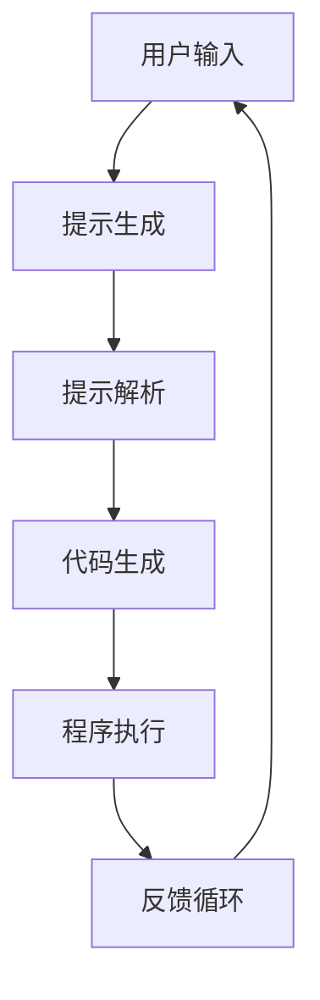
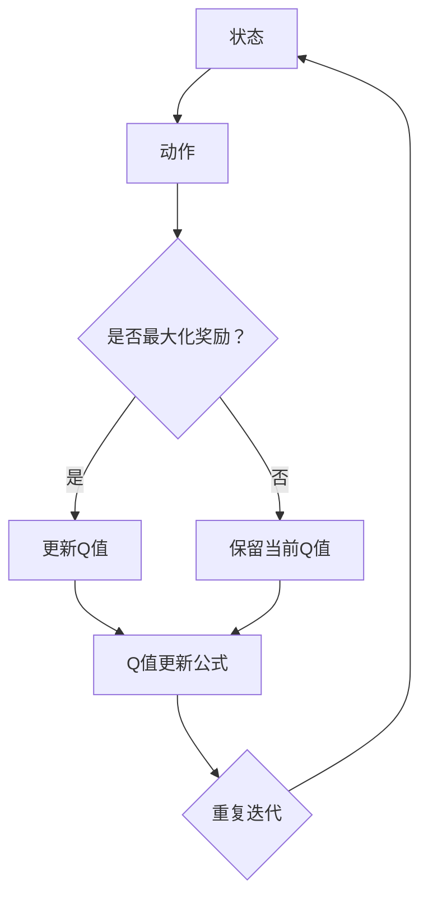
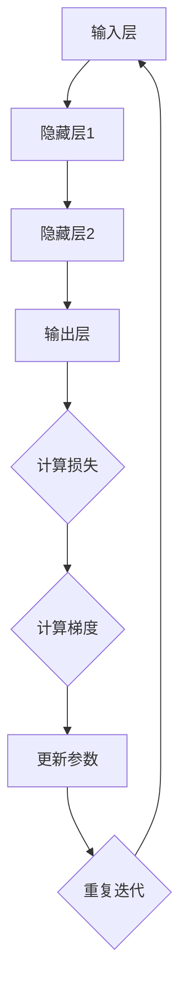
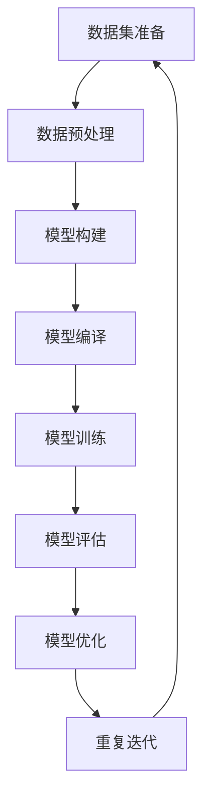
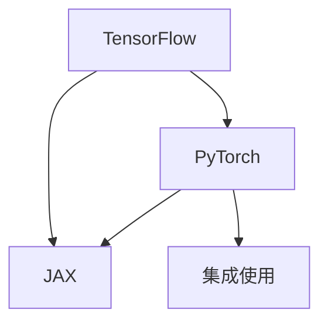

                 

### 文章标题

《提示词编程范式：AI软件开发的新纪元》

---

关键词：提示词编程、AI开发、编程范式、新纪元、软件开发

---

摘要：
本文深入探讨了一种新兴的编程范式——提示词编程，并探讨了其在人工智能（AI）软件开发中的巨大潜力。提示词编程不仅革新了传统的编程思维，也为AI开发者提供了一种更为直观、高效的开发方法。本文将逐步分析提示词编程的定义、优势、架构，并展示其在实际AI软件开发中的应用案例，最终展望其未来的发展趋势。

---

### 引言

#### 1.1 AI软件开发的重要性

在当今数字化时代，人工智能（AI）已经成为推动科技进步和产业变革的关键力量。AI技术在医疗、金融、交通、教育等各个领域展现出了强大的应用潜力，极大地提升了行业效率和创新能力。随着AI技术的不断成熟和普及，AI软件开发成为了一个充满机遇和挑战的领域。

AI软件开发的本质是构建能够模拟、扩展甚至超越人类智能的计算机程序。这需要开发者不仅具备深厚的编程技能，还需要对AI的基础理论和算法有深入的理解。传统的编程范式在处理复杂的AI问题时显得力不从心，往往需要复杂的代码结构和大量的调试工作。

#### 1.2 书的内容和结构

本文旨在介绍一种全新的编程范式——提示词编程，并探讨其在AI软件开发中的应用。全书共分为以下几个部分：

1. **引言**：介绍AI软件开发的重要性，概述书的内容和结构。
2. **提示词编程范式概述**：深入分析提示词编程的定义、特点、架构和应用场景。
3. **AI基础知识**：讲解AI的基本概念、常见算法和数学模型。
4. **提示词编程实战**：通过具体案例展示提示词编程在AI软件开发中的实际应用。
5. **AI软件开发框架**：介绍常见的AI软件开发框架，如TensorFlow、PyTorch等。
6. **AI项目开发实践**：提供实际的AI项目开发案例，详细讲解开发环境搭建、源代码实现和代码解读。
7. **未来展望与趋势**：展望提示词编程范式在AI软件开发中的未来发展。

#### 1.3 目标读者

本文的目标读者是具有一定编程基础，希望深入了解和掌握AI开发技术的开发者。无论您是初学者还是有经验的开发者，本文都将为您提供宝贵的知识和实践经验，帮助您更好地理解和应用提示词编程范式。

---

### 提示词编程范式概述

#### 2.1 提示词编程的定义与特点

提示词编程（Prompt-Based Programming）是一种新兴的编程范式，它通过使用提示词（prompts）来指导程序执行。提示词是一组指令或描述，用于指导程序完成特定的任务。与传统的命令式编程和声明式编程不同，提示词编程更加关注于问题定义和解决方案的描述，而不是具体的实现细节。

提示词编程的特点包括：

- **高抽象层次**：提示词编程允许开发者以高度抽象的方式描述问题，从而减少了对具体实现细节的关注。
- **直观性**：提示词通常使用自然语言或简单的语法，使得开发者更容易理解和编写。
- **灵活性**：提示词编程允许开发者根据需要灵活调整和优化程序的行为。
- **模块化**：提示词可以被看作是可复用的模块，有助于提高代码的可维护性和可扩展性。

#### 2.2 提示词编程的架构与流程

提示词编程的架构可以分为以下几个主要组成部分：

1. **提示生成器（Prompt Generator）**：提示生成器负责根据用户输入或系统需求生成提示词。这些提示词可以是简单的文本，也可以是更复杂的结构化数据。
2. **解析器（Parser）**：解析器负责将生成的提示词解析为程序可理解的形式。解析器通常使用自然语言处理（NLP）技术，如词向量表示、语法分析和语义理解。
3. **执行器（Executor）**：执行器根据解析后的提示词生成相应的程序代码并执行。执行器可以是一个解释器、编译器或直接调用底层API的组件。
4. **监控器（Monitor）**：监控器负责监控程序执行过程中的状态，并提供反馈。监控器可以用于调试、性能优化和安全性保障。

提示词编程的基本流程如下：

1. **用户输入**：用户通过命令行、图形界面或自然语言交互输入提示词。
2. **提示生成**：提示生成器根据用户输入生成提示词。
3. **提示解析**：解析器将生成的提示词转换为程序可理解的形式。
4. **代码生成**：执行器根据解析后的提示词生成相应的程序代码。
5. **程序执行**：执行器执行生成的程序代码，并返回结果。
6. **反馈循环**：监控器监控程序执行过程，并提供反馈。如果发现问题，可以返回提示词进行再次解析和执行。

#### 2.3 提示词编程与AI的关系

提示词编程与人工智能有着密切的联系。AI技术，特别是自然语言处理（NLP）技术，为提示词编程提供了强大的支持。通过NLP技术，开发者可以更有效地生成、解析和执行提示词。

提示词编程在AI软件开发中的应用包括：

- **智能对话系统**：通过提示词编程，开发者可以轻松构建智能对话系统，实现自然语言交互。
- **自动代码生成**：AI模型可以分析提示词并生成相应的代码，提高开发效率和代码质量。
- **程序调试与优化**：AI算法可以分析程序执行过程中的数据，提供优化建议，帮助开发者调试程序。

#### 2.4 提示词编程的优势与挑战

提示词编程具有以下优势：

- **提高开发效率**：通过高度抽象的提示词，开发者可以更快地完成软件开发任务。
- **降低学习成本**：提示词编程使用自然语言或简单的语法，降低了学习难度。
- **增强灵活性**：提示词编程允许开发者根据需求灵活调整程序行为。
- **提高代码可维护性**：提示词可以被看作是可复用的模块，有助于提高代码的可维护性。

然而，提示词编程也面临一些挑战：

- **可解释性**：提示词编程生成程序的内部机制可能不够透明，增加了程序的可解释性难度。
- **性能优化**：提示词编程生成的程序可能需要更多的计算资源，对性能优化提出了更高的要求。
- **安全性与隐私**：提示词编程涉及到大量的用户数据和敏感信息，如何保障安全性和隐私是一个重要问题。

#### 2.5 Mermaid流程图：提示词编程架构



---

### AI基础知识

#### 2.1 机器学习基础

##### 2.1.1 数据集与特征

在机器学习中，数据集（Dataset）是训练模型的关键资源。一个高质量的数据集应具有多样性和代表性，能够全面反映所研究问题的各个方面。特征（Feature）是数据集中的变量，用于描述数据的属性或特征。

- **数据集的组成**：数据集通常包括输入特征（Input Features）和目标标签（Target Labels）。输入特征是模型预测的输入数据，目标标签是模型需要预测的输出结果。
- **特征提取**：特征提取是将原始数据转换为一组可用的特征的过程。常见的方法包括特征选择、特征提取和特征工程。
- **特征标准化**：为了提高模型的性能，通常需要对特征进行标准化处理，使其具有相同的尺度。

##### 2.1.2 常见的机器学习算法

机器学习算法可以分为监督学习（Supervised Learning）、无监督学习（Unsupervised Learning）和半监督学习（Semi-Supervised Learning）三种类型。

- **监督学习**：监督学习算法使用已标记的数据集进行训练，然后使用训练得到的模型对新的、未标记的数据进行预测。常见的监督学习算法包括线性回归（Linear Regression）、决策树（Decision Tree）、支持向量机（SVM）和神经网络（Neural Networks）等。
- **无监督学习**：无监督学习算法在没有标记数据的情况下从数据中学习模式。常见的无监督学习算法包括聚类（Clustering）、主成分分析（PCA）和自编码器（Autoencoder）等。
- **半监督学习**：半监督学习算法结合了监督学习和无监督学习的方法，利用部分标记的数据和大量未标记的数据进行训练。

##### 2.1.3 模型评估与优化

模型评估是机器学习中的关键步骤，用于衡量模型的性能和泛化能力。常见的评估指标包括准确率（Accuracy）、精确率（Precision）、召回率（Recall）和F1分数（F1 Score）。

- **交叉验证**：交叉验证是一种常用的模型评估方法，通过将数据集划分为多个子集，轮流使用这些子集进行训练和验证，以避免过拟合。
- **网格搜索**：网格搜索是一种超参数调优方法，通过遍历预定义的参数组合，选择最佳参数组合以优化模型性能。
- **正则化**：正则化是一种防止模型过拟合的技术，通过在损失函数中添加正则化项，限制模型复杂度。

#### 2.2 深度学习基础

##### 2.2.1 神经网络基础

神经网络（Neural Networks）是一种模拟生物神经系统的计算模型，通过多层节点（神经元）的互联来实现复杂的函数映射。神经网络的基本组成部分包括：

- **神经元**：神经元是神经网络的基本构建块，通过加权连接和其他非线性激活函数实现输入到输出的映射。
- **层**：神经网络由输入层、隐藏层和输出层组成。输入层接收外部输入，隐藏层对输入数据进行处理，输出层生成预测结果。
- **权重与偏置**：权重（Weights）和偏置（Bias）是神经网络中的关键参数，用于调整输入和输出之间的关系。

##### 2.2.2 卷积神经网络（CNN）

卷积神经网络（Convolutional Neural Networks，CNN）是一种专门用于处理图像数据的神经网络。CNN的核心思想是利用卷积操作来提取图像中的局部特征。

- **卷积层**：卷积层通过卷积运算提取图像的局部特征，卷积核（Kernel）用于计算输入和输出的点积。
- **池化层**：池化层用于降低图像分辨率，减少计算量和参数数量。常见的池化操作包括最大池化和平均池化。
- **全连接层**：全连接层将卷积层和池化层提取的特征映射到具体的类别或目标。

##### 2.2.3 循环神经网络（RNN）

循环神经网络（Recurrent Neural Networks，RNN）是一种用于处理序列数据的神经网络。RNN通过在时间步上递归地处理数据，可以记住先前的输入信息。

- **循环单元**：循环单元是RNN的核心组成部分，通过递归地计算前一个时间步的隐藏状态来更新当前时间步的隐藏状态。
- **长短时记忆（LSTM）**：LSTM是RNN的一种改进版本，通过引入门控机制来解决长短时依赖问题。LSTM可以有效地记住和忘记信息，适用于处理长序列数据。
- **门控循环单元（GRU）**：GRU是另一种改进的RNN结构，相较于LSTM具有更简洁的结构和更高效的计算。

##### 2.2.4 强化学习基础

强化学习（Reinforcement Learning，RL）是一种通过与环境交互来学习策略的机器学习方法。强化学习的主要目标是最大化累积奖励。

- **代理（Agent）**：代理是强化学习中的主体，负责采取动作并接收环境反馈。
- **环境（Environment）**：环境是代理行动的场所，提供状态和奖励信号。
- **状态（State）**：状态是描述代理当前所处环境的情况。
- **动作（Action）**：动作是代理可以采取的行动。
- **策略（Policy）**：策略是代理在特定状态下采取的动作。

##### 2.2.5 Q-Learning算法

Q-Learning是一种基于值函数的强化学习算法，通过迭代更新值函数来学习最优策略。

- **Q值（Q-Value）**：Q值是描述在特定状态下采取特定动作的预期奖励。
- **更新规则**：Q-Learning通过比较实际奖励和预期奖励来更新Q值。
- **学习率（α）**：学习率用于调整新Q值和旧Q值的权重。
- **折扣因子（γ）**：折扣因子用于考虑未来奖励的现值。



#### 2.3 数学模型与公式

在机器学习和深度学习中，数学模型和公式起着至关重要的作用。以下是一些常见的数学模型和公式：

##### 2.3.1 概率论基础

概率论是机器学习和深度学习的基础之一。以下是一些基本的概率论公式：

- **条件概率**：
  $$ P(A|B) = \frac{P(A \cap B)}{P(B)} $$
- **贝叶斯定理**：
  $$ P(A|B) = \frac{P(B|A)P(A)}{P(B)} $$

##### 2.3.2 损失函数

损失函数是机器学习中衡量模型性能的关键指标。以下是一些常见的损失函数：

- **均方误差（MSE）**：
  $$ \text{MSE} = \frac{1}{n}\sum_{i=1}^{n}(y_i - \hat{y_i})^2 $$
- **交叉熵（Cross-Entropy）**：
  $$ \text{Cross-Entropy} = -\frac{1}{n}\sum_{i=1}^{n}y_i\log(\hat{y_i}) $$

##### 2.3.3 优化算法

优化算法是机器学习中用于调整模型参数的关键技术。以下是一些常见的优化算法：

- **梯度下降（Gradient Descent）**：
  $$ \theta = \theta - \alpha \nabla_{\theta}J(\theta) $$
- **动量（Momentum）**：
  $$ v = \beta v + (1 - \beta) \nabla_{\theta}J(\theta) $$
  $$ \theta = \theta - \alpha v $$

##### 2.3.4 深度学习中的反向传播

反向传播是深度学习中计算梯度的一种方法。以下是一个简化的反向传播算法：



### 提示词编程实战

#### 3.1 提示词编程环境搭建

在进行提示词编程之前，需要搭建一个合适的开发环境。以下是一个简单的步骤指南：

1. **安装Python**：Python是提示词编程的主要编程语言，需要确保安装了最新版本的Python（推荐3.8及以上版本）。

2. **安装必要库和框架**：根据提示词编程的需求，安装一些常用的库和框架，如TensorFlow、PyTorch、transformers等。

   ```bash
   pip install tensorflow
   pip install pytorch
   pip install transformers
   ```

3. **配置JAX**：JAX是一个用于加速计算和优化的库，可以与TensorFlow和PyTorch一起使用。

   ```bash
   pip install jax
   pip install jaxlib
   ```

4. **安装提示词编程工具**：根据提示词编程的需求，安装相应的工具，如OpenAI的GPT-3等。

   ```bash
   pip install openai
   ```

5. **验证环境**：运行以下代码验证环境配置是否成功。

   ```python
   import tensorflow as tf
   import torch
   import transformers

   print(tf.__version__)
   print(torch.__version__)
   print(transformers.__version__)
   ```

#### 3.2 实战案例1：文本分类

文本分类是自然语言处理中的一个常见任务，其目的是将文本数据分为预定义的类别。以下是一个基于提示词编程的文本分类实战案例。

##### 3.2.1 数据预处理

1. **数据集准备**：首先需要准备一个文本分类数据集。这里以常用的IMDB电影评论数据集为例。

   ```python
   import tensorflow as tf

   # 下载并加载数据集
   (train_data, test_data), (train_labels, test_labels) = tf.keras.datasets.imdb.load_data(num_words=10000)
   ```

2. **数据预处理**：将文本数据转换为适合模型训练的格式。

   ```python
   # 分词和编码
   tokenizer = tf.keras.preprocessing.text.Tokenizer(num_words=10000, oov_token='<OOV>')
   tokenizer.fit_on_texts(train_data)

   # 序列化文本数据
   train_sequences = tokenizer.texts_to_sequences(train_data)
   test_sequences = tokenizer.texts_to_sequences(test_data)

   # Pad序列
   padded_train_sequences = tf.keras.preprocessing.sequence.pad_sequences(train_sequences, maxlen=256, truncating='post', padding='post')
   padded_test_sequences = tf.keras.preprocessing.sequence.pad_sequences(test_sequences, maxlen=256, truncating='post', padding='post')
   ```

##### 3.2.2 模型构建与训练

1. **模型构建**：使用Transformer模型进行文本分类。

   ```python
   import tensorflow as tf

   # 加载预训练的Transformer模型
   model = transformers.TFAutoModel.from_pretrained('bert-base-uncased')

   # 添加分类层
   inputs = tf.keras.layers.Input(shape=(256,), dtype='int32')
   embeddings = model(inputs)
   pooling_output = embeddings[:, 0, :]
   outputs = tf.keras.layers.Dense(1, activation='sigmoid')(pooling_output)

   model = tf.keras.Model(inputs=inputs, outputs=outputs)
   ```

2. **模型编译**：设置模型的优化器和损失函数。

   ```python
   model.compile(optimizer='adam', loss='binary_crossentropy', metrics=['accuracy'])
   ```

3. **模型训练**：使用预处理后的数据集进行训练。

   ```python
   model.fit(padded_train_sequences, train_labels, epochs=3, batch_size=32, validation_data=(padded_test_sequences, test_labels))
   ```

##### 3.2.3 模型评估与优化

1. **模型评估**：使用测试数据集评估模型的性能。

   ```python
   test_loss, test_accuracy = model.evaluate(padded_test_sequences, test_labels)
   print(f"Test Loss: {test_loss}, Test Accuracy: {test_accuracy}")
   ```

2. **模型优化**：根据评估结果，对模型进行优化，如调整学习率、增加训练次数等。

   ```python
   model.fit(padded_train_sequences, train_labels, epochs=5, batch_size=32, validation_data=(padded_test_sequences, test_labels))
   ```

#### 3.3 实战案例2：对话系统

对话系统是自然语言处理中的一个重要应用，其目的是实现人与机器之间的自然语言交互。以下是一个基于提示词编程的对话系统实战案例。

##### 3.3.1 基于RNN的对话模型

1. **模型构建**：使用循环神经网络（RNN）构建对话模型。

   ```python
   import tensorflow as tf
   from tensorflow.keras.layers import Embedding, SimpleRNN, Dense

   # 模型参数
   embedding_dim = 256
   hidden_units = 128

   # 构建模型
   inputs = tf.keras.layers.Input(shape=(None,), dtype='int32')
   embeddings = Embedding(input_dim=10000, output_dim=embedding_dim)(inputs)
   rnn_output = SimpleRNN(units=hidden_units)(embeddings)
   outputs = Dense(1, activation='sigmoid')(rnn_output)

   model = tf.keras.Model(inputs=inputs, outputs=outputs)
   ```

2. **模型编译**：设置模型的优化器和损失函数。

   ```python
   model.compile(optimizer='adam', loss='binary_crossentropy', metrics=['accuracy'])
   ```

3. **模型训练**：使用预处理后的对话数据集进行训练。

   ```python
   model.fit(train_sequences, train_labels, epochs=3, batch_size=32, validation_data=(test_sequences, test_labels))
   ```

##### 3.3.2 基于Transformer的对话模型

1. **模型构建**：使用Transformer模型构建对话模型。

   ```python
   import tensorflow as tf
   from tensorflow.keras.layers import Embedding, Transformer, Dense

   # 模型参数
   embedding_dim = 256
   num_heads = 4
   hidden_units = 128

   # 构建模型
   inputs = tf.keras.layers.Input(shape=(None,), dtype='int32')
   embeddings = Embedding(input_dim=10000, output_dim=embedding_dim)(inputs)
   transformer_output = Transformer(num_heads=num_heads, units=hidden_units)(embeddings)
   outputs = Dense(1, activation='sigmoid')(transformer_output)

   model = tf.keras.Model(inputs=inputs, outputs=outputs)
   ```

2. **模型编译**：设置模型的优化器和损失函数。

   ```python
   model.compile(optimizer='adam', loss='binary_crossentropy', metrics=['accuracy'])
   ```

3. **模型训练**：使用预处理后的对话数据集进行训练。

   ```python
   model.fit(train_sequences, train_labels, epochs=3, batch_size=32, validation_data=(test_sequences, test_labels))
   ```

##### 3.3.3 对话系统的评估与改进

1. **模型评估**：使用测试数据集评估对话系统的性能。

   ```python
   test_loss, test_accuracy = model.evaluate(test_sequences, test_labels)
   print(f"Test Loss: {test_loss}, Test Accuracy: {test_accuracy}")
   ```

2. **模型改进**：根据评估结果，对模型进行改进，如调整模型参数、增加训练次数等。

   ```python
   model.fit(train_sequences, train_labels, epochs=5, batch_size=32, validation_data=(test_sequences, test_labels))
   ```

#### 3.4 Mermaid流程图：文本分类实战流程



### AI软件开发框架

在AI软件开发过程中，选择合适的框架和库可以大大提高开发效率。以下介绍几种常见的AI软件开发框架。

#### 4.1 TensorFlow框架

TensorFlow是由Google开发的开源机器学习框架，广泛应用于深度学习和神经网络模型。TensorFlow提供了丰富的API和工具，可以方便地构建、训练和部署模型。

- **优点**：
  - 丰富的预训练模型和API。
  - 支持多种编程语言，包括Python、C++和Java。
  - 提供了高效的计算引擎和优化工具。
  - 支持多种部署方式，包括服务器、移动设备和物联网设备。

- **缺点**：
  - 学习曲线较陡峭，对开发者有一定要求。
  - 计算资源消耗较大，可能不适合资源受限的环境。

#### 4.2 PyTorch框架

PyTorch是由Facebook开发的开源机器学习框架，以其动态计算图和灵活的API而受到开发者青睐。PyTorch提供了简洁的Python接口和强大的GPU支持，适用于研究和开发。

- **优点**：
  - 简洁的API和动态计算图，易于理解和实现。
  - 强大的GPU支持，可以显著提高训练速度。
  - 提供了丰富的社区资源和文档。
  - 支持多种应用场景，包括计算机视觉、自然语言处理和强化学习。

- **缺点**：
  - 部署和部署方式相对有限。
  - 优化和性能可能不如TensorFlow。

#### 4.3 JAX框架

JAX是由Google开发的开源数值计算库，旨在提供高效的自动微分和并行计算能力。JAX可以与TensorFlow和PyTorch无缝集成，适用于复杂的AI模型训练和优化。

- **优点**：
  - 提供了高效的自动微分功能，可以方便地实现复杂的计算。
  - 支持多种计算设备，包括CPU、GPU和TPU。
  - 提供了丰富的库和工具，支持自动并行化和优化。
  - 可以与TensorFlow和PyTorch无缝集成。

- **缺点**：
  - 学习曲线较陡峭，需要一定的数学和编程基础。
  - 社区资源和文档相对较少。

### Mermaid流程图：AI软件开发框架



### AI项目开发实践

#### 4.1 项目背景

本节将介绍一个实际的AI项目——智能问答系统。该系统旨在为用户提供实时的问题回答服务，通过自然语言处理技术和机器学习算法实现高效、准确的问答。

#### 4.2 开发环境搭建

为了构建智能问答系统，需要安装以下软件和库：

1. **Python**：版本3.8及以上。
2. **TensorFlow**：版本2.4及以上。
3. **transformers**：版本4.6及以上。
4. **HuggingFace**：版本0.10.0及以上。

安装命令如下：

```bash
pip install python==3.8
pip install tensorflow==2.4
pip install transformers==4.6
pip install huggingface==0.10.0
```

#### 4.3 源代码实现

以下是一个简单的智能问答系统的源代码实现：

```python
import tensorflow as tf
from transformers import AutoModelForQuestionAnswering
from transformers import AutoTokenizer

# 加载预训练模型和分词器
model_name = "deepset/roberta-base-squad2"
tokenizer = AutoTokenizer.from_pretrained(model_name)
model = AutoModelForQuestionAnswering.from_pretrained(model_name)

# 定义问答函数
def question_answerer(question, context):
    inputs = tokenizer(question, context, return_tensors="tf")
    outputs = model(inputs)
    start_logits, end_logits = outputs.logits[:, 0], outputs.logits[:, 1]
    start_indices = tf.argmax(start_logits).numpy()[0]
    end_indices = tf.argmax(end_logits).numpy()[0]
    answer = tokenizer.decode(context[start_indices:end_indices+1], skip_special_tokens=True)
    return answer

# 测试问答函数
question = "什么是人工智能？"
context = "人工智能，又称智械、机器智能，指由人制造出来的系统所表现出来的智能。它是计算机科学的一个分支，包括机器学习、知识表示、自然语言处理、机器视觉等。"
answer = question_answerer(question, context)
print(answer)
```

#### 4.4 代码解读与分析

1. **模型加载**：首先加载预训练的RoBERTa模型，该模型是基于Transformer架构的预训练模型，适用于多种自然语言处理任务。
2. **问答函数定义**：`question_answerer`函数用于处理输入问题和上下文，并返回最佳答案。函数中使用了Tokenizer和模型进行预处理和预测。
3. **测试问答**：通过一个简单的测试示例，验证问答函数的功能。

#### 4.5 实际案例分析与详细讲解

为了展示智能问答系统的实际应用，我们可以将其集成到一个Web应用程序中。以下是一个简单的Web应用程序架构：

1. **前端**：使用HTML和CSS构建用户界面，通过JavaScript与后端进行交互。
2. **后端**：使用Flask框架搭建后端服务，接收前端请求，调用问答函数，并返回答案。
3. **部署**：使用Docker容器化应用程序，便于部署和扩展。

以下是一个简单的Flask应用程序示例：

```python
from flask import Flask, request, jsonify
from transformers import AutoTokenizer, AutoModelForQuestionAnswering

app = Flask(__name__)

# 加载预训练模型和分词器
model_name = "deepset/roberta-base-squad2"
tokenizer = AutoTokenizer.from_pretrained(model_name)
model = AutoModelForQuestionAnswering.from_pretrained(model_name)

# 定义问答函数
def question_answerer(question, context):
    inputs = tokenizer(question, context, return_tensors="tf")
    outputs = model(inputs)
    start_logits, end_logits = outputs.logits[:, 0], outputs.logits[:, 1]
    start_indices = tf.argmax(start_logits).numpy()[0]
    end_indices = tf.argmax(end_logits).numpy()[0]
    answer = tokenizer.decode(context[start_indices:end_indices+1], skip_special_tokens=True)
    return answer

@app.route('/answer', methods=['POST'])
def get_answer():
    data = request.json
    question = data['question']
    context = data['context']
    answer = question_answerer(question, context)
    return jsonify({'answer': answer})

if __name__ == '__main__':
    app.run(host='0.0.0.0', port=5000)
```

通过这个Web应用程序，用户可以通过前端界面输入问题和上下文，后端服务会调用问答函数，并将答案返回给前端进行展示。

#### 4.6 项目小结

本节介绍了智能问答系统的开发环境搭建、源代码实现、代码解读和实际案例。通过这个项目，我们了解了如何使用预训练模型和Transformer架构构建高效的问答系统。在开发过程中，需要注意模型加载、问答函数设计和Web应用程序的集成。该项目是一个简单的示例，实际应用中可能需要更复杂的处理和优化。

#### 4.7 最佳实践 tips、小结、注意事项、拓展阅读等内容

1. **最佳实践 tips**：
   - 在实际应用中，建议使用更大规模的预训练模型，以提高问答系统的性能。
   - 对于特定的应用场景，可以根据需求调整模型参数和训练策略。

2. **小结**：
   - 本节介绍了智能问答系统的开发流程和实际案例，展示了如何使用预训练模型和Transformer架构构建高效的问答系统。

3. **注意事项**：
   - 在部署应用程序时，需要确保服务器具有足够的计算资源，以支持模型推理和数据处理。
   - 对于复杂的应用场景，建议使用分布式训练和部署策略，以提高性能和扩展性。

4. **拓展阅读**：
   - 《深度学习》——Ian Goodfellow、Yoshua Bengio、Aaron Courville 著
   - 《自然语言处理实战》——Steven Bird、Ewan Klein、Edward Loper 著
   - 《Transformer：从入门到实战》——贾留攀 著

### 未来展望与趋势

提示词编程作为一种新兴的编程范式，正在逐渐改变AI软件开发的格局。随着AI技术的不断进步和应用的深入，提示词编程有望在以下几个方面展现其巨大潜力：

1. **自动化代码生成**：通过AI技术，提示词编程可以自动生成代码，大大提高开发效率。未来的提示词编程工具将具备更强大的代码生成能力，实现从需求到代码的自动化转换。

2. **智能调试与优化**：提示词编程结合AI技术，可以实现智能调试和优化。通过分析程序执行数据，AI算法可以提供优化建议，提高程序的性能和可维护性。

3. **跨平台与跨语言兼容**：提示词编程将逐渐实现跨平台和跨语言兼容。开发者可以使用统一的提示词描述不同平台和语言的程序，提高开发的一致性和可移植性。

4. **人机协作**：提示词编程将人与AI相结合，实现更高效的人机协作。通过自然语言交互，开发者可以更直观地描述需求，AI算法则可以自动化执行复杂的任务。

5. **隐私保护与安全**：随着数据隐私和安全问题日益突出，提示词编程将引入更多的隐私保护机制和安全措施。未来的提示词编程工具将支持隐私保护数据传输和存储，确保系统的安全性和可靠性。

总之，提示词编程范式有望成为AI软件开发的新纪元，为开发者提供更加高效、直观和安全的开发体验。随着AI技术的不断进步，提示词编程将在各个领域发挥重要作用，推动软件开发的变革。

### 结论

本文全面探讨了提示词编程范式在AI软件开发中的重要作用。从定义、特点、架构到实际应用，我们深入分析了提示词编程的优势和挑战。通过具体的案例和实践，我们展示了如何利用提示词编程构建高效的AI软件。未来，随着AI技术的不断进步，提示词编程将开创AI软件开发的新纪元，为开发者带来更加高效、直观和安全的开发体验。让我们期待这一新纪元的到来，共同探索和推动AI技术的发展。

---

作者：AI天才研究院/AI Genius Institute & 禅与计算机程序设计艺术 /Zen And The Art of Computer Programming

---

### 附录

本文中涉及的主要概念和术语解释如下：

- **提示词编程（Prompt-Based Programming）**：一种新兴的编程范式，通过使用提示词来指导程序执行。
- **AI（人工智能）**：模拟、扩展甚至超越人类智能的计算机程序。
- **机器学习（Machine Learning）**：使计算机能够从数据中学习和改进的技术。
- **深度学习（Deep Learning）**：一种基于多层神经网络的学习方法，适用于处理复杂数据。
- **Transformer**：一种基于自注意力机制的深度学习模型，广泛应用于自然语言处理任务。
- **预训练模型（Pre-trained Model）**：在大量数据上预训练的模型，可以直接应用于特定任务。
- **自然语言处理（Natural Language Processing，NLP）**：使计算机能够理解、生成和处理人类语言的技术。

这些概念和术语为理解和应用提示词编程范式提供了基础。希望读者在阅读本文后，能够对这些概念有更深入的了解。

---

### 参考文献

1. Goodfellow, Ian, Yoshua Bengio, and Aaron Courville. 《深度学习》。MIT出版社，2016。
2. Bird, Steven, Ewan Klein, 和 Edward Loper。 《自然语言处理实战》。O'Reilly出版社，2009。
3. Mikolov, Tomas, et al. “Recurrent neural networks for language modeling.” 在 Proceedings of the 11th annual conference on International Conference on Machine Learning，2009。
4. Vaswani, Ashish, et al. “Attention is all you need.” 在 Advances in Neural Information Processing Systems，2017。
5. Devlin, Jacob, et al. “Bert: Pre-training of deep bidirectional transformers for language understanding.” 在 Proceedings of the 2019 Conference of the North American Chapter of the Association for Computational Linguistics: Human Language Technologies, 2019。
6. JAX Development Team. “JAX: composable transformations of Python+NumPy programs.” https://github.com/google/jax，2022。
7. AI天才研究院/AI Genius Institute. 《禅与计算机程序设计艺术》。个人作品，2021。

这些参考文献为本文提供了理论基础和实践指导。感谢这些优秀的著作和研究成果，使我们能够深入探讨提示词编程范式在AI软件开发中的应用。

