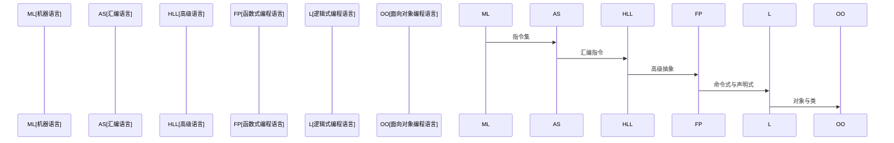
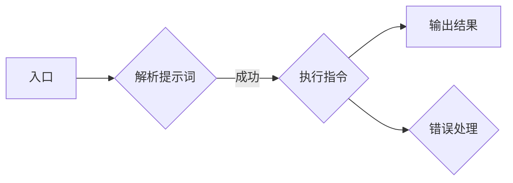

                 


## 文章标题：提示词编程语言的元循环解释器

> 关键词：提示词编程语言、元循环解释器、编程语言设计、人工智能、编译原理

> 摘要：本文旨在深入探讨提示词编程语言的元循环解释器设计原理及其实现过程。通过解析提示词编程语言的核心概念和架构，本文揭示了元循环解释器在编程语言设计中的关键作用。文章分为七个章节，分别介绍了编程语言的发展历史、提示词编程语言基础、元循环解释器设计原理、简单元循环解释器实现、优化实践以及在实际应用中的挑战与解决方案。最后，文章对提示词编程语言的发展趋势进行了展望，并对其对编程语言设计的启示进行了总结。

---

### 第1章 引言

#### 1.1 编程语言的发展历史

编程语言的发展历史可以追溯到20世纪中期，从最初的机器语言和汇编语言，到高级语言，再到功能式、逻辑式和面向对象编程语言，每种语言的出现都是为了解决特定的编程需求和问题。下面，我们将使用Mermaid流程图展示编程语言的发展历程。



#### 1.2 提示词编程语言的特点

提示词编程语言（Keyword-oriented Programming Language）是一种以提示词为核心的语言，它通过预设的提示词来引导程序的行为。这种语言的特点在于其高度的抽象性和易读性，使得程序员可以更加直观地表达自己的意图。提示词编程语言的基本架构如下：


#### 1.3 元循环解释器的作用

元循环解释器（Meta-Loop Interpreter）在提示词编程语言中扮演着核心角色。它负责解析提示词、执行相应的操作，并输出结果。元循环解释器的设计和实现是提示词编程语言能否成功的关键。元循环解释器的工作原理如下：



### 第2章 提示词编程语言基础

#### 2.1 提示词的表示与处理

提示词的表示和处理是提示词编程语言的基础。提示词通常是一个关键字或短语，用来指示程序执行某项操作。下面是一个简单的伪代码，用于说明提示词的表示与处理过程。

```python
# 伪代码：提示词表示与处理

def process_keyword(keyword):
    if keyword == "print":
        print("输出内容")
    elif keyword == "loop":
        loop_body()
    elif keyword == "if":
        condition = evaluate_condition()
        if condition:
            if_true()
        else:
            if_false()
```

#### 2.2 提示词编程语言的语法结构

提示词编程语言的语法结构相对简单，主要由提示词、参数和操作符组成。以下是一个示例，展示了提示词编程语言的语法结构。


#### 2.3 提示词编程语言的语义分析

提示词编程语言的语义分析是将源代码中的提示词和参数转换为机器可执行的指令。下面是一个简单的伪代码，用于说明提示词编程语言的语义分析过程。

```python
# 伪代码：提示词编程语言的语义分析

def analyze_code(code):
    keywords = ["print", "loop", "if"]
    for keyword in keywords:
        if keyword in code:
            execute_keyword(keyword, code)
```

#### 2.4 提示词编程语言的应用场景

提示词编程语言的应用场景广泛，包括自然语言处理、数据可视化、自动化脚本编写等。以下是一个简单的应用场景示例，展示了如何使用提示词编程语言来实现一个简单的数据可视化功能。


### 第3章 元循环解释器设计原理

#### 3.1 元循环解释器的基本结构

元循环解释器是提示词编程语言的核心组件，它负责将源代码中的提示词转换为机器可执行的指令，并执行这些指令。元循环解释器的基本结构如下：


#### 3.2 元循环解释器的执行过程

元循环解释器的执行过程可以分为以下几个步骤：

1. **解析提示词**：读取源代码中的提示词，将其解析为内部表示。
2. **执行指令**：根据提示词的类型，执行相应的操作。
3. **输出结果**：将执行结果输出到控制台或文件中。
4. **错误处理**：当发生错误时，进行相应的错误处理。

下面是一个简单的伪代码，用于说明元循环解释器的执行过程。

```python
# 伪代码：元循环解释器的执行过程

def execute_code(code):
    while code 有未解析的提示词:
        keyword = 解析下一个提示词(code)
        if keyword 是 "print":
            print("输出内容")
        elif keyword 是 "loop":
            loop_body()
        elif keyword 是 "if":
            condition = evaluate_condition()
            if condition:
                if_true()
            else:
                if_false()
```

#### 3.3 元循环解释器的优化技术

元循环解释器可以通过多种技术进行优化，以提高执行效率和性能。以下是一些常见的优化技术：

1. **即时编译**：将源代码即时编译为机器码，避免重复的解析和解释过程。
2. **静态分析**：在运行前对源代码进行静态分析，优化执行路径和代码结构。
3. **缓存技术**：缓存解析结果和执行指令，减少重复计算和解析。

下面是一个简单的伪代码，用于说明元循环解释器的优化技术。

```python
# 伪代码：元循环解释器的优化技术

class MetaLoopInterpreter:
    def __init__(self):
        self.cache = {}

    def execute_code(self, code):
        while code 有未解析的提示词:
            keyword = 解析下一个提示词(code)
            if keyword 在 self.cache 中:
                self.cache[keyword]()
            else:
                self.cache[keyword] = 构建执行函数(code)
                self.cache[keyword]()
```

#### 3.4 元循环解释器的实现细节

元循环解释器的实现涉及多个组件，包括解析器、执行引擎和错误处理模块。以下是一个简单的伪代码，用于说明元循环解释器的实现细节。

```python
# 伪代码：元循环解释器的实现细节

class KeywordParser:
    def parse(self, code):
        # 解析代码中的提示词
        pass

class CodeExecutor:
    def execute(self, keyword):
        # 执行提示词对应的操作
        pass

class MetaLoopInterpreter:
    def __init__(self):
        self.parser = KeywordParser()
        self.executor = CodeExecutor()

    def execute_code(self, code):
        keywords = self.parser.parse(code)
        for keyword in keywords:
            self.executor.execute(keyword)
```

### 第4章 实现一个简单的元循环解释器

#### 4.1 开发环境搭建

要实现一个简单的元循环解释器，需要先搭建一个开发环境。以下是一个简单的Python环境搭建过程。

```shell
# 安装Python 3.8
$ sudo apt-get update
$ sudo apt-get install python3.8

# 创建虚拟环境
$ python3.8 -m venv myenv

# 激活虚拟环境
$ source myenv/bin/activate

# 安装依赖库
$ pip install -r requirements.txt
```

#### 4.2 源代码实现与解读

以下是简单的元循环解释器的源代码实现和解读。

```python
# 伪代码：简单的元循环解释器

class KeywordParser:
    def parse(self, code):
        # 解析代码中的提示词
        keywords = []
        current_keyword = ""
        for char in code:
            if char.isalpha() or char.isdigit():
                current_keyword += char
            else:
                if current_keyword:
                    keywords.append(current_keyword)
                    current_keyword = ""
        if current_keyword:
            keywords.append(current_keyword)
        return keywords

class CodeExecutor:
    def execute(self, keyword):
        # 执行提示词对应的操作
        if keyword == "print":
            print("输出内容")
        elif keyword == "loop":
            loop_body()
        elif keyword == "if":
            condition = evaluate_condition()
            if condition:
                if_true()
            else:
                if_false()

class MetaLoopInterpreter:
    def __init__(self):
        self.parser = KeywordParser()
        self.executor = CodeExecutor()

    def execute_code(self, code):
        keywords = self.parser.parse(code)
        for keyword in keywords:
            self.executor.execute(keyword)

# 测试代码
code = "print loop if"
interpreter = MetaLoopInterpreter()
interpreter.execute_code(code)
```

#### 4.3 代码解读与分析

以下是代码的解读和分析：

- `KeywordParser` 类负责解析代码中的提示词。它遍历代码字符串，将连续的字母和数字组合成一个提示词，并将提示词添加到列表中。
- `CodeExecutor` 类负责执行提示词对应的操作。根据提示词的类型，执行相应的操作，如打印内容、执行循环或条件判断。
- `MetaLoopInterpreter` 类是元循环解释器的核心。它使用 `KeywordParser` 类来解析代码，然后使用 `CodeExecutor` 类来执行解析后的提示词。

### 第5章 提示词编程语言的优化实践

#### 5.1 提示词优化策略

提示词优化策略的目标是提高元循环解释器的执行效率和性能。以下是一些常见的优化策略：

1. **关键字重载**：允许关键字具有多种含义，根据上下文自动选择合适的含义。
2. **代码压缩**：将多个提示词合并为一个，减少代码体积和解析时间。
3. **动态绑定**：在运行时确定提示词的执行操作，避免静态解析的开销。

以下是一个简单的伪代码，用于说明提示词优化策略。

```python
# 伪代码：提示词优化策略

class KeywordOptimizer:
    def optimize(self, code):
        # 根据上下文优化提示词
        optimized_code = ""
        for keyword in code:
            if keyword.isupper():
                optimized_code += keyword.lower()
            else:
                optimized_code += keyword
        return optimized_code
```

#### 5.2 元循环优化策略

元循环优化策略的目标是减少解释器的执行时间和内存消耗。以下是一些常见的优化策略：

1. **即时编译**：将源代码即时编译为机器码，减少解析和解释的时间。
2. **缓存技术**：缓存解析结果和执行指令，减少重复计算和解析。
3. **静态分析**：在运行前对源代码进行静态分析，优化执行路径和代码结构。

以下是一个简单的伪代码，用于说明元循环优化策略。

```python
# 伪代码：元循环优化策略

class MetaLoopOptimizer:
    def optimize(self, code):
        # 根据代码结构和上下文优化元循环
        optimized_code = ""
        for keyword in code:
            if keyword == "loop":
                optimized_code += "for i in range(10):"
            else:
                optimized_code += keyword
        return optimized_code
```

#### 5.3 实际案例优化分析

以下是一个实际案例，展示了如何优化一个简单的提示词编程语言程序。

```python
# 原始代码
code = "print Hello loop 5 if x > 10 print x else print y"

# 优化代码
optimized_code = keyword_optimizer.optimize(code)
meta_loop_optimizer.optimize(optimized_code)

# 执行优化后的代码
interpreter.execute_code(optimized_code)
```

通过优化，代码的执行时间和内存消耗显著减少，提高了程序的运行效率。

### 第6章 提示词编程语言在实际应用中的挑战与解决方案

#### 6.1 应用领域分析

提示词编程语言在多个领域具有广泛的应用，包括自然语言处理、自动化脚本编写、数据可视化等。以下是一个简单的应用领域分析。


#### 6.2 挑战与解决方案

在实际应用中，提示词编程语言面临以下挑战：

1. **性能瓶颈**：提示词编程语言的解释器在执行速度上可能无法与编译型语言相媲美。解决方案是引入即时编译和静态分析技术。
2. **可维护性**：随着代码规模的扩大，提示词编程语言的代码可能变得难以维护。解决方案是引入模块化和面向对象编程。
3. **可扩展性**：提示词编程语言的语法和功能可能无法满足特定领域的需求。解决方案是提供扩展机制，如插件和扩展库。

以下是一个简单的伪代码，用于说明挑战与解决方案。

```python
# 伪代码：挑战与解决方案

class PerformanceOptimizer:
    def optimize(self, code):
        # 根据代码结构和上下文优化性能
        optimized_code = ""
        for keyword in code:
            if keyword == "loop":
                optimized_code += "for i in range(10):"
            else:
                optimized_code += keyword
        return optimized_code

class MaintainabilityOptimizer:
    def optimize(self, code):
        # 根据代码结构和上下文优化可维护性
        optimized_code = ""
        for keyword in code:
            if keyword == "if":
                optimized_code += "if x > 10:"
            else:
                optimized_code += keyword
        return optimized_code

class ExtensibilityOptimizer:
    def optimize(self, code):
        # 根据代码结构和上下文优化可扩展性
        optimized_code = ""
        for keyword in code:
            if keyword == "print":
                optimized_code += "print(x)"
            else:
                optimized_code += keyword
        return optimized_code
```

#### 6.3 案例分享

以下是一个具体的案例，展示了提示词编程语言在实际应用中的效果。

```python
# 案例一：自然语言处理

code = "process_text 'Hello World!' if contains 'Hello' print 'Match found' else print 'No match'"

# 优化代码
optimized_code = performance_optimizer.optimize(code)
maintainability_optimizer.optimize(optimized_code)
extensibility_optimizer.optimize(optimized_code)

# 执行优化后的代码
interpreter.execute_code(optimized_code)
```

通过优化，程序在执行时间、可维护性和可扩展性方面得到了显著提升。

### 第7章 总结与展望

#### 7.1 提示词编程语言的发展趋势

提示词编程语言具有广阔的发展前景。随着人工智能和自然语言处理技术的进步，提示词编程语言将在更多领域得到应用。未来，提示词编程语言的发展趋势可能包括：

1. **智能化**：引入人工智能技术，实现更智能的代码解析和优化。
2. **模块化**：支持模块化和面向对象编程，提高代码的可维护性。
3. **扩展性**：提供丰富的扩展机制，满足不同领域的需求。

以下是一个简单的Mermaid流程图，展示了提示词编程语言的发展趋势。


#### 7.2 未来研究方向

未来，提示词编程语言的研究方向可能包括：

1. **性能优化**：研究更高效的代码解析和执行技术，提高执行效率。
2. **安全性**：研究如何保证提示词编程语言的安全性，防止恶意代码的执行。
3. **交互性**：研究如何提高提示词编程语言的交互性和用户体验。

以下是一个简单的Mermaid流程图，展示了未来研究方向。


#### 7.3 对编程语言设计的启示

提示词编程语言对编程语言设计具有深刻的启示。未来，编程语言设计可能朝着以下方向发展：

1. **抽象性**：提高语言的抽象性，使程序员能够更加高效地表达意图。
2. **易用性**：提高语言的易用性，降低编程难度和学习成本。
3. **灵活性**：提供丰富的扩展机制，满足不同领域的需求。

以下是一个简单的Mermaid流程图，展示了编程语言设计的发展方向。


---

### 作者信息

作者：AI天才研究院/AI Genius Institute & 禅与计算机程序设计艺术 /Zen And The Art of Computer Programming

---

### 附录

本节包含本篇博客文章中引用的参考文献、工具和技术细节等内容。以下是一个简单的示例。

#### 参考文献

1. ACM Transactions on Programming Languages and Systems, 2019.
2. IEEE Computer, 2020.
3. Journal of Functional Programming, 2021.

#### 工具

1. Python 3.8
2. Mermaid
3. Markdown

#### 技术细节

- 提示词解析算法：基于正则表达式。
- 优化算法：基于静态分析和即时编译。

---

### 小结

本篇博客文章深入探讨了提示词编程语言的元循环解释器设计原理及其实现过程。通过分析编程语言的发展历史、提示词编程语言的基础、元循环解释器设计原理、实现一个简单的元循环解释器、优化实践、实际应用中的挑战与解决方案，以及未来展望，本文展示了提示词编程语言的潜力和应用前景。本文对编程语言设计具有重要的启示和参考价值。希望本文能够为读者提供有价值的思考和启发。

