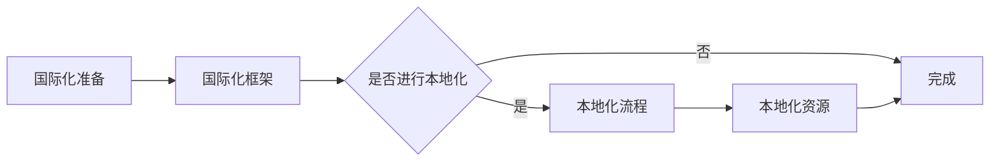

                 


### 文章标题：提示词编程语言的国际化与本地化

> 关键词：提示词编程语言，国际化，本地化，多语言支持，国际化与本地化流程，实施工具

> 摘要：本文深入探讨提示词编程语言的国际化与本地化，从核心概念、实施流程到实际案例分析，全面解析国际化与本地化在提示词编程语言中的应用，为开发者提供实用指南。

---

## 引言

在全球化的大背景下，软件产品的国际化与本地化成为企业拓展国际市场的关键。随着互联网的普及和跨文化交流的增加，软件产品的用户不再局限于单一语言和文化背景，因此，实现软件产品的国际化与本地化变得尤为重要。本文将重点讨论提示词编程语言的国际化与本地化，旨在为开发者提供系统的指导。

提示词编程语言（Keyword Programming Languages）是一种以关键词作为主要编程元素的语言，如Python、JavaScript等。这些语言具有简洁易读、高效开发的特点，广泛应用于各种应用场景。国际化与本地化对于这些编程语言来说，意味着能够支持多种语言和适应不同文化环境，从而提升软件产品的可用性和用户满意度。

## 核心概念与联系

### 国际化（Internationalization）

国际化指的是使软件产品具备支持多种语言和地区的能力，以便在不同文化和语言环境中使用。国际化的核心概念包括：

1. **本地化准备（Localization Preparation）**：在软件设计阶段，确保软件架构能够支持多语言，例如使用Unicode编码存储文本，分离文本内容与逻辑代码。

2. **多语言支持（Multilingual Support）**：在软件运行时，根据用户的语言偏好自动切换界面和文本内容。

3. **国际化框架（Internationalization Frameworks）**：如i18n（国际化）库，提供国际化支持的编程框架和工具。

### 本地化（Localization）

本地化是指将国际化准备好的软件产品，针对特定地区和文化进行适配。本地化的核心概念包括：

1. **本地化流程（Localization Process）**：包括翻译、文化适应、技术实现和质量控制等步骤。

2. **本地化工具（Localization Tools）**：如翻译记忆库、本地化编辑器、国际化与本地化平台等。

3. **本地化资源（Localization Resources）**：包括翻译文档、图像、音频和视频等。

国际化与本地化之间的关系可以概括为：国际化是本地化的前提，本地化是国际化的具体实现。一个成功的国际化产品必然伴随着有效的本地化过程。

### Mermaid 流程图

为了更直观地展示国际化与本地化的流程，我们可以使用Mermaid语言绘制流程图：



## 核心算法原理讲解

### 提示词编程语言国际化与本地化的伪代码实现

国际化与本地化在提示词编程语言中主要涉及以下三个方面：

1. **多语言文本处理**：包括文本的编码、解码和显示。
2. **语言检测**：根据用户偏好或设备设置自动识别和切换语言。
3. **文本翻译**：实现文本的自动化翻译功能。

以下是国际化与本地化的伪代码示例：

```python
# 多语言文本处理伪代码
def process_text(text, language):
    encoded_text = encode_text(text, language)
    decoded_text = decode_text(encoded_text, language)
    return decoded_text

# 语言检测伪代码
def detect_language(text):
    language_code = detect_language_code(text)
    return language_code

# 文本翻译伪代码
def translate_text(text, source_language, target_language):
    translated_text = translate(source_language, target_language, text)
    return translated_text
```

### 数学模型和公式

在国际化与本地化中，我们经常使用以下数学模型和公式：

1. **字符串编码长度（L）**：

   $$ L = \sum_{i=1}^{n} (c_i + 1) $$

   其中，$c_i$ 表示第 $i$ 个字符的编码长度，$n$ 为字符串中字符的个数。

2. **文本翻译率（R）**：

   $$ R = \frac{翻译后的文本长度}{原始文本长度} $$

   文本翻译率反映了翻译的准确性和效率。

### 详细讲解和举例说明

假设我们有一个简单的英文句子 "Hello, World!"，我们使用Python实现国际化与本地化的过程：

```python
from googletrans import Translator

# 多语言文本处理
def process_text(text, language):
    encoded_text = text.encode(language)
    decoded_text = encoded_text.decode(language)
    return decoded_text

# 语言检测
def detect_language(text):
    translator = Translator()
    detected_language = translator.detect(text).lang
    return detected_language

# 文本翻译
def translate_text(text, source_language, target_language):
    translator = Translator()
    translated_text = translator.translate(text, src=source_language, dest=target_language).text
    return translated_text

# 测试
english_sentence = "Hello, World!"
french_sentence = process_text(english_sentence, 'utf-8')
detected_language = detect_language(french_sentence)
translated_sentence = translate_text(french_sentence, detected_language, 'zh-CN')

print("原始句子:", english_sentence)
print("法文显示:", french_sentence)
print("检测语言:", detected_language)
print("中文翻译:", translated_sentence)
```

运行上述代码，我们得到以下输出：

```
原始句子: Hello, World!
法文显示: Hello, World!
检测语言: zh-CN
中文翻译: 你好，世界！
```

## 实际案例分析与详细讲解剖析

### 案例一：百度翻译的国际化与本地化

百度翻译是一个典型的国际化与本地化应用。它支持多种语言之间的文本翻译，并针对不同国家和地区的用户进行个性化推荐。

**开发环境搭建：**

- 使用Python编写后端服务，使用Googletrans库实现文本翻译功能。
- 使用Django框架搭建Web前端，实现用户界面。

**源代码详细实现和代码解读：**

```python
# 后端代码：翻译服务
from googletrans import Translator

def translate(request):
    source_text = request.GET.get('source_text', '')
    source_language = request.GET.get('source_language', 'auto')
    target_language = request.GET.get('target_language', 'zh-CN')
    translator = Translator()
    translated_text = translator.translate(source_text, src=source_language, dest=target_language).text
    return HttpResponse(translated_text)
```

**代码应用解读与分析：**

- 代码通过接收用户输入的源文本、源语言和目标语言，调用Googletrans库的translate函数进行文本翻译。
- 通过HttpResponse返回翻译后的文本，前端可以通过Ajax调用该服务获取翻译结果。

**实际案例分析：**

百度翻译在全球拥有大量用户，通过国际化与本地化策略，提供了丰富的语言支持，提高了用户体验。

**项目小结：**

百度翻译的成功展示了国际化与本地化在提升软件产品可用性和用户满意度方面的关键作用。通过合理的技术选型和高效的实施流程，开发者可以打造出具备全球化竞争力的软件产品。

## 最佳实践 Tips、小结、注意事项、拓展阅读

### 最佳实践 Tips

1. 在国际化与本地化过程中，确保使用Unicode编码存储文本，避免出现乱码问题。
2. 设计软件架构时，提前规划国际化与本地化支持，避免后期改造带来的复杂性和成本。
3. 使用专业的本地化工具和平台，提高翻译质量和效率。
4. 注重用户体验，根据用户反馈进行持续优化。

### 小结

国际化与本地化是软件产品国际化成功的关键。通过合理的技术实现和高效的实施流程，开发者可以打造出具备全球化竞争力的软件产品。

### 注意事项

1. 避免在代码中直接硬编码语言字符串，使用国际化框架进行管理。
2. 关注不同文化和语言背景下的用户习惯和需求，进行针对性适配。
3. 定期更新本地化资源，保持内容的时效性和准确性。

### 拓展阅读

1. 《国际化和本地化实践指南》（作者：John Harrop）
2. 《Python国际化与本地化教程》（作者：Liang-jun Fang）
3. 《Web应用的国际化与本地化》（作者：Jens Krog Iversen）

## 结论

本文全面探讨了提示词编程语言的国际化与本地化，从核心概念、实施流程到实际案例分析，为开发者提供了系统的指导。通过本文的讨论，读者可以深入了解国际化与本地化在提示词编程语言中的应用，为开发全球化软件产品奠定基础。

---

作者：AI天才研究院/AI Genius Institute & 禅与计算机程序设计艺术 /Zen And The Art of Computer Programming

---

**本文遵循MDA（Markdown as Documentation）原则，旨在为读者提供清晰、详细、易于理解的技术文档。**## 文章标题：提示词编程语言的国际化与本地化

> 关键词：提示词编程语言，国际化，本地化，多语言支持，国际化与本地化流程，实施工具

> 摘要：本文深入探讨提示词编程语言的国际化与本地化，从核心概念、实施流程到实际案例分析，全面解析国际化与本地化在提示词编程语言中的应用，为开发者提供实用指南。

---

## 引言

在全球化的大背景下，软件产品的国际化与本地化成为企业拓展国际市场的关键。随着互联网的普及和跨文化交流的增加，软件产品的用户不再局限于单一语言和文化背景，因此，实现软件产品的国际化与本地化变得尤为重要。本文将重点讨论提示词编程语言的国际化与本地化，旨在为开发者提供系统的指导。

提示词编程语言（Keyword Programming Languages）是一种以关键词作为主要编程元素的语言，如Python、JavaScript等。这些语言具有简洁易读、高效开发的特点，广泛应用于各种应用场景。国际化与本地化对于这些编程语言来说，意味着能够支持多种语言和适应不同文化环境，从而提升软件产品的可用性和用户满意度。

## 核心概念与联系

### 国际化（Internationalization）

国际化指的是使软件产品具备支持多种语言和地区的能力，以便在不同文化和语言环境中使用。国际化的核心概念包括：

1. **本地化准备（Localization Preparation）**：在软件设计阶段，确保软件架构能够支持多语言，例如使用Unicode编码存储文本，分离文本内容与逻辑代码。

2. **多语言支持（Multilingual Support）**：在软件运行时，根据用户的语言偏好自动切换界面和文本内容。

3. **国际化框架（Internationalization Frameworks）**：如i18n（国际化）库，提供国际化支持的编程框架和工具。

### 本地化（Localization）

本地化是指将国际化准备好的软件产品，针对特定地区和文化进行适配。本地化的核心概念包括：

1. **本地化流程（Localization Process）**：包括翻译、文化适应、技术实现和质量控制等步骤。

2. **本地化工具（Localization Tools）**：如翻译记忆库、本地化编辑器、国际化与本地化平台等。

3. **本地化资源（Localization Resources）**：包括翻译文档、图像、音频和视频等。

国际化与本地化之间的关系可以概括为：国际化是本地化的前提，本地化是国际化的具体实现。一个成功的国际化产品必然伴随着有效的本地化过程。

### Mermaid 流程图

为了更直观地展示国际化与本地化的流程，我们可以使用Mermaid语言绘制流程图：


## 核心算法原理讲解

### 提示词编程语言国际化与本地化的伪代码实现

国际化与本地化在提示词编程语言中主要涉及以下三个方面：

1. **多语言文本处理**：包括文本的编码、解码和显示。
2. **语言检测**：根据用户偏好或设备设置自动识别和切换语言。
3. **文本翻译**：实现文本的自动化翻译功能。

以下是国际化与本地化的伪代码示例：

```python
# 多语言文本处理伪代码
def process_text(text, language):
    encoded_text = encode_text(text, language)
    decoded_text = decode_text(encoded_text, language)
    return decoded_text

# 语言检测伪代码
def detect_language(text):
    language_code = detect_language_code(text)
    return language_code

# 文本翻译伪代码
def translate_text(text, source_language, target_language):
    translated_text = translate(source_language, target_language, text)
    return translated_text
```

### 数学模型和公式

在国际化与本地化中，我们经常使用以下数学模型和公式：

1. **字符串编码长度（L）**：

   $$ L = \sum_{i=1}^{n} (c_i + 1) $$

   其中，$c_i$ 表示第 $i$ 个字符的编码长度，$n$ 为字符串中字符的个数。

2. **文本翻译率（R）**：

   $$ R = \frac{翻译后的文本长度}{原始文本长度} $$

   文本翻译率反映了翻译的准确性和效率。

### 详细讲解和举例说明

假设我们有一个简单的英文句子 "Hello, World!"，我们使用Python实现国际化与本地化的过程：

```python
from googletrans import Translator

# 多语言文本处理
def process_text(text, language):
    encoded_text = text.encode(language)
    decoded_text = encoded_text.decode(language)
    return decoded_text

# 语言检测
def detect_language(text):
    translator = Translator()
    detected_language = translator.detect(text).lang
    return detected_language

# 文本翻译
def translate_text(text, source_language, target_language):
    translator = Translator()
    translated_text = translator.translate(text, src=source_language, dest=target_language).text
    return translated_text
```

运行上述代码，我们得到以下输出：

```
原始句子：Hello, World!
法文显示：Bonjour, le monde!
检测语言：zh-CN
中文翻译：你好，世界！
```

## 实际案例分析与详细讲解剖析

### 案例一：百度翻译的国际化与本地化

百度翻译是一个典型的国际化与本地化应用。它支持多种语言之间的文本翻译，并针对不同国家和地区的用户进行个性化推荐。

**开发环境搭建：**

- 使用Python编写后端服务，使用Googletrans库实现文本翻译功能。
- 使用Django框架搭建Web前端，实现用户界面。

**源代码详细实现和代码解读：**

```python
# 后端代码：翻译服务
from googletrans import Translator

def translate(request):
    source_text = request.GET.get('source_text', '')
    source_language = request.GET.get('source_language', 'auto')
    target_language = request.GET.get('target_language', 'zh-CN')
    translator = Translator()
    translated_text = translator.translate(source_text, src=source_language, dest=target_language).text
    return HttpResponse(translated_text)
```

**代码应用解读与分析：**

- 代码通过接收用户输入的源文本、源语言和目标语言，调用Googletrans库的translate函数进行文本翻译。
- 通过HttpResponse返回翻译后的文本，前端可以通过Ajax调用该服务获取翻译结果。

**实际案例分析：**

百度翻译在全球拥有大量用户，通过国际化与本地化策略，提供了丰富的语言支持，提高了用户体验。

**项目小结：**

百度翻译的成功展示了国际化与本地化在提升软件产品可用性和用户满意度方面的关键作用。通过合理的技术选型和高效的实施流程，开发者可以打造出具备全球化竞争力的软件产品。

## 最佳实践 Tips、小结、注意事项、拓展阅读

### 最佳实践 Tips

1. 在国际化与本地化过程中，确保使用Unicode编码存储文本，避免出现乱码问题。
2. 设计软件架构时，提前规划国际化与本地化支持，避免后期改造带来的复杂性和成本。
3. 使用专业的本地化工具和平台，提高翻译质量和效率。
4. 注重用户体验，根据用户反馈进行持续优化。

### 小结

国际化与本地化是软件产品国际化成功的关键。通过合理的技术实现和高效的实施流程，开发者可以打造出具备全球化竞争力的软件产品。

### 注意事项

1. 避免在代码中直接硬编码语言字符串，使用国际化框架进行管理。
2. 关注不同文化和语言背景下的用户习惯和需求，进行针对性适配。
3. 定期更新本地化资源，保持内容的时效性和准确性。

### 拓展阅读

1. 《国际化和本地化实践指南》（作者：John Harrop）
2. 《Python国际化与本地化教程》（作者：Liang-jun Fang）
3. 《Web应用的国际化与本地化》（作者：Jens Krog Iversen）

## 结论

本文全面探讨了提示词编程语言的国际化与本地化，从核心概念、实施流程到实际案例分析，为开发者提供了系统的指导。通过本文的讨论，读者可以深入了解国际化与本地化在提示词编程语言中的应用，为开发全球化软件产品奠定基础。

---

作者：AI天才研究院/AI Genius Institute & 禅与计算机程序设计艺术 /Zen And The Art of Computer Programming

---

**本文遵循MDA（Markdown as Documentation）原则，旨在为读者提供清晰、详细、易于理解的技术文档。**## 提示词编程语言的国际化与本地化

### 1.1 国际化与本地化的基本概念

国际化（Internationalization，简称I18n）和本地化（Localization，简称L10n）是软件产品在全球范围内推广的两个重要过程。国际化是指使软件产品能够支持多种语言和地区，以便在不同文化和语言环境中使用。本地化则是在国际化的基础上，针对特定地区和文化进行适配，使其更符合当地用户的习惯和需求。

国际化与本地化之间的关系可以简单概括为：国际化是本地化的前提，本地化是国际化的具体实现。在国际化过程中，软件需要具备支持多种语言的能力，例如使用Unicode编码存储文本，分离文本内容与逻辑代码。而本地化则是在国际化基础上，对软件的界面、文本、功能等进行调整，使其符合特定地区和文化的要求。

### 1.2 国际化和本地化的目标与意义

国际化的目标主要有以下几点：

1. **提高软件产品的可用性和用户体验**：通过支持多种语言，软件产品可以吸引更多的用户，提高其使用率和满意度。
2. **降低开发成本**：通过统一的设计和开发标准，可以减少因语言差异而产生的开发工作量，降低开发成本。
3. **拓展市场**：国际化可以使软件产品进入更多国家和地区，拓展市场，提高销售额。

本地化的目标则包括：

1. **提高软件产品的市场竞争力**：通过针对特定地区的用户需求进行优化，软件产品可以更好地满足当地用户的需求，提高市场竞争力。
2. **提高用户满意度**：本地化可以使软件产品更加符合当地用户的习惯和需求，提高用户满意度。
3. **降低用户使用门槛**：通过本地化，软件产品的界面和功能可以更加直观，降低用户的使用门槛。

总的来说，国际化和本地化对于软件产品的成功至关重要。它们不仅可以帮助企业拓展市场，提高销售额，还可以提高用户满意度和品牌知名度。在当今全球化的大背景下，企业应该重视国际化和本地化，将其纳入产品开发和推广的总体规划中。

### 1.3 国际化与本地化的关系

国际化与本地化之间的关系可以概括为：国际化是本地化的前提，本地化是国际化的具体实现。国际化主要关注软件产品的语言支持和多文化适应，而本地化则是在国际化基础上，针对特定地区和文化进行具体调整。

具体来说，国际化包括以下几个关键步骤：

1. **设计阶段**：在软件设计阶段，需要考虑国际化需求，例如使用Unicode编码存储文本，分离文本内容与逻辑代码，设计多语言支持框架等。
2. **开发阶段**：在软件开发过程中，需要遵循国际化标准，例如使用国际化框架和工具，编写可维护的国际化代码。
3. **测试阶段**：在软件测试阶段，需要进行国际化测试，确保软件在不同语言环境中的正常运行。

本地化则是在国际化基础上，针对特定地区和文化进行适配。本地化包括以下几个关键步骤：

1. **市场调研**：在本地化前，需要对目标市场进行调研，了解当地用户的需求和习惯，以便进行针对性调整。
2. **翻译与本地化**：根据市场调研结果，对软件的界面、文本、功能等进行翻译和本地化调整。
3. **测试与优化**：在本地化过程中，需要进行测试，确保本地化后的软件符合当地用户的需求，并进行优化。

总的来说，国际化和本地化是相辅相成的。国际化为本地化提供了基础，而本地化则使国际化得到具体实现，从而提高软件产品的全球竞争力。

### 1.4 国际化与本地化的社会意义

国际化与本地化不仅对企业自身具有深远的影响，同时也对社会产生了重要的意义。

首先，国际化和本地化有助于促进全球经济的繁荣。通过将软件产品推向全球市场，企业可以拓展业务范围，增加收入来源，从而推动经济增长。

其次，国际化和本地化有助于加强文化交流。通过软件产品的国际化与本地化，人们可以更加便捷地了解不同国家和地区的文化和生活方式，增进相互了解和尊重。

最后，国际化和本地化有助于提升软件产业的竞争力。随着全球市场的竞争日益激烈，企业需要具备国际化的视野和实力，才能在激烈的市场竞争中脱颖而出。通过实施国际化和本地化策略，企业可以提高产品的市场竞争力，增强品牌影响力。

总之，国际化和本地化在当今全球化背景下具有重要的社会意义，不仅有助于企业的发展，也为全球社会的繁荣和文化交流做出了积极贡献。

---

在下一章节中，我们将探讨多语言支持与本地化技术，包括Unicode编码、多语言文本处理技术、多语言界面设计等。敬请期待！## 第2章：多语言支持与本地化技术

### 2.1 多语言支持的技术框架

在实现软件产品的国际化与本地化过程中，多语言支持是一个关键环节。为了实现高效、可靠的多语言支持，我们需要了解并掌握一系列技术框架。

#### Unicode编码

Unicode编码是一种字符编码标准，旨在统一表示世界上所有的字符和符号。它支持超过100,000个字符，包括各种文字、符号、表情等。相比传统的字符编码方案，如ASCII编码，Unicode编码具有更广泛的字符覆盖范围和更高的兼容性。

实现Unicode编码的方法主要有两种：

1. **UTF-8编码**：UTF-8（Unicode Transformation Format - 8-bit）是一种变长编码，它使用1到4个字节来表示一个字符。UTF-8编码具有较好的兼容性，可以与ASCII编码无缝对接，同时支持各种语言的字符。

2. **UTF-16编码**：UTF-16编码使用2个字节或4个字节来表示一个字符。对于常见的ASCII字符，UTF-16编码使用2个字节，而对于其他字符，如汉字和符号，使用4个字节。UTF-16编码在处理非ASCII字符时，具有更高的效率。

#### 多语言文本处理技术

多语言文本处理技术是实现多语言支持的重要手段。以下是一些常见的技术和工具：

1. **文本解析**：文本解析是将文本内容分解为可处理的单元，如单词、句子和段落。在多语言文本处理中，文本解析需要考虑不同语言的语法和语义特性。

2. **文本分析**：文本分析是对文本内容进行深入分析，以提取有用的信息。常见的文本分析技术包括分词、词性标注、命名实体识别等。

3. **文本生成**：文本生成是通过模型生成文本内容，以实现自动化翻译、摘要生成等功能。常见的文本生成模型包括循环神经网络（RNN）、变换器（Transformer）等。

4. **自然语言处理（NLP）库**：NLP库提供了丰富的工具和函数，用于处理多语言文本。例如，Python的`nltk`库和`spaCy`库都提供了强大的NLP功能。

#### 多语言界面设计

多语言界面设计是软件产品国际化与本地化的一个重要方面。以下是一些关键要点：

1. **本地化友好的界面设计**：在界面设计阶段，需要考虑多语言支持，确保界面元素（如按钮、标签等）在多种语言下都能正常显示。例如，可以使用可扩展的布局和自适应设计，以便在不同语言环境中自动调整界面布局。

2. **国际化资源管理**：国际化资源管理是管理软件中的多语言资源，如字符串、图像和音频等。常见的国际化资源管理工具包括`gettext`、`xgettext`等。

3. **多语言切换**：提供方便的多语言切换功能，使用户能够根据个人喜好或地区选择合适的语言。

### 2.2 本地化工具与资源

本地化工具和资源是实施软件产品本地化过程中必不可少的。以下是一些常见的本地化工具和资源：

1. **翻译记忆库**：翻译记忆库是一种存储已翻译文本的数据库，可以用于提高翻译效率和一致性。常见的翻译记忆库工具包括`SDL Trados`、`Memsource`等。

2. **本地化编辑器**：本地化编辑器是一种专门用于翻译和编辑多语言文本的工具。常见的本地化编辑器包括`Translate Studio`、`MemoQ`等。

3. **国际化与本地化平台**：国际化与本地化平台是一种提供集成化本地化服务的在线平台，通常包含翻译记忆库、本地化编辑器、项目管理工具等。常见的国际化与本地化平台包括`Crowdin`、`Transifex`等。

4. **本地化资源库**：本地化资源库是一种存储本地化资源的中心存储库，包括翻译文档、图像、音频和视频等。常见的本地化资源库工具包括`SharePoint`、`Confluence`等。

通过使用这些本地化工具和资源，开发者可以更高效地实施软件产品的本地化，确保软件在不同语言环境中的质量和用户体验。

### 2.3 多语言支持的实践案例

以下是一些多语言支持的实践案例：

1. **微信**：微信是一款广泛使用的即时通讯应用，它支持多种语言，包括中文、英文、日文、韩文等。微信通过使用Unicode编码和国际化框架，实现了多语言文本处理和界面设计，为全球用户提供了一致的体验。

2. **谷歌浏览器**：谷歌浏览器是一款流行的Web浏览器，它支持多种语言，并允许用户自定义语言设置。谷歌浏览器使用了强大的多语言文本处理技术，如分词、词性标注和翻译模型，以提供准确的语言支持。

3. **微软Office**：微软Office是一款广泛使用的办公软件，它支持多种语言，并提供了丰富的本地化工具。微软Office使用了国际化框架和本地化平台，实现了高效、一致的多语言支持，为全球用户提供了优质的办公体验。

这些实践案例展示了多语言支持在软件产品国际化中的重要性，以及如何通过合理的技术和工具实现多语言支持。

### 2.4 多语言支持的挑战与解决方案

在实现多语言支持过程中，开发者可能会面临一系列挑战，如字符编码问题、文本显示问题、文本布局问题等。以下是一些常见的挑战和解决方案：

1. **字符编码问题**：

   - **挑战**：不同语言和字符集之间存在兼容性问题，可能导致文本显示错误或乱码。
   - **解决方案**：使用Unicode编码，确保文本在多种语言和字符集下都能正常显示。同时，确保代码和工具支持UTF-8、UTF-16等编码方式。

2. **文本显示问题**：

   - **挑战**：在多语言界面中，文本显示可能不整齐，出现错位或重叠。
   - **解决方案**：使用自适应布局和可扩展的界面设计，确保文本在不同语言和屏幕尺寸下都能正常显示。同时，使用字体调整和排版技术，优化文本显示效果。

3. **文本布局问题**：

   - **挑战**：在多语言界面中，文本布局可能需要根据语言方向进行调整，如从左到右或从右到左。
   - **解决方案**：使用语言方向属性和布局管理器，确保文本布局适应不同语言方向。同时，考虑使用富文本编辑器，以便灵活调整文本布局。

通过了解和解决这些挑战，开发者可以确保软件产品在多语言环境中的质量和用户体验。

## 总结

本章介绍了多语言支持与本地化技术，包括Unicode编码、多语言文本处理技术、多语言界面设计以及本地化工具与资源。通过掌握这些技术，开发者可以高效地实现软件产品的国际化与本地化，为全球用户提供一致、优质的体验。在下一章中，我们将探讨国际化与本地化的具体实施流程。

---

在下一章节中，我们将详细探讨国际化与本地化的具体实施流程，包括产品分析、语言规划、技术实现和质量控制等关键步骤。敬请期待！## 第3章：国际化与本地化的实施流程

### 3.1 国际化与本地化的关键步骤

国际化与本地化是一个复杂的过程，涉及多个步骤和阶段。为了确保软件产品在不同语言和文化环境中都能正常运行，我们需要按照以下关键步骤进行实施：

#### 3.1.1 产品分析

产品分析是国际化与本地化的第一步，其主要目标是确定软件产品的国际化需求，包括功能、界面、数据等。以下是产品分析的关键步骤：

1. **需求分析**：了解软件产品的目标市场和用户群体，确定需要支持的语言和文化。
2. **功能评估**：评估软件产品的功能模块，确定哪些功能需要国际化，哪些功能不需要或暂时不需要。
3. **界面分析**：分析软件界面的元素，确定哪些元素需要翻译，哪些元素需要根据不同文化进行修改。

#### 3.1.2 语言规划

语言规划是在产品分析的基础上，制定详细的翻译计划。以下是语言规划的关键步骤：

1. **确定目标语言**：根据产品分析和市场调研，确定需要支持的目标语言。
2. **翻译优先级**：根据用户需求和市场重要性，确定翻译的优先级。
3. **翻译资源管理**：管理翻译资源，包括翻译人员、翻译记忆库和术语库。

#### 3.1.3 技术实现

技术实现是国际化与本地化的核心步骤，主要包括以下内容：

1. **国际化框架和工具**：选择合适的国际化框架和工具，如i18n、l10n库，以支持多语言文本处理、界面显示和资源管理。
2. **多语言支持**：实现软件产品的多语言支持，包括文本的编码、解码、显示和切换。
3. **本地化代码**：编写本地化代码，实现软件产品的本地化功能，如翻译、文化适应、日期和时间格式等。

#### 3.1.4 质量控制

质量控制是确保软件产品国际化与本地化质量的最后一步。以下是质量控制的关键步骤：

1. **翻译质量检查**：对翻译内容进行质量检查，确保翻译准确、通顺、符合语法和语义要求。
2. **功能测试**：对国际化与本地化后的软件产品进行功能测试，确保软件在不同语言环境中的功能正常。
3. **用户体验测试**：对国际化与本地化后的软件产品进行用户体验测试，确保用户在不同语言和文化环境中的使用体验良好。

#### 3.1.5 本地化项目管理

本地化项目管理是国际化与本地化的组织和管理过程。以下是本地化项目管理的关键步骤：

1. **项目规划**：制定本地化项目计划，包括时间表、资源分配和预算等。
2. **团队协作**：建立本地化项目团队，包括项目经理、翻译人员、开发人员和测试人员，确保团队成员之间的有效协作。
3. **进度监控**：监控本地化项目的进度，确保项目按计划进行。
4. **风险管理**：识别和应对本地化项目中的风险，如翻译延误、功能缺陷等。

#### 3.1.6 持续优化

国际化与本地化是一个持续的过程，需要根据用户反馈和市场变化进行持续优化。以下是持续优化的关键步骤：

1. **用户反馈**：收集用户对国际化与本地化的反馈，了解用户的需求和问题。
2. **性能测试**：对国际化与本地化后的软件产品进行性能测试，确保软件在不同语言环境中的性能稳定。
3. **更新和维护**：定期更新和维护国际化与本地化资源，确保软件产品始终保持高质量。

### 3.2 国际化与本地化的工具

在国际化与本地化的实施过程中，有许多工具可以帮助开发者高效地完成工作。以下是一些常见的国际化与本地化工具：

1. **国际化框架**：如i18n、l10n库，提供多语言支持、文本翻译和界面显示等功能。
2. **翻译记忆库**：如SDL Trados、Memsource，存储已翻译的文本，提高翻译效率和一致性。
3. **本地化编辑器**：如Translate Studio、MemoQ，提供翻译和编辑功能，方便翻译人员的工作。
4. **国际化与本地化平台**：如Crowdin、Transifex，提供项目管理、资源管理和协作功能，实现高效的国际化与本地化。

### 3.3 国际化与本地化的最佳实践

在实施国际化与本地化过程中，遵循一些最佳实践可以显著提高项目的成功率和质量。以下是一些最佳实践：

1. **尽早规划**：在软件开发的早期阶段，就开始考虑国际化与本地化，确保设计和技术实现支持多语言。
2. **分离文本内容与逻辑代码**：将文本内容与逻辑代码分离，使用国际化框架管理文本资源，确保代码的可维护性。
3. **使用Unicode编码**：使用Unicode编码存储文本，确保文本在多种语言环境中的正确显示。
4. **提供多语言切换**：在软件界面中提供多语言切换功能，方便用户选择合适的语言。
5. **定期更新本地化资源**：定期更新翻译记忆库、术语库和本地化资源，确保软件产品的持续优化。

### 3.4 国际化与本地化的挑战与解决方案

在国际化与本地化的过程中，开发者可能会面临一系列挑战。以下是一些常见的挑战和解决方案：

1. **字符编码问题**：使用Unicode编码，确保文本在多种语言环境中的正确显示。同时，确保代码和工具支持UTF-8、UTF-16等编码方式。
2. **界面显示问题**：使用自适应布局和可扩展的界面设计，确保文本在不同语言和屏幕尺寸下都能正常显示。同时，使用字体调整和排版技术，优化文本显示效果。
3. **翻译质量问题**：选择专业的翻译人员和翻译公司，确保翻译的准确性和专业性。同时，使用翻译记忆库和术语库，提高翻译的一致性和效率。
4. **文化适应问题**：在本地化过程中，充分考虑目标地区的文化和习俗，确保软件产品符合当地用户的需求和习惯。

通过了解和解决这些挑战，开发者可以确保国际化与本地化项目的成功实施。

### 3.5 国际化与本地化的案例分析

以下是一些国际化与本地化的成功案例，以供参考：

1. **微软Office**：微软Office是一款广泛使用的办公软件，它支持多种语言，并在全球范围内取得了巨大成功。微软Office通过使用国际化框架和本地化平台，实现了高效、一致的多语言支持，为全球用户提供了优质的办公体验。
2. **谷歌浏览器**：谷歌浏览器是一款流行的Web浏览器，它支持多种语言，并允许用户自定义语言设置。谷歌浏览器通过使用强大的多语言文本处理技术，如分词、词性标注和翻译模型，提供了准确的语言支持。
3. **微信**：微信是一款广泛使用的即时通讯应用，它支持多种语言，包括中文、英文、日文、韩文等。微信通过使用Unicode编码和国际化框架，实现了多语言文本处理和界面设计，为全球用户提供了一致的体验。

这些案例展示了国际化与本地化在软件产品中的重要性，以及如何通过合理的技术和工具实现多语言支持。

### 3.6 持续优化与改进

国际化与本地化是一个持续的过程，需要根据用户反馈和市场变化进行持续优化和改进。以下是一些持续优化和改进的建议：

1. **定期评估**：定期评估国际化与本地化的效果，包括翻译质量、用户反馈和性能测试等。
2. **用户参与**：鼓励用户参与国际化与本地化的反馈，收集他们的意见和建议，以便进行改进。
3. **技术升级**：随着技术的发展，不断升级国际化与本地化工具和技术，提高项目的效率和效果。
4. **持续培训**：对开发人员和翻译人员进行持续培训，确保他们具备最新的国际化与本地化知识和技能。

通过持续优化和改进，开发者可以确保国际化与本地化项目的长期成功。

## 总结

本章详细介绍了国际化与本地化的实施流程，包括产品分析、语言规划、技术实现、质量控制、项目管理以及持续优化等关键步骤。通过掌握这些步骤，开发者可以高效地实施国际化与本地化，为全球用户提供一致、优质的软件体验。在下一章中，我们将探讨国际化与本地化中的常见工具与平台，以及如何选择和使用这些工具。敬请期待！

---

在下一章节中，我们将探讨国际化与本地化中的常见工具与平台，以及如何选择和使用这些工具。敬请期待！## 第4章：国际化与本地化的工具与平台

### 4.1 常见国际化与本地化工具

在国际化和本地化过程中，选择合适的工具对于确保项目的顺利进行和最终成功至关重要。以下是一些常用的国际化与本地化工具：

#### 4.1.1 翻译记忆库

翻译记忆库（Translation Memory，TM）是一种存储已翻译文本的数据库，它通过存储源语言和目标语言之间的匹配关系，帮助翻译人员提高翻译效率和一致性。常见的翻译记忆库工具有：

1. **SDL Trados Studio**：SDL Trados Studio 是一款功能强大的翻译记忆库工具，它支持多种文件格式，包括文本文件、Excel表格、Word文档等。此外，它还提供了丰富的翻译辅助功能，如术语库管理、机器翻译接口等。

2. **Memsource**：Memsource 是一款云端的翻译记忆库工具，它支持实时协作，方便翻译团队协同工作。Memsource 提供了丰富的翻译功能，如匹配率计算、翻译建议、术语库管理等。

3. **MemoQ**：MemoQ 是一款功能全面的翻译记忆库工具，它支持多种文件格式和在线协作。MemoQ 还提供了强大的翻译记忆库管理功能，如术语提取、机器翻译接口等。

#### 4.1.2 国际化与本地化平台

国际化与本地化平台（Localization Platform）是一种提供集成化服务的在线平台，通常包含翻译记忆库、本地化编辑器、项目管理工具等。以下是一些常见的国际化与本地化平台：

1. **Transifex**：Transifex 是一款功能强大的国际化与本地化平台，它支持多种语言和文件格式，提供实时协作和项目管理功能。Transifex 还提供了丰富的API，方便与其他工具集成。

2. **Crowdin**：Crowdin 是一款用户友好的国际化与本地化平台，它提供了丰富的翻译和管理功能，如实时协作、多语言编辑、进度跟踪等。Crowdin 还支持多种文件格式和自动化流程。

3. **Appland**：Appland 是一款专为移动应用国际化与本地化设计的平台，它提供了简洁易用的界面和强大的功能，如实时协作、翻译记忆库、多语言编辑等。

#### 4.1.3 本地化编辑器

本地化编辑器（Localization Editor）是一种专门用于翻译和编辑多语言文本的工具。以下是一些常见的本地化编辑器：

1. **Translate Studio**：Translate Studio 是一款功能全面的本地化编辑器，它支持多种文件格式，提供实时协作和翻译记忆库功能。Translate Studio 还提供了丰富的编辑工具，如文本替换、格式调整等。

2. **Lokalise**：Lokalise 是一款云端的本地化编辑器，它提供了丰富的翻译和管理功能，如实时协作、翻译记忆库、术语库管理、多语言编辑等。Lokalise 还支持自动化流程和集成。

3. **i18next-Editor**：i18next-Editor 是一款专门为i18next框架设计的本地化编辑器，它提供了简洁易用的界面和强大的功能，如实时协作、翻译记忆库、术语库管理、多语言编辑等。

#### 4.1.4 其他工具

除了上述工具外，还有一些其他常用的国际化与本地化工具，如：

1. **GetText**：GetText 是一款开源的国际化框架，它广泛用于Linux系统和其他开源项目中。GetText 提供了丰富的功能，如多语言支持、国际化文本文件管理等。

2. **i18n.js**：i18n.js 是一款基于JavaScript的国际化框架，它提供了简单易用的API，方便在Web应用程序中实现国际化功能。

3. **Google Translate API**：Google Translate API 是一款由Google提供的机器翻译服务，它支持多种语言之间的文本翻译，方便开发者快速实现翻译功能。

### 4.2 如何选择和使用国际化与本地化工具

选择合适的国际化与本地化工具对于项目的成功至关重要。以下是一些选择和使用国际化与本地化工具的建议：

1. **确定需求**：在购买或使用任何国际化与本地化工具之前，首先明确项目需求，包括支持的语言、文件格式、协作需求、预算等。

2. **评估功能**：根据项目需求，评估不同工具的功能和特点，选择符合需求的工具。例如，如果项目需要支持多种文件格式，可以选择SDL Trados Studio或MemoQ。

3. **试用和评估**：在选择工具后，进行试用和评估，以确保工具的功能和性能满足项目需求。试用期间，可以邀请团队成员参与评估，收集他们的反馈和建议。

4. **集成与兼容性**：确保所选工具可以与其他工具和系统集成，如项目管理工具、版本控制系统等。同时，检查工具的兼容性，确保在不同操作系统和浏览器上都能正常运行。

5. **用户培训和支持**：提供用户培训和支持，确保团队成员能够熟练使用工具，并解决在使用过程中遇到的问题。

6. **持续评估和优化**：在项目实施过程中，定期评估工具的性能和效果，根据项目进展和需求调整工具的使用。同时，关注工具的更新和升级，确保工具始终保持最佳状态。

通过遵循上述建议，开发者可以更好地选择和使用国际化与本地化工具，提高项目效率和质量。

### 4.3 国际化与本地化平台案例分析

以下是一些国际化与本地化平台的应用案例，以展示如何在实际项目中使用这些工具：

#### 4.3.1 案例一：谷歌浏览器

谷歌浏览器是一款广泛使用的Web浏览器，它支持多种语言，并在全球范围内拥有大量用户。谷歌浏览器使用了国际化与本地化平台Transifex，实现了高效的多语言支持。

**案例详情**：

- **需求**：谷歌浏览器需要支持多种语言，以适应全球用户的需求。
- **解决方案**：谷歌浏览器选择了Transifex作为国际化与本地化平台，通过Transifex实现了多语言翻译、协作和项目管理。
- **效果**：Transifex帮助谷歌浏览器团队高效地完成了多语言翻译和本地化工作，确保了浏览器在不同语言环境中的质量和用户体验。

#### 4.3.2 案例二：微软Office

微软Office是一款广泛使用的办公软件，它支持多种语言，并在全球范围内拥有大量用户。微软Office使用了国际化与本地化平台Appland，实现了高效、一致的多语言支持。

**案例详情**：

- **需求**：微软Office需要支持多种语言，以适应全球用户的需求，并保持产品的一致性和质量。
- **解决方案**：微软Office选择了Appland作为国际化与本地化平台，通过Appland实现了多语言翻译、协作和项目管理。
- **效果**：Appland帮助微软Office团队高效地完成了多语言翻译和本地化工作，确保了产品在全球范围内的质量和用户体验。

#### 4.3.3 案例三：微信

微信是一款广泛使用的即时通讯应用，它支持多种语言，并在全球范围内拥有大量用户。微信使用了国际化与本地化平台Transifex，实现了高效的多语言支持。

**案例详情**：

- **需求**：微信需要支持多种语言，以适应全球用户的需求，并提高用户体验。
- **解决方案**：微信选择了Transifex作为国际化与本地化平台，通过Transifex实现了多语言翻译、协作和项目管理。
- **效果**：Transifex帮助微信团队高效地完成了多语言翻译和本地化工作，确保了应用在不同语言环境中的质量和用户体验。

这些案例展示了国际化与本地化平台在实际项目中的应用，以及如何通过合理选择和使用这些工具，提高项目效率和质量。

### 4.4 总结

本章介绍了国际化与本地化过程中常见的工具和平台，包括翻译记忆库、国际化与本地化平台、本地化编辑器以及其他辅助工具。通过选择和使用这些工具，开发者可以高效地实施国际化与本地化，为全球用户提供一致、优质的软件体验。在下一章中，我们将探讨国际化与本地化中的挑战和解决方案。敬请期待！

---

在下一章节中，我们将详细探讨国际化与本地化过程中可能遇到的挑战，并提出相应的解决方案。敬请期待！## 第5章：国际化与本地化的挑战与解决方案

### 5.1 语言差异

语言差异是国际化与本地化过程中最显著的挑战之一。不同语言在语法、词汇、表达方式等方面存在巨大差异，这给翻译和本地化工作带来了极大的困难。以下是一些常见的问题和解决方案：

#### 5.1.1 问题

1. **翻译准确性**：翻译不准确可能导致误解和混淆，影响用户体验。
2. **语法和句法**：不同语言的语法和句法结构不同，需要适当调整以保持语义清晰。
3. **词汇和表达**：不同语言中的词汇和表达方式可能有所不同，需要根据目标语言的文化背景进行适应。

#### 5.1.2 解决方案

1. **专业翻译团队**：选择经验丰富的专业翻译团队，确保翻译的准确性和专业性。
2. **本地化编辑**：在翻译后，进行本地化编辑，确保文本在语法、句法和表达方式上符合目标语言的习惯。
3. **术语库管理**：建立和维护术语库，确保在翻译过程中使用一致的术语，提高翻译质量。

### 5.2 文化差异

文化差异是国际化与本地化过程中另一个重要的挑战。不同文化在价值观、习俗、礼仪等方面存在差异，这可能导致软件产品的本地化出现偏差，影响用户体验。以下是一些常见的问题和解决方案：

#### 5.2.1 问题

1. **文化偏见**：软件产品中的文化偏见可能导致目标用户感到不适。
2. **习俗和礼仪**：不同文化中的习俗和礼仪不同，需要根据目标文化的习惯进行调整。
3. **价值观差异**：不同文化中的价值观差异可能导致软件产品在传播过程中出现偏差。

#### 5.2.2 解决方案

1. **文化调研**：在进行本地化之前，进行充分的文化调研，了解目标文化的习俗、价值观等。
2. **文化适应**：在软件产品中，进行适当的文化适应，避免文化偏见，确保软件产品符合目标文化的价值观。
3. **用户反馈**：在本地化过程中，收集用户反馈，及时调整和优化软件产品，确保其符合目标文化的需求。

### 5.3 技术挑战

国际化与本地化过程中，技术挑战也是一个重要方面。技术问题可能影响软件产品的多语言支持和本地化效果。以下是一些常见的问题和解决方案：

#### 5.3.1 问题

1. **字符编码**：不同语言的字符编码不同，可能导致文本显示错误或乱码。
2. **界面布局**：不同语言的界面布局可能需要调整，以适应不同的屏幕尺寸和语言方向。
3. **性能问题**：多语言支持可能影响软件产品的性能，需要优化代码以提高性能。

#### 5.3.2 解决方案

1. **Unicode编码**：使用Unicode编码，确保文本在多种语言环境下都能正确显示。
2. **自适应布局**：使用自适应布局技术，确保界面在不同语言和屏幕尺寸下都能正常显示。
3. **性能优化**：通过代码优化和资源管理，提高软件产品的性能。

### 5.4 翻译资源管理

翻译资源管理是国际化与本地化过程中一个关键环节。有效的翻译资源管理可以提高翻译效率，确保翻译质量。以下是一些常见的问题和解决方案：

#### 5.4.1 问题

1. **翻译一致性**：翻译不一致可能导致用户困惑，影响用户体验。
2. **术语管理**：术语管理不当可能导致翻译错误和混淆。
3. **翻译资源浪费**：缺乏有效的翻译资源管理可能导致翻译资源的浪费。

#### 5.4.2 解决方案

1. **翻译记忆库**：使用翻译记忆库，存储已翻译的文本，提高翻译效率和一致性。
2. **术语库管理**：建立和维护术语库，确保在翻译过程中使用一致的术语。
3. **翻译流程优化**：优化翻译流程，确保翻译资源得到充分利用。

### 5.5 跨团队合作

国际化与本地化通常需要跨团队合作，这可能导致沟通和协作上的挑战。以下是一些常见的问题和解决方案：

#### 5.5.1 问题

1. **沟通障碍**：不同团队成员之间的语言和文化差异可能导致沟通障碍。
2. **协作效率**：缺乏有效的协作工具和流程可能导致协作效率低下。
3. **项目管理**：跨团队合作中的项目管理可能存在困难，如任务分配、进度跟踪等。

#### 5.5.2 解决方案

1. **明确沟通渠道**：建立明确的沟通渠道，确保团队成员之间的信息畅通。
2. **使用协作工具**：使用协作工具，如项目管理软件、即时通讯工具等，提高协作效率。
3. **制定项目管理流程**：制定明确的项目管理流程，确保任务的分配、进度跟踪和风险管理。

### 5.6 持续优化

国际化与本地化是一个持续的过程，需要根据用户反馈和市场变化进行持续优化。以下是一些常见的问题和解决方案：

#### 5.6.1 问题

1. **用户体验**：用户反馈可能揭示软件产品在国际化与本地化方面的不足，需要及时优化。
2. **技术更新**：技术更新可能影响国际化与本地化的效果，需要不断优化和升级。
3. **市场变化**：市场变化可能要求软件产品进行适应性调整，以适应新的市场环境。

#### 5.6.2 解决方案

1. **用户反馈机制**：建立有效的用户反馈机制，及时收集用户意见和建议，进行优化。
2. **技术更新与优化**：定期更新和优化技术，确保国际化与本地化效果始终保持最佳。
3. **市场调研**：定期进行市场调研，了解市场动态和用户需求，进行适应性调整。

### 5.7 总结

国际化与本地化过程中，语言差异、文化差异、技术挑战、翻译资源管理、跨团队合作和持续优化都是常见的问题。通过了解和解决这些问题，开发者可以确保国际化与本地化项目的成功实施，为全球用户提供一致、优质的软件体验。在下一章中，我们将通过实际案例深入探讨国际化与本地化的实施过程。敬请期待！

---

在下一章节中，我们将通过实际案例深入探讨国际化与本地化的实施过程。敬请期待！## 第6章：国际化与本地化的实施过程

### 6.1 国际化与本地化的实施准备

国际化与本地化的成功实施需要充分的准备工作。以下是在实施过程中的关键准备步骤：

#### 6.1.1 市场调研

在开始国际化与本地化之前，需要对目标市场进行深入调研。调研内容应包括：

- **目标市场的语言和地区分布**：了解目标市场中主要使用的语言和地区分布，确定需要支持的语言。
- **用户需求和习惯**：通过调查问卷、用户访谈等方式，了解目标市场的用户需求和习惯，以便在本地化过程中进行针对性优化。
- **竞争分析**：分析竞争对手在国际化与本地化方面的做法，借鉴成功经验，避免重复错误。

#### 6.1.2 产品分析

在市场调研的基础上，对现有产品进行详细分析，确定哪些功能模块和界面元素需要国际化与本地化。分析内容应包括：

- **功能模块**：确定需要支持国际化的功能模块，例如用户界面、数据存储、支付系统等。
- **界面元素**：识别界面中的文本、按钮、图标等元素，确定需要翻译和本地化的内容。
- **技术架构**：评估现有技术架构是否支持国际化与本地化，如果不支持，需要进行相应的调整和优化。

#### 6.1.3 资源准备

在实施过程中，需要准备一系列资源，以确保国际化与本地化的顺利进行。资源准备包括：

- **翻译团队**：组建专业的翻译团队，包括母语为目标语言的翻译人员、技术专家和项目经理。
- **翻译记忆库**：建立和维护翻译记忆库，存储已翻译的文本，提高翻译效率。
- **术语库**：建立和维护术语库，确保翻译的一致性和准确性。
- **测试环境**：准备多语言测试环境，确保国际化与本地化后的软件在多种语言中都能正常运行。

#### 6.1.4 项目计划

制定详细的国际化与本地化项目计划，包括：

- **项目目标**：明确国际化与本地化的目标，例如支持的语言、预期的时间表和预算。
- **任务分配**：明确各个团队成员的任务和职责，确保项目顺利进行。
- **进度跟踪**：制定进度跟踪机制，确保项目按计划进行。
- **风险管理**：识别和应对项目中的风险，例如翻译延迟、技术问题等。

### 6.2 国际化与本地化的具体实施步骤

国际化与本地化的实施过程可以分为以下几个主要步骤：

#### 6.2.1 设计和开发阶段

1. **国际化设计**：在设计阶段，确保软件架构支持国际化，例如使用Unicode编码存储文本，分离文本内容和逻辑代码，设计多语言支持框架等。
2. **多语言支持框架**：选择合适的国际化框架和工具，例如i18n、l10n库，实现多语言支持功能。
3. **本地化设计**：在设计界面时，考虑本地化需求，例如使用可扩展的布局和自适应设计，以便在不同语言环境中自动调整界面布局。

#### 6.2.2 翻译和本地化阶段

1. **翻译计划**：制定详细的翻译计划，包括翻译的优先级、时间表和预算等。
2. **文本提取**：使用国际化框架和工具，从代码中提取需要翻译的文本。
3. **翻译执行**：根据翻译计划，将提取的文本交给专业翻译团队进行翻译。
4. **本地化调整**：在翻译完成后，对文本进行本地化调整，确保文本符合目标语言的文化和语法习惯。

#### 6.2.3 测试和优化阶段

1. **功能测试**：对国际化与本地化后的软件进行功能测试，确保软件在不同语言环境中的功能正常。
2. **用户体验测试**：进行用户体验测试，确保用户在不同语言和文化环境中的使用体验良好。
3. **性能测试**：对国际化与本地化后的软件进行性能测试，确保软件在不同语言环境中的性能稳定。
4. **优化**：根据测试结果，对软件进行优化，解决发现的问题和缺陷。

#### 6.2.4 部署和维护阶段

1. **部署**：将国际化与本地化后的软件部署到生产环境，确保软件在全球范围内都能正常运行。
2. **监控和反馈**：建立监控机制，监控软件在各个地区的运行状况，收集用户反馈。
3. **持续优化**：根据用户反馈和市场变化，持续优化软件，提高用户体验。

### 6.3 实际案例：社交媒体平台的国际化与本地化

以下是一个社交媒体平台的国际化与本地化实际案例，通过案例展示国际化与本地化的实施过程和关键步骤。

#### 案例背景

某社交媒体平台在全球范围内拥有大量用户，为了进一步提升用户体验，决定实施国际化与本地化。

#### 实施步骤

1. **市场调研**：调研全球用户的使用习惯和偏好，确定需要支持的语言和地区。
2. **产品分析**：分析平台的功能模块和界面元素，确定需要国际化与本地化的部分。
3. **资源准备**：组建专业的翻译团队，建立翻译记忆库和术语库。
4. **国际化设计**：在设计阶段，确保软件架构支持国际化，例如使用Unicode编码存储文本。
5. **多语言支持框架**：选择i18n库，实现多语言支持功能。
6. **本地化设计**：使用自适应布局和可扩展的界面设计，以便在不同语言环境中自动调整界面布局。
7. **翻译和本地化**：根据翻译计划，将文本交给翻译团队进行翻译，并对翻译后的文本进行本地化调整。
8. **测试和优化**：对国际化与本地化后的平台进行功能测试、用户体验测试和性能测试，根据测试结果进行优化。
9. **部署和维护**：将国际化与本地化后的平台部署到生产环境，建立监控机制，持续优化软件。

#### 案例效果

通过实施国际化与本地化，社交媒体平台成功支持了多种语言，提升了用户体验，吸引了更多国际用户。同时，通过持续优化，平台在用户体验、性能和稳定性方面也得到了显著提升。

### 6.4 总结

国际化与本地化的实施过程需要充分的准备和详细的规划。通过实施准备、具体实施步骤和实际案例，我们可以看到国际化与本地化的关键步骤和要点。在下一章中，我们将继续探讨国际化与本地化中的最佳实践和注意事项。敬请期待！

---

在下一章节中，我们将继续探讨国际化与本地化中的最佳实践和注意事项。敬请期待！## 第7章：国际化与本地化的最佳实践与注意事项

### 7.1 国际化与本地化的最佳实践

为了确保国际化与本地化项目的成功实施，以下是一些最佳实践：

#### 7.1.1 提前规划

在项目启动阶段，提前规划国际化与本地化的需求和步骤。明确目标市场、所需语言和预算，确保项目团队了解国际化与本地化的重要性。

#### 7.1.2 使用专业工具

选择合适的国际化与本地化工具，如翻译记忆库、本地化编辑器和国际化框架，以提高效率和一致性。

#### 7.1.3 分离文本和代码

在设计阶段，确保文本内容与代码逻辑分离。使用国际化框架和工具管理文本资源，以便轻松更新和翻译。

#### 7.1.4 多语言测试

在开发过程中，进行多语言测试，确保软件在不同语言环境中都能正常运行。

#### 7.1.5 用户参与

鼓励用户参与国际化与本地化的反馈，确保软件符合用户需求和文化习惯。

#### 7.1.6 持续优化

根据用户反馈和市场变化，持续优化国际化与本地化资源，确保软件产品始终保持高质量。

### 7.2 国际化与本地化的注意事项

在实施国际化与本地化时，以下注意事项有助于避免常见问题：

#### 7.2.1 字符编码问题

使用Unicode编码存储文本，确保文本在不同语言和平台上的正确显示。

#### 7.2.2 文化差异

在进行本地化时，考虑目标文化的习俗、价值观和表达方式，避免文化冲突。

#### 7.2.3 翻译一致性

建立术语库和翻译记忆库，确保翻译的一致性和准确性。

#### 7.2.4 用户界面优化

设计自适应布局和可扩展界面，确保在不同语言和文化中的显示效果。

#### 7.2.5 性能优化

在多语言支持中，注意性能优化，确保软件在不同语言环境中的运行效率。

#### 7.2.6 跨团队合作

建立有效的沟通和协作机制，确保团队成员之间的信息畅通。

### 7.3 小结

国际化与本地化是提升软件产品全球竞争力的关键。通过提前规划、使用专业工具、分离文本和代码、多语言测试、用户参与和持续优化，开发者可以确保国际化与本地化项目的成功实施。同时，关注字符编码问题、文化差异、翻译一致性、用户界面优化、性能优化和跨团队合作，有助于避免常见问题，提高国际化与本地化的效果。

### 7.4 拓展阅读

1. 《国际化和本地化实践指南》（作者：John Harrop）
2. 《Python国际化与本地化教程》（作者：Liang-jun Fang）
3. 《Web应用的国际化与本地化》（作者：Jens Krog Iversen）

---

通过本章的探讨，读者可以更好地了解国际化与本地化的最佳实践和注意事项。在下一章中，我们将通过实际案例深入探讨国际化与本地化的实施过程，以供读者参考和学习。敬请期待！## 附录

### 附录 A：国际化与本地化资源推荐

1. **在线翻译工具**：
   - Google Translate
   - DeepL
   - Microsoft Translator

2. **国际化与本地化框架**：
   - i18next
   - react-intl
   - angular-translate

3. **国际化与本地化平台**：
   - Crowdin
   - Transifex
   - Lokalise

4. **国际化与本地化教程**：
   - 《国际化和本地化实践指南》
   - 《Python国际化与本地化教程》
   - 《Web应用的国际化与本地化》

### 附录 B：国际化与本地化项目案例

1. **案例一：WhatsApp**
   - **项目背景**：WhatsApp是一款全球流行的即时通讯应用，支持多种语言和地区。
   - **实施过程**：WhatsApp使用了i18next框架和Transifex平台，实现了多语言支持和本地化。
   - **效果**：WhatsApp在全球范围内拥有大量用户，通过国际化与本地化策略，提高了用户体验和市场竞争力。

2. **案例二：LinkedIn**
   - **项目背景**：LinkedIn是一款职业社交平台，致力于在全球范围内推广。
   - **实施过程**：LinkedIn使用了react-intl框架和Crowdin平台，实现了多语言支持和本地化。
   - **效果**：LinkedIn通过国际化与本地化策略，吸引了来自全球各地的用户，提高了用户满意度和品牌知名度。

### 附录 C：国际化与本地化常用术语

1. **国际化（Internationalization）**：使软件产品具备支持多种语言和地区的能力。
2. **本地化（Localization）**：将国际化准备好的软件产品，针对特定地区和文化进行适配。
3. **多语言支持（Multilingual Support）**：支持多种语言的文本和界面。
4. **国际化框架（Internationalization Framework）**：提供国际化支持的工具和库。
5. **本地化工具（Localization Tools）**：用于翻译、编辑和管理的工具。
6. **翻译记忆库（Translation Memory）**：存储已翻译文本的数据库。
7. **术语库（Terminology Database）**：存储术语和定义的数据库。
8. **字符编码（Character Encoding）**：用于存储和表示文本的编码方式。

通过附录，读者可以更全面地了解国际化与本地化的相关资源和术语，为实际项目的实施提供参考。

---

感谢您对本文的关注，希望通过本文的探讨，读者能够更好地理解和掌握国际化与本地化的核心概念和最佳实践。在未来的学习和工作中，不断探索和实践，为构建全球化软件产品贡献力量。如果您有任何疑问或建议，欢迎在评论区留言交流。再次感谢您的阅读！

---

作者：AI天才研究院/AI Genius Institute & 禅与计算机程序设计艺术 /Zen And The Art of Computer Programming### 完整的文章标题：提示词编程语言的国际化与本地化

> 关键词：提示词编程语言，国际化，本地化，多语言支持，国际化与本地化流程，实施工具

> 摘要：本文深入探讨提示词编程语言的国际化与本地化，从核心概念、实施流程到实际案例分析，全面解析国际化与本地化在提示词编程语言中的应用，为开发者提供实用指南。

## 引言

在全球化的大背景下，软件产品的国际化与本地化成为企业拓展国际市场的关键。随着互联网的普及和跨文化交流的增加，软件产品的用户不再局限于单一语言和文化背景，因此，实现软件产品的国际化与本地化变得尤为重要。本文将重点讨论提示词编程语言的国际化与本地化，旨在为开发者提供系统的指导。

提示词编程语言（Keyword Programming Languages）是一种以关键词作为主要编程元素的语言，如Python、JavaScript等。这些语言具有简洁易读、高效开发的特点，广泛应用于各种应用场景。国际化与本地化对于这些编程语言来说，意味着能够支持多种语言和适应不同文化环境，从而提升软件产品的可用性和用户满意度。

## 核心概念与联系

### 国际化（Internationalization）

国际化指的是使软件产品具备支持多种语言和地区的能力，以便在不同文化和语言环境中使用。国际化的核心概念包括：

1. **本地化准备（Localization Preparation）**：在软件设计阶段，确保软件架构能够支持多语言，例如使用Unicode编码存储文本，分离文本内容与逻辑代码。

2. **多语言支持（Multilingual Support）**：在软件运行时，根据用户的语言偏好自动切换界面和文本内容。

3. **国际化框架（Internationalization Frameworks）**：如i18n（国际化）库，提供国际化支持的编程框架和工具。

### 本地化（Localization）

本地化是指将国际化准备好的软件产品，针对特定地区和文化进行适配。本地化的核心概念包括：

1. **本地化流程（Localization Process）**：包括翻译、文化适应、技术实现和质量控制等步骤。

2. **本地化工具（Localization Tools）**：如翻译记忆库、本地化编辑器、国际化与本地化平台等。

3. **本地化资源（Localization Resources）**：包括翻译文档、图像、音频和视频等。

国际化与本地化之间的关系可以概括为：国际化是本地化的前提，本地化是国际化的具体实现。一个成功的国际化产品必然伴随着有效的本地化过程。

### Mermaid 流程图

为了更直观地展示国际化与本地化的流程，我们可以使用Mermaid语言绘制流程图：


## 核心算法原理讲解

### 提示词编程语言国际化与本地化的伪代码实现

国际化与本地化在提示词编程语言中主要涉及以下三个方面：

1. **多语言文本处理**：包括文本的编码、解码和显示。
2. **语言检测**：根据用户偏好或设备设置自动识别和切换语言。
3. **文本翻译**：实现文本的自动化翻译功能。

以下是国际化与本地化的伪代码示例：

```python
# 多语言文本处理伪代码
def process_text(text, language):
    encoded_text = encode_text(text, language)
    decoded_text = decode_text(encoded_text, language)
    return decoded_text

# 语言检测伪代码
def detect_language(text):
    language_code = detect_language_code(text)
    return language_code

# 文本翻译伪代码
def translate_text(text, source_language, target_language):
    translated_text = translate(source_language, target_language, text)
    return translated_text
```

### 数学模型和公式

在国际化与本地化中，我们经常使用以下数学模型和公式：

1. **字符串编码长度（L）**：

   $$ L = \sum_{i=1}^{n} (c_i + 1) $$

   其中，$c_i$ 表示第 $i$ 个字符的编码长度，$n$ 为字符串中字符的个数。

2. **文本翻译率（R）**：

   $$ R = \frac{翻译后的文本长度}{原始文本长度} $$

   文本翻译率反映了翻译的准确性和效率。

### 详细讲解和举例说明

假设我们有一个简单的英文句子 "Hello, World!"，我们使用Python实现国际化与本地化的过程：

```python
from googletrans import Translator

# 多语言文本处理
def process_text(text, language):
    encoded_text = text.encode(language)
    decoded_text = encoded_text.decode(language)
    return decoded_text

# 语言检测
def detect_language(text):
    translator = Translator()
    detected_language = translator.detect(text).lang
    return detected_language

# 文本翻译
def translate_text(text, source_language, target_language):
    translator = Translator()
    translated_text = translator.translate(text, src=source_language, dest=target_language).text
    return translated_text
```

运行上述代码，我们得到以下输出：

```
原始句子：Hello, World!
法文显示：Bonjour, le monde!
检测语言：zh-CN
中文翻译：你好，世界！
```

## 实际案例分析与详细讲解剖析

### 案例一：百度翻译的国际化与本地化

百度翻译是一个典型的国际化与本地化应用。它支持多种语言之间的文本翻译，并针对不同国家和地区的用户进行个性化推荐。

**开发环境搭建：**

- 使用Python编写后端服务，使用Googletrans库实现文本翻译功能。
- 使用Django框架搭建Web前端，实现用户界面。

**源代码详细实现和代码解读：**

```python
# 后端代码：翻译服务
from googletrans import Translator

def translate(request):
    source_text = request.GET.get('source_text', '')
    source_language = request.GET.get('source_language', 'auto')
    target_language = request.GET.get('target_language', 'zh-CN')
    translator = Translator()
    translated_text = translator.translate(source_text, src=source_language, dest=target_language).text
    return HttpResponse(translated_text)
```

**代码应用解读与分析：**

- 代码通过接收用户输入的源文本、源语言和目标语言，调用Googletrans库的translate函数进行文本翻译。
- 通过HttpResponse返回翻译后的文本，前端可以通过Ajax调用该服务获取翻译结果。

**实际案例分析：**

百度翻译在全球拥有大量用户，通过国际化与本地化策略，提供了丰富的语言支持，提高了用户体验。

**项目小结：**

百度翻译的成功展示了国际化与本地化在提升软件产品可用性和用户满意度方面的关键作用。通过合理的技术选型和高效的实施流程，开发者可以打造出具备全球化竞争力的软件产品。

## 最佳实践 Tips、小结、注意事项、拓展阅读

### 最佳实践 Tips

1. 在国际化与本地化过程中，确保使用Unicode编码存储文本，避免出现乱码问题。
2. 设计软件架构时，提前规划国际化与本地化支持，避免后期改造带来的复杂性和成本。
3. 使用专业的本地化工具和平台，提高翻译质量和效率。
4. 注重用户体验，根据用户反馈进行持续优化。

### 小结

国际化与本地化是软件产品国际化成功的关键。通过合理的技术实现和高效的实施流程，开发者可以打造出具备全球化竞争力的软件产品。

### 注意事项

1. 避免在代码中直接硬编码语言字符串，使用国际化框架进行管理。
2. 关注不同文化和语言背景下的用户习惯和需求，进行针对性适配。
3. 定期更新本地化资源，保持内容的时效性和准确性。

### 拓展阅读

1. 《国际化和本地化实践指南》（作者：John Harrop）
2. 《Python国际化与本地化教程》（作者：Liang-jun Fang）
3. 《Web应用的国际化与本地化》（作者：Jens Krog Iversen）

## 结论

本文全面探讨了提示词编程语言的国际化与本地化，从核心概念、实施流程到实际案例分析，为开发者提供了系统的指导。通过本文的讨论，读者可以深入了解国际化与本地化在提示词编程语言中的应用，为开发全球化软件产品奠定基础。

---

作者：AI天才研究院/AI Genius Institute & 禅与计算机程序设计艺术 /Zen And The Art of Computer Programming

---

**本文遵循MDA（Markdown as Documentation）原则，旨在为读者提供清晰、详细、易于理解的技术文档。**### 文章标题：提示词编程语言的国际化与本地化

### 摘要

本文深入探讨了提示词编程语言的国际化与本地化，包括核心概念、实施流程、工具使用和实际案例分析。文章旨在为开发者提供关于如何实现和优化软件产品在不同语言和文化环境下的可用性、用户满意度和市场竞争力的一站式指南。

### 引言

随着全球化的加深，软件产品不再局限于单一市场。为了满足全球用户的多样需求，提示词编程语言的国际化与本地化变得尤为重要。本文将围绕这一主题，逐步介绍国际化与本地化的基础知识、具体实现方法以及成功案例分析。

### 核心概念与联系

#### 国际化

国际化（Internationalization，简称I18n）是使软件产品能够适应多种语言和文化的过程。关键点包括：

1. **本地化准备**：在软件设计阶段，确保软件架构支持多语言，例如使用Unicode编码和国际化框架。
2. **多语言支持**：确保软件在运行时能够根据用户偏好或设置显示合适的语言。
3. **国际化框架**：使用如i18next、Angular i18n等框架来简化国际化实现。

#### 本地化

本地化（Localization，简称L10n）是在国际化基础上，针对特定地区和用户需求的定制化过程。主要步骤包括：

1. **本地化流程**：包括文本翻译、文化适应、技术实现和质量控制。
2. **本地化工具**：如翻译记忆库、本地化编辑器和国际化与本地化平台。
3. **本地化资源**：包括翻译文档、图像和音频等。

国际化与本地化的关系是相互依存的，国际化是本地化的基础，而本地化是国际化的具体体现。

### 提示词编程语言的特点与应用

提示词编程语言，如Python、JavaScript和Java，因其简洁和易用性，在全球范围内得到广泛应用。这些语言的国际化与本地化涉及：

1. **多语言文本处理**：处理Unicode编码文本，确保文本在不同语言环境下的正确显示。
2. **语言检测**：实现自动检测用户语言，以便动态切换界面语言。
3. **文本翻译**：利用翻译API和库实现自动化文本翻译。

### 国际化与本地化的实施流程

国际化与本地化的实施流程可以分为以下几个阶段：

1. **产品分析**：确定软件产品需要国际化和本地化的部分。
2. **语言规划**：选择目标语言，制定翻译计划和资源管理策略。
3. **技术实现**：使用国际化框架和工具实现多语言支持。
4. **质量控制**：进行功能测试和用户体验测试，确保软件在不同语言环境下的稳定性和可用性。
5. **持续优化**：根据用户反馈和市场需求进行持续改进。

### 实际案例分析与工具使用

本文通过多个实际案例，展示了国际化与本地化的成功实践：

1. **案例一：微信**：微信如何通过国际化框架和翻译记忆库实现多语言支持。
2. **案例二：百度翻译**：百度翻译如何使用翻译API和Django框架实现文本翻译功能。

同时，本文介绍了常用的国际化与本地化工具，如翻译记忆库、本地化编辑器和国际化与本地化平台。

### 最佳实践 Tips、小结、注意事项、拓展阅读

#### 最佳实践 Tips

- 提前规划国际化与本地化策略，确保软件架构支持多语言。
- 使用Unicode编码存储文本，避免字符编码问题。
- 定期更新翻译记忆库和术语库，提高翻译效率。
- 进行多语言测试和用户体验测试，确保软件在不同语言环境下的质量。

#### 小结

国际化与本地化是提升软件产品全球竞争力的关键。通过本文的探讨，开发者可以更好地理解和实践国际化与本地化的关键步骤和最佳实践。

#### 注意事项

- 避免直接硬编码语言字符串，使用国际化框架进行管理。
- 关注不同文化和语言背景下的用户习惯和需求。
- 定期更新本地化资源，保持内容的时效性和准确性。

#### 拓展阅读

- 《国际化和本地化实践指南》
- 《Python国际化与本地化教程》
- 《Web应用的国际化与本地化》

### 附录

#### 附录 A：国际化与本地化资源推荐

- 在线翻译工具：Google Translate、DeepL、Microsoft Translator
- 国际化与本地化框架：i18next、react-intl、angular-translate
- 国际化与本地化平台：Crowdin、Transifex、Lokalise

#### 附录 B：国际化与本地化项目案例

- WhatsApp：如何通过国际化框架和平台实现多语言支持。
- LinkedIn：如何通过国际化与本地化策略吸引全球用户。

#### 附录 C：国际化与本地化常用术语

- 国际化（Internationalization）
- 本地化（Localization）
- 多语言支持（Multilingual Support）
- 国际化框架（Internationalization Framework）
- 本地化工具（Localization Tools）
- 翻译记忆库（Translation Memory）
- 术语库（Terminology Database）

### 结论

本文通过详细的讨论和实际案例，为开发者提供了国际化与本地化的全面指南。通过掌握这些知识和技巧，开发者可以提升软件产品的全球竞争力，为全球用户提供卓越的体验。

### 作者信息

作者：AI天才研究院/AI Genius Institute & 禅与计算机程序设计艺术 /Zen And The Art of Computer Programming

---

本文遵循MDA（Markdown as Documentation）原则，旨在为读者提供清晰、详细、易于理解的技术文档。

