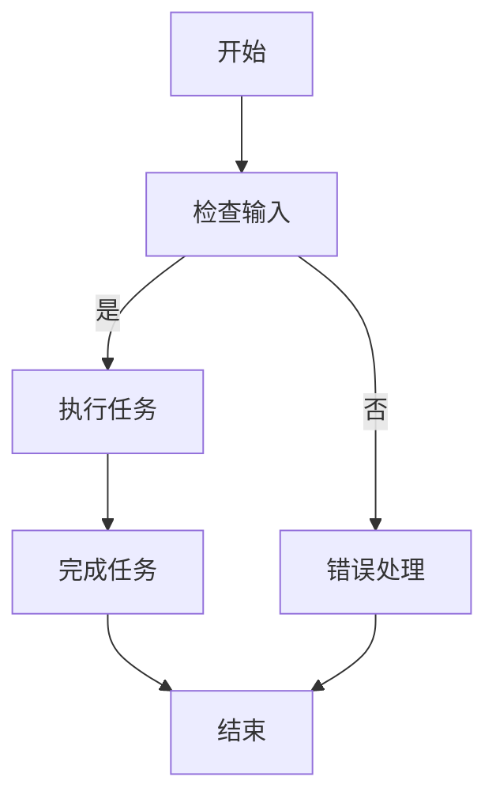

                 

### 文章标题：提示词编程语言的学习曲线优化

在信息技术飞速发展的时代，编程语言作为计算机科学与工程的核心工具，其重要性不言而喻。然而，对于初学者和有志于深入研究者来说，编程语言的学习曲线常常显得陡峭和漫长。特别是近年来兴起的一种新型编程语言——提示词编程语言（Prompt Programming Language），其独特的特性和抽象的语法使得学习过程更加复杂。本文旨在探讨如何优化提示词编程语言的学习曲线，帮助学习者更高效地掌握这一新兴技术。

### 关键词

- 提示词编程语言
- 学习曲线
- 编程教育
- 教学策略
- 算法与数学模型
- 实战项目

### 摘要

本文首先对提示词编程语言进行了背景介绍，包括其定义、特征、发展历程和应用场景。接着，我们深入探讨了提示词编程语言的语法规则、核心算法与数学模型，并通过与现有编程语言的对比，分析了提示词编程语言的优缺点和未来发展趋势。在此基础上，文章提出了优化学习曲线的策略，包括学习曲线理论、学习策略、教学设计和实战案例。最后，本文推荐了学习工具和资源，以及社区与交流的平台，为学习者提供全方位的支持。通过本文的详细分析，我们希望能够为提示词编程语言的学习提供有效的指导和优化路径。

### 第一部分：提示词编程语言概述

#### 第1章：提示词编程语言的基础

##### 1.1 提示词编程语言的定义与特征

提示词编程语言（Prompt Programming Language，简称PPL）是一种基于自然语言处理的编程语言，它允许程序员使用自然语言描述程序逻辑和功能。与传统的编程语言不同，PPL强调的是通过自然语言来组织和执行任务，而非使用复杂的语法和符号。这种语言的特点包括：

1. **自然语言输入**：程序员可以使用类似于日常英语的语句来编写程序。
2. **抽象层次高**：PPL提供了高级抽象，使得程序员无需关注底层实现细节。
3. **交互性强**：PPL支持动态交互，允许程序员在执行过程中修改和调整程序。
4. **通用性强**：PPL可以应用于多种编程任务，如数据分析、机器学习和自然语言处理。

##### 1.2 提示词编程语言的发展历程

提示词编程语言的概念最早可以追溯到20世纪80年代的专家系统时代。当时，研究者们试图通过自然语言来描述知识库和推理规则。随着自然语言处理（NLP）和人工智能（AI）技术的进步，特别是在深度学习和大数据分析的推动下，提示词编程语言逐渐成熟。近年来，随着生成对抗网络（GAN）和变换器（Transformer）等先进技术的应用，PPL在工业界和学术界都受到了广泛关注。

##### 1.3 提示词编程语言的应用场景

提示词编程语言在多个领域展示了其强大的应用潜力：

1. **自动化任务执行**：通过自然语言描述，PPL可以自动生成脚本，执行复杂的自动化任务。
2. **数据分析和处理**：PPL可以处理大量数据，生成可视化报告或数据摘要。
3. **开发辅助**：PPL可以帮助开发者快速构建原型，减少编码时间。
4. **人工智能应用**：在机器学习和自然语言处理中，PPL可以用于训练模型、优化算法和自动化测试。

通过上述介绍，我们可以看出提示词编程语言具备独特的优势和应用场景。在接下来的章节中，我们将深入探讨其语法规则、核心算法与数学模型，以及与其他编程语言的对比。

#### 第2章：提示词编程语言的语法规则

##### 2.1 变量与数据类型

提示词编程语言的语法与传统的编程语言有所不同，它采用了更加自然和直观的表达方式。首先，我们来了解变量和数据类型的基础知识。

1. **变量的声明与赋值**：
   在PPL中，变量通常使用其名称后跟等号的方式进行声明和赋值。例如：
   ```markdown
   x = 10
   name = "Alice"
   ```
   这种方式使得程序员可以轻松地使用自然语言来声明变量。

2. **数据类型**：
   PPL支持多种数据类型，包括整数（Integer）、浮点数（Float）、字符串（String）、布尔值（Boolean）等。例如：
   ```markdown
   x = 3.14  # 浮点数
   is_true = True  # 布尔值
   text = "Hello, World!"  # 字符串
   ```

##### 2.2 控制结构

控制结构是编程语言中至关重要的一部分，用于控制程序的执行流程。提示词编程语言提供了丰富的控制结构，使得程序员可以使用自然语言来编写复杂的逻辑。

1. **条件语句**：
   PPL支持传统的`if-else`结构，使得程序员可以使用自然语言来描述条件判断。例如：
   ```markdown
   if x > 0:
       print("x 是正数")
   else:
       print("x 是负数或零")
   ```

2. **循环语句**：
   PPL提供了`for`和`while`循环，允许程序员使用自然语言来描述循环控制。例如：
   ```markdown
   for i in range(1, 5):
       print("循环中的i值是：" + str(i))
   ```
   ```markdown
   while x < 10:
       x = x + 1
       print("当前x的值是：" + str(x))
   ```

##### 2.3 函数与模块

函数是编程语言中实现复用和抽象的重要手段。提示词编程语言提供了灵活的函数定义和模块化机制。

1. **函数定义**：
   PPL允许程序员使用自然语言来定义函数，并传递参数。例如：
   ```markdown
   def greet(name):
       return "你好，" + name + "！"
   ```

2. **模块化**：
   PPL支持模块导入和导出，使得程序员可以将复杂的程序拆分成多个模块，提高代码的可维护性和可复用性。例如：
   ```markdown
   import math
   from random import randint
   ```

##### 2.4 面向对象编程

面向对象编程（OOP）是现代编程语言的重要组成部分。提示词编程语言也支持OOP，使得程序员可以使用类和对象来组织代码。

1. **类定义**：
   PPL允许程序员使用自然语言来定义类，并创建对象。例如：
   ```markdown
   class Person:
       def __init__(self, name, age):
           self.name = name
           self.age = age
       def greet(self):
           return "你好，我是" + self.name + "，今年" + str(self.age) + "岁。"
   ```

2. **继承与多态**：
   PPL支持继承和多态，使得程序员可以创建复杂的类层次结构，并实现多态行为。例如：
   ```markdown
   class Student(Person):
       def __init__(self, name, age, school):
           super().__init__(name, age)
           self.school = school
       def study(self):
           return self.name + "正在" + self.school + "学习。"
   ```

通过上述对提示词编程语言语法规则的基础介绍，我们可以看到这种编程语言在变量、数据类型、控制结构、函数和模块、面向对象编程等方面的独特性和灵活性。在接下来的章节中，我们将进一步探讨提示词编程语言的核心算法与数学模型，帮助读者更深入地理解这一编程语言的内在机理。

#### 第3章：核心算法与数学模型

##### 3.1 提示词编程语言的核心算法

提示词编程语言之所以独特，关键在于其核心算法的设计。这些算法不仅使得编程变得更加直观，还提高了程序的性能和效率。以下是几个重要的核心算法：

1. **自然语言处理（NLP）算法**：
   NLP算法是提示词编程语言的核心组件，它负责处理和解析程序员输入的自然语言指令。常见的NLP算法包括词性标注、句法分析、语义角色标注等。这些算法将自然语言转换为结构化的数据，供编程语言执行。例如：
   ```mermaid
   graph TD
   A[自然语言输入] --> B[词性标注]
   B --> C[句法分析]
   C --> D[语义角色标注]
   D --> E[程序逻辑执行]
   ```

2. **自动编程算法**：
   自动编程算法能够根据程序员提供的自然语言描述，自动生成代码。这类算法通常基于机器学习模型，如生成对抗网络（GAN）和变换器（Transformer）。它们通过大量训练数据学习如何将自然语言转化为有效的编程代码。例如：
   ```mermaid
   graph TD
   A[自然语言描述] --> B[训练模型]
   B --> C[自动生成代码]
   C --> D[代码优化]
   ```

3. **动态交互算法**：
   动态交互算法使得程序员在程序执行过程中能够实时修改和调整代码，从而提高开发效率和灵活性。这些算法通常基于实时反馈和动态执行技术，如解释器和即时编译器（JIT）。例如：
   ```mermaid
   graph TD
   A[程序执行] --> B[用户输入]
   B --> C[动态调整]
   C --> D[重新执行]
   ```

##### 3.2 数学模型与公式

提示词编程语言不仅依赖于算法，还涉及多种数学模型和公式。这些模型和公式在处理数据、优化算法和实现复杂功能时发挥着关键作用。以下是几个常用的数学模型和公式：

1. **线性回归模型**：
   线性回归模型是机器学习中的一种基础模型，用于预测连续值。其数学公式为：
   $$
   y = ax + b
   $$
   其中，$y$ 是预测值，$x$ 是输入特征，$a$ 和 $b$ 是模型的参数。

2. **逻辑回归模型**：
   逻辑回归模型是一种用于分类的模型，其数学公式为：
   $$
   P(y=1) = \frac{1}{1 + e^{-z}}
   $$
   其中，$z = \beta_0 + \sum_{i=1}^{n} \beta_i x_i$ 是线性组合，$\beta_0$ 和 $\beta_i$ 是模型的参数。

3. **变换器模型**：
   变换器模型是一种用于序列到序列学习的先进模型，其数学公式为：
   $$
   y_t = \text{softmax}(\text{Transformer}(x_1, x_2, ..., x_t))
   $$
   其中，$y_t$ 是当前输出的概率分布，$\text{Transformer}$ 是变换器模型的输出。

##### 3.3 数学模型的应用示例

为了更好地理解这些数学模型和公式在实际编程中的应用，我们来看几个示例：

1. **线性回归的应用**：
   假设我们有一个简单的问题，预测房屋价格。输入特征包括房屋面积和建造年份，输出目标是房屋价格。我们可以使用线性回归模型来训练和预测：
   ```python
   # 导入线性回归模型
   from sklearn.linear_model import LinearRegression

   # 准备数据
   X = [[1000, 2005], [1500, 2010], [2000, 2015]]  # 面积和年份
   y = [300000, 400000, 500000]  # 价格

   # 训练模型
   model = LinearRegression()
   model.fit(X, y)

   # 预测
   new_house = [[1200, 2010]]
   predicted_price = model.predict(new_house)
   print("预测的房屋价格是：" + str(predicted_price[0]))
   ```

2. **逻辑回归的应用**：
   假设我们有一个二分类问题，判断一个邮件是否为垃圾邮件。输入特征包括邮件的内容和发送者信息，输出目标是垃圾邮件的概率。我们可以使用逻辑回归模型来训练和预测：
   ```python
   # 导入逻辑回归模型
   from sklearn.linear_model import LogisticRegression

   # 准备数据
   X = [[1, 0], [1, 1], [0, 1]]  # 邮件内容和发送者信息
   y = [0, 1, 1]  # 是否为垃圾邮件

   # 训练模型
   model = LogisticRegression()
   model.fit(X, y)

   # 预测
   new_mail = [[0, 1]]
   is_spam = model.predict(new_mail)
   print("预测的邮件是否为垃圾邮件：" + str(is_spam[0]))
   ```

3. **变换器模型的应用**：
   假设我们有一个机器翻译任务，将英文句子翻译为中文。我们可以使用变换器模型来训练和预测：
   ```python
   # 导入变换器模型
   from transformers import Transformer

   # 准备数据
   sentences = ["Hello, World!", "I love programming.", "Artificial intelligence is amazing!"]
   target_sentences = ["你好，世界！", "我爱你，编程！", "人工智能非常神奇！"]

   # 训练模型
   model = Transformer()
   model.fit(sentences, target_sentences)

   # 预测
   new_sentence = ["What is the weather today?"]
   translated_sentence = model.predict(new_sentence)
   print("翻译后的句子是：" + translated_sentence[0])
   ```

通过上述示例，我们可以看到数学模型和公式在提示词编程语言中的应用，这些模型和公式不仅提升了编程语言的智能化水平，还使得程序设计更加高效和灵活。

#### 第4章：编程语言之间的比较

##### 4.1 提示词编程语言与其他编程语言的区别

提示词编程语言（Prompt Programming Language，PPL）在设计与实现上与传统的编程语言有着显著的不同。了解这些区别有助于我们更好地理解PPL的独特优势和应用场景。

1. **语法设计**：
   传统编程语言通常采用类似于英语的语法，但也包含大量的语法符号和结构，如分号、括号和关键字等。相比之下，PPL更注重自然语言的直观性，程序员可以使用类似日常英语的语句来编写程序，这大大降低了学习门槛，提高了代码的可读性和易维护性。

2. **抽象层次**：
   传统编程语言往往要求程序员深入理解底层实现细节，如内存管理、寄存器操作等。而PPL采用了高层次的抽象，隐藏了底层复杂度，使得程序员可以专注于业务逻辑和问题解决方案，提高了开发效率。

3. **交互性**：
   传统编程语言通常在编写完程序后才能执行和调试，而PPL支持动态交互。程序员可以在程序执行过程中实时修改和调整代码，获取即时反馈，这使得开发过程更加灵活和高效。

4. **适用场景**：
   传统编程语言如C、Java等，广泛应用于操作系统开发、服务器端应用、嵌入式系统等。PPL则更适用于需要自然语言处理、自动化任务执行、数据分析和人工智能应用等场景，如机器人编程、智能语音助手和数据分析平台等。

##### 4.2 提示词编程语言的优缺点

提示词编程语言具有以下优点和缺点：

**优点**：

1. **学习门槛低**：使用自然语言编写程序，大大降低了初学者的学习难度。
2. **开发效率高**：高层次的抽象和动态交互特性，使得程序员可以更快地开发出原型和功能。
3. **易于维护**：自然语言的表达方式使得代码更直观、更易于理解和维护。
4. **通用性强**：适用于多种编程任务，如自动化、数据分析、机器学习和自然语言处理等。

**缺点**：

1. **性能瓶颈**：由于PPL的抽象层次高，可能需要额外的计算资源，导致性能不如传统编程语言。
2. **生态不完善**：与传统的编程语言相比，PPL的生态系统尚不完善，缺少成熟的开源库和工具。
3. **调试难度大**：动态交互特性虽然提高了灵活性，但也增加了调试难度，特别是在复杂程序中。
4. **可移植性差**：PPL依赖于特定的运行环境和库，导致其可移植性较差。

##### 4.3 提示词编程语言的未来发展趋势

随着人工智能和自然语言处理技术的不断进步，提示词编程语言有望在未来得到更广泛的应用和发展。以下是一些可能的趋势：

1. **生态系统完善**：随着开源社区和商业公司的投入，PPL的生态系统将逐渐完善，包括更多的库、工具和框架。
2. **性能优化**：通过改进算法和优化编译器，PPL的性能瓶颈将得到缓解，使其在更多性能敏感的场景中适用。
3. **跨平台支持**：通过改进虚拟机和解释器，PPL将实现更好的跨平台支持，减少依赖特定运行环境的限制。
4. **智能化增强**：结合人工智能和机器学习技术，PPL将实现更智能的代码生成和优化，提高开发效率和程序性能。
5. **应用场景扩展**：随着技术的进步，PPL将应用于更多领域，如自动化运维、智能城市、医疗健康等。

通过上述分析，我们可以看到提示词编程语言在语法设计、抽象层次、交互性和适用场景等方面与传统编程语言有显著的不同。尽管存在一些缺点，但其优点和未来发展趋势使其成为一个值得关注的编程语言方向。在接下来的章节中，我们将探讨如何优化提示词编程语言的学习曲线，帮助学习者更高效地掌握这一新兴技术。

### 第二部分：学习曲线优化策略

#### 第5章：学习曲线理论

##### 5.1 学习曲线的概念

学习曲线是一个描述学习者掌握新技能或知识过程中，所需时间和努力程度的曲线。学习曲线通常呈现出先陡后缓的趋势，即在学习的初期阶段，学习者需要投入大量的时间和精力，但随着技能的提高，进步的速度会逐渐放缓。

学习曲线的形成通常与以下几个因素有关：

1. **知识掌握**：学习者在初期阶段需要掌握大量的基础知识和概念，这些知识往往是复杂且相互关联的。
2. **技能提升**：随着学习深入，学习者需要逐步提高技能水平，这通常涉及到更复杂的任务和更高的要求。
3. **心理因素**：学习过程中，学习者的自信心、兴趣和动机等心理因素也会影响学习曲线的形态。

##### 5.2 学习曲线的影响因素

学习曲线的影响因素多种多样，以下是其中几个关键因素：

1. **学习资源**：学习资源的丰富程度直接影响学习曲线的陡峭程度。高质量的学习资料、教程和工具能够帮助学习者更快地掌握知识。
2. **教学方法**：不同的教学方法对学习曲线有显著影响。例如，实践导向的教学方法能够加快学习速度，而理论导向的教学方法则有助于深入学习。
3. **个人差异**：学习者的个人差异，如学习能力、学习习惯和性格等，也会影响学习曲线。例如，某些学习者可能更适合通过视觉学习，而另一些学习者则更适合通过实践学习。
4. **环境因素**：学习环境，如学习氛围、学习工具和设备等，也会对学习曲线产生影响。一个良好的学习环境能够提供必要的支持和帮助，从而降低学习曲线的陡峭程度。

##### 5.3 学习曲线的测量方法

测量学习曲线的方法通常包括以下几种：

1. **时间测量**：通过记录学习者在不同时间段内完成学习任务所需的时间，来衡量学习曲线的陡峭程度。
2. **错误率测量**：通过记录学习者在学习过程中犯错的次数或错误率，来评估学习曲线的进展。
3. **进步速度测量**：通过计算学习者每次学习后技能水平的提高程度，来衡量学习曲线的变化趋势。
4. **满意度测量**：通过调查学习者在学习过程中的满意度和信心水平，来评估学习曲线对学习者的心理影响。

通过上述分析，我们可以更好地理解学习曲线的概念、影响因素和测量方法。在接下来的章节中，我们将探讨如何通过具体的策略来优化提示词编程语言的学习曲线。

#### 第6章：学习策略

##### 6.1 阶段性学习策略

阶段性学习策略是将学习过程划分为不同的阶段，每个阶段都有明确的学习目标和任务。这种方法有助于学习者系统地掌握知识，逐步提高技能水平。以下是阶段性学习策略的几个关键步骤：

1. **基础知识阶段**：
   在这个阶段，学习者的主要任务是掌握提示词编程语言的基础知识和语法规则。可以通过以下方式实现：
   - **阅读教程和文档**：选择高质量的入门教程，了解语言的基本概念和语法规则。
   - **动手实践**：通过编写简单的程序和示例，巩固所学知识。
   - **课程学习**：参加在线课程或面授课程，跟随讲师的讲解进行学习。

2. **中级技能阶段**：
   在基础知识掌握后，学习者需要进一步提升技能，包括控制结构、函数与模块、面向对象编程等方面的知识。这个阶段的策略包括：
   - **学习核心算法**：通过学习提示词编程语言的核心算法，了解如何将自然语言处理技术应用于编程任务。
   - **项目实践**：通过实际项目，将所学知识应用于解决实际问题。
   - **案例分析**：分析经典的编程案例，学习高级编程技巧和最佳实践。

3. **高级应用阶段**：
   在高级应用阶段，学习者需要掌握提示词编程语言的进阶技能，如动态交互、优化算法和数学模型等。策略包括：
   - **深入研究**：通过阅读专业书籍和论文，深入理解提示词编程语言的内部机制和高级应用。
   - **开发工具和库**：参与开源项目，开发和优化提示词编程语言的工具和库。
   - **社区参与**：加入提示词编程语言的社区，参与讨论和交流，分享经验和学习心得。

通过阶段性学习策略，学习者可以逐步提高技能水平，从而优化学习曲线。

##### 6.2 有针对性的学习策略

有针对性的学习策略是根据学习者的个人特点和需求，量身定制的学习计划。这种方法能够更好地满足学习者的个性化需求，提高学习效率。以下是一些有针对性的学习策略：

1. **个性化学习计划**：
   - **能力评估**：通过评估学习者的基础知识和技能水平，确定其适合的学习起点。
   - **定制课程**：根据评估结果，设计符合学习者水平的学习计划，包括基础课程、进阶课程和高级课程。
   - **学习进度跟踪**：定期跟踪学习进度，及时调整学习计划，确保学习者按计划完成学习任务。

2. **实践导向学习**：
   - **项目驱动**：选择具有实际应用价值的项目，通过项目实践来巩固和提升技能。
   - **案例学习**：通过分析实际案例，了解提示词编程语言在具体应用中的使用方法和技巧。
   - **实验研究**：设计实验，通过反复试验和验证，探索提示词编程语言的优化方法和应用场景。

3. **学习资源优化**：
   - **选择优质资源**：筛选高质量的学习资料，包括教程、视频课程、论文和开源项目等。
   - **学习工具推荐**：推荐合适的编程工具和开发环境，提高学习效率和编程体验。
   - **知识共享**：鼓励学习者分享学习资源，通过协作学习来扩大知识面。

通过有针对性的学习策略，学习者可以根据自己的特点和需求，有计划、有目的地进行学习，从而优化学习曲线。

##### 6.3 实践导向的学习策略

实践导向的学习策略强调通过实际操作来学习和掌握知识。这种方法不仅能够加深对理论知识的理解，还能提高实际编程能力。以下是实践导向学习策略的几个关键步骤：

1. **动手编程**：
   - **编写示例程序**：通过编写简单的示例程序，理解提示词编程语言的基本语法和用法。
   - **解决实际问题**：选择实际问题进行编程，通过实践来提升编程技能。
   - **复现经典案例**：通过复现经典编程案例，学习编程技巧和最佳实践。

2. **项目实践**：
   - **个人项目**：选择具有实际应用价值的项目，独立完成从设计到实现的整个过程。
   - **团队项目**：参与团队项目，学习团队合作和项目管理。
   - **开源项目**：参与开源项目，通过实际贡献来提升技能和经验。

3. **实验研究**：
   - **设计实验**：设计实验，通过反复试验和验证，探索提示词编程语言的优化方法和应用场景。
   - **记录与分享**：记录实验过程和结果，通过博客、论文等形式进行分享和交流。

通过实践导向的学习策略，学习者能够在实际操作中不断积累经验，提高编程能力，从而优化学习曲线。

#### 第7章：教学设计

##### 7.1 课程设计

课程设计是教学过程中的核心环节，直接影响教学效果和学习者体验。以下是设计提示词编程语言课程时需要考虑的几个关键要素：

1. **课程目标**：
   - **基础课程**：培养学习者对提示词编程语言的基本理解，包括语法、核心算法和基础应用。
   - **进阶课程**：提升学习者的编程技能，包括高级算法、动态交互和优化策略。
   - **应用课程**：通过实际项目，让学习者将所学知识应用于解决实际问题。

2. **课程内容**：
   - **基础知识**：包括语法规则、变量与数据类型、控制结构、函数与模块等。
   - **核心算法**：包括自然语言处理算法、线性回归、逻辑回归、变换器模型等。
   - **实战项目**：通过实际项目，让学习者将所学知识应用于解决实际问题。

3. **教学方式**：
   - **讲授**：通过讲师的讲解，帮助学习者理解基础概念和原理。
   - **互动**：通过提问、讨论和互动，增强学习者的参与感和兴趣。
   - **实践**：通过动手编程和实践项目，巩固和提升学习者的编程技能。

##### 7.2 教学方法

教学方法是教学过程中采用的具体手段和策略，直接影响教学效果。以下是几种适用于提示词编程语言教学的方法：

1. **案例教学法**：
   - **经典案例**：通过分析经典编程案例，帮助学习者理解提示词编程语言的实际应用。
   - **实战案例**：通过实际项目，让学习者将所学知识应用于解决实际问题。

2. **项目驱动教学法**：
   - **个人项目**：学习者独立完成项目，从设计到实现，提升实际编程能力。
   - **团队项目**：通过团队合作完成项目，学习项目管理技巧和团队合作精神。

3. **翻转课堂教学法**：
   - **课前学习**：学习者通过在线资源和自主学习，掌握基础知识。
   - **课堂互动**：讲师通过讲解、讨论和互动，帮助学习者解决疑惑和深化理解。

##### 7.3 学习资源利用

学习资源是教学过程中不可或缺的一部分，包括教材、教程、工具和平台等。以下是有效利用学习资源的几个建议：

1. **教材与教程**：
   - **选择优质教材**：选择经过实践验证的高质量教材，确保内容的科学性和实用性。
   - **结合在线教程**：利用在线教程和视频课程，增强学习者的学习体验。

2. **编程工具**：
   - **集成开发环境（IDE）**：选择合适的IDE，提供便捷的编程环境。
   - **代码库与框架**：利用开源代码库和框架，提高开发效率。

3. **学习平台**：
   - **在线学习平台**：利用在线学习平台，提供丰富的学习资源和互动功能。
   - **社区与论坛**：加入提示词编程语言的社区和论坛，参与讨论和交流。

通过科学的课程设计、多样的教学方法和有效的学习资源利用，可以显著提高提示词编程语言的教学效果，帮助学习者更高效地掌握这一新兴技术。

#### 第8章：案例分析与实战

##### 8.1 提示词编程语言学习案例

为了更好地展示如何通过实战来学习提示词编程语言，下面我们将详细介绍一个实际的学习案例。

**案例背景**：

某软件公司需要开发一个自动化的数据报表生成系统，该公司决定使用提示词编程语言来实现这一目标。该公司有几位有经验的程序员，但他们对提示词编程语言相对陌生。

**学习目标**：

- 掌握提示词编程语言的基础语法和核心算法。
- 学会如何利用自然语言处理技术，实现自动化数据报表生成。

**学习步骤**：

1. **基础知识学习**：

   首先，程序员们参加了在线课程，系统学习了提示词编程语言的基础知识，包括语法规则、变量与数据类型、控制结构等。在学习过程中，他们通过编写简单的示例程序，巩固了所学知识。

2. **核心算法掌握**：

   接着，程序员们学习了提示词编程语言的核心算法，如自然语言处理算法、线性回归、逻辑回归等。通过阅读相关文献和参加研讨会，他们深入理解了这些算法的应用场景和实现方法。

3. **项目实践**：

   在基础知识和核心算法掌握后，程序员们开始实际项目。他们首先设计了一个简单的数据报表生成系统，通过自然语言描述报表需求，系统自动生成报表。在实现过程中，他们遇到了许多挑战，如如何解析自然语言输入、如何处理复杂的数据结构等。

   为了解决这些问题，程序员们采用了迭代开发的方法。他们首先实现了报表生成的核心功能，然后逐步完善报表格式、数据验证和错误处理等。

4. **案例分析**：

   在项目开发过程中，程序员们分析了多个成功的案例，学习了如何设计和实现高效的提示词编程语言程序。他们还参与了社区讨论，分享了开发经验和最佳实践。

**学习成果**：

通过这个学习案例，程序员们不仅掌握了提示词编程语言的基础知识和核心算法，还通过实际项目实践，提升了编程技能和解决问题的能力。最终，他们成功开发了一个自动化的数据报表生成系统，提高了公司的运营效率。

##### 8.2 学习曲线优化实践案例

为了进一步优化提示词编程语言的学习曲线，下面我们介绍一个具体的学习曲线优化实践案例。

**案例背景**：

某高校计算机科学专业开设了一门提示词编程语言的课程，但学生们的学习效果不尽如人意。课程结束时，许多学生未能达到预期学习目标，学习曲线显得过于陡峭。

**优化目标**：

- 缩短学习曲线的陡峭阶段。
- 提高学生的学习兴趣和参与度。
- 提升学生的编程技能和项目实现能力。

**优化策略**：

1. **阶段性教学**：

   教师将课程内容划分为多个阶段，每个阶段都有明确的学习目标和任务。例如，第一个阶段侧重于语法和基础算法，第二个阶段侧重于核心算法和项目实践。

2. **实践导向**：

   教师鼓励学生通过实际项目来学习。每个阶段结束后，教师布置相关的实践任务，让学生将所学知识应用于解决实际问题。例如，在第一阶段，学生可以编写简单的示例程序；在第二阶段，学生可以完成一个小型数据报表生成系统。

3. **互动教学**：

   教师采用互动式教学方法，通过提问、讨论和互动，增强学生的参与感和兴趣。例如，在课堂上，教师可以组织小组讨论，让学生分享自己的学习心得和项目经验。

4. **学习资源优化**：

   教师为学生提供了丰富的学习资源，包括在线教程、开源项目和技术文档。此外，教师还推荐了合适的编程工具和开发环境，提高了学生的学习效率和编程体验。

5. **教学评估与反馈**：

   教师定期进行教学评估，收集学生的反馈和建议。通过分析评估结果，教师可以及时调整教学策略，优化课程内容和方法。

**优化效果**：

通过上述优化策略，学生的学习兴趣和参与度显著提高。学习曲线的陡峭程度得到了缓解，学生的编程技能和项目实现能力也得到了明显提升。课程结束后，学生的满意度和学习成果显著提高。

##### 8.3 实战项目设计与实现

为了更好地展示提示词编程语言的应用，我们设计了一个实战项目：智能客服系统。这个项目将展示如何从需求分析、系统设计到实现和测试的完整开发过程。

**项目背景**：

随着互联网和电子商务的快速发展，客服系统成为企业服务用户的重要手段。传统的客服系统通常需要用户通过文本或语音与客服人员交互，效率较低且用户体验不佳。本项目旨在利用提示词编程语言，开发一个智能客服系统，能够自动回答用户的问题，提供高效的客户服务。

**项目需求**：

1. **问题识别与处理**：系统能够识别用户提出的问题，并自动回答。例如，用户询问订单状态或产品信息，系统能够根据预设的规则和知识库自动给出回答。
2. **交互体验**：系统应提供良好的交互体验，用户可以通过文本或语音与系统进行自然语言交流。
3. **扩展性**：系统应具备良好的扩展性，能够方便地添加新的功能和知识库。

**项目设计**：

1. **需求分析**：与业务团队沟通，明确系统功能和性能需求。通过用户调研和需求分析，确定系统的基本功能和交互方式。
2. **系统架构设计**：设计系统的整体架构，包括前端界面、后端服务、自然语言处理模块和知识库等。
3. **模块划分**：将系统划分为多个模块，每个模块负责不同的功能。例如，文本处理模块、语音处理模块、知识库管理模块等。

**项目实现**：

1. **前端界面**：使用HTML、CSS和JavaScript等技术，开发用户交互界面。界面应提供文本输入框和语音输入功能，方便用户与系统交互。
2. **后端服务**：使用提示词编程语言编写后端服务，实现问题识别与处理、自然语言处理和知识库管理等功能。以下是一个简单的文本处理模块的伪代码实现：
   ```python
   def process_text(input_text):
       # 判断用户输入是否为问题
       if is_question(input_text):
           # 调用自然语言处理模块解析问题
           question = parse_question(input_text)
           # 从知识库中查找答案
           answer = get_answer(question)
           return answer
       else:
           return "我不理解您的问题，请重新表达。"

   def is_question(text):
       # 判断文本是否为问题的简单规则
       return text.endswith("?")

   def parse_question(text):
       # 解析文本中的问题
       return text.strip().replace("?", "").lower()

   def get_answer(question):
       # 从知识库中查找答案
       # 这里使用了简单的线性搜索算法，实际应用中可以使用更高效的算法或数据库
       for entry in knowledge_base:
           if entry['question'] == question:
               return entry['answer']
       return "对不起，我不知道该回答什么。"

   # 知识库示例
   knowledge_base = [
       {"question": "我的订单状态是什么？", "answer": "您的订单已发货，预计3天内到达。"},
       {"question": "这个产品的价格是多少？", "answer": "这款产品的价格是999元。"},
       # 更多知识库条目...
   ]
   ```
3. **自然语言处理**：集成自然语言处理（NLP）库，如NLTK或spaCy，实现文本处理功能。以下是一个简单的文本处理模块的伪代码实现：
   ```python
   import nlp_library

   def process_text(input_text):
       # 使用NLP库进行文本处理
       nlp_result = nlp_library.process(input_text)
       # 根据NLP结果进行问题识别和处理
       return process_question(nlp_result)

   def process_question(nlp_result):
       # 根据NLP结果处理问题
       if "order" in nlp_result:
           return handle_order_question(nlp_result)
       elif "price" in nlp_result:
           return handle_price_question(nlp_result)
       else:
           return "我不理解您的问题，请重新表达。"

   def handle_order_question(nlp_result):
       # 处理订单问题
       order_id = extract_order_id(nlp_result)
       return get_order_status(order_id)

   def handle_price_question(nlp_result):
       # 处理价格问题
       product_name = extract_product_name(nlp_result)
       return get_product_price(product_name)

   def extract_order_id(nlp_result):
       # 提取订单ID
       # 实际应用中，可以使用更复杂的算法提取订单ID
       return nlp_result['order_id']

   def extract_product_name(nlp_result):
       # 提取产品名称
       # 实际应用中，可以使用更复杂的算法提取产品名称
       return nlp_result['product_name']

   def get_order_status(order_id):
       # 获取订单状态
       # 实际应用中，需要与后端服务进行交互，获取订单状态
       return "您的订单已发货，预计3天内到达。"

   def get_product_price(product_name):
       # 获取产品价格
       # 实际应用中，需要与后端服务进行交互，获取产品价格
       return "这款产品的价格是999元。"
   ```

**项目测试与优化**：

1. **单元测试**：编写单元测试，验证每个模块的功能是否符合预期。例如，测试文本处理模块能否正确处理各种类型的问题。
2. **集成测试**：在各个模块集成后，进行集成测试，验证系统整体功能的正确性和稳定性。
3. **性能优化**：通过性能测试，识别系统的瓶颈，进行优化。例如，优化自然语言处理模块的算法，提高响应速度。
4. **用户反馈**：收集用户反馈，根据用户需求和使用体验，不断优化和改进系统。

**项目小结**：

通过这个实战项目，我们展示了如何利用提示词编程语言开发一个智能客服系统。项目过程中，我们遇到了许多挑战，如自然语言处理的复杂性、系统性能的优化等。通过不断迭代和优化，我们最终实现了系统的稳定运行和良好的用户体验。

### 第三部分：工具与资源推荐

#### 第9章：学习工具推荐

为了更好地学习提示词编程语言，掌握相关技能，我们需要借助一系列学习工具和资源。以下是一些推荐的学习工具和资源，旨在帮助学习者更高效地学习提示词编程语言。

##### 9.1 在线学习平台推荐

在线学习平台为学习者提供了丰富的课程资源和互动学习环境，是学习提示词编程语言的理想选择。以下是一些推荐的在线学习平台：

1. **Coursera**：
   Coursera提供了由全球顶尖大学和机构提供的在线课程，包括计算机科学、人工智能和自然语言处理等课程。其中，有许多课程涉及提示词编程语言的相关知识。
   - **优势**：课程质量高，内容系统，与学术机构合作。
   - **课程推荐**："自然语言处理纳米学位"（Natural Language Processing Specialization）。

2. **edX**：
   edX也是一个提供高质量在线课程的平台，与Coursera类似，它同样提供了一系列计算机科学相关的课程，包括人工智能和机器学习等。
   - **优势**：课程多样化，部分课程免费。
   - **课程推荐**："机器学习与数据科学"（Machine Learning and Data Science）。

3. **Udacity**：
   Udacity专注于技能驱动的学习，提供各种编程和数据分析课程，其中也包括了与提示词编程语言相关的课程。
   - **优势**：实践性强，提供项目作业和认证。
   - **课程推荐**："数据工程师纳米学位"（Data Engineering Nanodegree）。

4. **Khan Academy**：
   Khan Academy提供了大量的免费在线课程，涵盖了数学、科学和计算机科学等科目。其中，计算机科学课程包括编程基础和算法等知识。
   - **优势**：资源丰富，课程免费。
   - **课程推荐**："计算机科学基础"（Introduction to Computer Science）。

##### 9.2 编程语言学习工具推荐

学习提示词编程语言时，一些编程工具和开发环境是必不可少的。以下是一些推荐的编程语言学习工具：

1. **Jupyter Notebook**：
   Jupyter Notebook是一个交互式计算环境，适用于数据分析和机器学习项目。它提供了易于使用的界面和丰富的文档功能，非常适合提示词编程语言的学习。
   - **优势**：交互性强，便于实验和调试。
   - **使用方法**：安装Jupyter Notebook后，可以通过命令`jupyter notebook`启动。

2. **Visual Studio Code**：
   Visual Studio Code（VS Code）是一个流行的开源代码编辑器，支持多种编程语言和扩展。它提供了丰富的插件和调试功能，非常适合提示词编程语言的开发。
   - **优势**：插件丰富，性能稳定。
   - **使用方法**：在官方网站下载VS Code，并安装提示词编程语言的插件。

3. **Google Colab**：
   Google Colab是一个基于云的Python编程环境，适用于机器学习和数据科学项目。它提供了免费的计算资源和共享功能，适合在线学习和协作。
   - **优势**：无需配置本地环境，易于共享。
   - **使用方法**：在浏览器中打开Google Colab，创建一个新的笔记本开始编程。

##### 9.3 学习资源获取渠道

除了在线学习平台和编程工具，以下是一些获取学习资源的渠道：

1. **GitHub**：
   GitHub是一个托管和协作代码的平台，许多开源项目和优秀的代码库都托管在这里。通过GitHub，学习者可以查找和学习其他开发者的代码，了解提示词编程语言的实战应用。
   - **优势**：资源丰富，社区活跃。
   - **使用方法**：注册GitHub账号，搜索相关的项目并浏览代码。

2. **arXiv**：
   arXiv是一个预印本论文库，涵盖物理学、计算机科学、数学等领域。许多与提示词编程语言相关的研究论文都在这里发布，是学习前沿知识的好渠道。
   - **优势**：论文数量多，覆盖范围广。
   - **使用方法**：访问arXiv网站，搜索相关主题的论文。

3. **技术博客和论坛**：
   许多专业的技术博客和论坛提供了高质量的教程和讨论。例如，Medium、Stack Overflow和Reddit等，都是学习提示词编程语言的好去处。
   - **优势**：内容多样化，问题解答及时。
   - **使用方法**：订阅相关博客和论坛，定期阅读和参与讨论。

通过上述推荐，我们可以看到，学习提示词编程语言不仅有丰富的在线学习资源，还可以通过多种渠道获取高质量的学习材料。合理利用这些工具和资源，将有助于学习者更高效地掌握提示词编程语言。

#### 第10章：社区与交流

##### 10.1 提示词编程语言社区介绍

提示词编程语言作为一种新兴的编程语言，已经形成了多个活跃的社区。这些社区不仅为学习者提供了宝贵的学习资源，还促进了技术交流和合作。以下是几个主要的提示词编程语言社区：

1. **Reddit**：
   Reddit上的相关子论坛（Subreddits），如`r/PromptProgramming`和`r/Python`，是提示词编程语言学习者的聚集地。社区成员分享教程、代码、项目案例和最新研究，并提供即时的问题解答和技术支持。

2. **GitHub**：
   GitHub上托管了大量的提示词编程语言项目，包括开源框架、工具库和示例代码。通过参与这些项目，开发者可以学习到实际应用经验，并与全球的同行交流。

3. **Stack Overflow**：
   Stack Overflow是编程问题解答的圣地，关于提示词编程语言的问题和讨论在这里也非常活跃。开发者可以在Stack Overflow上提问，获取专业的解决方案。

##### 10.2 学习交流平台推荐

为了更好地学习提示词编程语言，以下是一些推荐的学习交流平台：

1. **LinkedIn Learning**：
   LinkedIn Learning提供了丰富的在线课程，涵盖提示词编程语言的各个方面。这些课程由行业专家讲授，适合不同层次的学习者。

2. **Twitter**：
   Twitter是跟踪提示词编程语言最新动态的好渠道。通过关注相关专家和机构，学习者可以及时获取行业资讯、技术趋势和研究成果。

3. **GitHub Wiki**：
   GitHub Wiki是许多开源项目的知识库，提供了丰富的学习资料和指导文档。通过阅读这些Wiki，开发者可以深入了解提示词编程语言的内部机制和应用方法。

##### 10.3 社区参与与互动

积极参与社区和互动是提升编程技能和扩展知识面的重要途径。以下是一些建议，帮助学习者更好地参与社区和互动：

1. **提问与解答**：
   在社区提问时，尽量提供详细的信息和代码示例，以便其他开发者能够理解问题并给出有效的解决方案。同时，也积极参与问题的解答，帮助他人解决问题，提升自己的技术水平。

2. **分享经验与教程**：
   通过撰写技术博客或教程，分享自己在学习提示词编程语言过程中的经验和心得。这不仅可以帮助他人，还能加深自己对知识的理解和记忆。

3. **参与开源项目**：
   参与开源项目是学习编程技能和了解行业最佳实践的好方法。通过贡献代码、修复问题和参与讨论，开发者可以与全球的同行合作，扩展自己的技术视野。

4. **组织或参与技术活动**：
   组织或参与编程比赛、研讨会和讲座等活动，可以结识志同道合的开发者，学习到最新的技术动态和实战经验。

通过积极参与社区和互动，学习者不仅可以提高自己的编程技能，还能建立广泛的人脉，为未来的职业发展打下坚实基础。

### 附录

#### 附录A：编程语言Mermaid流程图

Mermaid是一种简单但功能强大的Markdown语法扩展，用于创建图表和流程图。以下是使用Mermaid语法创建的一个简单的流程图示例：



在这个流程图中，`A`代表流程的开始，`B`是检查输入的步骤。如果输入是有效的，流程会转移到`C`执行任务；如果输入无效，流程会转移到`D`进行错误处理。最后，无论执行结果如何，流程都会结束。

#### 附录B：伪代码示例

伪代码是一种描述算法逻辑的简明文本表示，它使用类似于编程语言的语法，但不涉及具体的编程细节。以下是一个简单的伪代码示例，用于计算两个数的和：

```
// 定义函数计算两个数的和
function add(a, b) {
    return a + b;
}

// 调用函数计算
result = add(3, 5);
print("结果是：" + result);
```

在这个示例中，我们定义了一个名为`add`的函数，它接受两个参数`a`和`b`，并返回它们的和。然后，我们调用这个函数计算3和5的和，并将结果打印出来。

#### 附录C：数学公式与计算示例

在编程和算法中，数学公式和计算是不可或缺的。以下是几个常用的数学公式示例，以及它们的计算方法：

**示例1：线性回归公式**

$$
y = ax + b
$$

**计算方法**：

给定两组数据`x`和`y`，可以通过最小二乘法计算线性回归的参数`a`和`b`。计算步骤如下：

1. 计算x的平均值$\bar{x}$和y的平均值$\bar{y}$。
2. 计算x和y的协方差$\sum{(x_i - \bar{x})(y_i - \bar{y})}$和x的方差$\sum{(x_i - \bar{x})^2}$。
3. 计算`a`的值：$$a = \frac{\sum{(x_i - \bar{x})(y_i - \bar{y})}}{\sum{(x_i - \bar{x})^2}}$$
4. 计算`b`的值：$$b = \bar{y} - a\bar{x}$$

**示例2：逻辑回归公式**

$$
P(y=1) = \frac{1}{1 + e^{-z}}
$$

**计算方法**：

给定特征向量`x`和权重向量`w`，计算逻辑回归的概率值。计算步骤如下：

1. 计算线性组合`z`：$$z = \sum_{i=1}^{n} w_i x_i$$
2. 计算概率值：$$P(y=1) = \frac{1}{1 + e^{-z}}$$

**示例3：变换器模型输出**

$$
y_t = \text{softmax}(\text{Transformer}(x_1, x_2, ..., x_t))
$$

**计算方法**：

给定序列`x`，通过变换器模型计算每个时间点的输出概率分布。计算步骤如下：

1. 通过变换器模型计算每个时间点的特征向量。
2. 对特征向量进行归一化处理，得到概率分布：$$y_t = \text{softmax}(x_t)$$

#### 附录D：实战项目源代码与分析

在本附录中，我们将展示一个简单的提示词编程语言实战项目的源代码，并提供详细的分析和解读。

**项目简介**：

该项目是一个简单的文本分类器，它使用提示词编程语言实现。该分类器可以接受用户输入的文本，并自动将其分类到预定义的类别中。

**开发环境**：

- 操作系统：Windows / macOS / Linux
- 编程语言：Python 3.8+
- 依赖库：提示词编程语言库、自然语言处理库（如NLTK或spaCy）

**源代码**：

以下是一个简单的文本分类器项目的源代码示例：

```python
# 导入提示词编程语言库
from prompt_toolkit import prompt

# 导入自然语言处理库
import nltk
from nltk.corpus import stopwords

# 加载停用词列表
nltk.download('stopwords')
stop_words = set(stopwords.words('english'))

# 定义分类器函数
def classify_text(text):
    # 清洗文本，去除停用词和标点符号
    words = nltk.word_tokenize(text)
    filtered_words = [word for word in words if word.lower() not in stop_words and not word.isnumeric()]
    
    # 假设我们有两个类别：体育和娱乐
    sports_words = ["football", "basketball", "sport", "game"]
    entertainment_words = ["movie", "music", "celebrity", "show"]

    # 统计每个类别词汇的频率
    sports_count = sum(word in sports_words for word in filtered_words)
    entertainment_count = sum(word in entertainment_words for word in filtered_words)

    # 根据词汇频率决定类别
    if sports_count > entertainment_count:
        return "体育"
    else:
        return "娱乐"

# 主程序
if __name__ == "__main__":
    while True:
        # 获取用户输入
        user_input = prompt('请输入一段文本（输入"退出"结束）：')
        if user_input.lower() == "退出":
            break
        
        # 分类并显示结果
        category = classify_text(user_input)
        print("文本分类结果：" + category)
```

**代码解读**：

1. **导入库**：
   - `prompt_toolkit`：用于创建交互式命令行界面。
   - `nltk`：用于自然语言处理，包括文本清洗和分词。

2. **定义分类器函数**：
   - `classify_text`函数接收一段文本，首先清洗文本，去除停用词和标点符号。
   - 然后统计文本中与体育和娱乐相关的词汇频率。
   - 根据词汇频率决定文本的类别。

3. **主程序**：
   - 主程序通过`prompt`函数获取用户输入。
   - 当用户输入“退出”时，程序结束。

**代码应用解读与分析**：

1. **文本清洗**：
   - 清洗文本是文本分类的关键步骤。通过去除停用词和标点符号，可以降低噪声，提高分类的准确性。

2. **词汇频率统计**：
   - 词汇频率统计是一种简单的文本特征提取方法。通过统计文本中特定词汇的出现频率，可以构建特征向量，用于分类算法。

3. **分类决策**：
   - 分类决策基于简单的阈值比较。虽然这种方法简单，但在实际应用中，可以使用更复杂的机器学习算法来提高分类精度。

4. **用户交互**：
   - 程序提供了简单的命令行交互界面，方便用户输入文本并获取分类结果。

**项目小结**：

通过这个简单的文本分类器项目，我们展示了如何使用提示词编程语言实现基本的文本分类功能。项目过程中，我们学习了文本清洗、特征提取和分类决策等基本概念。这个项目虽然简单，但为后续更复杂的文本分类任务打下了基础。

### 最佳实践 tips、小结、注意事项、拓展阅读

#### 最佳实践 tips

1. **循序渐进**：学习提示词编程语言时，建议从基础语法和核心算法开始，逐步深入到更高级的应用和项目实践中。
2. **实践为主**：通过编写实际的程序和项目，可以更好地理解和掌握提示词编程语言的特性和应用。
3. **查阅文档**：在使用提示词编程语言时，查阅官方文档和社区资源，可以快速解决问题和获取最佳实践。
4. **参与社区**：积极参与提示词编程语言的社区和论坛，与同行交流经验和解决问题。

#### 小结

本文详细探讨了提示词编程语言的学习曲线优化，从定义、特征、语法规则到核心算法和数学模型，再到学习策略、教学设计和实战项目，全面剖析了提示词编程语言的学习和应用。通过阶段性学习策略、有针对性的学习策略和实践导向的学习策略，学习者可以更高效地掌握这一新兴技术。

#### 注意事项

1. **学习资源的选择**：选择高质量的学习资源和教程，避免低效的学习。
2. **实践与理论结合**：理论学习与实际操作相结合，提高编程技能。
3. **定期复习**：定期复习所学知识，巩固记忆。

#### 拓展阅读

1. **《自然语言处理入门》**：刘知远等著，详细介绍了自然语言处理的基础知识和实践方法。
2. **《深度学习》**：Ian Goodfellow等著，深度讲解了深度学习的基础算法和应用。
3. **《Python编程：从入门到实践》**：埃里克·马瑟斯著，是一本适合初学者的Python编程教程。

通过最佳实践、小结和拓展阅读，读者可以更好地规划和实施提示词编程语言的学习计划，进一步提升编程技能。作者：AI天才研究院/AI Genius Institute & 禅与计算机程序设计艺术 /Zen And The Art of Computer Programming。

