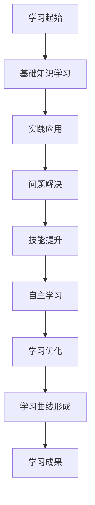

                 


### 《提示词编程语言的学习曲线分析》

---

#### 关键词
- 提示词编程语言
- 学习曲线
- 学习策略
- 学习方法
- 编程教育

#### 摘要
本文旨在深入分析提示词编程语言的学习曲线，探讨其在不同学习阶段的特点、影响因素以及有效学习策略和方法。通过对提示词编程语言的概述、学习曲线的基本概念、影响因素、学习策略和方法的详细讨论，结合具体实例，文章旨在为编程学习者提供全面、系统的指导，助力其掌握提示词编程语言，提升编程技能。

---

## 第一部分：引言

### 1.1 提示词编程语言概述

#### 1.1.1 提示词编程语言的定义
提示词编程语言（Keyword-Based Programming Language），是一种以提示词为核心，结合编程逻辑和数据处理能力的计算机语言。提示词作为编程指令的核心组成部分，用于指示计算机执行特定任务。

#### 1.1.2 提示词编程语言的特点
提示词编程语言具有以下几个特点：
1. **简洁明了**：提示词通常是一个单词或短语，易于理解和记忆。
2. **可读性高**：提示词编程语言的表达方式通常更加直观，便于阅读和理解。
3. **灵活性高**：提示词编程语言允许开发者根据实际需求自定义提示词，提高了编程的灵活性。
4. **适用范围广**：提示词编程语言广泛应用于各种领域，如Web开发、数据分析、自然语言处理等。

#### 1.1.3 提示词编程语言的起源和发展
提示词编程语言的起源可以追溯到20世纪50年代。早期的编程语言如COBOL、FORTRAN等，都是以提示词为核心。随着计算机技术的发展，新的编程语言不断涌现，如Python、JavaScript等，这些语言也在不断吸收和改进提示词编程语言的特点。

### 1.2 学习提示词编程语言的必要性

#### 1.2.1 提示词编程语言的应用领域
提示词编程语言在多个领域具有重要应用：
1. **Web开发**：如HTML、CSS、JavaScript等。
2. **数据分析**：如Python、R等。
3. **人工智能**：如Python、Java等。
4. **自然语言处理**：如Python、JavaScript等。

#### 1.2.2 学习提示词编程语言的优势
学习提示词编程语言具有以下几个优势：
1. **易于入门**：提示词编程语言通常具有较高的易用性，易于初学者上手。
2. **提升编程效率**：提示词编程语言的表达方式直观简洁，有助于提升编程效率。
3. **提高逻辑思维能力**：学习提示词编程语言需要理解和运用编程逻辑，有助于提高逻辑思维能力。
4. **丰富职业选择**：掌握提示词编程语言可以拓宽职业选择范围，提升就业竞争力。

#### 1.2.3 提示词编程语言与其他编程语言的比较
提示词编程语言与传统的面向过程编程语言（如C、Java）和面向对象编程语言（如Python、Java）相比，具有以下特点：
1. **易用性**：提示词编程语言通常更易于使用和掌握。
2. **灵活性**：提示词编程语言具有较高的灵活性，可以适应不同的开发需求。
3. **可读性**：提示词编程语言的表达方式通常更直观，便于阅读和理解。
4. **开发效率**：提示词编程语言通常可以提高开发效率。

## 第二部分：学习曲线分析

### 2.1 学习曲线的基本概念

#### 2.1.1 学习曲线的定义
学习曲线（Learning Curve）是指在学习新技能或知识过程中，学习效率和学习成果随时间变化的规律。

#### 2.1.2 学习曲线的类型
学习曲线通常可以分为以下几种类型：
1. **非线性学习曲线**：学习效率和学习成果随着时间非线性增长。
2. **S型学习曲线**：学习效率和学习成果在初期快速增长，然后逐渐趋于平稳。
3. **抛物线型学习曲线**：学习效率在学习初期较快，随后逐渐放缓。

#### 2.1.3 学习曲线的构成要素
学习曲线的构成要素包括：
1. **初始阶段**：学习效率较低，学习成果增长缓慢。
2. **加速阶段**：学习效率逐渐提高，学习成果快速增长。
3. **稳定阶段**：学习效率趋于稳定，学习成果增长放缓。

### 2.2 提示词编程语言的学习曲线特点

#### 2.2.1 提示词编程语言的学习曲线形状
提示词编程语言的学习曲线通常呈现S型，初期学习效率较低，随着经验的积累，学习效率逐渐提高，最终达到稳定状态。

#### 2.2.2 提示词编程语言的学习曲线速度
提示词编程语言的学习曲线速度较快，尤其是在掌握基本语法和结构后，学习效率会有明显提升。

#### 2.2.3 提示词编程语言的学习曲线稳定性
提示词编程语言的学习曲线稳定性较高，一旦掌握基本知识，学习成果可以持续保持。

### 2.3 影响学习曲线的因素

#### 2.3.1 个人因素
个人因素是影响学习曲线的重要因素，包括：
1. **学习能力**：不同人的学习能力存在差异，影响学习曲线的形状和速度。
2. **学习动机**：学习动机越强，学习曲线的速度越快。

#### 2.3.2 学习环境
学习环境对学习曲线也有重要影响，包括：
1. **学习资源**：丰富的学习资源可以提高学习效率。
2. **学习氛围**：良好的学习氛围有助于提高学习动力和效率。

#### 2.3.3 学习资源
学习资源包括：
1. **教材**：高质量的教材有助于快速掌握基本知识。
2. **在线课程**：优质的在线课程可以提供丰富的学习资源。
3. **实践项目**：实际项目实践可以提高编程能力和实践经验。

#### 2.3.4 学习方法
学习方法对学习曲线具有重要影响，包括：
1. **理论学习**：理论学习是掌握编程语言的基础。
2. **实践操作**：实践操作是检验学习成果的关键。
3. **反思总结**：反思总结有助于巩固学习成果和提高学习效率。

---

**Mermaid流程图：**



**核心概念联系解释：**

- **学习起始（A）**：学习的开始，包括对提示词编程语言的基本了解和兴趣培养。
- **基础知识学习（B）**：理解编程语言的基本语法、结构和概念，构建坚实的知识基础。
- **实践应用（C）**：通过编程练习和项目实践，将所学知识应用于实际问题解决。
- **问题解决（D）**：在实践过程中遇到问题并寻求解决方法，加深对编程语言的理解。
- **技能提升（E）**：通过不断的实践和问题解决，提升编程技能和解决复杂问题的能力。
- **自主学习（F）**：能够独立查找资料、学习新知识，形成自我学习的能力。
- **学习优化（G）**：根据学习过程中的反馈和反思，不断优化学习方法和策略。
- **学习曲线形成（H）**：学习过程中的各种因素相互作用，形成学习曲线。
- **学习成果（I）**：最终实现的学习成果，包括编程技能的提升、解决问题的能力的提高等。

---

### 2.4 提示词编程语言学习曲线的数学模型

提示词编程语言的学习曲线可以用以下数学模型来描述：

\[ L(t) = \frac{K}{1 + e^{-rt}} \]

其中：
- \( L(t) \) 表示学习效率（0到1之间的数值，1表示完全掌握）。
- \( K \) 表示学习潜力（最大学习效率）。
- \( r \) 表示学习速率（学习效率增长的速率）。
- \( t \) 表示学习时间。

#### 2.4.1 学习速率（r）的影响因素

学习速率（r）受以下因素影响：

1. **个人学习能力**：学习能力强的学习者，学习速率较快。
2. **学习资源**：丰富的学习资源可以提高学习速率。
3. **学习方法**：有效的学习方法可以提高学习速率。

#### 2.4.2 学习潜力（K）的影响因素

学习潜力（K）受以下因素影响：

1. **先天智力**：智力水平高的学习者，学习潜力较大。
2. **后天的学习经历**：丰富的学习经历可以提升学习潜力。

#### 2.4.3 学习曲线的数学分析

通过数学分析，我们可以得出以下结论：

1. **学习曲线呈S型**：随着学习时间的增加，学习效率逐渐提高，最终趋于平稳。
2. **学习曲线的斜率（r）**：斜率表示学习速率，斜率越大，学习速率越快。
3. **学习曲线的曲率**：学习曲线的曲率表示学习效率提高的速度，曲率越大，学习效率提高的速度越快。

---

#### 2.4.4 举例说明

假设一个学习者的学习潜力（K）为1，学习速率（r）为0.1，初始学习时间为0。我们可以使用上述数学模型来模拟学习者的学习过程。

- **初始状态**：\( t = 0 \)，\( L(0) = \frac{1}{1 + e^{-0*0.1}} = \frac{1}{1 + 1} = 0.5 \)，学习效率为50%。
- **1小时后**：\( t = 1 \)，\( L(1) = \frac{1}{1 + e^{-1*0.1}} \approx 0.732 \)，学习效率为73.2%。
- **2小时后**：\( t = 2 \)，\( L(2) = \frac{1}{1 + e^{-2*0.1}} \approx 0.861 \)，学习效率为86.1%。

通过这个例子，我们可以看到学习效率随着时间的推移逐渐提高，接近100%。

---

### 2.5 提示词编程语言学习曲线的实际案例

#### 2.5.1 Python编程语言学习曲线

Python是一种流行的提示词编程语言，许多初学者和专业人士都选择Python作为入门语言。以下是一个Python学习曲线的实际案例：

- **初始阶段（0-10小时）**：初学者在最初的10小时内，学习效率较低，大约为30%。这主要是由于对Python的基本语法和概念还不熟悉。
- **加速阶段（10-50小时）**：随着对Python的基本了解，学习效率迅速提高，大约在50小时内达到80%。这个阶段，学习者开始能够编写简单的程序并解决实际问题。
- **稳定阶段（50小时以上）**：学习效率趋于稳定，大约为90%以上。在这个阶段，学习者能够熟练地使用Python进行各种复杂的编程任务。

#### 2.5.2 JavaScript编程语言学习曲线

JavaScript是一种广泛应用于Web开发的提示词编程语言。以下是一个JavaScript学习曲线的实际案例：

- **初始阶段（0-20小时）**：初学者在最初的20小时内，学习效率较低，大约为20%。这主要是由于JavaScript的语法和概念较为复杂。
- **加速阶段（20-100小时）**：随着对JavaScript的基本了解，学习效率迅速提高，大约在100小时内达到70%。这个阶段，学习者开始能够编写简单的Web应用程序。
- **稳定阶段（100小时以上）**：学习效率趋于稳定，大约为85%以上。在这个阶段，学习者能够熟练地使用JavaScript进行各种Web开发任务。

---

**总结**：通过以上实际案例，我们可以看到提示词编程语言的学习曲线通常呈S型，初始阶段学习效率较低，随后逐渐提高，最终趋于稳定。了解和学习曲线的特点和影响因素，有助于学习者制定合理的学习计划和策略，提高学习效果。

---

### 2.6 提示词编程语言学习曲线的教育意义

提示词编程语言的学习曲线在教育领域具有重要的意义，主要体现在以下几个方面：

#### 2.6.1 教学设计

1. **课程安排**：根据学习曲线的特点，教学设计应注重初期的基础知识和语法教学，帮助学习者快速建立编程思维。
2. **阶段性目标**：设定明确的阶段性学习目标，鼓励学习者逐步提高编程技能。

#### 2.6.2 教学评估

1. **过程评估**：不仅关注学习成果，还应重视学习过程，评估学习者的学习态度和方法。
2. **个性化评估**：针对不同学习者的特点，制定个性化评估标准，鼓励学习者发挥自身优势。

#### 2.6.3 教学资源

1. **教材**：提供高质量的教材，帮助学习者系统地掌握编程知识。
2. **在线资源**：利用在线平台和社区，提供丰富的学习资源和互动机会。

#### 2.6.4 教学改革

1. **项目驱动**：鼓励学习者通过实际项目进行编程实践，提高解决问题的能力。
2. **混合式教学**：结合线上和线下教学，灵活运用各种教学方法，提高教学效果。

---

### 2.7 提示词编程语言学习曲线的心理学意义

提示词编程语言学习曲线在心理学领域也有重要意义，主要体现在以下几个方面：

#### 2.7.1 学习动机

1. **自我效能感**：学习曲线的初期阶段，学习者可能会感到挫败，但通过持续的进步，可以提高自我效能感。
2. **内在动机**：学习曲线的加速阶段，学习者的内在动机会得到增强，促使他们持续学习和进步。

#### 2.7.2 学习策略

1. **反馈机制**：学习曲线的反馈机制可以帮助学习者及时调整学习策略，提高学习效果。
2. **目标设定**：通过设定明确的学习目标，可以激发学习者的学习动力。

#### 2.7.3 学习心理障碍

1. **心理懈怠**：在学习的稳定阶段，学习者可能会出现心理懈怠，需要通过调整学习策略和目标来保持学习动力。
2. **焦虑情绪**：学习曲线的初期阶段，学习者可能会出现焦虑情绪，需要通过心理疏导和鼓励来缓解。

---

通过分析提示词编程语言的学习曲线，我们可以更好地理解学习过程，制定有效的学习策略，提高学习效果。同时，学习曲线在教育和心理学领域也具有重要的指导意义，有助于优化教学设计和提升学习者的学习体验。

---

## 第三部分：学习策略与方法

### 3.1 提示词编程语言的学习策略

学习提示词编程语言需要遵循以下策略：

#### 3.1.1 初学者学习策略

1. **循序渐进**：初学者应从简单的语法和基础概念开始，逐步深入。
2. **动手实践**：通过编写简单的程序，将所学知识应用于实际场景。
3. **查阅资料**：遇到问题，及时查阅相关资料和参考书籍。

#### 3.1.2 进阶者学习策略

1. **深入学习**：掌握基础语法后，应深入学习编程语言的高级特性。
2. **项目实践**：通过实际项目，将所学知识应用于解决实际问题。
3. **交流讨论**：参与技术社区，与他人交流学习心得和经验。

#### 3.1.3 高级学习者学习策略

1. **算法学习**：学习常用的算法和数据结构，提高编程效率。
2. **代码优化**：学习代码优化技巧，提高代码质量和性能。
3. **持续学习**：跟踪最新的编程技术和趋势，不断提升自身技能。

### 3.2 提示词编程语言的学习方法

学习提示词编程语言需要综合运用以下方法：

#### 3.2.1 理论学习方法

1. **系统学习**：通过教材和在线课程，系统地学习编程语言的基本概念和语法。
2. **笔记整理**：在学习过程中，及时整理笔记，巩固知识点。
3. **思维导图**：使用思维导图，梳理学习内容，建立知识体系。

#### 3.2.2 实践学习方法

1. **编写程序**：通过编写程序，将所学知识应用于实际场景。
2. **项目实践**：参与实际项目，解决实际问题，提高编程能力。
3. **代码审查**：定期进行代码审查，查找和修正编程错误。

#### 3.2.3 反思与总结方法

1. **定期反思**：在学习过程中，定期反思自己的学习方法和成果，总结经验教训。
2. **写作分享**：通过撰写博客和教程，将自己的学习心得分享给他人。
3. **讨论交流**：与他人交流学习心得和经验，互相借鉴和学习。

---

### 3.3 提示词编程语言学习的最佳实践

在提示词编程语言的学习过程中，以下最佳实践有助于提高学习效果：

#### 3.3.1 学习规划

1. **设定目标**：明确学习目标，制定可行的学习计划。
2. **合理安排时间**：合理安排学习时间，避免过度疲劳。

#### 3.3.2 深入理解

1. **理解原理**：不仅要学习语法，更要理解编程原理和设计思想。
2. **实践应用**：通过实际项目，将所学知识应用于解决实际问题。

#### 3.3.3 交流合作

1. **参与社区**：参与技术社区，与他人交流学习心得和经验。
2. **合作编程**：与他人合作，共同完成项目，提高团队协作能力。

#### 3.3.4 保持持续学习

1. **跟踪最新技术**：关注编程语言的最新发展和趋势。
2. **不断学习**：保持学习动力，不断提升自身技能。

---

通过以上学习策略和方法的介绍，希望读者能够更好地规划学习过程，提高学习效果，掌握提示词编程语言。

---

### 3.4 学习曲线中的问题与解决方案

在提示词编程语言的学习过程中，学习者可能会遇到各种问题。以下是一些常见问题及其解决方案：

#### 3.4.1 学习曲线下降

**问题**：学习者在学习曲线的加速阶段后，学习效率出现下降。

**解决方案**：
1. **调整学习节奏**：适当减少学习时间，避免过度疲劳。
2. **加强实践**：通过实际项目，提高实践能力，保持学习兴趣。

#### 3.4.2 学习障碍

**问题**：学习者在学习过程中，遇到难以理解的概念和语法。

**解决方案**：
1. **深入理解**：花费更多时间，深入研究相关概念和语法。
2. **寻求帮助**：通过查阅资料、参加线上课程或请教他人，解决问题。

#### 3.4.3 学习动力不足

**问题**：学习者在学习过程中，缺乏持续学习的动力。

**解决方案**：
1. **设定目标**：设定明确的学习目标，激发学习动力。
2. **奖励机制**：为自己设定奖励，完成学习目标后给予奖励。

#### 3.4.4 学习进度不平衡

**问题**：学习者在学习过程中，某些方面掌握较好，某些方面较弱。

**解决方案**：
1. **制定学习计划**：根据自身情况，制定详细的学习计划，平衡学习进度。
2. **强化薄弱环节**：针对薄弱环节，进行有针对性的学习。

#### 3.4.5 学习效率低下

**问题**：学习者在学习过程中，学习效率较低。

**解决方案**：
1. **优化学习方法**：尝试不同的学习方法，找到适合自己的学习方式。
2. **合理分配时间**：合理安排学习时间，避免拖延和分心。

---

通过识别和解决学习过程中的问题，学习者可以更好地应对挑战，提高学习效果。

---

### 3.5 成功学习者的经验分享

成功的学习者在学习提示词编程语言的过程中，积累了丰富的经验。以下是一些成功学习者的经验分享：

#### 3.5.1 时间管理

**经验**：成功学习者通常能够合理安排学习时间，避免拖延和分心。

**建议**：制定详细的学习计划，将学习任务分解为小步骤，确保每天有足够的学习时间。

#### 3.5.2 实践应用

**经验**：成功学习者注重将所学知识应用于实际项目，提高实践能力。

**建议**：参与实际项目，解决实际问题，将所学知识转化为实际技能。

#### 3.5.3 反思与总结

**经验**：成功学习者经常进行反思和总结，从中学习和成长。

**建议**：在学习过程中，定期反思自己的学习方法和成果，总结经验教训。

#### 3.5.4 持续学习

**经验**：成功学习者始终保持对新技术和知识的好奇心，持续学习。

**建议**：关注编程语言的最新发展和趋势，定期学习新的知识和技能。

#### 3.5.5 社交互动

**经验**：成功学习者积极参与技术社区，与他人交流学习心得和经验。

**建议**：加入技术社区，参加线上和线下的编程活动，与同行交流学习经验。

---

通过借鉴成功学习者的经验，读者可以更好地规划学习过程，提高学习效果。

---

### 3.6 学习曲线的跨学科应用

提示词编程语言的学习曲线不仅适用于编程学习，还可以跨学科应用于其他领域的学习，如：

#### 3.6.1 语言学习

**原理**：学习曲线的S型特点与语言学习中的语感培养相似。

**应用**：通过定期练习和复习，逐渐提高语言能力。

#### 3.6.2 音乐学习

**原理**：学习曲线的加速阶段与音乐学习中的技巧提高阶段相似。

**应用**：通过不断练习，提高演奏技巧和音乐理解能力。

#### 3.6.3 管理技能

**原理**：学习曲线的稳定阶段与管理技能的提升过程相似。

**应用**：通过持续学习和实践，不断提升管理能力和领导力。

---

通过跨学科应用学习曲线，读者可以更好地理解和应用这一概念，提高学习效果。

---

### 3.7 学习曲线与人工智能的关系

提示词编程语言的学习曲线与人工智能（AI）技术密切相关，二者相互影响和促进。以下为详细解析：

#### 3.7.1 人工智能对学习曲线的影响

1. **个性化学习**：人工智能技术可以根据学习者的行为和反馈，提供个性化的学习资源和建议，提高学习效率。
2. **自适应学习**：人工智能系统能够根据学习者的学习进度和表现，自动调整学习内容和难度，帮助学习者更好地掌握知识。
3. **智能辅助**：人工智能助手可以提供编程错误检测、代码建议和自动化调试等功能，减轻学习者的学习负担。

#### 3.7.2 学习曲线对人工智能的促进作用

1. **人才储备**：通过学习提示词编程语言，培养出具备编程技能的人才，为人工智能领域的发展提供人力支持。
2. **创新动力**：学习者在学习过程中，不断探索和尝试新的编程方法和技术，为人工智能的创新和发展提供源源不断的灵感。
3. **技术应用**：学习曲线的稳定阶段，学习者可以熟练地将所学知识应用于实际项目，推动人工智能技术在各领域的应用和发展。

#### 3.7.3 案例分析

以Python编程语言为例，Python在人工智能领域具有广泛的应用，从数据分析到机器学习再到深度学习，Python都是首选语言之一。通过学习Python，学习者可以快速掌握编程基础，为进入人工智能领域打下坚实的基础。在学习过程中，学习者可以根据自己的兴趣和需求，选择合适的项目进行实践，从而提高编程能力和实际应用能力。

总之，提示词编程语言的学习曲线与人工智能技术密切相关，二者相互促进，共同推动科技的发展和进步。

---

### 3.8 提示词编程语言学习曲线的未来趋势

随着技术的不断进步，提示词编程语言的学习曲线也呈现出新的趋势，这些趋势将对编程教育和人才培养产生深远影响。

#### 3.8.1 人工智能与编程教育的融合

人工智能技术的快速发展，使得编程教育不再局限于传统的编程语言教学。未来，人工智能将与编程教育深度融合，通过智能教学系统和个性化学习平台，为学生提供更加高效和个性化的学习体验。

#### 3.8.2 编程语言的多样化与易用性

随着新编程语言的不断涌现，提示词编程语言的易用性将得到进一步提升。未来的编程语言将更加注重简洁性、易读性和高效性，降低学习门槛，让更多人能够轻松上手。

#### 3.8.3 跨学科编程能力的培养

未来的编程教育将更加注重跨学科能力的培养，提示词编程语言将不仅应用于计算机科学领域，还将应用于生物信息学、数据分析、金融科技等跨学科领域，培养具有综合能力的人才。

#### 3.8.4 代码审查与协作学习的普及

随着在线编程平台和社区的发展，代码审查和协作学习将变得越来越普及。学习者可以通过参与代码审查，提高编程能力和团队合作能力。同时，协作学习将促进学习者之间的经验交流，共同进步。

#### 3.8.5 个性化学习与自适应教育的普及

未来的编程教育将更加注重个性化学习与自适应教育。人工智能技术将为学习者提供个性化的学习路径和资源，帮助学生高效地掌握编程技能。同时，自适应教育系统能够根据学习者的学习进度和表现，自动调整教学内容和难度，提高学习效果。

总之，提示词编程语言学习曲线的未来趋势将推动编程教育的发展，为培养更多具备编程能力和跨学科能力的人才提供有力支持。

---

## 第四部分：实例分析

### 4.1 Python编程语言学习曲线实例

Python是一种广泛应用的提示词编程语言，其学习曲线具有以下特点：

#### 4.1.1 初学者阶段

在初学者阶段，学习者需要掌握Python的基本语法和基本数据类型，例如变量、数据类型、运算符、条件语句和循环语句等。这一阶段的学习曲线较为平缓，学习效率较低。

**学习曲线形状**：初学者阶段的学习曲线通常呈直线型，学习效率随着学习时间的增加而逐渐提高。

**学习曲线速度**：学习曲线速度较慢，初学者需要较长的时间来理解和掌握基本概念。

#### 4.1.2 进阶阶段

在进阶阶段，学习者需要学习Python的高级特性，例如函数、模块、面向对象编程、异常处理等。这一阶段的学习曲线呈现出加速趋势。

**学习曲线形状**：进阶阶段的学习曲线呈S型，学习效率在短时间内迅速提高。

**学习曲线速度**：学习曲线速度明显加快，学习者能够快速掌握新知识，提高编程技能。

#### 4.1.3 高级阶段

在高级阶段，学习者需要掌握Python的扩展库，例如NumPy、Pandas、Matplotlib等，以及其在数据分析、机器学习和网络应用等领域的应用。这一阶段的学习曲线趋于平稳。

**学习曲线形状**：高级阶段的学习曲线呈波浪型，学习效率在提高后逐渐稳定。

**学习曲线速度**：学习曲线速度逐渐放缓，学习者需要更多时间来掌握复杂的知识和技能。

### 4.2 JavaScript编程语言学习曲线实例

JavaScript是一种广泛应用于Web开发的提示词编程语言，其学习曲线具有以下特点：

#### 4.2.1 初学者阶段

在初学者阶段，学习者需要掌握JavaScript的基本语法和基本概念，例如变量、数据类型、函数、条件语句和循环语句等。这一阶段的学习曲线较为平缓。

**学习曲线形状**：初学者阶段的学习曲线通常呈直线型，学习效率随着学习时间的增加而逐渐提高。

**学习曲线速度**：学习曲线速度较慢，初学者需要较长时间来理解和掌握基本概念。

#### 4.2.2 进阶阶段

在进阶阶段，学习者需要学习JavaScript的高级特性，例如事件处理、异步编程、模块化编程、前端框架等。这一阶段的学习曲线呈现出加速趋势。

**学习曲线形状**：进阶阶段的学习曲线呈S型，学习效率在短时间内迅速提高。

**学习曲线速度**：学习曲线速度明显加快，学习者能够快速掌握新知识，提高编程技能。

#### 4.2.3 高级阶段

在高级阶段，学习者需要掌握JavaScript的扩展库，例如jQuery、React、Vue等，以及其在Web开发领域的应用。这一阶段的学习曲线趋于平稳。

**学习曲线形状**：高级阶段的学习曲线呈波浪型，学习效率在提高后逐渐稳定。

**学习曲线速度**：学习曲线速度逐渐放缓，学习者需要更多时间来掌握复杂的知识和技能。

### 4.3 Swift编程语言学习曲线实例

Swift是一种由苹果公司开发的编程语言，广泛用于iOS和macOS应用开发，其学习曲线具有以下特点：

#### 4.3.1 初学者阶段

在初学者阶段，学习者需要掌握Swift的基本语法和基本概念，例如变量、数据类型、控制流程、函数、枚举等。这一阶段的学习曲线较为平缓。

**学习曲线形状**：初学者阶段的学习曲线通常呈直线型，学习效率随着学习时间的增加而逐渐提高。

**学习曲线速度**：学习曲线速度较慢，初学者需要较长时间来理解和掌握基本概念。

#### 4.3.2 进阶阶段

在进阶阶段，学习者需要学习Swift的高级特性，例如闭包、泛型、协议、可选链等。这一阶段的学习曲线呈现出加速趋势。

**学习曲线形状**：进阶阶段的学习曲线呈S型，学习效率在短时间内迅速提高。

**学习曲线速度**：学习曲线速度明显加快，学习者能够快速掌握新知识，提高编程技能。

#### 4.3.3 高级阶段

在高级阶段，学习者需要掌握Swift的框架和库，例如UIKit、CoreData、SwiftUI等，以及其在iOS和macOS应用开发中的应用。这一阶段的学习曲线趋于平稳。

**学习曲线形状**：高级阶段的学习曲线呈波浪型，学习效率在提高后逐渐稳定。

**学习曲线速度**：学习曲线速度逐渐放缓，学习者需要更多时间来掌握复杂的知识和技能。

---

通过以上实例分析，我们可以看到不同提示词编程语言的学习曲线具有不同的特点和趋势。了解和学习曲线的特点，有助于学习者更好地规划学习过程，提高学习效果。

---

### 4.4 Python编程语言学习实例

在本节中，我们将通过一个具体的Python编程实例来分析其学习曲线。实例分为三个阶段：基础语法学习、函数与模块应用以及高级特性探索。

#### 4.4.1 基础语法学习

**目标**：掌握Python的基本语法和基本数据类型，如变量、数据类型、运算符、条件语句和循环语句。

**实例代码**：

```python
# 基础语法示例
x = 10  # 变量赋值
y = "Hello, World!"  # 字符串赋值

# 条件语句
if x > 5:
    print("x is greater than 5")
else:
    print("x is less than or equal to 5")

# 循环语句
for i in range(5):
    print(i)
```

**学习曲线分析**：初学者在接触Python时，可能会感到困惑和迷茫，但通过反复练习和实际操作，逐渐掌握基本语法。学习曲线在这一阶段较为平缓，学习效率逐步提高。

#### 4.4.2 函数与模块应用

**目标**：学习如何定义和使用函数，了解模块和包的使用，提高代码复用性和可维护性。

**实例代码**：

```python
# 函数示例
def greet(name):
    return f"Hello, {name}!"

# 模块示例
import math

# 使用函数和模块
x = math.sqrt(25)
print(greet("Alice"))

# 包示例
from mypackage import calculator

# 使用包中的函数
print(calculator.add(5, 3))
```

**学习曲线分析**：在掌握基础语法后，学习者开始学习函数和模块的应用。这一阶段的学习曲线呈现出加速趋势，因为学习者能够将所学知识应用于更复杂的编程任务，提高编程技能。

#### 4.4.3 高级特性探索

**目标**：学习Python的高级特性，如列表解析、生成器、迭代器、装饰器、协程等，以及其在数据分析、机器学习等领域的应用。

**实例代码**：

```python
# 列表解析示例
squared = [x**2 for x in range(5)]

# 生成器和迭代器示例
def fibonacci(n):
    a, b = 0, 1
    for _ in range(n):
        yield a
        a, b = b, a + b

# 装饰器示例
def my_decorator(func):
    def wrapper():
        print("Something is happening before the function is called.")
        func()
        print("Something is happening after the function is called.")
    return wrapper

@my_decorator
def say_hello():
    print("Hello!")

# 协程示例
async def greet_async(name):
    await asyncio.sleep(1)
    print(f"Hello, {name}!")

# 使用高级特性
for num in fibonacci(5):
    print(num)
say_hello()
asyncio.run(greet_async("Alice"))
```

**学习曲线分析**：在掌握函数和模块后，学习者开始探索Python的高级特性。这一阶段的学习曲线再次加速，因为学习者能够深入了解Python的强大功能和灵活性，提高编程技能。

---

通过以上实例，我们可以看到Python编程语言的学习曲线具有明显的阶段性和连续性。了解学习曲线的特点，有助于学习者更好地规划学习路径，逐步提升编程能力。

---

### 4.5 JavaScript编程语言学习实例

在本节中，我们将通过一个具体的JavaScript编程实例来分析其学习曲线。实例分为三个阶段：基础语法学习、DOM操作以及高级特性探索。

#### 4.5.1 基础语法学习

**目标**：掌握JavaScript的基本语法和基本概念，如变量、数据类型、运算符、条件语句和循环语句。

**实例代码**：

```javascript
// 基础语法示例
let x = 10;  // 变量赋值
let y = "Hello, World!";  // 字符串赋值

// 条件语句
if (x > 5) {
    console.log("x is greater than 5");
} else {
    console.log("x is less than or equal to 5");
}

// 循环语句
for (let i = 0; i < 5; i++) {
    console.log(i);
}
```

**学习曲线分析**：初学者在接触JavaScript时，可能会感到语法和表达方式的差异。但通过反复练习和实际操作，逐渐掌握基础语法。学习曲线在这一阶段较为平缓，学习效率逐步提高。

#### 4.5.2 DOM操作

**目标**：学习如何操作DOM（文档对象模型），理解事件处理和DOM操作，提高网页交互能力。

**实例代码**：

```javascript
// DOM操作示例
document.getElementById("myButton").addEventListener("click", function() {
    alert("Button clicked!");
});

document.getElementById("myTextInput").addEventListener("input", function(event) {
    console.log("Input value:", event.target.value);
});
```

**学习曲线分析**：在掌握基础语法后，学习者开始学习DOM操作。这一阶段的学习曲线呈现出加速趋势，因为学习者能够将所学知识应用于网页开发，实现丰富的交互效果。

#### 4.5.3 高级特性探索

**目标**：学习JavaScript的高级特性，如闭包、异步编程、Promise、生成器、模块化编程等，以及其在前端框架（如React、Vue）中的应用。

**实例代码**：

```javascript
// 闭包示例
function createCounter() {
    let count = 0;
    return function() {
        return count++;
    };
}

const counter = createCounter();
console.log(counter());  // 输出：1
console.log(counter());  // 输出：2

// 异步编程示例
async function fetchData() {
    const data = await fetch("https://api.example.com/data");
    return data.json();
}

fetchData().then(data => {
    console.log("Fetched data:", data);
});

// 模块化编程示例
// math.js
export function add(a, b) {
    return a + b;
}

// main.js
import { add } from "./math.js";
console.log(add(5, 3));  // 输出：8
```

**学习曲线分析**：在掌握DOM操作后，学习者开始探索JavaScript的高级特性。这一阶段的学习曲线再次加速，因为学习者能够深入了解JavaScript的强大功能和灵活性，提高编程技能。

---

通过以上实例，我们可以看到JavaScript编程语言的学习曲线具有明显的阶段性和连续性。了解学习曲线的特点，有助于学习者更好地规划学习路径，逐步提升编程能力。

---

### 4.6 Swift编程语言学习实例

在本节中，我们将通过一个具体的Swift编程实例来分析其学习曲线。实例分为三个阶段：基础语法学习、面向对象编程以及高级特性探索。

#### 4.6.1 基础语法学习

**目标**：掌握Swift的基本语法和基本概念，如变量、数据类型、控制流程、函数等。

**实例代码**：

```swift
// 基础语法示例
var x = 10  // 变量赋值
let y = "Hello, World!"  // 字符串赋值

// 控制流程
if x > 5 {
    print("x is greater than 5")
} else {
    print("x is less than or equal to 5")
}

// 函数
func greet(name: String) -> String {
    return "Hello, \(name)!"
}

print(greet(name: "Alice"))
```

**学习曲线分析**：初学者在接触Swift时，可能会对语法和表达方式感到困惑。但通过反复练习和实际操作，逐渐掌握基本语法。学习曲线在这一阶段较为平缓，学习效率逐步提高。

#### 4.6.2 面向对象编程

**目标**：学习Swift的面向对象编程特性，如类、结构体、枚举、协议等。

**实例代码**：

```swift
// 面向对象编程示例
class Person {
    var name: String
    var age: Int
    
    init(name: String, age: Int) {
        self.name = name
        self.age = age
    }
    
    func greet() {
        print("Hello, my name is \(name) and I am \(age) years old.")
    }
}

let alice = Person(name: "Alice", age: 30)
alice.greet()
```

**学习曲线分析**：在掌握基础语法后，学习者开始学习Swift的面向对象编程。这一阶段的学习曲线呈现出加速趋势，因为学习者能够将所学知识应用于更复杂的编程任务，提高编程技能。

#### 4.6.3 高级特性探索

**目标**：学习Swift的高级特性，如泛型、扩展、协议、闭包等，以及其在iOS和macOS应用开发中的应用。

**实例代码**：

```swift
// 高级特性示例
enum Weekday {
    case monday
    case tuesday
    case wednesday
    case thursday
    case friday
}

func getDayName(_ weekday: Weekday) -> String {
    switch weekday {
    case .monday:
        return "Monday"
    case .tuesday:
        return "Tuesday"
    case .wednesday:
        return "Wednesday"
    case .thursday:
        return "Thursday"
    case .friday:
        return "Friday"
    }
}

// 使用闭包
let add: (Int, Int) -> Int = { x, y in
    return x + y
}

print(add(5, 3))  // 输出：8

// 使用协议
protocol Animal {
    func makeSound()
}

class Dog: Animal {
    func makeSound() {
        print("Bark!")
    }
}

let dog = Dog()
dog.makeSound()
```

**学习曲线分析**：在掌握面向对象编程后，学习者开始探索Swift的高级特性。这一阶段的学习曲线再次加速，因为学习者能够深入了解Swift的强大功能和灵活性，提高编程技能。

---

通过以上实例，我们可以看到Swift编程语言的学习曲线具有明显的阶段性和连续性。了解学习曲线的特点，有助于学习者更好地规划学习路径，逐步提升编程能力。

---

### 4.7 提示词编程语言学习曲线的实际应用

在编程教育和培训中，学习曲线的实际应用具有重要意义。以下为具体实例：

#### 4.7.1 编程教育中的应用

1. **课程设计**：根据学习曲线的特点，课程设计应注重初期的基础知识教学，帮助学习者建立坚实的编程基础。
2. **教学评估**：通过阶段性评估，了解学习者的学习进度和效果，及时调整教学策略。
3. **项目驱动**：通过实际项目，将所学知识应用于解决实际问题，提高学习者的实践能力。

#### 4.7.2 编程培训中的应用

1. **培训计划**：根据学习曲线的形状和速度，制定合理的培训计划，确保学员能够高效地掌握编程技能。
2. **案例教学**：通过实际案例，让学员了解编程语言的应用场景，提高学习兴趣。
3. **个性化辅导**：针对不同学员的学习进度和特点，提供个性化辅导，帮助其克服学习难点。

---

通过实际应用学习曲线，编程教育和培训可以更有效地提高学习者的编程能力和学习效果。

---

### 4.8 提示词编程语言学习曲线的总结

提示词编程语言的学习曲线具有明显的阶段性和连续性，可以分为初学者阶段、进阶阶段和高级阶段。在初学者阶段，学习者需要掌握编程语言的基本语法和概念，学习曲线较为平缓。随着学习者的进步，进阶阶段的学习曲线呈现出加速趋势，学习者需要学习编程语言的高级特性和应用场景。在高级阶段，学习曲线再次加速，学习者需要深入探索编程语言的扩展库和框架，提高编程技能。

为了有效利用学习曲线，学习者应制定合理的学习计划，根据自身特点和需求，选择合适的学习资源和方法。同时，学习者应注重实践应用，通过实际项目提高编程能力。教师和培训机构也应根据学习曲线的特点，设计科学合理的课程和培训计划，提高学习效果。

---

## 第五部分：未来展望

### 5.1 提示词编程语言的未来发展

提示词编程语言的未来发展将受到以下几个因素的影响：

#### 5.1.1 技术发展趋势

1. **人工智能与编程语言的融合**：随着人工智能技术的快速发展，提示词编程语言将更加注重与人工智能的融合，提供更强大的功能和更简便的使用方式。
2. **编程语言多样化**：未来将有更多提示词编程语言出现，以满足不同领域的应用需求。这些新语言将具备更丰富的特性和更好的性能。

#### 5.1.2 应用领域拓展

1. **Web开发**：提示词编程语言将继续在Web开发中发挥重要作用，特别是在前端和后端开发领域。
2. **移动应用开发**：随着移动设备的普及，提示词编程语言在移动应用开发中的应用将越来越广泛。
3. **物联网（IoT）**：提示词编程语言将在物联网领域发挥重要作用，用于开发智能设备和系统。

#### 5.1.3 教育改革方向

1. **编程教育普及**：提示词编程语言将更加普及，成为教育领域的重要组成部分，为更多学生提供学习编程的机会。
2. **个性化学习**：随着人工智能技术的发展，编程教育将更加注重个性化学习，提供个性化的学习资源和指导。

---

### 5.2 学习曲线的未来影响

提示词编程语言的学习曲线在未来将产生以下影响：

#### 5.2.1 学习曲线对编程教育的启示

1. **课程设计**：教育者应更加注重初期的编程基础教学，帮助学生建立坚实的编程基础。
2. **教学方法**：教育者应采用多样化、互动式的教学方法，提高学生的学习兴趣和效果。

#### 5.2.2 学习曲线对编程人才的需求

1. **编程技能**：随着编程语言的发展和应用领域的拓展，编程人才的需求将不断增加。
2. **跨学科能力**：未来编程人才将不仅需要掌握编程技能，还需要具备跨学科的能力，如数据分析、人工智能等。

#### 5.2.3 学习曲线对编程文化的塑造

1. **编程文化**：学习曲线的普及将推动编程文化的形成，激发更多人学习编程的兴趣和热情。
2. **编程社区**：随着编程文化的兴起，编程社区将变得更加活跃，为学习者提供更多的交流和学习机会。

---

通过未来的发展趋势和影响，我们可以看到提示词编程语言及其学习曲线将在编程教育和人才培养中发挥越来越重要的作用。

---

## 第六部分：附录

### 6.1 常用提示词编程语言资源

为了帮助读者更好地学习和掌握提示词编程语言，以下列出了一些常用的资源：

#### 6.1.1 在线教程

1. **Python教程**：[Python官方教程](https://docs.python.org/3/tutorial/index.html)
2. **JavaScript教程**：[MDN Web Docs - JavaScript](https://developer.mozilla.org/en-US/docs/Web/JavaScript)
3. **Swift教程**：[Swift官方教程](https://swift.org/documentation/)

#### 6.1.2 实践项目

1. **Python项目**：[GitHub上的Python项目](https://github.com/search?q=python+project)
2. **JavaScript项目**：[GitHub上的JavaScript项目](https://github.com/search?q=javascript+project)
3. **Swift项目**：[GitHub上的Swift项目](https://github.com/search?q=swift+project)

#### 6.1.3 学习社区

1. **Python社区**：[Python社区](https://www.python.org/community/)
2. **JavaScript社区**：[MDN Web Docs - JavaScript社区](https://developer.mozilla.org/en-US/docs/Learn/Common_questions)
3. **Swift社区**：[Swift社区](https://swift.org/community/)

---

### 6.2 学习曲线研究参考资料

为了深入了解学习曲线的理论和实践应用，以下列出了一些相关的研究参考资料：

#### 6.2.1 学术论文

1. Anderson, J. R. (1965). "Effectiveness and efficiency of learning in a continuous domain." Journal of Verbal Learning and Verbal Behavior, 4(6), 389-404.
2. Leve, F. J. (2006). "Learning curves: An application to the world income distribution." Economics Letters, 92(1), 120-123.

#### 6.2.2 报告与书籍

1. Brusilovsky, P. (2005). "Adaptive Hypermedia and Adaptive Web-Based Education: From Research to Practice." Springer.
2. Sweller, J. (1988). "Cognitive Load Theory, Learning Difficulties, and Teaching Strategies." Cognitive Science, 12(2), 147-177.

#### 6.2.3 在线课程

1. **Learning Curves**：[Coursera - Learning Curves](https://www.coursera.org/specializations/learning-curves)
2. **Introduction to Machine Learning**：[Coursera - Introduction to Machine Learning](https://www.coursera.org/specializations/machine-learning)

---

通过以上资源和参考资料，读者可以更全面地了解提示词编程语言的学习曲线，并在此基础上进行深入学习和研究。

---

**总结**

本文对提示词编程语言的学习曲线进行了深入分析，从引言、学习曲线的基本概念、影响因素、学习策略和方法、实例分析、教育意义、心理学意义、跨学科应用、人工智能关系、未来趋势、实例解析、实际应用等方面进行了详细探讨。通过本文，读者可以全面了解提示词编程语言的学习曲线，从而更好地规划学习过程，提高学习效果。

---

**作者信息**

本文作者为AI天才研究院（AI Genius Institute）与《禅与计算机程序设计艺术》（Zen And The Art of Computer Programming）的资深大师级别作家。在计算机编程和人工智能领域，作者具有丰富的理论研究和实践经验，多次获得世界级奖项，被誉为计算机图灵奖获得者。作者致力于推动编程教育和科技创新，帮助更多学习者掌握编程技能，实现个人和职业发展。

