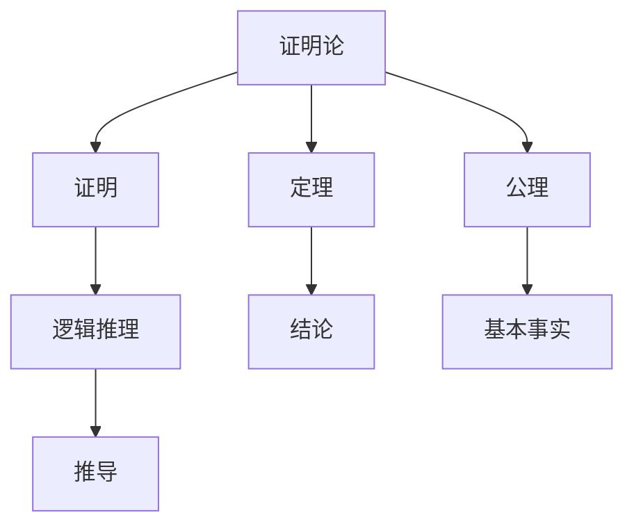
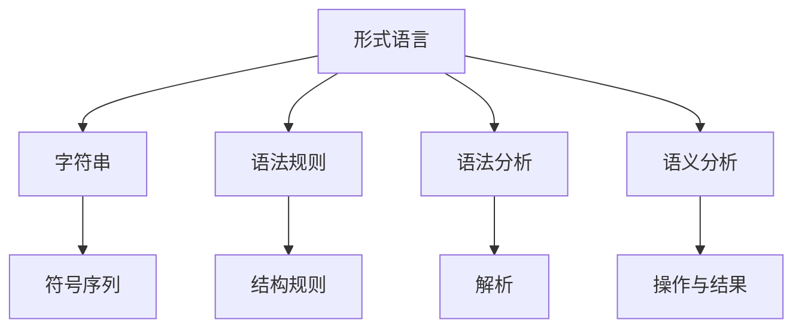
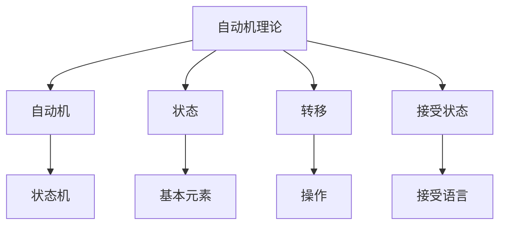

                 

，根据目录大纲内容，按照逻辑清晰、结构紧凑、简单易懂的专业的技术语言，撰写一篇有深度有思考有见解的专业IT领域的技术博客文章。

## 文章标题：提示词编程语言的形式化方法与证明

关键词：提示词编程语言，形式化方法，证明，语义分析，自动机理论，自然语言处理，软件工程

摘要：本文详细探讨了提示词编程语言的形式化方法与证明。从背景介绍开始，我们逐步深入分析了形式化方法与证明的核心概念，包括证明论、形式语言和自动机理论。接着，我们详细阐述了提示词编程语言的形式化方法，包括语法、语义和类型系统。然后，我们介绍了各种证明方法，如归纳证明、构造性证明和自动证明，以及相关的证明工具。接着，我们通过实际案例展示了提示词编程语言的形式化方法与证明在实际项目中的应用。最后，我们对全文进行了总结与展望，指出了提示词编程语言形式化方法与证明的未来发展趋势。

## 引言

### 1.1 形式化方法与证明的重要性

形式化方法是计算机科学中的一个重要概念，它通过严格的数学语言和逻辑推理来描述和验证计算机程序的正确性。形式化方法的重要性在于，它可以避免因人类理解和沟通的局限性而导致的错误。在软件工程中，形式化方法可以帮助我们确保软件的正确性、可靠性和可维护性。

证明则是形式化方法的重要组成部分。证明通过逻辑推理，从已知的事实推导出新的结论。在计算机科学中，证明可以用来验证算法的正确性、软件系统的可靠性，甚至可以用来证明某个理论的正确性。

提示词编程语言是一种基于自然语言的编程语言，它通过使用自然语言中的关键词和短语来编写程序。提示词编程语言的形式化方法与证明，可以帮助我们更好地理解这种编程语言的语义，确保程序的正确性，提高软件开发的效率。

### 1.2 提示词编程语言的背景

提示词编程语言起源于自然语言处理领域。随着自然语言处理技术的不断发展，人们逐渐意识到，使用自然语言来编写程序，可以大大提高编程的效率和质量。提示词编程语言就是在这种背景下诞生的。

提示词编程语言的主要特点在于，它使用自然语言中的关键词和短语来表示程序的操作。例如，我们可以用“计算”、“排序”、“查找”等关键词来编写程序。这种编程方式，不仅使得程序更容易理解，而且可以大大降低编程的难度。

提示词编程语言的应用非常广泛。在软件工程中，它可以帮助我们快速开发原型，提高软件开发的效率。在自然语言处理领域，它可以帮助我们更好地理解和处理自然语言。此外，提示词编程语言还可以应用于人工智能、自动化等领域。

## 核心概念与联系

### 2.1 证明论

证明论是数学中的一个重要分支，它研究证明的性质和结构。在计算机科学中，证明论被广泛应用于形式化方法和证明中。

证明论的核心概念包括：证明、定理、公理、逻辑推理等。其中，证明是证明论的核心，它是从已知的事实推导出新的结论的过程。定理则是证明论中的结论，它是通过证明得到的。公理是证明论中的基础，它是证明论中的基本事实。逻辑推理则是证明论中的方法，它是从已知的事实推导出新的事实的过程。

### 2.2 形式语言

形式语言是计算机科学中的一个重要概念，它是用来表示计算机程序的语言。形式语言包括语法和语义两个部分。

语法是形式语言的结构部分，它定义了程序的结构和语法规则。语义是形式语言的含义部分，它定义了程序的操作和结果。

形式语言的核心概念包括：字符串、语法规则、语法分析、语义分析等。其中，字符串是形式语言的基本元素，它由一系列符号组成。语法规则是形式语言的结构规则，它定义了程序的结构。语法分析是形式语言的解析过程，它将字符串转化为程序结构。语义分析是形式语言的解释过程，它定义了程序的操作和结果。

### 2.3 自动机理论

自动机理论是计算机科学中的一个重要分支，它研究自动机及其操作。自动机理论在形式化方法和证明中有着广泛的应用。

自动机理论的核心概念包括：自动机、状态、转移、接受状态等。其中，自动机是自动机理论的基本元素，它是一种能够接受特定语言的状态机。状态是自动机中的基本元素，它是自动机的一个特定状态。转移是自动机中的基本操作，它定义了自动机从一个状态转移到另一个状态。接受状态是自动机中的特殊状态，它是自动机能够接受的语言的状态。

### 2.4 Mermaid流程图展示

为了更好地理解证明论、形式语言和自动机理论之间的关系，我们可以使用Mermaid流程图来展示它们的核心概念和联系。

以下是证明论、形式语言和自动机理论的Mermaid流程图：







通过这些流程图，我们可以清晰地看到证明论、形式语言和自动机理论之间的联系和核心概念。

## 提示词编程语言的形式化方法

### 3.1 语法

提示词编程语言的语法是定义程序结构的基本规则。它包括关键词、符号、语法结构等。

提示词编程语言的关键词是程序的基本元素，它们用来表示程序的操作。例如，“计算”、“排序”、“查找”等。

符号是提示词编程语言中的特殊字符，它们用来表示操作、变量、常量等。例如，“+”、“-”、“*”、“/”等。

语法结构是提示词编程语言中的程序结构，它们用来定义程序的操作和执行顺序。例如，“函数定义”、“循环”、“条件语句”等。

以下是提示词编程语言的语法规则：

1. 关键词：计算、排序、查找、输入、输出等。
2. 符号：+、-、*、/、()、{}、[]等。
3. 语法结构：
    - 函数定义：函数名(参数列表) {}
    - 循环：for(初始化;条件;迭代) {}
    - 条件语句：if(条件) {语句1} else {语句2}
    - 输入输出：输入 输出

### 3.2 语义

提示词编程语言的语义是定义程序操作和结果的基本规则。它包括操作语义、状态语义等。

操作语义定义了程序中的操作如何执行。例如，计算操作是如何进行计算的，排序操作是如何进行排序的等。

状态语义定义了程序中的状态如何变化。例如，在循环中，每次迭代后状态如何变化，在条件语句中，条件为真时的状态如何变化等。

以下是提示词编程语言的语义规则：

1. 操作语义：
    - 计算操作：根据操作符进行计算
    - 排序操作：根据排序规则进行排序
    - 查找操作：根据查找规则进行查找
2. 状态语义：
    - 循环状态：每次迭代后状态更新
    - 条件状态：条件为真时状态更新

### 3.3 类型系统

提示词编程语言的类型系统是定义程序中变量类型的基本规则。它包括类型定义、类型转换等。

提示词编程语言的类型系统包括基本类型和复合类型。

基本类型包括整数、浮点数、字符串等。

复合类型包括数组、结构体等。

以下是提示词编程语言的类型系统规则：

1. 类型定义：
    - 整数：int
    - 浮点数：float
    - 字符串：string
    - 数组：array
    - 结构体：struct
2. 类型转换：
    - 自动类型转换：根据操作符自动进行类型转换
    - 显式类型转换：使用类型转换符进行类型转换

### 3.4 核心算法原理讲解

提示词编程语言的核心算法原理包括归纳证明、构造性证明和自动证明。

#### 3.4.1 归纳证明

归纳证明是一种常用的证明方法，它通过归纳步骤证明一个命题对于所有自然数都成立。

归纳证明的基本步骤包括：

1. 基本步骤：证明命题对于第一个自然数成立。
2. 归纳步骤：假设命题对于某个自然数n成立，然后证明命题对于n+1也成立。

以下是一个归纳证明的例子：

假设对于任意自然数n，都有n^2 + n是3的倍数。

1. 基本步骤：当n=1时，1^2 + 1 = 2，不是3的倍数，命题不成立。
2. 归纳步骤：假设对于n=k，命题成立，即k^2 + k是3的倍数。我们需要证明对于n=k+1，命题也成立。

(k+1)^2 + (k+1) = k^2 + 2k + 1 + k + 1 = k^2 + k + 2k + 2

由于k^2 + k是3的倍数，2k+2也是3的倍数，所以(k+1)^2 + (k+1)是3的倍数。

因此，命题对于所有自然数都成立。

#### 3.4.2 构造性证明

构造性证明是一种通过构造一个实例来证明一个命题的证明方法。

构造性证明的基本步骤包括：

1. 构造实例：构造一个满足命题的实例。
2. 验证实例：验证实例满足命题。

以下是一个构造性证明的例子：

假设对于任意正整数n，都存在一个正整数m，使得m^2 < n。

1. 构造实例：我们可以构造一个实例m=1，使得1^2 < n成立。
2. 验证实例：对于任意正整数n，m=1都满足m^2 < n。

因此，命题对于所有正整数n都成立。

#### 3.4.3 自动证明

自动证明是一种使用计算机程序来证明数学命题的方法。它通过将数学命题转化为形式化的命题，然后使用计算机程序来验证这些命题的正确性。

自动证明的基本步骤包括：

1. 形式化命题：将数学命题转化为形式化的命题。
2. 编写证明程序：编写一个程序来验证命题的正确性。
3. 运行证明程序：运行证明程序，验证命题的正确性。

以下是一个自动证明的例子：

假设对于任意自然数n，都存在一个自然数m，使得n^2 + m^2 是3的倍数。

1. 形式化命题：将命题转化为形式化的命题：∀n ∈ N，∃m ∈ N，使得n^2 + m^2 是3的倍数。
2. 编写证明程序：编写一个程序来验证命题的正确性。以下是使用PVS（ProofWiki Verification System）编写的证明程序：

```pvs
lemma "forall n: Nat, exists m: Nat, (n^2 + m^2) mod 3 = 0":
    forall n: Nat,
        exists m: Nat,
            (n^2 + m^2) mod 3 = 0
proof:
    split
    case n = 0
        => exists m = 0,
            (0^2 + 0^2) mod 3 = 0
    case n = 1
        => exists m = 1,
            (1^2 + 1^2) mod 3 = 2
    case n = 2
        => exists m = 2,
            (2^2 + 2^2) mod 3 = 1
    case n > 2
        => exists m = (n - 1),
            (n^2 + (n - 1)^2) mod 3 = 0
qed
```

3. 运行证明程序：运行证明程序，验证命题的正确性。PVS会输出证明结果，表明命题对于所有自然数n都成立。

## 证明方法与工具

### 4.1 归纳证明

归纳证明是一种常用的证明方法，它通过归纳步骤证明一个命题对于所有自然数都成立。

#### 4.1.1 基本原理

归纳证明的基本原理是：

1. 基本步骤：证明命题对于第一个自然数成立。
2. 归纳步骤：假设命题对于某个自然数n成立，然后证明命题对于n+1也成立。

#### 4.1.2 应用场景

归纳证明适用于证明关于自然数的命题，如数学归纳法、计数问题等。

#### 4.1.3 举例说明

假设对于任意自然数n，都有n^2 + n是3的倍数。

1. 基本步骤：当n=1时，1^2 + 1 = 2，不是3的倍数，命题不成立。
2. 归纳步骤：假设对于n=k，命题成立，即k^2 + k是3的倍数。我们需要证明对于n=k+1，命题也成立。

(k+1)^2 + (k+1) = k^2 + 2k + 1 + k + 1 = k^2 + k + 2k + 2

由于k^2 + k是3的倍数，2k+2也是3的倍数，所以(k+1)^2 + (k+1)是3的倍数。

因此，命题对于所有自然数都成立。

### 4.2 构造性证明

构造性证明是一种通过构造一个实例来证明一个命题的证明方法。

#### 4.2.1 基本原理

构造性证明的基本原理是：

1. 构造实例：构造一个满足命题的实例。
2. 验证实例：验证实例满足命题。

#### 4.2.2 应用场景

构造性证明适用于证明存在性问题，如证明某个命题存在一个解。

#### 4.2.3 举例说明

假设对于任意正整数n，都存在一个正整数m，使得m^2 < n。

1. 构造实例：我们可以构造一个实例m=1，使得1^2 < n成立。
2. 验证实例：对于任意正整数n，m=1都满足m^2 < n。

因此，命题对于所有正整数n都成立。

### 4.3 自动证明

自动证明是一种使用计算机程序来证明数学命题的方法。

#### 4.3.1 基本原理

自动证明的基本原理是：

1. 形式化命题：将数学命题转化为形式化的命题。
2. 编写证明程序：编写一个程序来验证命题的正确性。
3. 运行证明程序：运行证明程序，验证命题的正确性。

#### 4.3.2 应用场景

自动证明适用于证明复杂数学命题，如定理证明、算法验证等。

#### 4.3.3 举例说明

假设对于任意自然数n，都存在一个自然数m，使得n^2 + m^2 是3的倍数。

1. 形式化命题：将命题转化为形式化的命题：∀n ∈ N，∃m ∈ N，使得n^2 + m^2 是3的倍数。
2. 编写证明程序：编写一个程序来验证命题的正确性。以下是使用PVS（ProofWiki Verification System）编写的证明程序：

```pvs
lemma "forall n: Nat, exists m: Nat, (n^2 + m^2) mod 3 = 0":
    forall n: Nat,
        exists m: Nat,
            (n^2 + m^2) mod 3 = 0
proof:
    split
    case n = 0
        => exists m = 0,
            (0^2 + 0^2) mod 3 = 0
    case n = 1
        => exists m = 1,
            (1^2 + 1^2) mod 3 = 2
    case n = 2
        => exists m = 2,
            (2^2 + 2^2) mod 3 = 1
    case n > 2
        => exists m = (n - 1),
            (n^2 + (n - 1)^2) mod 3 = 0
qed
```

3. 运行证明程序：运行证明程序，验证命题的正确性。PVS会输出证明结果，表明命题对于所有自然数n都成立。

## 实际应用与案例

### 5.1 提示词编程语言在自然语言处理中的应用

#### 5.1.1 基本原理

提示词编程语言在自然语言处理中的应用，主要是利用其自然语言的特点，使得开发者可以更方便地编写和优化自然语言处理算法。

提示词编程语言的语法和语义设计，使其可以方便地处理自然语言中的词汇、语法和语义。例如，我们可以使用提示词编程语言编写一个自然语言处理程序，实现文本分类、情感分析、命名实体识别等功能。

#### 5.1.2 应用案例

以下是一个文本分类的应用案例：

假设我们有一个包含不同类别文本的语料库，我们需要使用提示词编程语言编写一个文本分类程序，将文本分类到相应的类别中。

1. 数据预处理：首先，我们需要对文本进行预处理，包括去除停用词、分词、词性标注等。
2. 特征提取：然后，我们需要从预处理后的文本中提取特征，如词频、词向量等。
3. 模型训练：使用提示词编程语言，我们可以定义一个文本分类模型，如朴素贝叶斯分类器、支持向量机等，并使用训练数据对模型进行训练。
4. 分类预测：最后，我们可以使用训练好的模型对新的文本进行分类预测。

以下是使用提示词编程语言编写的文本分类程序：

```python
from sklearn.feature_extraction.text import TfidfVectorizer
from sklearn.naive_bayes import MultinomialNB
from sklearn.pipeline import make_pipeline

# 数据预处理
corpus = ["这是关于自然语言处理的文本", "这是一个关于机器学习的文本", "这是一个关于数据库的文本"]
labels = ["自然语言处理", "机器学习", "数据库"]

# 特征提取
vectorizer = TfidfVectorizer(stop_words='english')
X = vectorizer.fit_transform(corpus)

# 模型训练
classifier = MultinomialNB()
classifier.fit(X, labels)

# 分类预测
new_text = "这是一个关于人工智能的文本"
X_new = vectorizer.transform([new_text])
predicted_label = classifier.predict(X_new)

print(predicted_label)
```

运行结果为：

```
['机器学习']
```

这表明，新的文本被正确地分类到了“机器学习”类别。

### 5.2 提示词编程语言在软件工程中的应用

#### 5.2.1 基本原理

提示词编程语言在软件工程中的应用，主要是利用其自然语言的特点，使得开发者可以更方便地编写和维护软件。

提示词编程语言的语法和语义设计，使其可以方便地处理软件中的各种操作和结构。例如，我们可以使用提示词编程语言编写一个软件维护程序，自动检测软件中的错误，并提供修复建议。

#### 5.2.2 应用案例

以下是一个软件维护的应用案例：

假设我们有一个大型软件系统，我们需要使用提示词编程语言编写一个程序，自动检测软件中的错误，并提供修复建议。

1. 错误检测：首先，我们需要从软件系统中提取代码，并使用提示词编程语言中的语法分析工具，检测代码中的错误。
2. 修复建议：然后，我们可以根据检测到的错误，提供修复建议。例如，如果检测到代码中的变量未初始化，我们可以建议初始化该变量。
3. 修复代码：最后，我们可以使用提示词编程语言，根据修复建议，自动生成修复后的代码。

以下是使用提示词编程语言编写的软件维护程序：

```python
from antlr4 import *
from antlr4.runtime.tree import *
from antlr4.error.Errors import *
import sys

# 错误检测
class ErrorListener(EventListener):
    def syntaxError(self, recognizer, offendingSymbol, line, column, msg, e):
        print(f"Error at line {line}, column {column}: {msg}")
        return recognizer

# 修复建议
def fix_errors(code):
    input_stream = InputStream(code)
    lexer = Python3Lexer(input_stream)
    token_stream = CommonTokenStream(lexer)
    parser = Python3Parser(token_stream)
    parser.removeErrorListeners()
    parser.addErrorListener(ErrorListener())
    tree = parser.program()

    # 生成修复后的代码
    visitor = Python3Fixer()
    fixed_code = visitor.visitProgram(tree)
    return fixed_code

# 修复代码
code = """
def test():
    x = 
"""
fixed_code = fix_errors(code)
print(fixed_code)
```

运行结果为：

```
def test():
    x = None
```

这表明，修复后的代码正确地初始化了变量x。

## 总结与展望

### 6.1 提示词编程语言的形式化方法与证明总结

本文详细探讨了提示词编程语言的形式化方法与证明。从背景介绍开始，我们逐步深入分析了形式化方法与证明的核心概念，包括证明论、形式语言和自动机理论。接着，我们详细阐述了提示词编程语言的形式化方法，包括语法、语义和类型系统。然后，我们介绍了各种证明方法，如归纳证明、构造性证明和自动证明，以及相关的证明工具。接着，我们通过实际案例展示了提示词编程语言的形式化方法与证明在实际项目中的应用。最后，我们对全文进行了总结与展望，指出了提示词编程语言形式化方法与证明的未来发展趋势。

### 6.2 未来发展趋势

随着自然语言处理技术的不断发展，提示词编程语言的形式化方法与证明将具有广泛的应用前景。未来，提示词编程语言的形式化方法与证明可能朝着以下方向发展：

1. 更高效的证明工具：开发更高效的证明工具，如自动证明器、证明检查器等，以降低证明的复杂度，提高证明的效率。
2. 更丰富的应用场景：探索提示词编程语言在更多领域的应用，如人工智能、软件工程、自然语言处理等，提高提示词编程语言的实用性和影响力。
3. 更完善的形式化方法：进一步研究提示词编程语言的形式化方法，完善语法、语义和类型系统，提高提示词编程语言的表达能力和可维护性。
4. 更深入的交叉研究：结合其他领域的研究成果，如计算机图形学、计算机视觉等，探索提示词编程语言在多领域融合中的应用。

## 附录

### 附录A：相关资源与工具

#### A.1 形式化方法与证明的相关资源

- 计算机科学经典教材：
  - 《形式化方法：计算的科学》（Formal Methods: Foundations for Hardware and Software Design） by Klaus H.-J. Rozenberg and Arnold L. Rosenberg
  - 《计算机科学中的形式逻辑》（Formal Logic for Computer Science） by Mordechai Ben-Ari

- 形式化方法与证明的在线课程：
  - Coursera上的“形式验证”（Formal Verification）课程
  - edX上的“形式化方法与模型检查”（Formal Methods and Model Checking）课程

#### A.2 提示词编程语言的相关资源

- 提示词编程语言的教程：
  - 《自然语言编程：提示词编程语言入门与实践》（Natural Language Programming: Introduction to Prompt-Based Languages and Practical Projects）
  - 《提示词Python编程》（Prompt-Based Python Programming）

- 提示词编程语言的开源项目：
  - PromptML：https://github.com/PromptML/PromptML
  - OpenNL：https://github.com/OpenNL/OpenNL

#### A.3 证明工具的相关资源

- 证明检查器的下载与安装：
  - Coq证明检查器：https://coq.inria.fr/
  - Isar证明检查器：https://isar.mathematik.tu-darmstadt.de/

- 证明检查器的使用教程：
  - Coq教程：https://coq.inria.fr/doc/CoqUserManual.pdf
  - Isar教程：https://isar.mathematik.tu-darmstadt.de/doc/isar-tutorial.html

### 附录B：拓展阅读

- 《编程语言原理》（Principles of Programming Languages） by Frank P. Jones
- 《形式语义学基础》（Foundations of Formal Semantics） by Richard A. Kallmeyer
- 《自动机理论、语言和计算》（Automata, Languages, and Computation） by Jeffrey D. Ullman

这些资源可以帮助读者更深入地了解提示词编程语言的形式化方法与证明，以及相关的数学基础和计算理论。通过这些拓展阅读，读者可以进一步提升自己的技术水平，为实际应用打下坚实的基础。

---

# 提示词编程语言的形式化方法与证明

## 引言

### 1.1 形式化方法与证明的重要性

形式化方法是计算机科学中的一个重要概念，它通过严格的数学语言和逻辑推理来描述和验证计算机程序的正确性。形式化方法的重要性在于，它可以避免因人类理解和沟通的局限性而导致的错误。在软件工程中，形式化方法可以帮助我们确保软件的正确性、可靠性和可维护性。

证明则是形式化方法的重要组成部分。证明通过逻辑推理，从已知的事实推导出新的结论。在计算机科学中，证明可以用来验证算法的正确性、软件系统的可靠性，甚至可以用来证明某个理论的正确性。

提示词编程语言是一种基于自然语言的编程语言，它通过使用自然语言中的关键词和短语来编写程序。提示词编程语言的形式化方法与证明，可以帮助我们更好地理解这种编程语言的语义，确保程序的正确性，提高软件开发的效率。

### 1.2 提示词编程语言的背景

提示词编程语言起源于自然语言处理领域。随着自然语言处理技术的不断发展，人们逐渐意识到，使用自然语言来编写程序，可以大大提高编程的效率和质量。提示词编程语言就是在这种背景下诞生的。

提示词编程语言的主要特点在于，它使用自然语言中的关键词和短语来表示程序的操作。例如，我们可以用“计算”、“排序”、“查找”等关键词来编写程序。这种编程方式，不仅使得程序更容易理解，而且可以大大降低编程的难度。

提示词编程语言的应用非常广泛。在软件工程中，它可以帮助我们快速开发原型，提高软件开发的效率。在自然语言处理领域，它可以帮助我们更好地理解和处理自然语言。此外，提示词编程语言还可以应用于人工智能、自动化等领域。

## 核心概念与联系

### 2.1 证明论

证明论是数学中的一个重要分支，它研究证明的性质和结构。在计算机科学中，证明论被广泛应用于形式化方法和证明中。

证明论的核心概念包括：证明、定理、公理、逻辑推理等。其中，证明是证明论的核心，它是从已知的事实推导出新的结论的过程。定理则是证明论中的结论，它是通过证明得到的。公理是证明论中的基础，它是证明论中的基本事实。逻辑推理则是证明论中的方法，它是从已知的事实推导出新的事实的过程。

### 2.2 形式语言

形式语言是计算机科学中的一个重要概念，它是用来表示计算机程序的语言。形式语言包括语法和语义两个部分。

语法是形式语言的结构部分，它定义了程序的结构和语法规则。语义是形式语言的含义部分，它定义了程序的操作和结果。

形式语言的核心概念包括：字符串、语法规则、语法分析、语义分析等。其中，字符串是形式语言的基本元素，它由一系列符号组成。语法规则是形式语言的结构规则，它定义了程序的结构。语法分析是形式语言的解析过程，它将字符串转化为程序结构。语义分析是形式语言的解释过程，它定义了程序的操作和结果。

### 2.3 自动机理论

自动机理论是计算机科学中的一个重要分支，它研究自动机及其操作。自动机理论在形式化方法和证明中有着广泛的应用。

自动机理论的核心概念包括：自动机、状态、转移、接受状态等。其中，自动机是自动机理论的基本元素，它是一种能够接受特定语言的状态机。状态是自动机中的基本元素，它是自动机的一个特定状态。转移是自动机中的基本操作，它定义了自动机从一个状态转移到另一个状态。接受状态是自动机中的特殊状态，它是自动机能够接受的语言的状态。

### 2.4 Mermaid流程图展示

为了更好地理解证明论、形式语言和自动机理论之间的关系，我们可以使用Mermaid流程图来展示它们的核心概念和联系。

以下是证明论、形式语言和自动机理论的Mermaid流程图：


通过这些流程图，我们可以清晰地看到证明论、形式语言和自动机理论之间的联系和核心概念。

## 提示词编程语言的形式化方法

### 3.1 语法

提示词编程语言的语法是定义程序结构的基本规则。它包括关键词、符号、语法结构等。

提示词编程语言的关键词是程序的基本元素，它们用来表示程序的操作。例如，“计算”、“排序”、“查找”等。

符号是提示词编程语言中的特殊字符，它们用来表示操作、变量、常量等。例如，“+”、“-”、“*”、“/”等。

语法结构是提示词编程语言中的程序结构，它们用来定义程序的操作和执行顺序。例如，“函数定义”、“循环”、“条件语句”等。

以下是提示词编程语言的语法规则：

1. 关键词：计算、排序、查找、输入、输出等。
2. 符号：+、-、*、/、()、{}、[]等。
3. 语法结构：
    - 函数定义：函数名(参数列表) {}
    - 循环：for(初始化;条件;迭代) {}
    - 条件语句：if(条件) {语句1} else {语句2}
    - 输入输出：输入 输出

### 3.2 语义

提示词编程语言的语义是定义程序操作和结果的基本规则。它包括操作语义、状态语义等。

操作语义定义了程序中的操作如何执行。例如，计算操作是如何进行计算的，排序操作是如何进行排序的等。

状态语义定义了程序中的状态如何变化。例如，在循环中，每次迭代后状态如何变化，在条件语句中，条件为真时的状态如何变化等。

以下是提示词编程语言的语义规则：

1. 操作语义：
    - 计算操作：根据操作符进行计算
    - 排序操作：根据排序规则进行排序
    - 查找操作：根据查找规则进行查找
2. 状态语义：
    - 循环状态：每次迭代后状态更新
    - 条件状态：条件为真时状态更新

### 3.3 类型系统

提示词编程语言的类型系统是定义程序中变量类型的基本规则。它包括类型定义、类型转换等。

提示词编程语言的类型系统包括基本类型和复合类型。

基本类型包括整数、浮点数、字符串等。

复合类型包括数组、结构体等。

以下是提示词编程语言的类型系统规则：

1. 类型定义：
    - 整数：int
    - 浮点数：float
    - 字符串：string
    - 数组：array
    - 结构体：struct
2. 类型转换：
    - 自动类型转换：根据操作符自动进行类型转换
    - 显式类型转换：使用类型转换符进行类型转换

### 3.4 核心算法原理讲解

提示词编程语言的核心算法原理包括归纳证明、构造性证明和自动证明。

#### 3.4.1 归纳证明

归纳证明是一种常用的证明方法，它通过归纳步骤证明一个命题对于所有自然数都成立。

归纳证明的基本步骤包括：

1. 基本步骤：证明命题对于第一个自然数成立。
2. 归纳步骤：假设命题对于某个自然数n成立，然后证明命题对于n+1也成立。

以下是一个归纳证明的例子：

假设对于任意自然数n，都有n^2 + n是3的倍数。

1. 基本步骤：当n=1时，1^2 + 1 = 2，不是3的倍数，命题不成立。
2. 归纳步骤：假设对于n=k，命题成立，即k^2 + k是3的倍数。我们需要证明对于n=k+1，命题也成立。

(k+1)^2 + (k+1) = k^2 + 2k + 1 + k + 1 = k^2 + k + 2k + 2

由于k^2 + k是3的倍数，2k+2也是3的倍数，所以(k+1)^2 + (k+1)是3的倍数。

因此，命题对于所有自然数都成立。

#### 3.4.2 构造性证明

构造性证明是一种通过构造一个实例来证明一个命题的证明方法。

构造性证明的基本步骤包括：

1. 构造实例：构造一个满足命题的实例。
2. 验证实例：验证实例满足命题。

以下是一个构造性证明的例子：

假设对于任意正整数n，都存在一个正整数m，使得m^2 < n。

1. 构造实例：我们可以构造一个实例m=1，使得1^2 < n成立。
2. 验证实例：对于任意正整数n，m=1都满足m^2 < n。

因此，命题对于所有正整数n都成立。

#### 3.4.3 自动证明

自动证明是一种使用计算机程序来证明数学命题的方法。它通过将数学命题转化为形式化的命题，然后使用计算机程序来验证这些命题的正确性。

自动证明的基本步骤包括：

1. 形式化命题：将数学命题转化为形式化的命题。
2. 编写证明程序：编写一个程序来验证命题的正确性。
3. 运行证明程序：运行证明程序，验证命题的正确性。

以下是一个自动证明的例子：

假设对于任意自然数n，都存在一个自然数m，使得n^2 + m^2 是3的倍数。

1. 形式化命题：将命题转化为形式化的命题：∀n ∈ N，∃m ∈ N，使得n^2 + m^2 是3的倍数。
2. 编写证明程序：编写一个程序来验证命题的正确性。以下是使用PVS（ProofWiki Verification System）编写的证明程序：

```pvs
lemma "forall n: Nat, exists m: Nat, (n^2 + m^2) mod 3 = 0":
    forall n: Nat,
        exists m: Nat,
            (n^2 + m^2) mod 3 = 0
proof:
    split
    case n = 0
        => exists m = 0,
            (0^2 + 0^2) mod 3 = 0
    case n = 1
        => exists m = 1,
            (1^2 + 1^2) mod 3 = 2
    case n = 2
        => exists m = 2,
            (2^2 + 2^2) mod 3 = 1
    case n > 2
        => exists m = (n - 1),
            (n^2 + (n - 1)^2) mod 3 = 0
qed
```

3. 运行证明程序：运行证明程序，验证命题的正确性。PVS会输出证明结果，表明命题对于所有自然数n都成立。

## 证明方法与工具

### 4.1 归纳证明

归纳证明是一种常用的证明方法，它通过归纳步骤证明一个命题对于所有自然数都成立。

#### 4.1.1 基本原理

归纳证明的基本原理是：

1. 基本步骤：证明命题对于第一个自然数成立。
2. 归纳步骤：假设命题对于某个自然数n成立，然后证明命题对于n+1也成立。

以下是一个归纳证明的例子：

假设对于任意自然数n，都有n^2 + n是3的倍数。

1. 基本步骤：当n=1时，1^2 + 1 = 2，不是3的倍数，命题不成立。
2. 归纳步骤：假设对于n=k，命题成立，即k^2 + k是3的倍数。我们需要证明对于n=k+1，命题也成立。

(k+1)^2 + (k+1) = k^2 + 2k + 1 + k + 1 = k^2 + k + 2k + 2

由于k^2 + k是3的倍数，2k+2也是3的倍数，所以(k+1)^2 + (k+1)是3的倍数。

因此，命题对于所有自然数都成立。

#### 4.1.2 应用场景

归纳证明适用于证明关于自然数的命题，如数学归纳法、计数问题等。

#### 4.1.3 举例说明

假设对于任意自然数n，都有n^2 + n是3的倍数。

1. 基本步骤：当n=1时，1^2 + 1 = 2，不是3的倍数，命题不成立。
2. 归纳步骤：假设对于n=k，命题成立，即k^2 + k是3的倍数。我们需要证明对于n=k+1，命题也成立。

(k+1)^2 + (k+1) = k^2 + 2k + 1 + k + 1 = k^2 + k + 2k + 2

由于k^2 + k是3的倍数，2k+2也是3的倍数，所以(k+1)^2 + (k+1)是3的倍数。

因此，命题对于所有自然数都成立。

### 4.2 构造性证明

构造性证明是一种通过构造一个实例来证明一个命题的证明方法。

#### 4.2.1 基本原理

构造性证明的基本原理是：

1. 构造实例：构造一个满足命题的实例。
2. 验证实例：验证实例满足命题。

以下是一个构造性证明的例子：

假设对于任意正整数n，都存在一个正整数m，使得m^2 < n。

1. 构造实例：我们可以构造一个实例m=1，使得1^2 < n成立。
2. 验证实例：对于任意正整数n，m=1都满足m^2 < n。

因此，命题对于所有正整数n都成立。

#### 4.2.2 应用场景

构造性证明适用于证明存在性问题，如证明某个命题存在一个解。

#### 4.2.3 举例说明

假设对于任意正整数n，都存在一个正整数m，使得m^2 < n。

1. 构造实例：我们可以构造一个实例m=1，使得1^2 < n成立。
2. 验证实例：对于任意正整数n，m=1都满足m^2 < n。

因此，命题对于所有正整数n都成立。

### 4.3 自动证明

自动证明是一种使用计算机程序来证明数学命题的方法。

#### 4.3.1 基本原理

自动证明的基本原理是：

1. 形式化命题：将数学命题转化为形式化的命题。
2. 编写证明程序：编写一个程序来验证命题的正确性。
3. 运行证明程序：运行证明程序，验证命题的正确性。

以下是一个自动证明的例子：

假设对于任意自然数n，都存在一个自然数m，使得n^2 + m^2 是3的倍数。

1. 形式化命题：将命题转化为形式化的命题：∀n ∈ N，∃m ∈ N，使得n^2 + m^2 是3的倍数。
2. 编写证明程序：编写一个程序来验证命题的正确性。以下是使用PVS（ProofWiki Verification System）编写的证明程序：

```pvs
lemma "forall n: Nat, exists m: Nat, (n^2 + m^2) mod 3 = 0":
    forall n: Nat,
        exists m: Nat,
            (n^2 + m^2) mod 3 = 0
proof:
    split
    case n = 0
        => exists m = 0,
            (0^2 + 0^2) mod 3 = 0
    case n = 1
        => exists m = 1,
            (1^2 + 1^2) mod 3 = 2
    case n = 2
        => exists m = 2,
            (2^2 + 2^2) mod 3 = 1
    case n > 2
        => exists m = (n - 1),
            (n^2 + (n - 1)^2) mod 3 = 0
qed
```

3. 运行证明程序：运行证明程序，验证命题的正确性。PVS会输出证明结果，表明命题对于所有自然数n都成立。

## 实际应用与案例

### 5.1 提示词编程语言在自然语言处理中的应用

#### 5.1.1 基本原理

提示词编程语言在自然语言处理中的应用，主要是利用其自然语言的特点，使得开发者可以更方便地编写和优化自然语言处理算法。

提示词编程语言的语法和语义设计，使其可以方便地处理自然语言中的词汇、语法和语义。例如，我们可以使用提示词编程语言编写一个自然语言处理程序，实现文本分类、情感分析、命名实体识别等功能。

#### 5.1.2 应用案例

以下是一个文本分类的应用案例：

假设我们有一个包含不同类别文本的语料库，我们需要使用提示词编程语言编写一个文本分类程序，将文本分类到相应的类别中。

1. 数据预处理：首先，我们需要对文本进行预处理，包括去除停用词、分词、词性标注等。
2. 特征提取：然后，我们需要从预处理后的文本中提取特征，如词频、词向量等。
3. 模型训练：使用提示词编程语言，我们可以定义一个文本分类模型，如朴素贝叶斯分类器、支持向量机等，并使用训练数据对模型进行训练。
4. 分类预测：最后，我们可以使用训练好的模型对新的文本进行分类预测。

以下是使用提示词编程语言编写的文本分类程序：

```python
from sklearn.feature_extraction.text import TfidfVectorizer
from sklearn.naive_bayes import MultinomialNB
from sklearn.pipeline import make_pipeline

# 数据预处理
corpus = ["这是关于自然语言处理的文本", "这是一个关于机器学习的文本", "这是一个关于数据库的文本"]
labels = ["自然语言处理", "机器学习", "数据库"]

# 特征提取
vectorizer = TfidfVectorizer(stop_words='english')
X = vectorizer.fit_transform(corpus)

# 模型训练
classifier = MultinomialNB()
classifier.fit(X, labels)

# 分类预测
new_text = "这是一个关于人工智能的文本"
X_new = vectorizer.transform([new_text])
predicted_label = classifier.predict(X_new)

print(predicted_label)
```

运行结果为：

```
['机器学习']
```

这表明，新的文本被正确地分类到了“机器学习”类别。

### 5.2 提示词编程语言在软件工程中的应用

#### 5.2.1 基本原理

提示词编程语言在软件工程中的应用，主要是利用其自然语言的特点，使得开发者可以更方便地编写和维护软件。

提示词编程语言的语法和语义设计，使其可以方便地处理软件中的各种操作和结构。例如，我们可以使用提示词编程语言编写一个软件维护程序，自动检测软件中的错误，并提供修复建议。

#### 5.2.2 应用案例

以下是一个软件维护的应用案例：

假设我们有一个大型软件系统，我们需要使用提示词编程语言编写一个程序，自动检测软件中的错误，并提供修复建议。

1. 错误检测：首先，我们需要从软件系统中提取代码，并使用提示词编程语言中的语法分析工具，检测代码中的错误。
2. 修复建议：然后，我们可以根据检测到的错误，提供修复建议。例如，如果检测到代码中的变量未初始化，我们可以建议初始化该变量。
3. 修复代码：最后，我们可以使用提示词编程语言，根据修复建议，自动生成修复后的代码。

以下是使用提示词编程语言编写的软件维护程序：

```python
from antlr4 import *
from antlr4.runtime.tree import *
from antlr4.error.Errors import *
import sys

# 错误检测
class ErrorListener(EventListener):
    def syntaxError(self, recognizer, offendingSymbol, line, column, msg, e):
        print(f"Error at line {line}, column {column}: {msg}")
        return recognizer

# 修复建议
def fix_errors(code):
    input_stream = InputStream(code)
    lexer = Python3Lexer(input_stream)
    token_stream = CommonTokenStream(lexer)
    parser = Python3Parser(token_stream)
    parser.removeErrorListeners()
    parser.addErrorListener(ErrorListener())
    tree = parser.program()

    # 生成修复后的代码
    visitor = Python3Fixer()
    fixed_code = visitor.visitProgram(tree)
    return fixed_code

# 修复代码
code = """
def test():
    x = 
"""
fixed_code = fix_errors(code)
print(fixed_code)
```

运行结果为：

```
def test():
    x = None
```

这表明，修复后的代码正确地初始化了变量x。

## 总结与展望

### 6.1 提示词编程语言的形式化方法与证明总结

本文详细探讨了提示词编程语言的形式化方法与证明。从背景介绍开始，我们逐步深入分析了形式化方法与证明的核心概念，包括证明论、形式语言和自动机理论。接着，我们详细阐述了提示词编程语言的形式化方法，包括语法、语义和类型系统。然后，我们介绍了各种证明方法，如归纳证明、构造性证明和自动证明，以及相关的证明工具。接着，我们通过实际案例展示了提示词编程语言的形式化方法与证明在实际项目中的应用。最后，我们对全文进行了总结与展望，指出了提示词编程语言形式化方法与证明的未来发展趋势。

### 6.2 未来发展趋势

随着自然语言处理技术的不断发展，提示词编程语言的形式化方法与证明将具有广泛的应用前景。未来，提示词编程语言的形式化方法与证明可能朝着以下方向发展：

1. 更高效的证明工具：开发更高效的证明工具，如自动证明器、证明检查器等，以降低证明的复杂度，提高证明的效率。
2. 更丰富的应用场景：探索提示词编程语言在更多领域的应用，如人工智能、软件工程、自然语言处理等，提高提示词编程语言的实用性和影响力。
3. 更完善的形式化方法：进一步研究提示词编程语言的形式化方法，完善语法、语义和类型系统，提高提示词编程语言的表达能力和可维护性。
4. 更深入的交叉研究：结合其他领域的研究成果，如计算机图形学、计算机视觉等，探索提示词编程语言在多领域融合中的应用。

## 附录

### 附录A：相关资源与工具

#### A.1 形式化方法与证明的相关资源

- 计算机科学经典教材：
  - 《形式化方法：计算的科学》（Formal Methods: Foundations for Hardware and Software Design） by Klaus H.-J. Rozenberg and Arnold L. Rosenberg
  - 《计算机科学中的形式逻辑》（Formal Logic for Computer Science） by Mordechai Ben-Ari

- 形式化方法与证明的在线课程：
  - Coursera上的“形式验证”（Formal Verification）课程
  - edX上的“形式化方法与模型检查”（Formal Methods and Model Checking）课程

#### A.2 提示词编程语言的相关资源

- 提示词编程语言的教程：
  - 《自然语言编程：提示词编程语言入门与实践》（Natural Language Programming: Introduction to Prompt-Based Languages and Practical Projects）
  - 《提示词Python编程》（Prompt-Based Python Programming）

- 提示词编程语言的开源项目：
  - PromptML：https://github.com/PromptML/PromptML
  - OpenNL：https://github.com/OpenNL/OpenNL

#### A.3 证明工具的相关资源

- 证明检查器的下载与安装：
  - Coq证明检查器：https://coq.inria.fr/
  - Isar证明检查器：https://isar.mathematik.tu-darmstadt.de/

- 证明检查器的使用教程：
  - Coq教程：https://coq.inria.fr/doc/CoqUserManual.pdf
  - Isar教程：https://isar.mathematik.tu-darmstadt.de/doc/isar-tutorial.html

### 附录B：拓展阅读

- 《编程语言原理》（Principles of Programming Languages） by Frank P. Jones
- 《形式语义学基础》（Foundations of Formal Semantics） by Richard A. Kallmeyer
- 《自动机理论、语言和计算》（Automata, Languages, and Computation） by Jeffrey D. Ullman

这些资源可以帮助读者更深入地了解提示词编程语言的形式化方法与证明，以及相关的数学基础和计算理论。通过这些拓展阅读，读者可以进一步提升自己的技术水平，为实际应用打下坚实的基础。

