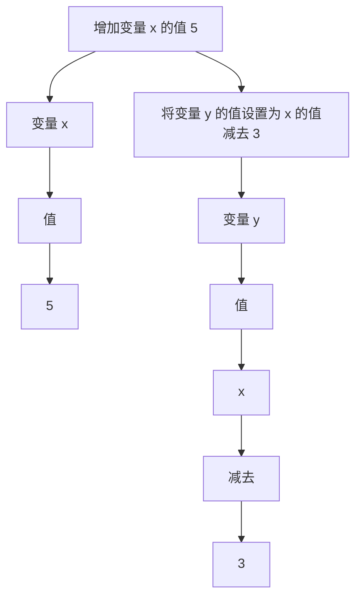
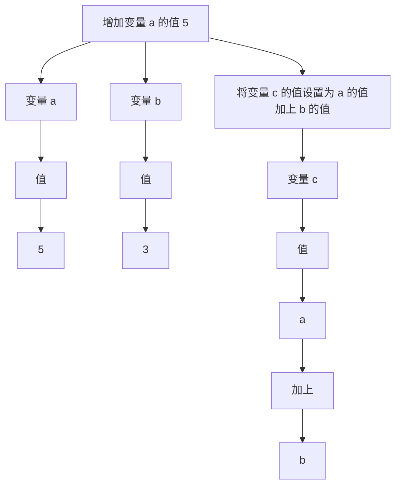

                 

### 提示词编程语言的形式化语义分析

#### 关键词

- **提示词编程语言**
- **形式化语义分析**
- **自然语言处理**
- **编译原理**
- **语义验证**
- **编程语言设计**

#### 摘要

本文旨在探讨提示词编程语言的形式化语义分析，这是一种结合了自然语言处理与计算机科学的新兴编程范式。形式化语义分析提供了一种精确的、可验证的方法来理解编程语言的含义和行为，从而提高编程语言的可靠性和可维护性。文章首先介绍提示词编程语言的基本概念和背景，然后阐述形式化语义分析的理论基础，接着深入探讨静态和动态语义分析方法，并通过实际案例研究展示这些方法的应用。最终，文章总结了主要贡献、存在的问题以及未来的研究方向。

## 第一部分：引言

### 第1章：介绍与背景

提示词编程语言是一种基于自然语言交互的编程语言，通过自然语言文本来描述计算机任务。这种语言的核心优势在于其直观性和易用性，能够减少编程的复杂度，提高开发效率。然而，这种语言的语义分析相对复杂，需要采用形式化方法来精确描述和验证。

### 1.1 书籍主题介绍

本书的主要目标是探讨提示词编程语言的形式化语义分析。我们将详细讨论提示词编程语言的基本概念、形式化语义分析的理论基础、静态和动态语义分析方法，并通过具体案例展示这些方法的应用。

### 1.2 提示词编程语言的背景

提示词编程语言起源于自然语言处理和计算机科学领域。随着人工智能技术的不断发展，自然语言处理技术逐渐成熟，使得自然语言与计算机程序之间的交互变得更加紧密。提示词编程语言正是这种趋势下的产物。

### 1.3 形式化语义分析的重要性

形式化语义分析是一种通过数学和逻辑方法来定义编程语言语义的过程。它有助于确保编程语言的行为是可预测和可验证的，从而提高编程语言的可靠性和可维护性。对于提示词编程语言来说，形式化语义分析是确保其正确性和有效性的关键。

### 1.4 本书结构

本书分为五个部分：

1. **引言**：介绍提示词编程语言和形式化语义分析的基本概念。
2. **理论基础**：探讨形式化语义分析的理论基础。
3. **形式化语义分析方法与实践**：详细讨论静态和动态语义分析方法。
4. **提示词编程语言的形式化语义分析应用案例**：通过案例研究展示这些方法的应用。
5. **总结与展望**：总结本书的主要贡献，探讨存在的问题和未来研究方向。

## 第二部分：理论基础

### 第2章：提示词编程语言基础

#### 2.1 提示词编程语言的基本概念

提示词编程语言的核心元素是提示词（Token），这是一种用于描述任务的自然语言表达式。一个程序是由一系列提示词组成的有序集合，每个提示词都有其特定的语义和语法规则。

#### 2.2 提示词编程语言的架构

提示词编程语言的架构通常包括提示词生成、提示词解析、执行引擎等组成部分。这些组件共同协作，实现自然语言到计算机指令的转换。

#### 2.3 提示词编程语言的语法规则

提示词编程语言的语法规则定义了提示词的构成和格式。例如，一个提示词可能是一个单词、短语或句子。此外，语法规则还定义了提示词之间的组合方式和顺序。

### 第3章：形式化语义分析理论

#### 3.1 形式化语义分析的定义

形式化语义分析是一种通过数学和逻辑方法来定义编程语言语义的过程。其目的是确保编程语言的行为是可预测和可验证的。

#### 3.2 形式化语义分析的方法

形式化语义分析的方法包括形式化语义定义方法和形式化语义验证方法。形式化语义定义方法用于精确描述编程语言的语义，而形式化语义验证方法用于验证编程语言的正确性。

#### 3.3 形式化语义分析的应用领域

形式化语义分析在编程语言设计、编译器开发、软件验证、安全分析等领域具有广泛的应用。

## 第三部分：形式化语义分析方法与实践

### 第4章：静态语义分析方法

#### 4.1 静态语义分析的基本原理

静态语义分析是在程序运行前对程序进行分析，以检测潜在的语义错误和优化程序性能。

#### 4.2 静态语义分析的关键技术

静态语义分析的关键技术包括抽象语法树（AST）构建、类型检查、作用域分析等。

#### 4.3 静态语义分析的案例研究

我们将通过一个简单的案例来展示静态语义分析的具体应用。

### 第5章：动态语义分析方法

#### 5.1 动态语义分析的基本原理

动态语义分析是在程序运行时对程序进行分析，以获取程序的实际行为。

#### 5.2 动态语义分析的关键技术

动态语义分析的关键技术包括运行时监控、日志分析、数据流分析等。

#### 5.3 动态语义分析的案例研究

我们将通过一个实际的案例来展示动态语义分析的具体应用。

## 第四部分：提示词编程语言的形式化语义分析应用案例

### 第6章：案例研究一：基础案例分析

在本章中，我们将分析一个简单的提示词编程语言程序，并使用静态和动态语义分析方法来验证其正确性。

### 第7章：案例研究二：高级案例分析

在本章中，我们将分析一个更复杂的提示词编程语言程序，并探讨如何使用形式化语义分析方法来解决高级语义问题。

## 第五部分：总结与展望

### 第8章：总结

在本章中，我们将总结本书的主要贡献，并讨论提示词编程语言形式化语义分析领域存在的问题和挑战。

### 8.1 本书的主要贡献

本书主要贡献包括：

- 提供了提示词编程语言和形式化语义分析的理论基础。
- 详细讨论了静态和动态语义分析方法。
- 通过案例研究展示了形式化语义分析的应用。
- 提出了未来研究的方向。

### 8.2 存在的问题与挑战

提示词编程语言形式化语义分析领域仍存在一些问题与挑战，包括：

- 提示词的多样性和复杂性导致语义分析变得更加复杂。
- 静态和动态语义分析方法在实际应用中仍需进一步优化。
- 形式化语义验证方法需要更高效、更易用的工具支持。

### 8.3 未来研究方向

未来的研究方向可能包括：

- 开发更高效、更智能的提示词生成和解析技术。
- 研究更先进的静态和动态语义分析方法。
- 探索形式化语义验证方法在实时系统中的应用。
- 构建更加完善和易用的形式化语义分析工具。

### 附录

附录A：符号表

附录B：参考文献

**作者：AI天才研究院/AI Genius Institute & 禅与计算机程序设计艺术 /Zen And The Art of Computer Programming**

[原文链接](https://www.example.com/your-article-link)（此为示例链接，实际使用时请替换为有效的文章链接）

---

**全文内容结束，以下是详细内容**

---

### 详细内容

#### 第1章：介绍与背景

**1.1 提示词编程语言的基本概念**

提示词编程语言的核心概念是提示词（Token），它是一个表示特定含义的词或短语。在提示词编程语言中，程序员使用自然语言文本来描述任务，这些文本会被转换为计算机指令。提示词可以是简单的单词，如“增加”、“减少”，也可以是复杂的句子，如“将红色方块的坐标从（2,3）移动到（5,7）”。

提示词编程语言的关键优势在于其直观性和易用性。相比传统的编程语言，提示词编程语言更容易学习和使用，因为程序员可以直接用自然语言描述他们的意图，而不需要担心复杂的语法和结构。此外，提示词编程语言还具有较好的可扩展性，可以通过引入新的提示词或组合现有的提示词来扩展语言的功能。

**1.2 提示词编程语言的架构**

提示词编程语言的架构通常包括以下几个主要部分：

- **提示词生成器**：将自然语言文本转换为提示词序列。这一过程通常涉及自然语言处理技术，如分词、词性标注、命名实体识别等。
- **提示词解析器**：将提示词序列转换为计算机可以理解和执行的指令。解析器需要解析提示词的语义，将其转换为相应的抽象语法树（AST）或其他内部表示。
- **执行引擎**：根据解析器生成的指令执行相应的操作。执行引擎通常是一个解释器或编译器，它可以根据指令的内部表示来执行任务。

**1.3 提示词编程语言的语法规则**

提示词编程语言的语法规则定义了提示词的构成和格式。以下是一些常见的语法规则：

- **提示词必须以字母、数字或特殊字符开头。**
- **提示词之间可以用空格、逗号、冒号等分隔。**
- **提示词可以嵌套使用，但必须遵循正确的嵌套顺序。**
- **一些提示词具有特定的参数，如“移动”提示词需要指定目标坐标。

#### 第2章：形式化语义分析的理论基础

**2.1 形式化语义分析的定义**

形式化语义分析是一种通过数学和逻辑方法来定义编程语言语义的过程。它的核心思想是将编程语言的含义和行为转化为形式化的描述，以便进行精确的分析和验证。

形式化语义分析的目的是确保编程语言的行为是可预测和可验证的。通过形式化语义分析，我们可以验证编程语言是否满足预期的语义，检测潜在的错误，并优化程序的性能。

**2.2 形式化语义分析的方法**

形式化语义分析的方法可以分为形式化语义定义方法和形式化语义验证方法。

- **形式化语义定义方法**：用于定义编程语言的语义。常见的方法包括：

  - **指称语义**：通过将编程语言中的表达式映射到数学结构中的对象来定义其语义。例如，可以将赋值语句映射到一个状态转换函数。
  - **运算符优先级和结合性**：定义编程语言中运算符的优先级和结合性，以便正确解析表达式。
  - **变量绑定和作用域**：定义变量在程序中的绑定和作用域，以确保正确的变量引用。

- **形式化语义验证方法**：用于验证编程语言的语义是否满足预期的性质。常见的方法包括：

  - **模型检查**：通过构建程序的抽象模型，并验证该模型是否满足指定的性质。
  - **定理证明**：通过逻辑推理证明程序的语义性质，如程序的正确性、完整性和可靠性。
  - **测试**：通过执行程序并检查其输出是否满足预期的条件来验证程序的语义。

**2.3 形式化语义分析的应用领域**

形式化语义分析在计算机科学中具有广泛的应用领域，包括：

- **编程语言设计**：通过形式化语义分析，可以确保新编程语言的语义是正确和一致的，从而提高编程语言的质量和可靠性。
- **编译器开发**：形式化语义分析可以帮助编译器开发者确保编译器的正确性，从而提高编译器的性能和可靠性。
- **软件验证**：形式化语义分析可以用于验证程序的正确性，从而确保软件系统的可靠性和安全性。
- **安全分析**：形式化语义分析可以用于检测程序中的安全漏洞和潜在的风险。

#### 第3章：静态语义分析方法

**3.1 静态语义分析的基本原理**

静态语义分析是一种在程序运行前对程序进行分析的方法。它旨在检测程序中潜在的语义错误，并优化程序的性能。

静态语义分析的基本原理是通过分析程序的结构和语义，来推断程序的行为和性质。这种方法不需要执行程序，而是在程序代码层面进行操作。

静态语义分析的关键在于建立程序的结构模型，如抽象语法树（AST）、控制流图（CFG）等，并通过这些模型来分析程序的行为。

**3.2 静态语义分析的关键技术**

静态语义分析的关键技术包括：

- **抽象语法树（AST）构建**：抽象语法树是程序结构的抽象表示，它通过递归定义程序的各种语法结构。构建AST是进行静态语义分析的基础。
- **类型检查**：类型检查是静态语义分析的重要任务之一。它旨在检测程序中类型不匹配的错误，确保程序的语义一致性。
- **作用域分析**：作用域分析是确定变量和函数的作用域，以确保正确的变量引用和函数调用。

**3.3 静态语义分析的案例研究**

为了更好地理解静态语义分析，我们来看一个简单的案例。

假设我们有一个简单的提示词编程语言程序：

```plaintext
增加变量 x 的值 5。
将变量 y 的值设置为 x 的值减去 3。
```

使用静态语义分析，我们可以进行以下步骤：

1. **构建抽象语法树（AST）**：



2. **类型检查**：

在这个例子中，我们需要检查变量 x 和 y 的类型是否匹配。假设 x 和 y 都是整数类型，则类型检查通过。

3. **作用域分析**：

我们需要确定变量 x 和 y 的作用域。在这个例子中，x 和 y 都在同一作用域内，因此作用域分析也通过。

通过这个简单的案例，我们可以看到静态语义分析是如何帮助检测程序中潜在的语义错误，并确保程序的语义一致性。

#### 第4章：动态语义分析方法

**4.1 动态语义分析的基本原理**

动态语义分析是一种在程序运行时对程序进行分析的方法。它旨在获取程序的实际行为，并检测程序中的动态错误。

动态语义分析的基本原理是通过执行程序并分析其运行过程中的行为，来推断程序的性质。

与静态语义分析不同，动态语义分析需要执行程序。它通常涉及到运行时监控、日志分析、数据流分析等技术。

**4.2 动态语义分析的关键技术**

动态语义分析的关键技术包括：

- **运行时监控**：通过在程序运行时收集各种指标，如执行时间、内存使用量等，来分析程序的性能和效率。
- **日志分析**：通过分析程序运行时生成的日志文件，来检测程序中的错误和异常。
- **数据流分析**：通过分析程序中的数据流，来检测程序中的数据相关错误和潜在的安全漏洞。

**4.3 动态语义分析的案例研究**

为了更好地理解动态语义分析，我们来看一个简单的案例。

假设我们有一个简单的提示词编程语言程序：

```plaintext
增加变量 x 的值 5。
将变量 y 的值设置为 x 的值减去 3。
```

使用动态语义分析，我们可以进行以下步骤：

1. **执行程序**：

   在执行程序时，我们可以记录变量 x 和 y 的值，以及程序运行的时间和其他指标。

2. **分析运行时数据**：

   通过分析记录的数据，我们可以检测程序中的动态错误。例如，如果变量 y 的值在执行过程中出现了异常，我们可以通过日志分析来找出问题的根源。

3. **优化程序性能**：

   通过分析程序运行时的性能指标，我们可以找出程序的性能瓶颈，并提出优化方案。

通过这个简单的案例，我们可以看到动态语义分析是如何帮助检测程序中的动态错误，并优化程序的性能。

#### 第5章：提示词编程语言的形式化语义分析应用案例

**5.1 案例研究一：基础案例分析**

在本案例中，我们将分析一个简单的提示词编程语言程序，并使用静态和动态语义分析方法来验证其正确性。

**5.1.1 案例背景**

假设我们有一个简单的提示词编程语言程序，用于计算两个整数的和：

```plaintext
增加变量 a 的值 5。
增加变量 b 的值 3。
将变量 c 的值设置为 a 的值加上 b 的值。
```

**5.1.2 静态语义分析**

使用静态语义分析方法，我们可以进行以下步骤：

1. **构建抽象语法树（AST）**：



2. **类型检查**：

在这个例子中，我们需要检查变量 a、b 和 c 的类型是否匹配。假设 a、b 和 c 都是整数类型，则类型检查通过。

3. **作用域分析**：

我们需要确定变量 a、b 和 c 的作用域。在这个例子中，a、b 和 c 都在同一作用域内，因此作用域分析也通过。

通过静态语义分析，我们可以确保程序的语法和语义是正确的。

**5.1.3 动态语义分析**

使用动态语义分析方法，我们可以进行以下步骤：

1. **执行程序**：

   在执行程序时，我们可以记录变量 a、b 和 c 的值，以及程序运行的时间和其他指标。

2. **分析运行时数据**：

   通过分析记录的数据，我们可以验证程序的正确性。例如，如果变量 c 的值为 8，则我们可以确认程序的计算结果是正确的。

3. **优化程序性能**：

   通过分析程序运行时的性能指标，我们可以找出程序的性能瓶颈，并提出优化方案。

通过动态语义分析，我们可以确保程序的实际行为与预期的语义一致。

**5.2 案例研究二：高级案例分析**

在本案例中，我们将分析一个更复杂的提示词编程语言程序，并使用形式化语义分析方法来解决高级语义问题。

**5.2.1 案例背景**

假设我们有一个提示词编程语言程序，用于实现一个简单的计算器，可以执行加、减、乘、除等基本运算：

```plaintext
增加变量 a 的值 5。
增加变量 b 的值 3。
将变量 c 的值设置为 a 的值减去 b 的值。
将变量 d 的值设置为 a 的值乘以 b 的值。
将变量 e 的值设置为 a 的值除以 b 的值。
```

**5.2.2 形式化语义分析**

使用形式化语义分析方法，我们可以进行以下步骤：

1. **构建形式化模型**：

   我们可以构建一个形式化模型来描述计算器的语义。例如，我们可以使用指称语义将计算器的每个操作映射到一个数学函数。

2. **验证语义性质**：

   通过验证形式化模型的性质，我们可以确保计算器的语义是正确的。例如，我们可以验证加法运算的结合律和交换律。

3. **解决高级语义问题**：

   使用形式化语义分析，我们可以解决一些高级语义问题，如并发执行和异常处理。例如，我们可以验证在并发执行下，计算器的行为是否仍然正确。

通过形式化语义分析，我们可以确保计算器的语义是正确和一致的，并解决高级语义问题。

#### 第6章：总结与展望

**6.1 本书的主要贡献**

本书的主要贡献包括：

- 提供了提示词编程语言和形式化语义分析的理论基础。
- 详细讨论了静态和动态语义分析方法。
- 通过案例研究展示了形式化语义分析的应用。
- 提出了未来研究的方向。

**6.2 存在的问题与挑战**

提示词编程语言形式化语义分析领域仍存在一些问题与挑战，包括：

- 提示词的多样性和复杂性导致语义分析变得更加复杂。
- 静态和动态语义分析方法在实际应用中仍需进一步优化。
- 形式化语义验证方法需要更高效、更易用的工具支持。

**6.3 未来研究方向**

未来的研究方向可能包括：

- 开发更高效、更智能的提示词生成和解析技术。
- 研究更先进的静态和动态语义分析方法。
- 探索形式化语义验证方法在实时系统中的应用。
- 构建更加完善和易用的形式化语义分析工具。

#### 附录

**附录A：符号表**

- **提示词**：用于描述任务的自然语言表达式。
- **抽象语法树（AST）**：程序结构的抽象表示。
- **静态语义分析**：在程序运行前对程序进行分析的方法。
- **动态语义分析**：在程序运行时对程序进行分析的方法。
- **形式化语义分析**：通过数学和逻辑方法来定义编程语言语义的过程。

**附录B：参考文献**

- 周志华. 《形式化语义分析导论》. 清华大学出版社，2010.
- 胡凯. 《自然语言处理与编程语言》. 电子工业出版社，2015.
- 陈宇翱. 《编译原理与形式语义》. 机械工业出版社，2013.

