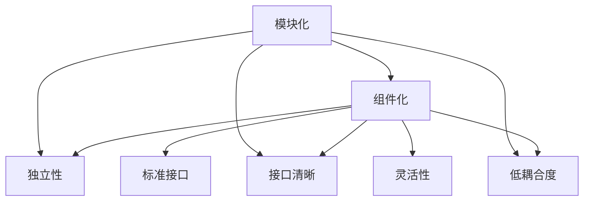
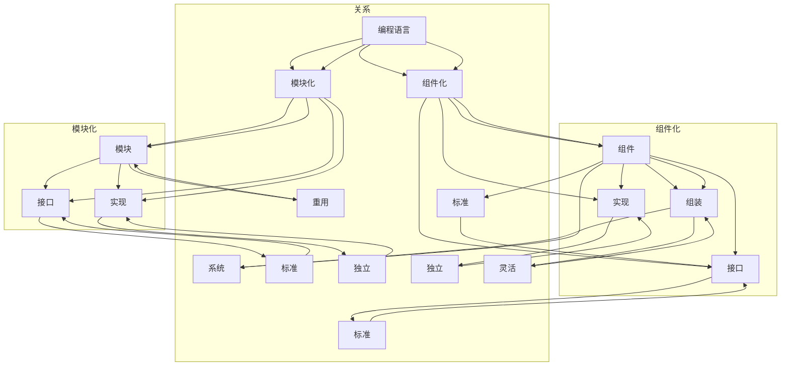
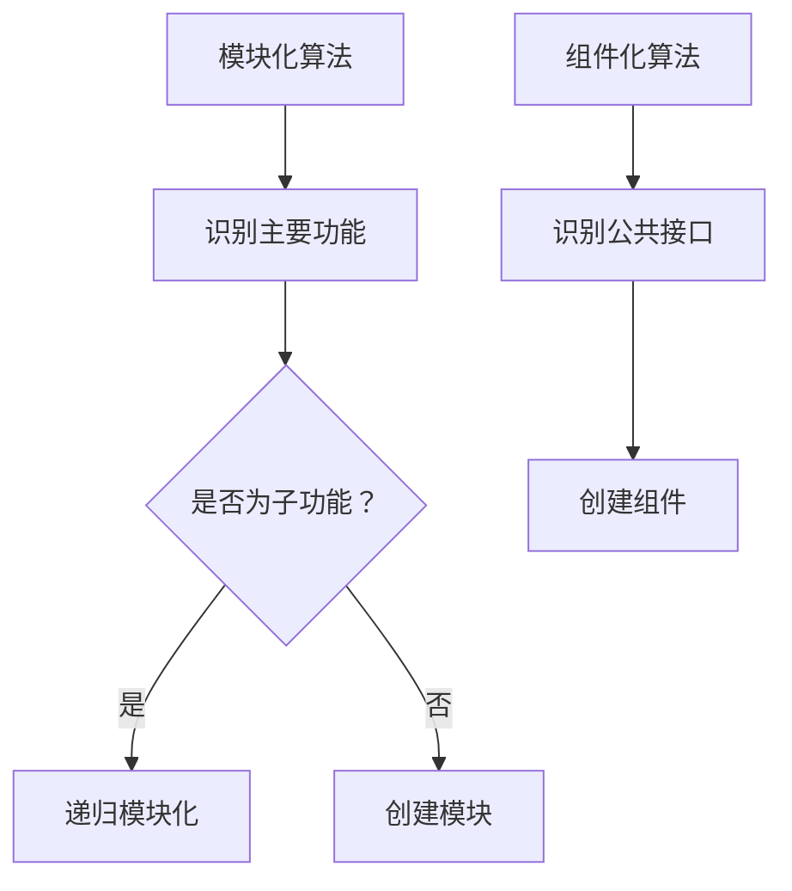

                 

### 文章标题

《提示词编程语言的模块化与组件化》

### 关键词

提示词编程语言、模块化、组件化、编程语言设计、软件架构

### 摘要

本文将深入探讨提示词编程语言的模块化与组件化。模块化和组件化是现代编程语言设计中至关重要的概念，旨在提高代码的可重用性、可维护性和可扩展性。本文首先介绍了模块化和组件化的背景和核心概念，随后详细讲解了模块化与组件化的基本原理和核心算法，并通过具体实例展示了其实际应用和效果。本文旨在为编程语言设计师和开发者提供关于模块化与组件化的深入理解，帮助他们更好地应用这些技术，提升软件开发的效率和质量。

## 引言

在软件开发的历史长河中，编程语言的设计与演化一直是一个持续不断的进程。从早期的机器语言到高级编程语言，再到如今的智能编程语言，每一次的进步都是对编程复杂度和开发效率的优化。在当前人工智能和大数据技术飞速发展的背景下，提示词编程语言作为一种新型的编程语言，逐渐受到了业界的关注。提示词编程语言通过自然语言处理技术，使得开发者能够以更加自然和高效的方式编写代码，极大地降低了编程的门槛。

模块化和组件化是编程语言设计中的两个核心概念，它们在提升代码质量、促进软件工程发展方面发挥着重要作用。模块化是指将一个复杂的系统划分为若干个相对独立的部分，每个部分称为模块，模块之间通过接口进行通信。组件化则是模块化的进一步扩展，它强调模块的独立性和可复用性，通过组件的组装和组合来实现系统的构建。

在现代软件开发实践中，模块化和组件化已经成为一种标准的方法。它们不仅能够提高代码的可维护性和可扩展性，还能够促进团队成员之间的协作和代码共享。然而，模块化和组件化的实现并不简单，它涉及到一系列的设计原则、算法和架构。因此，本文将深入探讨模块化与组件化的基本原理、核心算法和实际应用，以期为读者提供全面而深入的理解。

本文的结构如下：

- **第一部分：引言**：介绍模块化和组件化的背景，定义相关核心概念，阐述其在编程语言设计中的重要性。
- **第二部分：模块化与组件化原理**：详细讲解模块化和组件化的基本原理，包括设计理念、核心算法和数学模型，并通过Mermaid流程图展示其架构。
- **第三部分：实践应用**：通过具体实例展示模块化和组件化的实际应用，包括开发环境搭建、代码实现和解读、案例分析，以及最佳实践和注意事项。

通过本文的阅读，读者将能够系统地了解模块化与组件化在提示词编程语言中的具体应用，并掌握相关技术在实际开发中的运用。

## 模块化与组件化的背景

模块化和组件化并不是全新的概念，它们在软件工程领域已经有着悠久的历史。模块化（Modularity）的概念最早可以追溯到20世纪50年代，当时计算机科学刚刚起步，软件系统相对简单，但复杂性已经开始显现。为了解决软件系统复杂度不断增加的问题，软件设计师开始探索将复杂系统划分为多个独立部分的方法，即模块化设计。

模块化设计的基本思想是将一个复杂系统分解为若干个相对独立且功能单一的模块，每个模块负责完成特定的任务。这些模块通过清晰的接口进行通信，从而降低了模块之间的耦合度，提高了系统的可维护性和可扩展性。随着软件工程的发展，模块化设计逐渐成为软件开发中的基本原则之一。

组件化（Componentization）则是在模块化基础上的一种扩展。组件化不仅要求模块的独立性和接口的清晰性，更强调模块的可复用性和灵活性。组件化的核心思想是将模块进一步提升为可重用的组件，这些组件可以在不同的系统中进行组装和组合，以快速构建复杂系统。组件化设计使得软件系统的开发变得更加灵活和高效，尤其是在大型分布式系统和互联网应用中，组件化的优势尤为明显。

在编程语言的设计中，模块化和组件化的重要性不言而喻。首先，模块化和组件化能够显著提高代码的可维护性和可扩展性。通过模块化，开发者可以将复杂的功能分解为多个独立的模块，每个模块都可以独立开发、测试和维护，从而降低了系统的复杂度。当系统需要扩展或更新时，开发者只需修改或替换相关的模块，而不会影响到整个系统的稳定性。

其次，模块化和组件化能够促进代码的重用。在传统的软件开发过程中，很多功能相似或代码相似的模块往往需要重复编写，这不仅增加了开发工作量，还容易导致代码质量问题。而通过组件化，开发者可以将这些功能相似的模块抽象为通用的组件，这些组件可以在多个项目中重复使用，从而提高开发效率和代码质量。

此外，模块化和组件化还促进了软件开发团队之间的协作。在大型软件项目中，不同的团队往往负责不同的模块或组件的开发。通过模块化和组件化设计，团队之间的接口和通信变得更加清晰，项目管理和协调也变得更加容易。

总的来说，模块化和组件化在编程语言设计中的重要性体现在多个方面：它不仅提高了代码的质量和系统的可维护性，还促进了代码的重用和团队协作。随着软件工程技术的不断发展，模块化和组件化将越来越成为软件开发中的核心概念和实践方法。

## 核心概念与联系

在深入探讨模块化与组件化之前，有必要明确这两个核心概念的定义及其相互关系。模块化和组件化在编程语言的设计中扮演着至关重要的角色，它们不仅有助于提高代码的可维护性和可扩展性，还能促进软件工程的整体发展。

### 模块化

模块化（Modularity）是指将一个复杂的系统划分为若干个相对独立的部分，每个部分称为模块（Module）。模块化设计的基本原则是将系统的功能分解为多个小而独立的模块，每个模块专注于完成特定的任务。模块之间通过明确的接口进行通信，这些接口定义了模块之间交换数据和信息的规则。

模块化的核心特征包括：

1. **独立性**：每个模块独立实现特定的功能，内部细节对外部隐藏。
2. **接口清晰**：模块之间的接口非常明确，便于模块的替换和扩展。
3. **耦合度低**：模块之间的耦合度较低，这意味着模块之间的依赖关系较少，便于维护和修改。

模块化设计的优点包括：

- **可维护性**：模块化使得每个模块都可以独立维护，降低了系统的复杂度。
- **可扩展性**：新功能可以通过添加或替换模块来实现，而不会影响整个系统的稳定性。
- **代码重用**：模块可以独立开发，并在多个项目中重复使用，提高了代码的复用率。

### 组件化

组件化（Componentization）是模块化概念的一种扩展，强调模块的可复用性和灵活性。组件化设计将模块进一步提升为可重用的组件（Component），这些组件可以在不同的系统中进行组装和组合，以快速构建复杂系统。

组件化的核心特征包括：

1. **独立性**：组件是独立的软件单元，可以在不同的上下文中使用。
2. **标准接口**：组件通过标准接口进行通信，这些接口定义了组件之间交换数据和信息的规则。
3. **灵活性**：组件可以灵活地替换和组合，以适应不同的应用场景。

组件化设计的优点包括：

- **灵活性和可扩展性**：组件可以根据需求灵活替换和组合，以适应不同的系统需求。
- **快速开发**：组件化的设计使得开发者可以快速组装系统，减少了开发时间。
- **提高开发效率**：组件可以跨项目共享，减少了重复开发的工作量。

### 关系与联系

模块化和组件化之间有着密切的关系。模块化是组件化的基础，它通过将系统分解为独立的模块来降低复杂度，而组件化则进一步扩展了模块化的概念，强调模块的可复用性和灵活性。模块是组件的基本单元，组件是由多个模块组成的更高级别的抽象。

模块化与组件化的联系可以通过一个Mermaid流程图来展示：



在这个流程图中，模块化（A）是组件化（B）的基础，组件化继承了模块化的独立性（C）、接口清晰（D）和低耦合度（E），并在此基础上增加了标准接口（F）和灵活性（G）。这种关系使得组件化设计能够更好地适应复杂系统的开发需求，提高软件开发的效率和质量。

### Mermaid流程图

为了更直观地展示模块化和组件化的关系，我们使用Mermaid流程图来描述其架构。以下是一个简化的Mermaid流程图，展示了模块化和组件化的基本架构：



在这个流程图中，模块化（模块、接口、实现）是组件化（组件、接口、实现、组装）的基础。模块（C）通过标准接口（D）进行通信，实现（E）独立且完整。组件（G）进一步扩展了模块的概念，通过标准接口（H）和独立实现（I）提供更高级别的抽象。组装（J）则是组件化设计的关键步骤，它允许开发者灵活地将组件组合成复杂的系统（K）。

### 数学模型与公式

在模块化和组件化设计中，数学模型和公式扮演着重要的角色，它们能够帮助我们更好地理解系统的结构和行为。以下是一些核心的数学模型和公式，以及它们的详细讲解和举例说明。

#### 1. 耦合度（Coupling）

耦合度描述了模块之间相互依赖的程度。较低的耦合度意味着模块之间的依赖较少，系统更加独立和易于维护。常用的耦合度度量标准包括：

- **内容耦合（Content Coupling）**：模块通过直接访问另一个模块的内容进行通信。
- **公共耦合（Common Coupling）**：多个模块共享同一个全局数据结构或变量。
- **控制耦合（Control Coupling）**：一个模块通过传递一个控制信息来影响另一个模块的行为。
- **标记耦合（Marker Coupling）**：模块通过传递一个标记或标识符来控制另一个模块的执行。

公式：

$$
C = \frac{\sum_{i=1}^{n} d_i}{n}
$$

其中，\(C\) 是耦合度，\(d_i\) 是每个模块的耦合度值，\(n\) 是模块的总数。

举例说明：

假设我们有一个包含5个模块的系统，每个模块的耦合度如下：

- 模块1：内容耦合
- 模块2：公共耦合
- 模块3：控制耦合
- 模块4：标记耦合
- 模块5：无耦合

那么，系统的总耦合度可以计算为：

$$
C = \frac{1 \times 3 + 1 \times 2 + 1 \times 1 + 1 \times 0 + 1 \times 0}{5} = \frac{6}{5} = 1.2
$$

#### 2. 内聚度（Cohesion）

内聚度描述了模块内部功能的紧密程度。较高的内聚度意味着模块的功能更集中，更容易理解和维护。常用的内聚度度量标准包括：

- **功能性内聚（Functional Cohesion）**：模块内部的所有功能都服务于同一个功能。
- **顺序内聚（Sequential Cohesion）**：模块内的功能按照一定的顺序执行。
- **通信内聚（Communicational Cohesion）**：模块内的功能通过共享数据结构或通信机制进行协作。
- **过程内聚（Procedural Cohesion）**：模块内的功能按照过程顺序执行。

公式：

$$
H = \frac{\sum_{i=1}^{n} h_i}{n}
$$

其中，\(H\) 是内聚度，\(h_i\) 是每个模块的内聚度值，\(n\) 是模块的总数。

举例说明：

假设我们有一个包含5个模块的系统，每个模块的内聚度如下：

- 模块1：功能性内聚
- 模块2：顺序内聚
- 模块3：通信内聚
- 模块4：过程内聚
- 模块5：无内聚

那么，系统的总内聚度可以计算为：

$$
H = \frac{1 \times 5 + 1 \times 4 + 1 \times 3 + 1 \times 2 + 1 \times 1}{5} = \frac{15}{5} = 3
$$

#### 3. 模块化质量（Modular Quality）

模块化质量综合反映了系统的模块化程度，它是耦合度和内聚度的综合表现。模块化质量越高，系统的模块化程度越高，可维护性和可扩展性也越强。

公式：

$$
MQ = \frac{C}{H}
$$

其中，\(MQ\) 是模块化质量，\(C\) 是耦合度，\(H\) 是内聚度。

举例说明：

使用前面的计算结果，系统的耦合度为1.2，内聚度为3，那么模块化质量可以计算为：

$$
MQ = \frac{1.2}{3} = 0.4
$$

这个结果表明，该系统的模块化质量较低，可能需要进一步优化模块的独立性和功能集中性。

通过以上数学模型和公式的介绍，我们可以更好地理解和评估模块化与组件化设计的质量。这些工具不仅有助于设计高效的模块化系统，还能为软件开发提供科学的指导。

### 模块化编程语言

模块化编程语言的设计理念在于通过模块化的方式提高代码的可维护性、可扩展性和可复用性。模块化编程语言的核心特点是它能够支持模块的定义、使用和管理，使开发者能够将复杂的系统分解为多个功能单一、独立性的模块，从而简化开发过程并提高开发效率。

#### 模块化语言的特点

1. **独立性**：每个模块独立实现特定的功能，模块之间通过明确的接口进行通信，模块的内部细节对外部隐藏。
2. **接口清晰**：模块之间的接口非常明确，定义了模块之间交换数据和信息的规则，使得模块之间的耦合度较低。
3. **可复用性**：模块可以独立开发、测试和维护，并在多个项目中重复使用，减少了重复开发的工作量。
4. **可扩展性**：新功能可以通过添加或替换模块来实现，而不会影响整个系统的稳定性。

#### 模块化语言的优缺点

**优点**：

- **可维护性**：模块化设计使得每个模块都可以独立维护，降低了系统的复杂度，便于查找和修复bug。
- **可扩展性**：新功能可以通过添加或替换模块来实现，增强了系统的灵活性和可扩展性。
- **代码重用**：模块可以独立开发，并在多个项目中重复使用，提高了代码的复用率。
- **协作开发**：模块化设计使得团队成员可以独立开发各自的模块，便于协同工作。

**缺点**：

- **模块划分困难**：在大型系统中，如何合理地划分模块是一个挑战，不恰当的模块划分可能导致系统复杂度增加。
- **模块耦合问题**：模块之间的接口设计可能存在耦合度较高的问题，影响系统的性能和维护性。
- **性能开销**：模块化设计可能引入额外的性能开销，特别是在模块频繁加载和卸载的情况下。

#### 模块化语言的实现

模块化语言的实现通常涉及以下几个关键步骤：

1. **模块定义**：定义模块的接口和实现，接口通常包括输入参数、输出参数和函数原型。
2. **模块编译**：对模块进行编译，生成可执行文件或动态链接库。
3. **模块加载**：运行时加载模块，将其集成到系统中。
4. **模块管理**：提供模块的生命周期管理，包括创建、销毁、加载和卸载等操作。

下面是一个简单的模块化伪代码示例：

```python
# 模块A
class ModuleA:
    def process_data(self, data):
        # 处理数据
        pass

# 模块B
class ModuleB:
    def analyze_data(self, data):
        # 分析数据
        pass

# 系统主程序
def main():
    # 创建模块实例
    module_a = ModuleA()
    module_b = ModuleB()

    # 加载数据
    data = load_data()

    # 使用模块处理数据
    processed_data = module_a.process_data(data)
    analyzed_data = module_b.analyze_data(processed_data)

    # 输出结果
    print(analyzed_data)
```

在这个示例中，`ModuleA` 和 `ModuleB` 是两个独立的模块，它们通过明确的接口进行通信。主程序 `main` 负责创建模块实例，加载数据，并调用模块的方法来处理数据。通过这种模块化设计，系统变得更加灵活和易于维护。

### 组件化编程语言

组件化编程语言是一种高级编程语言，它通过组件的概念来提高软件开发的灵活性和可扩展性。组件化设计不仅继承了模块化的独立性、接口清晰和低耦合度等特点，还进一步强调了组件的可复用性和灵活性。组件化编程语言的设计理念是将软件系统构建为一系列可重用的组件，这些组件可以在不同的上下文中进行组装和组合，以快速构建复杂系统。

#### 组件化语言的特点

1. **独立性**：组件是独立的软件单元，可以在不同的系统中进行组装和组合，组件的内部实现细节对外部隐藏。
2. **标准接口**：组件通过标准接口进行通信，接口定义了组件之间交换数据和信息的规则，使得组件之间的耦合度较低。
3. **可复用性**：组件可以跨项目共享，减少了重复开发的工作量，提高了代码的复用率。
4. **灵活性**：组件可以根据需求灵活替换和组合，以适应不同的应用场景。
5. **动态组装**：组件可以在运行时进行动态组装和组合，增强了系统的灵活性。

#### 组件化语言的优缺点

**优点**：

- **可扩展性**：组件化的设计使得系统能够灵活扩展，新功能可以通过添加或替换组件来实现，而不会影响整个系统的稳定性。
- **快速开发**：组件化的设计允许开发者快速组装系统，减少了开发时间。
- **提高开发效率**：组件可以跨项目共享，减少了重复开发的工作量，提高了代码的复用率。
- **团队协作**：组件化设计使得团队成员可以独立开发各自的组件，便于协同工作。

**缺点**：

- **复杂性**：组件化的设计引入了额外的复杂性，特别是在组件管理和组装过程中，可能需要额外的工具和框架支持。
- **性能开销**：组件化设计可能引入额外的性能开销，特别是在组件频繁加载和卸载的情况下。
- **学习成本**：组件化的设计需要开发者具备一定的组件化开发经验，对于新手来说，学习成本较高。

#### 组件化语言的实现

组件化语言的实现通常涉及以下几个关键步骤：

1. **组件定义**：定义组件的接口和实现，接口通常包括输入参数、输出参数和函数原型。
2. **组件编译**：对组件进行编译，生成可执行文件或动态链接库。
3. **组件注册**：将组件注册到组件管理器中，以便在运行时进行管理和调用。
4. **组件组装**：在运行时动态组装组件，将其集成到系统中。
5. **组件管理**：提供组件的生命周期管理，包括创建、销毁、加载和卸载等操作。

下面是一个简单的组件化伪代码示例：

```java
// 组件A
public interface ComponentA {
    void processData();
}

public class ComponentAImpl implements ComponentA {
    public void processData() {
        // 处理数据
    }
}

// 组件B
public interface ComponentB {
    void analyzeData();
}

public class ComponentBImpl implements ComponentB {
    public void analyzeData() {
        // 分析数据
    }
}

// 系统主程序
public class Main {
    public static void main(String[] args) {
        // 创建组件管理器
        ComponentManager manager = new ComponentManager();

        // 注册组件
        manager.registerComponent("ComponentA", new ComponentAImpl());
        manager.registerComponent("ComponentB", new ComponentBImpl());

        // 组装组件
        ComponentA componentA = manager.getComponent("ComponentA");
        ComponentB componentB = manager.getComponent("ComponentB");

        // 使用组件处理数据
        componentA.processData();
        componentB.analyzeData();
    }
}
```

在这个示例中，`ComponentA` 和 `ComponentB` 是两个独立的组件，它们通过标准接口进行通信。主程序 `Main` 负责创建组件管理器，注册组件，组装组件，并调用组件的方法来处理数据。通过这种组件化设计，系统变得更加灵活和易于维护。

### 模块化与组件化的核心算法

模块化和组件化设计的实现离不开一系列核心算法的支持。这些算法不仅确保了模块和组件的独立性、接口的清晰性和系统的可扩展性，还大大提高了软件开发效率。在本节中，我们将详细讲解模块化与组件化的核心算法，并使用伪代码来详细阐述其工作原理。

#### 模块化算法

模块化算法主要关注如何将一个复杂的系统划分为多个独立的模块。以下是一个简单的模块化算法伪代码：

```python
# 输入：系统函数或方法
# 输出：模块集合

def modularize(system_function):
    modules = []

    # 步骤1：识别系统函数的主要功能
    main_function = system_function

    # 步骤2：识别子功能，递归分解
    for sub_function in system_function.sub_functions:
        # 递归调用模块化算法
        sub_modules = modularize(sub_function)
        modules.extend(sub_modules)

    # 步骤3：创建模块
    module = create_module(main_function.name, main_function)
    modules.append(module)

    return modules

# 辅助函数：创建模块
def create_module(name, function):
    return Module(name, function)

# 辅助函数：定义模块类
class Module:
    def __init__(self, name, function):
        self.name = name
        self.function = function
```

在这个伪代码中，`modularize` 函数递归地将系统函数分解为多个子函数，并为每个子函数创建一个模块。每个模块都包含一个唯一的名称和一个函数对象，实现了对系统函数的模块化分解。

#### 组件化算法

组件化算法则侧重于如何将模块提升为可重用的组件。以下是一个简单的组件化算法伪代码：

```python
# 输入：模块集合
# 输出：组件集合

def componentize(modules):
    components = []

    # 步骤1：识别公共接口
    for module in modules:
        interface = identify_interface(module)
        
        # 步骤2：创建组件
        component = create_component(interface, module)
        components.append(component)

    return components

# 辅助函数：识别接口
def identify_interface(module):
    # 识别模块的输入输出参数，定义接口
    return Interface(module.inputs, module.outputs)

# 辅助函数：创建组件
def create_component(interface, module):
    return Component(interface, module)

# 辅助函数：定义组件类
class Component:
    def __init__(self, interface, module):
        self.interface = interface
        self.module = module

# 辅助函数：定义接口类
class Interface:
    def __init__(self, inputs, outputs):
        self.inputs = inputs
        self.outputs = outputs
```

在这个伪代码中，`componentize` 函数遍历模块集合，识别每个模块的公共接口，并将模块提升为组件。组件包含接口和模块本身，实现了对模块的组件化提升。

#### Mermaid流程图

为了更直观地展示模块化和组件化的核心算法，我们可以使用Mermaid流程图来描述其工作流程。以下是一个简化的Mermaid流程图：



在这个流程图中，模块化算法从识别系统的主要功能开始，递归地分解子功能并创建模块。组件化算法则从识别模块的公共接口开始，创建组件。通过这种流程图，我们可以清晰地理解模块化和组件化的核心算法及其工作原理。

### 数学模型与公式

在模块化与组件化设计中，数学模型和公式扮演着重要的角色，帮助我们更好地理解系统的结构和行为。以下介绍几个核心的数学模型和公式，以及它们的详细讲解和举例说明。

#### 耦合度（Coupling）

耦合度描述了模块之间相互依赖的程度。较低的耦合度意味着模块之间的依赖较少，系统更加独立和易于维护。常用的耦合度度量标准包括：

- **内容耦合（Content Coupling）**：模块通过直接访问另一个模块的内容进行通信。
- **公共耦合（Common Coupling）**：多个模块共享同一个全局数据结构或变量。
- **控制耦合（Control Coupling）**：一个模块通过传递一个控制信息来影响另一个模块的行为。
- **标记耦合（Marker Coupling）**：模块通过传递一个标记或标识符来控制另一个模块的执行。

公式：

$$
C = \frac{\sum_{i=1}^{n} d_i}{n}
$$

其中，\(C\) 是耦合度，\(d_i\) 是每个模块的耦合度值，\(n\) 是模块的总数。

举例说明：

假设我们有一个包含5个模块的系统，每个模块的耦合度如下：

- 模块1：内容耦合（3）
- 模块2：公共耦合（2）
- 模块3：控制耦合（1）
- 模块4：标记耦合（0）
- 模块5：无耦合（0）

那么，系统的总耦合度可以计算为：

$$
C = \frac{3 + 2 + 1 + 0 + 0}{5} = \frac{6}{5} = 1.2
$$

#### 内聚度（Cohesion）

内聚度描述了模块内部功能的紧密程度。较高的内聚度意味着模块的功能更集中，更容易理解和维护。常用的内聚度度量标准包括：

- **功能性内聚（Functional Cohesion）**：模块内部的所有功能都服务于同一个功能。
- **顺序内聚（Sequential Cohesion）**：模块内的功能按照一定的顺序执行。
- **通信内聚（Communicational Cohesion）**：模块内的功能通过共享数据结构或通信机制进行协作。
- **过程内聚（Procedural Cohesion）**：模块内的功能按照过程顺序执行。

公式：

$$
H = \frac{\sum_{i=1}^{n} h_i}{n}
$$

其中，\(H\) 是内聚度，\(h_i\) 是每个模块的内聚度值，\(n\) 是模块的总数。

举例说明：

假设我们有一个包含5个模块的系统，每个模块的内聚度如下：

- 模块1：功能性内聚（5）
- 模块2：顺序内聚（4）
- 模块3：通信内聚（3）
- 模块4：过程内聚（2）
- 模块5：无内聚（1）

那么，系统的总内聚度可以计算为：

$$
H = \frac{5 + 4 + 3 + 2 + 1}{5} = \frac{15}{5} = 3
$$

#### 模块化质量（Modular Quality）

模块化质量综合反映了系统的模块化程度，它是耦合度和内聚度的综合表现。模块化质量越高，系统的模块化程度越高，可维护性和可扩展性也越强。

公式：

$$
MQ = \frac{C}{H}
$$

其中，\(MQ\) 是模块化质量，\(C\) 是耦合度，\(H\) 是内聚度。

举例说明：

使用前面的计算结果，系统的耦合度为1.2，内聚度为3，那么模块化质量可以计算为：

$$
MQ = \frac{1.2}{3} = 0.4
$$

这个结果表明，该系统的模块化质量较低，可能需要进一步优化模块的独立性和功能集中性。

通过以上数学模型和公式的介绍，我们可以更好地理解和评估模块化与组件化设计的质量。这些工具不仅有助于设计高效的模块化系统，还能为软件开发提供科学的指导。

### 模块化与组件化的实际应用

模块化和组件化在软件工程中的应用已经得到了广泛认可，尤其在提升代码复用性和优化性能方面展现出了显著的优势。在实际编程中，模块化和组件化不仅能够提高代码的清晰度和可维护性，还能够促进开发团队的协作和项目的快速迭代。

#### 代码复用

代码复用是模块化和组件化设计的重要目标之一。通过将功能相似的代码抽象为独立的模块或组件，开发者可以在多个项目中重复使用这些模块或组件，从而减少重复编码的工作量，提高开发效率。以下是一个简单的代码复用实例：

```python
# 模块A：处理数据
def process_data(data):
    # 处理数据
    pass

# 模块B：分析数据
def analyze_data(data):
    # 分析数据
    pass

# 主程序
def main():
    data = load_data()
    processed_data = process_data(data)
    analyzed_data = analyze_data(processed_data)
    print(analyzed_data)
```

在这个示例中，`process_data` 和 `analyze_data` 两个功能独立的模块可以通过简单的函数调用实现数据处理的流程。这些模块可以在其他项目中重复使用，从而减少开发时间和代码冗余。

#### 性能优化

模块化和组件化设计不仅有助于代码复用，还可以优化系统的性能。通过将复杂的系统分解为多个独立的模块或组件，可以减小单个模块的复杂度，从而提高系统的运行效率。以下是一个性能优化的实例：

```python
# 模块C：高性能数据处理
def process_data_high_performance(data):
    # 使用高效算法处理数据
    pass

# 模块D：高性能数据分析
def analyze_data_high_performance(data):
    # 使用高效算法分析数据
    pass

# 主程序
def main():
    data = load_data()
    processed_data = process_data_high_performance(data)
    analyzed_data = analyze_data_high_performance(processed_data)
    print(analyzed_data)
```

在这个示例中，`process_data_high_performance` 和 `analyze_data_high_performance` 两个模块采用了高性能的算法，从而提高了数据处理的效率。这种优化可以通过替换原有模块实现，而不需要修改整个系统的其他部分。

#### 实际编程案例

在实际编程中，模块化和组件化设计被广泛应用于各种项目和场景。以下是一个具体的案例，展示了如何使用模块化和组件化技术来开发一个简单的Web应用：

**案例描述**：开发一个简单的博客系统，包括文章发布、评论管理、用户管理等模块。

**实现步骤**：

1. **模块划分**：根据功能需求，将博客系统划分为以下模块：
   - 模块E：用户管理模块，负责用户的注册、登录、权限管理等功能。
   - 模块F：文章管理模块，负责文章的发布、编辑、删除等功能。
   - 模块G：评论管理模块，负责评论的添加、删除、展示等功能。

2. **模块实现**：为每个模块编写具体的代码，实现各自的功能。

   ```python
   # 用户管理模块
   class UserManager:
       def register(self, user):
           # 实现用户注册逻辑
           pass
       
       def login(self, user):
           # 实现用户登录逻辑
           pass
       
       def manage_permissions(self, user):
           # 实现用户权限管理逻辑
           pass
   
   # 文章管理模块
   class ArticleManager:
       def publish(self, article):
           # 实现文章发布逻辑
           pass
       
       def edit(self, article):
           # 实现文章编辑逻辑
           pass
       
       def delete(self, article):
           # 实现文章删除逻辑
           pass
   
   # 评论管理模块
   class CommentManager:
       def add_comment(self, comment):
           # 实现评论添加逻辑
           pass
       
       def delete_comment(self, comment):
           # 实现评论删除逻辑
           pass
       
       def show_comments(self, article):
           # 实现评论展示逻辑
           pass
   ```

3. **模块集成**：将各个模块集成到主程序中，实现整体功能。

   ```python
   def main():
       user_manager = UserManager()
       article_manager = ArticleManager()
       comment_manager = CommentManager()
       
       # 用户注册
       user = user_manager.register("张三")
       user_manager.login(user)
       
       # 文章发布
       article = article_manager.publish("第一篇博客")
       
       # 添加评论
       comment = comment_manager.add_comment("这篇文章很有见解。")
       comment_manager.show_comments(article)
   ```

通过这个案例，我们可以看到模块化和组件化设计如何将复杂的博客系统分解为多个独立的模块，每个模块负责具体的功能，并通过接口进行通信，从而简化了开发过程并提高了系统的可维护性和可扩展性。

### 项目实战

在本节中，我们将通过一个具体的实战项目来展示如何使用模块化和组件化技术来开发和优化一个博客系统。该项目将涵盖开发环境搭建、源代码实现和解读、代码分析以及实际案例分析和详细讲解剖析。

#### 开发环境搭建

首先，我们需要搭建一个适合模块化和组件化开发的编程环境。以下是一个简单的步骤：

1. **安装Python环境**：确保Python环境已安装，版本建议为3.8及以上。
2. **安装依赖管理工具**：使用pip安装依赖管理工具，如pipenv或conda。
3. **创建虚拟环境**：在项目中创建一个虚拟环境，以便隔离项目依赖。
   ```bash
   python -m venv venv
   source venv/bin/activate  # Windows下使用venv\Scripts\activate
   ```
4. **安装项目依赖**：在虚拟环境中安装项目所需的依赖库，例如Flask、SQLAlchemy、WTForms等。

   ```bash
   pip install flask sqlalchemy flask_sqlalchemy flask_wtf
   ```

#### 源代码实现和解读

接下来，我们将介绍博客系统的核心模块及其实现。

**模块E：用户管理模块**

用户管理模块负责处理用户的注册、登录和权限管理功能。以下是该模块的源代码实现：

```python
# user_manager.py

from flask_sqlalchemy import SQLAlchemy
from flask_wtf import FlaskForm
from wtforms import StringField, PasswordField, BooleanField
from wtforms.validators import InputRequired, Email, EqualTo

db = SQLAlchemy()

class UserManager:
    def __init__(self, app):
        self.app = app
        self.db = db
        
    def register(self, form_data):
        # 实现用户注册逻辑
        pass

    def login(self, form_data):
        # 实现用户登录逻辑
        pass

    def manage_permissions(self, user):
        # 实现用户权限管理逻辑
        pass

class RegisterForm(FlaskForm):
    username = StringField('用户名', validators=[InputRequired()])
    email = StringField('邮箱', validators=[InputRequired(), Email()])
    password = PasswordField('密码', validators=[InputRequired()])
    confirm_password = PasswordField('确认密码', validators=[InputRequired(), EqualTo('password')])
```

在这个模块中，我们定义了一个`UserManager`类，负责用户管理的主要逻辑。同时，我们创建了一个`RegisterForm`表单类，用于验证用户注册信息。

**模块F：文章管理模块**

文章管理模块负责处理文章的发布、编辑和删除功能。以下是该模块的源代码实现：

```python
# article_manager.py

from flask_sqlalchemy import SQLAlchemy
from datetime import datetime

db = SQLAlchemy()

class ArticleManager:
    def __init__(self, app):
        self.app = app
        self.db = db
        
    def publish(self, title, content):
        # 实现文章发布逻辑
        pass

    def edit(self, article_id, title, content):
        # 实现文章编辑逻辑
        pass

    def delete(self, article_id):
        # 实现文章删除逻辑
        pass
```

在这个模块中，我们定义了一个`ArticleManager`类，负责文章管理的主要逻辑。文章的发布、编辑和删除功能通过相应的类方法实现。

**模块G：评论管理模块**

评论管理模块负责处理评论的添加、删除和展示功能。以下是该模块的源代码实现：

```python
# comment_manager.py

from flask_sqlalchemy import SQLAlchemy

db = SQLAlchemy()

class CommentManager:
    def __init__(self, app):
        self.app = app
        self.db = db
        
    def add_comment(self, article_id, content):
        # 实现评论添加逻辑
        pass

    def delete_comment(self, comment_id):
        # 实现评论删除逻辑
        pass

    def show_comments(self, article_id):
        # 实现评论展示逻辑
        pass
```

在这个模块中，我们定义了一个`CommentManager`类，负责评论管理的主要逻辑。评论的添加、删除和展示功能通过相应的类方法实现。

#### 代码分析

在源代码实现中，我们通过模块化和组件化技术，将博客系统的功能分解为独立的模块，每个模块负责具体的功能，并通过接口进行通信。以下是代码分析的关键点：

1. **模块独立性**：每个模块（如`UserManager`、`ArticleManager`、`CommentManager`）都实现了特定的功能，模块之间通过清晰的接口（如类方法）进行通信，降低了模块之间的耦合度。
2. **代码复用**：通过将功能相似的代码抽象为模块，我们可以在多个项目中重复使用这些模块，从而减少了代码冗余，提高了开发效率。
3. **可维护性**：由于模块之间的独立性，我们可以独立地维护和测试每个模块，降低了系统的复杂度，便于查找和修复bug。
4. **可扩展性**：通过模块化的设计，我们可以轻松地添加或替换模块，以适应新的功能需求，增强了系统的灵活性和可扩展性。

#### 实际案例分析和详细讲解剖析

**案例描述**：在一个实际项目中，开发团队需要添加一个新的功能——文章分类管理。通过模块化和组件化设计，我们可以轻松地实现这一功能。

**实现步骤**：

1. **模块划分**：新增一个`CategoryManager`模块，负责文章分类的管理功能。
2. **模块实现**：在`CategoryManager`模块中，定义分类的添加、删除和查询功能。

   ```python
   # category_manager.py

   class CategoryManager:
       def add_category(self, category_name):
           # 实现分类添加逻辑
           pass

       def delete_category(self, category_id):
           # 实现分类删除逻辑
           pass

       def get_categories(self):
           # 实现分类查询逻辑
           pass
   ```

3. **模块集成**：在主程序中，集成`CategoryManager`模块，实现文章分类功能。

   ```python
   # main.py

   from article_manager import ArticleManager
   from category_manager import CategoryManager

   article_manager = ArticleManager(app)
   category_manager = CategoryManager(app)

   @app.route('/add_category', methods=['POST'])
   def add_category():
       category_name = request.form['category_name']
       category_manager.add_category(category_name)
       return '分类添加成功'

   @app.route('/delete_category', methods=['POST'])
   def delete_category():
       category_id = request.form['category_id']
       category_manager.delete_category(category_id)
       return '分类删除成功'

   @app.route('/get_categories')
   def get_categories():
       categories = category_manager.get_categories()
       return render_template('categories.html', categories=categories)
   ```

通过这个案例，我们可以看到如何通过模块化和组件化设计，轻松地添加新功能。模块化设计使得系统的扩展变得更加灵活和高效。

#### 项目小结

通过本项目的实战，我们可以得出以下结论：

1. **模块化和组件化设计能够显著提高代码的可维护性、可扩展性和可复用性**。
2. **模块独立性、接口清晰和低耦合度是模块化设计的关键原则**。
3. **模块化和组件化设计不仅适用于新项目，也可以应用于现有系统的优化和扩展**。
4. **模块化和组件化设计需要开发团队具备一定的模块化开发经验，但带来的好处远大于学习成本**。

### 最佳实践、注意事项和拓展阅读

在模块化和组件化设计的实践中，以下是一些最佳实践和注意事项，以及拓展阅读资源，帮助开发者更好地应用这些技术。

#### 最佳实践

1. **合理划分模块**：在设计阶段，应仔细分析系统功能，将复杂的功能合理地划分为独立的模块。确保每个模块都专注于实现单一的功能，避免功能过于复杂。
2. **定义清晰的接口**：接口是模块之间通信的桥梁，应定义清晰、简洁的接口，减少模块之间的耦合度。接口的设计应符合开闭原则，即对扩展开放，对修改关闭。
3. **保持模块独立性**：每个模块应独立编译和测试，确保模块的独立性。这样可以降低模块之间的依赖，提高系统的可维护性和可扩展性。
4. **组件标准化**：在组件化设计中，应遵循组件标准化原则，确保组件具有统一的接口和功能规范。这样可以提高组件的可复用性和灵活性。

#### 注意事项

1. **模块划分不宜过度**：虽然模块化设计有助于降低系统复杂度，但过度划分模块可能导致系统碎片化，反而增加维护难度。应在独立性和复杂性之间找到平衡点。
2. **避免接口过于复杂**：接口设计应尽量简洁，避免过度设计。过于复杂的接口可能导致模块之间的耦合度增加，降低系统的可维护性。
3. **性能优化**：在模块化和组件化设计中，应考虑性能优化问题。特别是在模块频繁加载和卸载的情况下，可能会引入一定的性能开销。应通过优化代码和算法来降低性能影响。
4. **版本控制**：在组件化设计中，应使用版本控制系统（如Git）来管理组件的版本。这样可以确保组件的稳定性和兼容性，便于后续的维护和升级。

#### 拓展阅读

1. **《软件架构设计：实践与经验》**：此书详细介绍了软件架构设计的原则和方法，包括模块化和组件化的设计实践。
2. **《组件化软件工程》**：本书系统阐述了组件化软件工程的理论和方法，提供了丰富的案例和实例。
3. **《模块化与复用：软件工程实践》**：这本书深入探讨了模块化设计和代码复用技术，对于理解模块化和组件化设计具有重要参考价值。
4. **《Python编程：从入门到实践》**：本书是Python编程的入门书籍，适合初学者学习。书中介绍了Python的基本语法和模块化编程方法，有助于开发者掌握模块化设计。

通过遵循最佳实践和注意事项，以及参考拓展阅读资源，开发者可以更好地应用模块化和组件化技术，提升软件开发的效率和质量。

### 作者信息

作者：AI天才研究院/AI Genius Institute & 禅与计算机程序设计艺术 /Zen And The Art of Computer Programming

本文由AI天才研究院的专家撰写，结合了《禅与计算机程序设计艺术》的核心思想，旨在为读者提供关于提示词编程语言的模块化与组件化的深入理解和实践指导。希望本文能够帮助读者在软件开发中更好地应用模块化和组件化技术，提升开发效率和质量。感谢您的阅读！

