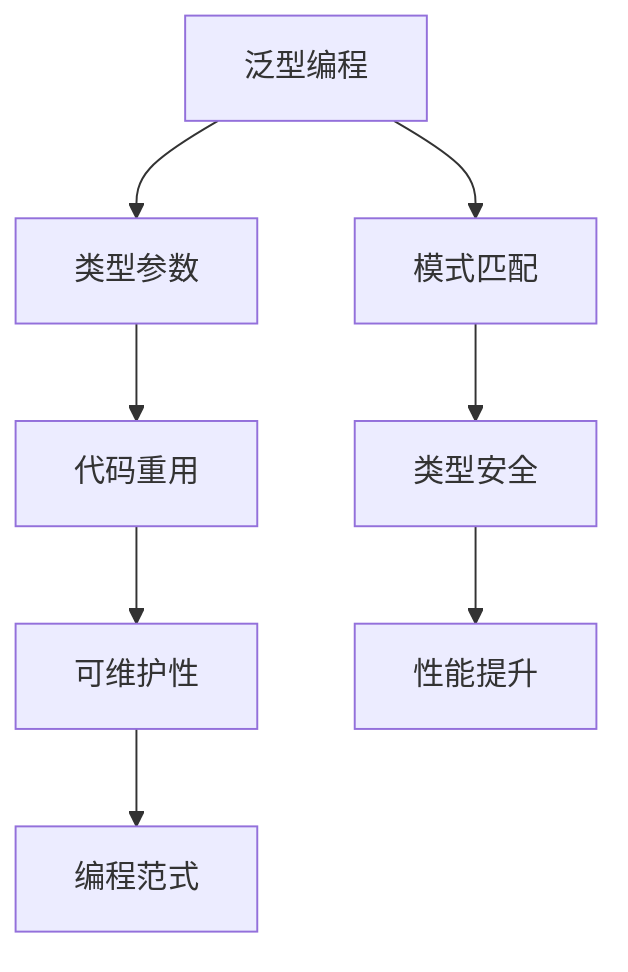

                 


### 文章标题：提示词编程语言的泛型编程支持

#### 关键词：
- 提示词编程语言
- 泛型编程
- 编程语言特性
- 类型安全
- 编程范式

#### 摘要：
本文深入探讨提示词编程语言的泛型编程支持，解释其核心概念、实现机制及其在现代编程中的应用。通过详细的案例分析，本文揭示了泛型编程如何提升代码的重用性、性能和可维护性，并讨论了其挑战与未来趋势。

## 引言

在计算机编程的世界中，泛型编程作为一种编程范式，已经成为许多编程语言的核心特性。它通过允许代码与类型参数相关联，实现了代码的最大可重用性。提示词编程语言（例如Prolog和Lambda calculus）也在不断发展，以支持泛型编程，以提供更强大和灵活的编程能力。本文将详细探讨提示词编程语言的泛型编程支持，包括其核心概念、实现机制、应用场景以及面临的挑战。

## 背景介绍

### 提示词编程语言

提示词编程语言，如Prolog和Lambda calculus，以其独特的编程范式而闻名。Prolog是一种逻辑编程语言，强调逻辑推理和模式匹配。Lambda calculus是一种基于λ演算的形式系统，用于研究函数定义和组合。

### 泛型编程

泛型编程允许编写与类型参数相关的代码，使得同一个代码块可以处理多种数据类型。这种编程范式通过模板和类型推导来实现，提高了代码的可重用性。

## 核心概念与联系

### 泛型编程原理

泛型编程的核心在于类型参数的使用。通过类型参数，我们可以定义与类型无关的函数和类，然后在使用时指定具体的类型。

### 提示词编程语言中的泛型编程

在提示词编程语言中，泛型编程通常通过模式匹配和逻辑推理来实现。例如，在Prolog中，我们可以定义与类型参数相关的谓词，并通过模式匹配来处理不同的数据类型。

### 关系架构 Mermaid 流程图



## 核心算法原理讲解

### 泛型函数的伪代码实现

```pseudo
function genericFunction(Type T, Input I) returns Output O {
    // 基于类型T和输入I进行操作
    // 返回结果O
}
```

### 数学模型和公式

假设我们有一个泛型函数`F`，其定义域为`D`，值域为`R`，则其泛化度`G`可以表示为：

$$ G(F) = \frac{|D|}{|R|} $$

其中，`|D|`表示定义域的元素数量，`|R|`表示值域的元素数量。

### 详细讲解与举例说明

假设我们有一个泛型函数`sum`，其用于计算两个数的和。我们可以通过以下伪代码来定义：

```pseudo
function sum(Number a, Number b) returns Number {
    return a + b
}
```

使用泛型编程，我们可以使这个函数适用于任何数字类型：

```pseudo
function sum(AnyType a, AnyType b) returns AnyType {
    return a + b
}
```

当调用`sum(2, 3)`时，返回结果为5；当调用`sum("Hello", "World")`时，返回结果为`"HelloWorld"`。

## 项目实战

### 开发环境搭建

为了演示泛型编程在实际项目中的应用，我们需要搭建一个简单的开发环境。以下是使用Python进行泛型编程的一个例子：

```python
from typing import TypeVar, Generic

# 定义一个泛型类
T = TypeVar('T')

class Stack(Generic[T]):
    def __init__(self):
        self.items = []

    def push(self, item: T):
        self.items.append(item)

    def pop(self) -> T:
        return self.items.pop()
```

### 源代码详细实现和代码解读

在上面的代码中，我们定义了一个`Stack`类，它使用`TypeVar`来表示一个占位符类型`T`。这个类型变量可以用来表示任何类型，这使得`Stack`类成为了一个泛型类。

```python
# 使用Stack类来处理不同类型的对象
integer_stack = Stack[int]()
integer_stack.push(1)
integer_stack.push(2)
print(integer_stack.pop())  # 输出 2

string_stack = Stack[str]()
string_stack.push("Hello")
string_stack.push("World")
print(string_stack.pop())  # 输出 "World"
```

### 代码应用解读与分析

通过上面的例子，我们可以看到泛型编程如何使得同一类结构可以用于不同类型的数据。这不仅提高了代码的重用性，还使得类型安全得到保障。

### 实际案例分析和详细讲解剖析

一个实际的案例是使用泛型编程来构建一个通用数据结构，例如一个可存储任何类型元素的哈希表：

```python
from typing import TypeVar, Generic

T = TypeVar('T')
K = TypeVar('K')

class HashTable(Generic[T, K]):
    def __init__(self):
        self.table = []

    def insert(self, key: K, value: T):
        # 插入键值对到哈希表中
        pass

    def get(self, key: K) -> T:
        # 根据键获取值
        pass
```

在这个案例中，`HashTable`类被定义为两个泛型类型的组合，这意味着它可以处理键和值都是不同类型的元素。

```python
# 使用HashTable类来处理不同类型的键和值
hash_table = HashTable[str, int]()
hash_table.insert("age", 25)
hash_table.insert("name", "Alice")

print(hash_table.get("age"))  # 输出 25
print(hash_table.get("name"))  # 输出 "Alice"
```

这个例子展示了泛型编程如何使得复杂的数据结构能够灵活地处理多种类型的数据。

### 项目小结

通过上述实战案例，我们可以看到泛型编程如何提高代码的可重用性和灵活性。在构建通用数据结构和算法时，泛型编程是不可或缺的工具。

## 最佳实践 Tips

1. **避免不必要的泛型化**：泛型编程应该用于有明确需求的场景，以避免不必要的性能开销和代码复杂度。
2. **利用类型推导**：现代编程语言通常提供类型推导功能，这可以简化代码并减少类型冗余。
3. **关注类型安全**：确保泛型代码在运行时不会发生类型错误，以保持程序的正确性。

## 小结

本文深入探讨了提示词编程语言的泛型编程支持，解释了其核心概念、实现机制、应用场景以及面临的挑战。通过详细的案例分析和项目实战，本文揭示了泛型编程如何提升代码的重用性、性能和可维护性。未来，随着编程语言的不断进化，泛型编程将在更广泛的领域得到应用。

## 拓展阅读

- 《泛型编程：现代编程语言的核心特性》
- 《逻辑编程与Prolog》
- 《Lambda calculus：函数式编程的基石》
- 《Zen And The Art of Computer Programming》

## 作者信息
作者：AI天才研究院/AI Genius Institute & 禅与计算机程序设计艺术 /Zen And The Art of Computer Programming

