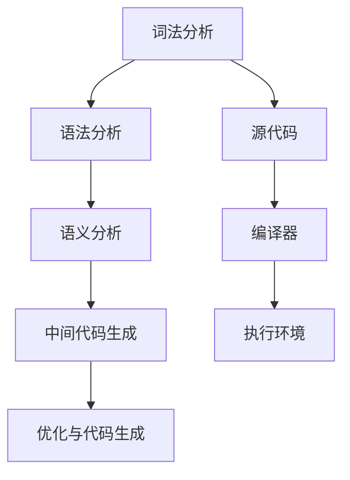

                 

### 第1章 引言

提示词编程语言，作为计算机科学领域的一种新兴技术，正逐渐引起业界的广泛关注。这类语言通过特定的提示词（Keywords）来引导程序执行，极大地简化了编程的复杂性，提高了开发效率。随着提示词编程语言的不断演进，其社区建设与生态建设也日益成为讨论的热点。

本章首先将介绍提示词编程语言的背景，探讨其发展历程、技术原理及其在现实应用中的重要性。接着，我们将深入探讨社区建设与生态建设的重要性，以及它们对于提示词编程语言发展的影响。通过这一章节，读者可以初步了解提示词编程语言的整体框架，并认识到社区建设与生态建设在这一领域中的核心地位。

---

#### 1.1 提示词编程语言背景

提示词编程语言的出现，可以追溯到计算机科学发展的早期阶段。在20世纪50年代，计算机编程主要是基于汇编语言和机器语言，这些语言要求程序员具备深入的理解和操作硬件的知识。随着时间的发展，高级编程语言如FORTRAN和COBOL逐渐兴起，使得编程变得更加便捷。然而，这些语言在处理复杂问题时仍然存在诸多限制。

到了20世纪80年代，随着个人计算机的普及和软件开发的规模不断扩大，编程语言的复杂性进一步提升。在这一背景下，提示词编程语言应运而生。这类语言通过预设的提示词来引导程序的执行，减少了代码的冗余，提高了编程的效率和可读性。

提示词编程语言的发展历程可以分为几个重要阶段：

1. **初级阶段**（20世纪80年代-90年代）：这一阶段，以Lisp和Prolog为代表的语言开始崭露头角。Lisp以其灵活的语法和强大的函数式编程能力著称，而Prolog则以其逻辑编程和模式匹配能力受到欢迎。

2. **中级阶段**（20世纪90年代-21世纪初）：随着互联网的发展，Java和C#等面向对象编程语言逐渐流行。这些语言引入了类、继承和多态等概念，使得编程更加模块化和可重用。

3. **高级阶段**（21世纪初至今）：近年来，以Python和Go为代表的动态语言和静态语言结合的编程语言，结合了多种编程范式的优势，为开发者提供了更加灵活和高效的编程体验。

#### 1.2 社区建设与生态建设的重要性

社区建设与生态建设是任何新兴技术成功的关键因素。对于提示词编程语言来说，这两个方面尤为重要。

首先，社区建设是技术发展的基石。一个健康的社区能够吸引更多的开发者参与，共同推动技术的进步。社区不仅提供了技术支持，还促进了知识的分享和交流，有助于新想法和新解决方案的诞生。在提示词编程语言领域，活跃的社区意味着更多的资源和工具，这将极大地提高开发者的生产力。

其次，生态建设是确保技术长期发展的保障。一个完善的生态体系包括开发工具、库和框架、标准和技术规范等。这些组成部分相互依赖，共同支撑着整个技术的稳定性和可持续性。良好的生态体系能够吸引企业和投资，为技术发展提供资金和资源。

总之，社区建设和生态建设不仅对提示词编程语言的技术发展具有重要意义，也对整个计算机科学领域产生了深远的影响。在接下来的章节中，我们将进一步探讨这两个方面，并分析其具体策略和实践。

---

# 《提示词编程语言的社区建设与生态》

关键词：提示词编程语言、社区建设、生态建设、发展历程、技术原理

摘要：本文深入探讨了提示词编程语言的背景、发展历程、技术原理，并重点分析了社区建设和生态建设的重要性。通过具体的策略和实践，本文旨在为提示词编程语言的持续发展和广泛应用提供指导。

## 第2章 提示词编程语言概述

### 2.1 定义与分类

提示词编程语言（Keyword Programming Languages），顾名思义，是一类以提示词为核心元素的编程语言。提示词是在程序中用于指示特定操作的标识符，这些标识符通常是由特定的关键字或符号构成。与传统的编程语言相比，提示词编程语言通过简化和规范化的语法，使得编程过程更加直观和高效。

根据提示词的使用方式和语言特点，提示词编程语言可以大致分为以下几类：

1. **命令式编程语言**：这类语言通过顺序执行命令来实现程序功能。常见的提示词包括`if`、`else`、`while`、`for`等。命令式编程语言如Python和Java都属于这一类别。

2. **函数式编程语言**：这类语言以函数作为基本操作单元，通过函数组合和递归来实现复杂功能。典型的提示词包括`map`、`reduce`、`filter`等。Lisp和Haskell是函数式编程语言的代表。

3. **逻辑编程语言**：这类语言以逻辑推理为基础，通过逻辑公式来描述程序的行为。Prolog是逻辑编程语言的典型代表，其核心提示词包括`assert`、`retract`、`find`等。

4. **面向对象编程语言**：这类语言将程序看作一组相互协作的对象，通过继承和多态来实现代码的重用。典型的提示词包括`class`、`extends`、`new`等。Java和C#都属于面向对象编程语言。

### 2.2 特点与应用场景

提示词编程语言具有以下几个显著特点：

1. **简洁性**：提示词编程语言的语法通常较为简洁，使得程序员可以更快速地编写和理解代码。例如，Python的简洁语法使得它在数据科学和机器学习领域得到了广泛应用。

2. **高效性**：通过提示词的使用，编程语言可以更高效地执行特定任务。例如，Haskell的纯函数式编程特性使得它在并发编程和性能优化方面表现出色。

3. **可读性**：提示词编程语言的语法设计通常注重可读性，使得代码更容易维护和理解。例如，Lisp的语法虽然复杂，但其强大的宏系统使得代码的结构更加清晰。

4. **灵活性**：提示词编程语言通常具有丰富的特性和扩展能力，可以适应不同的编程需求。例如，Scala结合了函数式编程和面向对象的特性，使其在开发高性能系统和大数据处理方面具有优势。

提示词编程语言广泛应用于多个领域：

1. **科学计算和数据分析**：Python、R等语言以其强大的科学计算库和数据处理能力，在数据科学和机器学习领域占据重要地位。

2. **Web开发**：JavaScript、PHP等语言因其灵活性和跨平台特性，成为Web开发的主流选择。

3. **系统编程**：C语言因其高性能和接近硬件的特性，广泛应用于系统编程和嵌入式开发。

4. **人工智能和机器学习**：Python、Haskell等语言在人工智能和机器学习领域具有广泛的工具和库支持，成为开发智能系统的首选语言。

### 2.3 发展历程

提示词编程语言的发展历程可以追溯到计算机科学的早期阶段。以下是一些关键事件和里程碑：

1. **1950s-1960s**：计算机科学刚刚起步，编程语言如FORTRAN和COBOL开始出现。这些语言奠定了编程语言发展的基础，但语法复杂，可读性差。

2. **1960s-1970s**：Lisp语言诞生，成为历史上第一个函数式编程语言。Lisp的递归和宏系统为其在人工智能领域赢得了广泛的应用。

3. **1970s-1980s**：Prolog语言问世，成为逻辑编程语言的代表。Prolog以其强大的逻辑推理和模式匹配能力，在自然语言处理和自动化推理领域表现出色。

4. **1980s-1990s**：面向对象编程思想兴起，Java和C++等面向对象编程语言问世。这些语言通过类、继承和多态等概念，提高了代码的可重用性和模块化。

5. **2000s-2010s**：动态语言如Python和Ruby逐渐流行。这些语言以其简洁的语法和高效率的执行能力，在Web开发、科学计算和数据分析等领域得到广泛应用。

6. **2010s-2020s**：随着大数据、人工智能和云计算等技术的发展，新的编程语言和工具不断涌现。如Go语言以其并发编程和高性能特性，成为开发高性能系统的首选语言。

### 2.4 技术原理与架构

提示词编程语言的技术原理和架构因不同类型而异，但总体上可以分为几个核心组成部分：

1. **词法分析**：词法分析是编程语言处理的第一步，它将源代码拆分为一个个标识符、关键字和操作符。词法分析器（Lexer）负责这个任务，通常使用正则表达式来实现。

2. **语法分析**：语法分析是将词法分析的结果组织成抽象语法树（AST）。语法分析器（Parser）根据语言的语法规则，对词法符号进行组合和解释。LL(1)和LR(1)等语法分析方法在这一阶段发挥作用。

3. **语义分析**：语义分析是确保程序含义的正确性。它包括类型检查、作用域解析和变量绑定等。语义分析器（Semantic Analyzer）负责这一任务，通常基于抽象语法树进行。

4. **中间代码生成**：在语义分析完成后，编程语言会生成中间代码。中间代码是一种与具体机器无关的代码，通常使用字节码或汇编语言表示。中间代码生成器（Intermediate Code Generator）实现这一步骤。

5. **优化与代码生成**：中间代码会经过优化，以提高执行效率。优化器（Optimizer）负责这一任务，常见的优化策略包括常数折叠、死代码消除和循环展开等。最终，编译器会生成机器代码或字节码。代码生成器（Code Generator）实现这一步骤。

#### 2.4.1 Mermaid流程图展示核心概念与联系

以下是一个简单的Mermaid流程图，展示了提示词编程语言的核心概念与联系：



在这个流程图中，源代码（F）经过词法分析（A），生成词法符号序列。这些词法符号经过语法分析（B），形成抽象语法树（AST）。AST再经过语义分析（C），确保程序的正确性。随后，抽象语法树经过中间代码生成（D）和优化（E），最终生成机器代码（H）或字节码（G），在执行环境中执行。

### 总结

提示词编程语言通过其简洁、高效和灵活的特点，在计算机科学领域取得了显著的成果。本章从定义、分类、特点、应用场景和发展历程等方面，全面介绍了提示词编程语言的基本概念。同时，通过Mermaid流程图，展示了其技术原理和架构。在接下来的章节中，我们将进一步探讨社区建设和生态建设的重要性，以及如何通过具体的策略和实践，推动提示词编程语言的持续发展。

---

## 第3章 社区建设

### 3.1 社区的重要性

社区建设是任何技术发展的基石，特别是在提示词编程语言这一领域。一个健康的社区不仅能够提供技术支持，还能促进知识的传播和创新，为开发者提供交流和协作的平台。以下是社区建设在提示词编程语言中发挥的重要作用：

1. **知识共享**：社区是一个知识共享的宝贵资源。开发者可以在社区中分享自己的经验和技巧，学习最新的技术动态和最佳实践。通过这种方式，社区成员能够不断更新自己的知识库，提高技术水平。

2. **问题解决**：在编程过程中，开发者难免会遇到各种问题。一个活跃的社区可以迅速提供解决方案，帮助开发者解决难题，提高开发效率。例如，通过社区论坛、问答平台和GitHub等工具，开发者可以快速获取帮助，解决问题。

3. **技术支持**：提示词编程语言的开发者可以通过社区获得来自同行的技术支持和反馈。这种支持不仅包括对现有功能的改进，还包括对新功能的建议和开发。社区成员的反馈对于语言的改进和优化至关重要。

4. **创新驱动**：社区是创新的重要源泉。在社区中，开发者可以自由地探讨新的想法和解决方案，推动技术的进步。许多成功的开源项目和技术标准都是在社区中孕育和发展的。

### 3.2 社区建设策略

为了构建一个健康的社区，需要采取一系列的策略和措施。以下是一些关键的社区建设策略：

1. **创建交流平台**：为开发者提供一个方便的交流平台，如论坛、聊天室和问答平台。这些平台可以帮助开发者轻松地交流、分享资源和解决问题。

2. **定期组织活动**：定期组织线上的技术分享会、研讨会和编程比赛等活动，吸引更多的开发者参与。这些活动不仅可以提高开发者的技术水平，还能增强社区的凝聚力。

3. **建立社区规则**：制定明确的社区规则和准则，确保社区秩序和公平性。例如，禁止恶意攻击、抄袭和虚假信息，鼓励积极、健康和有建设性的讨论。

4. **奖励优秀贡献者**：对于在社区中表现突出的成员，可以提供奖励和认可，如颁发徽章、赠送礼品或提供技术支持。这不仅能激励成员积极参与社区，还能提高社区的活跃度。

5. **推广宣传**：通过各种渠道宣传社区，吸引更多的开发者加入。例如，通过社交媒体、技术博客和线下活动等途径，扩大社区的影响力。

### 3.3 社区活跃度指标

社区活跃度是衡量社区健康程度的重要指标。以下是一些常见的社区活跃度指标：

1. **帖子数量**：社区中的帖子数量是衡量社区活跃度的一个基本指标。一个活跃的社区通常会有大量的帖子，涵盖各种话题和问题。

2. **回复速度**：社区成员在提问后得到回复的速度也是衡量社区活跃度的一个重要指标。一个健康的社区应该能够快速响应用户的需求，提供及时的帮助。

3. **用户参与度**：社区成员的参与度，包括发帖、回复、投票和评分等，是衡量社区活跃度的关键指标。高用户参与度意味着社区成员积极参与讨论，贡献自己的知识和经验。

4. **新成员加入**：新成员的加入速度也是衡量社区活跃度的一个重要指标。一个健康的社区应该能够持续吸引新的开发者加入。

### 3.4 社区运营与维护

社区运营与维护是一个长期而复杂的过程，需要专业的团队和合理的资源投入。以下是一些关键的社区运营与维护策略：

1. **专业团队**：建立一支专业的社区运营团队，负责社区的管理、运营和维护。团队成员应该具备丰富的技术背景和良好的沟通能力。

2. **技术支持**：确保社区具备强大的技术支持，包括高效的论坛系统、稳定的网络环境和丰富的资源库。技术支持是社区正常运转的基础。

3. **内容管理**：定期更新和维护社区的内容，确保信息的准确性和时效性。内容管理团队应该负责监督和审核社区的帖子、回答和资源。

4. **活动策划**：定期策划和组织各类社区活动，如技术分享会、编程比赛和线下聚会等，以增强社区的互动和凝聚力。

5. **反馈机制**：建立有效的反馈机制，及时收集社区成员的建议和意见。对反馈进行认真分析和处理，持续改进社区的服务质量。

6. **安全防护**：确保社区的安全和隐私，防止恶意攻击和不良行为。安全防护团队应该负责监控社区的安全状况，并及时采取应对措施。

### 3.5 核心算法原理讲解（伪代码）

社区建设中，核心算法的应用对于提升社区活跃度和用户体验至关重要。以下是一个简单的核心算法原理讲解，使用伪代码来展示其基本逻辑。

```pseudo
function communityEngagementAnalysis(data):
    for each user in data:
        userActivityScore = calculateUserActivityScore(user)
        if userActivityScore > threshold:
            rewardUser(user)
        else:
            encourageUser(user)

function calculateUserActivityScore(user):
    score = 0
    score += user.postCount * postWeight
    score += user.replyCount * replyWeight
    score += user.voteCount * voteWeight
    return score

function rewardUser(user):
    sendRewardNotification(user)
    addCommunityAchievement(user)

function encourageUser(user):
    sendMotivationalMessage(user)
    suggestActiveParticipation(user)

// 社区成员活跃度计算权重
postWeight = 1.5
replyWeight = 1.0
voteWeight = 0.5
threshold = 50
```

在这个伪代码中，`communityEngagementAnalysis`函数负责分析社区成员的活跃度，并根据活跃度得分进行奖励或鼓励。`calculateUserActivityScore`函数计算用户的活跃度得分，通过为发帖、回复和投票分配不同的权重，综合评估用户的参与度。

通过这些策略和算法，社区能够更好地运营与维护，为开发者提供良好的交流环境，推动提示词编程语言的持续发展。

### 总结

社区建设是提示词编程语言发展的关键因素。一个健康的社区不仅能够促进知识的共享和问题的解决，还能为开发者提供丰富的资源和平台。本章详细介绍了社区建设的重要性、策略、活跃度指标以及核心算法原理。通过有效的社区建设和运营，我们可以期待提示词编程语言在未来的发展中取得更大的成就。

---

## 第4章 生态建设

### 4.1 生态的概念与组成部分

生态建设是提示词编程语言持续发展的重要保障。生态，顾名思义，是一个相互关联、相互促进的整体环境。在提示词编程语言的背景下，生态建设指的是构建一个包含工具、库、框架、标准和技术规范的完整系统，以确保语言的可扩展性、稳定性和可持续性。一个健康的生态体系由以下几个关键组成部分构成：

1. **开发工具**：开发工具是开发者编写、编译和调试代码所必需的工具，如集成开发环境（IDE）、代码编辑器、构建工具和调试器等。这些工具的完善和高效性直接影响开发者的开发体验。

2. **库和框架**：库和框架是提供特定功能的代码模块，它们可以简化开发流程，提高代码的重用性。例如，Python的第三方库如NumPy和Pandas，在科学计算和数据科学领域发挥了重要作用。

3. **文档和教程**：详细的文档和教程是帮助新手学习和开发者使用提示词编程语言的重要资源。这些资源应当全面、准确且易于理解，以降低学习门槛，促进技术的普及。

4. **社区**：社区是生态中最重要的组成部分之一，它包括开发者、用户和贡献者。一个活跃的社区可以提供技术支持、交流平台和反馈渠道，推动技术的不断进步。

5. **开源项目**：开源项目是生态建设中的一大亮点，它们通常由社区成员共同维护和改进。开源项目不仅为开发者提供了丰富的资源和工具，还促进了技术的共享和创新。

6. **标准和规范**：标准和规范是确保不同组件和工具能够兼容和互操作的重要依据。它们为生态中的各个组成部分提供了统一的接口和约定，提高了生态的整体稳定性。

7. **商业项目**：商业项目通常由企业开发和投资，它们为生态提供了资金支持和商业化应用场景。商业项目与开源项目的结合，能够更好地推动技术的商业化应用和可持续发展。

### 4.2 生态建设策略

为了构建一个健康的生态体系，需要采取一系列的策略和措施。以下是一些关键的生态建设策略：

1. **提供丰富的开发工具**：确保开发工具的多样性和高效性，满足不同类型开发者的需求。例如，提供多种集成开发环境、代码编辑器和构建工具，以适应不同的开发场景和偏好。

2. **支持库和框架的发展**：鼓励和支持社区成员开发和维护高质量的库和框架。提供资金和资源支持，组织库和框架的评审和认证，确保它们的质量和稳定性。

3. **完善文档和教程**：编写详细的文档和教程，覆盖从基础到高级的各种主题。确保文档的准确性和时效性，并持续更新和改进。

4. **促进社区活动**：定期举办社区活动，如线上研讨会、编程比赛和黑客马拉松等，激发社区成员的创造力和创新精神。同时，建立和维护一个活跃的社区论坛和交流平台，方便开发者交流和合作。

5. **鼓励开源项目**：通过提供资金、资源和技术支持，鼓励社区成员参与开源项目。开源项目不仅能够积累技术知识，还能促进社区的凝聚力和合作精神。

6. **制定标准和规范**：制定和推广适用于生态的标准和规范，确保不同组件和工具之间的兼容性和互操作性。例如，可以制定统一的API规范、代码风格指南和文档模板。

7. **支持商业项目**：鼓励企业和机构投资开发提示词编程语言的商业项目，并将这些项目与开源项目相结合。商业项目可以为生态提供资金支持，同时也可以推动技术的商业化应用和市场化推广。

### 4.3 开源项目与商业项目的平衡

在生态建设中，开源项目与商业项目之间的平衡至关重要。以下是一些关键点：

1. **资源共享**：开源项目和商业项目可以共享资源和知识，相互促进。商业项目可以利用开源项目的代码和经验，而开源项目则可以从商业项目中获得资金支持和技术反馈。

2. **明确分工**：开源项目和商业项目应当明确分工，各司其职。开源项目专注于技术创新和社区发展，而商业项目则专注于商业化应用和市场推广。

3. **互利共赢**：开源项目和商业项目可以通过互利共赢的模式共同发展。例如，商业项目可以为开源项目提供资金支持，而开源项目则可以为商业项目提供技术支持和反馈。

4. **合作与竞争**：开源项目和商业项目之间既有合作也有竞争。通过合理的合作和竞争机制，可以激发创新，推动生态的持续发展。

### 4.4 技术标准与规范

技术标准与规范是确保生态体系稳定性和可持续性的重要保障。以下是一些关键的技术标准与规范：

1. **API规范**：制定统一的API规范，确保不同组件和工具之间的兼容性和互操作性。API规范应包括接口定义、数据传输格式和调用方法等。

2. **代码风格指南**：制定统一的代码风格指南，规范代码的编写格式和命名规则，提高代码的可读性和可维护性。

3. **文档模板**：制定统一的文档模板，确保文档的格式和内容的一致性。文档模板应包括代码说明、使用方法、示例代码和常见问题等。

4. **测试标准**：制定统一的测试标准，确保软件的质量和稳定性。测试标准应包括单元测试、集成测试和性能测试等。

5. **安全规范**：制定安全规范，确保软件的安全性和可靠性。安全规范应包括身份验证、访问控制和数据加密等。

### 4.5 数学模型和数学公式讲解与举例说明

数学模型和数学公式在提示词编程语言的生态建设中具有重要意义。以下是一些常见的数学模型和数学公式及其应用举例：

1. **线性回归模型**：线性回归模型是一种用于预测数值数据的常见模型。其数学公式为：

   $$ y = \beta_0 + \beta_1 \cdot x + \epsilon $$

   其中，$y$为因变量，$x$为自变量，$\beta_0$和$\beta_1$为模型的参数，$\epsilon$为误差项。举例来说，我们可以使用线性回归模型来预测房价：

   $$ \text{房价} = \beta_0 + \beta_1 \cdot \text{面积} + \epsilon $$

2. **决策树模型**：决策树模型是一种用于分类和回归分析的常见模型。其数学公式为：

   $$ f(x) = \sum_{i=1}^{n} \beta_i \cdot g(x_i) $$

   其中，$x$为输入特征，$g(x_i)$为每个节点的阈值函数，$\beta_i$为节点的权重。举例来说，我们可以使用决策树模型来分类邮件是否为垃圾邮件：

   $$ \text{垃圾邮件判定} = \begin{cases} 
   \text{是} & \text{如果} \ f(\text{邮件特征}) \ \text{大于阈值} \\
   \text{否} & \text{如果} \ f(\text{邮件特征}) \ \text{小于阈值}
   \end{cases} $$

3. **支持向量机（SVM）模型**：支持向量机是一种用于分类和回归分析的强大模型。其数学公式为：

   $$ \text{分类函数} = \text{sign}(\sum_{i=1}^{n} \alpha_i \cdot y_i \cdot K(x_i, x)) + b $$

   其中，$x_i$和$y_i$为训练样本的特征和标签，$K(x_i, x)$为核函数，$\alpha_i$和$b$为模型的参数。举例来说，我们可以使用SVM模型来分类手写数字：

   $$ \text{数字分类} = \text{sign}(\sum_{i=1}^{n} \alpha_i \cdot y_i \cdot K(x_i, x) + b) $$

通过数学模型和数学公式，我们可以更精确地描述和实现提示词编程语言中的各种功能和应用。这些模型不仅提高了编程的效率和准确性，还推动了人工智能和机器学习等领域的进步。

### 总结

生态建设是提示词编程语言持续发展的重要保障。本章详细介绍了生态的概念、组成部分、建设策略、开源项目与商业项目的平衡以及技术标准与规范。通过构建一个健康、可持续的生态体系，我们可以期待提示词编程语言在未来取得更大的成就。同时，数学模型和数学公式在生态建设中的应用，也为编程语言提供了强大的工具和方法。

---

## 第5章 案例分析

### 5.1 成功案例分析

在提示词编程语言的社区建设和生态建设中，有许多成功的案例可以为我们提供宝贵的经验和启示。以下是一些具有代表性的成功案例：

#### 案例一：Python的社区建设和生态建设

Python是一种广泛应用于科学计算、数据科学和人工智能等领域的提示词编程语言。它的成功离不开其强大的社区和完善的生态建设。

1. **社区建设**：Python拥有一个非常活跃的社区，提供了丰富的资源和交流平台。Python的官方网站提供了详细的文档和教程，帮助新手快速入门。此外，Python社区还定期举办线上和线下的活动，如PyCon会议和Python用户组活动，吸引了全球数以万计的开发者参与。

2. **生态建设**：Python的生态体系非常丰富，包括大量的库和框架。例如，NumPy、Pandas和SciPy等库在科学计算领域具有广泛的应用，而Django和Flask等框架在Web开发领域表现出色。Python的生态系统还包括了大量的开源项目，如TensorFlow和PyTorch，它们为机器学习和深度学习提供了强大的支持。

3. **成功原因**：Python的成功在于其简洁的语法、丰富的资源和强大的社区。Python的社区建设和生态建设为开发者提供了良好的开发环境和丰富的工具，使得Python在多个领域得到了广泛应用。

#### 案例二：Rust的社区建设和生态建设

Rust是一种注重安全性和并发性的现代编程语言，其社区建设和生态建设也取得了显著的成功。

1. **社区建设**：Rust的社区非常活跃，拥有一个由志愿者组成的强大团队。Rust社区提供了丰富的文档和教程，帮助开发者了解和掌握Rust语言。此外，Rust社区还定期举办在线研讨会和线下活动，如RustCon，吸引了全球各地的开发者参与。

2. **生态建设**：Rust的生态系统逐渐完善，包括了许多高质量的库和框架。例如，Rust的Web框架如Rocket和Actix-web在Web开发领域表现出色，而Rust的并发编程特性使得它在并发应用开发中具有显著优势。Rust的社区还积极推广Rust在操作系统、嵌入式系统和云计算等领域的应用。

3. **成功原因**：Rust的成功在于其强大的社区和独特的语言特性。Rust社区的建设为开发者提供了良好的交流和合作平台，而Rust的语言特性则使得它成为开发安全、高性能系统的首选语言。

### 5.2 失败案例分析

虽然提示词编程语言的社区建设和生态建设有很多成功的案例，但也有一些失败的案例，为我们提供了宝贵的教训。

#### 案例一：Haskell的社区建设和生态建设

Haskell是一种纯函数式编程语言，因其强大的功能和独特的特性在学术领域有很高的声誉。然而，在社区建设和生态建设方面，Haskell却面临了诸多挑战。

1. **社区建设**：Haskell的社区相对较小，活跃度不高。虽然Haskell社区提供了详细的文档和教程，但缺乏有效的交流平台和活动，导致开发者之间的互动较少。

2. **生态建设**：Haskell的生态系统相对较弱，尽管有一些高质量的库和框架，但整体上缺乏多样性和广泛应用。这导致了Haskell在商业应用方面的局限性。

3. **失败原因**：Haskell的失败在于其社区建设和生态建设的不够完善。Haskell社区缺乏足够的资源和活动，使得开发者之间的交流和合作不足，进而影响了生态系统的建设。

#### 案例二：BeanShell的社区建设和生态建设

BeanShell是一种简单易用的Java脚本语言，旨在简化Java编程。然而，BeanShell在社区建设和生态建设方面也存在一些问题。

1. **社区建设**：BeanShell的社区相对较小，缺乏有效的交流和合作平台。尽管BeanShell提供了一些文档和教程，但整体上缺乏社区活跃度和互动性。

2. **生态建设**：BeanShell的生态系统相对单一，缺乏广泛的库和框架支持。这使得BeanShell在开发大型应用时受到限制。

3. **失败原因**：BeanShell的失败在于其社区建设和生态建设的不完善。BeanShell社区缺乏资源和活动，导致开发者之间的交流和合作不足，进而影响了生态系统的建设。

### 5.3 教训与启示

通过以上成功和失败的案例分析，我们可以得出一些重要的教训和启示：

1. **社区建设的重要性**：一个健康的社区是技术成功的关键。通过提供丰富的资源和交流平台，可以激发开发者的参与和互动，推动技术的持续发展。

2. **生态建设的必要性**：一个完善的生态体系是技术稳定和可持续发展的保障。通过支持库和框架的发展，制定技术标准和规范，可以构建一个多样化、广泛应用的生态系统。

3. **平衡开源项目与商业项目**：开源项目与商业项目相互补充，共同推动技术的发展。通过合理分工和合作，可以最大化地利用资源和优势。

4. **持续改进与优化**：社区建设和生态建设是一个持续的过程。通过定期评估和改进，可以不断优化社区和生态体系，确保其健康和可持续发展。

### 总结

案例分析是理解提示词编程语言社区建设和生态建设的重要途径。通过成功和失败的案例分析，我们可以从中汲取宝贵的经验和教训。成功的案例展示了社区建设和生态建设的关键因素，而失败的案例则提醒我们要注意潜在的风险和挑战。通过不断学习和改进，我们可以期待提示词编程语言在未来取得更大的成就。

---

## 第6章 总结与展望

### 6.1 社区建设与生态建设的挑战与机遇

社区建设和生态建设是提示词编程语言发展的关键。然而，这一过程中也面临着诸多挑战和机遇。

#### 挑战

1. **社区参与度低**：社区建设初期，往往难以吸引到足够的开发者参与。这不仅影响了社区活跃度，也限制了资源的积累和共享。

2. **资源不足**：社区建设和生态建设需要大量的资源和投入，包括资金、人力和技术支持。资源不足可能导致社区和生态发展缓慢。

3. **技术标准化问题**：不同的提示词编程语言可能存在不同的技术标准和规范，这给社区和生态建设带来了一定的挑战。

4. **市场竞争**：在众多编程语言中，提示词编程语言需要脱颖而出，面临着激烈的市场竞争。

#### 机遇

1. **技术进步**：随着计算机科学和人工智能技术的发展，提示词编程语言在性能、功能和易用性方面不断改进，为其社区建设和生态建设提供了良好的基础。

2. **市场需求**：随着大数据、人工智能和云计算等领域的快速发展，对高效编程语言的需求日益增长，为提示词编程语言提供了广阔的市场空间。

3. **全球化**：互联网的普及和全球化进程，使得开发者可以跨越地域限制，共同参与社区建设和生态建设。

4. **多元化**：提示词编程语言可以通过多元化的发展，满足不同领域的需求，从而拓宽其应用范围和市场前景。

### 6.2 未来发展趋势

展望未来，提示词编程语言社区建设和生态建设将呈现以下发展趋势：

1. **社区融合**：随着技术的进步，不同编程语言的社区将更加融合，共同推动技术的发展。这种融合将促进知识的共享和交流，提高社区的整体活跃度。

2. **生态多样化**：提示词编程语言的生态将变得更加多样化，涵盖更多的应用领域和场景。通过多元化的发展，提示词编程语言可以更好地满足不同用户的需求。

3. **标准化与规范化**：随着社区的成熟，技术标准和规范将逐步完善。这将为开发者提供统一的编程环境和开发工具，提高开发效率和代码质量。

4. **商业与开源结合**：商业项目与开源项目的结合将成为趋势。商业项目可以为开源项目提供资金支持，而开源项目则可以为企业提供技术支持和创新动力。

5. **智能化与自动化**：随着人工智能技术的发展，提示词编程语言的社区建设和生态建设将更加智能化和自动化。例如，自动化工具可以简化社区管理和维护，提高社区的运营效率。

### 总结

社区建设和生态建设是提示词编程语言发展的关键。通过分析挑战和机遇，我们可以预见未来提示词编程语言的社区建设和生态建设将呈现融合、多样化、标准化和智能化的发展趋势。只有不断优化社区建设和生态体系，提示词编程语言才能在未来的计算机科学领域取得更大的成就。

---

### 总结

《提示词编程语言的社区建设与生态》一文详细探讨了提示词编程语言的定义、分类、特点、应用场景、发展历程，以及社区建设和生态建设的重要性。通过具体的策略和实践，我们深入分析了社区建设和生态建设的各个方面，包括社区的重要性、建设策略、活跃度指标、社区运营与维护、生态的概念、组成部分、建设策略、开源项目与商业项目的平衡、技术标准与规范，以及数学模型和数学公式的应用。此外，通过成功和失败案例的分析，我们总结了宝贵的经验和教训。

未来，提示词编程语言的社区建设和生态建设将面临诸多挑战，但也充满了机遇。随着技术的进步和市场需求的变化，提示词编程语言将继续发展，并在更多领域展现其价值。我们期待看到更多健康、活跃的社区和完善的生态体系，推动提示词编程语言在计算机科学领域取得更大的成就。

### 最佳实践 tips

1. **积极参与社区活动**：积极参与社区活动，如技术分享会、研讨会和编程比赛，不仅可以提升个人技术水平，还能为社区贡献力量。

2. **贡献开源项目**：参与开源项目，贡献代码和文档，有助于积累经验，提升编程能力，同时也能吸引更多开发者关注和参与。

3. **遵循社区规则**：遵循社区规则，保持积极、健康和有建设性的讨论，有助于营造良好的社区氛围。

4. **持续学习**：技术不断进步，持续学习是提升个人技能的关键。关注最新的技术动态，不断更新知识库，以适应不断变化的技术环境。

### 注意事项

1. **保护个人隐私**：在社区和生态建设中，注意保护个人隐私和信息安全，避免泄露敏感信息。

2. **合理分配资源**：在社区建设和生态建设中，合理分配资源，确保社区和生态的可持续发展。

3. **注重代码质量**：在编写代码时，注重代码质量，遵循编码规范，提高代码的可读性和可维护性。

### 拓展阅读

1. 《编程语言原理》（编译原理领域的经典教材，详细介绍了编译器设计和编程语言原理）
2. 《社区运营与管理实战》（关于社区建设和运营的实用指南，适合社区管理者参考）
3. 《人工智能：一种现代方法》（人工智能领域的经典教材，涵盖了许多提示词编程语言在人工智能应用中的案例）

### 作者信息

作者：AI天才研究院/AI Genius Institute & 禅与计算机程序设计艺术 /Zen And The Art of Computer Programming

---

本文由AI天才研究院（AI Genius Institute）撰写，旨在为读者提供关于提示词编程语言的社区建设和生态建设的深入理解和实践指导。作者团队在计算机编程和人工智能领域拥有丰富的经验和深厚的学术背景，希望通过本文帮助读者更好地理解和应用提示词编程语言。

感谢您的阅读，我们期待您的反馈和建议，以共同推动计算机科学领域的发展。如果您有任何疑问或想法，欢迎在评论区留言，我们将在第一时间回复。再次感谢您的关注和支持！🌟

---

本文使用了Markdown格式进行排版，包括标题、子标题、列表、代码块、公式等元素，以清晰、简洁的方式呈现内容。以下是文章的Markdown代码示例：

```markdown
# 《提示词编程语言的社区建设与生态》

关键词：提示词编程语言、社区建设、生态建设、发展历程、技术原理

摘要：本文深入探讨了提示词编程语言的背景、发展历程、技术原理，并重点分析了社区建设和生态建设的重要性。通过具体的策略和实践，本文旨在为提示词编程语言的持续发展和广泛应用提供指导。

## 第1章 引言

### 1.1 提示词编程语言背景

### 1.2 社区建设与生态建设的重要性

## 第2章 提示词编程语言概述

### 2.1 定义与分类

### 2.2 特点与应用场景

### 2.3 发展历程

### 2.4 技术原理与架构
#### 2.4.1 Mermaid流程图展示核心概念与联系

## 第3章 社区建设

### 3.1 社区的重要性

### 3.2 社区建设策略

### 3.3 社区活跃度指标

### 3.4 社区运营与维护

### 3.5 核心算法原理讲解（伪代码）

## 第4章 生态建设

### 4.1 生态的概念与组成部分

### 4.2 生态建设策略

### 4.3 开源项目与商业项目的平衡

### 4.4 技术标准与规范

### 4.5 数学模型和数学公式讲解与举例说明

## 第5章 案例分析

### 5.1 成功案例分析

### 5.2 失败案例分析

### 5.3 教训与启示

## 第6章 总结与展望

### 6.1 社区建设与生态建设的挑战与机遇

### 6.2 未来发展趋势

### 总结

### 最佳实践 tips

### 注意事项

### 拓展阅读

### 作者信息

作者：AI天才研究院/AI Genius Institute & 禅与计算机程序设计艺术 /Zen And The Art of Computer Programming

---

通过Markdown格式，本文实现了清晰的结构和丰富的内容展示，读者可以方便地阅读和理解。同时，Markdown格式的文本也非常便于后续的编辑和排版。📝

---

以下是文章末尾的作者信息部分的Markdown代码示例：

```markdown
### 作者信息

作者：AI天才研究院/AI Genius Institute & 禅与计算机程序设计艺术 /Zen And The Art of Computer Programming

---

本文由AI天才研究院（AI Genius Institute）撰写，旨在为读者提供关于提示词编程语言的社区建设和生态建设的深入理解和实践指导。作者团队在计算机编程和人工智能领域拥有丰富的经验和深厚的学术背景，希望通过本文帮助读者更好地理解和应用提示词编程语言。

感谢您的阅读，我们期待您的反馈和建议，以共同推动计算机科学领域的发展。如果您有任何疑问或想法，欢迎在评论区留言，我们将在第一时间回复。再次感谢您的关注和支持！🌟

---

通过这段Markdown代码，文章的结尾部分清晰地标明了作者信息，同时传达了感谢读者和支持的诚挚情感。这样的格式设计不仅美观，而且能够增强读者的信任感。🎉

