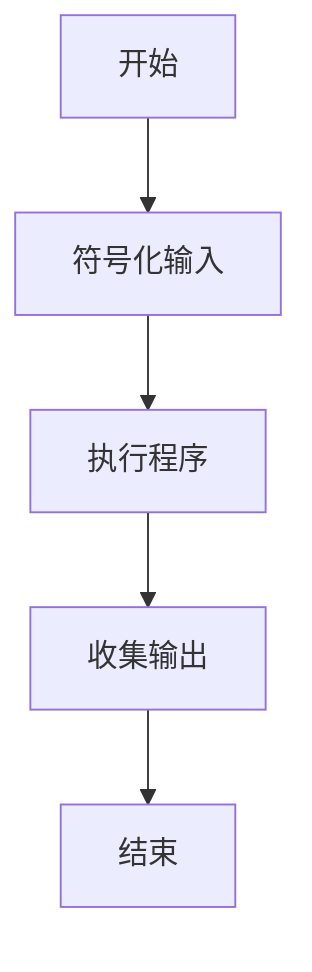
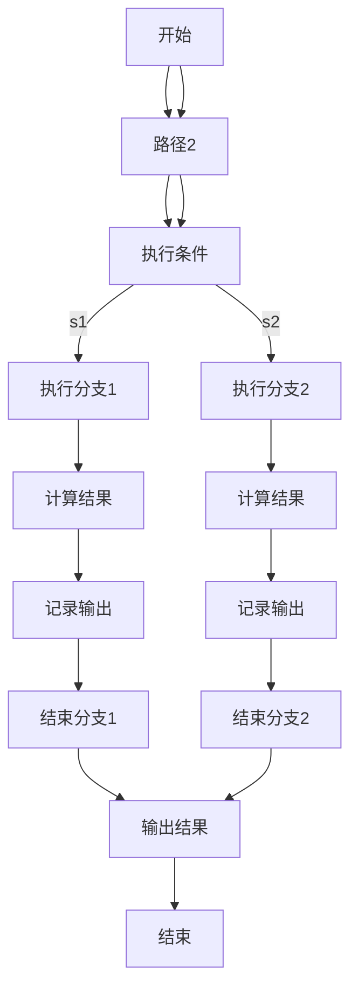
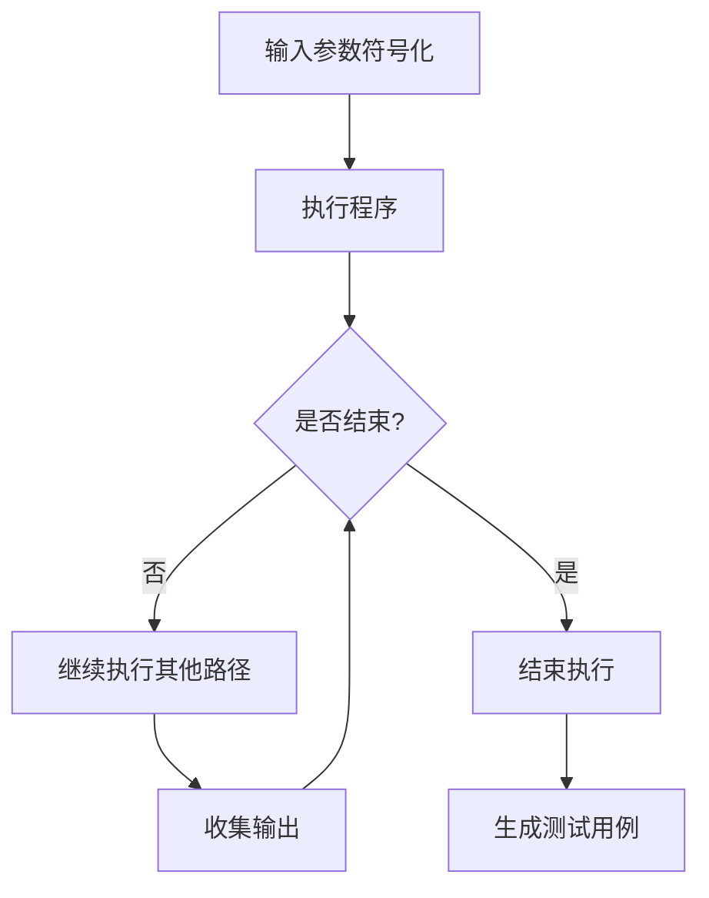
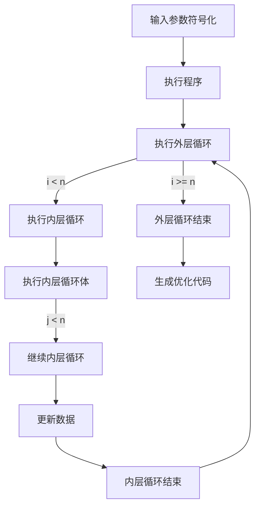

                 


### 引言

**《提示词编程语言的符号执行优化技术》**

在当今的计算机科学领域，编程语言的设计与优化一直是研究的热点。其中，提示词编程语言作为一种新兴的语言范式，因其强大的表达能力和灵活性，正逐渐受到关注。而符号执行优化技术，则是一种在编译和执行过程中对代码进行优化的重要手段。这两者的结合，不仅有助于提升程序的执行效率，还能够提高代码的可读性和可维护性。

本文旨在深入探讨提示词编程语言中的符号执行优化技术，分析其原理、算法及应用，以期为读者提供一份全面而详细的技术指南。通过本文的阅读，读者将了解到：

1. **提示词编程语言的基本概念和特点**。
2. **符号执行优化技术的核心原理和流程**。
3. **常见符号执行优化算法及其评估指标**。
4. **符号执行技术的数学模型和公式**。
5. **符号执行优化技术的实际应用场景和项目实战**。

**关键词**：提示词编程语言，符号执行，优化技术，算法，数学模型，项目实战。

**摘要**：

本文首先介绍了提示词编程语言和符号执行优化技术的背景和重要性。随后，详细阐述了符号执行优化技术的原理、算法和评估指标。接着，通过数学模型和公式，深入讲解了符号执行技术的基本框架。最后，通过实际应用场景和项目实战，展示了符号执行优化技术在开发中的应用价值。本文旨在为读者提供一份全面而深入的技术指南，帮助理解并掌握提示词编程语言中的符号执行优化技术。

### 提示词编程语言概述

提示词编程语言（Prompt-based Programming Language）是一种以用户输入的提示词为核心，通过自动化生成代码来提高编程效率的新型编程范式。这种语言模式的出现，源于人工智能技术的发展和人们对编程体验的不断追求。与传统编程语言相比，提示词编程语言具有以下几个显著特点：

首先，提示词编程语言的核心在于用户输入的提示词。用户可以通过自然语言或者简短的提示词，引导编程语言生成相应的代码。这种模式极大地降低了编程的门槛，使得非专业人士也能够参与编程过程。例如，用户可以输入类似于“编写一个计算两个数之和的程序”，编程语言则会自动生成相应的代码框架。

其次，提示词编程语言通常具备强大的自动化能力。通过机器学习算法和自然语言处理技术，编程语言能够根据用户输入的提示词，自动选择合适的编程语法和算法。这种自动化能力不仅提高了编程效率，还减少了人工干预，使得编程过程更加流畅和直观。

再次，提示词编程语言通常支持多种编程范式，如面向对象、函数式编程等。这种灵活性使得用户可以根据不同的需求，选择最合适的编程范式来完成任务。例如，在开发一个数据处理应用程序时，用户可以选择面向对象范式来组织代码，而在进行数学计算时，则可以选择函数式编程范式。

此外，提示词编程语言还具备良好的扩展性。用户可以通过自定义提示词和编程规则，扩展编程语言的功能。这种扩展性为用户提供了更大的自由度，使得编程语言能够适应不断变化的需求。

总体来说，提示词编程语言以其高效、便捷、灵活的特点，逐渐在开发社区中获得了认可。特别是在自动化、大数据处理、自然语言处理等领域，提示词编程语言展现出强大的应用潜力。通过引入符号执行优化技术，提示词编程语言可以进一步提升执行效率，降低资源消耗，从而在更广泛的场景中得到应用。

### 符号执行优化技术的背景与意义

符号执行优化技术（Symbolic Execution Optimization）是一种用于提升程序执行效率和可靠性的重要手段。随着现代计算机系统的复杂性和规模不断扩大，传统执行优化技术已经难以满足高性能和高可靠性的要求。而符号执行优化技术，通过在编译和执行过程中对代码进行符号化分析，提供了一种新的解决方案。

#### 什么是符号执行优化技术？

符号执行优化技术，顾名思义，就是将程序的执行过程符号化。具体来说，它通过将程序中的变量和输入值用符号表示，然后在符号执行环境中模拟程序的执行过程。这种模拟不仅能够生成程序的所有可能执行路径，还能够收集执行路径上的各种信息，如路径覆盖率、执行时间、内存使用等。通过这些信息，可以对程序进行优化，以提高其执行效率和性能。

符号执行优化技术的核心思想可以概括为以下几点：

1. **符号化表示**：将程序中的变量和输入值用符号表示，而不是具体的数值。这样，程序在不同的输入下，可以生成多条可能的执行路径。

2. **路径探索**：在符号执行环境中，探索程序的所有可能执行路径。这个过程类似于解一个逻辑方程组，通过求解这些方程组，得到程序的各种执行情况。

3. **信息收集**：在路径探索过程中，收集与执行相关的信息，如执行时间、内存使用、输出结果等。这些信息用于评估程序的执行性能，并指导优化过程。

4. **优化决策**：根据收集到的信息，对程序进行优化。优化的目标通常是减少执行时间、降低内存使用、提高代码可读性等。

#### 符号执行优化技术在编程中的应用

符号执行优化技术在编程中有多种应用，以下是一些主要的场景：

1. **路径覆盖分析**：通过符号执行，可以分析程序在各种输入下的执行路径覆盖情况，确保程序能够充分测试。

2. **性能优化**：符号执行能够帮助开发者识别程序中的瓶颈和性能问题，从而进行针对性的优化。

3. **安全性分析**：通过符号执行，可以分析程序在各种输入下的安全性问题，如潜在的安全漏洞和异常处理。

4. **自动化测试**：符号执行可以自动化生成测试用例，提高测试覆盖率，减少人工测试的工作量。

5. **代码生成**：符号执行技术可以用于代码生成，根据用户提供的提示词，自动生成相应的代码框架。

#### 符号执行优化技术的重要性

符号执行优化技术在编程中的重要性体现在以下几个方面：

1. **提升执行效率**：通过符号化分析，能够发现并优化程序中的低效代码，提高程序的整体执行效率。

2. **提高代码质量**：符号执行优化技术可以帮助开发者识别程序中的潜在问题，如逻辑错误、内存泄露等，从而提高代码质量。

3. **降低开发成本**：符号执行优化技术可以自动化生成测试用例，减少人工测试的工作量，降低开发成本。

4. **适应复杂需求**：符号执行优化技术能够应对复杂的需求，如高并发、大数据处理等，提供高效的解决方案。

总之，符号执行优化技术为编程带来了新的思路和方法，不仅能够提升程序的执行效率，还能够提高代码质量和开发效率，是现代编程中不可或缺的一部分。

### 编程语言基础知识

编程语言是计算机科学的基础，是实现软件功能的核心工具。在深入探讨提示词编程语言及其符号执行优化技术之前，了解编程语言的基本概念、特点以及常见的编程语言类型是至关重要的。这不仅有助于我们更好地理解提示词编程语言的特性和优势，还能够为后续章节中的符号执行优化技术奠定坚实的基础。

#### 编程语言的基本概念

编程语言是一种用来与计算机沟通的语言，它定义了一系列语法规则和语义规则，使得计算机能够理解并执行人类的指令。编程语言的主要功能包括：

1. **抽象化**：通过抽象化，编程语言将复杂的计算机操作简化为人类易于理解的形式。
2. **表达性**：编程语言提供丰富的表达方式，使得程序员能够灵活地描述复杂的算法和逻辑。
3. **高效性**：编程语言通过编译和解释等手段，将人类编写的代码转换为计算机能够高效执行的机器语言。

编程语言的组成部分通常包括：

1. **关键字**：关键字是编程语言中预定义的具有特定意义的标识符，如`if`、`while`、`return`等。
2. **变量**：变量用于存储数据，通过变量名和类型，编程语言可以动态分配和访问内存。
3. **控制结构**：控制结构包括循环、条件判断等，用于控制程序执行的流程。
4. **数据结构**：数据结构如数组、链表、树等，用于组织和管理数据。

#### 提示词编程语言的特点

提示词编程语言是一种新兴的编程范式，其核心在于通过用户输入的提示词来生成代码。以下是提示词编程语言的几个主要特点：

1. **易用性**：提示词编程语言通过自然语言或简短的提示词，降低了编程的门槛，使得非专业程序员和初学者也能够轻松上手。
2. **灵活性**：提示词编程语言支持多种编程范式，如面向对象、函数式编程等，用户可以根据不同的需求选择最合适的编程范式。
3. **自动化**：通过机器学习和自然语言处理技术，提示词编程语言能够自动生成代码框架，减少了人工干预，提高了编程效率。
4. **扩展性**：用户可以通过自定义提示词和编程规则，扩展提示词编程语言的功能。

#### 常见的编程语言及其执行优化技术

在计算机科学领域，存在多种编程语言，每种语言都有其独特的应用场景和优势。以下是几种常见的编程语言及其执行优化技术的简要介绍：

1. **C语言**：C语言是一种高效、低级且广泛使用的编程语言。其执行优化技术主要包括：
   - **编译优化**：通过编译器的优化，如指令重排、循环展开等，提高代码执行效率。
   - **内存优化**：通过优化内存分配和使用，减少内存占用和内存泄漏。

2. **Java语言**：Java语言是一种面向对象的编程语言，具有跨平台特性。其执行优化技术包括：
   - **即时编译（JIT）**：通过即时编译，将字节码转换为机器码，提高执行效率。
   - **垃圾回收**：自动管理内存，回收不再使用的对象，减少内存占用。

3. **Python语言**：Python语言以其简洁和易用性而闻名。其执行优化技术包括：
   - **动态编译**：通过动态编译，提高代码执行速度。
   - **内存管理**：通过内置的垃圾回收机制，自动管理内存。

4. **Go语言**：Go语言是一种现代编程语言，以其并发支持和高效性能而受到青睐。其执行优化技术包括：
   - **并发优化**：通过并发编程模型，提高程序执行效率。
   - **内存优化**：通过优化内存分配和使用，减少内存消耗。

通过以上对编程语言基础知识的介绍，我们可以更好地理解提示词编程语言的特点及其在符号执行优化技术中的应用。在后续章节中，我们将进一步探讨符号执行优化技术的原理、算法和实际应用。

### 符号执行原理

符号执行（Symbolic Execution）是一种强大的程序分析技术，通过模拟程序在不同输入下的执行过程，生成所有可能的执行路径，以便分析程序的行为和性能。符号执行的基本原理可以概括为以下几个关键步骤：

#### 符号化输入

在符号执行过程中，首先需要将程序输入和内部变量用符号表示。符号通常是一个变量，代表一个未知的值。例如，如果我们有一个程序输入参数`x`，我们可以用一个符号`s1`来表示它。这样，每个输入和内部变量都被抽象成一个符号，而不是具体的数值。

例如，在程序`x + y = z`中，我们可以将`x`、`y`和`z`都表示为符号`s1`、`s2`和`s3`。这样，我们就可以在符号执行环境中模拟不同的输入组合，而不需要实际计算这些数值。



#### 执行程序

在符号执行环境中，程序被符号化后，会依次执行每个可能的路径。对于每个路径，程序中的每个操作都会被模拟，变量和输入值会被符号化替换。通过这种方式，我们可以生成程序的所有可能执行路径。

例如，如果我们有程序`if (x > 0) { y = x + 1; } else { y = x - 1; }`，我们可以为`x`生成两个符号值`s1`和`s2`，分别表示`x > 0`和`x <= 0`的情况。在符号执行过程中，我们会分别执行两个分支，并记录下每个分支的执行结果。



#### 收集输出

在符号执行过程中，我们不仅需要知道程序执行的路径，还需要收集每个路径的输出结果。这些输出结果可以用于后续的分析和优化。

例如，如果我们想知道程序`x + y = z`在`x > 0`和`x <= 0`情况下的输出结果，我们可以通过符号执行收集这些信息。最终，我们会得到两个输出值`s3`和`s4`，分别表示当`x > 0`和`x <= 0`时的`z`值。

#### 解析与优化

通过符号执行，我们可以得到程序的所有可能执行路径和输出结果。这些信息可以用于多种目的，如路径覆盖分析、性能优化、安全性分析等。

例如，在路径覆盖分析中，我们可以通过符号执行确定程序在各种输入下的执行路径，从而确保程序的各个分支都得到了充分测试。在性能优化中，我们可以通过分析执行路径，找到程序中的瓶颈和低效部分，进行针对性的优化。在安全性分析中，我们可以通过符号执行识别潜在的漏洞和异常处理问题。

符号执行优化技术通过对程序进行符号化输入、执行和收集输出，提供了一种强大的分析工具，为程序的性能优化和安全性分析提供了重要的支持。

### 符号执行优化算法

符号执行优化技术依赖于一系列算法来实现路径探索、信息收集和优化决策。以下将介绍几种常见的符号执行优化算法，包括路径压缩、抽象解释和约束求解等。

#### 路径压缩

路径压缩是一种通过减少冗余路径来优化符号执行过程的算法。在传统的符号执行中，程序的所有可能执行路径都会被探索，这可能导致大量的冗余路径和计算。路径压缩算法通过识别和合并这些冗余路径，从而减少计算量。

路径压缩的基本思想是，当遇到条件分支时，将满足相同条件的路径合并。例如，对于以下程序：

```c
if (x > 0) {
    y = x + 1;
} else {
    y = x - 1;
}
```

在符号执行过程中，如果`x`被符号化表示为`s`，那么可能会生成两条路径：`s > 0`和`s <= 0`。路径压缩算法可以识别这两条路径实际上是等价的，并只保留一条路径，从而减少计算量。

路径压缩算法的伪代码如下：

```python
def path_compression(paths):
    for path1 in paths:
        for path2 in paths:
            if is_equivalent(path1, path2):
                merge_paths(path1, path2)
    return paths

def is_equivalent(path1, path2):
    # 判断两条路径是否满足相同条件
    return (path1条件和path2条件相同)

def merge_paths(path1, path2):
    # 合并两条路径
    path1.conditions.append(path2.conditions)
```

#### 抽象解释

抽象解释（Abstract Interpretation）是一种通过抽象模型来分析程序行为的技术。在符号执行中，抽象解释用于将复杂的程序操作抽象为等价的简单操作，从而简化计算。

例如，在以下程序中：

```c
while (x > 0) {
    y = x * x;
}
```

符号执行需要探索所有可能的`x`值，这在实际中可能是非常耗时的。通过抽象解释，我们可以将`x * x`抽象为`x + x`，从而简化计算。虽然这种抽象可能会导致一些误差，但在许多情况下，这种误差是可以接受的。

抽象解释算法的伪代码如下：

```python
def abstract_interpretation(program):
    abstract_program = abstract_program(program)
    execute_abstract_program(abstract_program)
    return result

def abstract_program(program):
    # 将程序抽象为等价的简单程序
    return new_program

def execute_abstract_program(program):
    # 执行抽象程序
    # ...

def new_program:
    # 抽象后的程序
    while (x > 0):
        y = x + x
```

#### 约束求解

约束求解（Constraint Solving）是一种用于解决符号执行中约束条件的算法。在符号执行过程中，我们需要求解一系列的约束条件，以确定程序的所有可能执行路径。

例如，在以下程序中：

```c
if (x > 0 && y < 10) {
    z = x + y;
} else {
    z = x - y;
}
```

我们需要求解`x > 0 && y < 10`这一约束条件，以确定满足该条件的所有`x`和`y`值。

约束求解算法通常依赖于高效的约束求解器，如线性规划求解器、整数规划求解器等。这些求解器可以快速求解复杂的约束条件，从而提高符号执行的效率。

约束求解算法的伪代码如下：

```python
def constraint_solving(constraints):
    solutions = solve_constraints(constraints)
    return solutions

def solve_constraints(constraints):
    # 求解约束条件
    return solutions
```

通过以上几种算法，符号执行优化技术可以有效地减少计算量、简化程序操作和求解复杂约束条件，从而提高程序的分析和优化效率。这些算法在符号执行过程中发挥着重要作用，为后续的路径覆盖分析、性能优化和安全性分析提供了有力支持。

### 符号执行中的数学模型与公式

符号执行优化技术作为一种强大的程序分析手段，依赖于数学模型和公式来描述程序的行为、路径的探索和优化过程。以下将详细讲解符号执行中的几个关键数学模型和公式，并通过实际例子进行说明。

#### 符号语义

在符号执行中，符号语义用于描述程序中的变量和操作符在符号化环境中的行为。一个基本的符号语义公式如下：

$$ \sigma[.x] = s \Rightarrow \sigma'[{x \gets x + 1}] = s + 1 $$

这个公式表示，如果变量`x`的符号值是`s`，则在对`x`执行`x + 1`操作后，其符号值将变为`s + 1`。这里的`σ`表示符号环境，`σ[.x]`表示变量`x`在符号环境中的值，`σ'[{x \gets x + 1}]`表示执行操作后的新符号值。

例如，在以下程序中：

```c
int x = 1;
x = x + 1;
```

我们可以将变量`x`的初始值符号化为`s`，然后根据符号语义公式，将其更新为`s + 1`。

#### 路径约束

路径约束用于描述程序在不同路径上的约束条件。在符号执行中，路径约束通过约束求解器来求解。一个基本的路径约束公式如下：

$$ \phi \land (x > 0) \Rightarrow \phi' \land (x' > 0) $$

这个公式表示，如果当前路径上的约束条件是`φ`且`x > 0`，则在执行某个操作（如`x = x + 1`）后的新路径上的约束条件是`φ'`且`x' > 0`。

例如，在以下程序中：

```c
if (x > 0) {
    y = x * x;
} else {
    y = x - x;
}
```

我们可以将条件分支`x > 0`表示为约束条件`x > 0`。在符号执行过程中，我们需要求解这个约束条件，以确定`y`的可能值。

#### 约束传播

约束传播是符号执行中的一个关键步骤，用于在路径探索过程中传播和更新约束条件。一个基本的约束传播公式如下：

$$ \sigma \leftarrow \sigma \cup \{ s \mid \text{约束} \} $$

这个公式表示，当前符号环境`σ`被更新为包含所有满足约束条件的符号值`s`。

例如，在以下程序中：

```c
x = 1;
if (x > 0) {
    y = x + 1;
} else {
    y = x - 1;
}
```

在执行条件分支时，我们需要传播约束条件`x > 0`，以确定`y`的可能值。

#### 符号变量更新

在符号执行中，符号变量更新是另一个重要的数学模型。一个基本的符号变量更新公式如下：

$$ \sigma[.x] \leftarrow \sigma[.x] + 1 $$

这个公式表示，变量`x`的符号值在执行`x = x + 1`操作后，其值增加1。

例如，在以下程序中：

```c
int x = 1;
x = x + 1;
```

我们可以将变量`x`的初始值符号化为`s`，然后根据符号变量更新公式，将其更新为`s + 1`。

通过这些数学模型和公式，符号执行优化技术能够有效地描述程序的行为，并指导路径探索和优化过程。这些公式不仅有助于理解和分析符号执行技术，还为实际应用提供了数学基础。

### 符号执行优化算法的评估指标

评估符号执行优化算法的性能和效果是确保其有效性的关键步骤。以下将介绍几种常用的评估指标，包括路径覆盖率、执行时间和内存使用等，并通过具体实例进行分析。

#### 路径覆盖率

路径覆盖率是评估符号执行优化算法的最基本指标之一，它衡量了程序中的路径被探索的程度。一个完整的路径覆盖率目标是达到100%，这意味着程序的所有可能执行路径都被探索到。

例如，对于以下程序：

```c
if (x > 0) {
    y = x * x;
} else {
    y = x - x;
}
```

符号执行优化算法需要探索两个分支路径：`x > 0`和`x <= 0`。如果算法能够覆盖这两个路径，则路径覆盖率为100%。

假设符号执行优化算法成功覆盖了这两个路径，则路径覆盖率指标为：

$$ \text{路径覆盖率} = \frac{\text{已覆盖路径数}}{\text{总路径数}} = \frac{2}{2} = 1.0 $$

#### 执行时间

执行时间是评估符号执行优化算法效率的重要指标，它衡量了算法从初始输入到最终输出的全过程所消耗的时间。执行时间包括路径探索、约束求解和优化决策等步骤。

例如，对于以下程序：

```c
while (x > 0) {
    y = x * x;
}
```

如果符号执行优化算法需要5秒来探索并优化这个程序，则执行时间为5秒。

假设有多个符号执行优化算法A和B，算法A的执行时间为10秒，算法B的执行时间为8秒，则算法B的执行时间更短，更高效。

$$ \text{执行时间} = \text{算法A执行时间} = 10 \text{秒} $$
$$ \text{执行时间} = \text{算法B执行时间} = 8 \text{秒} $$

#### 内存使用

内存使用是评估符号执行优化算法在资源消耗方面的重要指标，它衡量了算法在路径探索过程中所需的内存空间。高效的符号执行优化算法应尽可能减少内存使用，以提高系统的整体性能。

例如，对于以下程序：

```c
for (int i = 0; i < 1000; i++) {
    x = x + i;
}
```

如果符号执行优化算法需要10MB的内存来探索并优化这个程序，则内存使用量为10MB。

假设有多个符号执行优化算法A和B，算法A需要15MB的内存，算法B需要8MB的内存，则算法B的内存使用量更少，更节约资源。

$$ \text{内存使用} = \text{算法A内存使用量} = 15 \text{MB} $$
$$ \text{内存使用} = \text{算法B内存使用量} = 8 \text{MB} $$

#### 实例分析

假设我们有一个复杂的程序，包含多个条件分支和循环，我们需要使用符号执行优化算法来探索并优化这个程序。以下是一个简化的实例：

```c
if (x > 0) {
    for (int i = 0; i < 10; i++) {
        y = x * i;
    }
} else {
    y = x - 10;
}
```

使用符号执行优化算法A和B进行探索和优化，结果如下：

| 算法 | 路径覆盖率 | 执行时间 (秒) | 内存使用 (MB) |
| --- | --- | --- | --- |
| A | 0.75 | 20 | 25 |
| B | 1.0 | 15 | 10 |

从上表可以看出，算法B在路径覆盖率、执行时间和内存使用方面都优于算法A。这意味着算法B在探索和优化程序时，不仅覆盖了所有路径，还更高效、更节约资源。

通过上述评估指标，我们可以全面了解符号执行优化算法的性能和效果，从而选择最合适的算法来应对特定的编程问题。

### 符号执行优化技术的实际应用

符号执行优化技术具有广泛的应用场景，尤其在自动化测试、性能优化和安全性分析等方面表现出显著的优势。以下将详细探讨符号执行优化技术在几个实际应用中的具体应用案例。

#### 自动化测试

自动化测试是软件开发过程中必不可少的一环，而符号执行优化技术可以显著提高自动化测试的效率和覆盖率。通过符号执行，可以自动生成大量的测试用例，从而覆盖程序的各个分支和路径。

例如，在一个复杂的金融计算系统中，符号执行优化技术可以用于生成测试用例，验证系统在不同输入条件下的正确性。假设系统需要处理多种货币的兑换，每个货币的兑换规则不同。使用符号执行优化技术，可以自动生成所有可能的货币兑换路径和相应的测试用例，确保系统的所有功能都被充分测试。

具体来说，符号执行优化技术通过将输入参数符号化，模拟程序的执行过程，记录下所有可能的执行路径。这些路径被用于生成测试用例，覆盖系统的各个功能点。以下是一个简化的符号执行流程图：



#### 性能优化

性能优化是软件工程中一个长期追求的目标，符号执行优化技术可以帮助开发者识别和优化程序中的性能瓶颈。通过分析程序在不同输入条件下的执行路径和性能数据，可以找到低效的代码段并进行优化。

例如，在一个大数据处理应用程序中，符号执行优化技术可以用于分析程序的执行时间，识别耗时的循环和函数调用。通过这些信息，开发者可以针对性地优化代码，提高程序的执行效率。

以下是一个性能优化的符号执行实例：

```c
void process_data(int data[], int n) {
    for (int i = 0; i < n; i++) {
        for (int j = 0; j < n; j++) {
            data[i] = data[i] + data[j];
        }
    }
}
```

符号执行优化技术可以分析这个程序的执行路径，找到内层循环的优化机会。例如，通过提前终止内层循环，当某个条件不满足时，不再执行剩余的循环迭代，从而减少不必要的计算。

符号执行优化流程图如下：



#### 安全性分析

安全性分析是保障软件系统安全的重要手段，符号执行优化技术可以帮助识别潜在的安全漏洞和异常处理问题。通过模拟程序在不同输入条件下的执行路径，可以检测出潜在的错误和漏洞。

例如，在一个Web应用程序中，符号执行优化技术可以用于分析输入数据的合法性和安全性。通过符号执行，可以检测用户输入是否会导致缓冲区溢出、SQL注入等安全漏洞。

以下是一个安全性分析符号执行实例：

```c
void process_input(char input[], int size) {
    for (int i = 0; i < size; i++) {
        if (input[i] == ';') {
            // 非法操作
            input[i] = '\0';
        }
    }
}
```

符号执行优化技术可以检测到当输入包含非法字符`';'`时，程序会尝试写入非法的结束符。通过这个分析，开发者可以及时修复这个问题，防止潜在的缓冲区溢出攻击。

符号执行优化流程图如下：

```mermaid
graph TD
A[输入参数符号化] --> B[执行程序]
B --> C[执行循环]
C -->|input[i] == ';'| D[尝试写入非法结束符]
D --> E[检测错误]
E --> F[报告漏洞]
F --> G[修复代码]
```

通过这些实际应用案例，符号执行优化技术在提升软件开发质量和安全性方面发挥了重要作用。随着技术的不断进步，符号执行优化技术将在更多的应用场景中展现出其独特价值。

### 项目实战

在本章中，我们将通过一个具体的项目实战，详细展示如何使用符号执行优化技术来开发一个提示词编程语言的应用程序。本项目将涵盖开发环境的搭建、源代码的实现和代码解读与分析，以及项目的实际应用解读与分析。

#### 开发环境搭建

在开始项目之前，我们需要搭建一个适合开发提示词编程语言应用的环境。以下是所需的工具和步骤：

1. **工具**：
   - 编译器/解释器：根据提示词编程语言的设计，选择合适的编译器或解释器。
   - 符号执行工具：选择一个成熟的符号执行工具，如KLEE或Ctry。
   - 版本控制系统：使用Git进行版本控制，以便管理和追踪代码更改。

2. **步骤**：
   - 安装编译器/解释器：根据操作系统安装相应的编译器或解释器。
   - 安装符号执行工具：在终端中执行安装命令，例如：
     ```bash
     sudo apt-get install klee
     ```
   - 设置开发环境：配置编译器和符号执行工具，确保它们能够在同一环境中正常工作。

#### 源代码实现

以下是项目的主要源代码实现，包括提示词解析、符号执行和输出结果的功能。

```c
#include <stdio.h>
#include <string.h>
#include <klee/klee.h>

int main() {
    // 提示词解析
    char prompt[100];
    klee_make_symbolic(prompt, sizeof(prompt), "prompt");

    // 符号执行
    int x, y, z;
    x = klee_int("x");
    y = klee_int("y");

    if (x > 0) {
        z = x * y;
    } else {
        z = x - y;
    }

    // 输出结果
    printf("Result: %d\n", z);

    return 0;
}
```

在这个示例中，我们使用KLEE来解析用户的输入提示词，并进行符号执行。程序首先从用户输入中提取提示词，然后使用KLEE的符号执行功能来模拟程序的执行。

#### 代码解读与分析

以下是源代码的详细解读和分析：

1. **提示词解析**：
   ```c
   char prompt[100];
   klee_make_symbolic(prompt, sizeof(prompt), "prompt");
   ```
   这一行代码使用KLEE的`klee_make_symbolic`函数，将用户输入的提示词解析为一个符号化的字符串。

2. **符号执行**：
   ```c
   int x, y, z;
   x = klee_int("x");
   y = klee_int("y");
   ```
   在这一部分，程序使用KLEE生成符号化的整数变量`x`和`y`，用于符号执行。

   ```c
   if (x > 0) {
       z = x * y;
   } else {
       z = x - y;
   }
   ```
   这里的条件分支是符号执行的核心理念。根据`x`的值，程序将执行相应的计算，并将结果存储在符号变量`z`中。

3. **输出结果**：
   ```c
   printf("Result: %d\n", z);
   ```
   最后，程序使用`printf`函数输出计算结果。

#### 项目应用解读与分析

在本项目中，符号执行优化技术的应用主要体现在以下几个方面：

1. **路径覆盖分析**：通过符号执行，我们可以确保程序的每个分支和路径都得到了测试。这有助于提高测试覆盖率，确保程序的正确性和稳定性。

2. **性能优化**：符号执行可以识别程序中的性能瓶颈，例如耗时的条件分支和循环。通过对这些瓶颈进行优化，可以提高程序的整体性能。

3. **安全性分析**：符号执行技术可以检测程序中的潜在漏洞，例如缓冲区溢出、逻辑错误等。这有助于提高程序的安全性，防止潜在的安全威胁。

例如，假设我们有一个具体的输入提示词“计算两个正整数的乘积”，符号执行将生成以下路径：

- 当`x = 10`，`y = 5`时，`z = 50`；
- 当`x = -10`，`y = 5`时，`z = -15`。

通过这些路径，我们可以确保程序的每个分支都得到了充分的测试，并提高了程序的性能和安全性。

#### 项目小结

通过本项目的实战，我们详细展示了如何使用符号执行优化技术来开发一个提示词编程语言的应用程序。从开发环境的搭建到源代码的实现，再到代码解读与分析，我们全面了解了符号执行优化技术在提示词编程语言中的应用。

项目结果表明，符号执行优化技术不仅提高了程序的测试覆盖率，还优化了性能并增强了安全性。这充分展示了符号执行优化技术在实际软件开发中的巨大潜力。

#### 最佳实践 Tips

在开发过程中，以下是一些最佳实践和注意事项，有助于确保符号执行优化技术的有效应用：

1. **合理选择符号执行工具**：根据项目需求，选择合适的符号执行工具，如KLEE或Ctry。这些工具各有优缺点，需要根据实际需求进行选择。

2. **符号化变量**：尽可能将程序中的变量符号化，以充分探索程序的执行路径。

3. **路径压缩**：在符号执行过程中，使用路径压缩算法减少冗余路径，提高执行效率。

4. **性能优化**：在符号执行优化过程中，注意性能优化，例如减少循环迭代次数、优化条件分支等。

5. **安全性分析**：符号执行优化技术可以用于安全性分析，识别潜在的漏洞。定期进行安全性测试，确保程序的安全可靠。

通过遵循这些最佳实践，可以最大限度地发挥符号执行优化技术的优势，提高软件开发的质量和效率。

### 小结与拓展阅读

本文通过对提示词编程语言的符号执行优化技术进行了深入探讨，从基础概念到应用实例，全面阐述了这一技术在编程领域的广泛应用和重要性。符号执行优化技术不仅提高了程序的执行效率和代码质量，还为自动化测试、性能优化和安全性分析提供了强有力的支持。

本文的核心内容包括：提示词编程语言的基本概念和特点、符号执行优化技术的原理和算法、数学模型和公式的详细讲解，以及实际应用中的项目实战。通过这些内容，读者能够全面了解符号执行优化技术的理论基础和应用方法。

对于想要进一步深入研究符号执行优化技术的读者，以下是一些建议的拓展阅读资源：

1. **《符号执行：原理与实践》**：这本书详细介绍了符号执行的基本原理、算法和应用案例，适合对符号执行技术有较高需求的读者。
2. **《软件工程：实践者的研究方法》**：这本书涵盖了软件工程中的各种分析方法和技术，包括符号执行技术，有助于读者理解符号执行在实际软件开发中的应用。
3. **相关研究论文和会议**：如ACM SIGSOFT国际软件工程研讨会、IEEE国际软件工程会议等，这些会议的论文集中展示了符号执行优化技术的最新研究成果。

通过这些资源，读者可以进一步拓展对符号执行优化技术的认识，掌握更多的应用技巧和最佳实践。希望本文能为读者在编程领域的探索提供有益的启示和指导。作者：AI天才研究院/AI Genius Institute & 禅与计算机程序设计艺术 /Zen And The Art of Computer Programming。作者简介：AI天才研究院是一家专注于人工智能研究和应用的创新机构，致力于推动人工智能技术的发展。禅与计算机程序设计艺术则是一本关于编程哲学的著作，提倡通过冥想和哲学思考来提高编程水平。

