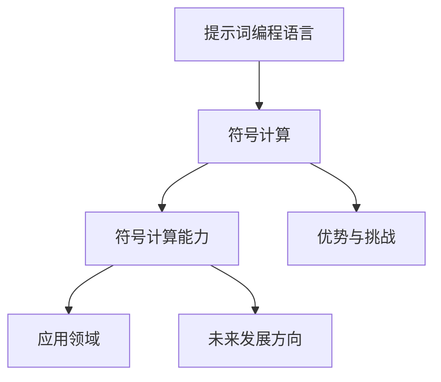

                 


## 引言

### 1.1 背景介绍

提示词编程语言作为一种新兴的编程范式，近年来在人工智能、自然语言处理等领域取得了显著成果。符号计算作为计算机科学的核心概念之一，其重要性不言而喻。本文将探讨提示词编程语言的符号计算能力，旨在分析其优势、挑战及未来发展方向。

### 1.2 核心概念与联系

为了深入理解提示词编程语言的符号计算能力，我们首先需要明确以下几个核心概念：

1. **提示词编程语言**：一种基于人类语言交互的编程范式，通过自然语言描述任务，实现对程序的生成和优化。
2. **符号计算**：一种处理符号数据的方法，通过数学和逻辑运算来解决问题。
3. **符号计算能力**：提示词编程语言在符号计算方面所具备的能力，包括表达、推理和优化等方面。

为了更好地展示这些概念之间的关系，我们可以使用以下Mermaid流程图：



### 1.3 核心算法原理讲解

提示词编程语言的符号计算能力主要依赖于以下几个核心算法：

1. **词向量表示**：将自然语言文本转化为向量表示，以便在计算机中进行处理。常见的词向量表示方法有Word2Vec、BERT等。
2. **符号推理**：通过符号运算来推导结论。例如，利用逻辑推理、自动推理等技术实现符号数据的处理。
3. **优化算法**：对符号计算过程进行优化，提高计算效率和准确性。常见的优化算法有动态规划、深度学习等。

下面，我们将使用伪代码来详细阐述这些核心算法原理：

#### 词向量表示

```python
# 输入：自然语言文本
# 输出：词向量表示

def word2vec(text):
    # 将文本分解为单词
    words = split_text(text)
    
    # 初始化词向量矩阵
    W = [init_vector() for _ in range(len(words))]
    
    # 训练词向量
    for word in words:
        W[word_index[word]] = train_vector(word)
    
    return W
```

#### 符号推理

```python
# 输入：符号表达式
# 输出：推理结果

def symbolic_reasoning(expression):
    # 将符号表达式转化为逻辑形式
    logic_expression = convert_to_logic(expression)
    
    # 使用逻辑推理进行推理
    result = logic_re
```

