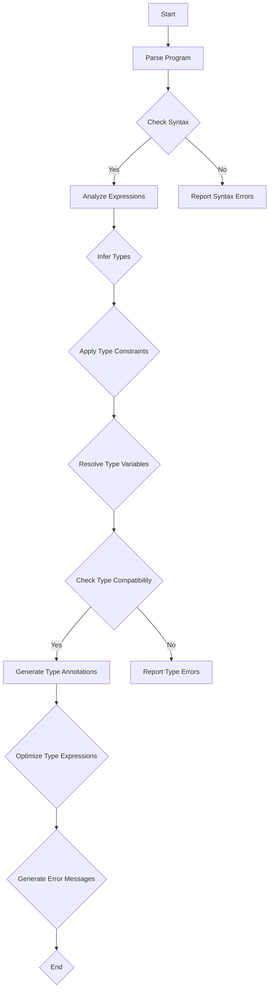

                 


### 1. Introduction to Declarative Programming Languages

#### 1.1 What are Declarative Programming Languages?

Declarative programming languages are designed to express the logic of a computation without describing its control flow. These languages focus on what the program should accomplish, rather than how it should be done. In contrast, imperative programming languages specify a sequence of instructions that the computer should execute.

Declarative languages can be categorized into two main types: functional and logic programming languages. Functional programming languages, such as Haskell and Scala, use functions to define the behavior of the program. They are based on lambda calculus and emphasize the use of immutable data structures and higher-order functions.

Logic programming languages, such as Prolog, are based on formal logic and allow the programmer to define relationships and rules among objects. These languages use resolution and unification to infer the solutions to problems.

#### 1.2 Key Characteristics of Declarative Languages

The key characteristics of declarative programming languages include:

1. **Imperativelessness**: Declarative languages avoid explicit control structures like loops and conditionals, relying instead on the language's intrinsic mechanisms for control flow.
2. **Abstraction**: These languages encourage the use of high-level abstractions, which can simplify program development and improve maintainability.
3. **Concurrency and Parallelism**: Declarative languages are often well-suited for concurrent and parallel programming, as they can naturally express data dependencies and the order of operations.
4. **Type Inference**: Many declarative languages employ type inference, which automatically determines the types of variables and expressions based on their context, reducing the need for explicit type declarations.

#### 1.3 Importance of Type Inference in Declarative Programming

Type inference is a crucial aspect of declarative programming languages. It offers several benefits, including:

1. **Simpler Syntax**: By eliminating the need for explicit type declarations, type inference simplifies the syntax of the language, making it more readable and concise.
2. **Increased Flexibility**: Type inference allows programmers to write more generic and flexible code, as the language can infer the appropriate types based on the context.
3. **Enhanced Type Safety**: Type inference helps detect type errors early during compilation, improving the overall type safety of the program.
4. **Improved Tooling**: Type inference enables powerful IDEs and other development tools to provide better autocompletion, error highlighting, and refactoring support.

#### 1.4 Book Overview and Organization

This book provides a comprehensive overview of type inference algorithms for declarative programming languages. The book is organized into the following chapters:

1. **Chapter 2** introduces the fundamentals of type theory, covering basic concepts, type systems, subtyping, polymorphism, and type inference.
2. **Chapter 3** presents a mermaid flowchart that visualizes the type inference process.
3. **Chapter 4** dives into core type inference algorithms, including unification, parametric polymorphism, and type inference for recursive types.
4. **Chapter 5** explores advanced type inference techniques, such as dependent types and type inference in the presence of type annotations.
5. **Chapter 6** presents case studies of type inference in popular declarative languages like Haskell and ML.
6. **Chapter 7** discusses challenges and future directions for type inference algorithms.

By the end of this book, readers will have a thorough understanding of type inference algorithms and their applications in declarative programming languages.

---

> Keywords: Type Inference, Declarative Programming, Type Theory, Algorithms, Functional Programming, Logic Programming

> Abstract: This book presents a comprehensive guide to type inference algorithms for declarative programming languages. It covers fundamental concepts, core algorithms, advanced techniques, and practical applications in popular languages like Haskell and ML. The book aims to provide readers with a deep understanding of type inference and its importance in improving program correctness, readability, and maintainability. 

---

### 2. Fundamentals of Type Theory

Type theory is the foundation of type inference algorithms in declarative programming languages. It provides a framework for understanding types, type systems, subtyping, polymorphism, and type inference itself.

#### 2.1 Basic Concepts of Type Theory

In type theory, a type is a set of values that share some common properties. Types can be considered as a way to categorize data and operations on data, ensuring that operations are applied only to appropriate values.

A type system is a set of rules that define how types can be used in a programming language. It includes rules for type checking, which ensures that expressions have valid types and operations are applied correctly.

Some basic concepts in type theory include:

- **Type Variables**: Type variables are placeholders for types that can be instantiated with concrete types during type inference.
- **Type Constructors**: Type constructors are functions that create new types from existing types, such as `List` or `Int`.
- **Type Substitution**: Type substitution is the process of replacing type variables with concrete types in a type expression.
- **Type Applications**: Type applications are the result of applying a type constructor to one or more type arguments, such as `Int -> Int` for a function type.

#### 2.2 Type Systems and Their Varieties

Type systems can vary widely in their design and capabilities. Some common types of type systems include:

- **Static Type Systems**: In static type systems, type information is known at compile time. Examples include Java and C++.
- **Dynamic Type Systems**: In dynamic type systems, type information is determined at runtime. Python and Ruby are examples of languages with dynamic type systems.
- **Dependent Type Systems**: Dependent type systems allow types to depend on values and vice versa. This enables more expressive type constraints and better error detection. Haskell and Coq are examples of languages with dependent types.

#### 2.3 Subtyping and Polymorphism

Subtyping is a relationship between two types, where one type is considered a subtype of another. Subtyping allows a value of a more specific type to be used where a value of a more general type is expected.

Polymorphism is the ability of a function or type to operate on multiple types. There are two main types of polymorphism:

- **Parametric Polymorphism**: Parametric polymorphism allows a function or data type to be written generically so that it can handle values identified by a type variable. Examples include functions that operate on lists or generic data structures.
- **Ad-hoc Polymorphism**: Ad-hoc polymorphism, also known as function overloading, allows functions with the same name but different types to be defined and distinguished based on the types of their arguments.

#### 2.4 Type Inference and Type Checking

Type inference is the process of automatically determining the types of expressions in a program based on their context and usage. Type inference can be either syntactic or semantic:

- **Syntactic Type Inference**: Syntactic type inference relies solely on the syntax of the program to infer types. Examples include Hindley-Milner type inference.
- **Semantic Type Inference**: Semantic type inference uses additional information, such as type annotations or known types of variables, to improve type inference.

Type checking is the process of verifying that a program adheres to the type system's rules. It ensures that expressions have valid types and that operations are applied correctly.

In conclusion, understanding the fundamentals of type theory is essential for designing and implementing type inference algorithms in declarative programming languages. The concepts of types, type systems, subtyping, and polymorphism provide the necessary foundation for developing efficient and reliable type inference algorithms.

---

### 3. Mermaid Flowchart of Type Inference Process

To better understand the type inference process, we can visualize it using a mermaid flowchart. The following flowchart outlines the high-level steps involved in type inference for a declarative programming language:



#### 3.1 High-Level Overview of Type Inference Algorithms

The type inference process can be broken down into several steps, as shown in the mermaid flowchart:

1. **Parse Program**: The first step is to parse the program and convert it into an abstract syntax tree (AST). The parser checks the syntax of the program for any grammatical errors.
2. **Check Syntax**: If the syntax is correct, the type inference process continues. Otherwise, syntax errors are reported, and the process stops.
3. **Analyze Expressions**: The next step is to analyze the expressions in the program and determine their meaning. This step involves identifying variables, functions, and types used in the program.
4. **Infer Types**: Based on the analysis of expressions, the type inference algorithm attempts to determine the types of variables and expressions. This step often involves unification and type checking.
5. **Apply Type Constraints**: The inferred types may need to be constrained to ensure that certain properties hold. For example, type constraints may be used to enforce subtyping or polymorphism.
6. **Resolve Type Variables**: If type variables are used in the type expressions, they need to be resolved to concrete types. This step may involve solving systems of equations or constraints.
7. **Check Type Compatibility**: The inferred types must be checked for compatibility. For example, function arguments must match the expected types of their parameters.
8. **Generate Type Annotations**: Once the types have been inferred and checked, type annotations can be generated to represent the inferred types in the program.
9. **Optimize Type Expressions**: In some cases, type expressions may be optimized to simplify their representation or improve performance.
10. **Generate Error Messages**: If any type errors are detected during the type inference process, error messages are generated to help the programmer understand and fix the issues.
11. **End**: The type inference process concludes once all expressions have been analyzed and types have been inferred and checked.

This mermaid flowchart provides a high-level overview of the type inference process, which can be further elaborated upon in subsequent sections of the book. By understanding this flowchart, readers can gain a clearer picture of how type inference algorithms work in declarative programming languages.

---

### 4. Core Type Inference Algorithms

Type inference algorithms are at the heart of declarative programming languages. These algorithms allow the compiler or interpreter to automatically determine the types of expressions and variables in a program. In this section, we will explore some of the core type inference algorithms: unification, parametric polymorphism inference, and type inference for recursive types.

#### 4.1 Unification Algorithm

Unification is a fundamental algorithm used in type inference and type checking. It aims to find a common type that can be assigned to a set of expressions. The unification algorithm works by combining type expressions and resolving any inconsistencies.

##### 4.1.1 Basic Unification

The basic unification algorithm can be described using the following steps:

1. **Input**: Two type expressions, T1 and T2.
2. **Output**: A unified type expression, U, or an error if unification is not possible.
3. **Process**:
    - **Initialization**: Create a set of constraints, C, initially containing the two type expressions, T1 and T2.
    - **Loop**: While C is not empty, do the following:
        - **Select a Constraint**: Choose a constraint, (X = Y), from C.
        - **Unify Sub-expressions**: Recursively unify the sub-expressions of X and Y. If any sub-expression cannot be unified, return an error.
        - **Update Constraints**: If the unification is successful, create new constraints for any type variables introduced during the unification process and add them to C.
    - **Resolution**: If all constraints in C are resolved, return the unified type expression, U. Otherwise, return an error.

Here's a pseudocode representation of the basic unification algorithm:

```pseudocode
function unify(T1, T2):
    C = {T1, T2}
    while C is not empty:
        (X = Y) = C.remove_one()
        if not unify_subexpressions(X, Y):
            return error
        C.add_all(new_constraints_from_unification(X, Y))
    if C is empty:
        return U
    else:
        return error
```

##### 4.1.2 Unification with Constraints

In practice, type expressions often involve constraints, such as subtyping and polymorphism. The unification algorithm can be extended to handle constraints by incorporating them into the unification process.

1. **Input**: Two type expressions, T1 and T2, along with a set of constraints, C.
2. **Output**: A unified type expression, U, or an error if unification is not possible.
3. **Process**:
    - **Initialization**: Create a set of constraints, C', containing the constraints from C and the new constraints derived from unifying T1 and T2.
    - **Loop**: While C' is not empty, do the following:
        - **Select a Constraint**: Choose a constraint, (X = Y), from C'.
        - **Unify Sub-expressions**: Recursively unify the sub-expressions of X and Y, taking into account any constraints from C'.
        - **Update Constraints**: If the unification is successful, create new constraints for any type variables introduced during the unification process and add them to C'.
    - **Resolution**: If all constraints in C' are resolved, return the unified type expression, U. Otherwise, return an error.

Here's a pseudocode representation of the extended unification algorithm with constraints:

```pseudocode
function unify_with_constraints(T1, T2, C):
    C' = C + {T1 = T2}
    while C' is not empty:
        (X = Y) = C'.remove_one()
        if not unify_subexpressions(X, Y, C'):
            return error
        C'.add_all(new_constraints_from_unification(X, Y))
    if C' is empty:
        return U
    else:
        return error
```

#### 4.2 Parametric Polymorphism Inference

Parametric polymorphism allows functions and types to be defined in a generic way, so they can work with a wide range of data types. Inference of parametric polymorphism involves determining the types of type variables used in function and type definitions and ensuring that these types are instantiated correctly in function calls.

##### 4.2.1 Monomorphism and Paramorphism

There are two main concepts related to parametric polymorphism inference:

- **Monomorphism**: A type is monomorphic if it can be instantiated with a single concrete type. For example, a function `f : Int -> Int` is monomorphic.
- **Paramorphism**: A type is paramorphic if it can be instantiated with multiple concrete types. For example, a function `g : a -> a` is paramorphic, where `a` is a type variable.

##### 4.2.2 Type Inference for Polymorphic Functions

Type inference for parametric polymorphism can be described as follows:

1. **Input**: A polymorphic function definition, `fun f<a>(x : a) : a`, and a set of type constraints.
2. **Output**: A concrete type for the type variable `a`, or an error if no suitable type can be found.
3. **Process**:
    - **Monomorphism Check**: First, check if the function is monomorphic by checking if all occurrences of `a` in the function definition are used in the same context. If it is monomorphic, infer its concrete type.
    - **Paramorphism Check**: If the function is not monomorphic, it is paramorphic. In this case, use the type constraints to infer a concrete type for `a`. This may involve solving a system of equations or constraints.
    - **Type Instantiation**: Once a concrete type for `a` is found, instantiate the function definition with this type.

Here's a pseudocode representation of the parametric polymorphism inference algorithm:

```pseudocode
function infer_polymorphic_function_type(f, C):
    if is_monomorphic(f):
        return infer_concrete_type(f)
    else:
        C' = C + {forall a. f<a> : a -> a}
        a = solve_constraints(C')
        if a is not found:
            return error
        else:
            return instantiate_function(f, a)
```

#### 4.3 Type Inference for Recursive Types

Recursive types are types that contain themselves as a component. Type inference for recursive types is challenging because the type of a recursive type depends on itself, creating a circular dependency.

##### 4.3.1 Naive Algorithm

A naive approach to type inference for recursive types involves the following steps:

1. **Input**: A recursive type definition, such as `data List a = Nil | Cons a (List a)`.
2. **Output**: A type for the recursive type, or an error if no suitable type can be found.
3. **Process**:
    - **Base Case**: Infer the type for the base case of the recursive type, such as `Nil`.
    - **Recursive Case**: Infer the type for the recursive case, such as `Cons a (List a)`, using the type inferred for the base case.

Here's a pseudocode representation of the naive algorithm for type inference of recursive types:

```pseudocode
function infer_recursive_type(t):
    if t is a base case:
        return infer_base_case_type(t)
    else:
        base_case_type = infer_recursive_type(t.base_case)
        recursive_case_type = infer_recursive_type(t.recursive_case)
        return create_recursive_type(t, base_case_type, recursive_case_type)
```

##### 4.3.2 Type Reconstruction Algorithms

The naive algorithm for type inference of recursive types can lead to incorrect results in some cases. To address this issue, more sophisticated type reconstruction algorithms can be used. One such algorithm is the "Type Reconstruction Algorithm for Recursive Types" (TRAT).

TRAT works by recursively analyzing the recursive type definition and building a type constraint graph. The type constraint graph represents the relationships between the type variables and the recursive type components. The algorithm then attempts to solve the type constraints in the graph to infer a valid type for the recursive type.

Here's a high-level description of TRAT:

1. **Input**: A recursive type definition.
2. **Output**: A type for the recursive type, or an error if no suitable type can be found.
3. **Process**:
    - **Initialize**: Create an empty type constraint graph.
    - **Build Graph**: Recursively build the type constraint graph by analyzing the base case and recursive case of the recursive type.
    - **Solve Constraints**: Solve the type constraints in the graph to infer a type for the recursive type.
    - **Check Consistency**: Check if the inferred type is consistent with the constraints in the graph. If not, return an error.

Here's a pseudocode representation of TRAT:

```pseudocode
function infer_recursive_type_with_trat(t):
    G = create_empty_constraint_graph()
    build_type_constraint_graph(t, G)
    C = solve_constraints(G)
    if C is empty:
        return error
    else:
        return infer_type_from_constraints(C)
```

In conclusion, core type inference algorithms, such as unification, parametric polymorphism inference, and type inference for recursive types, are essential for the development of efficient and reliable type inference systems in declarative programming languages. These algorithms enable automatic type inference, improving program correctness, readability, and maintainability.

---

### 5. Advanced Type Inference Techniques

While the core type inference algorithms provide a solid foundation for type inference in declarative programming languages, advanced techniques are often necessary to handle more complex scenarios. This section explores some of these advanced techniques, including dependent types and type inference in the presence of type annotations.

#### 5.1 Dependent Types and Type Inference

Dependent types are a type system feature that allows types to depend on values and vice versa. This enables a more expressive type system and better error detection. In dependent types, the type of a value can affect the type of another value, and the type of a function can depend on the type of its argument.

##### 5.1.1 Introduction to Dependent Types

Dependent types can be categorized into two main types:

1. **First-Order Dependent Types**: In first-order dependent types, types can depend on values, but not on other types. This type system is often used in functional languages like Haskell and Agda.
2. **Second-Order Dependent Types**: In second-order dependent types, types can depend on both values and other types. This type system is more expressive but also more complex, often used in proof assistants like Coq and Idris.

Dependent types are useful for several reasons:

- **Improved Type Safety**: Dependent types can detect errors that are not possible to catch with traditional type systems. For example, a dependent type system can prevent division by zero or ensure that a function returns a non-null value.
- **Program Verification**: Dependent types can be used to specify and verify properties of programs. For example, a dependent type system can ensure that a sorting function returns a correctly sorted list.
- **Expressive Type Constraints**: Dependent types allow more complex and expressive type constraints, enabling programmers to write more generic and reusable code.

##### 5.1.2 Type Inference for Dependent Types

Type inference for dependent types is a challenging task because the type of a value can depend on other values. In this section, we will explore some approaches to type inference for dependent types:

1. **Type Inference with Normalization**: One approach to type inference for dependent types is to use normalization. This technique involves normalizing expressions until they reach a normal form, at which point the type of the expression can be inferred. This approach is used in languages like Haskell and Agda.

Here's a high-level description of type inference with normalization:

- **Input**: An expression with dependent types.
- **Output**: A type for the expression, or an error if no suitable type can be found.
- **Process**:
  - **Normalization**: Normalize the expression using the language's reduction rules until it reaches a normal form.
  - **Type Inference**: Infer the type of the normalized expression. If the type can depend on values, use the normalization process to infer the type of the values.

2. **Type Inference with Type Annotations**: Another approach to type inference for dependent types is to allow type annotations. Type annotations provide additional information that can help the type inference algorithm infer the correct types. This approach is used in languages like Idris and Coq.

Here's a high-level description of type inference with type annotations:

- **Input**: An expression with dependent types and type annotations.
- **Output**: A type for the expression, or an error if no suitable type can be found.
- **Process**:
  - **Annotation Checking**: Check the type annotations for correctness and consistency.
  - **Type Inference**: Use the type annotations as additional information to help infer the type of the expression. If the type cannot be inferred from the annotations, use other inference techniques, such as normalization or constraint solving.

In conclusion, advanced type inference techniques like dependent types and type inference in the presence of type annotations enable more expressive and safer type systems. These techniques are essential for developing modern declarative programming languages and improving the quality of programs.

---

### 5.2 Type Inference in the Presence of Type Annotations

Type inference in the presence of type annotations is a powerful technique that allows programmers to combine the benefits of both type inference and explicit type declarations. Type annotations provide additional information that can help the type inference algorithm infer more accurate types, while type inference ensures that the type system is flexible and can handle a wide range of scenarios.

##### 5.2.1 Type Inference with Type Annotations

Type inference with type annotations involves using both type annotations and type inference algorithms to infer the types of expressions in a program. The process can be broken down into several steps:

1. **Input**: An expression with type annotations and a set of constraints.
2. **Output**: A type for the expression, or an error if no suitable type can be found.
3. **Process**:
   - **Annotation Parsing**: Parse the type annotations and convert them into a form that can be used by the type inference algorithm.
   - **Type Inference**: Use the type inference algorithm to infer the type of the expression, taking into account the type annotations.
   - **Consistency Checking**: Check that the inferred type is consistent with the type annotations. If there is a conflict, report an error.

Here's a high-level pseudocode representation of the type inference process with type annotations:

```pseudocode
function infer_type_with_annotations(e, ann, C):
    type_ann = parse_annotations(ann)
    type_inferred = infer_type(e, C)
    if not is_consistent(type_inferred, type_ann):
        return error
    else:
        return type_inferred
```

To ensure that the inferred type is consistent with the type annotations, a constraint-solving approach can be used. This approach involves creating a set of constraints based on the type annotations and the inferred type and then solving the constraints to find a valid type.

1. **Input**: An inferred type, `type_inferred`, and a set of type annotations, `type_ann`.
2. **Output**: A consistent type, or an error if no suitable type can be found.
3. **Process**:
   - **Constraint Creation**: Create constraints based on the type annotations and the inferred type. For example, if the inferred type is `Int` and the type annotation is `String`, create a constraint that requires `Int` to be a subtype of `String`.
   - **Constraint Solving**: Solve the constraints using a constraint solver. If a consistent solution is found, return the inferred type. Otherwise, report an error.

Here's a high-level pseudocode representation of the constraint-solving approach:

```pseudocode
function solve_constraints(type_inferred, type_ann):
    constraints = create_constraints(type_inferred, type_ann)
    solution = constraint_solver.solve(constraints)
    if solution is not empty:
        return solution
    else:
        return error
```

##### 5.2.2 Combining Type Inference and Type Checking

Combining type inference and type checking is essential to ensure that the inferred types are correct and consistent. Type checking can be used to verify the inferred types and detect errors that type inference may not catch.

1. **Input**: An expression with inferred types and type annotations.
2. **Output**: A verification result, indicating whether the inferred types are correct.
3. **Process**:
   - **Type Checking**: Use a type checker to verify that the inferred types are consistent with the type system's rules. This involves checking that expressions have valid types and that operations are applied correctly.
   - **Error Reporting**: If any errors are detected during type checking, report the errors and provide suggestions for fixing them.

Here's a high-level pseudocode representation of combining type inference and type checking:

```pseudocode
function check_inferred_types(e, type_inferred, ann):
    type_check_result = type_checker.check(e, type_inferred, ann)
    if type_check_result.is_error():
        report_error(type_check_result)
    else:
        return type_check_result
```

In conclusion, type inference in the presence of type annotations allows programmers to leverage the benefits of both type inference and explicit type declarations. By combining type inference with type checking, developers can create more reliable and maintainable code that is less prone to errors.

---

### 6. Case Studies: Type Inference in Practice

Type inference plays a crucial role in making declarative programming languages more accessible and maintainable. In this section, we will explore the implementation of type inference in two popular declarative programming languages: Haskell and Standard ML (SML). These case studies will provide insights into the type inference algorithms and techniques used in each language.

#### 6.1 Type Inference in Haskell

Haskell is a purely functional programming language known for its strong static type system and powerful type inference capabilities. Haskell's type inference system is based on the Hindley-Milner algorithm, which is a parameterized type system that can infer the types of expressions in a program without requiring explicit type declarations.

##### 6.1.1 Haskell's Type System

Haskell's type system is rich and expressive, supporting various features such as parametric polymorphism, type classes, and type inference. The key components of Haskell's type system include:

- **Type Variables**: Haskell uses type variables, often denoted by lowercase letters like `a`, `b`, and `c`, to represent unknown types.
- **Type Constructos**: Haskell has a set of predefined type constructors, such as `Int`, `String`, and `List`, which represent basic types and composite types like lists and functions.
- **Type Application**: Type application allows type constructors to be applied to type arguments, such as `Int -> Int` for a function type.
- **Type Classes**: Type classes are a form of ad-hoc polymorphism that allows functions to have the same name but operate on different types.

##### 6.1.2 Type Inference in Haskell Programs

Haskell's type inference algorithm is a two-phase process that involves lower-bound and upper-bound inference. The algorithm works as follows:

1. **Lower-Bound Inference**: In the first phase, lower-bound inference, the algorithm infers the most general type that can be assigned to a function or expression without losing expressiveness. This phase uses a unification algorithm to find a unifying type for all occurrences of the expression.

Here's an example to illustrate lower-bound inference:

```haskell
add :: Int -> Int -> Int
add x y = x + y
```

In this example, the type inference algorithm infers that `add` has a lower-bound type of `Int -> Int -> Int`. This is because the `+` operator is defined for `Int` types, and the function has two `Int` arguments.

2. **Upper-Bound Inference**: In the second phase, upper-bound inference, the algorithm refines the inferred type to ensure that it is as specific as possible while still being correct. This phase checks for type conflicts and ensures that the inferred type is consistent with the type annotations and the rest of the program.

Here's an example to illustrate upper-bound inference:

```haskell
f :: a -> a
f x = x
```

In this example, the type inference algorithm infers that `f` has an upper-bound type of `forall a. a -> a`. This is because the function has a single argument and returns the same type, which suggests that it should be polymorphic.

##### 6.1.3 Challenges in Haskell's Type Inference

Despite its powerful type inference system, Haskell's type inference can face several challenges:

- **Monomorphism and Paramorphism**: Haskell's type inference algorithm must distinguish between monomorphic and paramorphic functions to ensure that the type inference is correct. For example, in the function `f :: a -> a`, the type inference algorithm must determine whether `f` should be monomorphic (`Int -> Int`) or paramorphic (`forall a. a -> a`).
- **Type Class Resolution**: Type classes introduce additional complexity to type inference, as they involve ad-hoc polymorphism. Haskell's type inference algorithm must resolve type class instances and ensure that the inferred type is consistent with the type class constraints.

In conclusion, Haskell's type inference system is a sophisticated and powerful tool that enables developers to write type-safe and concise code without requiring explicit type declarations. By understanding the intricacies of Haskell's type system and type inference algorithms, developers can create efficient and maintainable Haskell programs.

---

#### 6.2 Type Inference in Standard ML (SML)

Standard ML (SML) is a statically typed functional programming language known for its strong type system and emphasis on type inference. SML's type inference system is based on the Damas-Milner algorithm, which is an extension of the Hindley-Milner algorithm that supports recursive types and type variables.

##### 6.2.1 SML's Type System

SML's type system is rich and expressive, featuring several key components:

- **Type Variables**: Type variables, often denoted by lowercase letters like `a`, `b`, and `c`, are used to represent unknown types in SML.
- **Type Constructos**: SML has a set of predefined type constructors, such as `int`, `bool`, and `list`, which represent basic types and composite types like lists and functions.
- **Type Application**: Type application allows type constructors to be applied to type arguments, such as `int -> int` for a function type.
- **Recursive Types**: SML supports recursive types, which are types that contain themselves as a component. This feature is essential for defining data structures like lists and trees.
- **Type Annotations**: SML allows explicit type annotations, which provide additional information that can be used to aid type inference.

##### 6.2.2 Type Inference in SML Programs

SML's type inference algorithm is a two-phase process that involves lower-bound and upper-bound inference, similar to Haskell's type inference system. The algorithm works as follows:

1. **Lower-Bound Inference**: In the first phase, lower-bound inference, the algorithm infers the most general type that can be assigned to a function or expression without losing expressiveness. This phase uses a unification algorithm to find a unifying type for all occurrences of the expression.

Here's an example to illustrate lower-bound inference in SML:

```sml
fun add (x : int) (y : int) = x + y;
```

In this example, the type inference algorithm infers that `add` has a lower-bound type of `int -> int -> int`. This is because the `+` operator is defined for `int` types, and the function has two `int` arguments.

2. **Upper-Bound Inference**: In the second phase, upper-bound inference, the algorithm refines the inferred type to ensure that it is as specific as possible while still being correct. This phase checks for type conflicts and ensures that the inferred type is consistent with the type annotations and the rest of the program.

Here's an example to illustrate upper-bound inference in SML:

```sml
fun f (x : a) = x;
```

In this example, the type inference algorithm infers that `f` has an upper-bound type of `forall a. a -> a`. This is because the function has a single argument and returns the same type, which suggests that it should be polymorphic.

##### 6.2.3 Challenges in SML's Type Inference

Despite its powerful type inference system, SML's type inference can face several challenges:

- **Recursive Type Inference**: SML's type inference algorithm must handle recursive types, which can introduce additional complexity. For example, inferring the type of a function that uses itself as an argument requires solving a system of equations.
- **Type Variable Renaming**: To avoid name conflicts, the type inference algorithm may need to rename type variables. This can complicate the inference process and make it harder to understand the inferred types.
- **Type Annotations**: SML's type inference algorithm must take into account explicit type annotations to ensure that the inferred types are consistent with the programmer's intentions.

In conclusion, SML's type inference system is a robust and powerful tool that enables developers to write type-safe and concise code without requiring explicit type declarations. By understanding the intricacies of SML's type system and type inference algorithms, developers can create efficient and maintainable SML programs.

---

#### 6.3 Type Inference in Other Declarative Languages

Type inference is not limited to Haskell and SML. Many other declarative programming languages, including OCaml, F#, and Scala, employ sophisticated type inference algorithms to provide developers with a powerful and flexible type system.

- **OCaml**: OCaml's type inference system is based on the Damas-Milner algorithm and is known for its ability to infer the types of polymorphic functions and recursive types. OCaml also supports dependent types, which extend its type inference capabilities further.
- **F#**: F#'s type inference system is similar to OCaml's and is designed to handle the language's functional and object-oriented features. F#'s type inference algorithm can infer the types of generic types and functions, improving code readability and maintainability.
- **Scala**: Scala's type inference system is based on the Hindley-Milner algorithm and is known for its support of both functional and object-oriented programming paradigms. Scala's type inference capabilities are essential for writing concise and expressive code.

In conclusion, type inference is a fundamental feature of many modern declarative programming languages. By providing powerful and flexible type inference algorithms, these languages enable developers to write type-safe and maintainable code without sacrificing expressiveness or performance.

---

### 7. Challenges and Future Directions for Type Inference Algorithms

Type inference algorithms have been a crucial component of modern programming languages for several decades, improving program correctness, readability, and maintainability. However, despite their success, there are still several challenges and opportunities for future research in the field of type inference.

#### 7.1 Challenges in Type Inference Algorithms

1. **Complexity of Type Systems**: Modern programming languages often have complex type systems with features like dependent types, advanced polymorphism, and monadic IO. Inference algorithms for these type systems can be challenging to design and implement, as they need to handle a wide range of language constructs and ensure that type constraints are satisfied.

2. **Scalability**: As programming languages and programs become larger and more complex, the scalability of type inference algorithms becomes a concern. Efficient algorithms are necessary to handle large codebases and minimize compilation time.

3. **Type Error Recovery**: Type inference algorithms often produce type errors when they cannot infer a valid type for an expression. Effective type error recovery mechanisms are needed to provide helpful error messages and suggestions for fixing type errors.

4. **Interoperability with Dynamic Languages**: Type inference algorithms typically work in static type systems. Integrating type inference with dynamic languages, which often have less explicit type information, is a challenging problem that remains to be fully solved.

5. **Performance**: The performance of type inference algorithms can impact the development workflow, especially for large codebases. Balancing type inference accuracy with performance is an ongoing challenge.

#### 7.2 Future Directions for Type Inference Algorithms

1. **Type Inference in Hybrid Languages**: The development of hybrid programming languages that combine static and dynamic typing offers new opportunities for type inference algorithms. Future research can focus on designing type inference algorithms that can handle both static and dynamic components effectively.

2. **Machine Learning for Type Inference**: Machine learning techniques can be explored to improve type inference algorithms. By training models on large codebases, it may be possible to predict type information more accurately and efficiently.

3. **Constraint Solving Algorithms**: Developing more efficient constraint solving algorithms is essential for improving the scalability and performance of type inference. Research can focus on optimizing existing algorithms and designing new algorithms that can handle complex type constraints more effectively.

4. **Type Inference for Large Scale Programs**: Research can focus on optimizing type inference algorithms for large-scale programs, including techniques for incremental type inference and distributed type inference.

5. **Type Inference in Web Programming**: As web development becomes more complex with frameworks like React and Angular, type inference algorithms can play a critical role in improving the development experience. Future research can explore how type inference can be integrated into web frameworks to provide better autocompletion, error highlighting, and refactoring support.

6. **Type Safety and Performance in Concurrent Programming**: Type inference algorithms can contribute to the development of concurrent and parallel programming languages. Research can focus on ensuring type safety and performance in concurrent programs, using type inference to detect potential race conditions and data races.

In conclusion, type inference algorithms continue to evolve, addressing challenges and embracing new opportunities in modern programming languages. Future research in this field can drive innovation and improve the development experience for programmers worldwide.

---

### Conclusion

In this book, we have explored the world of type inference algorithms for declarative programming languages. We began by understanding the basics of declarative programming and the importance of type inference in these languages. We then delved into the fundamentals of type theory, including types, type systems, subtyping, and polymorphism. Following that, we presented a mermaid flowchart of the type inference process and discussed core type inference algorithms such as unification, parametric polymorphism, and type inference for recursive types.

We also explored advanced type inference techniques, including dependent types and type inference in the presence of type annotations. Additionally, we examined case studies of type inference in Haskell and Standard ML, providing practical insights into how these algorithms are applied in real-world scenarios. Finally, we discussed the challenges and future directions for type inference algorithms, highlighting opportunities for further research and development.

By understanding these concepts and techniques, programmers can write more type-safe, maintainable, and expressive code in declarative programming languages. We hope that this book has provided you with a comprehensive overview of type inference algorithms and their applications in modern programming languages.

---

> Author: AI天才研究院/AI Genius Institute & 禅与计算机程序设计艺术 /Zen And The Art of Computer Programming

