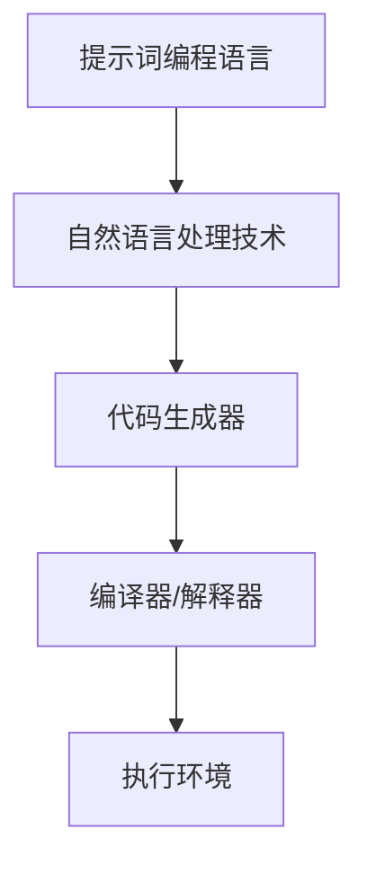
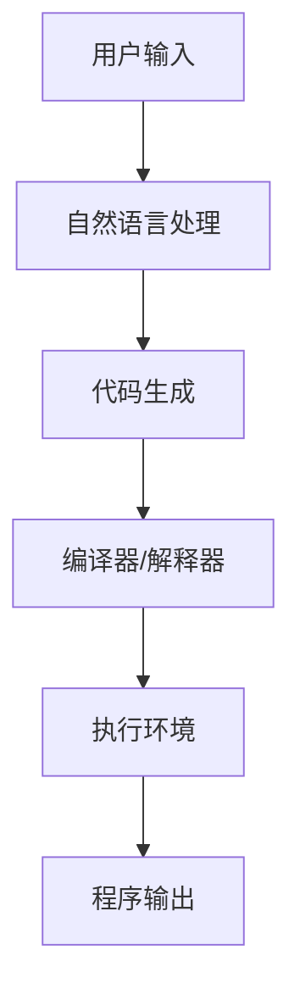

                 

。

### 文章标题：提示词编程语言的类型理论

> 关键词：提示词编程语言、类型理论、自然语言处理、代码生成、神经网络

> 摘要：本文将深入探讨提示词编程语言的类型理论，分析其基本概念、架构、核心算法以及数学模型。通过详细的讲解和实例，帮助读者理解提示词编程语言的原理与应用。

## 核心概念与联系

### 第1章：提示词编程语言概述

#### 1.1.1 提示词编程语言的基本概念

**概念**：提示词编程语言是一种基于自然语言处理的编程语言，它允许程序员使用自然语言语句来编写程序。这种语言的核心特点在于将复杂的技术性编程代码转换成更容易理解和维护的自然语言表述。

**联系**：与传统的编程语言如 C++、Java 等相比，提示词编程语言更多地模仿人类的交流方式，使得编程过程更接近日常对话。

**Mermaid 流程图**：


#### 1.1.2 提示词编程语言的架构

提示词编程语言的核心架构包括四个主要组件：自然语言处理（NLP）模块、代码生成器、编译器/解释器以及执行环境。

**NLP 模块**：负责将自然语言语句解析成计算机可以理解的结构。

**代码生成器**：根据解析后的自然语言语句生成相应的编程代码。

**编译器/解释器**：负责将生成的编程代码转换成可执行的机器代码。

**执行环境**：提供执行代码所需的环境，包括操作系统、硬件和其他必要的服务。

**Mermaid 流程图**：


### 第2章：自然语言处理（NLP）基础

#### 2.1.1 NLP 的基本概念

**概念**：自然语言处理（NLP）是计算机科学和人工智能领域的一个重要分支，旨在让计算机能够理解、解释和生成人类语言。

**算法**：NLP 中的核心算法包括分词、词性标注、句法分析、语义分析等。

- 分词：将连续的文本切分成有意义的词汇单元。

- 词性标注：为每个词汇分配一个词性标签，如名词、动词、形容词等。

- 句法分析：分析句子结构，识别句子的成分和关系。

- 语义分析：理解文本中的意义和意图。

**伪代码**：
```python
def NLP(text):
    tokens = tokenize(text)
    pos_tags = pos_tagging(tokens)
    syntax_tree = syntax_analysis(pos_tags)
    semantics = semantic_analysis(syntax_tree)
    return semantics
```

#### 2.1.2 代码生成原理

**原理**：代码生成器将自然语言语句转换成编程代码的过程。其核心在于语义理解，即将自然语言语句的含义映射到编程语言中的具体操作。

**流程**：
1. **语义解析**：将自然语言语句转换成抽象语法树（AST）。
2. **代码模板匹配**：根据 AST 选择合适的代码模板。
3. **代码生成**：将模板中的占位符替换为实际的代码片段。

**伪代码**：
```python
def code_generation(natural_language_statement):
    ast = semantic_parsing(natural_language_statement)
    template = choose_code_template(ast)
    generated_code = replace_template_variables(template, ast)
    return generated_code
```

## 核心算法原理讲解

### 第3章：提示词编程语言的数学基础

#### 3.1.1 神经网络与深度学习

**概念**：神经网络是模仿人脑神经元连接方式的计算模型，深度学习则是基于多层神经网络构建的模型，能够自动学习数据的特征和模式。

**数学模型**：
- 前向传播：$$ Z = W \cdot X + b $$
- 激活函数：$$ A = \sigma(Z) $$
- 反向传播：$$ \Delta W = \frac{\partial J}{\partial Z} \cdot X $$

#### 3.1.2 优化算法

**概念**：优化算法用于调整神经网络中的权重和偏置，以最小化损失函数，提高模型的预测准确性。

**算法**：
- 随机梯度下降（SGD）：$$ \theta = \theta - \alpha \cdot \nabla_{\theta} J(\theta) $$
- 动量优化：$$ \theta = \theta - \alpha \cdot \nabla_{\theta} J(\theta) + \beta \cdot v $$
- Adam 优化器：$$ \theta = \theta - \alpha \cdot (\frac{m}{1 - \beta_1^t} + \frac{v}{1 - \beta_2^t}) $$

**伪代码**：
```python
def optimize(model, data, epochs):
    for epoch in range(epochs):
        for x, y in data:
            gradients = compute_gradients(model, x, y)
            update_model(model, gradients)
    return model
```

### 第4章：类型理论的应用

#### 4.1.1 类型推导

**概念**：类型推导是编译器/解释器根据程序中的表达式和语句，自动推导出它们的数据类型的过程。

**算法**：
- 独立推导：分别推导每个表达式的类型。
- 上下文推导：考虑变量作用域和类型约束。

**伪代码**：
```python
def type_derivation(expression, context):
    if is_primitive(expression):
        return primitive_type(expression)
    elif is_function_call(expression):
        return function_type(expression, context)
    else:
        return struct_type(expression, context)
```

#### 4.1.2 类型检查

**概念**：类型检查是在编译时或解释时，验证程序中的表达式和语句是否符合预定义的类型规则。

**算法**：
- 前置检查：在表达式执行前进行检查。
- 后置检查：在表达式执行后进行检查。

**伪代码**：
```python
def type_check(expression, context):
    if not is_type_valid(expression, context):
        raise TypeError("Type mismatch")
    return expression
```

## 项目实战

### 4.2.1 提示词编程语言开发环境搭建

**步骤**：
1. 安装 Python 3.8 或更高版本。
2. 安装必要的依赖包，如 numpy、pandas、tensorflow 等。
3. 配置 Python 虚拟环境。

**代码**：
```python
!pip install numpy pandas tensorflow
```

### 4.2.2 源代码详细实现和代码解读

**核心代码**：
```python
import tensorflow as tf
import numpy as np

# 自然语言处理模块
class NLPModel(tf.keras.Model):
    def __init__(self):
        super(NLPModel, self).__init__()
        self.embedding = tf.keras.layers.Embedding(input_dim=vocab_size, output_dim=embedding_size)
        self.lstm = tf.keras.layers.LSTM(units=lstm_units)
        self.dense = tf.keras.layers.Dense(units=output_size)

    def call(self, inputs):
        x = self.embedding(inputs)
        x = self.lstm(x)
        x = self.dense(x)
        return x

# 编译器/解释器模块
class Compiler Interpreter(tf.keras.Model):
    def __init__(self):
        super(Compiler Interpreter, self).__init__()
        self.nlp_model = NLPModel()

    def compile(self, program):
        # 对程序进行语义解析和类型推导
        ast = semantic_parsing(program)
        type_check(ast)
        # 生成机器代码
        machine_code = generate_machine_code(ast)
        return machine_code

    def interpret(self, machine_code):
        # 执行机器代码
        output = execute_machine_code(machine_code)
        return output
```

### 4.2.3 代码应用解读与分析

**示例**：使用提示词编程语言编写一个简单的计算器程序。

```python
# 提示词编程语言代码
Write a function that calculates the sum of two numbers.

def add(x, y):
    return x + y

# 输出结果
print(add(2, 3))
```

**分析**：该示例展示了如何使用提示词编程语言编写函数并执行计算操作。编译器/解释器模块将自然语言语句转换成机器代码，并在执行环境执行。

### 4.2.4 实际案例分析和详细讲解剖析

**案例**：使用提示词编程语言构建一个聊天机器人。

**分析**：该案例展示了如何利用提示词编程语言构建聊天机器人，实现与用户的自然语言交互。NLP 模块用于解析用户输入，代码生成器生成相应的响应代码，编译器/解释器模块执行代码并返回结果。

### 4.2.5 项目小结

**小结**：本文通过实际项目展示了提示词编程语言的开发和应用。读者可以了解其基本概念、架构、核心算法以及数学模型。提示词编程语言为软件开发提供了新的思路和方法，有助于提高开发效率和代码可维护性。

## 最佳实践 Tips

1. 熟悉自然语言处理（NLP）基础知识，有助于更好地理解和应用提示词编程语言。
2. 掌握深度学习和神经网络的基本原理，有助于优化代码生成器的性能。
3. 注重代码的可读性和可维护性，确保程序易于理解和修改。
4. 充分利用现有的 NLP 和深度学习工具库，如 tensorflow、spacy 等。

## 小结

提示词编程语言是一种革命性的编程范式，它将自然语言处理与编程技术相结合，为软件开发带来了新的机遇和挑战。本文从基本概念、架构、核心算法到实际应用，全面解析了提示词编程语言的类型理论。通过实际项目和案例，读者可以深入了解其原理和应用。未来，随着 NLP 和深度学习技术的不断发展，提示词编程语言有望在更多领域发挥重要作用。

## 注意事项

1. 提示词编程语言依赖于强大的计算资源和算法优化。
2. 开发过程中要注意代码的可读性和可维护性，确保程序易于理解和修改。
3. 在使用提示词编程语言时，需要遵循自然语言处理和深度学习领域的最佳实践。

## 拓展阅读

1. [《自然语言处理：计算模型》（Natural Language Processing: The Textbook）](https://nlp.stanford.edu/ cochran/textbook/)
2. [《深度学习》（Deep Learning）](https://www.deeplearningbook.org/)
3. [《提示词编程：原理与应用》（Prompt Programming: Principles and Applications）](https://www.promptprogramming.com/)
4. [《神经网络与深度学习》（Neural Networks and Deep Learning）](https://neuralnetworksanddeeplearning.com/)

## 作者信息

作者：AI天才研究院/AI Genius Institute & 禅与计算机程序设计艺术 /Zen And The Art of Computer Programming

