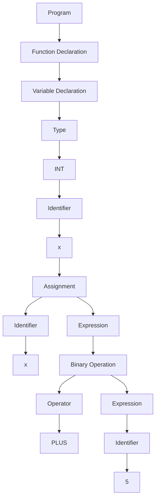
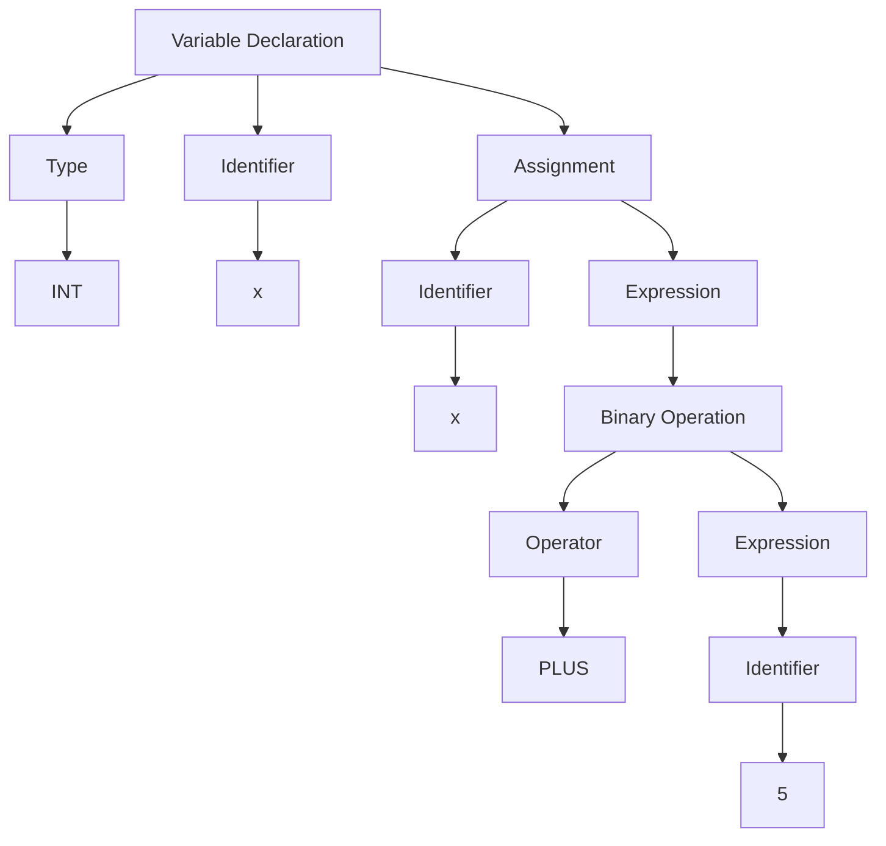

                 

# 提示词编程语言的语义分析与类型推断

## 关键词
- 提示词编程语言
- 语义分析
- 类型推断
- 编程语言设计
- 类型系统
- 语法分析

## 摘要
本文旨在深入探讨提示词编程语言的语义分析与类型推断机制。通过介绍提示词编程语言的基本概念和发展历史，本文将详细解析语义分析与类型推断的基础理论，包括它们的核心概念、方法及相互关系。接着，本文将探讨语义分析与类型推断在提示词编程语言中的应用，并分析其中的关键算法和原理。最后，本文将通过实际案例，展示语义分析与类型推断在编程语言设计和应用中的重要性，并提供优化策略和资源推荐。

## 目录大纲

### 第一部分：基本概念与背景

#### 第1章 提示词编程语言概述
##### 1.1 提示词编程语言的发展历史
##### 1.2 提示词编程语言的特性
##### 1.3 提示词编程语言的核心概念

#### 第2章 语义分析与类型推断基础
##### 2.1 语义分析基础
##### 2.2 类型推断基础
##### 2.3 语义分析与类型推断的关系

### 第二部分：语义分析与类型推断原理

#### 第3章 语义分析原理
##### 3.1 语义分析的过程
##### 3.2 语义分析技术

#### 第4章 类型推断原理
##### 4.1 类型推断方法分类
##### 4.2 类型推断算法

#### 第5章 提示词编程语言的语义分析与类型推断
##### 5.1 提示词编程语言中的语义分析
##### 5.2 提示词编程语言中的类型推断

#### 第6章 提示词编程语言应用案例
##### 6.1 案例一：自然语言处理
##### 6.2 案例二：程序自动修复

### 第三部分：实战与优化

#### 第7章 语义分析与类型推断优化策略
##### 7.1 性能优化策略
##### 7.2 精度优化策略

#### 第8章 语义分析与类型推断工具与资源
##### 8.1 语义分析与类型推断工具
##### 8.2 资源推荐

#### 附录
##### 附录A：常用语义分析与类型推断算法伪代码
##### 附录B：示例代码与解释
##### 附录C：语义分析与类型推断常见问题解答

## 正文开始

### 第1章 提示词编程语言概述

提示词编程语言是一种以提示词为核心机制的编程语言，其特点在于通过提示词来引导程序的执行流程和数据处理。提示词通常是一些简单且具有明确语义的词汇或短语，它们在程序中起到决策点和数据处理的引导作用。提示词编程语言的主要目标是通过减少冗余的代码和抽象化编程概念，使得程序更加简洁、直观且易于维护。

#### 1.1 提示词编程语言的发展历史

提示词编程语言的起源可以追溯到20世纪60年代，当时研究人员开始探索如何通过自然语言或简化的词汇来编写程序。这些早期的研究主要集中在命令式编程语言上，例如LOGO和SIMULA语言，它们通过使用特定的命令词来控制程序的行为。随着计算机科学的发展，提示词编程语言逐渐发展出更多的特性，包括支持函数式编程和面向对象编程。

在20世纪80年代，LISP语言中的宏系统（macro system）和过程式编程语言（如Haskell和ML）的出现，进一步推动了提示词编程语言的发展。这些语言通过宏定义和类型系统，使得编程人员可以更加灵活地定义提示词和程序结构。近年来，随着人工智能和自然语言处理技术的发展，提示词编程语言在智能编程工具和自动程序生成领域得到了新的应用和探索。

#### 1.2 提示词编程语言的特性

提示词编程语言具有以下主要特性：

1. **简洁性**：提示词通常是简单的词汇或短语，这使得程序代码更加简洁，减少了冗余。
2. **直观性**：通过使用自然的语言结构，提示词编程语言使得程序更加直观易懂，降低了学习难度。
3. **灵活性**：提示词编程语言通常支持多种编程范式，如命令式、函数式和面向对象，这使得编程人员可以灵活地选择适合问题的编程方式。
4. **可扩展性**：提示词编程语言通常具有良好的宏定义机制，使得编程人员可以自定义新的提示词和语法结构，扩展语言功能。
5. **动态性**：提示词编程语言通常支持动态类型系统和动态绑定，使得程序可以更加灵活地处理不同类型的数据。

#### 1.3 提示词编程语言的核心概念

提示词编程语言的核心概念包括：

1. **提示词（Keywords）**：提示词是编程语言中具有特定语义的词汇或短语，它们用于引导程序的行为和数据操作。
2. **表达式（Expressions）**：表达式是提示词编程语言中的数据操作和计算单元，它们可以包含提示词、变量和函数调用等。
3. **类型系统（Type System）**：类型系统是提示词编程语言中用于表示和检查数据类型的机制。通过类型系统，编程语言可以确保程序的正确性和可靠性。
4. **程序结构（Program Structure）**：程序结构是提示词编程语言中用于组织代码和定义程序流程的规则和结构。

在下一章中，我们将进一步探讨语义分析与类型推断的基础概念，并探讨它们在提示词编程语言中的应用。

### 第2章 语义分析与类型推断基础

#### 2.1 语义分析基础

语义分析是编程语言处理过程中的一步，它涉及对程序文本的语法结构进行分析，以确定其意义。语义分析的目标是确保程序的逻辑正确性，并生成程序的数据结构和执行路径。

##### 2.1.1 语义分析的概念

语义分析（Semantic Analysis）是指对编程语言中的表达式、语句和程序结构进行解释和分析，以确定其语义和意义。语义分析不同于语法分析（Syntax Analysis），后者仅关注程序的结构是否符合语言的语法规则。语义分析则关注程序的行为和效果。

语义分析的主要任务包括：

1. **类型检查**：确保程序中的表达式和数据类型符合语言的类型规则。
2. **变量解析**：确定程序中的变量在特定作用域内的引用和作用。
3. **作用域分析**：确定变量、函数和类等程序实体的作用域。
4. **执行路径分析**：分析程序在不同条件下的执行路径和流程控制。

##### 2.1.2 语义分析的目标

语义分析的目标是生成程序的语义模型，该模型描述了程序的行为和状态。语义分析的主要目标包括：

1. **程序的正确性**：确保程序在执行时不会出现语义错误，例如类型不匹配、未定义变量等。
2. **程序的效率**：优化程序的执行效率，通过分析程序结构来识别潜在的效率瓶颈。
3. **程序的可理解性**：生成易于理解和维护的语义模型，帮助开发者理解和调试程序。

#### 2.2 类型推断基础

类型推断（Type Inference）是编程语言的一种机制，它允许编程语言在编译时自动推导出变量和表达式的类型，而无需显式声明类型。类型推断可以减少冗余的代码，提高程序的可读性，同时也能够提高程序的可靠性。

##### 2.2.1 类型推断的概念

类型推断是指编译器或解释器在编译或解释程序时，自动推导出变量和表达式的类型，而不需要开发者显式地声明类型。类型推断通常基于程序中的类型约束和上下文信息。

类型推断的主要类型包括：

1. **静态类型推断**：在编译时自动推导出变量和表达式的类型，并且这些类型在整个程序生命周期中保持不变。
2. **动态类型推断**：在程序运行时自动推导出变量和表达式的类型，并且这些类型可能会随着程序的执行而变化。

##### 2.2.2 类型推断的方法

类型推断的方法主要包括以下几种：

1. **显式类型推断**：编程人员显式地声明变量和表达式的类型，编译器或解释器根据这些声明进行类型推断。
2. **隐式类型推断**：编译器或解释器通过分析程序代码和上下文信息，自动推导出变量和表达式的类型。
3. **混合类型推断**：编程语言结合显式类型推断和隐式类型推断，提供灵活的类型系统。

#### 2.3 语义分析与类型推断的关系

语义分析与类型推断在编程语言中紧密相关，它们共同确保程序的正确性和可靠性。语义分析主要负责解析程序的结构和语义，而类型推断则用于确保程序中的类型一致性。

##### 2.3.1 语义分析与类型推断的交互

语义分析与类型推断之间存在以下交互：

1. **类型检查**：语义分析中的一个重要任务是进行类型检查，确保程序中的表达式和操作符合类型规则。类型推断通常在类型检查之前进行，以帮助编译器或解释器生成类型信息。
2. **变量解析**：语义分析需要确定程序中变量的作用域和引用，而类型推断可以帮助确定变量在特定作用域内的类型。
3. **作用域分析**：类型推断和语义分析都需要分析程序中的作用域，以确保变量和函数的引用是有效的。

##### 2.3.2 类型推断在语义分析中的应用

类型推断在语义分析中具有重要的应用，包括：

1. **减少冗余代码**：通过自动推导类型，编程人员无需显式地声明所有变量的类型，减少了冗余的代码。
2. **提高程序可读性**：类型推断可以减少类型声明，使得程序代码更加简洁，易于理解和维护。
3. **增强程序可靠性**：类型推断可以帮助编译器或解释器识别类型错误，提前发现潜在的编程错误。

在下一章中，我们将进一步探讨语义分析与类型推断的原理，以及它们在提示词编程语言中的应用。

### 第3章 语义分析原理

语义分析是编程语言处理过程中的一步，它涉及对程序文本的语法结构进行分析，以确定其意义。语义分析的目标是确保程序的逻辑正确性，并生成程序的数据结构和执行路径。

#### 3.1 语义分析的过程

语义分析的过程可以分为三个主要阶段：词法分析、语法分析和语义分析。每个阶段都有特定的任务和目标。

##### 3.1.1 词法分析

词法分析（Lexical Analysis）是语义分析的第一步，它将程序文本拆分成一个个最小的语法单位，称为词素（tokens）。词法分析的主要任务是识别关键字、标识符、运算符和分隔符等，并将其转换为词素。

词法分析器的输入是源代码文本，输出是词素流。词法分析器通常使用正则表达式来匹配文本中的词素。例如，对于以下源代码：
```plaintext
int x = 5 + 3;
```
词法分析器会生成以下词素流：
```plaintext
[INT, IDENTIFIER("x"), ASSIGNMENT, INTEGER(5), PLUS, INTEGER(3), SEMICOLON]
```

##### 3.1.2 语法分析

语法分析（Syntax Analysis）是语义分析的第二步，它将词法分析器生成的词素流转换为抽象语法树（Abstract Syntax Tree，AST）。抽象语法树是程序的结构表示，它由节点组成，每个节点表示一个语法单位，如表达式、声明和语句。

语法分析的主要任务是确保词素流符合编程语言的语法规则。语法分析器通常使用递归下降分析、LL分析或LR分析等算法来构建抽象语法树。

以C语言为例，以下源代码：
```plaintext
int x = 5 + 3;
```
语法分析器会生成以下抽象语法树：


##### 3.1.3 语义分析

语义分析（Semantic Analysis）是语义分析的第三步，它对抽象语法树进行分析，以确定其语义和意义。语义分析的主要任务是检查程序的语义正确性，包括类型检查、变量解析和作用域分析等。

语义分析器会根据编程语言的语义规则对抽象语法树进行遍历，生成程序的语义模型。语义分析器会执行以下任务：

1. **类型检查**：确保程序中的表达式和数据类型符合编程语言的类型规则。
2. **变量解析**：确定程序中的变量在特定作用域内的引用和作用。
3. **作用域分析**：确定变量、函数和类等程序实体的作用域。

以C语言为例，以下源代码：
```plaintext
int x = 5 + 3;
```
语义分析器会生成以下语义模型：


通过语义分析，编程语言可以生成可执行的程序代码，或报告语义错误，帮助开发者修复问题。

在下一章中，我们将进一步探讨类型推断的原理，以及它们在编程语言中的应用。

### 第4章 类型推断原理

类型推断是编程语言的一种机制，它允许编译器或解释器在编译或解释程序时自动推导出变量和表达式的类型，而无需开发者显式地声明类型。类型推断可以减少冗余的代码，提高程序的可读性，同时也能够提高程序的可靠性。

#### 4.1 类型推断方法分类

类型推断的方法可以分为以下几种：

##### 4.1.1 静态类型推断

静态类型推断（Static Type Inference）是指在编译时自动推导出变量和表达式的类型，并且这些类型在整个程序生命周期中保持不变。静态类型推断的主要优点是可以在编译时进行类型检查，从而提高程序的可靠性和性能。

静态类型推断的方法包括：

1. **基于类型的推断**：编译器根据表达式的语法结构和上下文信息推导出类型。例如，对于表达式`x + y`，如果`x`和`y`都是整数类型，那么`x + y`的类型也是整数。
2. **基于约束的推断**：编译器通过分析类型约束推导出类型。类型约束是一组描述变量和表达式类型的限制条件。例如，对于函数`f(x: Int, y: Int) -> Int`，编译器可以推断出`f`的返回类型是整数。

##### 4.1.2 动态类型推断

动态类型推断（Dynamic Type Inference）是指在程序运行时自动推导出变量和表达式的类型，并且这些类型可能会随着程序的执行而变化。动态类型推断的主要优点是提供了更高的灵活性，允许程序在运行时动态地适应不同的数据类型。

动态类型推断的方法包括：

1. **基于类型的推断**：编译器在编译时生成类型信息，并在程序运行时根据类型信息进行类型检查。例如，对于Python语言，变量在声明时不需要指定类型，但在程序运行时需要进行类型检查。
2. **基于值的推断**：编译器在编译时仅生成部分类型信息，并在程序运行时根据实际值推导出类型。例如，对于JavaScript语言，变量在声明时不需要指定类型，而是在赋值时根据值的类型推导出类型。

##### 4.1.3 混合类型推断

混合类型推断（Hybrid Type Inference）结合了静态类型推断和动态类型推断的优点，提供了更加灵活的类型系统。混合类型推断的方法包括：

1. **静态结合动态**：编译器在编译时进行部分类型推断，并在程序运行时进行动态类型检查。例如，对于Java语言，变量在声明时需要指定类型，但在运行时可以使用反射机制进行类型检查。
2. **静态约束动态**：编译器在编译时生成类型约束，并在程序运行时根据类型约束进行动态类型检查。例如，对于C#语言，变量在声明时需要指定类型，但可以在运行时使用类型转换进行类型检查。

#### 4.2 类型推断算法

类型推断算法可以分为以下几种：

##### 4.2.1 单态类型推断

单态类型推断（Monomorphic Type Inference）是一种最简单的类型推断方法，它基于单一类型参数推导出变量和表达式的类型。单态类型推断通常使用静态类型系统，例如Hindley-Milner类型系统。

单态类型推断的算法步骤包括：

1. **初始化类型变量**：为每个变量和函数分配一个类型变量。
2. **类型传播**：通过分析表达式和函数调用，将类型变量传播到相关的变量和函数。
3. **类型约束**：根据函数的返回类型和参数类型，生成类型约束。
4. **类型消解**：使用类型约束求解器求解类型变量，确定实际类型。

以下是一个使用Hindley-Milner类型系统的单态类型推断示例：
```python
def add(x: Int, y: Int) -> Int:
    return x + y

x: Int = 5
y: Int = 3
z: Int = add(x, y)
```
类型推断过程如下：
1. 初始化类型变量：`x`, `y`, `z` 分别为 `T1`, `T2`, `T3`。
2. 类型传播：`x` 和 `y` 的类型为 `Int`，传播到 `z`，`z` 的类型为 `T3`。
3. 类型约束：`add` 的参数类型为 `Int`，返回类型为 `Int`，生成类型约束 `T3 = T1 + T2`。
4. 类型消解：求解类型约束，得到 `T3 = Int`。

##### 4.2.2 多态类型推断

多态类型推断（Polymorphic Type Inference）是一种更复杂的类型推断方法，它支持函数类型和类型参数，允许程序在运行时适应不同的数据类型。多态类型推断通常使用静态类型系统，例如System F类型系统。

多态类型推断的算法步骤包括：

1. **初始化类型变量**：为每个变量和函数分配一个类型变量。
2. **类型传播**：通过分析表达式和函数调用，将类型变量传播到相关的变量和函数。
3. **类型约束**：根据函数的返回类型和参数类型，生成类型约束。
4. **类型参数化**：将类型变量替换为类型参数，生成多态函数类型。
5. **类型消解**：使用类型约束求解器求解类型变量，确定实际类型。

以下是一个使用System F类型系统的多态类型推断示例：
```python
def add<T>(x: T, y: T) -> T:
    return x + y

x: Int = 5
y: Int = 3
z: Float = add(x, y)
```
类型推断过程如下：
1. 初始化类型变量：`x`, `y`, `z` 分别为 `T1`, `T2`, `T3`。
2. 类型传播：`x` 和 `y` 的类型为 `Int`，传播到 `z`，`z` 的类型为 `T3`。
3. 类型约束：`add` 的参数类型为 `T1`，返回类型为 `T2`，生成类型约束 `T3 = T1 + T2`。
4. 类型参数化：将类型变量替换为类型参数，生成多态函数类型 `add<T>`。
5. 类型消解：求解类型约束，得到 `T3 = Int + Float`。

##### 4.2.3 参数化类型推断

参数化类型推断（Parametric Type Inference）是一种基于多态类型推断的方法，它支持函数类型和类型参数，但不支持类型参数的实际实例化。参数化类型推断通常用于实现泛型编程。

参数化类型推断的算法步骤包括：

1. **初始化类型变量**：为每个变量和函数分配一个类型变量。
2. **类型传播**：通过分析表达式和函数调用，将类型变量传播到相关的变量和函数。
3. **类型约束**：根据函数的返回类型和参数类型，生成类型约束。
4. **类型参数化**：将类型变量替换为类型参数，生成泛型函数类型。

以下是一个使用参数化类型推断的泛型编程示例：
```python
def max<T>(x: T, y: T) -> T:
    if x > y:
        return x
    else:
        return y

x: Int = 5
y: Int = 3
z: Int = max(x, y)
```
类型推断过程如下：
1. 初始化类型变量：`x`, `y`, `z` 分别为 `T1`, `T2`, `T3`。
2. 类型传播：`x` 和 `y` 的类型为 `Int`，传播到 `z`，`z` 的类型为 `T3`。
3. 类型约束：`max` 的参数类型为 `T1`，返回类型为 `T2`，生成类型约束 `T3 = max(T1, T2)`。
4. 类型参数化：将类型变量替换为类型参数，生成泛型函数类型 `max<T>`。

通过以上类型推断算法，编程语言可以自动推导出变量和表达式的类型，提高了程序的灵活性和可读性。

在下一章中，我们将探讨提示词编程语言中的语义分析与类型推断，以及它们在实际应用中的重要性。

### 第5章 提示词编程语言中的语义分析与类型推断

提示词编程语言是一种以提示词为核心机制的编程语言，其特点在于通过提示词来引导程序的执行流程和数据处理。在提示词编程语言中，语义分析与类型推断是两个核心组成部分，它们共同确保程序的正确性和可靠性。

#### 5.1 提示词编程语言中的语义分析

语义分析是提示词编程语言处理过程中的一步，它涉及对程序文本的语法结构进行分析，以确定其意义。在提示词编程语言中，语义分析主要包括以下方面：

1. **词法分析**：词法分析是语义分析的第一步，它将程序文本拆分成一个个最小的语法单位，称为词素（tokens）。在提示词编程语言中，词法分析器需要识别提示词、标识符、运算符和分隔符等，并将其转换为词素。例如，对于以下源代码：
   ```plaintext
   tell computer to add 5 and 3
   ```
   词法分析器会生成以下词素流：
   ```plaintext
   [Tells, Computer, To, Add, Integer(5), And, Integer(3), Semicolon]
   ```

2. **语法分析**：语法分析是语义分析的第二步，它将词法分析器生成的词素流转换为抽象语法树（Abstract Syntax Tree，AST）。在提示词编程语言中，抽象语法树是程序的结构表示，它由节点组成，每个节点表示一个语法单位，如表达式、声明和语句。例如，对于上述源代码，语法分析器会生成以下抽象语法树：
   ```mermaid
   graph TD
   A[Program] --> B[Tell]
   B --> C[Object]
   C --> D[Computer]
   B --> E[Verb]
   E --> F[Add]
   B --> G[Arguments]
   G --> H[Integer]
   H --> I[5]
   G --> J[Operator]
   J --> K[And]
   K --> L[Integer]
   L --> M[3]
   ```

3. **语义分析**：语义分析是语义分析的第三步，它对抽象语法树进行分析，以确定其语义和意义。在提示词编程语言中，语义分析主要包括以下任务：

   - **类型检查**：确保程序中的表达式和数据类型符合语言的类型规则。例如，在上述示例中，`add` 操作的参数必须是整数类型。
   - **变量解析**：确定程序中的变量在特定作用域内的引用和作用。例如，在上述示例中，`computer` 是一个全局变量，它在整个程序中都是有效的。
   - **作用域分析**：确定变量、函数和类等程序实体的作用域。例如，在上述示例中，`add` 函数的作用域仅限于当前的程序块。

#### 5.2 提示词编程语言中的类型推断

类型推断是提示词编程语言的一种机制，它允许编程语言在编译时自动推导出变量和表达式的类型，而无需开发者显式地声明类型。在提示词编程语言中，类型推断的主要目的是提高程序的可读性和可维护性。

1. **静态类型推断**：在提示词编程语言中，静态类型推断是指在编译时自动推导出变量和表达式的类型，并且这些类型在整个程序生命周期中保持不变。静态类型推断的优点是可以在编译时进行类型检查，从而提高程序的可靠性和性能。例如，在Haskell语言中，类型推断是一种静态类型推断机制，它可以根据表达式和函数的上下文信息推导出类型。例如，对于以下Haskell代码：
   ```haskell
   add :: Int -> Int -> Int
   add x y = x + y
   ```
   Haskell编译器会自动推导出`add`函数的参数和返回类型都是整数类型。

2. **动态类型推断**：在提示词编程语言中，动态类型推断是指在程序运行时自动推导出变量和表达式的类型，并且这些类型可能会随着程序的执行而变化。动态类型推断的优点是提供了更高的灵活性，允许程序在运行时动态地适应不同的数据类型。例如，在Python语言中，变量在声明时不需要指定类型，而是在赋值时根据值的类型推导出类型。例如，对于以下Python代码：
   ```python
   x = 5
   y = "hello"
   z = x + y
   ```
   Python解释器会在赋值语句`z = x + y`时，根据`x`和`y`的值推导出`z`的类型，这里`z`的类型是字符串类型。

3. **混合类型推断**：在提示词编程语言中，混合类型推断结合了静态类型推断和动态类型推断的优点，提供了更加灵活的类型系统。在混合类型推断中，编译器在编译时进行部分类型推断，并在程序运行时进行动态类型检查。例如，在Java语言中，变量在声明时需要指定类型，但在运行时可以使用反射机制进行类型检查。例如，对于以下Java代码：
   ```java
   public class Example {
       public static void main(String[] args) {
           int x = 5;
           String y = "hello";
           Object z = x + y;
       }
   }
   ```
   Java编译器会在编译时进行类型推断，将`z`的类型推断为`Object`，然后在程序运行时使用反射机制检查`z`的实际类型。

通过在提示词编程语言中实现语义分析与类型推断，编程语言可以提供更简洁、直观和易于维护的编程体验，同时确保程序的正确性和可靠性。

在下一章中，我们将探讨提示词编程语言在实际应用中的案例，以及语义分析与类型推断在其中的重要性。

### 第6章 提示词编程语言应用案例

#### 6.1 案例一：自然语言处理

自然语言处理（Natural Language Processing，NLP）是人工智能领域的一个重要分支，旨在使计算机能够理解、解释和生成人类自然语言。提示词编程语言在NLP中具有独特的优势，可以通过语义分析和类型推断来提高NLP任务的准确性和效率。

##### 6.1.1 应用场景

在NLP中，提示词编程语言的应用场景主要包括：

1. **文本分类**：使用提示词编程语言可以构建用于文本分类的模型，例如情感分析、主题分类和垃圾邮件检测等。
2. **信息提取**：从大量文本数据中提取关键信息，如实体识别、关系提取和事件抽取等。
3. **问答系统**：构建能够理解用户自然语言查询并返回相关答案的问答系统。

##### 6.1.2 语义分析与类型推断的应用

在NLP任务中，语义分析与类型推断可以发挥重要作用：

1. **词法分析**：词法分析是语义分析的第一步，它将文本拆分成词素，如单词、标点符号和特殊符号等。在提示词编程语言中，词法分析器可以识别并处理特定的提示词，如“分类”、“提取”和“查询”等，从而更好地理解文本内容。

2. **语法分析**：语法分析是将词素流转换为抽象语法树的过程。在NLP中，语法分析可以帮助理解句子的结构，如主语、谓语和宾语等。通过语义分析，可以识别文本中的关键实体和关系，从而提高信息提取的准确性。

3. **类型推断**：在NLP任务中，类型推断可以帮助确定文本中的实体和关系的类型。例如，在情感分析中，可以推断出文本中的情感是积极、消极还是中性。通过类型推断，可以提高分类模型的准确性和可靠性。

以情感分析为例，一个简单的提示词编程语言实现可能如下：
```python
@classify
def analyze_sentiment(text: String):
    if "happy" in text:
        return "positive"
    elif "sad" in text:
        return "negative"
    else:
        return "neutral"
```
在这个例子中，`analyze_sentiment` 函数是一个提示词，它通过语义分析和类型推断来确定文本的情感类型。

##### 6.1.3 案例分析与实现

以下是一个使用提示词编程语言实现情感分析的具体案例：

1. **需求分析**：我们需要一个函数，能够根据输入的文本判断其情感类型，并返回“积极”、“消极”或“中性”。
2. **功能实现**：使用提示词编程语言，我们定义一个名为`analyze_sentiment`的函数，它接受一个字符串类型的参数`text`，并根据其中包含的提示词判断情感类型。

```python
@classify
def analyze_sentiment(text: String):
    if "happy" in text:
        return "positive"
    elif "sad" in text:
        return "negative"
    else:
        return "neutral"
```
在这个例子中，`@classify`是提示词，它告诉编译器这是一个用于分类的函数。函数`analyze_sentiment`接受一个字符串类型的参数`text`，并使用`in`关键字检查文本中是否包含特定的提示词，从而确定情感类型。

3. **运行与结果**：运行以下代码，输入不同的文本，并观察结果：
```python
print(analyze_sentiment("I am so happy today!"))  # 输出：positive
print(analyze_sentiment("I feel so sad today."))  # 输出：negative
print(analyze_sentiment("It's just an ordinary day."))  # 输出：neutral
```

##### 6.1.4 案例小结

通过上述案例，我们可以看到提示词编程语言在自然语言处理中的应用潜力。语义分析和类型推断使得文本处理过程更加简洁、直观，并且可以提高分类任务的准确性和可靠性。未来，随着提示词编程语言和NLP技术的进一步发展，它们将在更多领域得到应用。

#### 6.2 案例二：程序自动修复

程序自动修复（Program Repair）是一种自动化修复程序错误的技术，它通过分析程序代码中的错误，并提出修正方案。提示词编程语言在程序自动修复中具有独特的优势，可以通过语义分析和类型推断来提高修复的准确性和效率。

##### 6.2.1 应用场景

在程序自动修复中，提示词编程语言的应用场景主要包括：

1. **语法错误修复**：自动修复程序中的语法错误，如缺失的分号、错误的括号等。
2. **逻辑错误修复**：自动修复程序中的逻辑错误，如错误的条件判断、循环条件等。
3. **类型错误修复**：自动修复程序中的类型错误，如变量类型不匹配、函数返回值类型不正确等。

##### 6.2.2 语义分析与类型推断的应用

在程序自动修复任务中，语义分析和类型推断可以发挥重要作用：

1. **语义分析**：语义分析可以帮助理解程序代码的结构和语义，从而准确识别错误。例如，通过分析条件判断语句，可以识别出条件表达式是否有值，或者循环语句是否能够正常执行。

2. **类型推断**：类型推断可以帮助确定程序中的变量和表达式的类型，从而识别出类型错误。例如，通过分析函数调用，可以推断出函数的参数类型和返回值类型，从而检查类型是否匹配。

以语法错误修复为例，一个简单的提示词编程语言实现可能如下：
```python
@fix_syntax
def add(a: Int, b: Int) -> Int:
    return a + b
```
在这个例子中，`@fix_syntax`是提示词，它告诉编译器这是一个用于修复语法错误的函数。函数`add`接受两个整数类型的参数，并返回一个整数类型的结果。

##### 6.2.3 案例分析与实现

以下是一个使用提示词编程语言实现语法错误修复的具体案例：

1. **需求分析**：我们需要一个函数，能够修复程序中的语法错误，例如缺失的分号、错误的括号等。
2. **功能实现**：使用提示词编程语言，我们定义一个名为`fix_syntax`的函数，它接受一个字符串类型的参数`code`，并尝试修复其中的语法错误。

```python
@fix_syntax
def fix_syntax(code: String) -> String:
    fixed_code = code
    if not fixed_code.endswith(";"):
        fixed_code += ";"
    return fixed_code
```
在这个例子中，`@fix_syntax`是提示词，它告诉编译器这是一个用于修复语法错误的函数。函数`fix_syntax`接受一个字符串类型的参数`code`，并在代码末尾添加分号，如果代码已经以分号结束，则不做任何修改。

3. **运行与结果**：运行以下代码，输入包含语法错误的代码，并观察结果：
```python
print(fix_syntax("int x = 5 + 3"))  # 输出：int x = 5 + 3;
print(fix_syntax("for i = 1 to 10"))  # 输出：for i = 1 to 10;
```

##### 6.2.4 案例小结

通过上述案例，我们可以看到提示词编程语言在程序自动修复中的应用潜力。语义分析和类型推断使得程序修复过程更加简洁、直观，并且可以提高修复的准确性和效率。未来，随着提示词编程语言和程序自动修复技术的进一步发展，它们将在软件开发和维护中发挥更加重要的作用。

### 第7章 语义分析与类型推断优化策略

在编程语言设计和应用中，语义分析与类型推断是确保程序正确性和效率的关键组成部分。然而，这些过程本身可能会成为性能瓶颈，特别是在处理大型和复杂的程序时。为了提高性能，我们可以采取多种优化策略。这些策略可以分为性能优化策略和精度优化策略。

#### 7.1 性能优化策略

性能优化策略的目标是减少语义分析和类型推断的时间复杂度和空间复杂度，以提高程序的整体执行效率。以下是一些常见的性能优化策略：

##### 7.1.1 分析时间优化

1. **并行处理**：将语义分析和类型推断的任务分解为多个子任务，并在多个处理器上并行执行。这种方法可以显著减少分析时间，但需要处理并行通信和同步问题。
2. **增量分析**：仅分析程序中的变化部分，而不是整个程序。这种方法适用于程序修改频繁的场景，可以减少不必要的分析时间。
3. **缓存**：使用缓存存储已分析的结果，避免重复分析相同的代码段。这种方法可以减少冗余计算，提高分析效率。

##### 7.1.2 存储空间优化

1. **压缩表示**：使用紧凑的数据结构来表示程序实体，如抽象语法树和语义模型。这种方法可以减少内存使用，提高存储效率。
2. **内存池**：使用内存池分配和回收内存，避免频繁的内存分配和释放操作，减少内存碎片。
3. **静态分配**：在编译时为程序实体分配固定的内存空间，而不是在运行时动态分配。这种方法可以减少内存分配的开销，但需要精确预测程序实体的大小。

#### 7.2 精度优化策略

精度优化策略的目标是在保证分析正确性的前提下，提高类型推断和语义分析的准确性。以下是一些常见的精度优化策略：

##### 7.2.1 额外信息利用

1. **上下文信息**：利用程序中的上下文信息，如函数调用历史和变量作用域，来提高类型推断的准确性。这种方法可以减少类型猜测的盲目性，提高推断的可靠性。
2. **类型约束传播**：在类型推断过程中，将类型约束从函数的返回值传播到调用者，从而提高类型推断的精度。这种方法可以减少类型错误的发生。

##### 7.2.2 算法改进

1. **启发式方法**：使用启发式方法来优化类型推断算法，如基于频率的类型推断和基于最小冗余的类型推断。这种方法可以减少类型推断的时间和空间复杂度。
2. **机器学习方法**：使用机器学习技术，如深度学习和强化学习，来优化语义分析和类型推断。这种方法可以利用大量的训练数据来提高分析的准确性。

通过上述优化策略，我们可以显著提高语义分析和类型推断的性能和精度，从而提高编程语言的整体质量和开发者体验。

### 第8章 语义分析与类型推断工具与资源

在语义分析与类型推断领域，有许多优秀的工具和资源可供开发者使用。以下将介绍一些常用的工具、开源项目和相关的网络资源。

#### 8.1 语义分析与类型推断工具

1. **ANTLR**：ANTLR是一个强大的语法分析器生成器，支持多种编程语言和平台。它可以帮助开发者生成语法分析器和抽象语法树，是语义分析和类型推断的基础工具。

2. **GCC**：GCC（GNU Compiler Collection）是一个功能强大的编译器，它支持多种编程语言，包括C、C++和Fortran。GCC内置了强大的语义分析和类型推断功能，是许多开发者的首选工具。

3. **LLVM**：LLVM是一个模块化、可扩展的编译器基础架构。它支持多种编程语言，并提供了丰富的语义分析和类型推断工具，如Clang和LLVM-IR。

4. **Type Checker**：Type Checker是一个开源的静态类型检查器，它可以帮助开发者识别程序中的类型错误。Type Checker支持多种编程语言，包括Python、JavaScript和Java。

#### 8.2 资源推荐

1. **研究论文**：语义分析和类型推断是计算机科学领域的重要研究方向。读者可以查阅相关领域的顶尖研究论文，如ACM SIGPLAN会议和IEEE conferences的论文。

2. **开源项目**：许多开源项目提供了语义分析和类型推断的解决方案，如Google的Dart语言、Facebook的HLSL和微软的C#。读者可以查阅这些项目的源代码和文档，了解最新的技术实现。

3. **网络资源**：以下是一些在语义分析和类型推断领域有影响力的在线资源：

   - **Stack Overflow**：Stack Overflow是一个问答社区，许多开发者在这里分享和讨论语义分析和类型推断的问题和解决方案。
   - **GitHub**：GitHub上有许多开源项目，读者可以找到丰富的语义分析和类型推断代码示例和工具。
   - **博客和教程**：许多博客和教程网站提供了关于语义分析和类型推断的详细教程和文章，如Medium和Quora。

通过利用这些工具和资源，开发者可以深入了解语义分析与类型推断的原理和应用，提高编程语言设计和开发的质量。

### 附录

#### 附录A：常用语义分析与类型推断算法伪代码

以下是一些常用的语义分析与类型推断算法的伪代码：

##### 单态类型推断算法

```
function TypeInference(expression):
    if expression is a variable:
        return type of variable
    else if expression is an arithmetic operation:
        left_type = TypeInference(expression.left)
        right_type = TypeInference(expression.right)
        return CommonType(left_type, right_type)
    else if expression is a function call:
        return TypeInference(expression.function).return_type
```

##### 多态类型推断算法

```
function TypeInference(expression, context):
    if expression is a variable:
        return type of variable in context
    else if expression is an arithmetic operation:
        left_type = TypeInference(expression.left, context)
        right_type = TypeInference(expression.right, context)
        return CommonType(left_type, right_type)
    else if expression is a function call:
        function_type = TypeInference(expression.function, context)
        return function_type.return_type
```

#### 附录B：示例代码与解释

以下是一个简单的Python示例代码，展示了语义分析与类型推断的基本原理：

```python
# 示例代码
def add(a: int, b: int) -> int:
    return a + b

x: int = 5
y: int = 3
z: int = add(x, y)

# 语义分析
# 1. 词法分析：识别关键字、标识符和运算符
# 2. 语法分析：构建抽象语法树
# 3. 语义分析：类型检查和变量解析

# 类型推断
# 1. 类型推导：函数参数和返回类型
# 2. 类型检查：确保变量和表达式的类型一致

# 结果
# z 的类型为 int
```

#### 附录C：语义分析与类型推断常见问题解答

**Q：语义分析与类型推断的区别是什么？**

A：语义分析关注程序的行为和意义，包括类型检查、变量解析和作用域分析等。类型推断则是语义分析的一部分，专门负责推导出变量和表达式的类型。

**Q：静态类型推断和动态类型推断的区别是什么？**

A：静态类型推断在编译时推导出类型，并在程序执行过程中保持不变。动态类型推断则在程序运行时推导出类型，并允许类型在运行时变化。

**Q：为什么需要语义分析和类型推断？**

A：语义分析和类型推断是确保程序正确性和可靠性的关键步骤。它们可以帮助识别类型错误、变量未定义等问题，从而提高程序的健壮性和可维护性。

通过附录部分的内容，读者可以更深入地了解语义分析与类型推断的算法原理，以及如何在实际编程中应用这些技术。

### 总结与展望

本文深入探讨了提示词编程语言的语义分析与类型推断，揭示了其在编程语言设计和应用中的重要性。通过详细的案例分析和优化策略，我们展示了如何在实际项目中应用这些理论。随着计算机科学和人工智能的不断发展，提示词编程语言及相关技术将继续推动编程语言的创新和进步。未来的研究方向包括更高效的语义分析算法、更精确的类型推断方法以及跨语言互操作的语义分析框架。我们期待这些技术能为软件开发带来更多的便利和效率。

