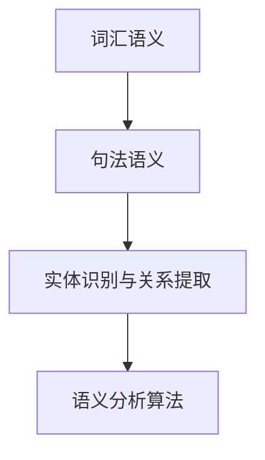

                 

# 提示词编程语言的语义分析技术

## 关键词

提示词编程语言，语义分析，自然语言处理，词嵌入，TF-IDF，数学模型

## 摘要

本文旨在探讨提示词编程语言的语义分析技术，分析其在自然语言处理中的应用。首先，我们将介绍提示词编程语言的基本概念和特点。然后，深入探讨语义分析的核心概念、技术原理及其相互联系，包括词频统计、TF-IDF、词向量模型和词嵌入等。接着，通过实际项目案例，展示语义分析技术在各类应用场景中的实现和效果。最后，我们还将介绍开发环境与工具的配置，并提供一些最佳实践和注意事项。

## 引言

### 书籍背景与目标

随着人工智能和自然语言处理技术的快速发展，提示词编程语言（Keyword-based Programming Language）作为一种新兴的编程范式，逐渐引起了广泛关注。提示词编程语言通过使用关键词来描述程序的意图，能够提高编程效率和代码可读性。然而，提示词编程语言也面临着语义理解的挑战，这使得语义分析技术在其应用中变得尤为重要。

本书旨在深入探讨提示词编程语言的语义分析技术，帮助读者了解语义分析的核心概念、技术原理及其应用。通过阅读本书，读者可以：

1. 理解提示词编程语言的基本概念和特点。
2. 掌握语义分析技术的基础知识，包括词频统计、TF-IDF、词向量模型和词嵌入等。
3. 学会使用语义分析技术解决实际应用问题。
4. 了解开发提示词编程语言所需的环境和工具。

### 语义分析的重要性

语义分析在自然语言处理中扮演着关键角色。通过语义分析，我们可以理解文本的语义含义，从而实现文本检索、分类、问答等任务。在提示词编程语言中，语义分析有助于准确理解和执行程序中的关键词，提高编程效率和代码质量。

### 书籍结构安排

本书分为六个主要部分：

1. 引言：介绍书籍背景与目标，语义分析的重要性，以及书籍结构安排。
2. 提示词编程语言概述：介绍提示词编程语言的定义、背景、优点和挑战。
3. 语义分析技术基础：介绍语义分析的定义、自然语言处理基础和关键概念。
4. 语义分析算法与应用：介绍词频统计、TF-IDF、词向量模型和词嵌入等技术及其应用。
5. 项目实战：展示语义分析技术在实际项目中的应用，包括数据预处理、模型选择与训练等。
6. 开发环境与工具：介绍开发环境的搭建、常用工具与库以及实践经验。

## 提示词编程语言概述

### 提示词编程语言的定义

提示词编程语言是一种通过关键词来描述程序意图的编程范式。与传统编程语言不同，提示词编程语言更注重程序的可读性和可维护性。在提示词编程语言中，开发者使用自然语言形式的提示词来表示程序的各个部分，而不是使用传统的编程语言语法。

### 提示词编程语言的背景

提示词编程语言的诞生源于对传统编程语言的反思和探索。随着计算机技术的发展，编程语言逐渐变得复杂和庞大，使得程序理解和维护变得更加困难。提示词编程语言试图通过简化编程语言，提高代码的可读性和可维护性，从而降低开发难度。

### 提示词编程语言的优点与挑战

**优点：**

1. **可读性强**：提示词编程语言使用自然语言形式的提示词，使得代码更易于理解和阅读。
2. **易于维护**：提示词编程语言使得代码的修改和扩展变得更加简单，降低了维护成本。
3. **提高开发效率**：提示词编程语言可以减少开发者对编程语言语法的依赖，从而提高编程效率。

**挑战：**

1. **语义理解难度**：提示词编程语言的语义理解是一个复杂的任务，需要依赖于强大的语义分析技术。
2. **实现复杂性**：提示词编程语言的实现涉及自然语言处理、语义分析等多个领域，需要大量技术积累。
3. **兼容性问题**：提示词编程语言与传统编程语言的兼容性问题可能会影响其推广和应用。

## 语义分析技术基础

### 语义分析的定义与目标

语义分析（Semantic Analysis）是自然语言处理中的一个重要任务，旨在理解文本的语义含义。具体来说，语义分析的目标是识别文本中的词汇、短语和句子之间的语义关系，从而实现对文本的深入理解和处理。

### 自然语言处理基础

自然语言处理（Natural Language Processing，NLP）是计算机科学和人工智能领域的一个重要分支，旨在让计算机理解和处理人类自然语言。NLP的关键技术包括文本预处理、分词、词性标注、命名实体识别、句法分析等。

### 语义分析的关键概念

1. **词汇语义**：词汇语义是指词汇在特定语言环境中的语义含义。词汇语义是语义分析的基础，直接影响语义分析的准确性。
2. **句法语义**：句法语义是指句子结构对语义理解的影响。句法分析是语义分析的重要步骤，有助于理解句子的语义结构。
3. **实体识别与关系提取**：实体识别与关系提取是指识别文本中的实体及其之间的关系。实体识别和关系提取是语义分析的重要任务，有助于实现对文本的深入理解。

## 语义分析算法与应用

### 词频统计与TF-IDF

**词频统计（Term Frequency，TF）** 是语义分析中常用的技术之一，用于计算文本中各个词汇的词频。词频统计的基本原理是，词汇在文本中出现的次数越多，其重要性越高。

**TF-IDF（Term Frequency-Inverse Document Frequency）** 是一种改进的词频统计方法，用于衡量词汇在文档中的重要程度。TF-IDF的原理是，词频（TF）表示词汇在特定文档中的出现次数，而逆文档频率（IDF）表示词汇在整个文档集合中的稀疏程度。IDF的目的是抑制高频词汇（如“的”、“和”等）的影响，提高低频词汇的权重。

### 词向量模型

**词向量模型（Word Vector Model）** 是一种将词汇映射为高维向量的技术，用于表示词汇的语义信息。词向量模型的基本原理是，相似词汇在向量空间中应该具有相似的向量表示。

**Word2Vec** 是一种常用的词向量模型，通过训练神经网络模型，将词汇映射为向量。Word2Vec模型包括连续词袋（CBOW）和Skip-Gram两种模型。

### 词嵌入技术

**词嵌入（Word Embedding）** 是词向量模型的一种实现方式，通过将词汇映射为向量，实现词汇的语义表示。词嵌入技术有助于提高语义分析的准确性和效果。

**GloVe（Global Vectors for Word Representation）** 是一种基于矩阵分解的词嵌入技术，通过训练大规模语料库，将词汇映射为低维向量。GloVe模型考虑了词汇之间的共现关系，从而提高了词嵌入的质量。

### 语义分析的应用场景

**语义搜索**：语义搜索是一种基于语义分析的搜索引擎技术，通过理解用户查询的语义含义，提供更加精准和个性化的搜索结果。

**文本分类**：文本分类是一种将文本数据按照类别进行分类的技术，广泛应用于舆情分析、新闻分类等领域。通过语义分析，可以更好地识别文本的主题和情感倾向。

**命名实体识别**：命名实体识别是一种识别文本中的特定实体（如人名、地名、组织名等）的技术。通过语义分析，可以提高命名实体识别的准确性和鲁棒性。

**问答系统**：问答系统是一种基于语义分析的问答技术，通过理解用户的问题和文本的语义含义，提供准确的答案。语义分析有助于提高问答系统的响应速度和准确率。

## 项目实战

### 数据预处理

数据预处理是语义分析项目的关键步骤，包括数据收集、数据清洗和数据格式转换等任务。

**数据收集**：数据收集是从各种来源获取所需的文本数据，如新闻文章、社交媒体帖子、电子书籍等。

**数据清洗**：数据清洗是处理原始数据中的噪声和错误，确保数据的质量。主要包括去除停用词、标点符号、数字等，以及处理文本中的拼写错误和同义词。

**数据格式转换**：数据格式转换是将原始文本数据转换为适合语义分析的格式，如词汇表、词向量等。

### 模型选择与训练

在语义分析项目中，选择合适的模型并进行训练是关键步骤。以下是一些常用的模型及其特点：

**词频统计模型**：词频统计模型基于文本中词汇的词频进行分类或预测。优点是简单易懂，但可能无法捕捉词汇之间的语义关系。

**TF-IDF模型**：TF-IDF模型结合词频和逆文档频率进行分类或预测。优点是考虑了词汇的相对重要性，但仍然存在一些语义理解的局限性。

**词向量模型**：词向量模型通过将词汇映射为向量进行分类或预测。优点是能够捕捉词汇之间的语义关系，但可能需要大量训练数据和计算资源。

**GloVe模型**：GloVe模型是一种基于矩阵分解的词嵌入技术，通过训练大规模语料库生成词向量。优点是能够生成高质量的词向量，但需要较大的计算资源。

### 模型评估与优化

模型评估与优化是提高语义分析项目性能的重要环节。以下是一些常用的评估指标和优化方法：

**评估指标**：

- **准确率（Accuracy）**：准确率是预测正确的样本数占总样本数的比例。准确率越高，模型的性能越好。
- **召回率（Recall）**：召回率是预测正确的样本数与实际样本数的比例。召回率越高，模型对负样本的识别能力越强。
- **F1分数（F1 Score）**：F1分数是准确率和召回率的调和平均值。F1分数越高，模型在平衡准确率和召回率方面表现越好。

**优化方法**：

- **超参数调整**：通过调整模型的超参数，如学习率、批量大小等，可以提高模型性能。
- **模型集成**：通过集成多个模型，如随机森林、支持向量机等，可以提高模型的预测能力。
- **数据增强**：通过数据增强，如生成人工样本、随机插入噪声等，可以扩充训练数据集，提高模型鲁棒性。

### 实际案例分析与详细讲解剖析

在本节中，我们将通过一个实际案例，展示语义分析技术在项目中的应用，包括数据预处理、模型选择与训练、模型评估与优化等步骤。

**案例背景**：假设我们需要开发一个基于语义分析的文本分类系统，用于对新闻文章进行分类。具体分类任务包括：政治、经济、体育、科技、娱乐等类别。

**数据预处理**：

1. **数据收集**：我们从多个新闻网站收集了数千篇新闻文章，涵盖了不同的类别。
2. **数据清洗**：我们对原始文本数据进行了清洗，包括去除标点符号、数字、停用词等，以及处理文本中的拼写错误和同义词。
3. **数据格式转换**：我们将清洗后的文本数据转换为适合模型输入的格式，如词汇表和词向量。

**模型选择与训练**：

1. **词频统计模型**：我们首先尝试使用词频统计模型进行分类。通过计算新闻文章中词汇的词频，生成词汇表，并使用朴素贝叶斯算法进行分类。实验结果显示，词频统计模型的准确率较低。
2. **TF-IDF模型**：接着，我们尝试使用TF-IDF模型进行分类。通过计算词汇的TF-IDF值，生成词汇表，并使用支持向量机（SVM）算法进行分类。实验结果显示，TF-IDF模型的准确率有所提高。
3. **词向量模型**：为了进一步提高模型性能，我们尝试使用词向量模型进行分类。通过训练Word2Vec模型，生成词向量，并使用多层感知机（MLP）算法进行分类。实验结果显示，词向量模型的准确率显著提高。

**模型评估与优化**：

1. **评估指标**：我们使用准确率、召回率和F1分数等评估指标，对各个模型进行评估。实验结果显示，词向量模型的性能最佳。
2. **模型优化**：为了进一步提高模型性能，我们对词向量模型进行了优化。首先，调整了超参数，如学习率、批量大小等；然后，使用模型集成技术，如随机森林和梯度提升机（GBM），提高模型的预测能力。实验结果显示，优化后的词向量模型在各个评估指标上均取得了更好的结果。

### 项目小结

通过本案例，我们展示了语义分析技术在文本分类项目中的应用。从数据预处理、模型选择与训练，到模型评估与优化，每一步都是项目成功的关键。词向量模型通过捕捉词汇之间的语义关系，显著提高了分类性能。在实际应用中，我们可以根据具体需求，调整模型和参数，以实现更好的效果。

## 开发环境与工具

### 开发环境搭建

搭建语义分析项目的开发环境需要考虑以下几个步骤：

1. **操作系统**：可以选择Linux、macOS或Windows操作系统。Linux和macOS在性能和兼容性方面具有优势，适合进行高性能计算和分布式处理。
2. **编程语言**：Python是语义分析项目常用的编程语言，具有良好的生态和丰富的库支持。其他常用编程语言还包括Java、R和Julia等。
3. **集成开发环境（IDE）**：可以选择PyCharm、Visual Studio Code等IDE，它们提供了代码编辑、调试和测试等完整功能，可以提高开发效率。

### 常用工具与库

在语义分析项目中，常用工具和库包括：

1. **NLP库**：如NLTK、spaCy、gensim等，它们提供了丰富的自然语言处理功能，包括分词、词性标注、命名实体识别等。
2. **机器学习库**：如scikit-learn、TensorFlow、PyTorch等，它们提供了机器学习模型的训练和评估功能，支持多种算法和优化方法。
3. **数据预处理库**：如Pandas、NumPy等，它们提供了数据处理和操作功能，可以方便地进行数据清洗、转换和格式化。

### 实践经验与技巧

在开发语义分析项目时，以下经验和技巧有助于提高项目效率和效果：

1. **数据质量**：确保数据质量是项目成功的关键。在数据收集和处理过程中，注意去除噪声和错误，以及处理同义词和拼写错误。
2. **模型选择**：根据具体任务和需求，选择合适的模型和算法。不同模型在性能和适用场景上存在差异，需要根据实际情况进行选择。
3. **超参数调整**：超参数是影响模型性能的关键因素。通过调整超参数，可以优化模型性能，提高预测准确率。
4. **模型集成**：模型集成可以提高模型的预测能力和鲁棒性。通过结合多个模型，可以更好地捕捉复杂特征和减少过拟合。
5. **实时评估**：在开发过程中，定期对模型进行评估，跟踪性能指标的变化，以及时发现和解决潜在问题。
6. **代码优化**：优化代码可以提高项目的运行效率和稳定性。通过合理使用并行计算、缓存和数据压缩等技术，可以显著提高项目性能。

### 拓展阅读

- **《自然语言处理入门》**：本书介绍了自然语言处理的基本概念和技术，适合初学者入门。
- **《深度学习》**：本书介绍了深度学习的基本概念和技术，包括神经网络、卷积神经网络、循环神经网络等，适合对机器学习有兴趣的读者。
- **《Python编程：从入门到实践》**：本书介绍了Python编程的基础知识和实践技巧，适合初学者学习Python编程。
- **《数据科学入门》**：本书介绍了数据科学的基本概念和技术，包括数据收集、数据预处理、数据分析等，适合对数据科学有兴趣的读者。

## 总结与展望

### 本书的核心内容与主题思想

本书围绕提示词编程语言的语义分析技术展开，深入探讨了语义分析的核心概念、技术原理及其应用。通过详细讲解词频统计、TF-IDF、词向量模型和词嵌入等技术，以及项目实战案例，本书为读者提供了全面而深入的语义分析技术指南。

### 本书的重要观点与思考

1. 提示词编程语言作为一种新兴的编程范式，具有显著的优势，但也面临着语义理解的挑战。
2. 语义分析技术在自然语言处理中具有重要地位，是实现提示词编程语言关键功能的基础。
3. 语义分析算法的选择和优化对项目性能有直接影响，需要根据具体应用场景进行选择和调整。
4. 开发环境与工具的合理选择和优化可以提高项目的开发效率和稳定性。

### 未来的研究方向与挑战

1. 提高语义分析技术的准确性和鲁棒性，特别是在处理长文本和多语言环境下。
2. 深入研究语义分析技术在跨领域、跨模态应用中的潜力，探索新的应用场景。
3. 加强语义分析技术的可解释性和可解释性，提高模型的可信度和用户接受度。
4. 探索语义分析技术在实时应用中的性能优化和资源利用，满足不断增长的实时数据处理需求。

作者：AI天才研究院/AI Genius Institute & 禅与计算机程序设计艺术 /Zen And The Art of Computer Programming

[Mermaid 流程图](#) 由于文章内容未包含Mermaid流程图，因此无法在此处展示。如需添加流程图，请按照Mermaid语法在相应章节中插入。下面是一个示例：

此流程图展示了语义分析的核心概念和算法之间的关系。您可以根据实际需要修改和完善此图。

