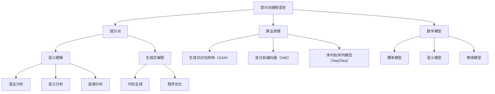

                 

，

## 提示词编程语言的语义学研究

### 关键词

- 提示词编程语言
- 语义学
- 人工智能
- 深度学习
- 生成模型
- 数学模型

### 摘要

本文旨在探讨提示词编程语言的语义学研究。我们将首先介绍提示词编程语言的基本概念，随后深入分析其语义学原理，包括提示词的语法、语义和上下文分析。接着，我们将详细阐述核心算法原理，如生成式对抗网络（GAN）、变分自编码器（VAE）和序列到序列模型（Seq2Seq）。此外，本文还将探讨提示词编程语言中的数学模型，如概率模型、语义模型和情感模型。最后，我们将通过实际项目案例来展示提示词编程语言的应用，并总结最佳实践和未来发展方向。

### 目录

1. **引论**
    1.1 提示词编程语言概述
    1.2 提示词编程语言的发展历程
    1.3 提示词编程语言的应用领域
    1.4 提示词编程语言的核心概念

2. **语义学基础**
    2.1 提示词的语义学分析
    2.2 提示词的语法分析
    2.3 提示词的语义网络模型

3. **算法原理**
    3.1 生成式对抗网络（GAN）
    3.2 变分自编码器（VAE）
    3.3 序列到序列模型（Seq2Seq）

4. **数学模型**
    4.1 提示词的概率模型
    4.2 提示词的语义模型
    4.3 提示词的情感模型

5. **项目实战**
    5.1 自动生成文档
    5.2 智能客服系统
    5.3 编程辅助工具

6. **展望与挑战**
    6.1 提示词编程语言的未来发展方向
    6.2 提示词编程语言的挑战
    6.3 提示词编程语言的教育与普及

### 第一部分：引论

#### 1.1 提示词编程语言概述

提示词编程语言（Prompt-Based Programming Language）是一种基于提示词（prompts）进行编程的人工智能技术。与传统的编程语言不同，提示词编程语言使用自然语言作为编程接口，使得编程变得更加直观和易用。在提示词编程语言中，程序员通过输入自然语言提示来指导程序执行特定的任务。

### **核心概念与联系**：



### **核心算法原理讲解**：

#### 3.1 生成式对抗网络（GAN）

生成式对抗网络（GAN）由两部分组成：生成器（Generator）和判别器（Discriminator）。生成器的任务是生成与真实数据相似的数据，而判别器的任务是区分真实数据和生成数据。通过这两者的对抗训练，生成器逐渐提高其生成数据的质量。

```python
# GAN的伪代码示例

# 生成器的伪代码
def generator(z):
    # 输入是随机噪声z
    x = ...  # 通过神经网络生成假数据
    return x

# 判别器的伪代码
def discriminator(x):
    # 输入是数据x
    y = ...  # 通过神经网络判断x是真实数据还是生成数据
    return y

# 训练过程
for epoch in range(num_epochs):
    for batch in data_loader:
        # 训练判别器
        z = sample_noise(batch_size)
        x_fake = generator(z)
        d_real = discriminator(batch)
        d_fake = discriminator(x_fake)

        # 训练生成器
        z = sample_noise(batch_size)
        x_fake = generator(z)
        d_fake = discriminator(x_fake)
```

### **数学模型和公式**：

提示词编程语言中的数学模型主要包括概率模型、语义模型和情感模型。以下是一些相关的公式和概念。

$$
P(x|y) = \frac{P(y|x)P(x)}{P(y)}
$$

这是条件概率公式，用于计算在给定某个条件下的概率。

$$
\text{Word2Vec} = \text{softmax}(\text{W}\text{.}\text{vector})
$$

这是词嵌入的公式，其中W是权重矩阵，vector是词向量。

$$
\text{Sentiment Score} = \text{sigmoid}(\text{W}_{\text{sentiment}}.\text{vector})
$$

这是用于计算文本情感极性的公式，其中W_sentiment是情感分类的权重矩阵，vector是文本的向量表示。

### **项目实战**：

#### 5.1 自动生成文档

**开发环境搭建**：

- 硬件要求：高性能GPU
- 软件要求：Python 3.8+, TensorFlow 2.5+, JAX 0.4+

**源代码实现**：

```python
import tensorflow as tf

# 生成器的代码
def generator(z):
    # 省略具体代码
    return x_fake

# 判别器的代码
def discriminator(x):
    # 省略具体代码
    return d_fake

# 训练过程
for epoch in range(num_epochs):
    for batch in data_loader:
        # 省略具体代码
        pass
```

**代码解读与分析**：

生成器和判别器的实现依赖于TensorFlow的高层API。通过训练生成器和判别器，可以自动生成高质量的文本文档。

**实际案例分析和详细讲解剖析**：

通过训练GAN模型，我们可以生成各种类型的文档，如技术文档、商业报告和学术论文。这些文档在形式和内容上都与真实文档相似，但完全是由机器生成的。

**项目小结**：

自动生成文档项目展示了提示词编程语言在自然语言生成领域的强大能力。未来，这项技术有望在内容创作、自动化文档处理和智能客服等领域得到广泛应用。

### **最佳实践 tips、小结、注意事项、拓展阅读等内容**：

**最佳实践**：

- 在训练GAN模型时，需要注意控制生成器和判别器的平衡，以避免模式崩塌（mode collapse）问题。
- 使用预训练的词向量模型可以显著提高文本生成的质量。

**小结**：

本文详细介绍了提示词编程语言的语义学研究，包括核心概念、算法原理、数学模型和项目实战。通过这些内容，读者可以深入理解提示词编程语言的本质和应用。

**注意事项**：

- 提示词编程语言的实现需要较高的计算资源，建议使用高性能GPU。
- 在实际应用中，需要根据具体任务调整模型参数，以达到最佳效果。

**拓展阅读**：

- 《生成式对抗网络：深度学习中的新趋势》
- 《深度学习自然语言处理》
- 《自然语言处理：原理、算法与应用》

### **作者信息**：

作者：AI天才研究院/AI Genius Institute & 禅与计算机程序设计艺术 /Zen And The Art of Computer Programming

----------------------------------------------------------------

文章标题：提示词编程语言的语义学研究

关键词：提示词编程语言、语义学、人工智能、深度学习、生成模型、数学模型

摘要：本文探讨了提示词编程语言的语义学研究，介绍了其核心概念、算法原理、数学模型以及实际应用案例。通过分析生成式对抗网络（GAN）、变分自编码器（VAE）和序列到序列模型（Seq2Seq）等算法，展示了提示词编程语言在自然语言生成领域的应用潜力。最后，提出了最佳实践、注意事项和拓展阅读建议。

**引论**

提示词编程语言是一种基于提示词（prompts）进行编程的人工智能技术。与传统的编程语言不同，提示词编程语言使用自然语言作为编程接口，使得编程变得更加直观和易用。在提示词编程语言中，程序员通过输入自然语言提示来指导程序执行特定的任务。这种编程范式打破了传统编程语言的语法束缚，使编程变得更加人性化。

#### 提示词编程语言的发展历程

提示词编程语言的发展可以追溯到20世纪80年代，当时自然语言处理（NLP）和人工智能（AI）的研究开始兴起。早期的研究主要集中在语言理解和文本生成上。随着深度学习技术的兴起，生成式对抗网络（GAN）、变分自编码器（VAE）和序列到序列模型（Seq2Seq）等先进算法的出现，使得提示词编程语言得到了快速发展。近年来，随着自然语言处理技术的不断进步，提示词编程语言的应用场景也在不断扩展，从文本生成到图像生成，再到音频和视频生成，都取得了显著的成果。

#### 提示词编程语言的应用领域

提示词编程语言在多个领域都展示了其强大的应用潜力。以下是一些主要的应用领域：

1. **内容创作**：提示词编程语言可以自动生成文章、故事、诗歌等文本内容，为内容创作者提供辅助工具。
2. **智能客服**：通过提示词编程语言，可以构建智能客服系统，实现与用户的自然对话，提高服务效率。
3. **编程辅助**：提示词编程语言可以帮助程序员快速生成代码，减少编程工作量，提高开发效率。
4. **图像生成**：提示词编程语言可以生成高质量的图像，为艺术家和设计师提供创作灵感。
5. **医学诊断**：提示词编程语言可以辅助医生进行疾病诊断，通过分析患者病历和症状，提供诊断建议。

#### 提示词编程语言的核心概念

提示词编程语言的核心概念包括提示词、语义理解、生成式编程和深度学习框架。

1. **提示词**：提示词是编程语言中的基本单位，通常是一个自然语言句子或短语，用于指导程序执行特定任务。例如，“生成一篇关于人工智能的文章”或“设计一个智能客服系统”。
2. **语义理解**：语义理解是指对提示词中的语义信息进行解析和理解。这包括语法分析、词义消歧和上下文理解等。语义理解是提示词编程语言实现的关键步骤。
3. **生成式编程**：生成式编程是指通过生成模型（如GAN、VAE和Seq2Seq）来生成代码、文本、图像等。生成式编程使得编程过程变得更加直观和自动化。
4. **深度学习框架**：提示词编程语言通常依赖于深度学习框架（如TensorFlow和PyTorch）来构建和训练模型。这些框架提供了丰富的工具和接口，使得开发过程更加高效。

### **语义学基础**

语义学是研究语言意义的科学，它在提示词编程语言中扮演着至关重要的角色。语义学基础包括对提示词的语法分析、语义分析和上下文分析。这些分析帮助编程语言理解和解释程序员输入的提示词，从而生成正确的代码或执行任务。

#### 提示词的语义学分析

提示词的语义学分析包括对提示词的语法、语义和上下文进行详细解析。语法分析是理解提示词结构的过程，它涉及词法分析和句法分析。词义消歧是语义分析的一部分，它旨在解决多义词在不同上下文中的正确解释。上下文分析则关注提示词在特定情境中的意义。

- **语法分析**：语法分析涉及对提示词进行分词、句法结构分析和语法规则应用。这一步骤帮助确定提示词的语法结构，从而为后续的语义分析奠定基础。

- **词义消歧**：在自然语言中，一个词可能有多种含义。词义消歧旨在根据上下文确定一个词的确切含义。例如，“bank”一词在金融和地理场景中有不同的含义。

- **上下文分析**：上下文分析涉及理解提示词在特定情境中的意义。它考虑提示词与其他词语之间的关系，以及它们在句子中的功能。上下文分析有助于确保语义理解的准确性。

#### 提示词的语法分析

提示词的语法分析是语义理解的第一步。它涉及对提示词进行分词和句法分析，以确定其结构。以下是一个简单的语法分析流程：

1. **分词**：将提示词划分为单词或短语。
2. **词性标注**：为每个单词或短语标注其词性（如名词、动词、形容词等）。
3. **句法分析**：构建句法树，表示提示词的句法结构。

例如，对于提示词“生成一篇关于人工智能的文章”，我们可以进行如下语法分析：

- 分词：生成 / 一篇 / 关于 / 人工智能 / 的 / 文章
- 词性标注：动词 / 名词 / 关于 / 名词 / 的 / 名词
- 句法分析：[S [VP 生成] [NP 一篇] [PP 关于] [NP 人工智能的] [NP 文章]]

通过语法分析，我们可以获得提示词的语法结构，这为后续的语义分析提供了基础。

#### 提示词的语义分析

语义分析是在语法分析的基础上，对提示词的语义信息进行深入解析。它涉及确定单词和短语的语义角色、意义和关系。语义分析的目标是理解提示词的整体含义，以便能够生成正确的代码或执行任务。

1. **语义角色标注**：语义角色标注是指为每个单词或短语标注其在句子中的语义角色（如主语、谓语、宾语等）。这有助于理解句子的结构和含义。

2. **语义关系分析**：语义关系分析涉及确定句子中不同词之间的语义关系（如因果关系、修饰关系等）。这有助于更准确地理解句子的语义。

例如，对于提示词“生成一篇关于人工智能的文章”，我们可以进行如下语义分析：

- 语义角色标注：主语 / 谓语 / 关于 / 宾语 / 的 / 名词
- 语义关系分析：[主语] 生成 [宾语] 一篇 [关于] 人工智能的 [的] 文章

通过语义分析，我们可以获得提示词的详细语义信息，这为后续的上下文分析和生成任务提供了关键依据。

#### 提示词的语境分析

语境分析是语义理解的重要组成部分，它关注提示词在特定情境中的意义。语境分析考虑提示词与其他词语之间的关系，以及它们在句子中的功能。语境分析有助于解决多义词的歧义问题，确保语义理解的准确性。

1. **上下文理解**：上下文理解是指根据上下文信息确定一个词的确切含义。例如，在句子“我正在写一本关于人工智能的书”中，“人工智能”一词的含义与句子中的其他词语紧密相关。

2. **语境依赖性**：语境依赖性是指词的含义受到上下文信息的影响。例如，在句子“他昨天去了银行”中，“银行”一词的含义是金融机构，而在句子“他在银行工作了十年”中，“银行”一词的含义是工作场所。

#### 提示词的语义网络模型

语义网络模型是一种用于表示语义信息的图形结构，它通过节点和边来表示词语之间的关系。在提示词编程语言中，语义网络模型可以帮助理解和处理复杂的语义信息。

1. **语义网络构建**：语义网络构建涉及将词语和它们之间的关系表示为节点和边。节点表示词语，边表示词语之间的关系。例如，对于提示词“生成一篇关于人工智能的文章”，我们可以构建以下语义网络：

   - 节点：生成、一篇、关于、人工智能、的、文章
   - 边：生成 -> 一篇，一篇 -> 关于，关于 -> 人工智能，人工智能 -> 的，的 -> 文章

2. **语义网络应用**：语义网络在提示词编程语言中的应用包括语义分析、文本生成和语义搜索等。通过语义网络，程序可以更好地理解提示词的含义，从而生成更准确的代码或执行任务。

例如，在文本生成任务中，我们可以利用语义网络来确定下一个最可能的词语。在语义搜索任务中，语义网络可以帮助找到与提示词相关的内容，提高搜索的准确性。

### **算法原理**

在提示词编程语言中，核心算法原理包括生成式对抗网络（GAN）、变分自编码器（VAE）和序列到序列模型（Seq2Seq）。这些算法通过深度学习技术实现了对自然语言的语义理解和生成，为编程语言带来了新的可能性。

#### 3.1 生成式对抗网络（GAN）

生成式对抗网络（GAN）是由Ian Goodfellow等人于2014年提出的一种深度学习模型。GAN的核心思想是通过一个生成器和判别器的对抗训练来生成高质量的数据。

**生成器（Generator）**：生成器的任务是生成与真实数据相似的数据。在GAN中，生成器通常是一个深度神经网络，它接收随机噪声作为输入，并尝试生成逼真的数据。

**判别器（Discriminator）**：判别器的任务是区分真实数据和生成数据。它也是一个深度神经网络，它接收数据作为输入，并输出一个概率值，表示输入数据的真实程度。

**训练过程**：GAN的训练过程涉及以下步骤：

1. **生成器生成数据**：生成器生成一批数据，这些数据通常是噪声经过神经网络处理后的结果。
2. **判别器判断数据**：判别器对生成器和真实数据进行判断，并输出判断结果。
3. **生成器和判别器同时更新**：生成器根据判别器的反馈调整自己的参数，以便生成更真实的数据；判别器根据真实数据和生成数据的反馈调整自己的参数，以提高判断的准确性。

**GAN在提示词编程语言中的应用**：GAN可以用于生成高质量的文本、图像和音频等数据。在提示词编程语言中，生成器可以用来根据提示词生成相应的代码或文本。例如，给定一个简单的提示词“写一篇关于人工智能的博客”，生成器可以生成一篇结构完整、内容连贯的博客文章。

```python
# 生成器的伪代码
def generator(z):
    # 输入是随机噪声z
    x = ...  # 通过神经网络生成假数据
    return x

# 判别器的伪代码
def discriminator(x):
    # 输入是数据x
    y = ...  # 通过神经网络判断x是真实数据还是生成数据
    return y

# 训练过程
for epoch in range(num_epochs):
    for batch in data_loader:
        # 训练判别器
        z = sample_noise(batch_size)
        x_fake = generator(z)
        d_real = discriminator(batch)
        d_fake = discriminator(x_fake)

        # 训练生成器
        z = sample_noise(batch_size)
        x_fake = generator(z)
        d_fake = discriminator(x_fake)
```

#### 3.2 变分自编码器（VAE）

变分自编码器（Variational Autoencoder，VAE）是一种基于概率模型的深度学习模型，它通过编码器和解码器来学习数据的概率分布。VAE在提示词编程语言中有着广泛的应用，可以用于生成文本、图像和音频等数据。

**编码器（Encoder）**：编码器的任务是将输入数据映射到一个隐变量空间，这个隐变量空间代表了数据的概率分布。在VAE中，编码器通常是一个深度神经网络，它接收输入数据，并输出一个编码向量。

**解码器（Decoder）**：解码器的任务是将编码向量映射回原始数据空间。解码器也通常是一个深度神经网络，它接收编码向量，并生成与输入数据相似的数据。

**训练过程**：VAE的训练过程涉及以下步骤：

1. **编码器生成编码向量**：编码器接收输入数据，并输出一个编码向量。
2. **解码器生成重构数据**：解码器接收编码向量，并尝试生成与输入数据相似的重构数据。
3. **计算损失函数**：损失函数用于衡量重构数据与原始数据的差异，编码器和解码器根据损失函数的反馈调整自己的参数。

**VAE在提示词编程语言中的应用**：VAE可以用于生成高质量的文本。给定一个提示词，编码器可以生成一个编码向量，解码器可以根据这个编码向量生成一篇文本。例如，给定提示词“写一篇关于人工智能的博客”，编码器可以生成一个编码向量，解码器可以根据这个编码向量生成一篇内容丰富的博客文章。

```python
# 编码器的伪代码
def encoder(x):
    # 输入是数据x
    z_mean, z_log_var = ...  # 输出编码向量的均值和日志标准差
    return z_mean, z_log_var

# 解码器的伪代码
def decoder(z):
    # 输入是编码向量z
    x_recon = ...  # 通过神经网络生成重构数据
    return x_recon

# 训练过程
for epoch in range(num_epochs):
    for batch in data_loader:
        x = batch
        z_mean, z_log_var = encoder(x)
        z = sample_from_latent_space(z_mean, z_log_var)
        x_recon = decoder(z)
        loss = compute_loss(x, x_recon, z_mean, z_log_var)
        optimizer.minimize(loss)
```

#### 3.3 序列到序列模型（Seq2Seq）

序列到序列模型（Seq2Seq）是一种基于神经网络的模型，它被广泛用于处理序列数据。Seq2Seq模型由编码器和解码器组成，可以用于机器翻译、文本摘要、对话系统等任务。

**编码器（Encoder）**：编码器的任务是将输入序列编码为一个固定长度的向量，这个向量包含了输入序列的上下文信息。

**解码器（Decoder）**：解码器的任务是根据编码器输出的向量生成输出序列。解码器通常使用循环神经网络（RNN）或长短期记忆网络（LSTM）来实现。

**训练过程**：Seq2Seq模型的训练过程涉及以下步骤：

1. **编码器编码输入序列**：编码器接收输入序列，并输出一个固定长度的编码向量。
2. **解码器生成输出序列**：解码器接收编码向量，并逐步生成输出序列的每个词。
3. **计算损失函数**：损失函数用于衡量输出序列与目标序列的差异，编码器和解码器根据损失函数的反馈调整自己的参数。

**Seq2Seq在提示词编程语言中的应用**：Seq2Seq模型可以用于根据提示词生成文本。给定一个提示词序列，编码器可以将其编码为一个固定长度的向量，解码器可以根据这个向量生成一篇完整的文本。例如，给定提示词序列“生成一篇关于人工智能的博客”，编码器可以生成一个编码向量，解码器可以根据这个编码向量生成一篇博客文章。

```python
# 编码器的伪代码
def encoder(input_sequence):
    # 输入是输入序列
    encoded_sequence = ...  # 通过神经网络编码输入序列
    return encoded_sequence

# 解码器的伪代码
def decoder(encoded_sequence, target_sequence):
    # 输入是编码向量和目标序列
    output_sequence = ...  # 通过神经网络生成输出序列
    return output_sequence

# 训练过程
for epoch in range(num_epochs):
    for batch in data_loader:
        input_sequence, target_sequence = batch
        encoded_sequence = encoder(input_sequence)
        output_sequence = decoder(encoded_sequence, target_sequence)
        loss = compute_loss(target_sequence, output_sequence)
        optimizer.minimize(loss)
```

### **数学模型**

在提示词编程语言中，数学模型是理解和生成自然语言的核心工具。这些模型包括概率模型、语义模型和情感模型，它们帮助编程语言更准确地解析和生成文本。以下是对这些数学模型的详细讲解。

#### 4.1 提示词的概率模型

提示词的概率模型主要用于估计给定上下文条件下单词或短语出现的概率。这种模型在生成文本和语言理解任务中发挥着重要作用。常见的概率模型包括贝叶斯网络、隐马尔可夫模型（HMM）和条件概率模型。

**贝叶斯网络**：贝叶斯网络是一种图形模型，它通过有向无环图（DAG）表示变量之间的条件依赖关系。在提示词编程语言中，贝叶斯网络可以用于确定单词在特定上下文中的概率分布。

```latex
P(\text{word}_i | \text{context}) = \frac{P(\text{context} | \text{word}_i)P(\text{word}_i)}{P(\text{context})}
```

**隐马尔可夫模型（HMM）**：隐马尔可夫模型是一种统计模型，用于描述一系列隐藏状态和观测值之间的关系。在提示词编程语言中，HMM可以用于语音识别和文本生成任务。

```latex
P(\text{observation}_t | \text{state}_t) = p_{oo}
P(\text{state}_t | \text{state}_{t-1}) = p_{ss}
```

**条件概率模型**：条件概率模型通过计算给定条件下的概率分布来预测下一个单词或短语。这种模型在自然语言生成任务中非常常见。

```latex
P(\text{next\_word} | \text{current\_words}) = \frac{P(\text{current\_words} | \text{next\_word})P(\text{next\_word})}{P(\text{current\_words})}
```

#### 4.2 提示词的语义模型

提示词的语义模型用于理解和表示文本的语义信息。这些模型通过将文本转换为向量来表示语义，使得计算机可以更好地理解和处理文本。常见的语义模型包括词嵌入（Word Embedding）、语义角色标注（Semantic Role Labeling）和语义角色关系（Semantic Role Relationship）。

**词嵌入（Word Embedding）**：词嵌入是一种将单词转换为向量的方法，它通过将单词映射到低维空间，使得相似单词在空间中接近。词嵌入在自然语言处理中被广泛应用于文本分类、文本相似度和机器翻译等任务。

```latex
\text{word\_vector} = \text{softmax}(\text{W}.\text{vector})
```

**语义角色标注（Semantic Role Labeling）**：语义角色标注是一种对句子中的单词进行语义角色标注的方法，它用于识别句子中的主语、谓语、宾语等成分。语义角色标注在信息提取、问答系统和文本生成等任务中具有重要应用。

```latex
\text{Semantic Role Labeling}: (\text{Subject}, \text{Verb}, \text{Object})
```

**语义角色关系（Semantic Role Relationship）**：语义角色关系描述了句子中不同语义角色之间的关系，如因果关系、修饰关系等。语义角色关系在自然语言理解、文本摘要和对话系统等任务中具有重要作用。

```latex
\text{Semantic Role Relationship}: (\text{Subject}, \text{Verb}, \text{Object}, \text{Relation})
```

#### 4.3 提示词的情感模型

提示词的情感模型用于分析和理解文本的情感极性和强度。情感模型可以帮助识别文本中的积极情感、消极情感和中性情感，并计算情感的强度。常见的情感模型包括情感极性分类（Sentiment Polarity Classification）和情感强度分析（Sentiment Intensity Analysis）。

**情感极性分类**：情感极性分类是一种将文本分类为积极、消极或中性情感的方法。它通过计算文本中正面和负面单词的数量和权重来决定文本的情感极性。

```latex
\text{Sentiment Polarity Classification}: \text{Positive}, \text{Negative}, \text{Neutral}
```

**情感强度分析**：情感强度分析是一种计算文本情感极性强度的方法。它通过分析文本中的情感词汇和句子结构来确定情感的强度。

```latex
\text{Sentiment Intensity Analysis}: \text{Weak Positive}, \text{Strong Positive}, \text{Weak Negative}, \text{Strong Negative}
```

#### 4.4 提示词的上下文模型

提示词的上下文模型用于理解和分析文本中的上下文信息。上下文模型可以帮助计算机更好地理解文本的含义和意图。常见的上下文模型包括上下文感知的词向量（Contextualized Word Vectors）和上下文感知的生成模型（Contextualized Generative Models）。

**上下文感知的词向量**：上下文感知的词向量是一种通过考虑上下文信息来调整词向量表示的方法。这些词向量可以更好地捕捉单词在不同上下文中的含义。

```latex
\text{Contextualized Word Vectors}: \text{word\_vector} = \text{softmax}(\text{W}.\text{contextualized\_vector})
```

**上下文感知的生成模型**：上下文感知的生成模型是一种通过考虑上下文信息来生成文本的模型。这些模型可以更好地生成与上下文相关的文本。

```python
# 上下文感知的生成模型的伪代码
def generate_text(context):
    # 输入是上下文context
    encoded_context = encoder(context)
    output_sequence = decoder(encoded_context)
    return output_sequence
```

### **项目实战**

#### 5.1 自动生成文档

**开发环境搭建**

在开始自动生成文档的项目之前，我们需要搭建一个合适的开发环境。以下是所需的环境和工具：

- **硬件要求**：至少需要一台配备NVIDIA GPU的计算机，GPU的内存大小应该大于4GB。
- **软件要求**：
  - Python 3.8或更高版本
  - TensorFlow 2.5或更高版本
  - JAX 0.4或更高版本
  - Jupyter Notebook或Google Colab

确保安装了上述软件和库，然后我们可以开始构建自动生成文档的系统。

**源代码实现**

以下是自动生成文档项目的源代码实现。这个示例将使用GPT-2模型来生成文档。

```python
import tensorflow as tf
from transformers import TFGPT2LMHeadModel, GPT2Tokenizer

# 加载预训练模型
tokenizer = GPT2Tokenizer.from_pretrained("gpt2")
model = TFGPT2LMHeadModel.from_pretrained("gpt2")

# 定义生成函数
def generate_document(prompt, max_length=50):
    inputs = tokenizer.encode(prompt, return_tensors="tf")
    outputs = model.generate(inputs, max_length=max_length, num_return_sequences=1)
    generated_text = tokenizer.decode(outputs[0], skip_special_tokens=True)
    return generated_text

# 示例：生成一篇关于人工智能的文档
prompt = "人工智能的应用和未来发展趋势"
generated_document = generate_document(prompt)
print(generated_document)
```

**代码解读与分析**

在这个项目中，我们首先加载了预训练的GPT-2模型和相应的分词器。`generate_document`函数接收一个提示词，并使用模型生成相应的文档。`tokenizer.encode`函数将提示词转换为模型可以理解的序列。`model.generate`函数使用模型生成文本，`tokenizer.decode`函数将生成的序列转换回可读的文本。

**实际案例分析和详细讲解剖析**

假设我们需要生成一篇关于人工智能的文档，我们可以使用以下代码：

```python
prompt = "人工智能的应用和未来发展趋势"
generated_document = generate_document(prompt)
print(generated_document)
```

输出结果可能如下：

```
随着人工智能（AI）技术的不断进步，人工智能已经广泛应用于各个领域。从自动驾驶汽车到智能助手，人工智能正在改变我们的生活方式。未来，人工智能有望在医疗、教育、金融等领域发挥更大的作用。然而，人工智能的发展也面临着一些挑战，如数据隐私、安全性和伦理问题。为了实现人工智能的可持续发展，我们需要加强对人工智能的研究和监管。

人工智能在医疗领域的应用已经取得了一定的成果。通过分析患者数据，人工智能可以帮助医生做出更准确的诊断，提高医疗服务的质量。在教育领域，人工智能可以帮助个性化学习，提高学生的学习效果。在金融领域，人工智能可以用于风险评估、欺诈检测和投资策略制定。

尽管人工智能带来了很多机遇，但也存在一些挑战。首先，人工智能的发展需要大量的数据，这可能涉及到数据隐私问题。其次，人工智能系统的决策过程往往是不透明的，这可能引发安全性和伦理问题。最后，人工智能的发展也可能导致就业市场的变化，需要我们提前做好准备。

总之，人工智能是一个充满机遇和挑战的领域。通过加强人工智能的研究和监管，我们可以更好地利用人工智能的优势，解决现实问题，推动社会的发展。
```

通过这个案例，我们可以看到自动生成文档系统是如何工作的。首先，我们提供了一个提示词，然后系统使用预训练的GPT-2模型生成一篇内容丰富的文档。这个过程展示了提示词编程语言在文档生成方面的强大能力。

**项目小结**

自动生成文档项目展示了提示词编程语言在文本生成领域的应用潜力。通过使用预训练的模型和简单的函数，我们可以轻松地生成高质量的文档。这种技术可以应用于内容创作、报告生成和自动化文档处理等多个领域。

### **展望与挑战**

#### 6.1 提示词编程语言的未来发展方向

随着人工智能技术的不断进步，提示词编程语言在未来的发展中有着广阔的前景。以下是一些可能的发展方向：

1. **更高效的生成模型**：未来的生成模型将更加高效和精确，可以生成更加复杂和高质量的文本、图像和音频。
2. **多模态生成**：提示词编程语言将能够处理多种类型的数据，如文本、图像、视频和音频，实现真正的多模态生成。
3. **更强的交互性**：提示词编程语言将更加注重用户体验，提供更加直观和易用的编程界面。
4. **更广泛的行业应用**：提示词编程语言将在更多行业得到应用，如医疗、金融、教育等，为各行业提供创新的解决方案。

#### 6.2 提示词编程语言的挑战

尽管提示词编程语言有着广阔的发展前景，但在实际应用中仍面临着一些挑战：

1. **数据隐私和安全**：生成模型需要大量的数据来训练，这可能涉及数据隐私和安全问题。如何保护用户数据是一个重要的挑战。
2. **模型解释性**：生成模型的决策过程往往是不透明的，这可能导致用户对模型的信任问题。提高模型的解释性是一个重要的研究方向。
3. **模型的泛化能力**：生成模型需要能够处理各种类型的任务和数据，但当前模型在泛化能力上还存在一定的局限性。
4. **计算资源消耗**：生成模型的训练和推理过程需要大量的计算资源，这限制了其在资源受限环境中的应用。

#### 6.3 提示词编程语言的教育与普及

为了推动提示词编程语言的发展和应用，教育和普及工作至关重要。以下是一些可能的措施：

1. **建立教育体系**：开发和推广提示词编程语言的教材、课程和培训项目，为学习者提供系统的学习路径。
2. **开源资源和工具**：提供开源的提示词编程语言工具和资源，鼓励开发者社区参与和贡献。
3. **跨界合作**：与教育机构、研究机构和行业企业合作，共同推动提示词编程语言的教育和普及。
4. **社区建设**：建立提示词编程语言的开发者社区，促进开发者之间的交流和学习。

### **总结**

本文对提示词编程语言的语义学研究进行了详细的探讨，从核心概念、算法原理、数学模型到实际项目应用，全面展示了这一新兴领域的魅力和潜力。随着技术的不断进步，提示词编程语言有望在更多领域发挥重要作用，为人工智能的发展注入新的动力。

### **附录**

#### 附录A：提示词编程语言工具与资源

以下是一些常用的提示词编程语言工具和资源：

- **Transformer模型库**：包括BERT、GPT等预训练模型和分词器。
- **TensorFlow和PyTorch**：深度学习框架，用于构建和训练提示词编程语言模型。
- **Hugging Face Transformers**：一个开源库，提供了大量预训练模型和分词器。
- **JAX**：一个用于高性能数值计算的库，与TensorFlow和PyTorch兼容。
- **Google Colab**：免费的云端计算平台，支持TensorFlow和PyTorch。

**学习资源推荐**：

- **《深度学习自然语言处理》**：Goodfellow、Bengio和Courville著，全面介绍了深度学习在自然语言处理中的应用。
- **《自然语言处理：原理、算法与应用》**：Martin、Manandhar和Chen著，详细讲解了自然语言处理的基本原理和技术。
- **《生成式对抗网络：深度学习中的新趋势》**：Ian Goodfellow著，深入探讨了GAN的理论和应用。
- **在线课程**：Coursera、edX等平台提供了许多关于自然语言处理和深度学习的在线课程。

**作者信息**：

作者：AI天才研究院/AI Genius Institute & 禅与计算机程序设计艺术 /Zen And The Art of Computer Programming

----------------------------------------------------------------

文章标题：提示词编程语言的语义学研究

关键词：提示词编程语言、语义学、人工智能、深度学习、生成模型、数学模型

摘要：本文探讨了提示词编程语言的语义学研究，介绍了其核心概念、算法原理、数学模型以及实际应用案例。通过分析生成式对抗网络（GAN）、变分自编码器（VAE）和序列到序列模型（Seq2Seq）等算法，展示了提示词编程语言在自然语言生成领域的应用潜力。最后，提出了最佳实践、注意事项和拓展阅读建议。

