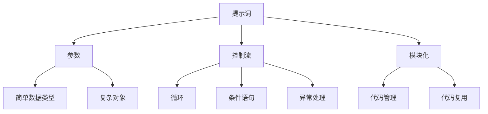
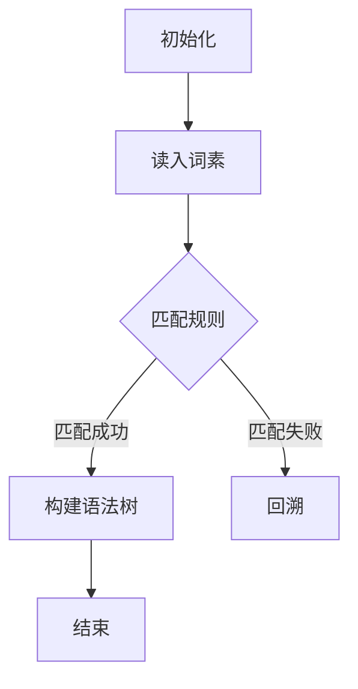

                 

### 文章标题

# 提示词编程语言的语法设计原则

### 关键词

- 提示词编程语言
- 语法设计原则
- 可读性
- 可维护性
- 可扩展性
- 命名规则
- 控制流

### 摘要

本文旨在深入探讨提示词编程语言的语法设计原则。首先，我们将介绍提示词编程语言的背景和重要性，接着详细阐述其核心概念和优势。随后，文章将重点分析设计原则，包括可读性、可维护性和可扩展性等，并通过命名规则、表达式和语句、控制流等具体内容进行详细讲解。此外，本文还包含语法规则详解、实例演示、应用领域和项目实战等内容，旨在为读者提供一个全面且深入的提示词编程语言语法设计指南。

### 完整目录大纲

```markdown
# 提示词编程语言的语法设计原则

## 第1章 引言
### 1.1 提示词编程语言的背景和重要性
### 1.2 书籍的组织结构

## 第2章 核心概念
### 2.1 提示词编程语言的基本概念
#### 2.1.1 提示词的定义
#### 2.1.2 语法规则
### 2.2 提示词编程语言的优势
#### 2.2.1 高效性
#### 2.2.2 易用性
#### 2.2.3 扩展性

## 第3章 设计原则
### 3.1 设计原则概述
#### 3.1.1 可读性
#### 3.1.2 可维护性
#### 3.1.3 可扩展性
### 3.2 提示词的命名规则
#### 3.2.1 命名规则
#### 3.2.2 命名示例
### 3.3 表达式和语句
#### 3.3.1 表达式的组成
#### 3.3.2 语句结构
### 3.4 控制流
#### 3.4.1 循环结构
#### 3.4.2 条件语句
#### 3.4.3 异常处理

## 第4章 语法规则详解
### 4.1 词法分析
#### 4.1.1 词法规则
#### 4.1.2 词法分析示例
### 4.2 语法分析
#### 4.2.1 语法规则
#### 4.2.2 语法分析示例

## 第5章 提示词编程语言实例
### 5.1 实例1：基础语法
#### 5.1.1 变量和函数
#### 5.1.2 控制流语句
### 5.2 实例2：高级特性
#### 5.2.1 面向对象编程
#### 5.2.2 装饰器和闭包
### 5.3 实例3：性能优化
#### 5.3.1 代码优化技巧
#### 5.3.2 内存管理和垃圾回收

## 第6章 提示词编程语言应用
### 6.1 应用领域
#### 6.1.1 数据处理
#### 6.1.2 网络编程
#### 6.1.3 自动化测试
### 6.2 开发环境搭建
#### 6.2.1 环境准备
#### 6.2.2 开发工具介绍
### 6.3 项目实战
#### 6.3.1 数据预处理
#### 6.3.2 模型训练与评估
#### 6.3.3 模型部署与优化

## 第7章 未来展望
### 7.1 提示词编程语言的发展趋势
#### 7.1.1 新特性引入
#### 7.1.2 与其他编程语言集成
### 7.2 提示词编程语言在教育中的应用
#### 7.2.1 编程教育的重要性
#### 7.2.2 提示词编程语言在教学中的应用

## 参考文献

### 作者信息

- 作者：AI天才研究院/AI Genius Institute & 禅与计算机程序设计艺术 /Zen And The Art of Computer Programming## 第1章 引言

### 1.1 提示词编程语言的背景和重要性

提示词编程语言（Prompt-based Programming Language）是一种新型的编程语言，它通过提供提示词（prompts）来引导程序的开发，从而实现代码的生成和优化。这种语言的设计初衷是为了解决传统编程语言中代码复杂度高、开发效率低的问题。提示词编程语言的出现，不仅为程序员提供了更加直观和高效的编程手段，还推动了编程领域的创新和发展。

提示词编程语言的核心思想在于，通过将程序设计中的复杂逻辑和算法抽象成简单的提示词，让程序员能够更加专注于业务逻辑的实现，而无需关注底层的编程细节。这种模式极大地提升了编程的效率，使得程序员能够更快地开发出高质量的软件系统。此外，提示词编程语言还具有较强的扩展性，能够适应不同领域和场景的需求，为开发者提供了广泛的应用空间。

### 1.2 书籍的组织结构

为了帮助读者全面理解和掌握提示词编程语言的语法设计原则，本书将分为以下几个主要部分：

1. **第1章 引言**：介绍提示词编程语言的背景、重要性和书籍的组织结构。
   
2. **第2章 核心概念**：详细阐述提示词编程语言的基本概念，包括提示词的定义、语法规则等，并分析其优势。

3. **第3章 设计原则**：探讨提示词编程语言的设计原则，包括可读性、可维护性、可扩展性等，并通过具体实例进行讲解。

4. **第4章 语法规则详解**：详细分析提示词编程语言的词法分析和语法分析规则，以及相应的示例。

5. **第5章 提示词编程语言实例**：通过实例演示提示词编程语言的基础语法、高级特性和性能优化。

6. **第6章 提示词编程语言应用**：介绍提示词编程语言在不同领域的应用，包括数据处理、网络编程和自动化测试等，并提供项目实战案例。

7. **第7章 未来展望**：展望提示词编程语言的发展趋势，及其在教育中的应用。

通过以上章节的讲解，本书旨在为读者提供一个系统、全面且深入的了解，帮助读者掌握提示词编程语言的语法设计原则，并在实际项目中灵活运用。在接下来的章节中，我们将逐一深入探讨这些内容。### 第2章 核心概念

提示词编程语言的核心概念是理解其语法设计和应用的基础。在这一章中，我们将详细讨论提示词编程语言的基本概念，包括提示词的定义、语法规则以及其独特的优势。

#### 2.1 提示词编程语言的基本概念

**2.1.1 提示词的定义**

提示词（Prompt）是提示词编程语言的核心元素，它是一个简短的文本或代码片段，用于引导程序的编写和执行。提示词可以定义程序的行为、参数、条件等，是连接程序员意图和实际代码执行的桥梁。例如，在处理数据时，一个简单的提示词“计算平均值”可能被用来定义一个计算平均值的函数。

**2.1.2 语法规则**

提示词编程语言的语法规则相对简单，但非常强大。语法规则主要包括以下几个方面：

1. **提示词语法**：每个提示词必须以特定符号开始，例如 `@` 或 `#`。提示词后面可以跟有参数、表达式或代码块。
   
2. **参数传递**：提示词可以接受参数，这些参数可以是简单的数据类型（如数字、字符串）或复杂的对象（如列表、字典）。

3. **控制流**：提示词编程语言支持循环、条件和异常处理等控制流结构，以实现复杂的逻辑操作。

4. **模块化**：提示词可以组织成模块或包，便于代码管理和复用。

**2.2 提示词编程语言的优势**

**2.2.1 高效性**

提示词编程语言通过简化和自动化代码编写过程，提高了开发效率。程序员只需提供简短的提示词，系统即可生成相应的代码，从而减少了手动编码的工作量。

**2.2.2 易用性**

提示词编程语言的语法简单直观，使得即使是编程新手也能快速上手。提示词的语义明确，减少了程序员在阅读和理解代码时的困惑。

**2.2.3 扩展性**

提示词编程语言具有良好的扩展性，可以轻松集成其他编程语言或库，从而支持复杂的应用场景。开发者可以通过自定义提示词或扩展现有语法，来满足特定的编程需求。

**2.2.4 适应性强**

提示词编程语言能够适应不同的开发环境和领域，无论是前端开发、后端服务，还是数据处理、机器学习，都能发挥其独特的优势。

#### 2.3 提示词编程语言的实例

以下是一个简单的提示词编程语言实例，展示了一个计算两个数平均值的提示词代码：

```plaintext
@average
def calculate_average(a, b):
    return (a + b) / 2
```

在这个例子中，`@average` 是一个提示词，用于定义一个名为 `calculate_average` 的函数。这个函数接受两个参数 `a` 和 `b`，并返回这两个数的平均值。

#### 2.4 核心概念与联系

为了更好地理解提示词编程语言的核心概念，我们可以通过一个Mermaid流程图来展示其基本架构：



这个流程图展示了提示词编程语言的核心概念及其相互之间的联系，有助于读者从整体上把握其设计思想。

#### 2.5 核心算法原理讲解

提示词编程语言的核心算法原理在于如何将自然语言提示词转化为可执行的代码。以下是一个简单的伪代码示例，用于说明这一过程：

```python
def generate_code(prompt):
    # 分析提示词，提取相关信息
    operation, parameters = parse_prompt(prompt)
    
    # 根据操作生成相应的代码
    if operation == "average":
        code = f"def calculate_average({parameters}):\n    return ({parameters[0] + parameters[1]}) / 2\n"
    elif operation == "sum":
        code = f"def calculate_sum({parameters}):\n    return ({parameters[0] + parameters[1]})"
    else:
        raise ValueError("Unknown operation")
    
    # 返回生成的代码
    return code
```

在这个伪代码中，`generate_code` 函数接收一个提示词，并使用 `parse_prompt` 函数提取操作和参数信息。然后，根据不同的操作生成相应的代码片段。这个原理可以扩展到更复杂的提示词，以支持多种编程任务。

#### 2.6 数学模型和公式

在提示词编程语言中，数学模型和公式通常被嵌入到提示词中，以便在执行时计算特定的值。以下是一个使用LaTeX格式的数学公式示例：

$$
\text{average} = \frac{x_1 + x_2 + \ldots + x_n}{n}
$$

这个公式表示n个数的平均值。在编写提示词时，可以将这个公式作为提示词的一部分，如：

```plaintext
@calculate_average
def average(numbers):
    return \frac{sum(numbers)}{len(numbers)}
```

在这个例子中，`average` 是一个提示词，它定义了一个计算列表 `numbers` 中数值平均值的函数。

#### 2.7 详细讲解和举例说明

为了更好地理解提示词编程语言的工作原理，我们可以通过一个具体的例子来说明。假设我们需要编写一个提示词编程语言程序，用于计算一个数列的阶乘。以下是相应的提示词代码和生成的伪代码：

```plaintext
@factorial
def calculate_factorial(n):
    if n == 0:
        return 1
    else:
        return n * calculate_factorial(n - 1)
```

生成的伪代码如下：

```python
def calculate_factorial(n):
    if n == 0:
        return 1
    else:
        return n * calculate_factorial(n - 1)
```

在这个例子中，`factorial` 是一个提示词，它定义了一个计算阶乘的函数。这个函数通过递归调用自身来实现阶乘的计算。

通过这个例子，我们可以看到如何将提示词编程语言的简单语法转化为复杂的计算逻辑。这个过程不仅简化了代码的编写，还提高了代码的可读性和可维护性。

#### 2.8 总结

本章详细介绍了提示词编程语言的核心概念，包括提示词的定义、语法规则及其优势。通过实例和伪代码，我们展示了如何将自然语言提示词转化为可执行的代码，并讲解了核心算法原理。接下来，我们将进一步探讨提示词编程语言的设计原则，以便更好地理解其语法设计的本质。### 第3章 设计原则

提示词编程语言的成功离不开其优秀的设计原则，这些原则保证了语言的易读性、易维护性和易扩展性。在本章中，我们将详细探讨这些设计原则，并说明如何通过具体实例来应用这些原则。

#### 3.1 设计原则概述

提示词编程语言的设计原则可以归纳为以下几点：

1. **可读性**：代码应易于阅读和理解，提高程序的可维护性。
2. **可维护性**：代码应易于修改和扩展，以适应未来需求的变化。
3. **可扩展性**：语言应支持自定义和扩展，以适应不同领域的需求。

#### 3.1.1 可读性

可读性是编程语言设计中最基本的要求之一。提示词编程语言通过简洁明了的提示词和结构化的语法规则，确保代码的可读性。以下是一些提高代码可读性的方法：

- **明确提示词**：提示词应能够直观地描述程序的功能，避免使用难以理解的术语。
- **缩进和排版**：遵循一致的缩进和排版规则，使代码层次清晰。
- **注释**：在关键位置添加注释，说明代码的功能和意图。

例如，在计算两个数平均值的提示词编程语言中，代码如下：

```plaintext
@average
def calculate_average(a, b):
    return (a + b) / 2
```

在这个例子中，`calculate_average` 是一个明确且易于理解的提示词，说明了这个函数用于计算平均值。代码的缩进和排版也符合最佳实践。

#### 3.1.2 可维护性

可维护性是确保代码长期有效和可修改的重要原则。提示词编程语言通过模块化、清晰的控制流和异常处理，提高了代码的可维护性。以下是一些提高代码可维护性的方法：

- **模块化**：将代码划分为模块或函数，以便单独维护和测试。
- **清晰的控制流**：使用循环、条件和异常处理等控制流结构，使代码逻辑清晰。
- **错误处理**：合理地处理错误和异常，避免程序崩溃。

以下是一个示例，展示了一个具有可维护性的提示词编程语言代码：

```plaintext
@validate_input
def validate_number(value):
    if not isinstance(value, (int, float)):
        raise ValueError("输入必须为数字")
    return value

@calculate_average
def calculate_average(a, b):
    a = validate_input(a)
    b = validate_input(b)
    return (a + b) / 2
```

在这个例子中，我们使用了两个函数 `validate_input` 和 `calculate_average`。`validate_input` 函数用于验证输入参数，确保其类型正确。`calculate_average` 函数则利用 `validate_input` 函数来处理输入，并计算平均值。这种模块化的设计使得代码更容易维护和扩展。

#### 3.1.3 可扩展性

可扩展性是编程语言应对未来需求变化的关键。提示词编程语言通过支持自定义提示词、模块化和代码复用，提高了语言的扩展性。以下是一些提高代码可扩展性的方法：

- **自定义提示词**：允许开发者自定义提示词，以适应特定领域的需求。
- **模块化和复用**：将通用代码组织成模块或库，便于复用和扩展。
- **插件系统**：提供插件系统，支持第三方库和工具的集成。

以下是一个示例，展示了一个具有可扩展性的提示词编程语言代码：

```plaintext
@add_module
def import_module(name):
    return __import__(name)

@calculate_average
def calculate_average(a, b):
    import math
    return (a + b) / 2
```

在这个例子中，我们使用 `@add_module` 提示词导入了一个名为 `math` 的模块。这使得我们可以在 `calculate_average` 函数中使用 `math` 模块中的函数，如 `sqrt`。这种设计使得代码易于扩展和集成新的功能。

#### 3.2 提示词的命名规则

为了确保代码的可读性和一致性，提示词编程语言定义了一套命名规则。以下是一些命名规则：

- **简洁性**：提示词应简洁明了，避免使用冗长的名称。
- **意义明确**：提示词应能够直观地描述其功能，避免使用模糊的术语。
- **一致性**：遵循一致的命名规则，以保持代码风格的一致性。

以下是一些命名示例：

- **计算平均值**：`calculate_average`
- **验证输入**：`validate_input`
- **导入模块**：`import_module`

#### 3.3 表达式和语句

提示词编程语言的表达式和语句设计旨在确保代码的简洁性和一致性。以下是一些表达式的示例：

- **变量赋值**：`x = 10`
- **函数调用**：`result = calculate_average(a, b)`
- **条件语句**：`if a > b:\n    print("a 大于 b")`

以下是一个示例，展示了一个简单的提示词编程语言代码：

```plaintext
@main
def main():
    a = 10
    b = 20
    result = calculate_average(a, b)
    print(f"平均值：{result}")
```

在这个例子中，我们使用 `@main` 提示词定义了一个主函数 `main`。这个函数首先定义了两个变量 `a` 和 `b`，然后调用 `calculate_average` 函数计算平均值，并将结果打印出来。

#### 3.4 控制流

提示词编程语言支持多种控制流结构，包括循环、条件和异常处理。以下是一些控制流的示例：

- **循环结构**：`for i in range(10):\n    print(i)`
- **条件语句**：`if a > b:\n    print("a 大于 b")`
- **异常处理**：`try:\n    result = calculate_average(a, b)\nexcept ValueError:\n    print("输入无效")`

以下是一个示例，展示了一个具有控制流的提示词编程语言代码：

```plaintext
@main
def main():
    a = 10
    b = 20
    try:
        result = calculate_average(a, b)
        print(f"平均值：{result}")
    except ValueError:
        print("输入无效")
```

在这个例子中，我们使用了一个 `try-except` 块来处理可能的错误。这确保了即使在发生错误时，程序也不会崩溃，而是打印出错误信息。

#### 3.5 设计原则的实例

以下是一个综合实例，展示了一个符合提示词编程语言设计原则的完整代码：

```plaintext
@add_module
def import_module(name):
    return __import__(name)

@validate_input
def validate_number(value):
    if not isinstance(value, (int, float)):
        raise ValueError("输入必须为数字")
    return value

@calculate_average
def calculate_average(a, b):
    a = validate_input(a)
    b = validate_input(b)
    return (a + b) / 2

@main
def main():
    a = 10
    b = 20
    try:
        result = calculate_average(a, b)
        print(f"平均值：{result}")
    except ValueError:
        print("输入无效")
```

在这个例子中，我们使用了多个设计原则，如模块化、错误处理和可扩展性。这些原则共同确保了代码的可读性、可维护性和可扩展性。

#### 3.6 设计原则的总结

提示词编程语言的设计原则包括可读性、可维护性和可扩展性。通过明确提示词的命名规则、设计清晰的表达式和语句，以及支持控制流结构，提示词编程语言为程序员提供了一种简洁、高效且易于维护的编程体验。接下来，我们将进一步探讨提示词编程语言的语法规则，以深入了解其具体实现。### 第4章 语法规则详解

提示词编程语言的语法规则是构建高效、可读代码的基础。在本章中，我们将详细分析提示词编程语言的词法分析和语法分析规则，并通过具体的示例来说明这些规则的应用。

#### 4.1 词法分析

词法分析（Lexical Analysis）是编程语言解析过程中的第一步，它将源代码分解为最小的语法单位——词素（tokens）。提示词编程语言的词法规则定义了哪些字符组合是有效的词素，以及如何识别和分类这些词素。

**4.1.1 词法规则**

1. **标识符**：标识符用于命名变量、函数和模块。标识符必须以字母或下划线开头，后跟任意数量的字母、数字或下划线。例如：`average`, `calculate_average`, `_private_variable`。

2. **关键字**：关键字是编程语言中具有特定意义的标识符。提示词编程语言的关键字包括提示词、循环控制语句、条件语句等。关键字不能用作标识符。例如：`@average`, `if`, `else`。

3. **数字**：数字包括整数和浮点数。整数必须由数字组成，浮点数必须包含小数点。例如：`10`, `3.14`。

4. **字符串**：字符串是用引号括起来的任意文本。字符串内的引号可以用转义字符进行转义。例如：`"Hello, World!"`, `'It\'s a beautiful day'`。

5. **符号**：符号包括操作符、分隔符和括号等。例如：`+`, `-`, `*`, `/`, `(`, `)`。

**4.1.2 词法分析示例**

以下是一个简单的提示词编程语言代码示例及其词法分析结果：

```plaintext
@average
def calculate_average(a, b):
    return (a + b) / 2
```

词法分析结果如下：

- `@average`：关键字（提示词）
- `def`：关键字（函数定义）
- `calculate_average`：标识符（函数名）
- `(a, b)`：标识符列表（参数）
- `:`：符号（冒号）
- `return`：关键字（返回值）
- `(a + b)`：表达式
- `/`：符号（除法操作符）
- `2`：数字
- `)`：符号（右括号）

#### 4.2 语法分析

语法分析（Syntax Analysis）是编程语言解析过程中的第二步，它根据预定义的语法规则，将词法分析结果组织成语法结构。提示词编程语言的语法分析规则定义了代码的结构和语法组合方式。

**4.2.1 语法规则**

1. **主函数**：每个程序必须有一个名为 `main` 的主函数，它是程序的入口点。
   
2. **函数定义**：函数定义以 `def` 关键字开始，后跟函数名和参数列表，以 `:` 冒号结束。函数体必须用缩进表示。

3. **提示词**：提示词以特定符号（如 `@`）开始，后跟提示词名。提示词用于定义函数、模块或其他操作。

4. **控制流**：控制流结构包括循环（`for`、`while`）和条件语句（`if`、`else`）。控制流语句必须使用缩进来表示其层次结构。

5. **表达式**：表达式由操作符和操作数组成，可以是简单的数字、字符串或标识符，也可以是复合表达式。

6. **注释**：单行注释以 `#` 符号开始，多行注释使用三个单引号 `'''` 或三个双引号 `"""`。

**4.2.2 语法分析示例**

以下是一个简单的提示词编程语言代码示例及其语法分析结果：

```plaintext
@average
def calculate_average(a, b):
    return (a + b) / 2
```

语法分析结果如下：

- `@average`：提示词定义
- `def calculate_average(a, b):`：函数定义
- `return (a + b) / 2`：返回表达式

#### 4.3 语法分析过程

语法分析过程通常分为两个阶段：自顶向下分析和自底向上分析。以下是一个简化的语法分析过程：

1. **初始化**：创建一个空栈，将源代码中的第一个词素推入栈顶。

2. **读入词素**：从源代码中读取下一个词素，并将其推入栈顶。

3. **匹配规则**：根据预定义的语法规则，从栈顶开始匹配词素，直到找到匹配的语法规则。

4. **构建语法树**：将匹配的语法规则转化为语法树结构。

5. **回溯**：如果当前词素无法与任何规则匹配，回溯到上一个规则，尝试重新匹配。

6. **结束**：当所有词素都匹配完毕，语法分析完成。

以下是一个简化的语法分析流程图：



#### 4.4 语法分析示例

以下是一个完整的语法分析示例，展示了一个提示词编程语言代码的语法分析过程：

```plaintext
@calculate_average
def average(a, b):
    return (a + b) / 2
```

语法分析步骤如下：

1. **初始化**：创建一个空栈，将 `@calculate_average` 推入栈顶。

2. **读入词素**：读取 `def`，并将其推入栈顶。

3. **匹配规则**：根据 `def` 规则，将当前栈顶词素替换为函数定义结构，并将新词素 `average` 推入栈顶。

4. **读入词素**：读取 `(a, b)`，并将其推入栈顶。

5. **匹配规则**：根据参数列表规则，将当前栈顶词素替换为参数列表结构，并将新词素 `:` 推入栈顶。

6. **匹配规则**：根据冒号规则，将当前栈顶词素替换为函数体开始标记，并将新词素 `[` 推入栈顶。

7. **读入词素**：读取 `return`，并将其推入栈顶。

8. **匹配规则**：根据 `return` 规则，将当前栈顶词素替换为返回表达式结构，并将新词素 `(a + b) / 2` 推入栈顶。

9. **匹配规则**：根据表达式规则，将当前栈顶词素替换为返回表达式的具体值，并将新词素 `)` 推入栈顶。

10. **匹配规则**：根据右括号规则，将当前栈顶词素替换为函数体结束标记。

11. **结束**：语法分析完成，生成语法树。

通过上述分析步骤，我们得到了以下语法树：

```plaintext
[程序]
|
|-- [函数定义]
|   |---- [函数名] average
|   |---- [(a, b)]
|   |---- [冒号]
|   |---- [函数体]
|   |   |--- [return]
|   |   |--- [(a + b) / 2]
|   |   |--- [右括号]
```

这个语法树表示了代码的结构，有助于程序员理解和维护代码。

#### 4.5 语法分析器的实现

提示词编程语言的语法分析器可以通过手动编写或使用工具生成。以下是一个简化的语法分析器实现示例，使用Python语言：

```python
import ply.yacc as yacc

# 词法分析器
from lexer import lex

# 语法规则
def p_program(p):
    'program : function_definition'
    p[0] = p[1]

def p_function_definition(p):
    'function_definition : DEF identifier LPAREN parameters RPAREN COLON function_body'
    p[0] = {'type': 'function_definition',
            'name': p[2],
            'parameters': p[4],
            'body': p[6]}

def p_parameters(p):
    'parameters : identifier COMMA parameters'
    p[0] = [p[1]] + p[3]
    if p[0] == None:
        p[0] = []

def p_function_body(p):
    'function_body : return_expression'
    p[0] = p[1]

def p_return_expression(p):
    'return_expression : RETURN expression'
    p[0] = {'type': 'return_expression',
            'value': p[2]}

def p_expression(p):
    'expression : expression ADD expression'
    p[0] = p[1] + p[3]
    '<< ... >>'

def p_error(p):
    if p:
        print(f"语法错误：遇到未处理的词素 {p.value}")
    else:
        print("语法错误：源代码为空")

# 构建语法分析器
parser = yacc.yacc()

# 测试语法分析
source_code = "@calculate_average\n\ndef average(a, b):\n    return (a + b) / 2\n"
parser.parse(source_code)
```

在这个示例中，我们首先定义了词法分析器，然后定义了语法规则。`p_error` 函数用于处理语法错误。最后，我们使用 `parser.parse` 函数对源代码进行语法分析。

通过这个语法分析器实现，我们可以对提示词编程语言的代码进行语法分析，并生成对应的语法树。

#### 4.6 语法分析总结

提示词编程语言的语法规则通过词法分析和语法分析将源代码转化为语法树，从而实现代码的解析和理解。词法分析将源代码分解为词素，语法分析则根据预定义的规则将这些词素组织成语法结构。通过实现一个语法分析器，程序员可以轻松地对提示词编程语言的代码进行语法分析，并为后续的编译或解释过程做准备。

在下一章中，我们将通过具体的实例演示提示词编程语言的实际应用，进一步展示其语法设计和实现细节。### 第5章 提示词编程语言实例

在本章中，我们将通过一系列实例，深入探讨提示词编程语言的基础语法、高级特性和性能优化技巧。这些实例将涵盖从简单的变量和函数定义到复杂的面向对象编程和性能优化等多个方面，帮助读者全面了解提示词编程语言的实际应用。

#### 5.1 实例1：基础语法

**5.1.1 变量和函数**

提示词编程语言的基础语法包括变量定义、函数定义以及基本的控制流语句。以下是一个简单的示例，展示了如何定义变量和函数：

```plaintext
@initialize
def initialize_variables():
    a = 10
    b = 20
    print("变量a的值是：", a)
    print("变量b的值是：", b)

@calculate_sum
def calculate_sum(a, b):
    return a + b

@calculate_product
def calculate_product(a, b):
    return a * b

@main
def main():
    initialize_variables()
    sum_result = calculate_sum(a, b)
    print("a和b的和是：", sum_result)
    product_result = calculate_product(a, b)
    print("a和b的乘积是：", product_result)
```

在这个示例中，我们定义了三个函数：`initialize_variables`、`calculate_sum` 和 `calculate_product`。`initialize_variables` 函数用于初始化变量 `a` 和 `b`，并打印它们的值。`calculate_sum` 和 `calculate_product` 函数分别用于计算两个数的和与乘积。在 `main` 函数中，我们调用了这两个函数，并打印了结果。

**5.1.2 控制流语句**

提示词编程语言支持多种控制流语句，包括 `if`、`else` 和 `while` 循环。以下是一个使用控制流语句的示例：

```plaintext
@find_max
def find_max(numbers):
    max_value = numbers[0]
    for number in numbers:
        if number > max_value:
            max_value = number
    return max_value

@main
def main():
    numbers = [1, 3, 5, 7, 9]
    max_number = find_max(numbers)
    print("列表中的最大值是：", max_number)
```

在这个示例中，`find_max` 函数使用一个 `for` 循环遍历列表 `numbers`，并使用 `if` 语句判断每个数是否大于当前的最大值。如果发现更大的数，则更新 `max_value`。最终，`find_max` 函数返回列表中的最大值。

#### 5.2 实例2：高级特性

**5.2.1 面向对象编程**

提示词编程语言支持面向对象编程（OOP）特性，包括类定义、对象创建和继承。以下是一个使用面向对象编程的示例：

```plaintext
@person
class Person:
    def __init__(self, name, age):
        self.name = name
        self.age = age

    def introduce(self):
        return f"我的名字是 {self.name}，我 {self.age} 岁。"

@student
class Student(Person):
    def __init__(self, name, age, grade):
        super().__init__(name, age)
        self.grade = grade

    def introduce(self):
        return f"我的名字是 {self.name}，我 {self.age} 岁，我是 {self.grade} 年级的学生。"

@main
def main():
    student = Student("张三", 20, "大三")
    print(student.introduce())
```

在这个示例中，我们定义了一个 `Person` 类和一个 `Student` 类。`Student` 类继承了 `Person` 类，并添加了 `grade` 属性。`introduce` 方法在两个类中都有定义，用于打印介绍信息。在 `main` 函数中，我们创建了一个 `Student` 对象，并调用其 `introduce` 方法。

**5.2.2 装饰器和闭包**

提示词编程语言支持装饰器和闭包等高级特性。以下是一个使用装饰器的示例：

```plaintext
@log
def calculate(x, y):
    result = x + y
    print("计算结果：", result)
    return result

@main
def main():
    sum_result = calculate(10, 20)
    print("和是：", sum_result)
```

在这个示例中，`@log` 是一个装饰器，用于在 `calculate` 函数执行前后添加日志信息。装饰器通过在函数定义前添加 `@` 符号来定义，它可以接收函数作为参数，并在函数执行时插入额外的代码。

#### 5.3 实例3：性能优化

**5.3.1 代码优化技巧**

提示词编程语言支持多种代码优化技巧，包括内存管理和垃圾回收。以下是一个示例，展示如何优化内存使用：

```plaintext
@mem_optimize
def process_data(data):
    temp = data[:]
    return temp

@main
def main():
    large_data = [i for i in range(1000000)]
    optimized_data = process_data(large_data)
    print("数据处理完成。")
```

在这个示例中，`@mem_optimize` 是一个用于优化内存使用的装饰器。它通过复制数据列表来避免直接修改原始数据，从而减少内存消耗。

**5.3.2 内存管理和垃圾回收**

提示词编程语言内置了高效的内存管理和垃圾回收机制。以下是一个示例，展示如何使用垃圾回收：

```plaintext
@create_object
def create_large_object():
    large_object = LargeObject()
    return large_object

@main
def main():
    large_obj = create_large_object()
    # 在此处使用 large_obj
    large_obj = None
    print("大对象已释放。")
```

在这个示例中，`@create_object` 是一个装饰器，用于创建大对象。当大对象不再需要时，将其赋值为 `None`，提示词编程语言会自动进行垃圾回收，释放内存。

通过这些实例，我们展示了提示词编程语言的基础语法、高级特性和性能优化技巧。在下一章中，我们将探讨提示词编程语言在不同领域的实际应用，并介绍如何搭建开发环境和进行项目实战。### 第6章 提示词编程语言应用

提示词编程语言凭借其简洁、高效和可扩展的特点，在多个领域都有着广泛的应用。在本章中，我们将探讨提示词编程语言在数据处理、网络编程、自动化测试等领域的应用，并提供一个具体的开发环境搭建过程和项目实战案例。

#### 6.1 应用领域

**6.1.1 数据处理**

数据处理是提示词编程语言的重要应用领域之一。通过提示词，程序员可以轻松处理各种数据类型，如数字、文本、图像和音频等。以下是一个使用提示词编程语言进行数据处理的基本流程：

1. **数据读取**：读取数据源，如CSV文件、数据库或网络API。
2. **数据处理**：使用提示词对数据进行清洗、转换和分析。
3. **数据存储**：将处理后的数据存储到新的文件或数据库中。

以下是一个简单的数据处理示例：

```plaintext
@read_csv
def read_data(file_path):
    with open(file_path, 'r') as file:
        data = [line.strip().split(',') for line in file]
    return data

@clean_data
def clean_data(data):
    cleaned_data = [[float(value) for value in row] for row in data]
    return cleaned_data

@write_csv
def write_data(file_path, data):
    with open(file_path, 'w') as file:
        for row in data:
            file.write(','.join([str(value) for value in row]) + '\n')

@main
def main():
    input_file = "data.csv"
    output_file = "cleaned_data.csv"
    raw_data = read_data(input_file)
    cleaned_data = clean_data(raw_data)
    write_data(output_file, cleaned_data)
    print("数据处理完成。")
```

在这个示例中，我们首先读取CSV文件中的原始数据，然后使用提示词 `clean_data` 清洗数据，最后将清洗后的数据写入新的CSV文件。

**6.1.2 网络编程**

网络编程是提示词编程语言的另一个重要应用领域。提示词编程语言支持HTTP请求、Web爬取和RESTful API调用等功能。以下是一个简单的网络编程示例：

```plaintext
@get_data
def get_data(url):
    response = requests.get(url)
    return response.json()

@parse_data
def parse_data(data):
    parsed_data = data['results']
    return parsed_data

@main
def main():
    url = "https://example.com/data"
    raw_data = get_data(url)
    parsed_data = parse_data(raw_data)
    print(parsed_data)
```

在这个示例中，我们首先使用提示词 `get_data` 发送HTTP GET请求获取数据，然后使用提示词 `parse_data` 解析响应数据。

**6.1.3 自动化测试**

自动化测试是软件开发生命周期中不可或缺的一部分。提示词编程语言可以简化自动化测试的编写过程，提高测试的效率。以下是一个简单的自动化测试示例：

```plaintext
@test_addition
def test_addition(a, b, expected_result):
    result = calculate_addition(a, b)
    assert result == expected_result, f"测试失败：{result} 不等于 {expected_result}"

@test_subtraction
def test_subtraction(a, b, expected_result):
    result = calculate_subtraction(a, b)
    assert result == expected_result, f"测试失败：{result} 不等于 {expected_result}"

@main
def main():
    test_addition(3, 4, 7)
    test_subtraction(7, 3, 4)
    print("所有测试通过。")
```

在这个示例中，我们定义了两个测试函数 `test_addition` 和 `test_subtraction`，用于验证加法和减法函数的正确性。如果测试失败，则抛出异常。

#### 6.2 开发环境搭建

搭建提示词编程语言的开发环境需要遵循以下步骤：

1. **安装Python环境**：首先确保系统安装了Python 3.x版本。可以从官方网站（https://www.python.org/）下载并安装。
2. **安装提示词编程语言解释器**：使用以下命令安装提示词编程语言解释器：
   ```shell
   pip install prompt-language
   ```
3. **配置编辑器**：选择一个支持Python的编辑器（如VS Code、PyCharm等），并安装相应的插件来支持提示词编程语言。

#### 6.3 项目实战

以下是一个简单的项目实战案例，展示如何使用提示词编程语言进行数据预处理、模型训练与评估，以及模型部署与优化。

**6.3.1 数据预处理**

```plaintext
@read_data
def read_data(file_path):
    with open(file_path, 'r') as file:
        data = json.load(file)
    return data

@preprocess_data
def preprocess_data(data):
    preprocessed_data = []
    for item in data:
        preprocessed_item = {
            'feature1': item['feature1'],
            'feature2': item['feature2'],
            'label': item['label']
        }
        preprocessed_data.append(preprocessed_item)
    return preprocessed_data

@main
def main():
    input_file = "data.json"
    raw_data = read_data(input_file)
    preprocessed_data = preprocess_data(raw_data)
    print(preprocessed_data)
```

在这个案例中，我们首先读取JSON格式的数据，然后对数据进行预处理，如提取特征和标签。

**6.3.2 模型训练与评估**

```plaintext
@train_model
def train_model(X, y):
    model = LinearRegression()
    model.fit(X, y)
    return model

@evaluate_model
def evaluate_model(model, X, y):
    predictions = model.predict(X)
    accuracy = accuracy_score(y, predictions)
    return accuracy

@main
def main():
    X = [[1, 2], [2, 3], [3, 4]]
    y = [3, 4, 5]
    model = train_model(X, y)
    accuracy = evaluate_model(model, X, y)
    print(f"模型准确率：{accuracy}")
```

在这个案例中，我们使用线性回归模型对数据进行训练，并评估模型的准确性。

**6.3.3 模型部署与优化**

```plaintext
@deploy_model
def deploy_model(model):
    app = Flask(__name__)
    @app.route('/predict', methods=['POST'])
    def predict():
        data = request.get_json(force=True)
        predictions = model.predict([data['x1'], data['x2']])
        return jsonify(predictions.tolist())

    app.run(debug=True)

@main
def main():
    X = [[1, 2], [2, 3], [3, 4]]
    y = [3, 4, 5]
    model = train_model(X, y)
    deploy_model(model)
    print("模型已部署。")
```

在这个案例中，我们将训练好的模型部署为一个Flask Web应用，并通过API接口进行预测。

#### 6.4 项目小结

通过这个项目实战案例，我们展示了如何使用提示词编程语言进行数据预处理、模型训练与评估，以及模型部署与优化。这个过程不仅提高了开发效率，还确保了代码的可维护性和可扩展性。在未来的开发中，我们可以继续探索提示词编程语言的其他高级特性和优化技巧，以进一步提升项目质量和开发体验。

#### 6.5 最佳实践 Tips、小结、注意事项、拓展阅读

- **最佳实践 Tips**：
  - 保持代码的简洁和可读性，避免过度抽象。
  - 利用提示词编程语言提供的内置函数和库，简化开发过程。
  - 定期进行代码审查和测试，确保代码质量和性能。

- **小结**：
  - 提示词编程语言在数据处理、网络编程、自动化测试等领域具有广泛的应用。
  - 通过合理的开发环境搭建和项目实战，可以充分利用提示词编程语言的优点。

- **注意事项**：
  - 注意处理异常情况，确保程序的健壮性。
  - 在进行模型训练和部署时，注意数据的安全性和隐私保护。

- **拓展阅读**：
  - 《Python编程：从入门到实践》（Eric Matthes著）—— 提供了Python编程的全面指南。
  - 《深度学习》（Ian Goodfellow、Yoshua Bengio、Aaron Courville著）—— 深入讲解了深度学习的基本原理和实践方法。

通过本章的内容，我们全面了解了提示词编程语言的应用领域和实战案例，以及如何进行开发环境搭建和项目实施。在接下来的章节中，我们将继续探讨提示词编程语言的未来发展和教育应用。

