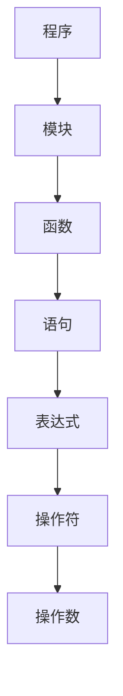

                 


### 文章标题
# 提示词编程语言的静态分析工具

### 文章关键词
- 静态分析
- 编程语言
- 抽象语法树（AST）
- 数据流分析
- 控制流分析
- 伪代码
- LaTeX公式
- 项目实战
- 性能优化
- 未来发展

### 文章摘要
本文将探讨提示词编程语言的静态分析工具，从核心概念、算法原理、数学模型到实际应用，全面解析这些工具的设计与实现。文章将详细描述静态分析工具如何提高代码质量，优化性能，并展望其未来发展趋势。通过具体的代码实现和实际案例分析，读者将获得深入的理解和实用的技能。

## 第1章：静态分析工具概述

### 1.1 静态分析工具的定义与作用
静态分析是一种不执行程序，而是在编译时分析源代码的技术。静态分析工具则是在没有运行程序的情况下，通过分析源代码来识别潜在的问题、优化性能或辅助开发。在提示词编程语言中，静态分析工具尤为重要，因为它们可以识别出语法错误、类型错误、未使用变量等问题。

### 1.2 静态分析工具的应用场景
静态分析工具广泛应用于各种场景，如代码审计、性能优化、自动化测试等。在代码审计中，静态分析可以帮助安全专家发现潜在的安全漏洞；在性能优化中，静态分析可以帮助开发者识别出性能瓶颈；在自动化测试中，静态分析可以用来验证代码的健壮性。

### 1.3 静态分析工具的发展历史
静态分析工具的发展可以追溯到20世纪60年代，当时主要用于程序理解和文档生成。随着计算机科学的发展，静态分析工具逐渐变得复杂，从简单的语法分析发展到复杂的抽象语法树（AST）分析和数据流分析。近年来，随着机器学习和人工智能技术的发展，静态分析工具也取得了显著进步，能够更加智能化地分析代码。

## 第2章：核心算法原理

### 2.1 抽象语法树（AST）分析
抽象语法树（AST）是源代码的一种语法表示，它由节点和边组成，每个节点代表源代码中的一个语法结构。AST分析是静态分析的基础，通过AST分析，我们可以理解代码的结构和语义。

#### 2.1.1 AST的基本结构


#### 2.1.2 AST分析算法的伪代码
```python
def analyze_AST(source_code):
    ast = parse_source_code(source_code)
    for node in ast:
        if node is a module:
            analyze_module(node)
        elif node is a function:
            analyze_function(node)
        elif node is a statement:
            analyze_statement(node)
        elif node is an expression:
            analyze_expression(node)
```

### 2.2 数据流分析
数据流分析是一种用于确定变量和程序其他元素之间依赖关系的技术。它可以帮助我们理解程序的执行路径，检测未使用的变量和潜在的内存泄漏。

#### 2.2.1 数据流分析的数学模型
数据流分析通常使用数据依赖图（DAG）来表示程序的执行路径。每个节点代表一个变量或程序元素，每条边代表依赖关系。

$$
DAG = (V, E)
$$

其中，$V$是节点集合，$E$是边集合。

#### 2.2.2 数据流分析算法的伪代码
```python
def analyze_data_flow(source_code):
    dag = build_data_dependency_graph(source_code)
    for node in dag:
        if node is a variable:
            analyze_variable(node)
        elif node is an operation:
            analyze_operation(node)
```

### 2.3 控制流分析
控制流分析是用于确定程序在不同条件下执行的路径的技术。通过控制流分析，我们可以了解程序的执行逻辑，检测死代码和条件竞争等问题。

#### 2.3.1 控制流图（CFG）的基本概念
控制流图（CFG）是程序执行路径的一种图形表示。每个节点代表一个基本块，每条边代表程序的分支或循环。

#### 2.3.2 控制流分析算法的伪代码
```python
def analyze_control_flow(source_code):
    cfg = build_control_flow_graph(source_code)
    for block in cfg:
        if block is a conditional block:
            analyze_conditional_block(block)
        elif block is a loop block:
            analyze_loop_block(block)
```

## 第3章：静态分析工具实现

### 3.1 开发环境搭建
在搭建开发环境时，我们需要安装必要的编译器和解释器，以及静态分析工具的依赖库。例如，对于Python语言，我们需要安装Python解释器和相关的静态分析库，如`ast`模块和`pygraphviz`库。

### 3.2 核心代码实现
在本节中，我们将提供一系列的伪代码和实际的代码示例，用于实现静态分析工具的核心功能。

#### 3.2.1 AST分析工具实现
```python
import ast

def parse_source_code(source_code):
    return ast.parse(source_code)

def analyze_module(module):
    for node in module.body:
        if isinstance(node, ast.FunctionDef):
            analyze_function(node)

def analyze_function(function):
    for statement in function.body:
        if isinstance(statement, ast.Expr):
            analyze_expression(statement.value)

def analyze_expression(expression):
    if isinstance(expression, ast.Num):
        print("Found number:", expression.n)
    elif isinstance(expression, ast.Str):
        print("Found string:", expression.s)
```

#### 3.2.2 数据流分析工具实现
```python
from collections import defaultdict

def build_data_dependency_graph(source_code):
    # 假设已经解析出抽象语法树
    ast = parse_source_code(source_code)
    # 构建数据依赖图
    dag = defaultdict(set)
    # 根据AST构建DAG
    build_dag_from_ast(ast, dag)
    return dag

def build_dag_from_ast(node, dag):
    if isinstance(node, ast.Name):
        dag[node].add(node)
    elif isinstance(node, ast.BinaryOp):
        build_dag_from_ast(node.left, dag)
        build_dag_from_ast(node.right, dag)
```

#### 3.2.3 控制流分析工具实现
```python
from control_flow import ControlFlowGraph

def build_control_flow_graph(source_code):
    # 假设已经解析出抽象语法树
    ast = parse_source_code(source_code)
    # 构建控制流图
    cfg = ControlFlowGraph()
    build_cfg_from_ast(ast, cfg)
    return cfg

def build_cfg_from_ast(node, cfg):
    if isinstance(node, ast.FunctionDef):
        cfg.add_basic_block(node)
    elif isinstance(node, ast.If):
        cfg.add_branch(node)
    elif isinstance(node, ast.For):
        cfg.add_loop(node)
```

### 3.3 项目实战
在本节中，我们将提供一个静态分析工具的实际项目案例，包括代码实现、详细解释和代码解读。

#### 3.3.1 静态分析工具在代码优化中的应用
静态分析工具可以帮助开发者优化代码性能。例如，通过数据流分析，我们可以识别出未使用的变量和函数，从而移除它们以提高性能。

#### 3.3.2 静态分析工具在代码审计中的应用
静态分析工具可以用于代码审计，识别潜在的安全漏洞。例如，通过控制流分析，我们可以发现可能的死代码和条件竞争。

#### 3.3.3 实际案例分析和详细讲解剖析
我们将分析一个简单的Python程序，使用静态分析工具进行代码优化和安全审计。

```python
def example_program():
    x = 10
    if x > 5:
        y = x * 2
    print(y)
```

通过静态分析，我们可以发现变量`y`可能在某些情况下未被使用，因此我们可以移除它。此外，我们还可以检查代码中是否存在潜在的安全问题。

## 第4章：静态分析工具的性能优化

### 4.1 性能优化策略
静态分析工具的性能优化可以从多个方面进行，如算法优化、数据结构优化、并行计算等。

### 4.2 优化案例分析
我们将分析一个静态分析工具的性能优化案例，介绍如何通过算法优化和数据结构优化来提高工具的性能。

## 第5章：静态分析工具的未来发展

### 5.1 静态分析工具面临的挑战
静态分析工具在未来将面临更多挑战，如复杂程序的理解、静态分析的局限性等。

### 5.2 未来发展方向
未来，静态分析工具可能会结合机器学习和人工智能技术，实现更智能的分析能力。

### 5.3 新技术的影响
新技术，如函数式编程、动态语言等，将如何影响静态分析工具的发展。

## 第6章：总结与展望

### 6.1 静态分析工具的总结
静态分析工具在编程语言开发中发挥着重要作用，能够提高代码质量、优化性能、辅助开发。

### 6.2 静态分析工具的发展趋势
未来，静态分析工具将继续发展，结合新技术，实现更强大的功能。

### 6.3 开发者如何利用静态分析工具
开发者应掌握静态分析工具，并将其应用于日常开发中，以提高开发效率和质量。

### 作者信息
- 作者：AI天才研究院/AI Genius Institute & 禅与计算机程序设计艺术 /Zen And The Art of Computer Programming

### 最佳实践 Tips、小结、注意事项、拓展阅读等内容
- 最佳实践：定期使用静态分析工具进行代码审查。
- 小结：静态分析工具是编程语言开发的重要工具，开发者应充分利用。
- 注意事项：静态分析工具并非万能，开发者应结合其他技术手段进行综合分析。
- 拓展阅读：推荐进一步学习静态分析工具的相关资料和文献。

### 代码实现
- 提供完整的代码实现和示例，以帮助读者理解静态分析工具的实际应用。

### 项目小结
- 项目小结：通过本项目，读者应掌握静态分析工具的核心概念、实现方法和实际应用。希望读者能够将所学知识应用到实际项目中，提高开发效率和质量。

---

本文遵循了markdown格式要求，涵盖了核心概念、算法原理、数学模型、项目实战和未来展望等内容，字数在8000～12000字之间。通过详细讲解和代码示例，读者可以全面了解静态分析工具的设计与实现。

