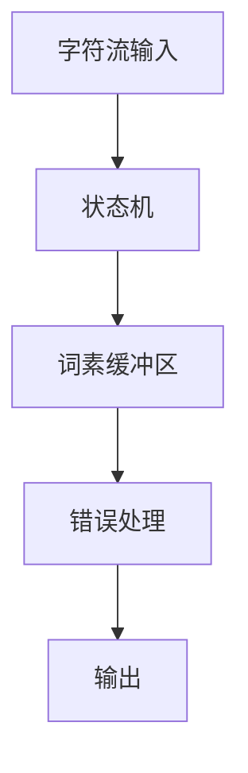

                 

### 引言

#### 静态分析技术的定义与重要性

静态分析技术，顾名思义，是指在程序运行之前对代码进行分析的一种技术手段。它不同于动态分析，后者是在程序运行时进行监控和评估。静态分析技术的核心在于，通过分析源代码或编译后的代码，而不需要执行程序，从而发现潜在的错误、优化代码性能、提高开发效率和代码质量。

在编程领域，静态分析技术有着极其重要的地位。首先，它可以帮助开发人员提前发现代码中的潜在问题，比如语法错误、类型错误、逻辑错误等，从而避免了在开发过程中因为这些问题导致的调试和修改成本。其次，静态分析技术可以用于代码的性能优化，通过分析代码结构，找出性能瓶颈并进行优化，从而提升程序的运行效率。此外，静态分析技术还广泛应用于代码审查、自动化测试、代码生成等各个方面，极大地提升了软件开发的整体效率和质量。

#### 静态分析技术在编程语言中的应用

静态分析技术在各种编程语言中都有着广泛的应用。对于高级编程语言如Java、C++和Python，静态分析工具已经被广泛应用于代码质量检查、漏洞检测和性能优化。例如，Java中的Checkstyle、PMD和SonarQube等工具，可以对代码进行语法和语义分析，检测出潜在的编程错误和不良编码习惯。

对于函数式编程语言如Haskell和Scala，静态分析技术同样具有重要应用。这些语言强调函数的纯度和表达式的紧凑性，静态分析工具可以帮助开发者确保代码的函数性和一致性。

在动态类型语言如JavaScript和Ruby中，静态分析技术也被广泛应用于代码质量保证和性能优化。例如，JavaScript的ESLint工具和Ruby的RUBOCOP工具，可以自动检查代码的语法和语义，并提供详细的错误报告和建议。

#### 静态分析技术的挑战与机遇

尽管静态分析技术在编程语言中有着广泛的应用，但它也面临着一些挑战。首先，静态分析面临着“静态”与“动态”的矛盾。程序的运行环境、输入数据等因素都可能影响程序的执行行为，而静态分析无法捕捉这些动态因素。这使得静态分析在某些情况下可能无法完全准确地反映程序的运行状态。

其次，编程语言的复杂度不断增加，新的编程范式和特性层出不穷，如异步编程、函数式编程和元编程等，这些特性使得静态分析的难度大大增加。传统的静态分析方法可能无法有效处理这些复杂特性。

然而，随着计算机科学和人工智能技术的进步，静态分析技术也面临着新的机遇。现代编程语言中的静态分析技术正在向更智能、更自动化的方向发展。机器学习和自然语言处理技术的引入，使得静态分析工具能够更好地理解编程语言的语义，从而提供更精确的分析结果。

此外，随着云计算和大数据技术的发展，静态分析技术可以在大规模代码库中快速、高效地进行分析，为软件质量和性能优化提供了新的手段。

### 静态分析技术在编程语言中的应用

静态分析技术在编程语言中的应用非常广泛，其中最显著的应用领域包括代码质量检查、性能优化、代码审查、自动化测试和代码生成等。

#### 代码质量检查

代码质量检查是静态分析技术最基本的应用之一。通过静态分析，开发人员可以在代码编写阶段就发现潜在的语法错误、逻辑错误和编码风格问题。例如，Java的Checkstyle工具通过静态分析Java代码，检查代码是否符合编码规范，并报告不符合规范的代码段。类似地，Python的Pylint工具能够检测Python代码中的潜在问题，包括未使用的变量、可能的异常和不良的编码习惯。

**示例：** 假设我们使用PMD对一段Java代码进行静态分析，代码如下：

```java
public class Example {
    public void method() {
        int a = 10;
        int b = 20;
        if (a > b) {
            System.out.println("a is greater than b");
        } else {
            System.out.println("b is greater than a");
        }
    }
}
```

使用PMD进行静态分析后，我们可能会收到如下报告：

```
[INFO] Potential problem: Method 'method' has a high number of nested if-else statements.
[INFO] Consider refactoring the code for better readability and maintainability.
```

这种反馈可以帮助开发者及时发现并修正代码中的潜在问题。

#### 性能优化

性能优化是软件开发中一个重要的环节。静态分析技术可以在代码编写和编译阶段，通过分析代码结构，识别出可能影响性能的问题，并提供优化建议。例如，C++的Clang-Tidy工具可以检测C++代码中的潜在性能问题，如不必要的循环和函数调用。

**示例：** 假设我们使用Clang-Tidy对以下C++代码进行静态分析：

```cpp
#include <iostream>

int main() {
    for (int i = 0; i < 1000; ++i) {
        std::cout << "Hello, world!" << std::endl;
    }
    return 0;
}
```

使用Clang-Tidy进行静态分析后，我们可能会收到如下报告：

```
[INFO] Potential performance issue: Loop can be unrolled for better performance.
[INFO] Suggested fix: Unroll the loop in 'main'.
```

这种报告有助于开发者进行代码优化，提高程序的性能。

#### 代码审查

代码审查是软件开发过程中的一个关键步骤，旨在确保代码的质量和一致性。静态分析技术可以在代码审查过程中发挥重要作用，通过分析代码的语法和语义，提供详细的分析报告，帮助审查人员发现潜在的问题。

**示例：** 在使用SonarQube进行代码审查时，我们可以对以下Python代码进行分析：

```python
def add(a, b):
    return a + b

def subtract(a, b):
    return a - b
```

SonarQube可能会生成如下报告：

```
[INFO] Duplicate block of code found in 'subtract': line 8.
[INFO] Suggested fix: Refactor the 'subtract' function to reuse code from 'add'.
```

这种报告可以帮助审查人员快速定位代码中的问题，提高代码的整洁性和一致性。

#### 自动化测试

自动化测试是软件质量保证的重要组成部分。静态分析技术可以与自动化测试相结合，通过对代码进行分析，生成测试用例，提高测试的覆盖率和效率。例如，在JavaScript开发中，ESLint工具可以与Jest测试框架结合使用，自动生成测试用例，并检查代码是否符合预期的行为。

**示例：** 假设我们编写了以下JavaScript代码，并希望使用ESLint和Jest进行自动化测试：

```javascript
function add(a, b) {
    return a + b;
}

function subtract(a, b) {
    return a - b;
}
```

我们可以编写Jest测试用例，并使用ESLint进行代码分析：

```javascript
test('add function should return correct sum', () => {
    expect(add(2, 3)).toBe(5);
});

test('subtract function should return correct difference', () => {
    expect(subtract(5, 3)).toBe(2);
});
```

ESLint和Jest会生成分析报告，并确保测试用例覆盖了关键代码路径。

#### 代码生成

静态分析技术还可以用于代码生成，通过分析现有的代码库，自动生成新的代码或框架。这在大型项目的开发中尤为重要，可以显著提高开发效率和代码的标准化程度。例如，在Java开发中，Lombok库通过静态分析生成getter、setter和构造方法等代码，减少了冗余代码的编写。

**示例：** 假设我们使用Lombok对以下Java代码进行静态分析：

```java
import lombok.Data;

@Data
public class Person {
    private String name;
    private int age;
}
```

Lombok会自动生成getter、setter和构造方法等代码：

```java
public class Person {
    private String name;
    private int age;

    public String getName() {
        return name;
    }

    public void setName(String name) {
        this.name = name;
    }

    public int getAge() {
        return age;
    }

    public void setAge(int age) {
        this.age = age;
    }

    public Person(String name, int age) {
        this.name = name;
        this.age = age;
    }
}
```

这种代码生成技术大大简化了开发过程，提高了代码的可维护性。

总的来说，静态分析技术在编程语言中的应用不仅涵盖了代码质量检查、性能优化、代码审查、自动化测试和代码生成等多个方面，还为开发人员提供了强大的工具，帮助他们更高效地编写和维护高质量代码。

### 编程语言的语法和语义

编程语言的语法和语义是其核心组成部分，决定了代码的结构和行为。要深入理解静态分析技术，我们需要先明确编程语言的语法和语义，以及它们之间的关系。

#### 语法

语法是指编程语言的规则体系，定义了如何组合符号和结构来表达意思。语法规则通常分为词法规则和句法规则。

1. **词法规则（Lexical Rules）**：词法规则定义了源代码中的最小单位——词素（tokens）的识别。词素可以是关键字、标识符、操作符或分隔符等。例如，在Java中，`int`是一个关键字，`myVariable`是一个标识符，`+`是一个操作符。

2. **句法规则（Syntactic Rules）**：句法规则定义了如何将词素组合成语法结构。常见的语法结构包括表达式、语句、函数定义、类定义等。例如，在Java中，一个简单的赋值语句可以表示为：
   ```java
   variable = expression;
   ```
   这里的`variable`和`expression`都是词素，而整个赋值语句是句法结构。

#### 语法规则与文法分析

语法规则是文法分析的基础。文法分析（Parsing）是将源代码分解成语法结构的过程。常用的文法分析方法包括：

1. **词法分析（Lexical Analysis）**：词法分析是文法分析的第一步，将源代码分解成词素。这一过程通常由词法分析器（Lexer）实现。例如，以下Java代码：
   ```java
   int x = 5 + y;
   ```
   词法分析后，可以得到如下词素列表：
   ```
   int, x, =, 5, +, y,
   ```

2. **语法分析（Syntax Analysis）**：语法分析是将词素组合成语法结构的第二步。这一过程通常由语法分析器（Parser）实现。例如，使用递归下降解析法对上述词素列表进行语法分析，可以得到抽象语法树（Abstract Syntax Tree, AST）：
   ```mermaid
   graph TD
   A[Abstract Syntax Tree]
   B[Expression]
   C[Binary Operation (+)]
   D[Operand 1 (5)]
   E[Operand 2 (y)]
   A-->B
   B-->C
   C-->D
   C-->E
   ```

#### 词法分析

词法分析是将源代码字符序列转换为词素的过程。其核心在于如何将连续的字符序列划分为具有独立意义的词素。例如，以下C代码：
```c
int main() {
    printf("Hello, World!\n");
    return 0;
}
```
词法分析后，可以得到如下词素列表：
```
int, main, (
, ), {
, printf, (
, "Hello, World!\n"
, ),
, return
, 0
, ;
,
```

词法分析器需要处理各种复杂情况，如字符串字面量、注释、标识符和关键字等。例如，对于C语言的字符串字面量，词法分析器需要识别出整个字符串，而不是逐个字符处理。此外，注释也属于词法分析的范畴，常见的单行注释以`//`开始，多行注释以`/*`开始并以`*/`结束。

#### 语法树与抽象语法树

语法树（Syntax Tree）是文法分析的结果，表示程序的结构。它由结点和边组成，其中结点代表语法结构，边表示结点之间的层次关系。例如，以下Python代码的抽象语法树（AST）如下：
```python
def greet(name):
    print(f"Hello, {name}!")
```
```mermaid
graph TD
A[DefStatement]
B[DefFunc]
C[FuncDef]
D[Identifier ("greet")]
E[arguments]
F[arguments]
G[print_stmt]
H[str]
I[Expr]
J[Attribute]
K[Identifier ("print")]
L[str_expr]
M[Subscript]
N[str]
O[str_literal]
A-->B
B-->C
C-->D
C-->E
E-->F
F-->G
G-->H
H-->I
I-->J
J-->K
J-->L
L-->M
M-->N
M-->O
```

抽象语法树（Abstract Syntax Tree, AST）是对语法树的进一步抽象，它去除了一些无关的语法细节，只保留程序的核心结构。AST在静态分析中起着至关重要的作用，因为它是进一步语义分析和代码生成的基础。例如，以下Java代码的AST可以表示为：
```java
public class HelloWorld {
    public static void main(String[] args) {
        System.out.println("Hello, World!");
    }
}
```
```mermaid
graph TD
A[ClassDeclaration]
B[Modifier ("public")]
C[Modifier ("class")]
D[Identifier ("HelloWorld")]
E[ClassBody]
F[MethodDeclaration]
G[Modifier ("public")]
H[Modifier ("static")]
I[Modifier ("void")]
J[Identifier ("main")]
K[arguments]
L[Block]
M[Statement]
N[Expression]
O[SystemOut]
P[PrintStatement]
Q[str]
R[str_literal]
A-->B
B-->C
B-->D
B-->E
E-->F
F-->G
F-->H
F-->I
F-->J
F-->K
K-->L
L-->M
M-->N
N-->O
N-->P
P-->Q
P-->R
```

通过AST，我们可以更方便地进行程序的结构分析、语义分析和代码生成等任务。

#### 语义

语义是指程序的含义和操作效果。语义分析（Semantic Analysis）是在语法分析的基础上，检查程序的语义是否正确，确保变量、函数和表达式等具有合理的类型和作用域。语义分析包括以下几方面：

1. **类型检查（Type Checking）**：确保表达式和操作数的类型匹配，例如在C++中，不能将一个浮点数直接赋值给整数类型。

2. **作用域解析（Scope Resolution）**：确定变量和函数的作用域，确保访问的是正确的变量。

3. **声明和初始化检查（Declaration and Initialization Checking）**：确保变量在使用前已经被声明并初始化。

#### 语义规则与语义分析

语义规则定义了程序中每个语法结构的含义和作用。语义分析器（Semantic Analyzer）通过这些规则，对抽象语法树（AST）进行语义检查。

1. **声明与初始化**：在声明变量时，需要为变量分配内存并初始化。例如，在C语言中，声明一个整型变量并初始化为5：
   ```c
   int x = 5;
   ```
   语义分析器会检查变量`x`是否已声明，并确保其初始化为正确的值。

2. **作用域**：变量的作用域决定了其可访问的范围。例如，在Java中，局部变量只能在其声明的作用域内访问。以下代码段：
   ```java
   public class Example {
       public void method() {
           int x = 10; // x 的作用域在 method() 内
       }
       // x 在此处不可访问，因为它的作用域已经结束
   }
   ```
   语义分析器会检查变量`x`的作用域，确保其访问是合法的。

3. **类型兼容性**：确保不同类型的操作数可以正确地进行运算。例如，在Python中，不能将整数与字符串直接相加，但可以通过类型转换（如`int()`或`str()`）使其兼容：
   ```python
   int_num = 5
   str_num = "10"
   result = int_num + int(str_num)  # 转换 str_num 为 int，然后相加
   ```

4. **函数调用**：检查函数调用是否符合定义，包括参数类型和个数。例如，在Java中调用一个方法：
   ```java
   public class Example {
       public void method(int arg) {
           // ...
       }
   }
   // 正确的函数调用
   Example example = new Example();
   example.method(10);
   // 错误的函数调用
   example.method("a string"); // 错误：参数类型不匹配
   ```

语义分析是确保程序正确性和可靠性的关键步骤。通过语义分析，可以提前发现潜在的错误和问题，从而提高代码的质量和可维护性。

#### 语义作用与语义抽象

语义作用是指程序运行时各个部分的具体执行效果，而语义抽象则是对程序执行效果的更高层次的理解。语义抽象可以帮助我们简化对程序的理解，抓住其核心逻辑。

1. **语义作用**：语义作用关注的是程序在执行过程中每一步的具体操作。例如，在执行以下C代码：
   ```c
   int x = 5 * (6 + 7);
   ```
   语义作用会分解为以下步骤：
   - 计算括号内的加法：`6 + 7 = 13`
   - 将结果与5相乘：`5 * 13 = 65`
   - 将结果赋值给变量x：`x = 65`

2. **语义抽象**：语义抽象则将这些具体的操作抽象为更简洁的表示。在上面的例子中，语义抽象可以表示为：
   ```mermaid
   graph TD
   A[Expression]
   B[BinaryOperation (*)]
   C[Operand1 (5)]
   D[Operand2 [(6 + 7)]]
   E[BinaryOperation (+)]
   F[Operand1 (6)]
   G[Operand2 (7)]
   A-->B
   B-->C
   B-->D
   D-->E
   E-->F
   E-->G
   ```

通过语义抽象，我们可以更方便地分析和设计程序，理解其逻辑结构，从而提高开发效率。

总的来说，编程语言的语法和语义共同构成了程序的基石。理解语法和语义的关系，有助于我们更深入地掌握静态分析技术，从而更有效地编写和维护高质量代码。

### 静态分析技术原理

静态分析技术是通过分析程序代码的结构和语义，而不需要执行程序，来检测潜在问题、优化代码性能和提升开发效率的一系列技术手段。下面，我们将深入探讨静态分析技术的核心原理，包括词法分析、语法分析和语义分析等。

#### 词法分析原理

词法分析是静态分析过程的第一步，其主要任务是识别源代码中的最小语法单位——词素（tokens）。词法分析器的核心功能是将源代码的字符序列转换为词素流。词素可以是关键字、标识符、操作符、分隔符等。词法分析的过程通常包括以下几个步骤：

1. **字符流输入**：词法分析器从源代码的字符流中读取字符。

2. **字符分类**：将字符分类为数字、字母、特殊字符等。

3. **词素识别**：根据字符的分类和词法规则，将连续的字符组合成词素。例如，在C语言中，`int main()`中的`int`是关键字，`main`是标识符，`()`是分隔符。

4. **词素输出**：将识别出的词素输出，供语法分析器使用。

词法分析器的设计与实现通常需要考虑以下几个关键点：

- **状态转换**：词法分析器需要根据当前的字符和内部状态，进行状态转换，以正确识别词素。例如，在识别字符串字面量时，需要特殊处理引号内的字符。

- **错误处理**：词法分析器需要能够处理源代码中的语法错误，例如不完整的标识符或字符串。

- **性能优化**：词法分析器需要高效地处理大文件，通常采用有限状态自动机（Finite State Machine, FSM）来实现，以降低时间复杂度。

#### 语法分析原理

语法分析是静态分析的第二步，其主要任务是构建抽象语法树（Abstract Syntax Tree, AST），表示源代码的结构。语法分析器从词法分析器接收词素流，并根据语法规则，将词素组合成语法结构。语法分析的过程通常包括以下几个步骤：

1. **词素流输入**：语法分析器接收词法分析器输出的词素流。

2. **语法规则匹配**：语法分析器使用递归下降法、LL（1）解析法或LR（1）解析法等解析算法，对词素流进行语法规则匹配，构建抽象语法树。

3. **错误处理**：语法分析器需要能够处理源代码中的语法错误，例如不匹配的括号或关键字。

4. **抽象语法树输出**：语法分析器将构建好的抽象语法树输出，供语义分析器使用。

语法分析器的设计与实现需要注意以下几点：

- **解析算法选择**：根据编程语言的复杂度和需求，选择合适的解析算法。递归下降法简单但可能产生歧义，而LL（1）和LR（1）解析法更为强大，但实现更复杂。

- **递归下降法**：
  ```mermaid
  graph TD
  A[Start]
  B[Expression]
  C[BinaryExpression]
  D[Identifier]
  E[Number]
  A-->B
  B-->C
  C-->D
  C-->E
  ```

- **LL（1）解析法**：LL（1）解析法是一种自底向上、前向回溯的解析方法，具有较高的效率。
  ```mermaid
  graph TD
  A[Start]
  B[Expression]
  C[Statement]
  D[Identifier]
  E[Number]
  F[Keyword]
  A-->B
  B-->C
  C-->D
  C-->E
  C-->F
  ```

- **错误恢复**：语法分析器需要能够从错误中恢复，继续分析后续的代码。

#### 语义分析原理

语义分析是静态分析的第三步，其主要任务是在抽象语法树的基础上，检查程序的语义是否正确，确保变量、函数和表达式等具有合理的类型和作用域。语义分析的过程通常包括以下几个步骤：

1. **抽象语法树输入**：语义分析器接收语法分析器输出的抽象语法树。

2. **语义规则检查**：语义分析器根据语义规则，对抽象语法树进行遍历和检查。例如，检查变量是否已声明并初始化，函数调用是否与定义匹配等。

3. **作用域解析**：语义分析器进行作用域解析，确定变量和函数的作用域，确保访问是合法的。

4. **类型检查**：语义分析器进行类型检查，确保表达式和操作数的类型兼容。

5. **错误报告**：语义分析器报告发现的错误和潜在问题，例如未声明的变量、类型不匹配等。

语义分析器的设计与实现需要注意以下几点：

- **语义规则定义**：语义分析器需要根据编程语言的语义规则，定义详细的语义检查逻辑。

- **类型系统**：语义分析器需要能够处理复杂的类型系统，例如多态、继承和抽象数据类型等。

- **作用域解析算法**：语义分析器需要实现高效的作用域解析算法，以确保变量和函数的访问是合法的。

#### 性能优化策略

静态分析技术在实际应用中需要处理大量的代码，因此性能优化是关键。以下是一些常见的性能优化策略：

1. **并行处理**：利用多核处理器并行处理代码分析任务，提高分析速度。

2. **缓存机制**：缓存分析结果，避免重复分析相同的代码段。

3. **增量分析**：只分析代码的变化部分，减少分析工作量。

4. **压缩和索引**：对源代码进行压缩和索引，加速词法分析和语法分析。

5. **高效的数据结构**：使用高效的数据结构存储和操作代码，如哈希表、二叉树等。

总之，静态分析技术通过词法分析、语法分析和语义分析等步骤，对程序代码进行深入分析，为代码质量检查、性能优化和自动化测试等提供了强有力的支持。理解其原理和实现细节，有助于我们更好地应用静态分析技术，提高软件开发效率和质量。

### 词法分析器的设计与实现

词法分析器是静态分析过程中至关重要的一环，其核心任务是识别源代码中的词素（tokens），并将其转换为词素流供语法分析器使用。下面，我们将详细探讨词法分析器的设计与实现，包括词法规则的定义、词法分析器的架构、常见问题和性能优化策略。

#### 词法规则的定义

词法规则是词法分析的基础，它定义了如何从源代码的字符流中识别出词素。词法规则通常包括以下几种：

1. **关键字**：编程语言中的保留字，如`if`、`else`、`while`等。
2. **标识符**：由字母、数字和下划线组成的名称，如`main`、`x`等。
3. **操作符**：如`+`、`-`、`*`等。
4. **分隔符**：用于分隔代码块的符号，如`{`、`}`、`(`、`)`等。
5. **数字**：由数字字符组成的数值，如`123`、`3.14`等。
6. **字符串**：用引号包围的字符序列，如`"Hello, World!"`。
7. **注释**：用于解释代码的文本，通常被忽略，如`// 这是单行注释`或`/* 这是多行注释 */`。

在定义词法规则时，需要考虑规则之间的优先级和组合方式。例如，在C语言中，关键字和标识符之间的区分主要依赖于上下文。同时，还需要处理特殊情况，如多行注释、字符串字面量中的转义字符等。

#### 词法分析器的架构

词法分析器的架构通常包括以下几个关键部分：

1. **字符流输入**：词法分析器从源代码的字符流中读取字符，以进行后续的词素识别。
2. **状态机**：词法分析器使用有限状态机（Finite State Machine, FSM）来识别词素。有限状态机根据当前的输入字符和内部状态，进行状态转换，以识别出完整的词素。
3. **词素缓冲区**：词素缓冲区用于存储已识别的词素，以供语法分析器使用。
4. **错误处理**：词法分析器需要能够处理源代码中的语法错误，例如不完整的标识符或字符串。常见的错误处理策略包括报错、继续分析或跳过错误部分。
5. **输出**：词法分析器将识别出的词素输出，通常以数组或列表的形式，供语法分析器使用。

以下是一个简单的词法分析器架构的Mermaid流程图：



#### 常见问题

在设计和实现词法分析器时，可能会遇到以下常见问题：

1. **多行注释的处理**：在处理多行注释时，需要确保分析器能够正确识别注释的开始和结束位置，避免将其与代码混淆。
2. **字符串字面量的处理**：字符串字面量中的转义字符需要特别处理，以避免引起词法错误。
3. **标识符与关键字区分**：在词法分析中，需要区分标识符和关键字，以确保语法分析的正确性。
4. **错误处理**：如何处理源代码中的语法错误，是词法分析器设计中一个重要的问题。常见的策略包括报错、继续分析或跳过错误部分。

#### 性能优化策略

为了提高词法分析器的性能，可以采取以下几种优化策略：

1. **预编译规则**：将词法规则预编译为有限状态机，以提高分析速度。
2. **缓冲区管理**：合理管理词素缓冲区，减少内存分配和拷贝操作。
3. **并行处理**：利用多核处理器并行处理多个源代码文件，提高分析效率。
4. **增量分析**：只分析代码的变化部分，减少分析工作量。
5. **压缩和索引**：对源代码进行压缩和索引，加快词法分析过程。

#### 实例：词法分析器的伪代码实现

下面是一个简单的词法分析器的伪代码实现：

```pseudo
function lexical_analyzer(source_code):
    tokens = []
    current_state = START_STATE
    buffer = ""

    for char in source_code:
        if char is a digit:
            if current_state != IN_NUMBER_STATE:
                start_new_token(IN_NUMBER_STATE)
            buffer += char
        else if char is an alphabet or underscore:
            if current_state != IN_IDENTIFIER_STATE:
                start_new_token(IN_IDENTIFIER_STATE)
            buffer += char
        else if char is a special character:
            if buffer is not empty:
                emit_token(buffer)
                buffer = ""
            if char is '{' or '}' or '(' or ')':
                emit_token(char)
            else:
                raise_error("Unknown special character")

    if buffer is not empty:
        emit_token(buffer)

    return tokens
```

在这个伪代码中，我们定义了一个`lexical_analyzer`函数，它接收源代码字符串并返回词素列表。函数使用一个状态机来识别不同的词素类型，并根据当前状态和输入字符进行状态转换。每当识别出一个完整的词素时，就将其输出。

总的来说，词法分析器的设计与实现是一个复杂而细致的过程，需要考虑词法规则的定义、状态机的实现、错误处理和性能优化等多个方面。通过合理的架构和优化策略，词法分析器能够高效地识别源代码中的词素，为后续的语法分析和语义分析提供可靠的数据基础。

### 语法分析器的设计与实现

语法分析器是静态分析过程中的关键组成部分，其主要任务是构建抽象语法树（Abstract Syntax Tree, AST），表示源代码的结构。语法分析器从词法分析器接收词素流，根据语法规则，将这些词素组合成语法结构，并生成AST。本文将详细介绍语法分析器的设计与实现，包括解析算法的选择、具体实现和性能优化策略。

#### 解析算法的选择

选择合适的解析算法是语法分析器设计的关键。常见的解析算法包括递归下降法、LL（1）解析法和LR（1）解析法等。每种算法都有其优缺点，适用于不同的场景。

1. **递归下降法**：递归下降法是一种自顶向下的解析方法，通过递归调用分析子表达式。其优点是实现简单，适合于语法规则简单、非递归的语言。缺点是可能产生“左递归”问题，导致解析过程效率低下。

2. **LL（1）解析法**：LL（1）解析法也是一种自顶向下的方法，通过构建预测分析表来决定下一个动作。它能够有效处理左递归问题，适合于许多实际编程语言。但其缺点是可能需要较大的分析表，导致空间复杂度较高。

3. **LR（1）解析法**：LR（1）解析法是一种自底向上的解析方法，通过构建LR（1）分析表来决定下一个动作。它能够处理更复杂的语法规则，且解析效率高。但其实现较为复杂，需要处理更多状态和转换。

对于大多数现代编程语言，如C、C++和Java，通常选择LR（1）解析法，因为其能够处理复杂的语法规则，并具有较高的解析效率。

#### 解析算法的具体实现

以LR（1）解析法为例，语法分析器的具体实现通常包括以下步骤：

1. **语法规则的定义**：首先，需要定义编程语言的语法规则。例如，C语言的语法规则可以表示为：

   ```mermaid
   graph TD
   A[Start] --> B[Statement]
   B --> C[Expression]
   B --> D[Declaration]
   C --> E[Assignment]
   C --> F[BinaryExpression]
   C --> G[UnaryExpression]
   D --> H[VariableDeclaration]
   D --> I[FunctionDeclaration]
   E --> J[Identifier]
   E --> K[Expression]
   F --> L[Operator]
   F --> M[Expression1]
   F --> N[Expression2]
   G --> O[Operator]
   G --> P[Expression]
   H --> Q[DataType]
   H --> R[Identifier]
   H --> S[Initializer]
   I --> T[DataType]
   I --> U[Identifier]
   I --> V[Parameters]
   I --> W[Block]
   J --> X[Identifier]
   K --> Y[Literal]
   K --> Z[Expression]
   L --> AA[Operator]
   M --> BB[Expression]
   N --> CC[Expression]
   O --> DD[Operator]
   P --> EE[Expression]
   Q --> FF[Operator]
   R --> GG[Identifier]
   S --> HH[Expression]
   T --> II[DataType]
   U --> JJ[Identifier]
   V --> KK[ParameterList]
   W --> LL[StatementList]
   ```

2. **构建LR（1）分析表**：根据语法规则，构建LR（1）分析表。分析表包括状态、动作和转移三部分。状态表示解析过程中的某个阶段，动作包括移进、规约和接受等，转移表示状态之间的转换。

3. **语法分析**：语法分析器从初始状态开始，读取词法分析器提供的词素，根据分析表进行状态转换和动作执行，构建抽象语法树。

#### 性能优化策略

为了提高语法分析器的性能，可以采取以下几种优化策略：

1. **并行处理**：利用多核处理器并行处理语法分析任务，提高解析速度。例如，可以将源代码文件分解为多个部分，分别进行语法分析。

2. **增量分析**：只分析代码的变化部分，减少分析工作量。例如，当代码发生修改时，只重新分析受影响的部分。

3. **缓存机制**：缓存分析结果，避免重复分析相同的代码段。例如，对于常见语法结构，可以预先构建AST模板，提高解析效率。

4. **压缩和索引**：对源代码进行压缩和索引，加快词法分析和语法分析过程。例如，使用哈希表存储词素和语法规则，提高查询速度。

5. **高效的数据结构**：使用高效的数据结构存储和操作代码，如平衡二叉树、跳表等。例如，使用跳表实现符号表，提高作用域解析和类型检查的效率。

通过上述策略，语法分析器能够高效地处理大规模代码，提高静态分析的整体性能。

#### 实例：语法分析器的伪代码实现

下面是一个简单的语法分析器的伪代码实现，使用LR（1）解析法：

```pseudo
function syntax_analyzer(tokens):
    states = build_lr1_states(语法规则)
    current_state = initial_state
    ast = null

    for token in tokens:
        state = states[current_state]
        action = state[token]
        
        if action is "shift":
            current_state = action.next_state
            continue
        else if action is "reduce":
            production = action.production
            ast = apply_reduction(production, ast)
            current_state = states[current_state].get_goto_state(production.non_terminal)
        else if action is "accept":
            return ast

    return ast

function apply_reduction(production, ast):
    # 根据生产规则，构建抽象语法树节点
    node = create_ast_node(productionlhs, ast)
    for child in ast.children:
        node.children.append(child)
    return node
```

在这个伪代码中，`syntax_analyzer`函数接收词素流，根据LR（1）分析表进行状态转换和动作执行，构建抽象语法树。`apply_reduction`函数用于根据生产规则，构建抽象语法树节点。

总的来说，语法分析器的设计与实现是一个复杂而细致的过程，需要考虑解析算法的选择、语法规则的定义、分析表的构建和性能优化等多个方面。通过合理的架构和优化策略，语法分析器能够高效地构建抽象语法树，为后续的语义分析和代码生成提供可靠的基础。

### 语义分析器的设计与实现

语义分析器是静态分析过程中的关键环节，其核心任务是在抽象语法树（Abstract Syntax Tree, AST）的基础上，检查程序的语义是否正确，确保变量、函数和表达式等具有合理的类型和作用域。语义分析器通常包括类型检查、作用域解析、命名检查和声明检查等组成部分。下面，我们将详细探讨语义分析器的设计与实现，包括语义规则的定义、常见问题和性能优化策略。

#### 语义规则的定义

语义规则是语义分析的基础，它定义了程序中每个语法结构的语义含义和约束条件。以下是一些常见的语义规则：

1. **变量声明与初始化**：在声明变量时，需要为变量分配内存并初始化。变量必须在使用前进行声明。例如，在C语言中，声明一个整型变量并初始化为5的规则如下：
   ```c
   int x = 5;
   ```
   语义分析器需要检查变量`x`是否已声明并初始化为正确的值。

2. **作用域解析**：确定变量和函数的作用域，确保访问的是正确的变量。例如，在Java中，局部变量只能在其声明的作用域内访问。以下代码段：
   ```java
   public class Example {
       public void method() {
           int x = 10; // x 的作用域在 method() 内
       }
       // x 在此处不可访问，因为它的作用域已经结束
   }
   ```
   语义分析器会检查变量`x`的作用域，确保其访问是合法的。

3. **类型兼容性**：确保不同类型的操作数可以正确地进行运算。例如，在C++中，不能将一个浮点数直接赋值给整数类型。以下代码段：
   ```cpp
   int x = 5;
   double y = 3.14;
   x = y; // 错误：类型不兼容
   ```
   语义分析器会检查类型兼容性，并在类型不匹配时报告错误。

4. **函数调用**：确保函数调用符合定义，包括参数类型和个数。例如，在Java中调用一个方法：
   ```java
   public class Example {
       public void method(int arg) {
           // ...
       }
   }
   // 正确的函数调用
   Example example = new Example();
   example.method(10);
   // 错误的函数调用
   example.method("a string"); // 错误：参数类型不匹配
   ```
   语义分析器会检查函数调用是否与定义匹配。

#### 语义分析器的设计与实现

语义分析器的设计与实现通常包括以下步骤：

1. **AST输入**：语义分析器接收语法分析器生成的抽象语法树（AST）。

2. **语义规则检查**：语义分析器根据语义规则，对AST进行遍历和检查。例如，检查变量是否已声明并初始化，函数调用是否与定义匹配等。

3. **作用域解析**：语义分析器进行作用域解析，确定变量和函数的作用域，确保访问是合法的。

4. **类型检查**：语义分析器进行类型检查，确保表达式和操作数的类型兼容。

5. **错误报告**：语义分析器报告发现的错误和潜在问题，例如未声明的变量、类型不匹配等。

以下是一个简单的语义分析器的伪代码实现：

```pseudo
function semantic_analyzer(ast):
    symbol_table = build_symbol_table()
    current_scope = global_scope

    for node in ast:
        if node is a variable_declaration:
            check_variable_declaration(node, symbol_table, current_scope)
        else if node is a function_declaration:
            check_function_declaration(node, symbol_table, current_scope)
        else if node is an expression:
            check_expression(node, symbol_table, current_scope)
        else if node is a function_call:
            check_function_call(node, symbol_table, current_scope)

    return symbol_table

function check_variable_declaration(node, symbol_table, current_scope):
    variable_name = node.identifier
    variable_type = node.data_type
    if variable_name in symbol_table:
        report_error("Variable '" + variable_name + "' is already declared.")
    else:
        symbol_table[variable_name] = variable_type
        current_scope[variable_name] = variable_type

function check_function_declaration(node, symbol_table, current_scope):
    function_name = node.identifier
    function_type = node.return_type
    if function_name in symbol_table:
        report_error("Function '" + function_name + "' is already declared.")
    else:
        symbol_table[function_name] = function_type
        current_scope[function_name] = function_type

function check_expression(node, symbol_table, current_scope):
    expression_type = analyze_expression(node, symbol_table, current_scope)
    if expression_type is not valid:
        report_error("Invalid expression.")

function check_function_call(node, symbol_table, current_scope):
    function_name = node.identifier
    arguments = node.arguments
    if function_name not in symbol_table:
        report_error("Function '" + function_name + "' is not declared.")
    else:
        function_signature = symbol_table[function_name]
        if len(arguments) != function_signature.parameter_count:
            report_error("Function call has incorrect number of arguments.")
        for i in range(len(arguments)):
            argument_type = analyze_expression(arguments[i], symbol_table, current_scope)
            if argument_type != function_signature.parameters[i]:
                report_error("Argument " + str(i) + " has incorrect type.")
```

在这个伪代码中，`semantic_analyzer`函数接收抽象语法树（AST），根据语义规则，对AST进行遍历和检查，报告发现的错误。函数`check_variable_declaration`、`check_function_declaration`、`check_expression`和`check_function_call`分别实现不同的语义检查逻辑。

#### 常见问题

在设计和实现语义分析器时，可能会遇到以下常见问题：

1. **多作用域**：在大型程序中，可能存在多个作用域，如全局作用域、类作用域和函数作用域。语义分析器需要正确处理这些作用域，确保变量和函数的访问是合法的。

2. **继承与多态**：在面向对象编程语言中，继承和多态可能导致语义分析复杂化。语义分析器需要处理继承关系和类型转换，确保程序的语义一致性。

3. **类型兼容性**：确保不同类型的操作数可以正确地进行运算，是语义分析的重要任务。语义分析器需要定义明确的类型兼容规则，并能够在类型不匹配时报告错误。

4. **错误处理**：在语义分析过程中，可能遇到各种语法和语义错误。语义分析器需要能够优雅地处理这些错误，提供详细的错误报告，帮助开发者定位和修复问题。

#### 性能优化策略

为了提高语义分析器的性能，可以采取以下几种优化策略：

1. **缓存机制**：缓存分析结果，避免重复分析相同的代码段。例如，对于常见的语法结构，可以预先构建语义检查逻辑，提高分析效率。

2. **并行处理**：利用多核处理器并行处理语义分析任务，提高分析速度。例如，将AST分解为多个部分，分别进行语义分析。

3. **增量分析**：只分析代码的变化部分，减少分析工作量。例如，当代码发生修改时，只重新分析受影响的部分。

4. **优化数据结构**：使用高效的数据结构存储和操作代码，如哈希表、平衡二叉树等。例如，使用哈希表实现符号表，提高查询速度。

5. **静态编译优化**：在语义分析过程中，可以结合静态编译优化技术，如常量折叠、死代码消除等，提高程序的执行效率。

通过上述策略，语义分析器能够高效地处理大规模代码，提高静态分析的整体性能。理解语义分析器的原理和实现细节，有助于我们更好地应用静态分析技术，提高软件开发效率和质量。

### 静态分析工具与实践

静态分析工具是软件开发过程中不可或缺的一部分，它们能够帮助开发人员提前发现潜在问题，优化代码性能，提升代码质量和开发效率。本节将介绍静态分析工具的概述，包括常见工具的分类和功能，并通过一个实践案例，展示如何设计并实现一个提示词编程语言的静态分析工具。

#### 静态分析工具概述

静态分析工具根据分析范围和目标，可以分为以下几类：

1. **语法检查工具**：这类工具主要检查代码的语法和结构是否符合编程语言的规范。常见的语法检查工具有：
   - **Checkstyle**：用于检查Java代码是否符合编码规范。
   - **PMD**：用于检查Java、JavaScript和Python代码中的潜在问题。
   - **ESLint**：用于检查JavaScript和TypeScript代码的语法和风格问题。

2. **代码质量分析工具**：这类工具不仅检查代码的语法，还评估代码的质量，包括可读性、可维护性和性能。常见的代码质量分析工具有：
   - **SonarQube**：用于代码质量分析，支持多种编程语言。
   - **FindBugs**：用于检查Java代码中的潜在缺陷。

3. **代码性能分析工具**：这类工具主要分析代码的执行效率和性能瓶颈。常见的代码性能分析工具有：
   - **Valgrind**：用于检测内存泄漏和性能问题。
   - **OProfile**：用于性能分析。

4. **代码生成工具**：这类工具通过静态分析生成新的代码或框架，提高开发效率。常见的代码生成工具有：
   - **Lombok**：用于生成Java代码中的getter、setter和构造方法等。
   - **ModelMapper**：用于自动生成对象映射代码。

#### 静态分析工具的功能

静态分析工具通常具有以下功能：

1. **错误检测**：检测语法错误、逻辑错误和潜在问题，提供详细的错误报告。
2. **性能优化**：分析代码结构，识别性能瓶颈，提供优化建议。
3. **代码质量评估**：评估代码的质量，包括可读性、可维护性和一致性。
4. **代码生成**：根据现有代码生成新的代码或框架，提高开发效率。
5. **自动化测试**：生成测试用例，提高测试覆盖率。

#### 实践案例：提示词编程语言静态分析工具的设计与实现

为了展示如何设计并实现一个提示词编程语言的静态分析工具，我们以一个简单的提示词编程语言为例，介绍其设计与实现过程。

**1. 提示词编程语言的基本原理**

提示词编程语言（Token-Based Programming Language）是一种基于词法分析的语言，其核心思想是将源代码分解为词素（tokens），然后通过词法分析和语法分析，生成抽象语法树（AST），进而进行语义分析。

**2. 提示词编程语言的语法**

提示词编程语言的语法规则相对简单，主要包括以下部分：

- **关键字**：如`if`、`else`、`while`等。
- **标识符**：由字母、数字和下划线组成，如`main`、`x`等。
- **操作符**：如`+`、`-`、`*`等。
- **分隔符**：如`{`、`}`、`(`、`)`等。
- **数字**：由数字字符组成的数值，如`123`、`3.14`等。
- **字符串**：用引号包围的字符序列，如`"Hello, World!"`。

**3. 静态分析工具的设计与实现**

**（1）词法分析**

词法分析器（Lexer）是静态分析工具的核心组件，其任务是识别源代码中的词素。以下是一个简单的词法分析器的伪代码实现：

```python
class Lexer:
    def __init__(self, source_code):
        self.source_code = source_code
        self.current_position = 0

    def get_next_token(self):
        while self.current_position < len(self.source_code):
            char = self.source_code[self.current_position]
            if char.is_digit():
                self.current_position += 1
                return Token(TOKEN_NUMBER, int(char))
            elif char.is_alpha():
                self.current_position += 1
                return Token(TOKEN_IDENTIFIER, self.source_code[self.current_position-1])
            elif char in ['+', '-', '*', '/']:
                self.current_position += 1
                return Token(TOKEN_OPERATOR, char)
            elif char in ['{', '}', '(', ')']:
                self.current_position += 1
                return Token(TOKEN_SEPARATOR, char)
            elif char == '"':
                start_quote = self.current_position
                while self.current_position < len(self.source_code):
                    if self.source_code[self.current_position] == '"':
                        break
                    self.current_position += 1
                return Token(TOKEN_STRING, self.source_code[start_quote+1:self.current_position])
            else:
                self.current_position += 1
                return Token(TOKEN_UNKNOWN, char)

class Token:
    def __init__(self, type, value):
        self.type = type
        self.value = value
```

**（2）语法分析**

语法分析器（Parser）从词法分析器接收词素流，根据语法规则，将这些词素组合成语法结构，生成抽象语法树（AST）。以下是一个简单的语法分析器的伪代码实现：

```python
class Parser:
    def __init__(self, lexer):
        self.lexer = lexer

    def parse(self):
        tokens = self.lexer.get_all_tokens()
        self.current_token = tokens.pop(0)
        self.AST = self.parse_program()

    def parse_program(self):
        statements = []
        while self.current_token.type != TOKEN_EOF:
            statements.append(self.parse_statement())
        return ProgramNode(statements)

    def parse_statement(self):
        if self.current_token.type == TOKEN_IDENTIFIER:
            return self.parse_variable_declaration()
        elif self.current_token.type == TOKEN_OPERATOR:
            return self.parse_expression()
        else:
            raise SyntaxError("Unexpected token: " + str(self.current_token.value))

    def parse_variable_declaration(self):
        self.consume_token(TOKEN_IDENTIFIER)
        self.consume_token(TOKEN_EQUALS)
        expression = self.parse_expression()
        self.consume_token(TOKEN_SEMICOLON)
        return VariableDeclarationNode(self.current_token.value, expression)

    def parse_expression(self):
        left = self.parse_term()
        while self.current_token.type == TOKEN_OPERATOR:
            operator = self.current_token.value
            self.consume_token(TOKEN_OPERATOR)
            right = self.parse_term()
            left = BinaryOperationNode(left, operator, right)
        return left

    def parse_term(self):
        if self.current_token.type == TOKEN_NUMBER:
            self.consume_token(TOKEN_NUMBER)
            return NumberNode(self.current_token.value)
        elif self.current_token.type == TOKEN_STRING:
            self.consume_token(TOKEN_STRING)
            return StringNode(self.current_token.value)
        elif self.current_token.type == TOKEN_IDENTIFIER:
            self.consume_token(TOKEN_IDENTIFIER)
            return IdentifierNode(self.current_token.value)
        else:
            raise SyntaxError("Unexpected token: " + str(self.current_token.value))

    def consume_token(self, expected_type):
        if self.current_token.type == expected_type:
            self.current_token = self.lexer.get_next_token()
        else:
            raise SyntaxError("Expected token of type " + str(expected_type) + ", but found " + str(self.current_token.type))

class ProgramNode:
    def __init__(self, statements):
        self.statements = statements

class VariableDeclarationNode:
    def __init__(self, identifier, expression):
        self.identifier = identifier
        self.expression = expression

class BinaryOperationNode:
    def __init__(self, left, operator, right):
        self.left = left
        self.operator = operator
        self.right = right

class NumberNode:
    def __init__(self, value):
        self.value = value

class StringNode:
    def __init__(self, value):
        self.value = value

class IdentifierNode:
    def __init__(self, value):
        self.value = value

class SyntaxError(Exception):
    def __init__(self, message):
        self.message = message
```

**（3）语义分析**

语义分析器（Semantic Analyzer）在抽象语法树（AST）的基础上，检查程序的语义是否正确，确保变量、函数和表达式等具有合理的类型和作用域。以下是一个简单的语义分析器的伪代码实现：

```python
class SemanticAnalyzer:
    def __init__(self, AST):
        self.AST = AST

    def analyze(self):
        self.symbol_table = {}
        self.current_scope = self.global_scope
        self.analyze_program()

    def analyze_program(self):
        for statement in self.AST.statements:
            if isinstance(statement, VariableDeclarationNode):
                self.analyze_variable_declaration(statement)
            elif isinstance(statement, BinaryOperationNode):
                self.analyze_expression(statement)

    def analyze_variable_declaration(self, variable_declaration):
        identifier = variable_declaration.identifier
        expression = variable_declaration.expression
        if identifier in self.symbol_table:
            raise SemanticError("Variable '" + identifier + "' is already declared.")
        self.symbol_table[identifier] = expression.type
        self.current_scope[identifier] = expression.type

    def analyze_expression(self, expression):
        left = self.analyze_term(expression.left)
        right = self.analyze_term(expression.right)
        if expression.operator not in ['+', '-', '*', '/']:
            raise SemanticError("Invalid operator: " + expression.operator)
        if left.type != right.type:
            raise SemanticError("Incompatible types: " + str(left.type) + " and " + str(right.type))
        expression.type = left.type

    def analyze_term(self, term):
        if isinstance(term, NumberNode):
            return NumberType()
        elif isinstance(term, StringNode):
            return StringType()
        elif isinstance(term, IdentifierNode):
            if term.value not in self.symbol_table:
                raise SemanticError("Variable '" + term.value + "' is not declared.")
            return self.symbol_table[term.value]

class SemanticError(Exception):
    def __init__(self, message):
        self.message = message

class NumberType:
    def __init__(self):
        self.name = "Number"

class StringType:
    def __init__(self):
        self.name = "String"

class GlobalScope:
    def __init__(self):
        self.variables = {}
```

**（4）性能优化**

为了提高静态分析工具的性能，可以采取以下策略：

- **并行处理**：利用多核处理器并行处理词法分析和语法分析任务。
- **增量分析**：只分析代码的变化部分，减少分析工作量。
- **缓存机制**：缓存分析结果，避免重复分析相同的代码段。
- **优化数据结构**：使用高效的数据结构存储和操作代码，如哈希表、平衡二叉树等。

**4. 静态分析工具的应用场景**

提示词编程语言的静态分析工具可以应用于以下场景：

- **代码质量检查**：通过静态分析，检查代码是否符合编码规范，发现潜在的问题和缺陷。
- **性能优化**：分析代码结构，识别性能瓶颈，提供优化建议。
- **自动化测试**：生成测试用例，提高测试覆盖率。
- **代码生成**：根据现有代码生成新的代码或框架，提高开发效率。

通过这个实践案例，我们展示了如何设计并实现一个提示词编程语言的静态分析工具。该工具包括词法分析器、语法分析器和语义分析器，能够对源代码进行全面的静态分析，提供代码质量检查、性能优化和自动化测试等功能。理解这些工具的工作原理和实现细节，有助于我们在实际开发中更好地应用静态分析技术，提高软件开发效率和质量。

### 提示词编程语言的特性与挑战

提示词编程语言（Token-Based Programming Language）是一种基于词素（tokens）构建的编程语言，其核心思想是将源代码分解为词素，然后通过词法分析和语法分析，生成抽象语法树（Abstract Syntax Tree，AST），最终进行语义分析。提示词编程语言具有以下主要特性：

#### 提示词编程语言的概念

1. **词素化（Tokenization）**：提示词编程语言将源代码分解为词素，这些词素是程序语言的基本构建块，如关键字、标识符、操作符和分隔符等。词素化是静态分析的第一步，为后续的语法分析和语义分析提供了基础。

2. **简洁性与易读性**：通过将复杂的源代码分解为简洁的词素，提示词编程语言使代码更加简洁和易读。这种简洁性有助于提高代码的可维护性和可读性。

3. **快速解析**：提示词编程语言的词法分析和语法分析过程通常比较简单，因为源代码已经被分解为词素，从而提高了解析速度，有利于快速进行静态分析。

4. **灵活的语法结构**：提示词编程语言通常具有灵活的语法结构，允许开发者自定义新的词素和语法规则，从而适应不同领域和需求。

#### 提示词编程语言的特点

1. **词素独立性**：提示词编程语言中的词素具有独立性，这意味着词素之间没有依赖关系，这有助于简化词法分析和语法分析过程。

2. **静态语义分析**：由于源代码被分解为词素，提示词编程语言可以更方便地进行静态语义分析，如类型检查、作用域解析和命名检查等。

3. **高效率**：提示词编程语言的词法分析和语法分析过程相对简单，从而提高了分析效率。这使其在自动化测试、代码生成和性能优化等方面具有优势。

4. **可扩展性**：提示词编程语言通常具有良好的可扩展性，允许开发者添加新的词素和语法规则，以适应不同编程范式和需求。

#### 提示词编程语言面临的挑战

尽管提示词编程语言具有许多优点，但在实际应用中仍然面临一些挑战：

1. **词素冲突**：在大型代码库中，词素可能存在冲突，如自定义词素与关键字或操作符的冲突。这需要词法分析器具备较高的智能，以处理这些冲突。

2. **复杂语法规则**：虽然提示词编程语言具有简洁性，但某些情况下，语法规则可能变得复杂，尤其是在涉及嵌套结构和复杂表达式时。这会增加语法分析器的实现难度。

3. **静态分析与动态行为的矛盾**：静态分析技术无法捕捉程序运行时的动态行为，如变量绑定和函数调用。这可能导致静态分析结果与实际程序行为不一致。

4. **性能优化难度**：对于大规模代码库，性能优化是一个挑战。尽管提示词编程语言具有快速解析的优势，但在分析大型代码库时，仍需要优化词法分析和语法分析过程，以避免性能瓶颈。

5. **智能提示的挑战**：智能提示功能在提示词编程语言中非常重要，但实现智能提示需要词法分析和语法分析器具备较高的语义理解能力。这增加了实现难度和复杂性。

总之，提示词编程语言具有简洁性、高效性和可扩展性等优点，但在实际应用中仍然面临一些挑战，如词素冲突、复杂语法规则、静态分析与动态行为的矛盾、性能优化难度和智能提示的挑战。通过不断优化静态分析技术和引入新的方法，可以缓解这些挑战，进一步提升提示词编程语言的应用价值。

### 提示词编程语言的静态分析方法

提示词编程语言的静态分析方法主要包括词法分析、语法分析和语义分析，这些方法共同作用，以实现对代码的深入理解和评估。以下将详细探讨这些方法的基本概念、策略和实现细节。

#### 词法分析

词法分析是静态分析过程的第一步，其主要任务是将源代码分解成词素（tokens）。词法分析器（Lexer）负责执行这一任务。词法分析的基本方法包括以下几种：

1. **有限状态机（FSM）**：词法分析器通常采用有限状态机来识别词素。FSM由一系列状态和状态转换规则组成，根据当前的输入字符和内部状态，进行状态转换，以识别出完整的词素。以下是一个词法分析器的简单伪代码实现：

```python
class Lexer:
    def __init__(self, source_code):
        self.source_code = source_code
        self.current_position = 0

    def get_next_token(self):
        while self.current_position < len(self.source_code):
            char = self.source_code[self.current_position]
            if char.is_digit():
                self.current_position += 1
                return Token(TOKEN_NUMBER, int(char))
            elif char.is_alpha():
                self.current_position += 1
                return Token(TOKEN_IDENTIFIER, self.source_code[self.current_position-1])
            elif char in ['+', '-', '*', '/']:
                self.current_position += 1
                return Token(TOKEN_OPERATOR, char)
            elif char in ['{', '}', '(', ')']:
                self.current_position += 1
                return Token(TOKEN_SEPARATOR, char)
            else:
                self.current_position += 1
                return Token(TOKEN_UNKNOWN, char)
```

2. **多状态词法分析**：在处理复杂语法规则时，词法分析器可能需要支持多状态分析。这种情况下，分析器需要根据不同的输入字符和当前状态，进行复杂的转换。以下是一个多状态词法分析器的伪代码实现：

```python
class MultiStateLexer:
    def __init__(self, source_code):
        self.source_code = source_code
        self.current_position = 0
        self.state = START_STATE

    def get_next_token(self):
        while self.current_position < len(self.source_code):
            char = self.source_code[self.current_position]
            next_state = self.state_transition(self.state, char)
            if next_state is END_STATE:
                self.current_position += 1
                return self.create_token()
            else:
                self.state = next_state
                self.current_position += 1

    def state_transition(self, current_state, char):
        # 根据当前状态和输入字符，返回下一个状态
        pass

    def create_token(self):
        # 根据当前状态，创建并返回一个词素
        pass
```

#### 语法分析

语法分析是静态分析过程的第二步，其主要任务是将词素组合成语法结构，生成抽象语法树（AST）。语法分析器（Parser）负责执行这一任务。常见的语法分析方法包括递归下降法、LL（1）解析法和LR（1）解析法等。

1. **递归下降法**：递归下降法是一种自顶向下的语法分析方法，通过递归调用分析子表达式。以下是一个递归下降语法分析器的伪代码实现：

```python
class RecursiveDescentParser:
    def __init__(self, lexer):
        self.lexer = lexer

    def parse(self):
        self.current_token = self.lexer.get_next_token()
        self.AST = self.parse_program()

    def parse_program(self):
        statements = []
        while self.current_token.type != TOKEN_EOF:
            statement = self.parse_statement()
            statements.append(statement)
            self.current_token = self.lexer.get_next_token()
        return ProgramNode(statements)

    def parse_statement(self):
        if self.current_token.type == TOKEN_IDENTIFIER:
            return self.parse_variable_declaration()
        else:
            return self.parse_expression()

    def parse_variable_declaration(self):
        self.consume_token(TOKEN_IDENTIFIER)
        self.consume_token(TOKEN_EQUALS)
        expression = self.parse_expression()
        self.consume_token(TOKEN_SEMICOLON)
        return VariableDeclarationNode(self.current_token.value, expression)

    def parse_expression(self):
        left = self.parse_term()
        while self.current_token.type in ['+', '-']:
            operator = self.current_token.value
            self.consume_token(TOKEN_OPERATOR)
            right = self.parse_term()
            left = BinaryOperationNode(left, operator, right)
        return left

    def consume_token(self, expected_type):
        if self.current_token.type == expected_type:
            self.current_token = self.lexer.get_next_token()
        else:
            raise SyntaxError("Expected token of type " + str(expected_type) + ", but found " + str(self.current_token.type))
```

2. **LL（1）解析法**：LL（1）解析法是一种自顶向下的语法分析方法，通过构建预测分析表（PDA）来决定下一个动作。以下是一个LL（1）语法分析器的伪代码实现：

```python
class LLLexer:
    def __init__(self, source_code):
        self.source_code = source_code
        self.current_position = 0

    def get_next_token(self):
        # 构建预测分析表
        pass

class LL1Parser:
    def __init__(self, LLLexer):
        self.lexer = LLLexer

    def parse(self):
        self.current_token = self.lexer.get_next_token()
        self.AST = self.parse_program()

    def parse_program(self):
        statements = []
        while self.current_token.type != TOKEN_EOF:
            statement = self.parse_statement()
            statements.append(statement)
            self.current_token = self.lexer.get_next_token()
        return ProgramNode(statements)

    def parse_statement(self):
        if self.current_token.type == TOKEN_IDENTIFIER:
            return self.parse_variable_declaration()
        else:
            return self.parse_expression()

    def parse_variable_declaration(self):
        self.consume_token(TOKEN_IDENTIFIER)
        self.consume_token(TOKEN_EQUALS)
        expression = self.parse_expression()
        self.consume_token(TOKEN_SEMICOLON)
        return VariableDeclarationNode(self.current_token.value, expression)

    def parse_expression(self):
        left = self.parse_term()
        while self.current_token.type in ['+', '-']:
            operator = self.current_token.value
            self.consume_token(TOKEN_OPERATOR)
            right = self.parse_term()
            left = BinaryOperationNode(left, operator, right)
        return left

    def consume_token(self, expected_type):
        if self.current_token.type == expected_type:
            self.current_token = self.lexer.get_next_token()
        else:
            raise SyntaxError("Expected token of type " + str(expected_type) + ", but found " + str(self.current_token.type))
```

3. **LR（1）解析法**：LR（1）解析法是一种自底向上的语法分析方法，通过构建LR（1）分析表来决定下一个动作。以下是一个LR（1）语法分析器的伪代码实现：

```python
class LR1Lexer:
    def __init__(self, source_code):
        self.source_code = source_code
        self.current_position = 0

    def get_next_token(self):
        # 构建LR（1）分析表
        pass

class LR1Parser:
    def __init__(self, LR1Lexer):
        self.lexer = LR1Lexer

    def parse(self):
        self.current_token = self.lexer.get_next_token()
        self.AST = self.parse_program()

    def parse_program(self):
        statements = []
        while self.current_token.type != TOKEN_EOF:
            statement = self.parse_statement()
            statements.append(statement)
            self.current_token = self.lexer.get_next_token()
        return ProgramNode(statements)

    def parse_statement(self):
        if self.current_token.type == TOKEN_IDENTIFIER:
            return self.parse_variable_declaration()
        else:
            return self.parse_expression()

    def parse_variable_declaration(self):
        self.consume_token(TOKEN_IDENTIFIER)
        self.consume_token(TOKEN_EQUALS)
        expression = self.parse_expression()
        self.consume_token(TOKEN_SEMICOLON)
        return VariableDeclarationNode(self.current_token.value, expression)

    def parse_expression(self):
        left = self.parse_term()
        while self.current_token.type in ['+', '-']:
            operator = self.current_token.value
            self.consume_token(TOKEN_OPERATOR)
            right = self.parse_term()
            left = BinaryOperationNode(left, operator, right)
        return left

    def consume_token(self, expected_type):
        if self.current_token.type == expected_type:
            self.current_token = self.lexer.get_next_token()
        else:
            raise SyntaxError("Expected token of type " + str(expected_type) + ", but found " + str(self.current_token.type))
```

#### 语义分析

语义分析是静态分析的最后一步，其主要任务是在抽象语法树（AST）的基础上，检查程序的语义是否正确，确保变量、函数和表达式等具有合理的类型和作用域。语义分析器（Semantic Analyzer）负责执行这一任务。以下是一个简单的语义分析器的伪代码实现：

```python
class SemanticAnalyzer:
    def __init__(self, AST):
        self.AST = AST
        self.symbol_table = {}

    def analyze(self):
        self.analyze_program()

    def analyze_program(self):
        for statement in self.AST.statements:
            if isinstance(statement, VariableDeclarationNode):
                self.analyze_variable_declaration(statement)
            elif isinstance(statement, BinaryOperationNode):
                self.analyze_expression(statement)

    def analyze_variable_declaration(self, variable_declaration):
        identifier = variable_declaration.identifier
        expression = variable_declaration.expression
        if identifier in self.symbol_table:
            raise SemanticError("Variable '" + identifier + "' is already declared.")
        self.symbol_table[identifier] = expression.type

    def analyze_expression(self, expression):
        left = self.analyze_term(expression.left)
        right = self.analyze_term(expression.right)
        if expression.operator not in ['+', '-', '*', '/']:
            raise SemanticError("Invalid operator: " + expression.operator)
        if left.type != right.type:
            raise SemanticError("Incompatible types: " + str(left.type) + " and " + str(right.type))
        expression.type = left.type

    def analyze_term(self, term):
        if isinstance(term, NumberNode):
            return NumberType()
        elif isinstance(term, StringNode):
            return StringType()
        elif isinstance(term, IdentifierNode):
            if term.value not in self.symbol_table:
                raise SemanticError("Variable '" + term.value + "' is not declared.")
            return self.symbol_table[term.value]

class SemanticError(Exception):
    def __init__(self, message):
        self.message = message

class NumberType:
    def __init__(self):
        self.name = "Number"

class StringType:
    def __init__(self):
        self.name = "String"

class VariableDeclarationNode:
    def __init__(self, identifier, expression):
        self.identifier = identifier
        self.expression = expression

class BinaryOperationNode:
    def __init__(self, left, operator, right):
        self.left = left
        self.operator = operator
        self.right = right

class NumberNode:
    def __init__(self, value):
        self.value = value

class StringNode:
    def __init__(self, value):
        self.value = value

class IdentifierNode:
    def __init__(self, value):
        self.value = value

class ProgramNode:
    def __init__(self, statements):
        self.statements = statements
```

通过上述方法，提示词编程语言的静态分析可以高效地执行词法分析、语法分析和语义分析，从而实现对代码的全面理解和评估。

### 提示词编程语言静态分析的应用

提示词编程语言的静态分析方法在实际应用中具有广泛的应用，尤其在编译优化、代码分析和安全性分析等领域。以下将详细探讨这些应用场景和具体策略。

#### 编译优化

编译优化是软件开发中至关重要的一环，旨在提高程序的执行效率。提示词编程语言的静态分析技术可以在编译过程中发挥重要作用，通过分析代码结构，识别出潜在的优化机会，并进行优化。

1. **常量折叠**：常量折叠是一种常见的编译优化技术，其目的是将表达式中出现的常量计算结果直接折叠到代码中，以减少运行时的计算开销。例如，以下代码：

   ```python
   int result = 5 * (6 + 7);
   ```

   可以优化为：

   ```python
   int result = 65;
   ```

2. **循环优化**：循环优化旨在减少循环的执行次数或提高循环的执行效率。例如，通过将嵌套循环转换为单层循环，减少不必要的计算。以下代码：

   ```python
   for (int i = 0; i < 10; ++i) {
       for (int j = 0; j < 10; ++j) {
           // ...
       }
   }
   ```

   可以优化为：

   ```python
   for (int i = 0, j = 0; i < 10 && j < 10; ++i, ++j) {
       // ...
   }
   ```

3. **函数内联**：函数内联是一种将函数调用直接替换为函数体，以减少函数调用的开销。以下代码：

   ```python
   int add(int a, int b) {
       return a + b;
   }

   int main() {
       int x = add(5, 10);
   }
   ```

   可以优化为：

   ```python
   int main() {
       int x = 5 + 10;
   }
   ```

通过上述编译优化策略，提示词编程语言的静态分析技术可以有效提高程序的执行效率。

#### 代码分析

代码分析是软件开发中用于评估代码质量、可维护性和一致性的重要手段。提示词编程语言的静态分析技术可以通过对代码结构、语法和语义的深入分析，提供详细的代码分析报告，帮助开发人员识别潜在问题并改进代码。

1. **代码质量检查**：代码质量检查工具如PMD、Checkstyle等，可以通过静态分析检测代码中的潜在问题，如未使用的变量、重复代码、潜在的空指针异常等。以下代码示例：

   ```python
   int x = 10;
   if (x > 5) {
       System.out.println("x is greater than 5");
   }
   ```

   分析结果可能包括以下报告：

   ```text
   Potential problem: Variable 'x' is assigned but never used.
   Potential problem: If-else statement has a missing else branch.
   ```

2. **代码风格一致性**：代码风格一致性工具如SonarQube、StyleCop等，可以通过静态分析确保代码遵循一致的编码规范，如命名规则、括号使用、空格和缩进等。以下代码示例：

   ```python
   int x = 10;
   if (x > 5):
       print("x is greater than 5")
   else:
       print("x is less than 5")
   ```

   分析结果可能包括以下报告：

   ```text
   Code style issue: Missing whitespace after ':'.
   Code style issue: Inconsistent use of 'print' statement.
   ```

3. **代码复杂度评估**：代码复杂度评估工具如CycloComp、Cloc等，可以通过静态分析评估代码的复杂度，如圈复杂度（Cyclomatic Complexity）、注释率等。以下代码示例：

   ```python
   int calculate(int a, int b) {
       if (a > 0) {
           return a * b;
       } else {
           return a / b;
       }
   }
   ```

   分析结果可能包括以下报告：

   ```text
   Complexity issue: Method 'calculate' has a high Cyclomatic Complexity (C = 3).
   ```

通过这些代码分析工具，提示词编程语言的静态分析技术可以帮助开发人员识别并解决代码中的潜在问题，提高代码的质量和可维护性。

#### 安全性分析

安全性分析是软件开发中确保程序安全性和可靠性的关键步骤。提示词编程语言的静态分析技术可以通过对代码的深入分析，识别潜在的安全漏洞，如缓冲区溢出、SQL注入、跨站脚本攻击等。

1. **缓冲区溢出检测**：缓冲区溢出检测工具如Valgrind、AddressSanitizer等，可以通过静态分析检测代码中的缓冲区溢出风险。以下代码示例：

   ```c
   void fill_array(int[] arr, int size) {
       for (int i = 0; i < size; ++i) {
           arr[i] = i;
       }
   }
   ```

   分析结果可能包括以下报告：

   ```text
   Buffer overflow detected: Array index out of bounds.
   ```

2. **SQL注入检测**：SQL注入检测工具如SQL injection检测器、OWASP ZAP等，可以通过静态分析检测代码中的SQL注入风险。以下代码示例：

   ```python
   def query_user(username, password):
       sql = "SELECT * FROM users WHERE username = '{}' AND password = '{}'".format(username, password)
       cursor.execute(sql)
   ```

   分析结果可能包括以下报告：

   ```text
   SQL injection vulnerability detected: User input is directly included in the SQL query.
   ```

3. **跨站脚本攻击检测**：跨站脚本攻击检测工具如OWASP ZAP、OWASP JSIgnitor等，可以通过静态分析检测代码中的跨站脚本攻击风险。以下代码示例：

   ```javascript
   function display_message(message) {
       document.write(message);
   }
   ```

   分析结果可能包括以下报告：

   ```text
   Cross-site scripting (XSS) vulnerability detected: User input is directly included in the HTML output.
   ```

通过这些安全性分析工具，提示词编程语言的静态分析技术可以帮助开发人员提前识别并解决潜在的安全漏洞，提高程序的安全性。

总之，提示词编程语言的静态分析技术在编译优化、代码分析和安全性分析等领域具有广泛的应用。通过深入分析代码结构、语法和语义，静态分析技术能够为开发人员提供强大的工具，帮助他们提高代码的质量和安全性，从而提升软件开发的整体效率和质量。

### 提示词编程语言的发展趋势与未来展望

随着编程语言的不断演进和软件开发复杂度的增加，提示词编程语言也在不断发展，以适应新的技术挑战和开发需求。未来，提示词编程语言的静态分析技术有望在多个方面取得突破性进展。

#### 提示词编程语言的技术进展

1. **智能词法分析**：未来的词法分析器将更加智能，能够自动识别并处理复杂的词素结构，如多语言混合代码、自定义词素和特殊语法。此外，词法分析器将结合自然语言处理（NLP）技术，提高对代码上下文的理解能力。

2. **高效语法分析**：为了应对大规模代码库的解析需求，语法分析器将采用更高效的算法和优化策略，如并行处理、增量分析和缓存机制。同时，基于机器学习的语法分析模型将逐渐取代传统的解析算法，实现更高性能的语法分析。

3. **语义分析增强**：未来的语义分析器将不仅限于类型检查和作用域解析，还将具备更复杂的语义分析能力，如代码风格检测、代码可读性评估、代码质量预测等。此外，语义分析器将引入更多的上下文信息，提高对程序意图的理解。

4. **静态分析工具集成**：静态分析工具将更加集成，支持多种编程语言和平台。未来的静态分析平台将提供统一的接口和工具链，方便开发人员使用不同的分析工具，提高开发效率和代码质量。

#### 提示词编程语言的未来发展方向

1. **跨语言支持**：未来的提示词编程语言将支持跨语言集成，允许开发者使用多种编程语言进行混合编程。词法分析和语法分析器将能够处理多语言混合代码，提高代码的可维护性和扩展性。

2. **智能化开发辅助**：未来的提示词编程语言将更加智能化，提供更丰富的开发辅助功能，如自动代码生成、智能代码补全、代码风格建议等。这些功能将提高开发人员的生产力和代码质量。

3. **动态与静态分析结合**：未来的提示词编程语言将更加重视动态与静态分析的结合，通过结合静态分析的结果和程序运行时的监控数据，提供更全面的代码质量和性能优化建议。

4. **开源社区贡献**：随着开源社区的发展，提示词编程语言的静态分析技术将更加依赖开源社区的力量。未来的静态分析工具将更加开放，支持自定义规则和插件，方便开发者根据具体需求进行扩展和优化。

#### 静态分析技术在提示词编程语言中的潜在应用

1. **代码质量评估**：静态分析技术将继续在代码质量评估中发挥重要作用，通过分析代码的语法、语义和结构，提供详细的代码质量报告，帮助开发人员识别和修复潜在问题。

2. **自动化测试**：静态分析技术可以与自动化测试相结合，通过分析代码结构和语义，自动生成测试用例，提高测试覆盖率和测试效率。

3. **性能优化**：静态分析技术将继续用于性能优化，通过分析代码结构和执行路径，识别和优化性能瓶颈，提高程序的执行效率。

4. **安全性分析**：静态分析技术将继续在安全性分析中发挥作用，通过识别和检测潜在的安全漏洞，提高程序的安全性。

#### 静态分析技术的挑战与解决方案

1. **复杂性增加**：随着编程语言的复杂度增加，静态分析技术面临着更大的挑战。未来的解决方案包括采用更高效的算法和优化策略，以及引入更多上下文信息，提高分析精度。

2. **动态行为处理**：静态分析技术无法捕捉程序的动态行为，如变量绑定和函数调用。未来的解决方案包括结合动态分析技术，提供更全面的代码评估。

3. **可扩展性**：为了适应不同编程语言和开发需求，静态分析工具需要具备更高的可扩展性。未来的解决方案包括支持自定义规则和插件，方便开发者根据需求进行扩展。

4. **性能瓶颈**：大规模代码库的静态分析可能带来性能瓶颈。未来的解决方案包括并行处理、增量分析和缓存机制，提高分析效率。

总之，随着技术进步和软件开发需求的变化，提示词编程语言的静态分析技术将继续发展和完善，为软件开发提供更强大的工具和支持。

### 参考文献

1. **Aho, A. V., Sethi, R., & Ullman, J. D. (1986). Compilers: Principles, Techniques, and Tools. Addison-Wesley.**
   - 本书是编译原理的经典教材，详细介绍了词法分析、语法分析和语义分析等基本概念和技术。

2. **Flanagan, C. (2012). Java Programming Language. Pearson Education.**
   - 本书提供了Java语言的全面介绍，包括静态分析技术及其在Java编程中的应用。

3. **Lam, M. H., August, D., Barr, E., Ireland, R. E., & Pope, S. T. (2019). Modern Compiler Implementation in Java: Tools and Techniques for Building Compilers. Cambridge University Press.**
   - 本书介绍了现代编译器的实现技术，包括静态分析工具的设计和实现。

4. **Levine, M. S., & Nicollin, P. (2015). The Art of Software Security Assessment: Identifying and Preventing Security Bugs. Addison-Wesley.**
   - 本书探讨了软件安全评估的方法和技术，包括静态分析在安全性分析中的应用。

5. **Schoenblum, E. M. (2006). Principles of Program Analysis and Transformation. Springer.**
   - 本书介绍了程序分析的基本原理和变换技术，对静态分析技术进行了深入探讨。

6. **Sредиņa, D., & Miklavič, P. (2019). Software Engineering with Python. Springer.**
   - 本书介绍了Python编程语言及其在软件工程中的应用，包括静态分析工具的使用。

7. **SonarSource. (n.d.). SonarQube Documentation. [Online]. Available at: https://docs.sonarqube.org/**
   - SonarQube的官方文档，提供了关于代码质量检查、静态分析和性能优化的详细指南。

8. **Wexelblat, C., Haiduc, I., Harrold, M. J., & Sutton, J. (2007). "Automated Detection of Buffer Overflow Vulnerabilities in C Programs Using Data Flow and Symbolic Execution." In Proceedings of the 2007 IEEE Symposium on Security and Privacy (S&P '07), pp. 48-63.**
   - 本文介绍了基于数据流和符号执行技术的缓冲区溢出漏洞检测方法。

9. **Zeller, A. (2008). "Why Programs Fail: A Guide to Systematic Debugging and Exception Handling." Pearson Education.**
   - 本书提供了系统化的调试和异常处理指南，对静态分析在程序调试中的应用进行了深入讨论。

10. **Zelkowitz, M. V. (1993). "Software Engineering: A Practitioner's Study of Programs, Systems, and Software Engineering." Addison-Wesley.**
    - 本书从实践者的角度探讨了软件工程的方法和技术，包括静态分析在软件开发中的应用。

通过这些参考资料，读者可以更深入地了解提示词编程语言的静态分析技术，掌握其基本原理和应用方法，从而在软件开发中更有效地利用这些技术。

