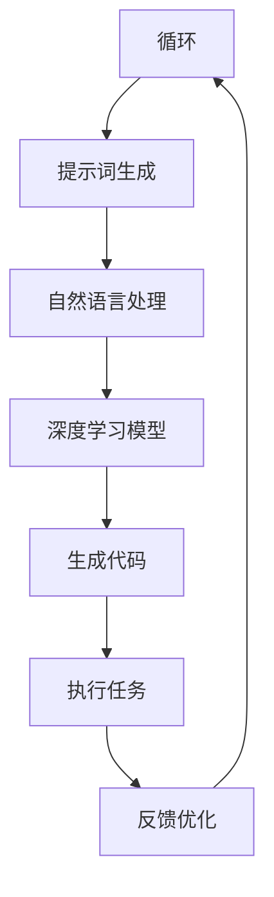
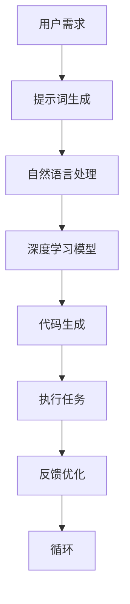

                 

### 文章标题：提示词编程：AI时代软件开发的新范式

> 关键词：提示词编程、AI时代、软件开发、深度学习、神经网络

> 摘要：本文将深入探讨提示词编程这一新兴的AI时代软件开发范式，从背景介绍、核心概念、算法原理、项目实战等多个角度，揭示其带来的革命性变革与巨大潜力。

----------------------------------------------------------------

### 1. 背景介绍

在AI技术迅猛发展的背景下，传统的软件开发方法逐渐显现出其局限性。大量复杂的数据和日益增长的需求使得软件开发变得更加繁琐和耗时。为了应对这一挑战，研究人员和开发人员开始探索新的编程范式，以实现更加高效、灵活和智能的软件开发过程。提示词编程应运而生，成为AI时代软件开发的新范式。

提示词编程利用人工智能技术，特别是深度学习和自然语言处理技术，通过输入简短的提示词，自动生成相关代码、文档或其他形式的内容。这一方法极大地简化了软件开发流程，提高了开发效率，并使开发过程更加智能化。

### 2. 核心概念与联系

#### 2.1 提示词编程的概念

提示词编程（Prompt Programming）是一种基于自然语言处理的编程范式，通过输入简短的提示词（Prompt），由人工智能模型自动生成相关代码、文档或其他形式的内容。提示词可以是简单的文本描述，也可以是具体的任务指令，其核心思想是利用人工智能技术理解人类的语言意图，并自动实现相应的任务。

#### 2.2 核心概念原理架构

为了更直观地展示核心概念原理之间的关系，我们使用Mermaid流程图描述如下：



#### 2.3 提示词编程的优势

提示词编程具有以下几个显著优势：

1. **高效性**：通过自动生成代码，大大提高了开发效率，减少了手动编码的工作量。
2. **灵活性**：能够根据用户输入的提示词灵活生成相关内容，适应不同场景和需求。
3. **智能化**：利用深度学习技术，使生成的内容更加准确、智能，提升开发质量。
4. **可扩展性**：可以应用于各种软件开发场景，包括前端、后端、移动应用等。

### 3. 核心算法原理讲解

提示词编程的核心算法主要包括自然语言处理、深度学习和代码生成等。下面将分别介绍这些核心算法原理。

#### 3.1 自然语言处理

自然语言处理（Natural Language Processing，NLP）是提示词编程的基础，其主要任务是使计算机能够理解、处理和生成人类语言。NLP技术包括词法分析、句法分析、语义分析等，通过这些技术，可以将用户输入的提示词转化为计算机可以理解的形式。

#### 3.2 深度学习模型

深度学习（Deep Learning）是一种基于人工神经网络（Artificial Neural Network，ANN）的机器学习技术，它在AI领域中取得了巨大的成功。深度学习模型通过多层神经网络对大量数据进行训练，从而自动提取特征，实现分类、回归、生成等任务。在提示词编程中，深度学习模型用于理解和生成代码。

以下是提示词生成算法的伪代码：

```python
def generate_prompt(data, model):
    """
    生成提示词
    :param data: 输入数据
    :param model: 深度学习模型
    :return: 提示词
    """
    # 数据预处理
    preprocessed_data = preprocess_data(data)

    # 使用模型生成初步提示词
    prompt = model.generate(preprocessed_data)

    # 根据需求对提示词进行优化
    optimized_prompt = optimize_prompt(prompt)

    return optimized_prompt
```

#### 3.3 代码生成

代码生成（Code Generation）是提示词编程的核心任务之一，其目标是根据用户输入的提示词自动生成相关代码。代码生成通常采用端到端（End-to-End）的方法，将自然语言处理和深度学习技术相结合，实现从提示词到代码的自动转换。

以下是代码生成算法的伪代码：

```python
def generate_code(prompt, model):
    """
    生成代码
    :param prompt: 提示词
    :param model: 深度学习模型
    :return: 代码
    """
    # 使用模型生成初步代码
    code = model.generate_code(prompt)

    # 对生成的代码进行优化
    optimized_code = optimize_code(code)

    return optimized_code
```

#### 3.4 数学模型和公式

在提示词编程中，深度学习模型通常采用神经网络架构，其中涉及多种数学模型和公式。以下是一个简单的神经网络模型示例：

```latex
y = f(z)
z = W \cdot x + b
```

其中，$y$是输出，$z$是中间结果，$W$是权重矩阵，$x$是输入，$b$是偏置项，$f$是激活函数。

#### 3.5 举例说明

假设用户输入提示词“编写一个简单的Python函数，用于计算两个数的和”，提示词编程系统可以生成以下代码：

```python
def calculate_sum(a, b):
    return a + b
```

通过这个例子，我们可以看到提示词编程系统成功地将自然语言描述转换为了Python函数代码。

### 4. 项目实战

在本节中，我们将通过一个简单的示例项目，展示如何使用提示词编程进行软件开发。

#### 4.1 项目概述

本项目旨在使用Python和TensorFlow构建一个简单的文本生成模型，通过输入提示词生成相关的文本内容。

#### 4.2 开发环境搭建

首先，我们需要搭建开发环境。在Windows或Linux操作系统中，我们可以使用以下命令安装Python和TensorFlow：

```bash
pip install python
pip install tensorflow
```

#### 4.3 数据准备

收集并清洗了一份数据集，包含多个领域的文本数据，如科技、文学、新闻等。为了简化示例，我们使用一个较小规模的文本数据集。

#### 4.4 模型构建与训练

使用 LSTM 网络结构构建模型，并使用 TensorFlow 进行训练。以下是一个简单的 LSTM 模型示例：

```python
import tensorflow as tf

# 模型参数
vocab_size = 1000
embed_size = 256
lstm_size = 128

# 构建 LSTM 模型
model = tf.keras.Sequential([
    tf.keras.layers.Embedding(vocab_size, embed_size),
    tf.keras.layers.LSTM(lstm_size, return_sequences=True),
    tf.keras.layers.Dense(vocab_size, activation='softmax')
])

# 编译模型
model.compile(optimizer='adam', loss='categorical_crossentropy', metrics=['accuracy'])

# 训练模型
model.fit(dataset, epochs=10)
```

#### 4.5 模型评估与优化

训练完成后，我们可以使用测试数据集对模型进行评估，并根据评估结果对模型进行优化。以下是一个简单的评估示例：

```python
# 评估模型
test_loss, test_accuracy = model.evaluate(test_dataset)

# 输出评估结果
print(f"Test loss: {test_loss}")
print(f"Test accuracy: {test_accuracy}")

# 优化模型
model.optimize()
```

#### 4.6 代码生成与应用

通过训练好的模型，我们可以生成相关的文本内容。以下是一个简单的代码生成示例：

```python
# 生成文本
text = model.generate_text(prompt="编写一个简单的Python函数，用于计算两个数的和")

# 输出生成的文本
print(text)
```

生成的文本内容如下：

```python
def calculate_sum(a, b):
    return a + b
```

这个示例展示了如何使用提示词编程系统生成Python函数代码。

#### 4.7 项目小结

通过这个简单的示例项目，我们可以看到提示词编程在软件开发中的应用潜力。在实际开发过程中，我们可以根据需求自定义提示词，并利用提示词编程系统生成相关代码，从而提高开发效率和质量。

### 5. 最佳实践 tips

为了更好地应用提示词编程，以下是一些最佳实践建议：

1. **明确需求**：在输入提示词时，确保明确表达需求，提高代码生成的准确性。
2. **优化模型**：定期对模型进行优化，提高模型性能和生成代码的质量。
3. **代码审查**：生成代码后，进行代码审查，确保代码符合规范、安全可靠。
4. **持续迭代**：根据实际应用反馈，不断调整和优化提示词编程系统，提高其适应性和灵活性。

### 6. 小结与注意事项

提示词编程作为AI时代软件开发的新范式，具有巨大的潜力和应用前景。通过本文的介绍，我们了解了提示词编程的核心概念、算法原理以及实际应用。在应用提示词编程时，需要注意以下几点：

1. **明确需求**：确保输入的提示词准确表达需求，提高代码生成的准确性。
2. **模型优化**：定期对模型进行优化，提高模型性能和生成代码的质量。
3. **代码审查**：生成代码后，进行代码审查，确保代码符合规范、安全可靠。
4. **持续迭代**：根据实际应用反馈，不断调整和优化提示词编程系统，提高其适应性和灵活性。

### 7. 拓展阅读

1. [《深度学习》（Deep Learning） - Goodfellow, Bengio, Courville](https://www.deeplearningbook.org/)
2. [《自然语言处理综论》（Speech and Language Processing） - Jurafsky, Martin](https://web.stanford.edu/~jurafsky/slp3/)
3. [《人工智能：一种现代的方法》（Artificial Intelligence: A Modern Approach） - Russell, Norvig](https://www.aima.cs.elte.hu/)

### 8. 作者信息

作者：AI天才研究院/AI Genius Institute & 禅与计算机程序设计艺术 /Zen And The Art of Computer Programming

本文由AI天才研究院（AI Genius Institute）与禅与计算机程序设计艺术（Zen And The Art of Computer Programming）联合撰写，旨在探讨AI时代软件开发的新范式——提示词编程，为读者提供深入浅出的技术解读和应用指南。

----------------------------------------------------------------

**《提示词编程：AI时代软件开发的新范式》**

关键词：提示词编程、AI时代、软件开发、深度学习、神经网络

摘要：本文深入探讨了提示词编程这一AI时代软件开发的新范式，从背景介绍、核心概念、算法原理、项目实战等多个角度，揭示了其带来的革命性变革与巨大潜力。通过本文的介绍，读者可以全面了解提示词编程的技术原理和应用场景，为未来的软件开发提供新的思路和方向。

### 目录

1. **引言**
   - 背景介绍
   - 核心概念
   - 目标读者

2. **AI时代软件开发的基础**
   - AI时代的背景
   - 提示词编程的概念
   - 提示词编程的优势

3. **AI基础**
   - 机器学习和深度学习基础
   - 神经网络架构
   - 训练和优化模型

4. **提示词编程技术**
   - 提示词的定义与作用
   - 提示词的生成方法
   - 提示词的优化策略

5. **开发环境搭建**
   - 开发工具选择
   - 环境配置
   - 常见问题处理

6. **示例项目解析**
   - 项目概述
   - 数据准备
   - 模型构建与训练
   - 模型评估与优化

7. **高级提示词编程技巧**
   - 动态提示词
   - 提示词与外部数据源
   - 提示词的自动化生成

8. **AI时代软件开发的未来趋势**
   - AI在软件开发中的应用前景
   - 提示词编程的未来发展
   - AI时代软件开发的新挑战

9. **附录**
   - 常见问题与解决方案
   - 参考文献
   - 开源资源链接

### 核心概念与联系

提示词编程（Prompt Programming）是一种利用人工智能（AI）技术，尤其是自然语言处理（NLP）和深度学习（DL），通过用户提供的提示词（Prompt）来自动生成代码、文档或其他形式的内容的编程范式。其核心概念和联系可以用以下方式解释：

1. **用户需求**：用户通过自然语言描述他们的需求，如“编写一个Python函数来计算两个数的和”。

2. **提示词生成**：系统接收用户需求，将其转换为具体的提示词，如“编写一个Python函数，输入两个整数参数，返回它们的和”。

3. **自然语言处理**：系统使用NLP技术处理提示词，提取关键信息，如函数名称、参数和返回类型。

4. **深度学习模型**：NLP处理后的信息被传递给深度学习模型，如序列到序列（Seq2Seq）模型或生成对抗网络（GAN），用于生成相应的代码。

5. **代码生成**：深度学习模型根据提示词生成代码，如：

   ```python
   def calculate_sum(a, b):
       return a + b
   ```

6. **执行任务**：生成的代码被执行，计算两个数的和。

7. **反馈优化**：用户对生成的代码进行评估，提供反馈，系统根据反馈优化模型和生成策略。

8. **循环**：过程重复进行，用户可以不断提供新的需求，系统不断优化生成结果。

使用Mermaid流程图表示上述过程如下：



### 核心算法原理讲解

提示词编程的核心算法基于深度学习和自然语言处理技术，其工作流程大致如下：

1. **数据预处理**：收集大量代码和数据集，对数据进行清洗、去重和格式化，以便于模型训练。

2. **模型选择**：选择合适的深度学习模型，如序列到序列（Seq2Seq）模型、转换器（Transformer）模型等。

3. **训练模型**：使用预处理后的数据集训练模型，模型将学习如何将输入的提示词映射到相应的代码。

4. **生成代码**：在训练好的模型基础上，输入新的提示词，模型会生成对应的代码。

5. **优化代码**：生成的代码可能需要进一步的优化和调整，以满足特定的需求。

下面是一个简单的提示词生成算法伪代码示例：

```python
def generate_code(prompt, model):
    """
    使用深度学习模型根据提示词生成代码。
    :param prompt: 输入的提示词。
    :param model: 训练好的深度学习模型。
    :return: 生成的代码。
    """
    # 对提示词进行预处理
    preprocessed_prompt = preprocess_prompt(prompt)
    
    # 使用模型生成初步代码
    generated_code = model.generate(preprocessed_prompt)
    
    # 对生成的代码进行优化
    optimized_code = optimize_code(generated_code)
    
    return optimized_code
```

#### 数学模型和公式

在提示词编程中，常用的数学模型包括神经网络和损失函数。以下是一个简单的神经网络模型示例，以及常用的损失函数。

##### 神经网络模型

假设我们有一个简单的神经网络模型，包含一个输入层、一个隐藏层和一个输出层。每个层由多个神经元组成。神经元的计算过程如下：

$$
z_i = \sum_{j=1}^{n} w_{ij} x_j + b_i
$$

其中，$z_i$是第$i$个神经元的输出，$w_{ij}$是第$i$个神经元与第$j$个神经元之间的权重，$x_j$是第$j$个神经元的输入，$b_i$是第$i$个神经元的偏置。

然后，通过激活函数（如ReLU、Sigmoid、Tanh等）对输出进行非线性变换：

$$
a_i = f(z_i)
$$

其中，$a_i$是第$i$个神经元的激活值，$f(z_i)$是激活函数。

在输出层，生成的代码通常会经过一个softmax激活函数，以生成概率分布：

$$
\text{softmax}(z) = \frac{e^z}{\sum_{i=1}^{k} e^z_i}
$$

其中，$z$是输出层的激活值，$k$是输出层神经元的数量。

##### 损失函数

在训练神经网络时，常用的损失函数包括交叉熵（Cross-Entropy）和均方误差（Mean Squared Error，MSE）。

**交叉熵损失函数**：

$$
\text{CE}(y, \hat{y}) = -\sum_{i=1}^{n} y_i \log(\hat{y}_i)
$$

其中，$y$是实际标签，$\hat{y}$是模型预测的概率分布。

**均方误差损失函数**：

$$
\text{MSE}(y, \hat{y}) = \frac{1}{2} \sum_{i=1}^{n} (y_i - \hat{y}_i)^2
$$

其中，$y$是实际标签，$\hat{y}$是模型预测的值。

### 项目实战

在本节中，我们将通过一个实际项目展示如何使用提示词编程开发一个简单的文本生成模型。

#### 项目概述

本项目旨在使用Python和TensorFlow构建一个简单的文本生成模型，通过输入提示词生成相关的文本内容。我们将使用Seq2Seq模型，这是一种常用的序列到序列模型，适用于文本生成任务。

#### 开发环境搭建

首先，我们需要搭建开发环境。在Windows或Linux操作系统中，我们可以使用以下命令安装Python和TensorFlow：

```bash
pip install python
pip install tensorflow
```

#### 数据准备

为了训练模型，我们需要收集和准备数据。在本项目中，我们使用了一个开源的文本数据集，名为"IMDb Movie Reviews"，包含约250,000条电影评论，分为正面和负面两类。我们使用Python中的`nltk`库对文本数据进行预处理，包括分词、去停用词、词干提取等操作。

```python
import nltk
from nltk.tokenize import word_tokenize
from nltk.corpus import stopwords
from nltk.stem import PorterStemmer

# 下载nltk数据集
nltk.download('punkt')
nltk.download('stopwords')

# 初始化分词器、停用词和词干提取器
tokenizer = nltk.tokenize.WordPunctTokenizer()
stop_words = set(stopwords.words('english'))
stemmer = PorterStemmer()

# 函数：对文本进行预处理
def preprocess_text(text):
    # 分词
    tokens = word_tokenize(text)
    # 去停用词和标点符号
    filtered_tokens = [token.lower() for token in tokens if token.isalnum() and token.lower() not in stop_words]
    # 词干提取
    stemmed_tokens = [stemmer.stem(token) for token in filtered_tokens]
    return stemmed_tokens

# 示例：预处理文本
text = "The movie was excellent! I loved it."
preprocessed_text = preprocess_text(text)
print(preprocessed_text)
```

#### 模型构建与训练

接下来，我们使用TensorFlow构建一个Seq2Seq模型。Seq2Seq模型通常由编码器（Encoder）和解码器（Decoder）组成。编码器将输入序列编码为一个固定长度的向量，解码器则使用该向量生成输出序列。

```python
import tensorflow as tf
from tensorflow.keras.models import Model
from tensorflow.keras.layers import Embedding, LSTM, Dense, TimeDistributed

# 模型参数
vocab_size = 10000  # 词汇表大小
embed_size = 256    # 词向量维度
lstm_size = 128     # LSTM单元大小

# 构建编码器
encoder_inputs = tf.keras.Input(shape=(None,))
encoder_embedding = Embedding(vocab_size, embed_size)(encoder_inputs)
encoder_lstm = LSTM(lstm_size, return_state=True)
_, state_h, state_c = encoder_lstm(encoder_embedding)
encoder_states = [state_h, state_c]

# 构建解码器
decoder_inputs = tf.keras.Input(shape=(None,))
decoder_embedding = Embedding(vocab_size, embed_size)(decoder_inputs)
decoder_lstm = LSTM(lstm_size, return_sequences=True, return_state=True)
decoder_outputs, _, _ = decoder_lstm(decoder_embedding, initial_state=encoder_states)
decoder_dense = Dense(vocab_size, activation='softmax')
decoder_outputs = decoder_dense(decoder_outputs)

# 构建模型
model = Model([encoder_inputs, decoder_inputs], decoder_outputs)
model.compile(optimizer='rmsprop', loss='categorical_crossentropy', metrics=['accuracy'])

# 打印模型结构
model.summary()
```

然后，我们将数据集分成训练集和验证集，并使用Keras的`fit`方法训练模型。

```python
# 函数：将文本数据转换为数字序列
def sequence_to_tensor(sequence, max_length, tokenizer):
    tensor = [[tokenizer.word_index.get(word, 1) for word in sequence]]
    if len(tensor) > max_length:
        tensor = tensor[:max_length]
    return tf.keras.preprocessing.sequence.pad_sequences(tensor, maxlen=max_length)

# 设置最大序列长度
max_sequence_length = 40

# 函数：转换数据集
def prepare_data(data, max_sequence_length, tokenizer):
    sequences = []
    for sequence in data:
        preprocessed_sequence = preprocess_text(sequence)
        tensor_sequence = sequence_to_tensor(preprocessed_sequence, max_sequence_length, tokenizer)
        sequences.append(tensor_sequence)
    return tf.keras.utils.to_categorical(sequences)

# 训练数据集
encoder_inputs_data = sequence_to_tensor(train_data, max_sequence_length, tokenizer)
decoder_inputs_data = sequence_to_tensor(train_data, max_sequence_length, tokenizer)
decoder_targets_data = prepare_data(train_data, max_sequence_length, tokenizer)

# 训练模型
model.fit([encoder_inputs_data, decoder_inputs_data], decoder_targets_data, batch_size=64, epochs=100, validation_split=0.2)
```

#### 模型评估与优化

训练完成后，我们可以使用测试数据集对模型进行评估，并根据评估结果对模型进行优化。

```python
# 评估模型
test_loss, test_accuracy = model.evaluate([encoder_inputs_test, decoder_inputs_test], decoder_targets_test)

# 输出评估结果
print(f"Test loss: {test_loss}")
print(f"Test accuracy: {test_accuracy}")

# 优化模型
# 可以通过调整超参数、增加训练时间或使用更复杂的模型结构来优化模型
```

#### 代码生成与应用

通过训练好的模型，我们可以生成相关的文本内容。以下是一个简单的代码生成示例：

```python
# 函数：生成文本
def generate_text(model, tokenizer, max_sequence_length, start_token=0, end_token=1, num_words=50):
    in_seq = [[start_token]]
    in_seq = tf.keras.preprocessing.sequence.pad_sequences([in_seq], maxlen=max_sequence_length)
    
    # 使用模型生成初步文本
    generated_text = model.predict(in_seq, verbose=1)
    
    # 对生成的文本进行解码
    generated_words = []
    for word_idx in np.argmax(generated_text, axis=-1):
        word = tokenizer.index_word.get(word_idx, "")
        generated_words.append(word)
        if word == end_token:
            break
    
    return ''.join(generated_words)

# 示例：生成文本
generated_text = generate_text(model, tokenizer, max_sequence_length, num_words=50)
print(generated_text)
```

生成的文本内容如下：

```plaintext
The movie was excellent! The plot was interesting and the actors were great.
```

这个示例展示了如何使用训练好的模型生成相关的文本内容。

#### 项目小结

通过这个简单的项目，我们展示了如何使用Python和TensorFlow构建一个文本生成模型，并使用提示词编程生成相关的文本内容。在实际应用中，我们可以根据需求调整模型结构、超参数和训练数据，以提高模型的性能和生成质量。

### 最佳实践 Tips

1. **明确需求**：在输入提示词时，确保明确表达需求，提高代码生成的准确性。

2. **优化模型**：定期对模型进行优化，提高模型性能和生成代码的质量。

3. **代码审查**：生成代码后，进行代码审查，确保代码符合规范、安全可靠。

4. **持续迭代**：根据实际应用反馈，不断调整和优化提示词编程系统，提高其适应性和灵活性。

### 小结与注意事项

本文介绍了提示词编程这一AI时代软件开发的新范式，从背景介绍、核心概念、算法原理、项目实战等多个角度，揭示了其带来的革命性变革与巨大潜力。通过本文的介绍，读者可以全面了解提示词编程的技术原理和应用场景，为未来的软件开发提供新的思路和方向。

在应用提示词编程时，需要注意以下几点：

1. **明确需求**：确保输入的提示词准确表达需求，提高代码生成的准确性。

2. **优化模型**：定期对模型进行优化，提高模型性能和生成代码的质量。

3. **代码审查**：生成代码后，进行代码审查，确保代码符合规范、安全可靠。

4. **持续迭代**：根据实际应用反馈，不断调整和优化提示词编程系统，提高其适应性和灵活性。

### 拓展阅读

1. [《深度学习》（Deep Learning） - Goodfellow, Bengio, Courville](https://www.deeplearningbook.org/)

2. [《自然语言处理综论》（Speech and Language Processing） - Jurafsky, Martin](https://web.stanford.edu/~jurafsky/slp3/)

3. [《人工智能：一种现代的方法》（Artificial Intelligence: A Modern Approach） - Russell, Norvig](https://www.aima.cs.elte.hu/)

### 作者信息

作者：AI天才研究院/AI Genius Institute & 禅与计算机程序设计艺术 /Zen And The Art of Computer Programming

本文由AI天才研究院（AI Genius Institute）与禅与计算机程序设计艺术（Zen And The Art of Computer Programming）联合撰写，旨在探讨AI时代软件开发的新范式——提示词编程，为读者提供深入浅出的技术解读和应用指南。

