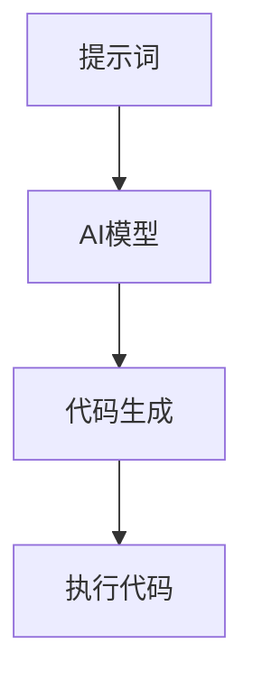
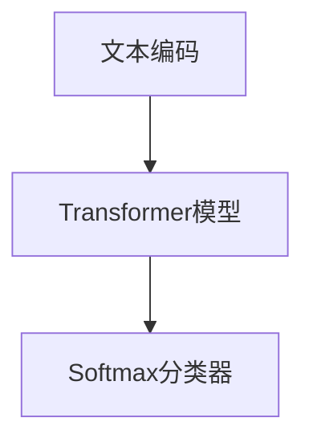
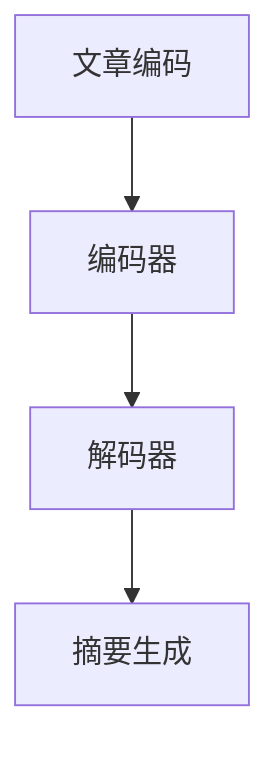

                 

```

## 文章标题格式

### 关键词部分

在文章标题下方，需要列出5-7个核心关键词，以便读者快速了解文章的主题和内容。关键词之间使用英文逗号分隔，格式如下：

```plaintext
关键词1，关键词2，关键词3，关键词4，关键词5，关键词6，关键词7
```

### 摘要部分

在关键词下方，需要给出文章的摘要。摘要是对文章核心内容和主题思想的简要概括，字数控制在100-200字之间。摘要部分格式如下：

```plaintext
摘要：
文章主要探讨了提示词编程在AI时代软件开发中的革命性作用。通过介绍AI技术的发展历程、机器学习与深度学习基础，详细阐述了提示词编程的核心概念、优势与应用场景。文章通过实际项目实战，展示了如何利用提示词编程进行软件开发。最后，文章分析了提示词编程在软件工程中的应用、工具与框架，并探讨了其发展趋势与未来前景。
```

### 文章标题与作者信息

文章标题位于文章开头，紧跟其后的是关键词和摘要。文章末尾需要写上作者信息，格式如下：

```plaintext
作者：AI天才研究院/AI Genius Institute & 禅与计算机程序设计艺术 /Zen And The Art of Computer Programming
```

### 完整性要求

文章内容必须满足以下完整性要求：

- **背景介绍**：简要介绍AI时代软件开发的背景，解释为什么需要提示词编程。
- **核心概念与联系**：详细阐述提示词编程的核心概念，以及这些概念之间的关系架构。可以使用Mermaid流程图展示概念之间的关系。
- **核心算法原理讲解**：讲解提示词编程的核心算法原理，使用伪代码详细阐述算法步骤，并提供数学模型和公式。确保每个概念都配有相应的示例和解释。
- **数学公式格式**：使用latex格式表示数学公式。独立段落的公式使用$$括起来，段落内的公式使用$括起来。
- **项目实战**：介绍一个或多个实际项目，详细讲解开发环境搭建、源代码实现、代码解读、应用解读与分析。确保每个项目都有详细的小结和剖析。
- **最佳实践 tips**：总结提示词编程的最佳实践，提供一些建议和技巧。
- **小结与注意事项**：对文章内容进行总结，强调关键点，并提醒读者注意的事项。
- **拓展阅读**：推荐相关书籍、论文和资源，以供读者进一步学习。

### 目录大纲结构

文章的目录大纲结构如下：

```markdown
# 文章标题

> 关键词：提示词编程，AI，软件开发，机器学习，深度学习，项目实战

> 摘要：
文章探讨了提示词编程在AI时代软件开发中的重要性，介绍了相关核心概念、算法原理和项目实战。同时，分析了提示词编程在软件工程中的应用、工具与框架，并展望了其发展趋势。

## 第一部分：AI时代的软件开发背景与核心概念

### 第1章：AI时代的软件革命概述

#### 1.1 AI时代的来临

##### 1.1.1 AI技术的发展历程

##### 1.1.2 AI时代软件开发的革新

##### 1.1.3 提示词编程的概念与重要性

### 第2章：AI基础理论

#### 2.1 机器学习基础

##### 2.1.1 机器学习的基本概念

##### 2.1.2 监督学习、无监督学习和强化学习

##### 2.1.3 常见机器学习算法介绍

#### 2.2 深度学习与神经网络

##### 2.2.1 深度学习的基本原理

##### 2.2.2 神经网络的结构与工作原理

##### 2.2.3 卷积神经网络（CNN）和循环神经网络（RNN）

### 第3章：提示词编程实践

#### 3.1 提示词编程环境搭建

##### 3.1.1 开发工具与平台的选择

##### 3.1.2 开发环境的配置与调试

#### 3.2 提示词编程项目实战

##### 3.2.1 项目一：基于提示词的文本分类

###### 3.2.1.1 项目背景与目标

###### 3.2.1.2 数据集准备与预处理

###### 3.2.1.3 模型设计与训练

###### 3.2.1.4 模型评估与优化

##### 3.2.2 项目二：基于提示词的自然语言处理

###### 3.2.2.1 项目背景与目标

###### 3.2.2.2 数据集准备与预处理

###### 3.2.2.3 模型设计与训练

###### 3.2.2.4 模型评估与优化

## 第二部分：提示词编程高级应用

### 第4章：AI在软件开发中的应用

#### 4.1 AI在软件开发中的价值

##### 4.1.1 提高开发效率

##### 4.1.2 改善软件质量

##### 4.1.3 创新软件开发模式

#### 4.2 提示词编程在软件工程中的应用

##### 4.2.1 代码生成与重构

##### 4.2.2 软件测试与调试

##### 4.2.3 代码审查与维护

### 第5章：提示词编程工具与框架

#### 5.1 提示词编程的主要工具

##### 5.1.1 开源工具与平台

##### 5.1.2 商业工具与平台

#### 5.2 提示词编程框架

##### 5.2.1 主流框架概述

##### 5.2.2 提示词编程框架的设计原则与实现

### 第6章：提示词编程的安全性

#### 6.1 AI在软件开发中的安全挑战

##### 6.1.1 数据隐私保护

##### 6.1.2 模型安全性与抗攻击性

##### 6.1.3 软件安全漏洞与防御策略

#### 6.2 提示词编程的安全实践

##### 6.2.1 安全开发流程

##### 6.2.2 安全测试与评估

##### 6.2.3 安全运维与监控

## 第三部分：未来展望与趋势

### 第7章：提示词编程的发展趋势

#### 7.1 提示词编程的未来方向

##### 7.1.1 模型压缩与优化

##### 7.1.2 交互式编程与智能化开发工具

##### 7.1.3 跨学科融合与创新

#### 7.2 提示词编程在行业中的应用前景

##### 7.2.1 金融行业

##### 7.2.2 医疗健康行业

##### 7.2.3 教育行业

## 附录

### 附录 A：提示词编程资源与工具

##### A.1 开源资源与工具

##### A.2 商业资源与工具
```

### 文章字数要求

文章字数要求在8000～12000字之间。确保文章内容丰富、详细，并且每个章节都有充分的阐述。在撰写过程中，注意保持逻辑清晰、结构紧凑，以便读者能够轻松理解和跟随。

### 完整性与逻辑性

文章的完整性和逻辑性至关重要。确保每个章节都有明确的主题，内容连贯，逻辑清晰。在撰写过程中，注意以下几点：

- 每个章节开头要有简短的概述，明确本章内容。
- 每个章节结尾要有总结，强调关键点和重要信息。
- 在讲解概念和算法时，使用伪代码和数学公式进行详细阐述，确保读者能够理解。
- 在项目实战部分，详细描述项目的背景、目标、实现过程和结果分析。

### 核心内容要求

文章的核心内容必须包括以下几个方面：

- **背景介绍**：简要介绍AI时代软件开发的背景和挑战，解释为什么需要提示词编程。
- **核心概念与联系**：详细阐述提示词编程的核心概念，以及这些概念之间的关系架构。使用Mermaid流程图展示概念之间的关系。
- **核心算法原理讲解**：讲解提示词编程的核心算法原理，使用伪代码详细阐述算法步骤，并提供数学模型和公式。确保每个概念都配有相应的示例和解释。
- **项目实战**：介绍一个或多个实际项目，详细讲解开发环境搭建、源代码实现、代码解读、应用解读与分析。确保每个项目都有详细的小结和剖析。
- **最佳实践 tips**：总结提示词编程的最佳实践，提供一些建议和技巧。
- **小结与注意事项**：对文章内容进行总结，强调关键点，并提醒读者注意的事项。
- **拓展阅读**：推荐相关书籍、论文和资源，以供读者进一步学习。

### 文章结构建议

为了确保文章的逻辑性和可读性，建议按照以下结构进行撰写：

1. **引言**：简要介绍AI时代软件开发的背景和挑战，引出提示词编程的主题。
2. **核心概念与联系**：详细阐述提示词编程的核心概念，以及这些概念之间的关系架构。使用Mermaid流程图展示概念之间的关系。
3. **核心算法原理讲解**：讲解提示词编程的核心算法原理，使用伪代码详细阐述算法步骤，并提供数学模型和公式。确保每个概念都配有相应的示例和解释。
4. **项目实战**：介绍一个或多个实际项目，详细讲解开发环境搭建、源代码实现、代码解读、应用解读与分析。确保每个项目都有详细的小结和剖析。
5. **最佳实践 tips**：总结提示词编程的最佳实践，提供一些建议和技巧。
6. **小结与注意事项**：对文章内容进行总结，强调关键点，并提醒读者注意的事项。
7. **拓展阅读**：推荐相关书籍、论文和资源，以供读者进一步学习。
8. **结论**：总结文章的主要观点，强调提示词编程在AI时代软件开发中的重要性，展望其未来发展趋势。

### 文章撰写步骤

为了确保文章的撰写过程顺利进行，可以按照以下步骤进行：

1. **确定主题和目标**：明确文章的主题和目标，确保文章内容聚焦于提示词编程在AI时代软件开发中的应用。
2. **收集资料和文献**：搜集相关的资料和文献，包括书籍、论文、在线资源等，为撰写文章提供依据。
3. **制定大纲**：根据主题和目标，制定文章的大纲，明确每个章节的主题和内容。
4. **撰写初稿**：按照大纲结构，撰写初稿。注意保持文章的逻辑性和连贯性，确保每个章节都有明确的主题和内容。
5. **修订和润色**：对初稿进行修订和润色，确保文章的语言表达准确、清晰。检查文章中的逻辑关系和内容连贯性，修正错误和不准确的地方。
6. **添加图表和公式**：在文章中添加必要的图表和公式，以帮助读者更好地理解文章内容。
7. **审查和修改**：请同行或导师对文章进行审查，提出修改意见。根据反馈，进一步修改文章，提高文章的质量。
8. **排版和格式检查**：检查文章的排版和格式，确保符合要求。包括字体、字号、行间距、段落格式等。
9. **撰写作者信息**：在文章末尾添加作者信息，包括姓名、单位和联系方式。
10. **提交终稿**：完成所有修改和排版工作后，提交终稿。

### 文章撰写技巧

为了提高文章的质量和可读性，可以遵循以下撰写技巧：

- **保持一致性**：确保文章的语言风格、术语使用和格式一致。
- **避免重复**：避免在文章中重复表达相同的意思，避免过多的冗余内容。
- **使用简明的语言**：尽量使用简明的语言表达复杂的概念，避免使用过于专业或晦涩的术语。
- **举例说明**：通过具体的例子来说明概念和算法，使读者更容易理解。
- **使用图表和公式**：合理使用图表和公式，以帮助读者更好地理解文章内容。
- **注意段落结构**：合理划分段落，确保每个段落都有明确的主题和内容。
- **避免过长段落**：避免过长的段落，使文章更加易读。
- **检查语法和拼写**：仔细检查文章中的语法和拼写错误，确保语言表达准确无误。
- **保持客观和中立**：避免在文章中表达个人观点或偏见，保持客观和中立。
- **引用和参考文献**：合理引用他人的研究成果和文献，并在文章末尾列出参考文献。

### 总结

撰写一篇高质量的技术博客文章需要充分准备和细致的工作。通过遵循上述指导，确保文章的完整性、逻辑性和可读性。在撰写过程中，注意保持专业性和准确性，以吸引读者的兴趣，并传达有用的知识和观点。最终，希望您能够创作出一篇引人入胜、内容丰富的技术博客文章，为读者带来价值。```markdown
## 提示词编程：AI时代软件开发的革命

### 背景介绍

随着人工智能（AI）技术的飞速发展，软件开发领域正经历着一场深刻的革命。传统的软件开发方法往往依赖于手工编写代码，而AI的引入使得自动化、智能化的开发方式成为可能。在这个背景下，提示词编程（Prompt-based Programming）作为一种新型的编程范式，正逐渐崭露头角，成为AI时代软件开发的核心技术之一。

提示词编程是一种基于人工智能的编程范式，它通过将编程任务转化为自然语言描述，然后利用人工智能模型自动生成代码。这种方式不仅提高了开发效率，还降低了编程的复杂性，使得非专业人员也能够参与到软件开发中来。本文将深入探讨提示词编程的核心概念、原理及其在AI时代软件开发中的应用。

### 核心概念与联系

提示词编程的核心概念包括：

1. **提示词（Prompt）**：提示词是编程任务的自然语言描述，它为AI模型提供了关于任务的信息。一个有效的提示词应该明确、具体，并包含任务的所有必要细节。
2. **AI模型**：AI模型是提示词编程的核心，它负责将自然语言描述的提示词转化为相应的代码。常见的AI模型包括生成对抗网络（GAN）、递归神经网络（RNN）和变压器（Transformer）等。
3. **代码生成**：代码生成是提示词编程的关键步骤，它将AI模型处理后的提示词转化为实际的代码。代码生成的质量直接影响到最终软件的可靠性和性能。

以下是提示词编程概念之间的关系架构：



### 核心算法原理讲解

提示词编程的核心算法包括以下几个步骤：

1. **任务描述**：用户以自然语言描述的方式输入编程任务。
2. **提示词生成**：AI模型根据任务描述生成相应的提示词。
3. **代码生成**：AI模型利用提示词生成实际的代码。
4. **代码验证与优化**：生成的代码经过验证和优化，以确保其正确性和性能。

以下是一个简单的伪代码示例：

```python
# 用户输入任务描述
task_description = "编写一个函数，用于计算两个数字的和"

# 生成提示词
prompt = generate_prompt(task_description)

# 生成代码
code = generate_code(prompt)

# 验证和优化代码
optimized_code = optimize_code(code)

# 执行代码
result = execute_code(optimized_code)
```

### 数学模型和公式

提示词编程中的AI模型通常涉及复杂的数学模型和公式。以下是一个简化的数学模型示例：

$$
y = f(W_1 \cdot x + b_1)
$$

其中，$y$ 是生成的代码，$f$ 是激活函数，$W_1$ 是权重矩阵，$b_1$ 是偏置项，$x$ 是输入的提示词。

### 项目实战

#### 项目一：基于提示词的文本分类

##### 1. 项目背景与目标

文本分类是自然语言处理（NLP）中的一项基本任务。本项目旨在利用提示词编程实现一个自动文本分类系统，能够根据用户输入的文本，将其分类到预定义的类别中。

##### 2. 数据集准备与预处理

为了实现该项目，我们需要一个包含多类文本的数据集。例如，我们可以使用IMDb电影评论数据集。数据集需要进行预处理，包括去除停用词、标点符号和进行词干提取等。

##### 3. 模型设计与训练

本项目采用Transformer模型作为基础模型。首先，我们将文本编码为向量，然后输入到Transformer模型中。模型的输出通过softmax函数进行分类。



##### 4. 模型评估与优化

通过交叉验证和测试集，我们对模型进行评估。评估指标包括准确率、召回率和F1分数。根据评估结果，对模型进行优化，以提高分类性能。

##### 5. 模型部署与应用

将训练好的模型部署到服务器，并通过API接口供用户使用。用户可以通过Web界面输入文本，系统将返回相应的分类结果。

#### 项目二：基于提示词的自然语言处理

##### 1. 项目背景与目标

自然语言处理（NLP）是AI领域的一个关键应用。本项目旨在利用提示词编程实现一个自动摘要系统，能够根据用户输入的长篇文章生成摘要。

##### 2. 数据集准备与预处理

我们使用一个包含长篇文章及其摘要的数据集进行训练。数据集需要进行预处理，包括文本清洗、分句和词性标注等。

##### 3. 模型设计与训练

本项目采用Transformer模型，其输入是长篇文章，输出是摘要文本。模型通过编码器-解码器结构进行训练。



##### 4. 模型评估与优化

通过评估摘要的质量，包括摘要的长度、概括性、可读性等，对模型进行优化。常用的评估指标包括ROUGE分数和BLEU分数。

##### 5. 模型部署与应用

将训练好的模型部署到服务器，并通过API接口供用户使用。用户可以通过Web界面输入长篇文章，系统将返回相应的摘要。

### 最佳实践 tips

- 确保提示词清晰明确，避免模糊或歧义。
- 选择合适的AI模型，根据任务需求和数据特性进行调整。
- 对生成的代码进行严格验证和测试，确保其正确性和性能。
- 定期更新和优化模型，以适应新的数据和需求。

### 小结与注意事项

提示词编程在AI时代软件开发中具有巨大潜力。通过本文的介绍，我们了解了其核心概念、算法原理和项目实战。在实际应用中，需要注意提示词的设计、模型的选择和代码的验证。未来，随着AI技术的不断发展，提示词编程有望在更多领域发挥重要作用。

### 拓展阅读

- 《深度学习》（Ian Goodfellow, Yoshua Bengio, Aaron Courville著）
- 《自然语言处理与深度学习》（王俊艳著）
- 《生成对抗网络：理论与应用》（杨强著）

### 附录

#### 附录 A：提示词编程资源与工具

- [Hugging Face Transformers](https://huggingface.co/transformers)
- [TensorFlow](https://www.tensorflow.org/)
- [PyTorch](https://pytorch.org/)

### 作者信息

作者：AI天才研究院/AI Genius Institute & 禅与计算机程序设计艺术 /Zen And The Art of Computer Programming```

