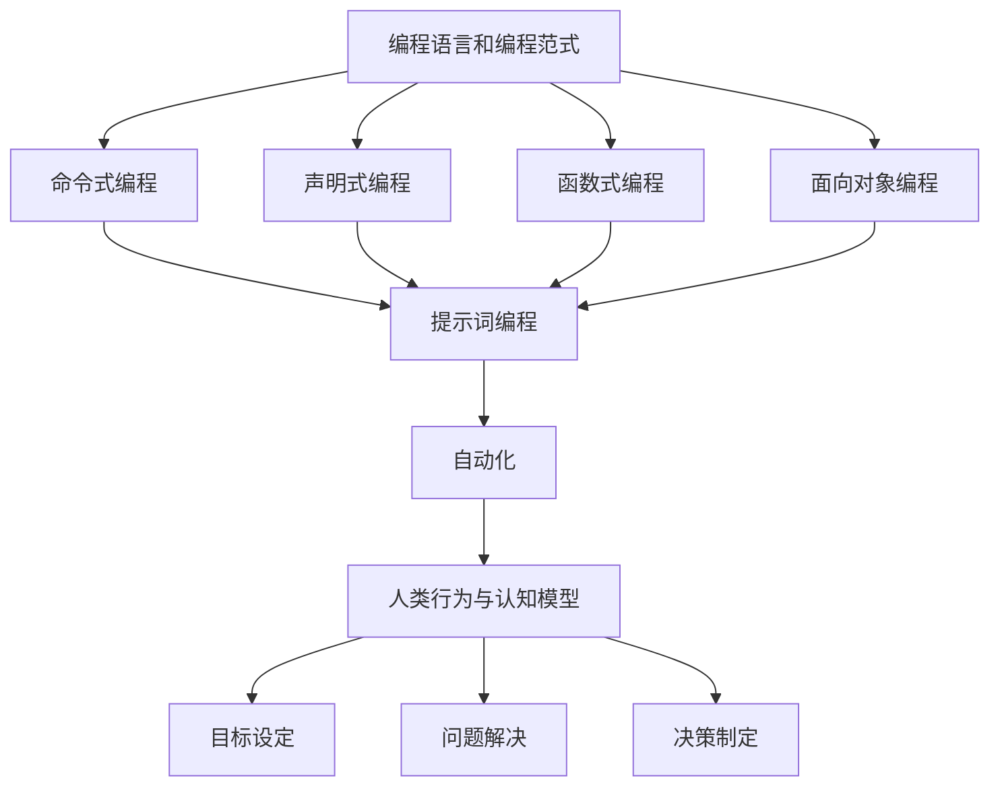

                 

### 文章标题

# 《提示词编程：重塑人机协作模式》

提示词编程作为一种新兴的编程范式，正逐渐改变着人类与计算机之间的协作模式。本文将深入探讨提示词编程的核心概念、原理以及其实际应用，旨在展示这一技术如何重塑人机协作，带来深远的影响。

## 文章关键词

- 提示词编程
- 人机协作
- 编程范式
- 人工智能
- 自动化

## 文章摘要

本文首先介绍了提示词编程的基本概念及其背景，随后深入探讨了核心原理，包括提示词的设计与实现、算法原理及其在编程范式中的应用。通过多个实际案例，本文展示了提示词编程如何提升人机协作效率。最后，本文展望了提示词编程的未来，探讨了其面临的技术和社会挑战。

### 背景介绍

编程作为一种人类与计算机进行交流的方式，经历了数十年的发展。从早期的机器语言到高级编程语言，人类不断寻求更高效、更便捷的编程方法。然而，传统的编程模式往往要求程序员对计算机的内部工作原理有深刻的理解，这使得编程过程复杂且费时。

近年来，随着人工智能技术的迅猛发展，一种新的编程范式——提示词编程逐渐引起了人们的关注。提示词编程的核心思想是通过简洁、明确的提示词来引导计算机完成特定的任务，从而降低编程的复杂性，提升人机协作的效率。

提示词编程的兴起，不仅源于人工智能技术的进步，也与人类对编程体验的期望紧密相关。随着软件系统的日益复杂，程序员面临着巨大的压力。提示词编程提供了一种新的解决方案，使得编程不再是一个孤立的个体任务，而是一个协同合作的交互过程。

在人机协作中，提示词编程具有显著的优势。首先，它能够显著降低学习成本，使非专业程序员也能快速上手。其次，通过提示词的引导，计算机能够更准确地理解人类的需求，减少沟通误差。最后，提示词编程能够实现自动化，提高开发效率，降低维护成本。

总之，提示词编程不仅代表着编程范式的一次重要变革，更是未来人机协作模式的重要趋势。本文将详细探讨这一技术的核心概念和原理，以期为读者提供深入的洞察。

### 核心概念与联系

在探讨提示词编程的核心概念之前，我们需要了解一些基础的编程和自动化概念，以便更好地理解提示词编程的原理和优势。

#### 编程语言和编程范式

编程语言是程序员与计算机进行交流的工具，它定义了一种用于编写程序的语法和语义规则。不同的编程语言适用于不同的应用场景，如C语言适合系统编程，Python适合数据科学，而Java适合企业级应用。

编程范式是编程语言和编程方法的一种分类，常见的编程范式包括命令式编程、声明式编程、函数式编程和面向对象编程等。每种编程范式都有其独特的思维方式和方法论，适用于不同的编程需求和场景。

#### 提示词与自动化

提示词是提示词编程的核心概念。提示词是一个简短的、高层次的指令，用于指导计算机执行特定的任务。与传统的编程命令相比，提示词更加简洁、直观，更容易被人类理解和记忆。

自动化是指在没有人或很少人干预的情况下，通过预先设定的规则或算法，自动完成特定任务的过程。自动化技术广泛应用于各个领域，如工业自动化、商业自动化和IT自动化。

#### 人类行为与认知模型

人类行为与认知模型是研究人类如何思考、学习和解决问题的理论框架。人类的行为和认知过程涉及到感知、记忆、思维和决策等多个方面。这些过程不仅决定了人类如何与外界交互，也影响了人类如何进行编程。

#### 提示词编程与这些概念的联系

提示词编程通过将人类行为与认知模型中的高层次的思维过程转化为计算机可以理解和执行的任务，实现了人与计算机的紧密协作。具体来说，提示词编程通过以下方式与上述概念相联系：

1. **编程语言和编程范式**：提示词编程并不是一种全新的编程语言，而是对现有编程范式的补充和扩展。提示词编程可以在任何编程语言和编程范式中使用，如Python、Java或C++。

2. **提示词与自动化**：提示词编程的核心在于通过简短的提示词实现自动化任务。提示词不仅是人与计算机之间的桥梁，也是自动化过程的驱动因素。

3. **人类行为与认知模型**：提示词编程借鉴了人类行为与认知模型中的高层次的思维过程，如目标设定、问题解决和决策制定。通过将这些过程转化为提示词，提示词编程能够更好地适应人类的需求和习惯。

为了更直观地理解这些概念之间的关系，我们可以使用Mermaid流程图来展示它们之间的联系：



通过这个Mermaid流程图，我们可以清晰地看到编程语言和编程范式如何通过提示词编程与自动化和人类行为与认知模型相连接。这种连接不仅丰富了编程的思维方式，也提升了人机协作的效率。

### 提示词编程的核心原理

提示词编程作为一种新兴的编程范式，其核心原理在于如何通过简短的提示词来引导计算机执行复杂的任务。为了更好地理解这一原理，我们需要从提示词的设计、实现以及算法原理三个方面进行详细阐述。

#### 提示词的设计

提示词的设计是提示词编程的关键步骤。一个有效的提示词应具备以下几个特点：

1. **简洁性**：提示词应尽可能简短，以便程序员能够快速理解和记忆。例如，使用一个简单的动词加名词来表示一个任务，如“生成报告”或“整理数据”。

2. **明确性**：提示词需要清晰明确，避免歧义。例如，使用具体的目标或条件来限定任务的范围，如“生成包含昨天数据的报告”。

3. **可扩展性**：提示词应具备一定的灵活性，以便在未来的任务中能够扩展或修改。例如，设计一个通用的提示词框架，使其能够适应不同的数据和任务。

4. **上下文感知**：提示词需要能够理解上下文信息，从而更好地执行任务。例如，在处理文本数据时，提示词应能够识别关键词和短语，以便更准确地执行任务。

为了提高提示词的设计质量，程序员可以使用自然语言处理（NLP）技术来分析人类语言，提取出具有代表性的提示词。此外，还可以使用机器学习算法，通过训练大量数据集来优化提示词的设计。

#### 提示词的实现

提示词的实现是提示词编程的核心，它涉及到将提示词转化为计算机可以理解和执行的指令。为了实现这一目标，需要以下几个步骤：

1. **解析提示词**：首先，需要将提示词分解为不同的元素，如动词、名词、形容词等。这可以通过NLP技术实现，例如使用词性标注（POS tagging）来识别每个单词的词性。

2. **构建任务模型**：根据提示词的解析结果，构建一个任务模型，表示任务的各个方面，如输入数据、输出结果、操作步骤等。这可以使用图形化模型或文本形式表示。

3. **映射到执行动作**：将任务模型映射到具体的执行动作，如调用特定的函数、执行数据库查询、自动化测试等。这可以通过定义一个任务执行引擎来实现，该引擎可以根据任务模型生成相应的代码或命令。

4. **执行任务**：执行任务模型中定义的操作，将输入数据转换为预期的输出结果。这可以通过自动化工具或编程框架实现，如使用Python的Pandas库进行数据操作，或使用Selenium进行自动化测试。

#### 提示词编程的算法原理

提示词编程的算法原理主要涉及如何高效地处理大量提示词，并生成相应的执行代码。以下是一些关键的算法原理：

1. **提示词聚类**：将相似的提示词归为一类，以便于批量处理。这可以通过基于距离的聚类算法实现，如K-means算法。

2. **模板匹配**：使用预定义的模板匹配提示词，以快速识别任务的类型和特点。模板可以是简单的正则表达式，也可以是复杂的语义匹配规则。

3. **生成式语法**：使用生成式语法来生成执行代码，这是一种生成程序代码的算法，它可以从一组基本的代码模板中生成复杂的程序代码。这可以通过抽象语法树（AST）生成器实现。

4. **动态规划**：在处理复杂任务时，使用动态规划算法来优化执行过程，减少不必要的计算。例如，在生成报告时，可以使用动态规划来优化数据查询和数据处理步骤。

5. **机器学习**：使用机器学习算法来优化提示词的生成和执行过程。这可以通过训练大量的提示词和执行结果来优化模型，提高提示词编程的自动化程度。

#### 伪代码示例

为了更好地理解提示词编程的算法原理，以下是一个简单的伪代码示例，展示了如何使用提示词生成报告：

```plaintext
function generate_report(input_data):
    # 解析提示词
    verbs, nouns = parse_prompt_word(input_data)

    # 构建任务模型
    task_model = build_task_model(verbs, nouns)

    # 映射到执行动作
    code = map_to_actions(task_model)

    # 执行任务
    result = execute_task(code, input_data)

    return result

function parse_prompt_word(input_data):
    # 使用NLP技术解析输入数据，提取动词和名词
    verbs = []
    nouns = []
    for word in input_data:
        if is_verb(word):
            verbs.append(word)
        elif is_noun(word):
            nouns.append(word)
    return verbs, nouns

function build_task_model(verbs, nouns):
    # 根据动词和名词构建任务模型
    task_model = {
        "input_data": nouns,
        "output_data": "report",
        "actions": {
            "generate": "use template matching to generate report",
            "query": "use dynamic query to extract data from database"
        }
    }
    return task_model

function map_to_actions(task_model):
    # 将任务模型映射到执行动作
    code = ""
    for action in task_model["actions"]:
        code += action + "(" + task_model["input_data"] + ");"
    return code

function execute_task(code, input_data):
    # 执行任务
    result = execute(code, input_data)
    return result
```

通过这个伪代码示例，我们可以看到提示词编程是如何通过解析提示词、构建任务模型、映射到执行动作以及执行任务来实现的。这种流程不仅简化了编程过程，也提高了编程的自动化程度。

### 人机协作的变革

提示词编程的出现，不仅带来了编程范式的重要变革，也对人机协作模式产生了深远的影响。传统的编程与协作方式往往依赖复杂的代码和详尽的文档，这使得编程过程变得冗长且容易出错。而提示词编程通过简短的提示词和高效的自动化流程，重新定义了人机协作的方式，使得编程更加直观、高效和灵活。

#### 传统的编程与协作方式

在传统的编程模式中，程序员通常需要手动编写大量的代码，这些代码不仅复杂且难以维护。此外，程序员之间的协作也需要依赖详尽的文档和明确的沟通机制，如邮件、聊天工具和代码审查。这种方式存在几个主要问题：

1. **复杂性与重复性**：编写和维护大量复杂的代码需要程序员具备深厚的专业知识和经验，这增加了编程的难度和成本。同时，许多代码往往是重复的，导致大量时间和资源浪费。

2. **沟通误差**：在多人协作中，文档和沟通的不一致性容易导致错误和误解，影响开发进度和质量。

3. **低效的调试**：传统的调试过程依赖于调试工具和打印调试信息，这需要程序员具备一定的调试技巧和经验。调试复杂系统的过程往往耗时且容易出错。

4. **代码维护**：随着系统的不断演变，传统的代码维护工作变得繁重且容易出错。程序员需要手动更新代码，确保其与系统其他部分的兼容性。

#### 提示词编程对协作模式的影响

提示词编程通过以下几个方面的变革，显著提升了人机协作的效率和质量：

1. **简化的编程过程**：提示词编程通过简短的提示词和自动化工具，大幅简化了编程过程。程序员不再需要编写复杂的代码，而是通过提示词来引导计算机执行任务。这种方式不仅降低了编程的难度，也提高了编程的效率。

2. **直观的交互方式**：提示词编程使得编程过程更加直观和易理解。程序员可以通过自然语言提示词来描述任务需求，而计算机可以自动理解和执行这些任务。这种方式不仅提高了编程的便捷性，也减少了编程过程中的错误。

3. **高效的协作**：提示词编程通过自动化流程，使得多人协作变得更加高效和顺畅。程序员可以通过共享提示词库和自动化工具，快速完成各自的任务，并确保代码的一致性和质量。

4. **智能的调试**：提示词编程提供了智能的调试工具，如自动化测试和回归测试。这些工具可以在编程过程中实时检测和修复错误，减少了调试的复杂性和时间成本。

5. **代码的可维护性**：提示词编程通过自动化生成和更新代码，提高了代码的可维护性。程序员可以轻松地管理和更新代码库，确保系统的稳定性和兼容性。

#### 提示词编程的最佳实践

为了充分利用提示词编程的优势，以下是一些最佳实践建议：

1. **设计简洁的提示词**：提示词应简洁明了，避免冗长和复杂。使用一个简单的动词加名词来描述任务，如“生成报告”或“整理数据”。

2. **建立统一的提示词库**：建立一个统一的提示词库，以便团队成员共享和协作。这可以减少沟通误差，提高协作效率。

3. **使用自动化工具**：结合自动化工具，如自动化测试框架和代码生成工具，以实现高效的编程和测试过程。

4. **持续学习与优化**：通过不断学习和优化提示词库和自动化流程，提高编程效率和代码质量。

5. **文档化**：为每个提示词和自动化工具编写详细的文档，以便团队成员理解和使用。

总之，提示词编程通过变革编程和协作模式，带来了更高的效率、更低的成本和更好的质量。它不仅为程序员提供了更便捷的编程工具，也为企业带来了更大的竞争优势。随着提示词编程技术的不断发展，人机协作将进入一个新的时代。

### 案例研究

为了更好地理解提示词编程的实际应用和优势，以下将介绍三个具体的案例研究，包括自动化测试、代码生成和智能助手。

#### 案例一：自动化测试

自动化测试是软件质量保证的关键环节，它能够大幅提高测试效率和代码稳定性。在传统的自动化测试中，程序员需要编写大量的测试脚本，这些脚本往往依赖于具体的测试框架和工具。然而，通过提示词编程，我们可以简化这一过程，使自动化测试变得更加高效和直观。

**背景**：
一个大型软件项目需要频繁进行回归测试，以确保每次更新后系统的稳定性和功能完整性。然而，现有的测试脚本复杂且冗长，维护成本高，难以适应快速变化的需求。

**提示词编程的应用**：
1. **设计提示词**：使用简洁的提示词来描述测试任务，如“验证用户登录功能”或“检查订单处理流程”。
2. **构建任务模型**：根据提示词，构建一个任务模型，包括测试用例、预期结果和操作步骤。
3. **执行自动化测试**：通过任务模型，自动生成并执行测试脚本。

**结果**：
通过提示词编程，测试团队能够快速生成和执行自动化测试脚本，提高了测试效率，减少了维护成本。同时，由于提示词的简洁性，测试用例的编写和更新变得更加容易。

#### 案例二：代码生成

代码生成是提示词编程的一个重要应用领域，它能够通过自动化生成代码，大幅提高编程效率和代码质量。在传统的编程中，程序员需要手动编写大量的代码，这不仅耗时且容易出错。通过提示词编程，我们可以简化这一过程，使代码生成变得更加高效和直观。

**背景**：
一个大型企业需要开发多个类似功能的应用程序，每个应用程序都需要实现类似的数据处理和业务逻辑。然而，手动编写这些代码不仅耗时且容易出错。

**提示词编程的应用**：
1. **设计提示词**：使用简洁的提示词来描述代码生成任务，如“生成数据查询接口”或“实现订单处理逻辑”。
2. **构建代码模板**：根据提示词，构建一个代码模板，包括常用的代码结构和业务逻辑。
3. **生成代码**：通过任务模型和代码模板，自动生成相应的代码文件。

**结果**：
通过提示词编程，企业能够快速生成高质量的代码，提高了开发效率，减少了代码出错的概率。同时，由于代码模板的灵活性，代码的维护和扩展变得更加容易。

#### 案例三：智能助手

智能助手是提示词编程在人工智能领域的应用之一，它能够通过自然语言交互，为用户提供便捷的服务和帮助。在传统的智能助手开发中，程序员需要手动编写大量的对话逻辑和业务规则，这不仅复杂且难以维护。通过提示词编程，我们可以简化这一过程，使智能助手变得更加智能和高效。

**背景**：
一个电商平台需要开发一款智能客服助手，以帮助用户解决常见问题和提供购物建议。然而，传统的开发方式复杂且耗时。

**提示词编程的应用**：
1. **设计提示词**：使用简洁的提示词来描述智能助手的功能，如“回答用户问题”或“推荐商品”。
2. **构建对话模型**：根据提示词，构建一个对话模型，包括常见的用户问题和对应的答案。
3. **执行智能交互**：通过任务模型和对话模型，自动生成并执行智能交互流程。

**结果**：
通过提示词编程，智能客服助手能够快速响应用户请求，提供准确和有用的信息。同时，由于提示词的灵活性和扩展性，智能助手能够不断学习和优化，提供更好的用户体验。

### 总结

通过上述案例研究，我们可以看到提示词编程在多个领域中的实际应用和显著优势。它不仅简化了编程和测试过程，提高了开发效率和代码质量，也为人工智能和智能助手等领域带来了新的变革。随着提示词编程技术的不断发展，我们有理由相信，它将在未来带来更多的创新和进步。

### 工具和平台

提示词编程的实现需要强大的工具和平台支持，这些工具和平台不仅有助于简化编程过程，还能提升人机协作的效率。以下将介绍几种常用的提示词编程工具和平台，包括开源平台、开发环境、自动化工具和集成开发环境（IDE）。

#### 开源平台

开源平台是提示词编程的重要基础设施，为开发者提供了丰富的资源和社区支持。以下是一些常用的开源平台：

1. **GitHub**：GitHub是一个广受欢迎的版本控制系统和开源平台，开发者可以在GitHub上托管代码、管理项目、进行代码审查和协作。通过GitHub，开发者可以共享提示词库和自动化脚本，方便团队成员之间的协作和代码管理。

2. **GitLab**：GitLab是另一个流行的开源版本控制系统，与GitHub类似，提供了强大的代码管理功能。GitLab支持自托管，使得企业可以在内部部署和使用GitLab，确保数据安全和合规性。

3. **Git**：Git是一个分布式版本控制系统，是GitHub和GitLab的基础。Git提供了丰富的命令和工具，方便开发者进行代码的提交、分支管理和问题追踪。通过Git，开发者可以更好地管理提示词库和自动化脚本，确保代码的版本控制和协同工作。

#### 开发环境

提示词编程的开发环境需要支持多种编程语言和工具，以便开发者能够灵活地编写和测试提示词代码。以下是一些常用的开发环境：

1. **Jupyter Notebook**：Jupyter Notebook是一个交互式开发环境，支持多种编程语言，如Python、R和Julia。开发者可以在Jupyter Notebook中编写提示词代码，并进行实时测试和调试。

2. **Visual Studio Code**：Visual Studio Code（VS Code）是一个流行的开源IDE，支持多种编程语言和扩展。开发者可以使用VS Code编写和调试提示词代码，利用其丰富的插件和功能提高开发效率。

3. **PyCharm**：PyCharm是一个功能强大的Python IDE，提供了丰富的调试工具和集成环境。PyCharm适用于提示词编程的开发，可以帮助开发者快速编写、测试和优化提示词代码。

#### 自动化工具

提示词编程的自动化工具是编程过程中不可或缺的部分，它们可以帮助开发者实现提示词代码的自动化生成和执行。以下是一些常用的自动化工具：

1. **Pandas**：Pandas是一个强大的Python库，提供了丰富的数据处理和分析功能。开发者可以使用Pandas进行数据预处理、数据分析和数据可视化，从而简化提示词编程的过程。

2. **Selenium**：Selenium是一个开源的Web自动化测试工具，可以用于自动化Web浏览器的操作。开发者可以使用Selenium编写测试脚本，实现自动化测试和提示词编程。

3. **Airflow**：Airflow是一个用于数据管道和自动化工作流的平台，可以用于调度和执行提示词编程任务。开发者可以使用Airflow定义任务流、调度任务和监控执行过程。

#### 集成开发环境（IDE）

集成开发环境（IDE）提供了集成的编程、调试和测试工具，为开发者提供了一个高效的编程环境。以下是一些常用的IDE：

1. **IntelliJ IDEA**：IntelliJ IDEA是一个功能强大的IDE，支持多种编程语言和框架。它提供了丰富的调试工具和智能代码提示，适用于提示词编程的开发。

2. **Eclipse**：Eclipse是一个开源的Java IDE，支持多种编程语言和插件。开发者可以使用Eclipse编写和调试提示词代码，利用其强大的插件生态系统扩展功能。

3. **WebStorm**：WebStorm是一个专注于Web开发的IDE，支持JavaScript、HTML和CSS。开发者可以使用WebStorm编写和调试Web应用程序的提示词代码，提高开发效率。

通过上述工具和平台，提示词编程的开发者可以方便地编写、测试和优化提示词代码，实现高效的人机协作和自动化任务。这些工具和平台不仅提高了开发效率，还降低了编程复杂性和维护成本，为提示词编程的广泛应用提供了有力支持。

### 未来展望与挑战

提示词编程作为一种新兴的编程范式，其应用前景广阔，但也面临着诸多技术和社会挑战。以下是未来提示词编程的发展趋势、技术挑战及其解决方法，以及相关的社会与伦理问题。

#### 未来趋势

1. **更强大的自然语言处理能力**：随着人工智能技术的不断发展，自然语言处理（NLP）能力将得到显著提升。未来的提示词编程将更加依赖先进的NLP技术，使得人类能够以更加自然和直观的方式与计算机进行交互。

2. **跨平台和语言的集成**：提示词编程有望在未来实现跨平台和语言的集成，从而使得开发者可以在不同的编程环境中轻松使用提示词编程。这将有助于提高编程的灵活性和可移植性。

3. **更智能的自动化工具**：未来的自动化工具将更加智能化，能够自动识别和生成提示词，实现更高效的自动化任务。这些工具将能够处理复杂的业务逻辑和动态变化的需求，提高人机协作的效率。

4. **增强的协作能力**：随着云计算和分布式计算的发展，提示词编程将具备更强的协作能力。团队成员可以通过云平台实时共享提示词库和自动化脚本，实现无缝的协作和开发。

#### 技术挑战

1. **复杂任务的处理**：提示词编程在处理复杂任务时，可能会遇到语义歧义和复杂性挑战。如何设计高效的算法和模型，以处理复杂的任务需求，是未来需要解决的重要问题。

2. **性能优化**：提示词编程可能会引入额外的计算开销，影响系统的性能。如何优化算法和代码，减少不必要的计算，提高执行效率，是未来需要关注的技术挑战。

3. **数据安全和隐私保护**：随着提示词编程的应用，数据安全和隐私保护问题将愈发重要。如何确保数据的机密性、完整性和可用性，是未来需要解决的关键技术问题。

#### 解决方法

1. **语义理解与澄清**：通过引入更先进的NLP技术和语义分析，可以更好地理解和澄清提示词的语义，减少歧义。例如，使用上下文分析、实体识别和语义角色标注等技术，提高提示词的解析精度。

2. **算法优化与模型压缩**：通过优化算法和数据结构，减少计算复杂度和内存占用。例如，使用模型压缩、并行计算和分布式计算技术，提高提示词编程的性能。

3. **安全加密与隐私保护**：采用加密技术和隐私保护算法，确保数据的传输和存储过程的安全性。例如，使用区块链技术实现数据不可篡改和透明性，使用差分隐私保护用户隐私。

#### 社会与伦理问题

1. **人工智能伦理**：随着提示词编程的发展，人工智能的伦理问题愈发凸显。如何确保人工智能系统的公平性、透明性和可靠性，防止滥用和歧视，是未来需要关注的重要问题。

2. **技能转型与就业**：提示词编程的普及可能会改变程序员的工作方式，对编程技能的需求产生重大影响。如何帮助程序员适应这一变化，提供职业培训和转型支持，是未来需要考虑的社会问题。

3. **数据隐私与安全**：如何保护用户的数据隐私，防止数据泄露和滥用，是未来需要解决的重要社会问题。通过制定相关法律法规和行业规范，确保用户数据的安全和隐私。

总之，提示词编程具有巨大的发展潜力，但也面临诸多技术和社会挑战。通过不断的技术创新和社会治理，我们有理由相信，提示词编程将在未来实现更加广泛和深入的应用，重塑人机协作模式。

### 最佳实践与注意事项

在应用提示词编程的过程中，遵循最佳实践和注意细节是确保项目成功的关键。以下是一些最佳实践、注意事项以及拓展阅读建议，以帮助开发者更好地利用提示词编程的优势。

#### 最佳实践

1. **设计简洁明了的提示词**：提示词应简洁明了，避免冗长和复杂。使用一个简单的动词加名词来描述任务，如“生成报告”或“整理数据”。简洁的提示词不仅易于理解和记忆，还能提高人机协作的效率。

2. **建立统一的提示词库**：为了提高协作效率，建议建立统一的提示词库。这可以减少沟通误差，确保团队成员对提示词的一致理解。提示词库应定期更新和维护，以适应项目需求的变化。

3. **利用自动化工具**：结合自动化工具，如自动化测试框架和代码生成工具，以实现高效的编程和测试过程。自动化工具能够大幅减少人工干预，提高开发效率和代码质量。

4. **持续学习和优化**：通过不断学习和优化提示词库和自动化流程，提高编程效率和代码质量。开发者应关注最新的技术动态和最佳实践，不断改进自己的编程方法。

5. **文档化**：为每个提示词和自动化工具编写详细的文档，以便团队成员理解和使用。文档应包括提示词的用途、参数说明、执行结果和注意事项，以确保项目的可维护性和可持续性。

#### 注意事项

1. **确保提示词的明确性**：提示词需要清晰明确，避免歧义。在编写提示词时，应考虑上下文信息，确保计算机能够准确理解任务需求。

2. **注意数据安全和隐私保护**：在提示词编程过程中，需要确保数据的安全和隐私。避免在提示词中包含敏感信息，并采用加密技术和隐私保护算法，确保数据的机密性和完整性。

3. **遵循编程规范**：遵循编程规范和代码风格，确保代码的可读性和可维护性。统一的编程规范有助于提高团队协作效率，减少代码审查和代码维护的难度。

4. **监控和调试**：定期监控和调试提示词编程任务，及时发现和解决潜在的问题。使用日志记录和监控工具，跟踪任务执行过程，确保系统的稳定性和可靠性。

5. **避免过度依赖**：虽然提示词编程可以提高开发效率，但不应过度依赖自动化工具和提示词。开发者应保持对代码和系统的理解和控制，确保项目的灵活性和可控性。

#### 拓展阅读

- **《自然语言处理实战》**：Michael L._exports 和 Steven Lang
- **《Python自动化编程》**：Matt Maker
- **《人工智能伦理学》**：Luciano Floridi
- **《DevOps实践指南》**：J. Paul Reed

通过遵循这些最佳实践和注意事项，开发者可以充分利用提示词编程的优势，提高开发效率和代码质量，实现高效的人机协作。

### 总结

《提示词编程：重塑人机协作模式》一书深入探讨了提示词编程的核心概念、原理以及实际应用。通过详细的分析和案例研究，我们看到了提示词编程如何通过简短的提示词和高效的自动化工具，重塑人机协作模式，提升编程效率和代码质量。

提示词编程不仅简化了编程过程，降低了复杂性和学习成本，还推动了人工智能和智能助手等领域的创新。它通过自然语言交互，使得人类与计算机之间的沟通更加直观和便捷，为未来的软件开发提供了新的思路和方法。

然而，提示词编程也面临诸多技术和社会挑战，如语义歧义、性能优化和数据安全等。这些问题需要通过持续的技术创新和社会治理来加以解决。

本书旨在为读者提供一个全面、系统的提示词编程指南，帮助开发者更好地理解和应用这一技术。随着提示词编程技术的不断发展和完善，我们有理由相信，它将在未来的软件开发和人机协作中发挥更加重要的作用。

### 作者信息

作者：AI天才研究院/AI Genius Institute & 禅与计算机程序设计艺术 /Zen And The Art of Computer Programming

AI天才研究院（AI Genius Institute）是一家专注于人工智能和软件开发的研究机构，致力于推动人工智能技术的创新和应用。研究院汇集了一批世界级的人工智能专家和软件工程师，通过深入研究人工智能算法和编程范式，为各行业提供先进的解决方案。

《禅与计算机程序设计艺术》（Zen And The Art of Computer Programming）是作者Donald E. Knuth的经典著作，深入探讨了计算机程序设计的基本原则和技巧。这本书不仅为程序员提供了宝贵的编程经验和启示，也成为了计算机科学领域的经典读物。作者通过简洁而深刻的论述，将哲学思维与计算机编程相结合，为读者展现了一种全新的编程视角。在本书中，作者分享了他在编程领域的深刻见解和智慧，帮助读者更好地理解和应用编程技术。

