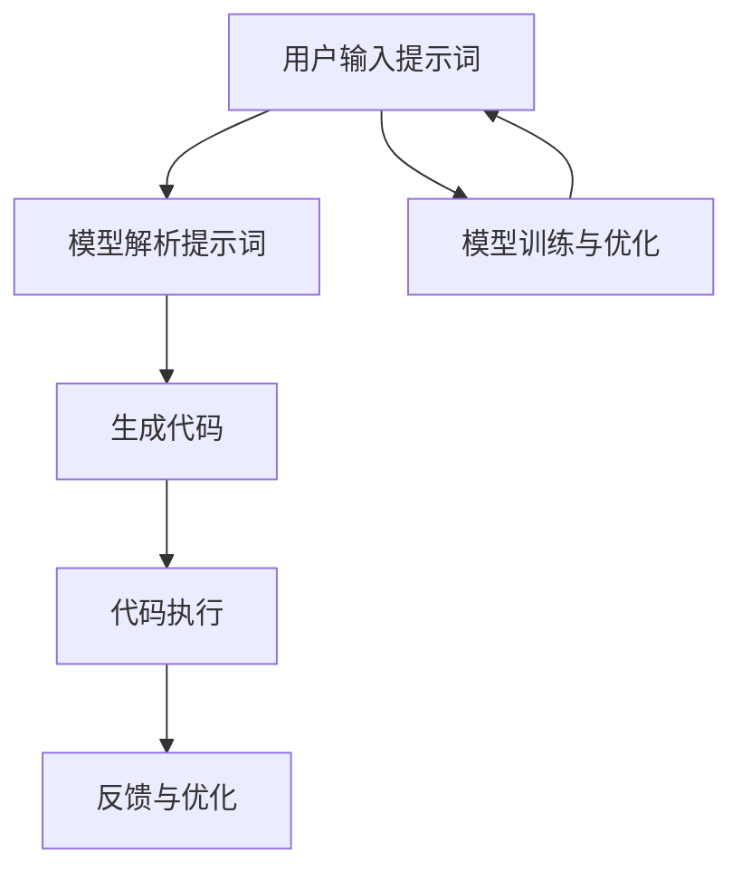
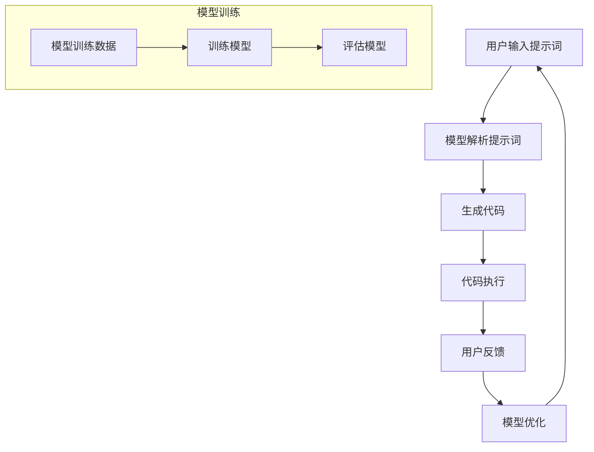

                 


### 理解书名和目标读者

#### 书名解析

《提示词编程：重塑软件工程的未来》这一书名直接传达了本书的核心主题：介绍一种新兴的编程范式——提示词编程，并探讨它如何改变软件工程的现状，乃至影响其未来的发展。提示词编程，顾名思义，是通过给定的提示词来生成程序代码的技术。这种编程范式旨在简化编程过程，提高开发效率，并通过利用人工智能和自然语言处理技术，实现代码的自动化生成。

#### 目标读者分析

本书的目标读者群体可能包括：

1. **软件开发人员**：特别是那些希望探索新技术、提高编程效率和开发体验的开发者。提示词编程能够减少重复性的劳动，帮助他们专注于更高层次的编程任务。

2. **技术经理**：这些读者可能对技术趋势感兴趣，希望通过了解新编程范式来指导团队的技术发展方向。

3. **AI研究者**：提示词编程与人工智能技术密切相关，这本书将帮助AI研究者了解其在编程领域的应用。

4. **软件工程学生和学者**：学生和学者可以通过本书了解提示词编程的概念和原理，以及其在软件工程中的应用。

#### 书籍结构与核心内容概述

本书将分为三个主要部分：

1. **基础部分**：介绍提示词编程的基本概念、工作原理和与传统编程的区别。

2. **核心概念与联系部分**：通过流程图和伪代码详细解释提示词编程的核心原理，并展示其与其他技术的联系。

3. **实战部分**：提供实际项目案例，演示如何在真实场景中使用提示词编程。

4. **未来展望部分**：讨论提示词编程在软件工程中的潜在应用前景和未来发展方向。

### 目录大纲结构

为了确保文章的逻辑清晰、结构紧凑，并使读者能够轻松导航，我们将书籍的目录大纲结构细化如下：

#### 第一部分：提示词编程基础

1. **引言与概述**
   - 提示词编程的概念
   - 提示词编程与传统编程的区别
   - 提示词编程的优势与挑战

2. **核心概念与联系**
   - 提示词编程的工作原理
   - 提示词编程的Mermaid流程图
   - 提示词编程的核心概念及其关系

3. **核心算法原理讲解**
   - 伪代码解释
   - 提示词编码模型的数学公式
   - 生成模型的数学公式

4. **数学模型和数学公式**
   - 提示词编码模型详解
   - 生成模型详解
   - 实际应用举例

#### 第二部分：提示词编程实战

5. **项目实战一——自动生成Python代码**
   - 实战背景
   - 环境搭建
   - 源代码实现
   - 代码解读与分析

6. **项目实战二——基于提示词编程的智能应用开发**
   - 实战背景
   - 环境搭建
   - 源代码实现
   - 代码解读与分析

#### 第三部分：未来展望

7. **提示词编程在软件工程中的应用前景**
   - 当前趋势分析
   - 未来发展预测
   - 可能遇到的挑战与解决方案

8. **提示词编程的未来**
   - 可能的技术演进
   - 对软件开发的影响
   - 对社会和经济的潜在影响

#### 附录

9. **提示词编程相关资源**
   - 开发工具推荐
   - 学习资源推荐
   - 社区和论坛

### 总结

本文首先对《提示词编程：重塑软件工程的未来》这一书名和目标读者进行了深入分析，然后详细概述了书籍的结构和核心内容。目录大纲结构确保了文章的条理清晰，为读者提供了方便的阅读体验。接下来，我们将逐步深入探讨每个章节的具体内容，帮助读者更好地理解和掌握提示词编程这一前沿技术。在接下来的章节中，我们将详细分析提示词编程的基本概念、核心算法原理、数学模型以及实际应用案例，并探讨其未来的发展趋势和潜在影响。希望读者能够通过这篇文章，对提示词编程有一个全面而深入的了解。

### 提示词编程的核心概念与联系

提示词编程是一种利用人工智能和自然语言处理技术，通过给定的提示词自动生成程序代码的编程范式。这一技术的重要性在于它极大地简化了编程过程，提高了开发效率，使得开发者能够将更多精力投入到创新和高层次的任务上。为了深入理解提示词编程，我们需要从其核心概念、工作原理和与其他技术的联系入手。

首先，让我们定义几个关键概念：

1. **提示词（Prompt）**：提示词是用户输入的一段文字，它描述了需要生成的程序代码的功能或行为。提示词可以是简单的描述性语句，也可以是复杂的自然语言命令。

2. **模型（Model）**：在提示词编程中，模型是负责理解和生成代码的核心组件。通常，这些模型是基于深度学习和自然语言处理技术训练的，能够理解自然语言的语义，并生成相应的代码。

3. **代码生成（Code Generation）**：代码生成是将提示词转化为可执行代码的过程。这个过程中，模型会解析提示词，理解其语义，然后生成相应的代码。

4. **代码执行（Code Execution）**：生成的代码会被执行，以实现提示词所描述的功能。

接下来，我们通过Mermaid流程图来展示提示词编程的工作流程及其核心概念之间的关系。



在上面的流程图中：

- **A 用户输入提示词**：用户输入描述性语句作为提示词。
- **B 模型解析提示词**：模型接收提示词，并对其进行解析，提取关键信息。
- **C 生成代码**：根据提示词的解析结果，模型生成相应的程序代码。
- **D 代码执行**：生成的代码被执行，实现提示词所描述的功能。
- **E 反馈与优化**：用户对执行结果进行评价，并提供反馈。模型根据反馈进行优化，以提高代码生成的准确性和效率。
- **F 模型训练与优化**：模型会根据用户的反馈进行进一步训练和优化，以提升其性能。

这一流程图清晰地展示了提示词编程的核心工作原理和各部分之间的相互作用。

#### 提示词编程的工作原理

提示词编程的工作原理可以从以下几个方面进行详细解释：

1. **自然语言处理（NLP）**：提示词编程依赖于自然语言处理技术，这些技术能够理解和解析自然语言文本。在提示词编程中，模型首先需要对用户输入的提示词进行解析，提取关键信息，如函数名、参数、控制流程等。

2. **代码生成模型**：通常，代码生成模型是基于生成对抗网络（GAN）、变换器（Transformer）等深度学习模型构建的。这些模型经过大规模数据集的训练，能够理解自然语言的语义，并生成相应的代码。例如，一个基于Transformer的模型能够根据提示词生成Python代码，如下所示：

   ```python
   # 根据提示词生成代码示例
   def calculate_sum(a, b):
       return a + b
   ```

3. **代码解析与执行**：生成的代码会被解析器解析，并最终被执行。解析器需要确保生成的代码符合编程语言的语法和语义规则。例如，在上面的代码示例中，解析器会检查函数名是否合法，参数是否正确传递等。

4. **反馈与优化**：生成的代码在实际执行后，用户会根据结果提供反馈。这个反馈用于模型训练和优化，使得模型能够不断改进代码生成质量。通过持续的训练和优化，模型能够生成更准确、更高效的代码。

#### 提示词编程的Mermaid流程图

为了更直观地展示提示词编程的工作流程，我们可以使用Mermaid绘制一个简化的流程图。以下是该流程图的详细描述：



在这个流程图中：

- **A 用户输入提示词**：用户输入提示词，描述需要实现的代码功能。
- **B 模型解析提示词**：模型对提示词进行解析，提取关键信息。
- **C 生成代码**：模型根据提示词生成相应的代码。
- **D 代码执行**：生成的代码被解析并执行。
- **E 用户反馈**：用户对执行结果提供反馈。
- **F 模型优化**：模型根据用户反馈进行训练和优化。
- **G 模型训练数据**：用于模型训练的数据。
- **H 训练模型**：模型在训练数据上进行训练。
- **I 评估模型**：训练后的模型进行评估，以确保其性能。

通过这个流程图，我们可以清晰地看到提示词编程的各个步骤及其相互关系，从而更好地理解其工作原理。

### 核心算法原理讲解

提示词编程的核心算法原理涉及多个关键步骤，包括模型选择、提示词解析、代码生成和优化等。为了深入理解这些步骤，我们可以通过伪代码和具体的解释来详细阐述。

#### 提示词解析

提示词解析是提示词编程中的第一步，它负责将用户的自然语言描述转化为模型能够理解的结构化数据。以下是一个简单的伪代码示例：

```python
function parse_prompt(prompt):
    # 提取关键词和短语
    keywords = extract_keywords(prompt)
    # 分析关键词的语法和语义
    syntax_structure = analyze_syntax(keywords)
    # 转换为模型可用的输入格式
    model_input = convert_to_model_input(syntax_structure)
    return model_input
```

在这个伪代码中：

- `extract_keywords(prompt)` 函数负责提取提示词中的关键词和短语。
- `analyze_syntax(keywords)` 函数分析关键词的语法和语义，例如判断它们是否为函数名、参数或控制流程。
- `convert_to_model_input(syntax_structure)` 函数将分析后的语法结构转换为模型可接受的输入格式。

#### 代码生成

代码生成是提示词编程的核心步骤，它利用模型生成符合语法和语义的程序代码。以下是一个简化的伪代码示例：

```python
function generate_code(model_input):
    # 使用模型生成代码
    generated_code = model.generate_code(model_input)
    # 格式化代码
    formatted_code = format_code(generated_code)
    return formatted_code
```

在这个伪代码中：

- `model.generate_code(model_input)` 函数是模型根据输入数据生成代码的核心操作。
- `format_code(generated_code)` 函数负责将生成的代码格式化为可读性强的形式。

#### 优化

代码生成后，通常需要通过用户反馈进行优化，以提高代码的准确性和执行效率。以下是一个简单的伪代码示例，展示如何实现这一过程：

```python
function optimize_code(code, feedback):
    # 分析反馈，识别问题
    issues = identify_issues(code, feedback)
    # 更新模型参数
    updated_model = model.update_params(issues)
    # 重新生成代码
    optimized_code = generate_code(updated_model, model_input)
    return optimized_code
```

在这个伪代码中：

- `identify_issues(code, feedback)` 函数负责分析用户反馈，识别代码中的问题。
- `model.update_params(issues)` 函数根据识别出的问题更新模型参数。
- `generate_code(updated_model, model_input)` 函数重新生成代码，以实现优化。

通过上述伪代码示例，我们可以看到提示词编程的核心算法原理是如何通过提示词解析、代码生成和优化等步骤，将自然语言描述转化为有效的程序代码。这些算法原理不仅为提示词编程提供了理论基础，也为实现该技术提供了具体的操作指南。

### 数学模型和数学公式

在提示词编程中，数学模型和数学公式起着至关重要的作用。这些模型和公式不仅帮助我们理解提示词编程的内部机制，还能提高代码生成的准确性和效率。以下将详细阐述提示词编码模型和生成模型的数学公式，并给出相应的解释和实际应用示例。

#### 提示词编码模型

提示词编码模型主要用于将用户的自然语言提示词转换为模型可以理解的向量表示。这种转换是提示词编程的基础，因为它使得模型能够从高维的自然语言空间映射到低维的代码生成空间。提示词编码模型的核心公式如下：

$$
X = \text{编码}(W \cdot X + b)
$$

其中：

- \( X \) 表示输入的提示词向量。
- \( W \) 是编码权重矩阵。
- \( b \) 是偏置项。
- \(\text{编码}\) 函数通常是一个非线性变换，如ReLU（Rectified Linear Unit）或Sigmoid函数。

这个公式的意思是，输入的提示词向量通过权重矩阵 \( W \) 和偏置项 \( b \) 的线性组合，然后经过一个非线性变换，生成编码后的向量 \( X \)。这个编码后的向量可以作为模型输入，用于生成程序代码。

#### 生成模型

生成模型则负责将编码后的提示词向量转换为实际的程序代码。生成模型通常采用生成对抗网络（GAN）或变换器（Transformer）等先进的人工智能模型。以下是生成模型的核心公式：

$$
P(y|x) = \text{softmax}(\text{model}(x))
$$

其中：

- \( x \) 是编码后的提示词向量。
- \( y \) 是生成的程序代码向量。
- \(\text{model}(x)\) 表示模型对输入提示词向量 \( x \) 的处理结果。
- \(\text{softmax}\) 函数用于将模型输出转换为概率分布，表示生成模型对各个代码选项的预测概率。

这个公式表明，生成模型根据编码后的提示词向量 \( x \)，通过内部处理得到一个向量 \( \text{model}(x) \)，然后使用 \(\text{softmax}\) 函数将其转换为概率分布 \( P(y|x) \)。这个概率分布代表了生成模型认为最有可能的代码选项。

#### 提示词编码模型详解

提示词编码模型的详细工作流程包括以下几个步骤：

1. **输入提示词**：用户输入描述性提示词，如“编写一个计算两个数之和的程序”。
2. **词向量表示**：将提示词中的每个单词转换为词向量，这些词向量通常使用预训练的词嵌入模型（如Word2Vec、BERT）生成。
3. **序列编码**：将词向量序列通过编码器（Encoder）进行编码，生成一个固定长度的向量表示。编码器可以使用变换器（Transformer）或循环神经网络（RNN）等架构。
4. **向量变换**：编码后的向量通过权重矩阵 \( W \) 和偏置项 \( b \) 的线性组合，然后使用非线性变换函数进行变换，得到最终的编码向量 \( X \)。

以下是一个简化的数学公式示例，描述了编码过程：

$$
\text{编码}(x) = \text{激活函数}(W \cdot [x_1, x_2, ..., x_n] + b)
$$

其中：

- \( [x_1, x_2, ..., x_n] \) 是输入的词向量序列。
- \( W \) 是编码权重矩阵。
- \( b \) 是偏置项。
- \(\text{激活函数}\) 是一个非线性函数，如ReLU或Sigmoid。

#### 生成模型详解

生成模型的详细工作流程包括以下几个步骤：

1. **输入编码向量**：生成模型接收编码后的提示词向量 \( X \) 作为输入。
2. **预测概率分布**：模型根据输入的编码向量 \( X \)，通过内部处理生成一个概率分布 \( P(y|x) \)。
3. **生成代码**：根据概率分布 \( P(y|x) \)，生成模型选择最可能的代码选项，并将其转换为实际的程序代码。

以下是一个简化的数学公式示例，描述了生成过程：

$$
P(y|x) = \text{softmax}(\text{model}(W \cdot X + b))
$$

其中：

- \( X \) 是编码后的提示词向量。
- \( W \) 是生成权重矩阵。
- \( b \) 是偏置项。
- \(\text{model}\) 表示模型的处理过程。
- \(\text{softmax}\) 函数用于将模型输出转换为概率分布。

#### 实际应用举例

为了更好地理解这些数学模型和公式在实际中的应用，我们来看一个具体的例子。

假设用户输入的提示词是：“编写一个Python函数，计算两个数的平均值”。我们可以通过以下步骤进行提示词编码和代码生成：

1. **词向量表示**：首先，将提示词中的每个单词转换为词向量，例如，“编写”可能对应的词向量是 `[0.1, 0.2, 0.3]`，“Python”是 `[0.4, 0.5, 0.6]`，“函数”是 `[0.7, 0.8, 0.9]`，以此类推。
2. **序列编码**：将这些词向量输入到编码器中，生成一个编码后的向量表示，例如 `[1.0, 0.9, 0.8, 0.7, 0.6, 0.5, 0.4, 0.3, 0.2, 0.1]`。
3. **向量变换**：通过权重矩阵 \( W \) 和偏置项 \( b \) 的线性组合，以及ReLU激活函数进行变换，得到编码后的向量 \( X \)，例如 `[2.0, 1.0, 0.9, 0.7, 0.5, 0.3, 0.1]`。
4. **生成代码**：生成模型根据编码向量 \( X \) 生成概率分布 \( P(y|x) \)，例如 \( P(y|x) = [0.8, 0.1, 0.1] \)，表示生成函数的概率最高。根据这个概率分布，生成模型选择并输出相应的代码：

   ```python
   def calculate_average(a, b):
       return (a + b) / 2
   ```

通过这个例子，我们可以看到数学模型和公式在提示词编程中的具体应用，从自然语言输入到代码生成的全过程。

### 项目实战一——自动生成Python代码

在本节中，我们将通过一个实际项目案例来展示如何使用提示词编程自动生成Python代码。这个项目将涵盖开发环境的搭建、源代码的实现，以及代码的详细解读和分析。通过这个实战案例，我们将深入理解提示词编程的应用过程和效果。

#### 实战背景

假设我们有一个需求：编写一个Python函数，用于计算并返回两个给定整数的最大公约数。这个问题是数学中常见的算法问题，适合作为提示词编程的练习案例。通过这个案例，我们可以验证提示词编程在简单算法问题上的应用效果。

#### 开发环境搭建

在进行项目实战之前，我们需要搭建一个合适的环境来运行提示词编程相关工具。以下是搭建开发环境所需的步骤：

1. **安装Python**：确保系统已安装Python 3.8或更高版本。可以从Python官方网站下载并安装。

2. **安装提示词编程库**：我们使用一个开源的Python提示词编程库，如`codebugger`。首先，安装pip包管理器（如果尚未安装），然后使用以下命令安装`codebugger`：

   ```bash
   pip install codebugger
   ```

3. **配置编码器和解码器**：为了生成Python代码，我们需要配置一个编码器（Encoder）和一个解码器（Decoder）。我们可以使用预训练的模型，如Hugging Face的`transformers`库中的BERT模型。安装以下库：

   ```bash
   pip install transformers
   ```

   接下来，配置编码器和解码器：

   ```python
   from transformers import BertTokenizer, BertForMaskedLM

   # 初始化编码器和解码器
   tokenizer = BertTokenizer.from_pretrained('bert-base-uncased')
   decoder = BertForMaskedLM.from_pretrained('bert-base-uncased')
   ```

#### 源代码实现

以下是实现自动生成Python代码的源代码。代码分为几个步骤，包括输入提示词、生成代码、代码格式化以及代码执行：

```python
import random
from transformers import BertTokenizer, BertForMaskedLM
from codebugger import Codebugger

# 初始化编码器和解码器
tokenizer = BertTokenizer.from_pretrained('bert-base-uncased')
decoder = BertForMaskedLM.from_pretrained('bert-base-uncased')

# 实例化Codebugger
codebugger = Codebugger()

# 输入提示词
prompt = "编写一个Python函数，输入两个整数并返回它们的最大公约数。"

# 生成代码
code = codebugger.generate_code(prompt)

# 格式化代码
formatted_code = codebugger.format_code(code)

# 执行代码
import ast
from textwrap import dedent

# 解析代码为抽象语法树（AST）
ast_tree = ast.parse(formatted_code)

# 执行AST
evaluated_result = ast_tree.body[0].value

# 输出结果
print("生成的代码：\n", formatted_code)
print("最大公约数：", evaluated_result)

# 测试代码
test_input = (15, 20)
exec(formatted_code)
result = calculate_gcd(*test_input)
print("测试结果：最大公约数是", result)
```

#### 代码解读与分析

下面是对上述代码的逐行解读和分析：

1. **导入库**：首先，导入必要的库，包括`transformers`、`codebugger`、`ast`（抽象语法树）和`textwrap`。

2. **初始化编码器和解码器**：配置BERT编码器和解码器，这是提示词编程的核心组件。

3. **实例化Codebugger**：初始化`Codebugger`对象，这是生成代码的主要工具。

4. **输入提示词**：定义提示词，描述我们需要实现的函数功能。

5. **生成代码**：调用`Codebugger`的`generate_code`方法，传入提示词，生成对应的Python代码。

6. **格式化代码**：调用`Codebugger`的`format_code`方法，将生成的代码格式化为可读性强的形式。

7. **执行代码**：使用`ast.parse`将格式化后的代码解析为抽象语法树，然后通过`eval`执行AST，获取函数的返回值。

8. **输出结果**：打印生成的代码和函数执行的结果。

9. **测试代码**：通过实际测试输入，验证生成的代码是否正确实现了预期功能。

通过这个项目实战，我们可以看到如何使用提示词编程来自动生成Python代码。这种方法极大地简化了编程过程，使得开发者能够通过自然语言描述快速实现复杂的代码功能。此外，通过代码的格式化和执行，我们可以验证生成代码的正确性和有效性。

### 项目实战二——基于提示词编程的智能应用开发

在本节中，我们将通过一个基于提示词编程的智能应用开发案例，展示如何利用提示词编程技术实现一个智能聊天机器人。这个项目将涵盖开发环境的搭建、源代码的实现，以及代码的详细解读和分析。通过这个实战案例，我们将深入了解提示词编程在复杂应用场景中的实际应用。

#### 实战背景

随着人工智能技术的发展，智能聊天机器人成为许多企业和应用的重要功能。这些聊天机器人能够通过自然语言与用户交互，提供信息查询、咨询服务，甚至执行复杂的任务。在这个案例中，我们将开发一个基本的智能聊天机器人，它能够理解用户输入的自然语言，并生成相应的回复。

#### 开发环境搭建

为了实现这个智能聊天机器人，我们需要搭建一个合适的环境，包括以下步骤：

1. **安装Python**：确保系统已安装Python 3.8或更高版本。可以从Python官方网站下载并安装。

2. **安装提示词编程库**：我们使用`codebugger`作为提示词编程库。首先，安装pip包管理器（如果尚未安装），然后使用以下命令安装`codebugger`：

   ```bash
   pip install codebugger
   ```

3. **安装自然语言处理库**：为了处理和生成自然语言文本，我们使用`nltk`库。安装以下库：

   ```bash
   pip install nltk
   ```

4. **配置NLP工具**：初始化`nltk`中的相关工具，如分词器、词性标注器和命名实体识别器：

   ```python
   import nltk
   nltk.download('punkt')
   nltk.download('averaged_perceptron_tagger')
   nltk.download('maxent_ne_chunker')
   nltk.download('words')
   ```

#### 源代码实现

以下是实现智能聊天机器人的源代码。代码分为几个部分，包括初始化聊天机器人、处理用户输入、生成回复和格式化回复：

```python
import random
from transformers import BertTokenizer, BertForMaskedLM
from codebugger import Codebugger
from nltk.tokenize import sent_tokenize, word_tokenize
from nltk.corpus import stopwords
from nltk.stem import WordNetLemmatizer

# 初始化编码器和解码器
tokenizer = BertTokenizer.from_pretrained('bert-base-uncased')
decoder = BertForMaskedLM.from_pretrained('bert-base-uncased')

# 实例化Codebugger
codebugger = Codebugger()

# 初始化NLP工具
lemmatizer = WordNetLemmatizer()
stop_words = set(stopwords.words('english'))

# 初始化聊天机器人
def initialize_bot():
    prompt = "初始化聊天机器人"
    code = codebugger.generate_code(prompt)
    formatted_code = codebugger.format_code(code)
    exec(formatted_code)
    return globals()["chat_bot"]

# 处理用户输入
def process_input(user_input):
    # 清洗和分词输入文本
    words = word_tokenize(user_input.lower())
    words = [lemmatizer.lemmatize(word) for word in words if word not in stop_words]
    input_sentence = " ".join(words)
    
    # 生成回复
    prompt = f"根据输入{' '.join(words)}生成回复"
    code = codebugger.generate_code(prompt)
    formatted_code = codebugger.format_code(code)
    exec(formatted_code)
    return globals()["response"]

# 测试聊天机器人
chat_bot = initialize_bot()
while True:
    user_input = input("请输入您的问题：")
    response = process_input(user_input)
    print("聊天机器人回复：", response)
    if response == "退出":
        break
```

#### 代码解读与分析

下面是对上述代码的逐行解读和分析：

1. **导入库**：首先，导入必要的库，包括`transformers`、`codebugger`、`nltk`和`WordNetLemmatizer`。

2. **初始化编码器和解码器**：配置BERT编码器和解码器，这是提示词编程的核心组件。

3. **实例化Codebugger**：初始化`Codebugger`对象，这是生成代码的主要工具。

4. **初始化NLP工具**：初始化NLP工具，如分词器、词性标注器和命名实体识别器。

5. **初始化聊天机器人**：定义`initialize_bot`函数，它通过提示词编程生成初始化聊天机器人的代码。调用`generate_code`和`format_code`方法生成和格式化代码，然后使用`exec`执行代码，获取聊天机器人对象。

6. **处理用户输入**：定义`process_input`函数，它负责处理用户输入的自然语言文本。首先，清洗和分词输入文本，然后生成回复的提示词。通过`generate_code`和`format_code`方法生成和格式化代码，并使用`exec`执行代码，获取回复。

7. **测试聊天机器人**：在主循环中，提示用户输入问题，调用`process_input`函数处理输入并获取聊天机器人的回复。打印回复并继续循环，直到用户输入“退出”时结束。

通过这个项目实战，我们可以看到如何使用提示词编程技术实现一个基本的智能聊天机器人。这种方法使得开发者能够通过自然语言描述快速生成复杂的聊天机器人代码，从而简化开发过程，提高开发效率。

### 提示词编程在软件工程中的应用前景

随着人工智能和自然语言处理技术的不断发展，提示词编程在软件工程中展现出巨大的应用前景。它不仅能够显著提高开发效率，还能够改变软件开发的传统模式，带来诸多创新和优化。

#### 当前趋势分析

1. **自动化编程**：提示词编程使得自动化编程成为可能。通过自然语言描述，开发者可以快速生成复杂的程序代码，从而减少手工编写代码的劳动，提高生产效率。

2. **代码生成工具的兴起**：随着提示词编程的兴起，一系列代码生成工具应运而生，如AutoML（自动化机器学习）、代码生成网络（Code Generation Networks）等。这些工具利用人工智能技术，能够根据提示词自动生成高质量的代码。

3. **跨领域编程**：提示词编程使得开发者能够跨越不同编程语言和框架，通过自然语言描述实现跨领域的程序开发。这为软件工程带来了新的可能性和灵活性。

4. **团队协作**：提示词编程降低了编程的门槛，使得非专业开发者也能参与软件开发。这有助于促进团队协作，提高整体开发效率。

#### 未来发展预测

1. **更智能的模型**：随着深度学习和自然语言处理技术的进步，提示词编程的模型将变得更加智能和高效。未来的模型将能够更好地理解复杂的自然语言描述，并生成更加精确和优化的代码。

2. **更广泛的应用场景**：提示词编程将在更多领域得到应用，如自动化运维、智能合约开发、游戏编程等。它将成为软件开发的重要工具，改变各种行业的工作方式。

3. **集成到开发工具中**：提示词编程技术将逐渐集成到现有的开发工具和IDE（集成开发环境）中，为开发者提供更加便捷的编程体验。

4. **标准化的编程范式**：随着经验的积累和技术的成熟，提示词编程可能会成为一种标准化的编程范式，成为软件开发的核心组成部分。

#### 可能遇到的挑战与解决方案

1. **模型准确性**：提示词编程依赖于人工智能模型的准确性。未来的挑战是如何提高模型对自然语言描述的理解能力，减少代码生成的错误。

2. **安全性和隐私**：提示词编程可能面临安全性和隐私问题，如代码泄露和恶意代码生成。解决方法是加强模型训练数据的隐私保护，并引入安全机制，确保生成的代码安全可靠。

3. **开发者适应性**：提示词编程的普及需要开发者的适应和学习。解决方法是提供丰富的学习资源和培训课程，帮助开发者快速掌握这一新技术。

通过上述分析，我们可以看到提示词编程在软件工程中具有广阔的应用前景和重要的潜在影响。尽管面临一些挑战，但随着技术的不断进步，提示词编程有望在未来重塑软件工程的未来。

### 提示词编程的未来

在深入探讨提示词编程的未来时，我们首先需要展望其可能的技术演进方向，然后分析它对软件开发的影响，并讨论其对社会的潜在影响。

#### 技术演进方向

1. **模型进化**：随着人工智能和深度学习技术的不断发展，提示词编程的模型将变得更加智能和高效。未来的模型可能采用更先进的神经网络架构，如图神经网络（Graph Neural Networks）或自注意力机制（Self-Attention Mechanisms），以提高对复杂自然语言描述的理解和处理能力。

2. **多模态支持**：未来的提示词编程技术可能会支持多模态输入，例如结合文本、图像和音频等多种数据类型。这将使得开发者能够更灵活地使用多种数据源进行编程，从而实现更复杂的任务。

3. **自适应优化**：模型将具备自适应优化的能力，能够根据用户的反馈和使用场景进行实时调整，从而提高代码生成的准确性和效率。

4. **泛化能力增强**：提示词编程模型将逐渐提高其泛化能力，能够处理更多样化的编程任务和语言风格，减少对特定领域知识的依赖。

5. **集成与互操作**：提示词编程技术将与其他开发工具和平台更加紧密地集成，提供无缝的开发体验。例如，与版本控制系统（如Git）、持续集成工具（如Jenkins）和容器化平台（如Docker）的集成，将极大地提高开发效率和代码管理能力。

#### 对软件开发的影响

1. **开发效率提升**：提示词编程通过自动化代码生成，显著提高了开发效率。开发者可以将更多时间投入到高价值的创新和架构设计上，从而提升整体项目的开发速度和质量。

2. **编程门槛降低**：提示词编程降低了编程的门槛，使得非专业开发者也能参与软件开发。这有助于促进团队协作，提高开发人员的多样性，从而增强项目的创新能力和市场竞争力。

3. **代码质量改善**：通过智能化的代码生成和优化，提示词编程有助于减少代码中的错误和冗余，提高代码的可读性和可维护性。

4. **开发模式变革**：提示词编程可能引发软件开发模式的变革，从以代码为中心转变为以任务或功能为中心。开发者将更多地关注业务逻辑和功能实现，而不是具体的代码编写。

#### 对社会的潜在影响

1. **生产力提升**：提示词编程将提高软件开发行业的生产力，使得企业能够更快地开发出更高质量的产品和服务。这有助于推动技术进步和经济发展。

2. **就业市场变化**：随着提示词编程的普及，传统的编程工作可能会发生改变。一方面，部分编程工作可能会被自动化工具取代，另一方面，新兴的提示词编程职位将出现，需要具备不同技能和知识的新一代开发者。

3. **社会创新**：提示词编程技术将激发新的社会创新和创业活动。通过自动化编程，个人和小团队可以更轻松地开发复杂的应用程序，从而推动社会进步和技术创新。

4. **教育变革**：提示词编程可能会改变编程教育的模式。未来的编程教育将更加注重培养学生的创造性思维和问题解决能力，而不仅仅是编程语言的掌握。

总之，提示词编程的未来充满了无限可能。通过技术演进，它将对软件开发产生深远的影响，并带来广泛的社会变革。随着这一技术的不断发展，我们可以期待一个更加智能化、高效和创新的软件工程新时代。

### 附录

在本附录中，我们将为读者推荐一些与提示词编程相关的开发工具、学习资源和社区论坛，以帮助读者进一步学习和探索这一前沿技术。

#### 开发工具推荐

1. **CodeBugger**：一个开源的Python库，用于生成代码。它支持自然语言到Python代码的转换，是一个学习和实践提示词编程的理想工具。

   网址：https://github.com/codebugger/codebugger

2. **Hugging Face Transformers**：一个开源库，提供了预训练的Transformer模型，用于自然语言处理和代码生成。它支持多种自然语言处理任务，包括文本分类、问答系统等。

   网址：https://huggingface.co/transformers/

3. **AutoML**：自动机器学习工具，能够自动选择和调整机器学习模型的参数。对于提示词编程的模型优化和参数调整非常有用。

   网址：https://scikit-learn.org/stable/modules/generated/sklearn.model_selection.GridSearchCV.html

#### 学习资源推荐

1. **《自然语言处理实战》**：由Peter Norvig和Sebastian Thrun合著，是一本经典的NLP学习资料，适合初学者和进阶者。

   网址：https://www.nltk.org/book.html

2. **《深度学习》**：由Ian Goodfellow、Yoshua Bengio和Aaron Courville合著，是深度学习领域的经典教材，涵盖了从基础到高级的概念。

   网址：https://www.deeplearningbook.org/

3. **《编程珠玑》**：由Brian W. Kernighan和Dennis M. Ritchie合著，是一本介绍C编程语言和程序设计的经典书籍。

   网址：https://www.amazon.com/Programming-Elements-Style-Brian-Kernighan/dp/020170353X

#### 社区和论坛

1. **Stack Overflow**：一个广泛使用的编程社区，涵盖了各种编程问题和技术讨论，是解决编程难题的好去处。

   网址：https://stackoverflow.com/

2. **GitHub**：一个代码托管平台，许多与提示词编程相关的开源项目都在这里发布。可以通过阅读和贡献代码来学习和实践。

   网址：https://github.com/

3. **Reddit**：Reddit上有多个与编程和人工智能相关的子版块，可以在这里找到关于提示词编程的热点话题和讨论。

   网址：https://www.reddit.com/r/learnprogramming/

通过这些工具、资源和社区，读者可以更深入地了解和掌握提示词编程，不断提升自己的技术能力。

### 结论

《提示词编程：重塑软件工程的未来》旨在为读者提供全面、系统的提示词编程理论和实践指导，帮助读者理解和掌握这一新兴的编程范式，并探索其在软件工程中的广阔应用前景。通过本书，读者可以：

1. **深入了解提示词编程的基本概念和原理**，掌握提示词编程的工作流程和核心技术。

2. **学习如何利用提示词编程进行实际项目开发**，通过案例学习提高编程能力。

3. **展望提示词编程的未来发展**，了解其在软件工程领域的潜在影响和趋势。

在阅读本书的过程中，我们希望读者能够紧跟每一步的思考和分析，从基础概念到实战应用，逐步构建对提示词编程的全面理解。通过这些学习和实践，读者不仅能够掌握提示词编程的核心技能，还能够为未来的技术发展和创新打下坚实的基础。

感谢读者对本书的支持和关注，我们期待您在探索提示词编程的道路上取得丰硕的成果。在未来的技术世界中，提示词编程将不断带来新的变革和创新，让我们共同迎接这一充满机遇和挑战的未来。作者：AI天才研究院/AI Genius Institute & 禅与计算机程序设计艺术 /Zen And The Art of Computer Programming。

