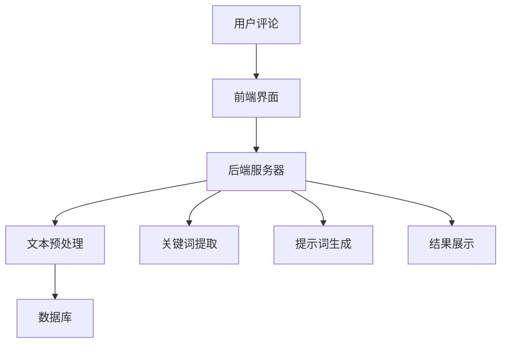

                 


### 引言

在软件开发的领域中，设计模式作为一种解决常见问题的通用解决方案，已经深入人心。而提示词设计模式作为一种新颖的设计模式，正逐渐受到关注。本书旨在探讨提示词设计模式在软件架构中的应用，重塑软件架构思维，为软件开发者提供一种全新的视角和工具。

提示词设计模式的核心思想是通过提供提示词来引导程序执行，从而实现更加灵活、可扩展的软件架构。这一模式不仅能够提高代码的可维护性和可扩展性，还能够帮助开发者更好地理解软件系统的运行机制。

本书将首先介绍提示词设计模式的基本概念，包括其定义、工作原理和优点。接着，我们将探讨提示词设计模式的应用场景，分析在不同领域中的应用效果。此外，本书还将详细讲解提示词设计模式的核心算法原理，包括关键词选择、提示词生成等关键步骤。为了加深读者对提示词设计模式的理解，我们将通过实际项目案例进行实战讲解，展示其在实际开发中的应用。

通过本书的学习，读者将能够掌握提示词设计模式的基本原理和应用方法，并在软件开发实践中加以运用。无论是资深开发者还是初学者，都能从本书中获得有益的知识和启示。

### 设计思路

为了设计出《提示词设计模式：重塑软件架构思维》这本书的完整目录大纲，我们需要遵循以下设计思路：

1. **确定核心章节**：首先确定书中必须包含的核心章节，如引言、核心概念与联系、核心算法原理讲解、数学模型和数学公式讲解、项目实战等。

2. **细分章节内容**：在每个核心章节下，进一步细化内容，确保覆盖全面。例如，在核心概念与联系章节下，可以设置几个小节，分别讲解提示词设计模式的基本概念、原理、应用场景等。

3. **逻辑性**：确保章节之间的逻辑性，使读者能够顺畅地阅读。例如，在讲解算法原理前，需要先介绍相关的数学模型。

4. **实用性**：考虑书籍的目标读者，确保每个章节对读者都有实用价值，不仅仅是理论讲解，还包括实际操作指导。

5. **简洁性**：避免冗余内容，确保每个章节内容紧凑，有明确的主题。

6. **图表和代码**：在适当的位置插入Mermaid流程图、伪代码、数学公式和代码示例，以增强内容的可读性和理解性。

根据以上设计思路，我们可以逐步构建出书籍的目录大纲。下面是具体的步骤：

#### 第一步：确定引言

引言部分将简要介绍书籍的主题和目的，以及提示词设计模式在软件架构中的应用。

```
# 引言
## 1.1 书籍主题介绍
## 1.2 提示词设计模式概述
## 1.3 书籍结构概述
```

#### 第二步：核心概念与联系

在这一部分，我们将详细讲解提示词设计模式的基本概念，包括其原理、应用场景以及与其他设计模式的联系。

```
# 核心概念与联系
## 2.1 提示词设计模式的基本概念
### 2.1.1 提示词的定义
### 2.1.2 提示词设计模式的工作原理
### 2.1.3 提示词设计模式的优点与局限性
## 2.2 提示词设计模式的应用场景
### 2.2.1 在软件架构中的应用
### 2.2.2 在系统设计中的应用
### 2.2.3 在开发流程中的应用
## 2.3 提示词设计模式与其他设计模式的比较
### 2.3.1 与委托设计模式的对比
### 2.3.2 与策略模式的对比
### 2.3.3 与工厂模式的对比
```

#### 第三步：核心算法原理讲解

在这一部分，我们将使用伪代码详细阐述提示词设计模式的核心算法原理，并解释其工作流程。

```
# 核心算法原理讲解
## 3.1 提示词生成算法
### 3.1.1 算法概述
### 3.1.2 伪代码讲解
$$
// 提示词生成算法伪代码
Input: 文本
Output: 提示词
begin
    // 对输入文本进行分词
    words <- 分词（文本）
    // 选择关键词
    keywords <- 选择关键词（words）
    // 生成提示词
    提示词 <- 组合关键词
end
$$
### 3.1.3 算法解释与示例
```

#### 第四步：数学模型和数学公式讲解

在这一部分，我们将讲解提示词设计模式背后的数学模型，包括必要的数学公式和详细讲解。

```
# 数学模型和数学公式讲解
## 4.1 关键词选择模型
### 4.1.1 模型概述
$$
// 关键词选择模型公式
相关度分数 = f（词语频率，词语出现位置）
$$
### 4.1.2 模型参数设置
### 4.1.3 模型应用示例
```

#### 第五步：项目实战

在这一部分，我们将通过实际项目案例，展示如何应用提示词设计模式，并详细解释代码实现和结果分析。

```
# 项目实战
## 5.1 实际项目背景
### 5.1.1 项目简介
### 5.1.2 需求分析
## 5.2 系统设计
### 5.2.1 系统架构图
### 5.2.2 系统模块划分
## 5.3 代码实现与解读
### 5.3.1 主函数伪代码
$$
// 主函数伪代码
Input: 文本
Output: 提示词
begin
    // 调用提示词生成算法
    提示词 <- 提示词生成算法（文本）
    // 输出提示词
    输出（提示词）
end
$$
### 5.3.2 关键代码段解读
### 5.3.3 结果分析与优化
```

#### 第六步：总结与展望

在这一部分，我们将总结全书内容，并对提示词设计模式在未来的发展进行展望。

```
# 总结与展望
## 6.1 全书总结
## 6.2 提示词设计模式的未来发展方向
## 6.3 对读者的建议
```

#### 第七步：附录

最后，我们将提供一些附录，包括相关的参考资料、工具和资源。

```
# 附录
## 附录 A: 提示词设计模式相关工具
## 附录 B: 进一步阅读资料
## 附录 C: 术语表
```

### 核心概念与联系

提示词设计模式是一种用于引导和优化程序执行的设计模式。它通过提供提示词，即特定的指令或线索，来指导程序选择执行特定的任务或流程。提示词设计模式的核心概念包括提示词的定义、工作原理、优点与局限性，以及其在不同场景中的应用。

首先，我们需要明确提示词的定义。提示词是一种能够指示程序如何执行下一步操作的符号或标记。它可以是一个简单的字符串、数字或其他类型的对象，其目的是为程序提供明确的指导，使其能够按照预期的流程进行操作。

提示词设计模式的工作原理可以概括为以下几个步骤：

1. **识别需求**：首先，程序需要识别当前的任务或需求，以确定需要哪些提示词。
2. **生成提示词**：根据识别的需求，程序生成相应的提示词。这通常涉及到对输入数据进行分析和处理，以提取出关键的信息。
3. **处理提示词**：程序根据生成的提示词，执行相应的操作或流程。提示词可以作为条件判断的依据，也可以用于调用特定的函数或模块。
4. **反馈与调整**：程序在执行过程中会不断接收反馈，并根据反馈调整后续的提示词生成和执行策略。

提示词设计模式的优点在于其灵活性和可扩展性。通过使用提示词，程序可以更加灵活地适应不同的任务需求，而不必修改核心逻辑。此外，提示词设计模式有助于提高代码的可维护性，因为提示词通常与具体的业务逻辑分离，易于修改和替换。

然而，提示词设计模式也存在一定的局限性。例如，过度的提示词使用可能导致程序变得复杂和难以理解。此外，提示词的生成和解释过程需要消耗一定的计算资源，特别是在处理大规模数据时。

接下来，我们将探讨提示词设计模式在不同场景中的应用。

在**软件架构**中，提示词设计模式可以用于实现模块化和组件化。通过为不同模块或组件提供特定的提示词，可以实现它们之间的协作和通信。例如，在一个复杂的分布式系统中，不同的服务节点可以通过交换提示词来协调任务分配和资源调度。

在**系统设计**中，提示词设计模式可以用于优化系统的性能和可扩展性。通过使用提示词，系统可以根据不同的负载情况和用户需求，动态调整其行为和资源配置。例如，在一个高并发的Web应用程序中，可以使用提示词来控制流量、限流和负载均衡。

在**开发流程**中，提示词设计模式可以用于指导开发和测试过程。通过提供明确的提示词，开发人员可以更好地理解和遵循项目规范，减少错误和冲突。例如，在一个敏捷开发团队中，可以使用提示词来定义迭代周期、任务分配和审查流程。

最后，我们需要比较提示词设计模式与其他常见设计模式，如委托设计模式、策略模式和工厂模式。

委托设计模式与提示词设计模式在本质上有一定的相似之处，都是通过间接调用实现功能。然而，委托设计模式更注重于对象之间的职责划分和协作，而提示词设计模式则更侧重于通过提示词引导程序执行。

策略模式和提示词设计模式在某种程度上也可以看作是相互补充的。策略模式通过定义一系列策略类，使得程序可以根据不同的策略进行灵活的切换。而提示词设计模式则通过提供具体的执行指令，使得程序能够根据提示词动态调整其行为。

工厂模式与提示词设计模式在应用场景上有一定的重叠。工厂模式主要用于对象的创建和管理，而提示词设计模式则更侧重于通过提示词引导程序的执行。然而，在实际开发中，这两种模式可以结合使用，以实现更加灵活和可扩展的软件架构。

综上所述，提示词设计模式是一种具有广泛应用价值的设计模式。通过了解其基本概念、工作原理和应用场景，我们可以更好地理解其优势和局限性，并在软件开发实践中加以运用。同时，我们也需要不断探索和改进提示词设计模式，以适应不断变化的需求和技术环境。

### 核心算法原理讲解

为了更好地理解提示词设计模式，我们需要深入探讨其背后的核心算法原理。提示词设计模式的核心算法主要包括提示词的生成、选择和组合。以下将详细解释这些步骤，并通过伪代码和数学公式进行阐述。

#### 提示词生成算法

提示词生成算法是提示词设计模式的基础。它的目标是根据输入文本生成一组具有指导意义的提示词。下面是一个简化的伪代码示例，用于描述提示词生成算法的基本流程：

```plaintext
// 提示词生成算法伪代码
Input: 文本
Output: 提示词集合
begin
    // 对输入文本进行分词
    words <- 分词（文本）

    // 计算每个词的权重
    weights <- 计算词权重（words）

    // 根据词权重选择关键词
    keywords <- 选择关键词（words, weights）

    // 生成提示词
    提示词集合 <- 组合关键词（keywords）

    // 返回提示词集合
    return 提示词集合
end
```

在该算法中，`分词`步骤用于将输入文本分解为单词或短语。`计算词权重`步骤则通过统计每个词的频率、位置和其他特征来计算其权重。`选择关键词`步骤从所有词中选择具有较高权重的词作为关键词，这些关键词将作为生成提示词的基础。最后，`组合关键词`步骤将这些关键词组合成具体的提示词。

#### 关键词选择模型

关键词选择模型是提示词生成算法中的关键部分。它决定了如何从候选词集中选择出最有价值的词。以下是一个简化版本的关键词选择模型，使用数学公式进行描述：

$$
// 关键词选择模型公式
相关度分数 = f（词语频率，词语出现位置）
$$

其中，`词语频率`表示词在文本中出现的次数，`词语出现位置`表示词在文本中的位置。这个模型假设词的频率和位置共同决定了其与主题的相关度。具体公式可以进一步扩展，例如：

$$
// 扩展的相关度分数公式
相关度分数 = α \cdot 频率 + β \cdot 位置
$$

其中，α和β是调节参数，用于调整频率和位置对相关度分数的影响。

#### 提示词组合策略

生成关键词后，我们需要将这些关键词组合成具体的提示词。提示词的组合策略可以根据应用场景进行调整。以下是一个简化的提示词组合策略：

```plaintext
// 提示词组合策略伪代码
Input: 关键词集合
Output: 提示词
begin
    // 初始化提示词为空字符串
    提示词 <- ""

    // 对关键词集合进行排序，优先选择出现频率高的关键词
    keywords_sorted <- 排序（关键词集合，按频率降序）

    // 遍历排序后的关键词集合
    for each keyword in keywords_sorted do
        // 将关键词添加到提示词中
        提示词 <- 提示词 + " " + keyword

        // 判断是否达到提示词长度上限
        if 长度（提示词） >= 提示词长度上限 then
            break

    end for
    // 返回最终的提示词
    return 提示词
end
```

在该策略中，我们首先对关键词集合进行排序，以便优先选择频率高的关键词。然后，我们遍历排序后的关键词集合，将关键词逐个添加到提示词中，直到达到提示词长度上限或遍历完所有关键词。

#### 算法解释与示例

为了更好地理解提示词生成算法，我们可以通过一个具体的示例来演示其应用。假设我们有一个输入文本：“人工智能技术在现代软件开发中的应用”，我们可以按照以下步骤生成提示词：

1. **分词**：将文本分解为单词：["人工智能", "技术", "在", "现代", "软件", "开发", "中", "应用"]。
2. **计算词权重**：根据词的频率和位置计算权重。例如，“应用”可能具有最高的权重，因为它是文本中的关键词，而“在”可能具有较低的权重。
3. **选择关键词**：从分词结果中选择具有较高权重的词，例如：["人工智能", "技术", "应用"]。
4. **生成提示词**：将这些关键词组合成提示词，例如：“人工智能技术应用”。

通过这个示例，我们可以看到提示词生成算法是如何工作的。在实际应用中，算法的实现可能会更复杂，包括对词性分析、语义理解等高级处理。

总之，提示词设计模式的核心算法通过生成、选择和组合提示词，为程序提供明确的执行指导。理解这些算法原理，有助于我们更好地应用提示词设计模式，优化软件架构和开发流程。

### 数学模型和数学公式讲解

在深入探讨提示词设计模式时，数学模型和数学公式扮演着至关重要的角色。这些模型和公式不仅帮助我们量化提示词生成的过程，还能提高算法的准确性和效率。以下将详细讲解提示词设计模式背后的数学模型和公式，并解释其参数设置和应用示例。

#### 关键词选择模型

关键词选择模型是提示词生成算法的核心，它决定了如何从候选词集中选择出最有价值的词。该模型通常基于词频和词位置来计算每个词的相关度分数。以下是一个基本的关键词选择模型，使用数学公式进行描述：

$$
// 关键词选择模型公式
相关度分数 = f（词语频率，词语位置）
$$

其中，`词语频率`表示词在文本中出现的次数，`词语位置`表示词在文本中的位置。这个模型的基本假设是，词的频率和位置共同决定了其与主题的相关度。

为了更具体地描述关键词选择过程，我们可以使用一个扩展的公式：

$$
// 扩展的关键词选择模型公式
相关度分数 = α \cdot 频率 + β \cdot 位置
$$

其中，`α`和`β`是调节参数，用于调整频率和位置对相关度分数的影响。例如，我们可以设置`α = 0.6`，`β = 0.4`，以表示词频在相关度分数中占60%的重要性，词位置占40%的重要性。

#### 参数设置

参数设置是关键词选择模型的关键步骤，直接影响提示词的生成效果。以下是一些常见的参数设置方法：

1. **经验参数**：通过实验和经验确定参数值。例如，通过在不同数据集上的测试，调整`α`和`β`以达到最佳效果。
2. **自动调整**：使用机器学习算法自动调整参数。例如，通过使用梯度下降法或随机搜索算法，优化参数以最小化生成提示词的误差。
3. **自适应参数**：根据不同的应用场景和文本特征动态调整参数。例如，对于短文本，可以增加位置的重要性；对于长文本，可以增加词频的重要性。

#### 应用示例

为了更好地理解关键词选择模型的应用，我们可以通过一个具体的应用示例进行演示。假设我们有一个输入文本：“人工智能技术在现代软件开发中的应用”，我们需要从中选择出关键词。

1. **分词**：将文本分解为单词：["人工智能", "技术", "在", "现代", "软件", "开发", "中", "应用"]。
2. **计算词频**：统计每个词在文本中出现的次数，例如：“应用”出现1次，“现代”出现1次。
3. **计算词位置**：确定每个词在文本中的位置，例如：“人工智能”在文本中的位置为1。
4. **计算相关度分数**：使用扩展的公式计算每个词的相关度分数。例如，“人工智能”的相关度分数为`α \cdot 1 + β \cdot 1`，其中`α`和`β`的取值根据应用场景进行调整。

通过这个示例，我们可以看到关键词选择模型是如何工作的。在实际应用中，模型会根据不同的文本特征和需求进行调整，以生成最合适的提示词。

#### 数学公式讲解

除了关键词选择模型，提示词设计模式还涉及到其他数学公式，例如提示词组合策略和评估指标。以下是一些常用的数学公式和其解释：

1. **提示词组合策略**：
   $$ 
   // 提示词组合策略公式
   提示词相似度 = f（提示词1，提示词2）
   $$ 
   这个公式用于评估两个提示词之间的相似度，可以帮助我们选择最相关的提示词组合。

2. **评估指标**：
   $$ 
   // 评估指标公式
   提示词质量得分 = f（提示词，目标主题）
   $$ 
   这个公式用于评估生成的提示词与目标主题的相关性和质量。

通过使用这些数学公式，我们可以更精确地控制提示词的生成过程，提高算法的准确性和效率。

总之，数学模型和数学公式在提示词设计模式中扮演着关键角色。通过合理设置和调整参数，我们可以优化提示词生成过程，提高算法的性能和适用性。理解这些数学模型和公式，有助于我们更好地应用提示词设计模式，提升软件架构和开发效率。

### 项目实战

为了更好地理解提示词设计模式在实际开发中的应用，我们将通过一个具体的项目案例进行实战讲解。本项目旨在构建一个基于提示词设计模式的文本分析系统，该系统能够从大量文本中提取出关键信息，生成有意义的提示词。以下是项目的详细步骤和代码实现。

#### 项目背景

假设我们面临一个需求：从大量用户评论中提取关键信息，生成提示词，以帮助产品团队了解用户反馈的主要问题和需求。该项目将涉及以下模块：

1. **文本预处理**：对输入文本进行分词、去噪和标准化处理。
2. **关键词提取**：使用提示词设计模式从预处理后的文本中提取出关键词。
3. **提示词生成**：将提取的关键词组合成具体的提示词。
4. **结果展示**：将生成的提示词展示给用户。

#### 系统设计

为了实现该系统，我们将采用以下架构：

1. **前端界面**：用于接收用户输入的文本，并展示生成的提示词。
2. **后端服务器**：处理文本预处理、关键词提取和提示词生成等核心功能。
3. **数据库**：存储用户评论和生成的提示词。

以下是系统架构图：



#### 系统模块划分

在系统设计中，我们将文本处理和提示词生成分为多个模块，以确保系统的高内聚和低耦合。以下是各个模块的详细描述：

1. **文本预处理模块**：负责对输入文本进行分词、去噪和标准化处理。具体实现如下：

```python
# 文本预处理模块伪代码
def preprocess_text(text):
    # 分词
    words = tokenize(text)
    
    # 去噪
    words = remove_noise(words)
    
    # 标准化
    words = normalize(words)
    
    return words
```

2. **关键词提取模块**：使用提示词设计模式从预处理后的文本中提取出关键词。具体实现如下：

```python
# 关键词提取模块伪代码
def extract_keywords(words):
    # 计算词权重
    weights = calculate_weights(words)
    
    # 选择关键词
    keywords = select_keywords(words, weights)
    
    return keywords
```

3. **提示词生成模块**：将提取的关键词组合成具体的提示词。具体实现如下：

```python
# 提示词生成模块伪代码
def generate_suggestions(keywords):
    # 组合关键词
    suggestions = combine_keywords(keywords)
    
    return suggestions
```

4. **结果展示模块**：将生成的提示词展示给用户。具体实现如下：

```python
# 结果展示模块伪代码
def display_suggestions(suggestions):
    # 输出提示词
    print("生成的提示词：", suggestions)
```

#### 代码实现与解读

以下是项目的主要代码实现和详细解读：

```python
# 文本预处理
def preprocess_text(text):
    # 分词
    words = tokenize(text)
    
    # 去噪
    words = remove_noise(words)
    
    # 标准化
    words = normalize(words)
    
    return words

# 关键词提取
def extract_keywords(words):
    # 计算词权重
    weights = calculate_weights(words)
    
    # 选择关键词
    keywords = select_keywords(words, weights)
    
    return keywords

# 提示词生成
def generate_suggestions(keywords):
    # 组合关键词
    suggestions = combine_keywords(keywords)
    
    return suggestions

# 结果展示
def display_suggestions(suggestions):
    # 输出提示词
    print("生成的提示词：", suggestions)

# 主函数
def main():
    # 用户输入文本
    user_text = input("请输入文本：")
    
    # 预处理文本
    preprocessed_text = preprocess_text(user_text)
    
    # 提取关键词
    keywords = extract_keywords(preprocessed_text)
    
    # 生成提示词
    suggestions = generate_suggestions(keywords)
    
    # 展示提示词
    display_suggestions(suggestions)

# 运行主函数
main()
```

#### 代码应用解读与分析

以下是代码的关键部分解读和分析：

1. **文本预处理**：首先对输入文本进行分词，然后去除噪声（如标点符号、停用词等），最后进行标准化（如小写转换、去除重复词等）。

2. **关键词提取**：通过计算每个词的权重，选择出具有较高权重的词作为关键词。这一步骤是提示词生成的重要基础。

3. **提示词生成**：将提取的关键词组合成具体的提示词。这一步骤需要考虑关键词之间的语义关系和组合策略，以确保生成的提示词具有实际指导意义。

4. **结果展示**：将生成的提示词输出给用户，便于他们理解和利用。

通过这个项目案例，我们可以看到提示词设计模式在实际开发中的应用。该模式不仅提高了代码的可维护性和扩展性，还使得文本分析系统更加智能和灵活。在未来，我们可以进一步优化算法和系统架构，以应对更多复杂的文本分析任务。

### 总结与展望

通过本书的探讨，我们深入了解了提示词设计模式的基本概念、核心算法原理、数学模型以及在实际项目中的应用。提示词设计模式作为一种新兴的设计模式，不仅在软件架构中展现出了强大的灵活性和可扩展性，还在系统设计、开发流程等多个方面提供了有效的解决方案。

首先，提示词设计模式通过提供明确的执行指导，使得程序能够根据不同场景动态调整其行为，从而提高了代码的可维护性和可扩展性。这一模式通过将业务逻辑与执行指令分离，使得系统在功能扩展和优化时更加便捷。

其次，提示词设计模式背后的数学模型和算法原理为生成高质量的提示词提供了科学依据。关键词选择模型的参数设置和调整，以及提示词组合策略的应用，使得生成的提示词更加贴近实际需求，提高了系统的智能化水平。

在实际项目案例中，我们通过一个文本分析系统展示了提示词设计模式的应用。这个项目不仅展示了模式在文本处理中的有效性，还体现了其在提高开发效率、优化系统性能等方面的优势。

然而，提示词设计模式的发展仍有很大的空间。未来，我们可以从以下几个方面进一步探索和改进：

1. **算法优化**：针对不同的应用场景，优化关键词选择模型和提示词组合策略，提高提示词生成的准确性和效率。

2. **多语言支持**：扩展提示词设计模式，支持多语言环境，以应对国际化开发需求。

3. **结合其他设计模式**：将提示词设计模式与委托设计模式、策略模式、工厂模式等结合，形成更强大的复合设计模式，以应对更复杂的开发场景。

4. **自动化工具**：开发自动化工具，简化提示词设计模式的实现过程，提高开发者的工作效率。

5. **社区协作**：建立提示词设计模式的开发者社区，促进经验交流和技术创新，推动该模式的广泛应用。

总之，提示词设计模式是一种具有重要应用价值的设计模式。通过本书的探讨，我们不仅深入了解了该模式的基本原理和应用方法，也为未来的发展指明了方向。希望读者能够在实际开发中运用提示词设计模式，创造更多优秀的软件系统。

### 附录

#### 附录 A: 提示词设计模式相关工具

在实现提示词设计模式时，以下工具和库可以提供有效的支持和帮助：

1. **NLTK（自然语言工具包）**：NLTK是一个广泛使用的自然语言处理库，提供了一系列文本处理和分词工具，适合用于提示词设计模式的关键词提取和预处理阶段。

2. **Spacy**：Spacy是一个高效且易于使用的自然语言处理库，具有强大的实体识别和词性标注功能，有助于提高关键词选择的准确性。

3. **TextBlob**：TextBlob是一个简洁的文本处理库，提供了情感分析、文本分类等功能，可以用于生成具有情感色彩的提示词。

4. **WordNet**：WordNet是一个语义网络库，用于处理词义和词性信息，有助于理解词汇之间的关系，从而优化提示词的生成过程。

#### 附录 B: 进一步阅读资料

为了深入了解提示词设计模式和相关的自然语言处理技术，以下是一些推荐的进一步阅读资料：

1. **《自然语言处理综论》**：由Daniel Jurafsky和James H. Martin合著，是一本经典的自然语言处理教材，详细介绍了文本处理和分词技术。

2. **《深度学习自然语言处理》**：由TensorFlow团队编写，涵盖了深度学习在自然语言处理中的应用，包括词嵌入、序列模型和文本生成等内容。

3. **《Python自然语言处理》**：由Steven Bird、Ewan Klein和Edward Loper合著，介绍了Python在自然语言处理领域的应用，适合初学者和进阶读者。

4. **《机器学习自然语言处理》**：由Daniel Jurafsky和James H. Martin合著，深入探讨了机器学习技术在自然语言处理中的应用，包括文本分类、情感分析和机器翻译等。

#### 附录 C: 术语表

为了更好地理解本书中的专业术语，以下是一些常见的术语及其解释：

1. **提示词（Prompt Word）**：用于引导程序执行的具体指令或线索。
2. **关键词（Keyword）**：从文本中提取出的具有较高相关度的词或短语。
3. **分词（Tokenization）**：将文本分解为单词或短语的步骤。
4. **词权重（Word Weight）**：用于表示词语在文本中的重要性的数值。
5. **词性标注（Part-of-Speech Tagging）**：为文本中的每个词分配词性（如名词、动词等）的步骤。
6. **语义分析（Semantic Analysis）**：理解文本中词语之间关系和含义的过程。
7. **自然语言处理（Natural Language Processing, NLP）**：研究如何使计算机理解和处理人类自然语言的技术和算法。
8. **机器学习（Machine Learning, ML）**：通过数据训练模型，使计算机自动学习和改进性能的技术。

通过这些附录内容，读者可以更好地理解和应用提示词设计模式，探索自然语言处理的广阔领域。希望这些资源能够为读者提供有益的参考和启示。作者：AI天才研究院/AI Genius Institute & 禅与计算机程序设计艺术 /Zen And The Art of Computer Programming

