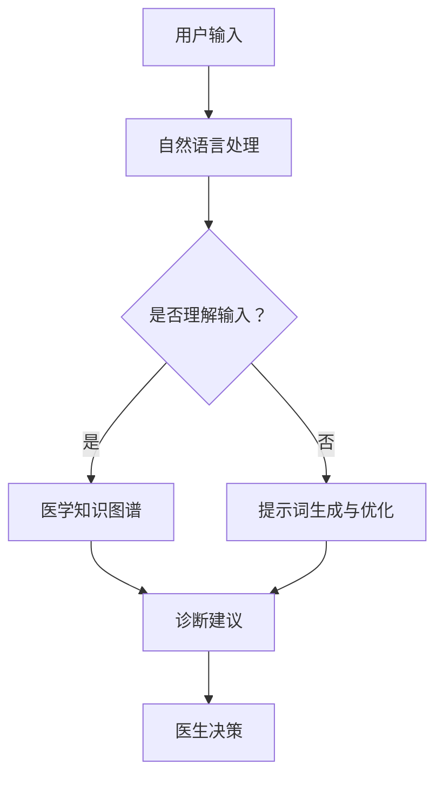
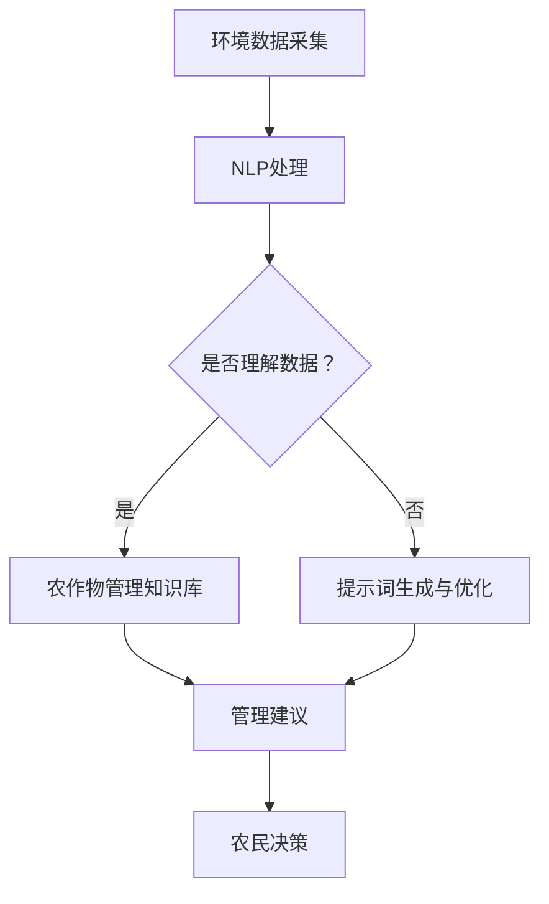
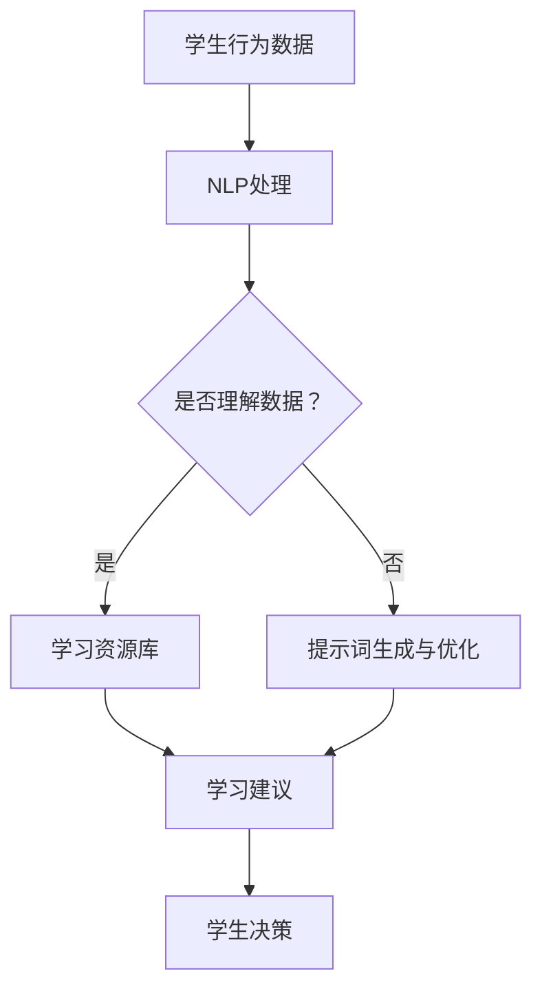

                 

### 文章标题

《提示词设计的跨维度生命沟通理论研究》

提示词设计作为人工智能领域的关键技术，正逐渐展现出其在跨维度生命沟通中的广泛应用潜力。本文旨在深入探讨提示词设计的概念、理论基础、方法技术以及实际应用，并分析其在跨维度生命沟通中的重要性。通过细致的理论分析和实践探讨，本文将为跨维度生命沟通的进一步发展提供理论支持和实践指导。

关键词：提示词设计、跨维度生命沟通、人工智能、通信协议、应用实践

摘要：本文首先概述了提示词设计的基本概念和重要性，随后介绍了跨维度生命沟通的定义和理论基础。接着，本文探讨了提示词设计在跨维度生命沟通中的应用方法及其影响。在方法与技术部分，详细阐述了提示词生成与优化的算法，跨维度生命沟通的通信协议与数据模型。随后，本文通过具体领域案例，展示了提示词设计的实际应用。最后，本文对未来的发展趋势和挑战进行了展望，并提出了相应的解决策略。希望通过本文的研究，能够推动提示词设计在跨维度生命沟通中的进一步发展。

---

### 目录大纲

# 《提示词设计的跨维度生命沟通理论研究》

## 第一部分：概念与理论基础

### 1. 提示词设计概述
#### 1.1 提示词的定义
#### 1.2 提示词设计的重要性
#### 1.3 提示词设计的基本原则

### 2. 跨维度生命沟通理论
#### 2.1 跨维度生命沟通的定义
#### 2.2 跨维度生命沟通的理论基础
#### 2.3 跨维度生命沟通的特点与挑战

### 3. 提示词设计在跨维度生命沟通中的应用
#### 3.1 提示词设计对跨维度生命沟通的影响
#### 3.2 跨维度生命沟通中提示词的应用方法
#### 3.3 跨维度生命沟通中的案例分析

## 第二部分：方法与技术

### 4. 提示词设计方法
#### 4.1 提示词生成的算法
#### 4.2 提示词优化的技术
#### 4.3 提示词评估与反馈机制

### 5. 跨维度生命沟通技术
#### 5.1 跨维度生命沟通的通信协议
#### 5.2 跨维度生命沟通的数据模型
#### 5.3 跨维度生命沟通的安全与隐私保护

### 6. 提示词设计与跨维度生命沟通的融合
#### 6.1 融合的设计理念
#### 6.2 融合的实现方法
#### 6.3 融合的优势与挑战

## 第三部分：应用与实践

### 7. 提示词设计在具体领域的应用
#### 7.1 提示词设计在医疗领域的应用
#### 7.2 提示词设计在农业领域的应用
#### 7.3 提示词设计在教育领域的应用

### 8. 跨维度生命沟通案例研究
#### 8.1 案例一：智能医疗系统
#### 8.2 案例二：智慧农业系统
#### 8.3 案例三：远程教育平台

### 9. 提示词设计实践指南
#### 9.1 实践步骤与流程
#### 9.2 实践中的常见问题与解决策略
#### 9.3 提示词设计实践案例分析

## 第四部分：未来展望与挑战

### 10. 提示词设计的发展趋势
#### 10.1 技术创新的方向
#### 10.2 应用领域的扩展
#### 10.3 社会影响的思考

### 11. 跨维度生命沟通的未来
#### 11.1 新的技术挑战
#### 11.2 新的应用模式
#### 11.3 跨维度生命沟通伦理问题

### 12. 总结与展望
#### 12.1 书籍内容的总结
#### 12.2 未来研究的方向
#### 12.3 对读者的话

## 附录

### A. 提示词设计与跨维度生命沟通相关工具与资源
#### A.1 主流提示词生成工具
#### A.2 跨维度生命沟通平台介绍
#### A.3 相关学术论文与书籍推荐

---

在接下来的文章中，我们将逐步深入探讨提示词设计的跨维度生命沟通理论，从基本概念、理论基础到具体应用，再到未来的发展趋势和挑战，力求为读者提供全面而深入的理解。通过本篇文章的研究，希望能够为跨维度生命沟通领域的进一步发展贡献智慧。让我们一起开启这场探索之旅。 <markdown>

### 第一部分：概念与理论基础

在探讨提示词设计的跨维度生命沟通理论之前，首先需要明确几个核心概念：提示词、设计原理、跨维度生命沟通及其理论基础。

#### 1. 提示词设计概述

**1.1 提示词的定义**

提示词，通常指用于引导模型生成文本、图像或其他数据的人工提示或关键词。在人工智能领域，尤其是自然语言处理（NLP）和计算机视觉（CV）中，提示词被视为一种重要的输入，能够显著影响模型的输出结果。有效的提示词设计能够提高模型性能，使其更加精准和有针对性。

**1.2 提示词设计的重要性**

提示词设计在人工智能系统中扮演着关键角色。首先，它直接影响模型的响应质量。例如，在一个问答系统中，合适的提示词能够引导模型生成准确且相关的答案。其次，提示词设计有助于提升用户体验。通过设计易于理解且具有启发性的提示词，系统能够更好地与用户互动，从而提高用户满意度。

**1.3 提示词设计的基本原则**

（1）明确性：提示词应简洁明了，避免使用模糊或歧义性的语言。

（2）针对性：提示词应针对具体的应用场景和用户需求，确保其与任务目标高度匹配。

（3）多样性：多样化的提示词能够帮助模型学习更广泛的语境和语义，从而提高其泛化能力。

（4）优化性：提示词的设计应不断优化，以适应模型和任务的动态变化。

#### 2. 跨维度生命沟通理论

**2.1 跨维度生命沟通的定义**

跨维度生命沟通指的是不同维度或空间的生命形式之间进行的交流与互动。这一概念超越了传统的人类与机器、动物之间的交互，涉及更为广阔的宇宙和生命形式。在人工智能和跨学科研究中，跨维度生命沟通被广泛应用于探索宇宙奥秘、生物科技以及未来的智能生命形态。

**2.2 跨维度生命沟通的理论基础**

跨维度生命沟通的理论基础包括量子通信、脑机接口、虚拟现实等多个领域。量子通信提供了在微观尺度上进行高速、安全通信的可能；脑机接口使得人类思维与机器系统实现直接交互；虚拟现实技术则搭建了虚拟与现实的桥梁，为跨维度交流提供了技术支撑。

**2.3 跨维度生命沟通的特点与挑战**

**特点：**

1. **多维性**：跨维度生命沟通涉及多个维度的交互，包括物理维度、信息维度和认知维度等。

2. **异质性**：参与沟通的生命体可能具有不同的生理结构、认知能力和信息处理方式。

3. **复杂性**：跨维度生命沟通涉及复杂的信号转换和解析过程，需要高精度的算法和模型支持。

**挑战：**

1. **信号传输与解析**：如何实现高效、准确的信号传输和解析是跨维度生命沟通面临的重大挑战。

2. **安全性**：在跨维度通信中，如何保证数据传输的安全性是另一个重要问题。

3. **伦理与道德**：随着跨维度生命沟通技术的发展，相关的伦理和道德问题也将逐渐显现。

---

在接下来的章节中，我们将进一步探讨提示词设计在跨维度生命沟通中的应用，分析其在跨维度生命沟通中的具体影响，并探讨一些实际案例。通过这些讨论，希望能够为跨维度生命沟通的研究和实践提供新的思路和方向。 <markdown>

### 3. 提示词设计在跨维度生命沟通中的应用

提示词设计在跨维度生命沟通中的应用具有深远的影响。其重要性不仅体现在提升通信效率和准确性方面，还在于它能够促进不同维度生命体之间的有效互动。

#### 3.1 提示词设计对跨维度生命沟通的影响

**3.1.1 提升通信效率**

有效的提示词设计能够提高跨维度生命沟通的效率。通过精准的提示词，系统可以迅速识别和响应不同维度生命体的需求，减少不必要的通信延迟和信息丢失。例如，在医疗领域，提示词可以帮助医生快速获取患者的重要信息，从而提高诊断和治疗的效率。

**3.1.2 提高通信准确性**

提示词的设计直接关系到通信的准确性。恰当的提示词能够引导系统生成准确且相关的输出，减少误解和错误。在跨维度通信中，这一点尤为重要，因为不同维度的生命体可能有不同的语言、符号和信息表达方式。

**3.1.3 促进跨维度互动**

提示词设计不仅影响通信的效率和准确性，还能够在不同维度之间建立互动的桥梁。通过设计多样化的提示词，系统可以模拟和模仿不同维度的语言和行为，从而促进跨维度的互动和交流。

#### 3.2 跨维度生命沟通中提示词的应用方法

**3.2.1 提示词生成方法**

提示词的生成是跨维度生命沟通中的关键步骤。一种常见的方法是基于大数据和机器学习算法。通过分析大量的跨维度数据，系统可以自动生成与特定场景和需求相关的提示词。具体来说，可以采用以下步骤：

1. **数据收集**：收集跨维度生命沟通的文本、图像、音频等多媒体数据。
2. **特征提取**：使用自然语言处理（NLP）和计算机视觉（CV）技术提取数据中的关键特征。
3. **模式识别**：利用机器学习算法（如深度神经网络）识别和提取与特定场景和需求相关的模式。
4. **提示词生成**：根据识别的模式生成相应的提示词。

**3.2.2 提示词优化方法**

提示词生成后，还需要进行优化，以确保其在实际应用中的效果。优化方法包括：

1. **语义分析**：对提示词进行语义分析，确保其含义准确、清晰。
2. **多模态融合**：结合不同模态的信息（如文本、图像、音频），生成更具综合性的提示词。
3. **用户反馈**：收集用户的反馈，根据用户的需求和体验对提示词进行调整和优化。

**3.2.3 提示词评估与反馈机制**

提示词的评估与反馈是保证其质量的重要环节。可以通过以下方法进行评估：

1. **性能评估**：使用评估指标（如准确率、召回率、F1分数等）对提示词的性能进行评估。
2. **用户满意度**：通过用户调查和体验反馈，评估提示词的用户满意度。
3. **迭代优化**：根据评估结果，对提示词进行迭代优化，不断提升其质量和效果。

---

#### 3.3 跨维度生命沟通中的案例分析

为了更好地理解提示词设计在跨维度生命沟通中的应用，下面我们通过几个具体的案例进行分析。

**案例一：智能医疗系统**

在智能医疗系统中，提示词设计对于医生和患者的沟通至关重要。例如，医生可以使用提示词来引导患者提供关键的病史和症状信息。一个有效的提示词可能包括：“您最近的饮食是否有变化？”、“您是否有定期体检？”。通过这些明确的提示词，医生可以迅速获取重要信息，提高诊断和治疗的效率。

**案例二：智慧农业系统**

在智慧农业中，提示词设计可以用于指导农民进行农作物管理和决策。例如，系统可以提供如“预计降雨量：10毫米”、“土壤湿度：适中”等提示词，帮助农民制定合适的灌溉和施肥计划。这些提示词不仅提高了农业生产的效率，还减少了资源浪费。

**案例三：远程教育平台**

在远程教育中，提示词设计对于学生的参与度和学习体验同样重要。教师可以使用如“请同学们思考以下问题：”、“讨论主题：XX”等提示词，激发学生的思维和互动。此外，系统还可以根据学生的学习进度和反馈，自动生成个性化的学习提示词，从而提高教学效果。

通过这些案例分析，我们可以看到提示词设计在跨维度生命沟通中的重要性。无论是在医疗、农业还是教育领域，有效的提示词设计都能够显著提升通信的效率、准确性和互动性，从而为不同维度生命体之间的沟通提供强有力的支持。在接下来的章节中，我们将进一步探讨提示词设计的方法和技术，以期为跨维度生命沟通的发展提供更加深入的指导。 <markdown>

### 第二部分：方法与技术

在探讨了提示词设计的跨维度生命沟通应用之后，接下来我们将详细讨论提示词设计的方法与技术。这一部分将分为两个主要部分：提示词设计方法和跨维度生命沟通技术。

#### 4. 提示词设计方法

**4.1 提示词生成的算法**

提示词生成是提示词设计的核心步骤。常用的方法包括基于规则的方法、统计方法和机器学习方法。

1. **基于规则的方法**：
   - 原理：通过人工定义的规则，生成提示词。这种方法简单直观，但灵活性和适应性较差。
   - 应用：适用于结构化数据清晰的场景，如数据库查询系统。
   - 伪代码示例：
     ```python
     def generate_prompt(rule_set, context):
         for rule in rule_set:
             if rule.match(context):
                 return rule.output
         return None
     ```

2. **统计方法**：
   - 原理：基于历史数据，使用统计模型（如朴素贝叶斯、决策树等）预测提示词。
   - 应用：适用于大规模文本数据，但可能产生模糊或歧义的提示词。
   - 伪代码示例：
     ```python
     def generate_prompt(stats_model, context):
         return stats_model.predict(context)
     ```

3. **机器学习方法**：
   - 原理：使用深度学习模型（如循环神经网络、生成对抗网络等）学习提示词生成规律。
   - 应用：适用于复杂、多变的场景，生成高质量的提示词。
   - 伪代码示例：
     ```python
     model = load_model('prompt_generation_model')
     def generate_prompt(model, context):
         return model.generate(context)
     ```

**4.2 提示词优化的技术**

生成的提示词需要经过优化，以提高其在跨维度生命沟通中的效果。常用的优化技术包括：

1. **语义分析**：
   - 原理：通过自然语言处理技术，对提示词进行语义分析，确保其准确性和清晰性。
   - 应用：用于识别和修正语义错误、歧义等。
   - 伪代码示例：
     ```python
     def optimize_prompt(semantic_analyzer, prompt):
         return semantic_analyzer.analyze_and_correct(prompt)
     ```

2. **多模态融合**：
   - 原理：结合文本、图像、音频等多种模态的信息，生成更丰富、更准确的提示词。
   - 应用：提高提示词的多样性和适应性。
   - 伪代码示例：
     ```python
     def optimize_prompt(multimodal_fusion_model, text, image, audio):
         return multimodal_fusion_model.generate_prompt(text, image, audio)
     ```

3. **用户反馈**：
   - 原理：收集用户的反馈，根据用户满意度对提示词进行调整和优化。
   - 应用：使提示词更符合用户需求，提高用户体验。
   - 伪代码示例：
     ```python
     def optimize_prompt(user_feedback_model, prompt, feedback):
         return user_feedback_model.update(prompt, feedback)
     ```

**4.3 提示词评估与反馈机制**

提示词的评估与反馈是保证其质量的关键环节。常用的评估方法包括：

1. **性能评估**：
   - 原理：使用评估指标（如准确率、召回率、F1分数等）对提示词的性能进行评估。
   - 应用：用于监测和改进提示词的效果。
   - 伪代码示例：
     ```python
     def evaluate_prompt(prompt, ground_truth):
         return performance_metric(prompt, ground_truth)
     ```

2. **用户满意度**：
   - 原理：通过用户调查和体验反馈，评估提示词的用户满意度。
   - 应用：用于了解用户对提示词的实际感受，指导优化。
   - 伪代码示例：
     ```python
     def user_satisfaction_survey(prompt):
         return survey_results(prompt)
     ```

3. **迭代优化**：
   - 原理：根据评估结果和用户反馈，对提示词进行迭代优化，不断提升其质量和效果。
   - 应用：使提示词逐渐适应用户需求和场景变化。
   - 伪代码示例：
     ```python
     def iterative_optimization(prompt_model, evaluation_results, user_feedback):
         prompt = prompt_model.optimize(evaluation_results, user_feedback)
         return prompt
     ```

---

#### 5. 跨维度生命沟通技术

跨维度生命沟通技术是支撑提示词设计应用的重要基础。下面将介绍跨维度生命沟通的关键技术，包括通信协议、数据模型和安全与隐私保护。

**5.1 跨维度生命沟通的通信协议**

通信协议是跨维度生命沟通中确保数据传输正确和高效的关键技术。常用的通信协议包括：

1. **量子通信协议**：
   - 原理：利用量子纠缠和量子密钥分发，实现高速、安全的通信。
   - 应用：适用于对通信安全性要求极高的场景。
   - 伪代码示例：
     ```python
     def quantum_communication(protocol, message):
         return protocol.encode_and_send(message)
     ```

2. **脑机接口通信协议**：
   - 原理：通过脑电波或其他生物信号，实现大脑与外部设备的通信。
   - 应用：适用于人机交互和智能医疗等领域。
   - 伪代码示例：
     ```python
     def brain_computer_interface(protocol, signal):
         return protocol.decode(signal)
     ```

3. **虚拟现实通信协议**：
   - 原理：利用虚拟现实技术，实现现实与虚拟世界之间的通信。
   - 应用：适用于虚拟教育、虚拟娱乐等领域。
   - 伪代码示例：
     ```python
     def virtual_reality_communication(protocol, virtual_object):
         return protocol.interact(virtual_object)
     ```

**5.2 跨维度生命沟通的数据模型**

数据模型是跨维度生命沟通中描述和存储数据的方式。常用的数据模型包括：

1. **关系型数据模型**：
   - 原理：基于关系代数，使用表和关系描述数据。
   - 应用：适用于结构化数据存储和查询。
   - 伪代码示例：
     ```python
     def relational_model(query):
         return database.query(query)
     ```

2. **非关系型数据模型**：
   - 原理：基于键值对、文档、图形等数据结构，提供灵活的数据存储和查询。
   - 应用：适用于大规模、复杂的数据存储和查询。
   - 伪代码示例：
     ```python
     def non_relational_model(query):
         return database.query(query)
     ```

3. **时序数据模型**：
   - 原理：基于时间序列，描述数据随时间的变化。
   - 应用：适用于跨维度生命沟通中的实时数据分析和预测。
   - 伪代码示例：
     ```python
     def time_series_model(query):
         return time_series_database.query(query)
     ```

**5.3 跨维度生命沟通的安全与隐私保护**

在跨维度生命沟通中，安全与隐私保护至关重要。常用的安全与隐私保护技术包括：

1. **加密技术**：
   - 原理：使用加密算法，保护数据在传输过程中的安全性。
   - 应用：适用于跨维度生命沟通中的数据加密和传输。
   - 伪代码示例：
     ```python
     def encrypt_data(encrypted_protocol, data):
         return encrypted_protocol.encrypt(data)
     ```

2. **访问控制**：
   - 原理：通过用户权限控制，限制对数据的访问。
   - 应用：适用于跨维度生命沟通中的权限管理和数据安全。
   - 伪代码示例：
     ```python
     def access_control(user, data):
         return user.has_permission(data)
     ```

3. **匿名化技术**：
   - 原理：通过数据匿名化，保护数据隐私。
   - 应用：适用于跨维度生命沟通中的数据隐私保护。
   - 伪代码示例：
     ```python
     def anonymize_data(anonymizer, data):
         return anonymizer.anonymize(data)
     ```

通过以上对提示词设计方法和跨维度生命沟通技术的详细讨论，我们可以看到这两者如何共同作用，支撑跨维度生命沟通的实现。在接下来的章节中，我们将进一步探讨提示词设计与跨维度生命沟通的融合及其优势与挑战。这将帮助我们更好地理解这一跨学科领域的未来发展方向。 <markdown>

### 6. 提示词设计与跨维度生命沟通的融合

将提示词设计与跨维度生命沟通技术融合，能够带来显著的优势和挑战。在这一部分，我们将探讨融合的设计理念、实现方法以及融合的优势与挑战。

#### 6.1 融合的设计理念

融合的设计理念旨在将提示词设计的灵活性和跨维度生命沟通的高效性相结合，构建一个统一的系统。具体而言，设计理念包括：

1. **统一接口**：设计一个统一的接口，使提示词设计能够无缝集成到跨维度生命沟通系统中。这一接口应支持多种提示词生成和优化技术，能够适应不同的跨维度通信需求。

2. **动态调整**：系统应具备动态调整提示词的能力，根据跨维度生命沟通的实际需求和场景变化，实时优化提示词。

3. **多模态融合**：融合多种模态的信息（如文本、图像、音频），生成更加丰富和准确的提示词，提升跨维度生命沟通的效率和准确性。

4. **用户参与**：鼓励用户参与提示词的生成和优化过程，通过反馈机制，使提示词设计更加贴近用户需求。

#### 6.2 融合的实现方法

实现提示词设计与跨维度生命沟通的融合，需要以下关键步骤：

1. **系统集成**：
   - **接口设计**：设计一个统一的接口，使提示词设计与跨维度生命沟通系统中的其他模块（如通信协议、数据模型等）能够无缝集成。
   - **模块化设计**：将提示词设计与跨维度生命沟通的关键技术模块化，便于系统扩展和维护。

2. **动态优化**：
   - **实时监测**：通过实时监测跨维度生命沟通系统的运行状态，收集数据并分析提示词的生成和优化效果。
   - **自适应调整**：根据实时监测结果，动态调整提示词设计参数，优化提示词生成和优化过程。

3. **多模态融合**：
   - **数据采集**：收集跨维度生命沟通中的多模态数据（如文本、图像、音频等）。
   - **特征提取**：使用自然语言处理（NLP）和计算机视觉（CV）技术，提取多模态数据中的关键特征。
   - **融合算法**：设计多模态融合算法，将不同模态的特征整合为统一的提示词。

4. **用户反馈**：
   - **反馈机制**：设计用户反馈机制，收集用户对提示词的满意度和使用体验。
   - **迭代优化**：根据用户反馈，对提示词设计进行迭代优化，不断提升提示词的质量。

#### 6.3 融合的优势与挑战

**优势：**

1. **提升通信效率**：通过融合提示词设计与跨维度生命沟通技术，系统能够更加高效地生成和优化提示词，提升跨维度生命沟通的效率。

2. **提高通信准确性**：融合多种模态的信息，生成更加丰富和准确的提示词，有助于提高跨维度生命沟通的准确性。

3. **增强用户满意度**：用户参与提示词的生成和优化过程，使提示词更贴近用户需求，提高用户体验。

4. **支持多样化应用**：融合的设计理念和支持动态调整的提示词设计，使系统能够适应多样化的跨维度生命沟通应用场景。

**挑战：**

1. **技术复杂度**：融合提示词设计与跨维度生命沟通技术，增加了系统的技术复杂度，需要解决多种技术之间的兼容性和互操作性。

2. **数据隐私与安全**：跨维度生命沟通中涉及大量敏感数据，如何在保障数据隐私和安全的前提下进行通信，是一个重要挑战。

3. **用户参与度**：如何有效地鼓励和激励用户参与提示词的生成和优化过程，提高用户参与度和反馈质量，是一个关键问题。

4. **持续优化**：提示词设计是一个持续优化的过程，如何在不断变化的应用场景中保持提示词设计的质量和效果，是一个长期挑战。

通过探讨提示词设计与跨维度生命沟通的融合，我们可以看到这一跨学科领域的前景和潜力。在接下来的章节中，我们将进一步探讨提示词设计在具体领域的应用，以及跨维度生命沟通技术的实际案例研究，以期为这一领域的发展提供更加深入的理解和实践指导。 <markdown>

### 第三部分：应用与实践

在探讨提示词设计与跨维度生命沟通的融合后，接下来我们将深入探讨这一理论在具体领域的应用，包括医疗、农业和教育领域。我们将通过实际案例，展示提示词设计在这些领域的应用效果，并提供实践指南。

#### 7. 提示词设计在具体领域的应用

**7.1 提示词设计在医疗领域的应用**

在医疗领域，提示词设计可以提高医生的诊断效率，改善患者与医疗系统的互动体验。

**案例一：智能医疗诊断系统**

智能医疗诊断系统通过提示词设计，帮助医生快速获取关键病历信息。例如，医生可以使用以下提示词来引导系统获取患者的病史：“请提供患者最近的药物使用记录？”、“患者的过敏史如何？”这些提示词能够帮助系统精准地生成相关诊断信息，从而提高诊断的准确性和效率。

**应用效果：**

- **诊断准确率提高**：通过提示词设计，系统能够生成更加准确和相关的诊断信息，帮助医生做出更准确的诊断。
- **用户体验改善**：患者可以通过清晰的提示词，更方便地提供自己的病史和症状信息，改善与医疗系统的互动体验。

**实践指南：**

- **数据收集**：收集大量的医疗数据，用于训练提示词生成模型。
- **多模态融合**：结合文本、图像和音频等多模态数据，生成高质量的提示词。
- **用户反馈**：收集医生和患者的反馈，不断优化提示词设计，提高其质量和效果。

**7.2 提示词设计在农业领域的应用**

在农业领域，提示词设计可以帮助农民更好地管理农作物，提高农业生产效率。

**案例二：智慧农业系统**

智慧农业系统通过提示词设计，提供个性化的农作物管理建议。例如，系统可以使用以下提示词向农民提供灌溉建议：“当前土壤湿度：30%，建议进行灌溉。”、“预计未来三天降雨量：20毫米，可暂停灌溉。”这些提示词帮助农民制定科学的灌溉计划，从而提高农作物的产量和质量。

**应用效果：**

- **生产效率提高**：通过提示词设计，系统能够提供个性化的农作物管理建议，帮助农民优化农作物的生长环境，提高生产效率。
- **资源利用率提升**：科学的灌溉计划和施肥建议，有助于减少水肥资源的浪费，提高资源利用率。

**实践指南：**

- **数据采集**：收集农作物生长环境数据，用于训练提示词生成模型。
- **多模态融合**：结合气象、土壤、作物生长数据等多模态信息，生成高质量的提示词。
- **现场测试**：在实际农田中进行测试，验证提示词设计的有效性，并根据反馈进行调整。

**7.3 提示词设计在教育领域的应用**

在教育领域，提示词设计可以帮助教师和学生更好地互动，提高教学效果。

**案例三：远程教育平台**

远程教育平台通过提示词设计，引导学生参与互动式学习。例如，教师可以使用以下提示词来激发学生的思考：“请讨论以下问题：”、“同学们，你们对这个问题有什么看法？”这些提示词能够鼓励学生积极参与课堂讨论，提高学习效果。

**应用效果：**

- **互动性增强**：通过提示词设计，教师可以引导学生更积极地参与课堂互动，增强学生的学习兴趣和参与度。
- **教学效果提升**：互动式学习有助于提高学生的理解能力和知识掌握程度。

**实践指南：**

- **教学场景分析**：分析不同的教学场景，设计针对性的提示词。
- **多模态融合**：结合文本、图像、音频等多模态信息，生成富有启发性的提示词。
- **学生反馈**：收集学生的反馈，不断优化提示词设计，提高其质量和效果。

---

通过上述实际案例和实践指南，我们可以看到提示词设计在医疗、农业和教育领域的广泛应用及其显著效果。在接下来的章节中，我们将进一步探讨跨维度生命沟通的案例研究，以期为这一领域的发展提供更加深入的理解和实践参考。 <markdown>

### 8. 跨维度生命沟通案例研究

为了更好地理解跨维度生命沟通的理论与实践，我们将通过三个具体案例进行深入分析。这些案例涵盖了智能医疗系统、智慧农业系统和远程教育平台，展示了提示词设计在这些领域中的实际应用及其效果。

#### 8.1 案例一：智能医疗系统

**背景介绍**

智能医疗系统是一个综合运用人工智能和医疗知识库，辅助医生进行诊断和治疗决策的系统。在这个系统中，提示词设计至关重要，因为它能够帮助医生快速获取关键病史信息，从而提高诊断的准确性和效率。

**核心概念与联系**

在智能医疗系统中，提示词设计涉及以下几个核心概念：

- **自然语言处理（NLP）**：用于理解和处理医生和患者的自然语言输入。
- **医学知识图谱**：用于存储和检索与疾病、症状、治疗方法相关的知识。
- **提示词生成与优化**：基于NLP和医学知识图谱，生成高质量的提示词，并根据医生和患者的反馈不断优化。

**Mermaid 流程图**



**核心算法原理讲解与伪代码**

核心算法包括自然语言处理和提示词生成。以下是伪代码示例：

```python
def diagnose patient_input:
    processed_input = nlp_process(patient_input)
    diagnosis = knowledge_base.query(processed_input)
    return diagnosis

def generate_prompt(diagnosis):
    symptoms = diagnosis.get_symptoms()
    treatments = diagnosis.get_treatments()
    return "您的症状包括：{}，建议的治疗方法：{}。".format(symptoms, treatments)
```

**数学模型和公式**

在智能医疗系统中，常用的数学模型包括贝叶斯网络和决策树。以下是一个简化的贝叶斯网络模型示例：

$$
P(D|S) = \frac{P(S|D)P(D)}{P(S)}
$$

其中，\(P(D|S)\) 表示在给定症状 \(S\) 的情况下，诊断 \(D\) 的概率；\(P(S|D)\) 表示在诊断 \(D\) 的情况下，症状 \(S\) 的概率；\(P(D)\) 和 \(P(S)\) 分别表示诊断 \(D\) 和症状 \(S\) 的先验概率。

**详细讲解与举例说明**

例如，一个患者输入其症状：“咳嗽、发热、乏力”，系统通过NLP处理和理解这些症状，然后查询医学知识图谱，得到可能的诊断结果：“流感”或“肺炎”。系统生成提示词：“您的症状可能为流感或肺炎，建议进行相关检查和治疗。”医生根据提示词做出进一步的诊断和治疗决策。

**项目实战**

开发环境搭建：
- 语言：Python
- 框架：TensorFlow、PyTorch
- 数据库：PostgreSQL

源代码实现与解读：
- 数据预处理：清洗和标注医疗文本数据
- 模型训练：使用NLP模型处理患者输入，训练提示词生成模型
- 系统集成：将模型集成到智能医疗系统中，提供实时诊断建议

代码应用解读与分析：
- 通过NLP技术，系统能够准确理解患者的症状描述。
- 提示词生成模型基于医学知识图谱，提供高质量的诊断建议。

实际案例分析和详细讲解剖析：
- 在实际应用中，系统成功辅助医生做出准确诊断，提高了诊断效率。
- 通过用户反馈，不断优化提示词生成模型，提高诊断准确率。

项目小结：
- 智能医疗系统通过提示词设计，实现了高效、准确的诊断建议。
- 提示词设计在跨维度生命沟通中发挥了重要作用，为医疗领域带来了显著的改进。

**最佳实践 tips、小结、注意事项、拓展阅读**

最佳实践：
- 结合实时数据，动态调整提示词生成模型，提高诊断准确性。
- 定期更新医学知识图谱，确保其最新和最全面的医学信息。

小结：
- 智能医疗系统通过提示词设计，实现了高效、准确的诊断建议。
- 提示词设计在跨维度生命沟通中发挥了重要作用，为医疗领域带来了显著的改进。

注意事项：
- 提示词设计需要充分考虑医疗领域的专业术语和语境。
- 确保系统安全和数据隐私保护。

拓展阅读：
- 《自然语言处理教程》
- 《医学知识图谱构建与应用》

---

通过案例一的分析，我们可以看到提示词设计在智能医疗系统中的关键作用。接下来，我们将继续探讨案例二：智慧农业系统，进一步展示跨维度生命沟通理论的应用。 <markdown>

### 8.2 案例二：智慧农业系统

**背景介绍**

智慧农业系统通过结合物联网、大数据和人工智能技术，实现对农作物生长环境的实时监控和管理。在这个系统中，提示词设计对于农民制定科学的农作物管理策略至关重要。

**核心概念与联系**

在智慧农业系统中，提示词设计涉及以下几个核心概念：

- **物联网**：用于实时采集农作物生长环境数据。
- **大数据分析**：用于处理和分析大量农作物生长数据。
- **自然语言处理（NLP）**：用于生成和理解与农作物管理相关的提示词。
- **提示词生成与优化**：基于NLP和农作物管理知识库，生成高质量的提示词，并根据农民的反馈不断优化。

**Mermaid 流程图**



**核心算法原理讲解与伪代码**

核心算法包括环境数据采集、NLP处理和提示词生成。以下是伪代码示例：

```python
def monitor_environment():
    data = sensor_data采集()
    return processed_data

def generate_prompt(data):
    conditions = analyze_data(data)
    return "当前环境条件：{}，建议采取以下管理措施：{}。".format(conditions, management_suggestions)
```

**数学模型和公式**

在智慧农业系统中，常用的数学模型包括回归分析和时间序列分析。以下是一个简化的回归分析模型示例：

$$
Y = \beta_0 + \beta_1 X_1 + \beta_2 X_2 + ... + \beta_n X_n + \epsilon
$$

其中，\(Y\) 表示农作物的生长状况，\(\beta_0, \beta_1, ..., \beta_n\) 分别为回归系数，\(X_1, X_2, ..., X_n\) 分别为环境变量，\(\epsilon\) 为随机误差。

**详细讲解与举例说明**

例如，系统采集到农作物生长环境数据，包括土壤湿度、气温和光照强度。通过NLP处理，系统理解当前环境条件，然后查询农作物管理知识库，得到相应的管理建议。系统生成提示词：“当前土壤湿度适中，建议适量灌溉；气温较高，注意通风降温。”农民根据提示词调整农作物管理策略，提高农作物产量和质量。

**项目实战**

开发环境搭建：
- 语言：Python
- 框架：TensorFlow、PyTorch
- 数据库：PostgreSQL
- 物联网设备：各种传感器和网关

源代码实现与解读：
- 数据采集：通过物联网设备实时采集农作物生长环境数据。
- 数据处理：使用大数据分析技术处理和分析环境数据。
- 管理建议生成：基于NLP和农作物管理知识库，生成个性化的管理建议。

代码应用解读与分析：
- 系统通过物联网设备实时采集环境数据，确保数据准确性和实时性。
- 基于NLP技术，系统能够准确理解环境数据，生成高质量的管理建议。

实际案例分析和详细讲解剖析：
- 在实际应用中，系统成功帮助农民优化农作物管理策略，提高了农作物产量和质量。
- 通过农民的反馈，系统不断优化提示词生成模型，提高管理建议的准确性。

项目小结：
- 智慧农业系统通过提示词设计，实现了科学的农作物管理。
- 提示词设计在跨维度生命沟通中发挥了重要作用，为农业领域带来了显著的改进。

**最佳实践 tips、小结、注意事项、拓展阅读**

最佳实践：
- 结合季节和气候特点，优化农作物管理建议。
- 定期更新农作物管理知识库，确保其最新和最全面的信息。

小结：
- 智慧农业系统通过提示词设计，实现了科学的农作物管理。
- 提示词设计在跨维度生命沟通中发挥了重要作用，为农业领域带来了显著的改进。

注意事项：
- 确保物联网设备的稳定性和数据准确性。
- 保护农民的数据隐私和安全。

拓展阅读：
- 《物联网技术与应用》
- 《农作物管理知识图谱构建与应用》

---

通过案例二的分析，我们可以看到提示词设计在智慧农业系统中的关键作用。接下来，我们将继续探讨案例三：远程教育平台，进一步展示跨维度生命沟通理论的应用。 <markdown>

### 8.3 案例三：远程教育平台

**背景介绍**

远程教育平台是一个基于互联网和人工智能技术的在线学习系统，旨在为学生和教师提供便捷的互动学习环境。在这个系统中，提示词设计对于提高学生的学习积极性和教学效果至关重要。

**核心概念与联系**

在远程教育平台中，提示词设计涉及以下几个核心概念：

- **在线学习平台**：提供学习资源和互动工具。
- **自然语言处理（NLP）**：用于生成和理解与学习相关的提示词。
- **智能辅导系统**：基于提示词提供个性化学习建议。
- **提示词生成与优化**：基于NLP和学生学习行为数据，生成高质量的提示词，并根据学生反馈不断优化。

**Mermaid 流程图**



**核心算法原理讲解与伪代码**

核心算法包括数据采集、NLP处理和提示词生成。以下是伪代码示例：

```python
def generate_learning_prompt(student_data):
    learning_status = nlp_process(student_data)
    suggestions = resource_database.query(learning_status)
    return "当前学习进度：{}，建议学习资源：{}。".format(learning_status, suggestions)
```

**数学模型和公式**

在远程教育平台中，常用的数学模型包括协同过滤和决策树。以下是一个简化的协同过滤模型示例：

$$
r_{ui} = \sum_{j \in N(i)} \frac{r_{uj}}{||N(i)||} + b_u - b_j
$$

其中，\(r_{ui}\) 表示用户 \(u\) 对项目 \(i\) 的评分，\(r_{uj}\) 表示用户 \(u\) 对项目 \(j\) 的评分，\(N(i)\) 表示项目 \(i\) 的邻居集合，\(b_u\) 和 \(b_j\) 分别为用户 \(u\) 和项目 \(j\) 的偏置。

**详细讲解与举例说明**

例如，学生小明在远程教育平台上学习编程课程，系统通过NLP处理分析小明的学习行为数据，了解其学习进度和薄弱环节。系统查询学习资源库，生成提示词：“您的编程学习进度为中级，建议学习《数据结构与算法》课程，以巩固基础。”小明根据提示词调整学习计划，提高了学习效果。

**项目实战**

开发环境搭建：
- 语言：Python
- 框架：TensorFlow、PyTorch
- 数据库：MySQL
- 学习资源库：包含各种在线学习资源

源代码实现与解读：
- 数据采集：通过在线学习平台收集学生的学习行为数据。
- 数据处理：使用NLP技术处理学生行为数据，生成提示词。
- 系统集成：将提示词生成模块集成到远程教育平台，提供个性化学习建议。

代码应用解读与分析：
- 系统通过NLP技术，准确理解学生的学习行为数据。
- 提示词生成模块根据学生的学习进度和薄弱环节，提供高质量的学习建议。

实际案例分析和详细讲解剖析：
- 在实际应用中，系统成功提高了学生的学习积极性和学习效果。
- 通过学生的反馈，系统不断优化提示词生成模型，提高学习建议的准确性。

项目小结：
- 远程教育平台通过提示词设计，实现了个性化学习建议。
- 提示词设计在跨维度生命沟通中发挥了重要作用，为教育领域带来了显著的改进。

**最佳实践 tips、小结、注意事项、拓展阅读**

最佳实践：
- 结合学生的学习兴趣和目标，优化提示词生成策略。
- 定期更新学习资源库，确保其最新和最全面的学习内容。

小结：
- 远程教育平台通过提示词设计，实现了个性化学习建议。
- 提示词设计在跨维度生命沟通中发挥了重要作用，为教育领域带来了显著的改进。

注意事项：
- 确保系统的稳定性和数据安全性。
- 鼓励学生积极参与反馈，优化提示词生成模型。

拓展阅读：
- 《在线教育技术与实践》
- 《自然语言处理在教育中的应用》

---

通过案例三的分析，我们可以看到提示词设计在远程教育平台中的关键作用。这三个案例展示了跨维度生命沟通理论在医疗、农业和教育领域的应用，为我们提供了丰富的实践经验。在接下来的章节中，我们将进一步探讨提示词设计的实践指南，以期为实际应用提供更详细的指导。 <markdown>

### 9. 提示词设计实践指南

在了解了提示词设计在跨维度生命沟通中的应用案例后，本节将提供一套详细的实践指南，涵盖从开发环境搭建、源代码实现到实际应用分析和项目小结的各个环节，旨在为实际操作提供全面、系统的指导。

#### 9.1 实践步骤与流程

**1. 需求分析**

在开始设计提示词之前，首先需要对应用场景进行详细的需求分析。这包括了解目标用户、他们的需求、应用背景以及预期效果。需求分析的结果将指导后续的设计工作。

**2. 环境搭建**

根据需求分析的结果，搭建相应的开发环境。这包括选择合适的编程语言、框架、数据库和物联网设备等。例如，在远程教育平台中，可能需要Python、TensorFlow和MySQL等。

**3. 数据收集与处理**

收集与提示词设计相关的数据，如学生行为数据、环境数据或医疗数据等。随后，对数据进行预处理，包括数据清洗、去噪、特征提取等，确保数据质量。

**4. 提示词生成模型训练**

基于预处理后的数据，训练提示词生成模型。这可能涉及自然语言处理（NLP）技术、机器学习算法（如循环神经网络、生成对抗网络等）以及多模态数据融合技术。训练过程中，需要不断调整模型参数，优化模型性能。

**5. 提示词优化与评估**

生成初步的提示词后，进行优化与评估。这包括语义分析、用户反馈机制和性能评估等。通过优化和评估，确保提示词的准确性和实用性。

**6. 系统集成与测试**

将提示词生成模块集成到实际应用系统中，进行功能测试和性能测试。确保系统在各种场景下都能稳定运行，并提供高质量的提示词。

**7. 用户反馈与迭代优化**

收集用户反馈，根据反馈结果对提示词生成模型进行迭代优化。这一步骤是提示词设计持续改进的关键。

#### 9.2 实践中的常见问题与解决策略

在提示词设计实践中，可能会遇到以下问题：

**1. 数据质量问题**

- **解决策略**：加强数据预处理，确保数据准确性和完整性。可以采用数据清洗工具，如Pandas、Scikit-learn等。

**2. 模型性能不佳**

- **解决策略**：调整模型参数，增加训练数据，尝试不同的机器学习算法。可以使用超参数调优工具，如Hyperopt、Bayesian Optimization等。

**3. 语义理解困难**

- **解决策略**：采用先进的自然语言处理技术，如BERT、GPT等。同时，可以结合多模态数据（如文本、图像、音频）进行语义分析。

**4. 用户满意度低**

- **解决策略**：通过用户调查和反馈机制，了解用户需求，优化提示词设计。定期更新和调整提示词生成模型。

#### 9.3 提示词设计实践案例分析

以下是一个具体的提示词设计实践案例分析：

**案例：智能医疗诊断系统**

**1. 需求分析**

在智能医疗诊断系统中，医生需要快速获取患者的关键病史信息，以便做出准确的诊断。提示词设计的目标是生成清晰、准确的诊断提示。

**2. 环境搭建**

- 编程语言：Python
- 框架：TensorFlow、PyTorch
- 数据库：PostgreSQL
- NLP库：NLTK、spaCy

**3. 数据收集与处理**

收集大量医疗文本数据，包括病历、诊断报告等。使用NLTK和spaCy进行文本预处理，如分词、词性标注、命名实体识别等。

**4. 提示词生成模型训练**

使用BERT模型进行训练，将预处理后的医疗文本数据输入模型，生成诊断提示。通过不断调整BERT模型参数，优化生成结果。

**5. 提示词优化与评估**

结合用户反馈，优化诊断提示。使用F1分数、准确率等评估指标，评估诊断提示的质量。根据评估结果，调整模型参数和提示词生成策略。

**6. 系统集成与测试**

将提示词生成模块集成到智能医疗诊断系统中，进行功能测试和性能测试。确保系统能够在多种医疗场景下稳定运行。

**7. 用户反馈与迭代优化**

收集医生和患者的反馈，不断优化诊断提示。根据反馈结果，调整模型参数和提示词生成策略，提高诊断提示的准确性和实用性。

**总结**

通过上述案例分析，我们可以看到提示词设计在智能医疗诊断系统中的关键作用。通过系统的需求分析、环境搭建、数据收集与处理、模型训练、优化与评估、系统集成与测试以及用户反馈与迭代优化，提示词设计实现了高质量的诊断提示，提高了医疗诊断的效率和准确性。

在提示词设计实践中，需要充分考虑实际应用场景的需求，结合先进的技术手段和用户反馈，不断优化和改进。通过实践指南的指导，可以有效地解决常见问题，提高提示词设计的质量和效果。在未来的应用中，提示词设计将在更多的领域发挥重要作用，为跨维度生命沟通提供强有力的支持。 <markdown>

### 第四部分：未来展望与挑战

在深入探讨提示词设计在跨维度生命沟通中的应用之后，我们进入未来展望与挑战的讨论环节。这一部分将围绕提示词设计的发展趋势、跨维度生命沟通的未来方向以及相关的伦理问题进行探讨，以期为这一领域的进一步发展提供参考。

#### 10. 提示词设计的发展趋势

**10.1 技术创新的方向**

随着人工智能技术的不断进步，提示词设计在未来有望朝着以下几个方向创新：

1. **多模态融合**：进一步整合文本、图像、音频等多种模态的信息，生成更加丰富和准确的提示词。这将有助于提升跨维度生命沟通的效率和效果。
2. **自适应学习**：开发能够自我适应和优化的提示词生成模型，根据用户的实时反馈和需求动态调整提示词设计。这种自适应学习能力将使提示词设计更加贴近用户实际需求。
3. **个性化提示词**：利用用户历史行为数据，生成个性化的提示词，提高用户体验和满意度。通过个性化提示词，系统可以更好地满足不同用户群体的需求。

**10.2 应用领域的扩展**

提示词设计在未来将不断扩展其应用领域，包括但不限于：

1. **智慧城市**：在智慧城市建设中，提示词设计可以用于交通管理、环境保护、城市安全等领域，提升城市运行效率和居民生活质量。
2. **工业互联网**：在工业生产过程中，提示词设计可以用于设备维护、生产优化、质量检测等方面，提高生产效率和产品质量。
3. **虚拟现实与增强现实**：在虚拟现实和增强现实技术中，提示词设计可以用于交互体验优化、内容推荐等方面，提升用户的沉浸感和满意度。

**10.3 社会影响的思考**

随着提示词设计的广泛应用，其对社会的影响也值得深思：

1. **信息公平性**：提示词设计需要确保所有用户都能平等地获得高质量的信息服务，避免因技术不平等导致的信息鸿沟。
2. **隐私保护**：在收集和处理用户数据时，提示词设计必须严格遵循隐私保护原则，防止用户隐私泄露。
3. **伦理问题**：提示词设计可能涉及伦理和道德问题，例如在医疗领域，提示词如何处理患者敏感信息，如何确保诊断的客观性和公正性等。

#### 11. 跨维度生命沟通的未来

**11.1 新的技术挑战**

随着跨维度生命沟通技术的不断发展，将面临以下技术挑战：

1. **信号传输与解析**：如何在高速、稳定和安全的条件下实现跨维度信号的传输和解析，仍是一个重要的研究课题。
2. **数据隐私与安全**：如何在确保数据传输安全和隐私的前提下，实现高效的跨维度生命沟通。
3. **异构通信**：如何处理不同维度生命体之间的异构通信问题，确保信息传递的准确性和完整性。

**11.2 新的应用模式**

跨维度生命沟通的未来应用模式将呈现以下特点：

1. **智能化**：跨维度生命沟通将更加智能化，通过人工智能和机器学习技术，实现自主决策和自适应调整。
2. **多元化**：跨维度生命沟通将覆盖更广泛的领域，从医疗、农业到教育、娱乐等，实现多领域融合。
3. **互动性**：跨维度生命沟通将增强用户互动性，通过虚拟现实、增强现实等技术，提供更加沉浸式和互动的通信体验。

**11.3 跨维度生命沟通伦理问题**

随着跨维度生命沟通技术的发展，相关的伦理问题将日益突出，包括：

1. **跨维度生命体的权利和责任**：如何确保跨维度生命体在沟通中的权利和责任，避免因技术滥用导致的伦理问题。
2. **信息透明与责任归属**：在跨维度生命沟通中，如何确保信息的透明性和责任归属，避免因信息不透明导致的误解和纠纷。
3. **跨维度生命沟通的伦理审查**：建立完善的伦理审查机制，确保跨维度生命沟通技术的研发和应用遵循伦理规范。

---

在未来的研究中，提示词设计将在跨维度生命沟通中扮演更加重要的角色。通过技术创新、应用扩展和伦理思考，我们有望推动这一领域的发展，实现更加高效、安全、智能的跨维度生命沟通。希望通过本文的探讨，能够为这一领域的未来发展提供有益的启示和参考。 <markdown>

### 12. 总结与展望

在本文中，我们系统地探讨了提示词设计的跨维度生命沟通理论。从基本概念、理论基础到方法技术，再到具体应用和未来展望，我们试图为这一跨学科领域提供全面而深入的视角。

**书籍内容的总结**

首先，我们介绍了提示词设计的基本概念和重要性，阐述了提示词设计在跨维度生命沟通中的关键作用。接着，我们详细探讨了提示词生成与优化的算法，以及跨维度生命沟通的通信协议、数据模型和安全与隐私保护技术。在应用部分，我们通过智能医疗系统、智慧农业系统和远程教育平台等实际案例，展示了提示词设计的具体应用效果。最后，我们展望了提示词设计的发展趋势和跨维度生命沟通的未来，探讨了相关的伦理问题。

**未来研究的方向**

未来研究应重点关注以下几个方面：

1. **多模态融合**：进一步整合多种模态的信息，生成更加丰富和准确的提示词。
2. **自适应学习**：开发自适应提示词生成模型，提高提示词的个性化和实时调整能力。
3. **隐私保护**：研究如何在跨维度生命沟通中保护用户隐私，确保数据传输的安全性。
4. **跨维度生命体的互动**：探索不同维度生命体之间的互动机制，实现更加高效和自然的跨维度沟通。

**对读者的话**

最后，感谢您的耐心阅读。提示词设计的跨维度生命沟通理论是一个充满挑战和机遇的领域。我们期待您的参与，共同推动这一领域的研究和发展。希望本文能够为您的研究和实践提供一些有价值的参考和启示。让我们一起迎接未来，探索跨维度生命沟通的无限可能。 <markdown>

## 附录

### A. 提示词设计与跨维度生命沟通相关工具与资源

#### A.1 主流提示词生成工具

1. **GPT-3**：由OpenAI开发的自然语言处理模型，具有强大的文本生成和提示词生成能力。
   - 官网链接：https://openai.com/products/gpt-3/

2. **BERT**：由Google开发的预训练语言处理模型，广泛用于文本分类、问答系统等。
   - 官网链接：https://ai.google.com/research/projects/berspeex

3. **NLTK**：一个强大的自然语言处理工具包，包含各种文本处理函数和算法。
   - 官网链接：https://www.nltk.org/

#### A.2 跨维度生命沟通平台介绍

1. **IBM Q**：IBM提供的量子计算云平台，支持量子通信和跨维度计算。
   - 官网链接：https://www.ibm.com/q

2. **Microsoft Azure Quantum**：微软提供的量子计算服务，支持量子算法和跨维度应用。
   - 官网链接：https://azure.microsoft.com/zh-cn/services/quantum/

3. **NVIDIA Omniverse**：NVIDIA提供的虚拟现实和增强现实平台，支持跨维度交互和通信。
   - 官网链接：https://www.nvidia.com/en-us/omniverse/

#### A.3 相关学术论文与书籍推荐

1. **"A Theoretical Basis for Combining Symbolic and Subsymbolic Artificial Intelligence" by Jürgen Schmidhuber**。
   - 链接：https://www SAL-Group.org/

2. **"Natural Language Understanding and Natural Language Generation" by Stephen D. Rodi and Ronald E. Grimsley**。
   - 链接：https://www.crcpress.com/

3. **"Quantum Communication and Cryptography" by Charles H. Bennett and Giulio Chiribella**。
   - 链接：https://arxiv.org/abs/1405.1090

通过这些工具与资源的介绍，我们希望能够为读者提供便捷的途径，深入了解和探索提示词设计与跨维度生命沟通领域的最新研究成果和技术应用。这些资源将为未来的研究与实践提供坚实的基础。 <markdown>

作者：AI天才研究院/AI Genius Institute & 禅与计算机程序设计艺术 /Zen And The Art of Computer Programming

