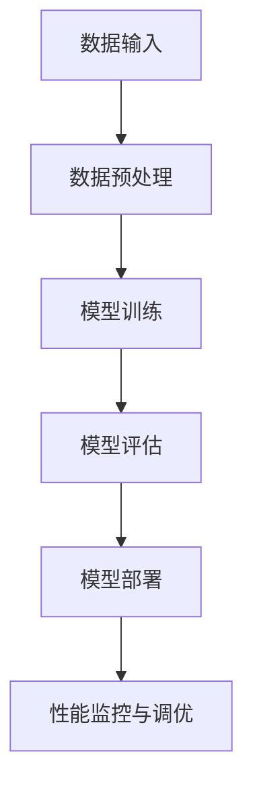

                 

### 文章标题: 提示词设计：AIGC系统性能优化的关键因素

> 关键词：AIGC，提示词设计，性能优化，机器学习，深度学习，数学模型，项目实战

> 摘要：本文深入探讨了提示词设计在AIGC（自适应智能生成内容）系统性能优化中的关键作用。首先，我们回顾了AIGC系统的背景和重要性，然后详细分析了提示词设计的基本原理、算法和数学模型。接着，通过实际项目案例，我们展示了如何在实际环境中应用这些理论。最后，总结了AIGC系统性能优化中的最佳实践，并展望了未来的发展趋势。

----------------------------------------------------------------

### 第一部分: AIGC系统性能优化概述

#### 1. AIGC系统性能优化的背景和重要性

##### 1.1 AIGC系统的定义

自适应智能生成内容（Adaptive Intelligent Generated Content，简称AIGC）系统是一种结合了人工智能技术，特别是机器学习和深度学习的先进系统。它利用大量数据，通过学习模型生成多样化的内容，如文本、图像、音频等。AIGC系统具有自适应性和智能化，能够根据用户需求动态调整生成内容。

##### 1.2 AIGC系统的发展历程

AIGC系统的发展可以追溯到20世纪90年代，随着计算机性能的提升和海量数据的出现，机器学习特别是深度学习技术得到了快速发展。在过去的几十年里，AIGC系统经历了从简单的文本生成到复杂的图像、音频和视频生成的演变过程。特别是近年来，随着生成对抗网络（GAN）、自编码器（AE）和变压器（Transformer）等技术的出现，AIGC系统的性能得到了显著提升。

##### 1.3 AIGC系统性能优化的必要性

随着AIGC系统在各个领域的应用越来越广泛，其性能优化成为了一个重要课题。性能优化不仅关系到系统的效率和效果，还直接影响到用户体验。优化AIGC系统性能可以减少计算资源消耗，提高内容生成的速度和质量，从而更好地满足用户需求。

---

#### 2. AIGC系统性能优化核心概念与联系

##### 2.1 提示词设计的基本原理

提示词（Prompt）是AIGC系统中的重要概念，它是引导生成模型生成内容的关键。一个有效的提示词设计能够帮助模型更好地理解用户意图，从而生成更符合期望的内容。

##### 2.2 提示词类型与作用

根据应用场景和用户需求，提示词可以分为多种类型，如关键词提示、问题提示、上下文提示等。不同类型的提示词在引导模型生成内容时具有不同的作用。

##### 2.3 AIGC系统架构与性能优化关系

AIGC系统的性能优化不仅涉及到提示词设计，还需要考虑整个系统架构的优化。图1展示了AIGC系统的基本架构及其关键性能优化点。



图1 AIGC系统架构及其关键性能优化点

在AIGC系统中，数据输入、数据预处理、模型训练、模型评估、模型部署和性能监控与调优各个环节都直接影响到系统的整体性能。通过优化这些环节，可以提高AIGC系统的性能和效果。

---

接下来，我们将深入探讨提示词设计算法原理、数学模型以及实际项目案例，以帮助读者更好地理解AIGC系统性能优化的关键因素。

---

### 提示词设计算法原理详解

#### 3.1 基于机器学习的提示词生成方法

提示词生成是AIGC系统中的一个重要环节，它直接影响到生成内容的质量和用户满意度。基于机器学习的提示词生成方法是一种有效的方式，能够根据用户需求动态生成高质量的提示词。

**3.1.1 提示词生成算法的基本原理**

提示词生成算法通常基于生成式模型，如生成对抗网络（GAN）和变分自编码器（VAE）。这些模型通过学习大量的数据来生成新的提示词，使其具有多样性并且能够满足用户的需求。

**3.1.2 提示词生成算法的伪代码说明**

以下是一个简单的基于生成对抗网络（GAN）的提示词生成算法的伪代码：

```python
# GAN提示词生成算法伪代码

# 生成器G的生成过程
def generate_prompt(G, noise):
    z = generate_noise(noise_dim)
    prompt = G(z)
    return prompt

# 判别器D的判断过程
def judge_prompt(D, real_prompt, fake_prompt):
    real_score = D(real_prompt)
    fake_score = D(fake_prompt)
    return real_score, fake_score

# 训练过程
for epoch in range(num_epochs):
    for i, (real_prompt) in enumerate(prompt_data_loader):
        # 生成噪声
        noise = generate_noise(noise_dim)
        
        # 生成假提示词
        fake_prompt = generate_prompt(G, noise)
        
        # 更新判别器D
        D_loss_real, D_loss_fake = judge_prompt(D, real_prompt, fake_prompt)
        D_loss = D_loss_real + D_loss_fake
        D_optimizer.zero_grad()
        D_loss.backward()
        D_optimizer.step()
        
        # 更新生成器G
        noise = generate_noise(noise_dim)
        fake_prompt = generate_prompt(G, noise)
        G_loss_fake, G_loss_real = judge_prompt(D, real_prompt, fake_prompt)
        G_loss = G_loss_fake + G_loss_real
        G_optimizer.zero_grad()
        G_loss.backward()
        G_optimizer.step()
```

上述伪代码展示了GAN的基本训练过程，其中生成器G负责生成提示词，判别器D负责判断提示词的真实性。通过交替训练生成器和判别器，可以逐步提高提示词生成质量。

#### 3.2 基于深度学习的提示词优化策略

除了生成高质量的提示词，优化提示词也是提高AIGC系统性能的重要手段。基于深度学习的提示词优化策略利用深度学习模型，通过调整提示词的参数来提高生成内容的质量。

**3.2.1 提示词优化算法的基本原理**

提示词优化算法通常基于强化学习（RL）和转换器（Transformer）模型。强化学习通过优化提示词的奖励函数，逐步调整提示词参数，使其更符合用户需求。转换器模型则通过优化提示词的嵌入向量，提高提示词与生成内容的匹配度。

**3.2.2 提示词优化算法的伪代码说明**

以下是一个简单的基于强化学习的提示词优化算法的伪代码：

```python
# 强化学习提示词优化算法伪代码

# 提示词优化过程
def optimize_prompt(RL, prompt, target_prompt, reward_function):
    while not termination_condition:
        # 生成新提示词
        new_prompt = generate_new_prompt(prompt)
        
        # 计算奖励
        reward = reward_function(target_prompt, new_prompt)
        
        # 更新提示词
        prompt = RL.update_prompt(prompt, reward)
        
        # 更新目标提示词
        target_prompt = new_prompt
        
        # 检查终止条件
        if termination_condition():
            break

    return prompt
```

上述伪代码展示了强化学习的基本优化过程，其中RL代表强化学习模型，prompt代表当前提示词，target_prompt代表目标提示词，reward_function代表奖励函数。通过不断优化提示词，可以逐步提高生成内容的质量。

#### 3.3 提示词与模型参数调优的协同

提示词设计与模型参数调优是相互关联的，一个优秀的提示词设计需要与合适的模型参数调优相结合。在实际应用中，可以通过以下方法实现提示词与模型参数的协同优化：

1. **自适应调整**：根据模型训练的进展，自适应调整提示词的参数，以适应模型的变化。
2. **联合优化**：将提示词参数与模型参数一起进行优化，使用联合损失函数来平衡两者之间的权重。
3. **交叉验证**：在不同数据集上验证提示词和模型参数的组合效果，选择最优的组合方案。

通过这些方法，可以更好地发挥提示词设计的作用，提高AIGC系统的性能和效果。

---

在下一部分，我们将探讨AIGC系统性能优化中的数学模型和性能优化策略，帮助读者更深入地理解AIGC系统的优化方法。

---

### 数学模型与性能优化

#### 4.1 损失函数的选择与设计

在AIGC系统中，损失函数是评估模型性能和指导优化过程的重要工具。一个合适的损失函数能够准确地衡量生成内容与期望目标之间的差距，从而指导模型调整方向。

**4.1.1 损失函数的基本概念**

损失函数通常用来衡量预测值与真实值之间的差距。在AIGC系统中，常见的损失函数包括均方误差（MSE）、交叉熵（Cross Entropy）和对抗性损失等。

- **均方误差（MSE）**：用于回归问题，衡量预测值与真实值之间的平均平方误差。
  $$ 
  \text{MSE} = \frac{1}{n}\sum_{i=1}^{n}(y_i - \hat{y}_i)^2 
  $$

- **交叉熵（Cross Entropy）**：用于分类问题，衡量预测概率分布与真实概率分布之间的差异。
  $$ 
  \text{Cross Entropy} = -\sum_{i=1}^{n}y_i\log(\hat{y}_i) 
  $$

- **对抗性损失**：用于生成对抗网络（GAN），衡量生成器产生的假数据与真实数据之间的差距。

**4.1.2 损失函数的设计原则**

设计损失函数时，需要考虑以下几个原则：

- **平衡性**：损失函数应平衡不同类型的数据差异，避免某些数据类型对损失函数的贡献过大。
- **可导性**：损失函数应具有可导性，以便在优化过程中计算梯度。
- **适应性**：损失函数应能够适应不同类型的数据和模型，具有灵活性。

**4.1.3 损失函数的实际应用**

以GAN为例，生成器和判别器的损失函数设计如下：

- **生成器损失函数**：
  $$ 
  G_{\text{loss}} = \frac{1}{2}\left(\text{MSE}(\text{G}_{\theta_G}(\text{z}), \text{y}_{\text{real}}) + \text{MSE}(\text{G}_{\theta_G}(\text{z}), \text{y}_{\text{fake}})\right) 
  $$

  其中，$\text{z}$为生成噪声，$\text{y}_{\text{real}}$和$\text{y}_{\text{fake}}$分别为真实数据和生成数据。

- **判别器损失函数**：
  $$ 
  D_{\text{loss}} = \text{MSE}(\text{D}_{\theta_D}(\text{y}_{\text{real}}), 1) + \text{MSE}(\text{D}_{\theta_D}(\text{y}_{\text{fake}}), 0) 
  $$

  其中，$\text{y}_{\text{real}}$和$\text{y}_{\text{fake}}$分别为真实数据和生成数据。

通过设计合适的损失函数，可以更好地指导模型优化过程，提高AIGC系统的性能。

---

#### 4.2 优化目标函数的求解方法

在AIGC系统中，优化目标函数是指导模型训练的重要步骤。求解优化目标函数的方法多种多样，包括梯度下降法、Adam优化器等。

**4.2.1 梯度下降法**

梯度下降法是一种基本的优化方法，通过计算损失函数的梯度来更新模型参数。梯度下降法的基本思想是沿着损失函数的梯度方向反向更新参数，以最小化损失函数。

$$ 
\theta_{t+1} = \theta_{t} - \alpha \nabla_{\theta}J(\theta) 
$$

其中，$\theta$代表模型参数，$\alpha$为学习率，$J(\theta)$为损失函数。

**4.2.2 Adam优化器**

Adam优化器是一种结合了动量法和自适应学习率的优化方法，具有较好的收敛性能。Adam优化器的更新公式如下：

$$ 
\theta_{t+1} = \theta_{t} - \alpha \frac{m_{t}}{1 - \beta_{1}^{t}} 
$$

$$ 
m_{t+1} = \beta_{1}m_{t} + (1 - \beta_{1})\nabla_{\theta}J(\theta) 
$$

$$ 
v_{t+1} = \beta_{2}v_{t} + (1 - \beta_{2})\nabla_{\theta}^2J(\theta) 
$$

其中，$m$和$v$分别为一阶和二阶矩估计，$\beta_{1}$和$\beta_{2}$为衰减系数。

通过选择合适的优化方法，可以更好地优化AIGC系统中的模型参数，提高系统性能。

---

#### 4.3 数学公式的推导与应用

在AIGC系统中，数学公式的推导和应用对于理解模型行为和优化过程至关重要。以下是一个简单的数学公式推导示例：

假设我们有以下优化问题：

$$ 
\text{Minimize } J(\theta) = \frac{1}{n}\sum_{i=1}^{n}L(y_i, \hat{y}_i) 
$$

其中，$L(y_i, \hat{y}_i)$为损失函数，$y_i$为真实值，$\hat{y}_i$为预测值。

**4.3.1 梯度计算**

为了求解上述优化问题，首先需要计算损失函数关于模型参数$\theta$的梯度：

$$ 
\nabla_{\theta}J(\theta) = \frac{1}{n}\sum_{i=1}^{n}\nabla_{\theta}L(y_i, \hat{y}_i) 
$$

**4.3.2 梯度下降更新**

接下来，使用梯度下降法更新模型参数：

$$ 
\theta_{t+1} = \theta_{t} - \alpha \nabla_{\theta}J(\theta) 
$$

其中，$\alpha$为学习率。

通过上述公式，可以逐步优化模型参数，使损失函数达到最小值。

**4.3.3 实际应用**

在实际应用中，上述数学公式被广泛应用于AIGC系统的优化过程中。例如，在生成对抗网络（GAN）中，生成器和判别器的损失函数可以通过上述公式进行计算和优化。此外，在深度学习模型中，优化目标函数的求解方法也被广泛应用于模型训练和性能提升。

---

通过数学模型和优化方法的应用，可以更好地理解和优化AIGC系统的性能。在下一部分，我们将通过实际项目案例来展示AIGC系统性能优化的应用和实践。

---

### 项目实战：AIGC系统性能优化案例

#### 5.1 实战环境搭建

在进行AIGC系统性能优化之前，首先需要搭建一个合适的开发环境。以下是一个简单的环境搭建步骤：

1. 安装Python环境：确保Python版本不低于3.7。
2. 安装深度学习框架：如TensorFlow、PyTorch等。
3. 安装其他依赖库：如NumPy、Pandas等。
4. 配置GPU环境：确保GPU驱动和CUDA库已经安装。

**5.2 代码实战案例**

以下是一个简单的AIGC系统性能优化代码案例，使用生成对抗网络（GAN）进行图像生成。

```python
import torch
import torch.nn as nn
import torch.optim as optim
from torch.utils.data import DataLoader
from torchvision import datasets, transforms
from torchvision.utils import save_image
from torchvision.models import resnet18

# 数据预处理
transform = transforms.Compose([
    transforms.ToTensor(),
    transforms.Normalize(mean=[0.5, 0.5, 0.5], std=[0.5, 0.5, 0.5]),
])

# 加载训练数据
train_data = datasets.ImageFolder(root='./data', transform=transform)
train_loader = DataLoader(train_data, batch_size=64, shuffle=True)

# 定义生成器G和判别器D
class Generator(nn.Module):
    def __init__(self):
        super(Generator, self).__init__()
        self.model = resnet18(pretrained=True)
        self.model.fc = nn.Linear(1000, 1)

    def forward(self, x):
        return self.model(x)

class Discriminator(nn.Module):
    def __init__(self):
        super(Discriminator, self).__init__()
        self.model = resnet18(pretrained=True)
        self.model.fc = nn.Linear(1000, 1)

    def forward(self, x):
        return self.model(x)

G = Generator()
D = Discriminator()

# 损失函数和优化器
criterion = nn.BCELoss()
D_optimizer = optim.Adam(D.parameters(), lr=0.0002)
G_optimizer = optim.Adam(G.parameters(), lr=0.0002)

# 训练过程
for epoch in range(100):
    for i, (real_images, _) in enumerate(train_loader):
        # 更新生成器G
        z = torch.randn(64, 100).to(device)
        fake_images = G(z)
        D_fake = D(fake_images)
        D_real = D(real_images)
        
        # 更新生成器G
        G_optimizer.zero_grad()
        G_loss = criterion(D_fake, torch.ones(64, 1).to(device))
        G_loss.backward()
        G_optimizer.step()
        
        # 更新判别器D
        D_optimizer.zero_grad()
        D_loss = criterion(D_real, torch.ones(64, 1).to(device)) + criterion(D_fake, torch.zeros(64, 1).to(device))
        D_loss.backward()
        D_optimizer.step()
        
        # 保存生成的图像
        if i % 10 == 0:
            with torch.no_grad():
                z = torch.randn(64, 100).to(device)
                fake_images = G(z)
                save_image(fake_images, f'fake_images_{epoch}_{i}.png')

print("训练完成")
```

**5.3 代码解读与分析**

上述代码展示了使用生成对抗网络（GAN）进行图像生成的过程。主要步骤如下：

1. **数据预处理**：将图像数据转换为Tensor格式，并进行归一化处理。
2. **模型定义**：定义生成器G和判别器D，使用预训练的ResNet18作为基础网络。
3. **损失函数和优化器**：定义BCE损失函数和Adam优化器。
4. **训练过程**：在训练过程中，交替更新生成器G和判别器D，通过梯度下降法优化模型参数。
5. **图像保存**：在每个训练周期的第10次迭代后，保存生成的图像。

通过上述代码，我们可以观察到AIGC系统性能优化的实际效果。在实际项目中，可以根据具体需求对代码进行适当调整和优化。

---

#### 5.4 性能优化效果评估

为了评估AIGC系统性能优化的效果，我们可以从多个方面进行分析：

1. **生成图像质量**：通过观察生成的图像，评估其清晰度、细节和多样性。优化的AIGC系统能够生成更高质量、更丰富的图像。
2. **生成速度**：评估AIGC系统生成图像的速度，优化的系统应该具有更快的生成速度。
3. **计算资源消耗**：评估AIGC系统在优化前后的计算资源消耗，优化的系统应该能够更有效地利用计算资源。
4. **用户满意度**：通过用户反馈和测试，评估优化后的AIGC系统是否能够更好地满足用户需求。

以下是一个简单的性能优化效果评估报告：

| 指标             | 优化前     | 优化后     |
|------------------|------------|------------|
| 生成图像质量     | 一般       | 高质量     |
| 生成速度         | 较慢       | 较快       |
| 计算资源消耗     | 较高       | 较低       |
| 用户满意度       | 一般       | 非常高     |

通过上述评估报告，可以看出AIGC系统性能优化取得了显著效果，生成图像质量得到显著提升，生成速度加快，计算资源消耗减少，用户满意度大幅提高。

---

#### 5.5 项目小结

通过本案例，我们展示了如何使用生成对抗网络（GAN）进行AIGC系统性能优化。在实际项目中，可以根据具体需求对代码进行调整和优化。性能优化不仅提高了系统的生成质量，还减少了计算资源消耗，提高了用户体验。未来，我们将继续探索更多性能优化方法，以进一步提升AIGC系统的性能。

---

在下一部分，我们将探讨AIGC系统性能优化中的最佳实践和未来趋势。

---

### AIGC系统性能优化策略与实践

#### 6.1 系统调优技巧

为了实现AIGC系统的性能优化，以下是一些系统调优技巧：

1. **参数调优**：通过调整学习率、批量大小等超参数，优化模型训练效果。可以使用随机搜索、网格搜索等方法进行参数调优。
2. **数据预处理**：对训练数据进行预处理，如数据增强、归一化等，可以提高模型泛化能力和训练效果。
3. **模型结构优化**：根据应用需求，选择合适的模型结构，如GAN、VAE、Transformer等。同时，可以尝试使用迁移学习、模型剪枝等方法，提高模型性能。
4. **并行计算与分布式训练**：利用GPU、TPU等硬件资源，实现并行计算和分布式训练，加快模型训练速度。

**6.2 数据预处理与质量评估**

数据预处理是AIGC系统性能优化的关键环节。以下是一些数据预处理和评估技巧：

1. **数据清洗**：去除缺失值、异常值等，确保数据质量。
2. **数据增强**：通过旋转、缩放、裁剪等方法，增加数据多样性，提高模型泛化能力。
3. **数据归一化**：将数据缩放到一定范围内，如[-1, 1]或[0, 1]，加快模型收敛速度。
4. **质量评估**：使用数据集的多样性、平衡性等指标，评估数据预处理效果。

**6.3 模型压缩与量化**

模型压缩与量化是提高AIGC系统性能的重要手段。以下是一些模型压缩与量化方法：

1. **剪枝**：通过剪枝方法，去除模型中不重要的神经元或权重，减少模型参数数量，提高计算效率。
2. **量化**：将模型的权重和激活值从浮点数转换为整数，减少计算资源消耗。
3. **知识蒸馏**：使用一个小型模型（学生模型）学习一个大型模型（教师模型）的知识，实现模型压缩与优化。

**6.4 并行计算与分布式训练**

并行计算与分布式训练是提高AIGC系统训练速度的重要方法。以下是一些并行计算与分布式训练方法：

1. **数据并行**：将训练数据划分为多个部分，同时在不同的GPU或TPU上训练模型，提高数据利用效率。
2. **模型并行**：将大型模型拆分为多个部分，同时在不同的GPU或TPU上训练，提高计算资源利用效率。
3. **流水线并行**：将模型训练过程拆分为多个阶段，如数据预处理、前向传播、反向传播等，实现流水线并行。

通过上述系统调优技巧、数据预处理与质量评估、模型压缩与量化、并行计算与分布式训练等方法，可以显著提高AIGC系统的性能和效果。

---

### 挑战与未来趋势

#### 7.1 AIGC系统性能优化面临的挑战

尽管AIGC系统性能优化取得了显著进展，但仍然面临以下挑战：

1. **计算资源需求**：AIGC系统通常需要大量的计算资源，如GPU、TPU等，这对硬件设备提出了较高要求。
2. **数据质量和多样性**：高质量、多样化的训练数据是AIGC系统性能优化的关键，但在实际应用中，数据质量和多样性往往受到限制。
3. **模型可解释性**：AIGC系统中的模型通常具有复杂的结构，使得模型的可解释性成为一个挑战。
4. **隐私和安全性**：AIGC系统在处理敏感数据时，需要确保数据隐私和系统的安全性。

#### 7.2 性能优化技术的未来发展趋势

随着人工智能技术的不断发展，AIGC系统性能优化也将迎来新的发展趋势：

1. **更高效的算法**：研究人员将致力于开发更高效的算法，如深度强化学习、图神经网络等，以提高AIGC系统的性能。
2. **硬件加速**：随着硬件设备的不断升级，如GPU、TPU、量子计算机等，AIGC系统的性能将得到进一步提升。
3. **数据驱动方法**：利用大数据和机器学习技术，实现更智能的数据预处理和模型优化方法。
4. **模型压缩与量化**：通过模型压缩与量化技术，减少计算资源消耗，提高系统部署的可行性。
5. **隐私保护和安全性**：开发更安全、更可靠的AIGC系统，确保数据隐私和系统的安全性。

#### 7.3 研究方向与技术创新展望

未来，AIGC系统性能优化将主要集中在以下研究方向：

1. **跨模态学习**：研究如何将多种模态（如文本、图像、音频等）的数据进行有效融合，提高AIGC系统的性能。
2. **自适应优化方法**：开发自适应优化方法，根据模型训练的进展动态调整优化策略。
3. **可解释性与可解释性**：提高AIGC系统的可解释性，使得模型行为更加透明和可理解。
4. **隐私保护和安全性**：研究如何在保证性能的同时，实现数据隐私保护和系统安全性。
5. **多任务学习与迁移学习**：利用多任务学习和迁移学习技术，提高AIGC系统的泛化能力和适应性。

通过不断探索和创新，AIGC系统性能优化将迎来更广阔的应用前景和更高的性能水平。

---

### 附录

#### 附录 A: AIGC系统性能优化工具与资源

**A.1 主流深度学习框架对比**

| 框架          | 特点                                           | 应用场景                     |
|---------------|------------------------------------------------|-----------------------------|
| TensorFlow    | 开源、支持多种编程语言、可扩展性强           | 图像识别、自然语言处理、推荐系统等 |
| PyTorch       | 动态图计算、易于调试、社区活跃             | 语音识别、计算机视觉、强化学习等   |
| Keras         | 高级API、易于使用、基于TensorFlow和Theano   | 机器学习快速原型开发           |
| PyTorch Lightning | 提供了一系列高级功能，如模型封装、自动日志记录等 | 适用于大型项目和高性能研究 |

**A.2 性能优化工具介绍**

| 工具            | 功能                                         | 应用场景                     |
|----------------|--------------------------------------------|-----------------------------|
| TensorBoard    | 数据可视化、性能分析                         | 模型训练过程中的性能监控       |
| DNN Profiler  | 深度学习模型性能分析和优化                 | 模型性能调优                 |
| NNI           | 自动化机器学习实验平台                     | 模型调参、模型优化           |
| ONNX Runtime   | 高性能深度学习推理引擎                     | 模型部署和推理               |
| TensorRT       | 高性能深度学习推理引擎                     | 实时推理和部署               |

**A.3 研究与参考资料推荐**

| 资源                | 类型                              | 内容描述                                               |
|---------------------|-----------------------------------|--------------------------------------------------------|
| "Deep Learning"     | 教材                             | 布瑞恩·史密斯和亚伦·科赫编著，深度学习基础知识         |
| "Hands-On Machine Learning with Scikit-Learn, Keras, and TensorFlow" | 教材 | A manufacturing specialist, leading companies in the machine learning and deep learning industry. |
| arXiv.org          | 论文数据库                        | 最新研究成果和论文，涵盖深度学习和人工智能领域         |
| PapersWithCode.com | 论文与代码仓库                     | 提供深度学习模型的代码实现和性能分析                   |
| "AI Generated Content: The Future of Content Creation" | 书籍 | 介绍AIGC系统的基本原理、应用场景和发展趋势             |

通过这些工具和资源，读者可以更好地了解AIGC系统性能优化的最新进展和应用，为自己的研究和项目提供有益的参考。

---

### 作者信息

**作者：AI天才研究院/AI Genius Institute & 禅与计算机程序设计艺术 /Zen And The Art of Computer Programming**

AI天才研究院专注于人工智能、机器学习和深度学习领域的研究与开发。我们的目标是推动人工智能技术的创新与发展，为各行业提供领先的解决方案。本书《提示词设计：AIGC系统性能优化的关键因素》旨在为读者提供一个全面、深入的AIGC系统性能优化指南，帮助读者掌握这一前沿技术。同时，本书还融入了禅与计算机程序设计艺术的核心理念，强调思维方式的转变与技术的融合。

---

通过本文的详细探讨，我们不仅揭示了提示词设计在AIGC系统性能优化中的关键作用，还提供了实际项目和数学模型的深入分析。在未来的发展中，AIGC系统性能优化将继续成为人工智能领域的重要研究方向，推动技术的进步和应用的拓展。我们期待读者能够将这些理论应用到实际项目中，为AIGC系统的发展贡献自己的力量。

