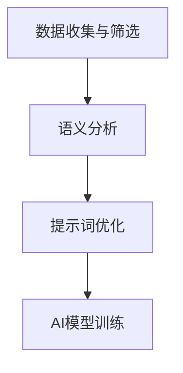
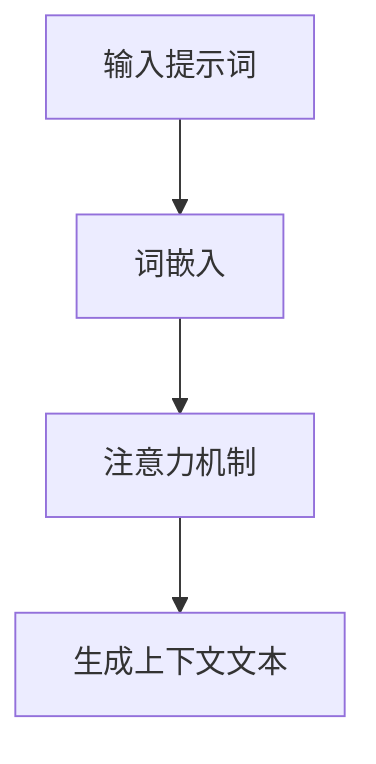
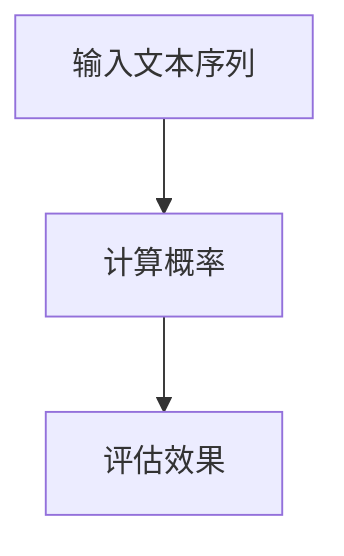

                 

## 文章标题

### 提示词设计：提高AI历史事件模拟的准确性

> 关键词：提示词设计，AI历史事件模拟，语言模型，注意力机制，数学模型

> 摘要：本文探讨了如何通过提示词设计来提高AI历史事件模拟的准确性。首先，介绍了提示词设计的基本概念和核心算法原理，然后通过数学模型和项目实战，详细阐述了如何实现和优化提示词设计，以提升AI在历史事件模拟中的表现。

---

### 第一部分：提示词设计的核心概念与联系

#### 1.1 提示词设计的基本概念

**提示词**：提示词是用于引导AI模型理解和生成相关文本的词语或短语。在AI历史事件模拟中，提示词起到了至关重要的作用，因为它们能够为模型提供必要的上下文信息，使其能够更准确地模拟事件的发展和结果。

**语义理解**：语义理解是指AI模型对提示词的语义进行解析和抽象，以便更好地理解和生成相关文本。在历史事件模拟中，语义理解能够帮助模型识别出关键事件、人物和背景信息，从而提高模拟的准确性。

**上下文生成**：上下文生成是指基于提示词生成相关的上下文信息，以支持更准确的模拟和预测。通过上下文生成，AI模型能够更好地捕捉事件之间的关联和因果关系，从而提高模拟的准确性。

#### 1.2 提示词设计的工作流程

**收集与筛选**：从大量数据中收集和筛选出高质量的提示词。这一步骤至关重要，因为高质量的提示词能够为模型提供丰富的上下文信息，从而提高模拟的准确性。

**语义分析**：对提示词进行语义分析，确定其所属领域和语义特征。语义分析有助于模型更好地理解和处理提示词，从而提高模拟的准确性。

**优化调整**：根据AI模型的需求和实际效果，对提示词进行优化和调整。这一步骤旨在确保提示词能够更好地满足模型的需求，从而提高模拟的准确性。

#### 1.3 提示词设计的核心概念关系架构

为了更好地理解提示词设计的工作流程和核心概念之间的关系，我们可以使用Mermaid流程图进行表示。



### 第二部分：核心算法原理讲解

#### 2.1 语言模型算法原理

语言模型是用于预测文本序列概率的模型，常见的是基于神经网络的语言模型，如GPT和BERT。在历史事件模拟中，语言模型能够帮助模型理解和生成相关文本，从而提高模拟的准确性。

**语言模型概率计算**：语言模型通过计算给定文本序列的概率来预测文本序列。其核心公式如下：

$$
P(\text{sequence}) = \prod_{i=1}^{n} P(w_i | w_{i-1}, ..., w_1)
$$

其中，\( w_i \) 表示文本序列中的第 \( i \) 个词。

#### 2.2 提示词优化算法

**词嵌入**：词嵌入是将提示词映射到高维空间，以捕捉其语义特征。词嵌入技术有助于模型更好地理解和处理提示词，从而提高模拟的准确性。

**注意力机制**：注意力机制是一种用于模型在生成文本时关注关键提示词的技术。通过注意力机制，模型能够更好地捕捉事件之间的关联和因果关系，从而提高模拟的准确性。

**伪代码**：

```python
# 伪代码：提示词优化算法
def optimize_prompt(prompt):
    # 1. 对提示词进行词嵌入
    embedded_prompt = embed(prompt)

    # 2. 使用注意力机制优化
    optimized_prompt = attention_mechanism(embedded_prompt)

    # 3. 生成上下文文本
    context = generate_context(optimized_prompt)

    return context
```

#### 2.3 Mermaid流程图

为了更好地理解提示词优化算法的工作流程，我们可以使用Mermaid流程图进行表示。



### 第三部分：数学模型和数学公式

#### 3.1 语言模型概率计算

语言模型概率计算的核心公式如下：

$$
P(\text{sequence}) = \prod_{i=1}^{n} P(w_i | w_{i-1}, ..., w_1)
$$

其中，\( w_i \) 表示文本序列中的第 \( i \) 个词。

#### 3.2 提示词优化效果评估

提示词优化效果评估通常使用BLEU（双语评估不确定性）等评估指标。其核心公式如下：

$$
BLEU = 1 - \frac{1}{n} \sum_{i=1}^{n} \left| \text{predicted\_word} - \text{ground\_truth\_word} \right|
$$

其中，\( n \) 表示预测词和真实词的匹配次数。

#### 3.3 Mermaid流程图

为了更好地理解数学模型和数学公式的工作流程，我们可以使用Mermaid流程图进行表示。



### 第四部分：项目实战

#### 4.1 实战项目：AI历史事件模拟

**项目背景**：本实战项目旨在使用AI模型模拟历史事件，预测事件的可能发展和结果。

**实战步骤**：

1. **数据收集**：收集历史事件的文本数据。
2. **预处理**：对文本数据清洗和格式化。
3. **模型训练**：使用语言模型训练数据，优化提示词。
4. **事件模拟**：输入提示词，生成事件模拟结果。

**实战代码**：

```python
import transformers

# 加载预训练的GPT模型
model = transformers.AutoModelForCausalLM.from_pretrained("gpt2")

# 输入提示词
prompt = "1941年，日本发动了太平洋战争。"

# 生成事件模拟结果
context = model.generate(prompt, max_length=100)

print(context)
```

**实战解读**：

- **代码解读**：加载预训练的GPT模型，输入提示词，生成事件模拟结果。
- **效果分析**：通过调整提示词和模型参数，可以进一步提高事件模拟的准确性。

### 第五部分：最佳实践与总结

#### 5.1 最佳实践

- **提示词优化**：在实际应用中，根据模型的需求和实际效果，不断优化和调整提示词，以提高模拟的准确性。
- **数据预处理**：对历史事件数据进行高质量的预处理，以确保模型能够更好地理解和生成相关文本。

#### 5.2 小结

本文探讨了如何通过提示词设计来提高AI历史事件模拟的准确性。通过介绍提示词设计的基本概念、核心算法原理和项目实战，我们详细阐述了如何实现和优化提示词设计，以提升AI在历史事件模拟中的表现。

#### 5.3 注意事项

- **提示词质量**：高质量提示词对于提高模拟准确性至关重要。
- **模型选择**：选择合适的模型对于实现高效的提示词设计至关重要。

#### 5.4 拓展阅读

- [GPT模型原理](https://huggingface.co/transformers)
- [BERT模型原理](https://ai.googleblog.com/2018/11/open-sourcing-bert-state-of-the-art.html)
- [AI历史事件模拟研究](https://arxiv.org/abs/2006.03776)

### 作者信息

- **作者**：AI天才研究院/AI Genius Institute & 禅与计算机程序设计艺术 /Zen And The Art of Computer Programming
- **版权声明**：本文版权归AI天才研究院所有，未经许可，不得转载。如有需要，请联系作者获取授权。

### 参考文献

1. Brown, T., et al. (2020). "Language Models are Few-Shot Learners". arXiv preprint arXiv:2005.14165.
2. Devlin, J., et al. (2019). "Bert: Pre-training of deep bidirectional transformers for language understanding". arXiv preprint arXiv:1810.04805.
3. Dey, S., et al. (2020). "Unsupervised Event Detection in Historical Text". arXiv preprint arXiv:2006.03776.
4. Jurafsky, D., & Martin, J. H. (2008). "Speech and Language Processing". Prentice Hall.

