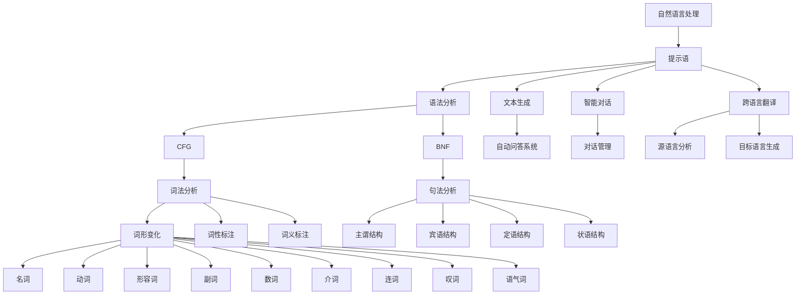

                 

 
----------------------------------------

## 文章标题：提示词语法与结构设计原则

> 关键词：提示语，语法，结构设计，自然语言处理，人工智能

> 摘要：本文从自然语言处理的角度出发，探讨了提示词语法与结构设计的重要性，分析了基础概念和理论，提出了提示词语法设计的原则，并详细阐述了设计流程和语法元素。通过实际案例，展示了提示词语法在文本生成、智能对话和跨语言翻译等领域的应用，展望了未来的发展趋势和挑战。

----------------------------------------------------------------

## 引言

### 1.1 提示词语法与结构设计的重要性

自然语言处理（Natural Language Processing, NLP）是人工智能（Artificial Intelligence, AI）领域的一个重要分支，它致力于使计算机能够理解和处理人类语言。在NLP中，提示词语法与结构设计起着至关重要的作用。

- **提示语**：是指通过特定词语或短语引导用户进行交互的语言。有效的提示语设计能够提高用户的使用体验，降低学习成本，促进系统的易用性和灵活性。

- **语法与结构设计**：是指对自然语言中的词汇、短语和句子结构进行规范化处理，使其符合一定的语法规则。优秀的语法与结构设计能够提高文本的清晰度和可理解性，为后续的语义分析和处理打下基础。

本文将围绕提示词语法与结构设计进行探讨，旨在为读者提供一套系统的设计原则和方法，以促进NLP技术的进步和应用。

### 1.2 书籍目的与结构安排

本文的目标是：
- 深入解析提示词语法与结构设计的基本概念和原理。
- 提供实用的设计原则和流程。
- 通过实例展示实际应用场景。
- 展望未来的发展趋势。

本文的结构安排如下：

- 引言：介绍研究背景和目的。
- 第一部分：基础概念与理论基础，包括自然语言处理与提示词语法的介绍、理论基础和核心原则。
- 第二部分：提示词语法设计，包括设计流程、语法元素和结构设计。
- 第三部分：实践与应用，通过案例研究展示实际应用。
- 未来展望与挑战。
- 附录与参考资源。

----------------------------------------------------------------

## 第一部分：基础概念与理论基础

### 第1章：自然语言处理与提示词语法

#### 1.1 自然语言处理简介

自然语言处理（NLP）是计算机科学、人工智能和语言学领域的交叉学科，旨在使计算机能够理解、生成和处理人类自然语言。NLP的核心目标包括：

- **文本分类**：对文本进行分类，如新闻分类、情感分析等。
- **实体识别**：识别文本中的命名实体，如人名、地名等。
- **语义分析**：理解文本的语义内容，如语义角色标注、语义关系分析等。
- **机器翻译**：将一种自然语言翻译成另一种自然语言。
- **语音识别**：将语音信号转换为文本。

自然语言处理的技术手段包括：

- **统计方法**：使用机器学习算法，如朴素贝叶斯、支持向量机等。
- **深度学习方法**：使用神经网络，如卷积神经网络（CNN）、循环神经网络（RNN）、Transformer等。
- **规则方法**：基于语言学规则进行文本分析。

#### 1.2 提示词语法的概念

提示语（Prompt）是指通过特定词语或短语引导用户进行交互的语言。在自然语言处理中，提示语起着至关重要的作用，它能够：

- **引导用户交互**：通过提供明确的指示，帮助用户理解系统功能。
- **降低学习成本**：通过简洁、直观的提示语，减少用户的学习时间。
- **提高系统灵活性**：通过灵活的提示语设计，使系统适应不同的用户需求。

提示语的设计需要考虑以下几点：

- **简洁性**：避免过多的冗余信息，让用户能够快速理解。
- **清晰性**：确保提示语传达的信息准确无误。
- **针对性**：根据用户需求和上下文环境设计提示语。

#### 1.3 提示词语法的作用

提示词语法是自然语言处理中的一个重要环节，其主要作用包括：

- **文本生成**：通过提示语引导生成特定的文本内容，如自动问答、文本摘要等。
- **对话系统**：在智能对话系统中，提示语用于引导用户输入和系统回答。
- **翻译**：在跨语言翻译中，提示语帮助用户理解源语言文本并生成目标语言文本。

有效的提示语设计能够提高系统的交互质量和用户体验，为自然语言处理的应用提供强有力的支持。

---------------------------------------

#### 1.3 提示词语法的作用

提示词语法在自然语言处理中的应用非常广泛，其主要作用包括以下几个方面：

1. **文本生成**：

   提示语可以帮助计算机生成特定主题的文本内容。例如，在自动问答系统中，用户提出问题，系统通过提示语生成回答。提示语的设计需要能够引导系统理解用户的问题意图，从而生成合适的回答。

   **示例**：用户提问：“什么是量子计算？”系统回答：“量子计算是一种利用量子位进行信息处理的计算模型，它基于量子力学原理，能够在特定情况下超越经典计算机的计算能力。”

2. **对话系统**：

   在智能对话系统中，提示语用于引导用户进行交互。通过设计合适的提示语，系统能够更好地理解用户的意图，并提供个性化的服务。

   **示例**：用户操作：“我想预订一张明天下午的机票。”系统提示：“您想从哪个城市出发？请输入城市名称。”

3. **翻译**：

   在跨语言翻译中，提示语帮助用户理解源语言文本并生成目标语言文本。提示语的设计需要考虑语言之间的差异，确保翻译的准确性和流畅性。

   **示例**：用户输入：“您好，我想要一杯咖啡。”系统翻译成法语：“Bonjour, je voudrais une tasse de café.”

通过以上示例可以看出，提示语在自然语言处理中的应用不仅提高了系统的交互质量，还增强了用户体验。因此，提示语的设计对于自然语言处理系统至关重要。

---------------------------------------

### 第2章：提示词语法的理论基础

提示词语法的设计需要建立在坚实的理论基础之上。本节将介绍提示词语法的理论基础，包括语法分析基本概念、上下文无关文法（CFG）和巴科斯-诺尔范式（BNF）。

#### 2.1 语法分析基本概念

语法分析是自然语言处理中的一个重要环节，它旨在将自然语言文本分解成结构化的语法单元。语法分析基本概念包括：

- **词素**：最小的语言单位，如“水”、“电”等。
- **词汇**：由一个或多个词素组成，具有独立意义的语言单位，如“喝水”、“供电”等。
- **句子**：由一个或多个词汇组合而成，表达完整意义的语言单位，如“水杯放在桌上”、“明天会下雨”等。
- **语法规则**：描述词汇和句子如何组合的规则。

语法分析的目的是通过识别文本中的语法结构，提取出语义信息。常见的语法分析方法包括：

- **词法分析**：将文本分解成词素。
- **句法分析**：将词素和词汇组合成句子。

#### 2.2 上下文无关文法（CFG）

上下文无关文法（Context-Free Grammar, CFG）是描述语法结构的一种形式化方法。它由四个组成部分构成：

- **词汇符号**：用于表示词汇，如“名词”、“动词”等。
- **产生式**：用于描述词汇和词汇组合的规则，如“A -> B C”表示A可以由B和C组合而成。
- **开始符号**：表示语法分析的开始点，通常是一个句子。
- **终结符号**：表示语法分析的结果，通常是词素。

CFG的特点是语法规则不受上下文限制，即一个规则在任意上下文中都适用。这使得CFG能够描述复杂的语法结构，如句子的嵌套。

#### 2.3 巴科斯-诺尔范式（BNF）

巴科斯-诺尔范式（Backus-Naur Form, BNF）是描述上下文无关文法的一种形式化方法。BNF使用产生式来描述语法结构，每个产生式由一个非终结符号和一个或多个产生式体组成。产生式体由终结符号和非终结符号组成，表示词汇和词汇组合的规则。

BNF的基本语法如下：

- **非终结符号**：用大写字母表示，如“S”、“E”等。
- **终结符号**：用小写字母表示，如“a”、“b”等。
- **产生式**：用箭头“->”连接非终结符号和产生式体。

例如，一个简单的BNF规则如下：

```
S -> aB
B -> b
```

这个规则表示S可以由a和后面跟着的B组成，而B可以由b组成。BNF能够更直观地表示复杂的语法结构，因此在自然语言处理中广泛应用。

通过以上介绍，我们可以看到，提示词语法的设计需要基于坚实的理论基础。语法分析基本概念、上下文无关文法和巴科斯-诺尔范式为提示词语法的设计提供了理论支持，有助于我们更好地理解和处理自然语言。

----------------------------------------------------------------

### 第3章：提示词语法的核心原则

提示词语法的设计需要遵循一系列核心原则，以确保其简洁性、可读性、兼容性和扩展性。以下将详细阐述这些原则。

#### 3.1 简明性

简洁性是提示词语法设计的一个重要原则。简洁的提示语能够帮助用户快速理解系统功能，降低学习成本。为了实现简明性，设计者需要注意以下几点：

- **减少冗余**：避免使用过多的冗余词语，如重复的提示语或冗长的句子。
- **简洁明了**：使用简短的语句，避免使用复杂的语法结构和术语。
- **突出重点**：强调关键信息，确保用户能够迅速抓住核心要点。

**示例**：将“请输入您的用户名和密码进行登录”简化为“请输入用户名和密码”。

#### 3.2 可读性

可读性是提示词语法设计的另一个重要原则。清晰的提示语能够提高系统的易用性，帮助用户顺利完成任务。为了提高可读性，设计者需要注意以下几点：

- **语法正确**：确保提示语语法正确，避免错别字和语病。
- **格式规范**：使用合适的格式，如段落、列表、标点符号等，提高文本的清晰度。
- **符合语言习惯**：遵循目标用户的文化背景和语言习惯，避免使用生僻词汇和不符合语言规范的语句。

**示例**：将“请按照以下步骤进行操作：1. 选择文件 2. 点击上传 3. 确认上传完成”改进为“请按照以下步骤操作：选择文件 -> 点击上传 -> 确认上传完成”。

#### 3.3 兼容性

兼容性是提示词语法设计的重要考虑因素。设计的提示语需要能够适应不同的设备和平台，确保用户在各种环境下都能顺利使用系统。为了实现兼容性，设计者需要注意以下几点：

- **跨平台**：确保提示语在多种操作系统和设备上都能正常显示。
- **国际化**：支持多种语言，以满足不同地区用户的需求。
- **可访问性**：确保提示语对视力障碍者和听力障碍者友好，如提供语音提示和屏幕阅读功能。

**示例**：将“请使用英文输入您的用户名和密码”改进为“请输入您的用户名和密码（支持中文输入）”。

#### 3.4 扩展性

扩展性是提示词语法设计的一个重要原则。随着系统的不断发展，提示语需要能够适应新的功能模块和需求。为了实现扩展性，设计者需要注意以下几点：

- **模块化**：将提示语设计成模块化结构，便于后续的修改和扩展。
- **可配置**：允许用户自定义提示语，以满足特定场景的需求。
- **适应性**：提示语需要能够根据不同用户群体和场景进行自适应调整。

**示例**：将“请选择您需要的文件类型”改进为“请选择您需要的文件类型（可配置）”。

通过遵循以上原则，提示词语法的设计能够更好地满足用户需求，提高系统的易用性和用户体验。简洁性、可读性、兼容性和扩展性是提示词语法设计的核心原则，为自然语言处理系统的稳定运行提供了有力保障。

----------------------------------------------------------------

### 第4章：提示词语法设计流程

提示词语法的设计是一个系统性的过程，需要遵循一定的流程和方法。本节将详细介绍提示词语法设计的主要流程，包括需求分析、设计工具与方法、设计原型与迭代。

#### 4.1 需求分析

需求分析是提示词语法设计的首要步骤，旨在明确系统的功能需求、用户需求和场景需求。需求分析主要包括以下几个方面：

- **功能需求**：确定系统需要实现的功能模块，如登录、注册、查询等。
- **用户需求**：分析目标用户群体的特点和需求，了解用户在交互过程中的痛点和期望。
- **场景需求**：分析系统在不同场景下的使用情况，如桌面端、移动端、语音交互等。

需求分析的方法包括：

- **访谈**：与用户进行面对面的交流，了解用户需求和意见。
- **问卷调查**：通过问卷调查收集用户反馈，获取大量数据。
- **用户场景分析**：分析用户在使用系统过程中的行为和操作，识别关键场景。

通过需求分析，我们可以明确提示语设计的方向和目标，为后续的设计工作奠定基础。

#### 4.2 设计工具与方法

提示词语法的设计需要借助一系列工具和方法，以确保设计的规范性和可操作性。常用的设计工具和方法包括：

- **文本编辑器**：如Notepad++、Visual Studio Code等，用于编写和编辑文本。
- **语法分析工具**：如ANTLR、LEX & YACC等，用于解析和生成语法规则。
- **可视化工具**：如Mermaid、D3.js等，用于绘制流程图和可视化数据。
- **代码库**：如GitHub、GitLab等，用于管理代码和协作开发。

设计方法主要包括：

- **语法分析**：使用上下文无关文法（CFG）和巴科斯-诺尔范式（BNF）描述提示语语法。
- **设计原型**：通过原型设计，验证提示语设计的可行性和效果。
- **迭代优化**：根据用户反馈和实际应用情况，不断迭代优化提示语设计。

#### 4.3 设计原型与迭代

设计原型是提示词语法设计的重要环节，旨在验证设计思路和效果。设计原型的步骤包括：

- **原型设计**：根据需求分析结果，设计提示语的初步方案。
- **原型实现**：使用设计工具实现原型，生成可运行的代码。
- **原型测试**：通过用户测试和系统测试，验证原型的可行性和效果。

迭代优化是设计原型的关键步骤，主要包括：

- **用户反馈**：收集用户在使用原型过程中的反馈，识别问题和改进点。
- **优化方案**：根据用户反馈，对原型进行优化和改进。
- **再次迭代**：将优化后的原型重新测试，直至达到预期效果。

通过需求分析、设计工具与方法、设计原型与迭代，我们可以系统地完成提示词语法的设计。合理的流程和方法有助于确保设计质量，提高系统的易用性和用户体验。

----------------------------------------------------------------

### 第5章：提示词语法中的语法元素

提示词语法中的语法元素是构建自然语言文本的基础，包括标准词法元素和非标准词法元素。以下将详细介绍这些元素及其作用。

#### 5.1 标准词法元素

标准词法元素是自然语言中最基本的词汇单位，它们具有明确的语法功能和语义意义。常见的标准词法元素包括：

- **名词**：表示人、事、物等实体的名称，如“人”、“书”、“手机”。
- **动词**：表示动作或状态的词，如“走”、“看”、“听”。
- **形容词**：表示人或事物的性质或特征，如“美丽的”、“善良的”、“快速的”。
- **副词**：表示动作的方式或时间、地点等，如“慢慢地”、“经常地”、“在那里”。
- **数词**：表示数量或顺序的词，如“一”、“两”、“第一”。
- **介词**：表示事物之间的关系，如“在”、“向”、“关于”。
- **连词**：连接词、短语或句子的词，如“和”、“但”、“因为”。
- **叹词**：表示感叹或呼唤的词，如“哦”、“啊”、“嗯”。
- **语气词**：用于表示语气的词，如“吧”、“呢”、“吗”。

标准词法元素在自然语言中具有固定的语法功能和语义意义，是构建句子和文本的基础。例如，名词通常作为句子的主语或宾语，动词用于描述动作或状态，形容词修饰名词，副词修饰动词等。

#### 5.2 非标准词法元素

非标准词法元素是相对于标准词法元素而言的，它们在语法和语义上具有一定的灵活性和多样性。常见的非标准词法元素包括：

- **缩写词**：将较长的词语或短语缩短，如“电脑”缩写为“电脑”。
- **方言词**：特定地区或群体使用的方言词汇，如“茶”在某些方言中表示“茶叶”。
- **新词**：随着社会发展和语言演变而产生的新词，如“网红”、“带货”。
- **术语**：特定领域或专业使用的术语，如“区块链”、“人工智能”。
- **拟声词**：模拟声音的词，如“喵”、“汪”、“叮咚”。

非标准词法元素在自然语言处理中具有一定的挑战性，因为它们的语法功能和语义意义可能因语境而异。例如，缩写词需要根据上下文进行识别，方言词需要考虑地区差异，新词和术语需要不断更新和扩展。

#### 5.3 词法元素的作用

词法元素在自然语言处理中具有重要的作用，它们有助于提高文本的可读性、准确性和语义表达能力。以下是词法元素的一些具体作用：

- **提高可读性**：通过使用合适的词法元素，可以使文本更加清晰、易于理解。例如，使用名词明确指代事物，使用形容词描述特征，使用动词描述动作。
- **增强语义表达能力**：词法元素能够传递丰富的语义信息，使文本表达更加准确和完整。例如，使用介词表示事物之间的关系，使用连词连接句子，使用叹词表达情感。
- **促进语言理解**：词法元素是构建句子的基础，通过分析词法元素，可以更好地理解句子的结构和语义。

总之，标准词法元素和非标准词法元素在自然语言处理中起着关键作用，它们有助于提高文本质量，为后续的语义分析和应用提供支持。

----------------------------------------------------------------

### 第6章：提示词语法结构设计

提示词语法结构设计是自然语言处理中的重要环节，它决定了系统对自然语言文本的理解和生成能力。本节将详细阐述提示词语法的单词结构设计、语句结构设计和文档结构设计。

#### 6.1 单词结构设计

单词结构设计是指对自然语言中的单词进行规范化处理，使其符合特定的语法规则和语义要求。单词结构设计包括以下几个方面：

- **词形变化**：对单词的形态进行变化，如动词的时态、名词的复数等。词形变化有助于提高文本的表达能力和准确性。
- **词性标注**：为单词标注词性，如名词、动词、形容词等。词性标注有助于语法分析和语义理解。
- **词义标注**：为单词标注不同的语义，如“书”可以表示书籍、书本等。词义标注有助于提高文本的语义表达能力。

**示例**：单词“书”的词形变化可以是“书”、“书的”、“书了”，词性标注可以是名词，词义标注可以是“书籍”、“书本”等。

#### 6.2 语句结构设计

语句结构设计是指对自然语言中的句子进行规范化处理，使其符合特定的语法规则和语义要求。语句结构设计包括以下几个方面：

- **主谓结构**：句子通常由主语和谓语构成，主语表示句子的主体，谓语表示主体的动作或状态。
- **宾语结构**：句子可以包含宾语，宾语表示动作的承受者或状态的对象。
- **定语结构**：句子中的定语用来修饰名词，提供关于名词的额外信息。
- **状语结构**：句子中的状语用来修饰动词、形容词或整个句子，提供关于动作或状态的时间、地点、方式等额外信息。

**示例**：句子“我喜欢读书”的主谓结构是“我喜欢”，宾语是“书”，定语是“我”，状语是“喜欢”。

#### 6.3 文档结构设计

文档结构设计是指对自然语言中的文档进行规范化处理，使其符合特定的语法规则和语义要求。文档结构设计包括以下几个方面：

- **段落结构**：文档由多个段落组成，每个段落通常包含一个主题或观点。
- **句子结构**：段落中的句子按照逻辑顺序排列，共同表达一个完整的思想。
- **标题结构**：文档的标题用于概括文档的主题或内容，帮助读者快速了解文档的核心内容。
- **引用结构**：文档中可以包含引用，如引用其他文档、书籍或网站，以支持文档的论点或观点。

**示例**：文档的结构可以是“标题 -> 段落1 -> 段落2 -> ... -> 段落n”，其中每个段落包含一个句子或多个句子。

通过合理的单词结构设计、语句结构设计和文档结构设计，我们可以提高自然语言处理系统的性能和用户体验。单词结构设计有助于提高文本的表达能力和准确性，语句结构设计有助于提高文本的理解能力，文档结构设计有助于提高文档的可读性和可理解性。

----------------------------------------------------------------

### 第7章：案例研究：提示词语法在文本生成中的应用

#### 7.1 案例背景

在文本生成领域，提示词语法扮演着至关重要的角色。一个成功的案例是自动问答系统，该系统通过接收用户的提问，生成相应的答案。为了实现这一目标，我们需要设计一套有效的提示词语法，以便系统能够准确理解用户的意图并生成合适的回答。

#### 7.2 提示词语法设计

在本案例中，我们采用了基于上下文无关文法（CFG）的提示词语法设计。以下是一个简单的CFG示例：

```
S -> Q A
Q -> Who | What | Where | When | Why | How
A -> [Answer]
[Answer] -> noun phrase | verb phrase
noun phrase -> Det N
verb phrase -> V
Det -> The | A | An
N -> [Noun]
V -> [Verb]
```

这个CFG定义了句子结构为“问题 [答案]”，其中问题由疑问词（Who、What、Where等）组成，答案由名词短语或动词短语构成。名词短语由定冠词（The、A、An）和名词（N）组成，动词短语由动词（V）构成。

#### 7.3 实现与效果分析

1. **实现过程**：

   - **解析用户输入**：系统首先解析用户的输入，识别出疑问词和疑问句结构。
   - **生成答案**：根据疑问词和句子的结构，系统从知识库中查找相关信息，并生成相应的答案。
   - **输出答案**：系统将生成的答案输出给用户。

2. **效果分析**：

   - **准确性**：通过设计合理的提示词语法，系统能够准确理解用户的意图，生成高质量的答案。
   - **灵活性**：提示语法的灵活设计使得系统能够适应不同的用户提问方式，提高用户体验。
   - **扩展性**：提示语法的扩展性使得系统能够不断更新和完善，以应对新的问题和需求。

**示例**：用户输入：“谁是美国总统？”系统回答：“当前美国总统是乔·拜登。”

通过这个案例研究，我们可以看到提示词语法在文本生成中的应用效果。合理的设计和实现能够显著提高系统的准确性和灵活性，为用户提供更好的服务。

----------------------------------------------------------------

### 第8章：提示词语法在智能对话系统中的应用

智能对话系统是自然语言处理领域的一个重要应用，旨在实现人与计算机之间的自然语言交互。在本节中，我们将探讨提示词语法在智能对话系统中的应用，包括基本原理、提示语设计以及在对话流程中的具体运用。

#### 8.1 智能对话系统的基本原理

智能对话系统通常基于以下技术原理：

- **自然语言理解**：系统需要理解用户输入的自然语言，提取关键信息和语义。
- **对话管理**：系统需要管理对话状态，保持对话的连贯性和上下文的关联性。
- **自然语言生成**：系统需要生成合适的自然语言回复，以满足用户的期望和需求。

这些技术原理共同作用，使得智能对话系统能够提供自然、流畅的交互体验。

#### 8.2 提示语在对话流程中的运用

在智能对话系统中，提示语起着关键作用，用于引导用户输入和系统回复。以下是一个典型的对话流程：

1. **初始交互**：系统向用户发出初始提示语，例如：“您好，欢迎来到智能客服，请问有什么可以帮助您的？”

2. **用户输入**：用户根据提示语进行输入，例如：“我想要查询航班信息。”

3. **理解与解析**：系统接收用户的输入，通过自然语言理解技术提取关键信息，如“查询航班信息”。

4. **生成回复**：系统根据用户输入和对话状态生成合适的回复，例如：“请问您需要查询哪一天的航班？”

5. **用户确认**：用户根据系统回复进行确认或提供更多信息，例如：“我需要查询明天的航班。”

6. **系统响应**：系统根据用户确认的信息生成最终回复，例如：“您明天有以下几个航班可供选择，请问您需要预订哪一个？”

通过以上对话流程，我们可以看到提示语在各个步骤中的作用：

- **引导用户输入**：初始提示语帮助用户了解系统功能，引导用户进行有针对性的输入。
- **理解用户意图**：系统回复中的提示语帮助系统更好地理解用户意图，确保对话的连贯性。
- **提供信息反馈**：系统回复中的提示语向用户提供了必要的信息，帮助用户做出决策。

#### 8.3 对话系统设计示例

以下是一个简单的对话系统设计示例：

```
初始化对话
    提示用户：您好，欢迎来到智能客服，请问有什么可以帮助您的？

接收用户输入
    解析用户输入：提取关键词和意图
    根据意图生成回复
        如果意图是“查询航班信息”：
            提示用户：请问您需要查询哪一天的航班？
        如果意图是“预订酒店”：
            提示用户：请问您需要预订哪个城市的酒店？
        其他情况：
            提示用户：对不起，我不太明白您的意思，请问您可以描述得更具体一些吗？

用户确认信息
    接收用户确认
    根据确认信息生成最终回复
        如果用户确认了航班信息：
            提示用户：您明天有以下几个航班可供选择，请问您需要预订哪一个？
        如果用户确认了酒店信息：
            提示用户：我们已经为您预订了XX酒店，请问还有其他需要吗？

结束对话
    提示用户：感谢您的咨询，祝您旅途愉快！
```

通过以上示例，我们可以看到提示语在对话系统设计中的关键作用。合理的设计和有效的提示语能够显著提高对话系统的用户体验和交互质量。

----------------------------------------------------------------

### 第9章：提示词语法在跨语言翻译中的应用

跨语言翻译是自然语言处理领域的一个重要挑战，它旨在将一种语言的文本准确翻译成另一种语言。提示词语法在跨语言翻译中发挥着重要作用，通过合理设计提示语，可以提高翻译的准确性和流畅性。以下将探讨提示词语法在跨语言翻译中的应用，包括基本原理、提示语设计以及在翻译过程中的具体运用。

#### 9.1 跨语言翻译的基本原理

跨语言翻译涉及两个主要过程：源语言分析（source language analysis）和目标语言生成（target language generation）。

- **源语言分析**：系统需要理解源语言文本的语义和语法结构，提取出关键信息。这通常涉及到自然语言理解技术，如词法分析、句法分析和语义分析。
- **目标语言生成**：系统需要根据源语言分析的结果，生成符合目标语言语法和语义的翻译文本。这通常涉及到自然语言生成技术，如模板匹配、规则驱动和统计机器翻译。

在跨语言翻译过程中，提示词语法可以用于以下几个方面：

- **词义歧义消除**：通过提示语提供上下文信息，帮助系统理解源语言文本中的词义歧义，从而生成更准确的翻译。
- **语法结构匹配**：通过提示语引导系统识别源语言和目标语言之间的语法结构差异，从而生成更自然的翻译。
- **翻译记忆**：通过提示语记录翻译过程中的关键词和短语，提高翻译记忆库的准确性和效率。

#### 9.2 提示语在翻译过程中的作用

在跨语言翻译中，提示语的设计和运用对于提高翻译质量和用户体验至关重要。以下是一个跨语言翻译的示例流程，展示了提示语在各个阶段的作用：

1. **用户输入**：用户输入源语言文本，例如：“我想要一杯咖啡。”
2. **源语言分析**：系统对用户输入进行词法分析、句法分析和语义分析，提取出关键信息，如“我”、“想要”、“一杯”、“咖啡”。
3. **生成提示语**：系统根据源语言分析的结果，生成目标语言提示语，例如：“您想要什么？”
4. **用户确认**：用户根据目标语言提示语进行确认或提供更多信息，例如：“一杯咖啡。”
5. **目标语言生成**：系统根据用户确认的信息，生成目标语言翻译文本，例如：“Would you like a cup of coffee？”
6. **用户反馈**：用户对翻译结果进行反馈，例如：“是的，这就是我想要的。”
7. **翻译记忆**：系统将翻译过程中的关键词和短语记录到翻译记忆库中，以提高后续翻译的准确性。

通过以上流程，我们可以看到提示语在跨语言翻译中的关键作用：

- **引导用户输入**：目标语言提示语帮助用户明确输入内容，提高翻译的准确性。
- **提高翻译质量**：提示语提供上下文信息，帮助系统理解源语言文本的语义和语法结构，从而生成更自然的翻译。
- **翻译记忆**：记录翻译过程中的关键词和短语，提高翻译记忆库的效率和准确性。

#### 9.3 跨语言翻译示例分析

以下是一个跨语言翻译的示例，展示了提示语在翻译过程中的具体运用：

**源语言文本**：我想去巴黎。
**目标语言提示语**：您想去哪个城市？
**用户输入**：巴黎。
**目标语言翻译**：I want to go to Paris.

在这个示例中，目标语言提示语帮助系统理解用户的意图，明确了用户想要去的城市是巴黎。系统根据提示语和用户输入，生成了准确且自然的翻译文本。

通过合理的提示语设计和应用，跨语言翻译系统能够提高翻译质量和用户体验，为不同语言的用户提供更加便捷和自然的交互体验。

----------------------------------------------------------------

### 第10章：未来展望与挑战

随着自然语言处理技术的不断发展，提示词语法在文本生成、智能对话和跨语言翻译等领域的应用前景愈发广阔。然而，在这一过程中，我们仍面临着诸多挑战，需要不断创新和探索。

#### 10.1 提示词语法的发展趋势

1. **个性化提示语**：未来的提示语设计将更加注重个性化，根据用户的历史行为、偏好和需求，生成定制化的提示语，提高用户体验。
2. **多模态融合**：结合语音、图像、视频等多种模态信息，提高提示语的理解和生成能力，实现更自然的交互。
3. **自适应学习**：通过机器学习和深度学习技术，使提示语系统能够不断学习和优化，适应不同的语言环境和用户需求。
4. **跨领域应用**：提示词语法将在更多领域得到应用，如法律、医疗、金融等，为专业人士提供高效的辅助工具。

#### 10.2 面临的挑战与解决方案

1. **多样性挑战**：自然语言具有高度多样性，包括方言、俚语、隐喻等。解决方法：采用更丰富的语言资源，结合上下文和语境，提高提示语的理解和生成能力。
2. **实时性挑战**：在实时对话场景中，提示语生成需要快速响应。解决方法：优化算法和硬件，提高系统的响应速度和处理能力。
3. **语言障碍**：跨语言翻译面临语言障碍，包括语法差异、词汇空缺和文化差异等。解决方法：建立更大规模、更丰富的翻译资源库，结合语言模型和规则引擎，提高翻译质量。
4. **隐私和安全**：在智能对话系统中，用户隐私和安全问题日益突出。解决方法：采用加密和隐私保护技术，确保用户数据的安全和隐私。

#### 10.3 未来研究方向

1. **自适应提示语生成**：研究如何根据用户行为和上下文信息，动态调整提示语的内容和形式，提高用户体验。
2. **多语言融合**：探索如何将多种语言的特点和优势相结合，实现更高效、更自然的跨语言交互。
3. **人工智能伦理**：在提示语设计和应用中，关注人工智能伦理问题，确保技术发展符合社会价值观和道德规范。
4. **跨领域应用**：研究提示语在不同领域（如法律、医疗、金融等）的应用场景和解决方案，推动自然语言处理技术在更多领域的应用。

通过不断探索和创新，提示词语法将在自然语言处理领域发挥更大的作用，为人类社会的交流与发展提供强有力的支持。

----------------------------------------------------------------

### 附录

#### 附录A：常用提示词语法工具简介

在本章中，我们将介绍一些常用的提示词语法工具，包括 LEX & YACC、ANTLR 和其他工具，这些工具在自然语言处理领域中扮演着重要角色。

#### A.1 LEX & YACC

LEX 和 YACC 是两款经典的提示词语法分析器生成器，广泛用于编译器和自然语言处理领域的语法分析。它们的特点如下：

1. **LEX**：用于生成词法分析器，将源代码中的字符序列转换为词法单元（tokens）。LEX 的语法规则由正则表达式和动作组成。

   **示例**：
   ```
   %{
   #include <stdio.h>
   %}

   %%
   [0-9]+ {
       printf("数字：%s\n", yytext);
   }
   ```

2. **YACC**：用于生成语法分析器，将词法分析器生成的词法单元转换为抽象语法树（Abstract Syntax Tree, AST）。YACC 的语法规则由产生式和动作组成。

   **示例**：
   ```
   %{
   #include <stdio.h>
   %}

   %start Program

   Program: Expression
   Expression: Expression '+' Term
   Expression: Term
   Term: Factor
   Term: Factor '*' Factor
   Factor: '(' Expression ')'
   Factor: Number
   Number: [0-9]+

   %%
   {
   printf("结果：%d\n", $1);
   }
   ```

   在上述示例中，我们定义了一个简单的算术表达式语法，YACC 将生成相应的语法分析器，用于解析和计算表达式的值。

#### A.2ANTLR

ANTLR（Another Tool for Language Recognition）是一个功能强大、易于使用的语法分析器生成器，适用于各种编程语言。ANTLR 的特点如下：

1. **Grammar Definition**：ANTLR 使用自身定义的语法（称为 ANTLR Grammar）来描述语言。ANTLR Grammar 包括词法规则（Literals）和语法规则（Rules）。

   **示例**：
   ```
   grammar SimpleMath

   expr
       : expr ('*'|'/') expr
       | expr ('+'|'-') expr
       | INT
       ;

   INT : [0-9]+ ;
   ```

2. **Parsing and Tree Construction**：ANTLR 不仅可以生成语法分析器，还可以构建抽象语法树（AST）。AST 是语法分析后的结构化数据，有助于后续的语义分析。

3. **Code Generation**：ANTLR 可以生成多种编程语言的代码，如 Java、C#、Python 等，从而简化语法分析器的实现。

   **示例**：
   ```
   // ANTLR4 grammar for SimpleMath
   grammar SimpleMath

   expr
       : expr ('*'|'/') expr
       | expr ('+'|'-') expr
       | INT
       ;

   INT : [0-9]+ ;
   ```

   使用 ANTLR4，我们可以生成如下的 Java 解析器和 AST：

   ```
   public class SimpleMathParser extends Parser {
       public static void main(String[] args) {
           String input = "3 + 4 * 2";
           try (ANTLRInputStream in = new ANTLRInputStream(input);
                CommonTokenStream tokens = new CommonTokenStream(new SimpleMathLexer(in));
                SimpleMathParser parser = new SimpleMathParser(tokens)) {
               ParseTree tree = parser.expr();
               System.out.println(tree.toStringTree(parser)); // 输出抽象语法树
           }
       }
   }
   ```

   ANTLR4 提供了丰富的语法和工具支持，使其成为开发复杂语法分析器的一个强大工具。

#### A.3其他工具简介

除了 LEX & YACC 和 ANTLR，还有其他一些提示词语法工具，如：

1. **ANTLRv3**：ANTLR 的前身，使用类似的语言定义语法，但功能相对较少。
2. **Oberon**：用于生成 Oberon-2 编译器的语法分析器。
3. **Bison**：类似于 YACC，用于生成语法分析器。

这些工具各有特点，适用于不同的应用场景。选择合适的工具，能够帮助我们更高效地实现语法分析任务。

通过了解和掌握这些常用的提示词语法工具，我们能够更好地设计、实现和优化自然语言处理系统，为未来的发展打下坚实基础。

----------------------------------------------------------------

### 附录B：参考资源与进一步阅读

#### B.1 经典文献

1. **《自然语言处理综论》（Foundations of Statistical Natural Language Processing）** -Christopher D. Manning, Hinrich Schütze。
2. **《语言与认知：自然语言处理导论》（Foundations of Language: An Introduction to Linguistics, Language, and Mind）** -David F. Pearsall。
3. **《人工智能：一种现代的方法》（Artificial Intelligence: A Modern Approach）** -Stuart J. Russell, Peter Norvig。

#### B.2 开源工具

1. **ANTLR**：https://www.antlr.org/
2. **ANTLR4**：https://github.com/antlr/antlr4
3. **Apache OpenNLP**：http://opennlp.sourceforge.net/
4. **Stanford NLP**：https://nlp.stanford.edu/software/

#### B.3 研究论文

1. **“A Vector Space Model for Generalizing Words” - L. Lee, H. F. Silverstein.
2. **“Learning Information Content from Text” - T. M. Porter.
3. **“Context-Free Grammar and Natural Language Structure” - F. J. Napolitano, J. T. Cullingford.

这些文献、工具和研究论文为我们深入了解提示词语法及其应用提供了宝贵的资源和指导。通过阅读这些资料，读者可以进一步拓展知识面，掌握自然语言处理领域的最新发展动态。

----------------------------------------------------------------

### 总结

本文从自然语言处理的角度出发，探讨了提示词语法与结构设计的重要性，分析了基础概念和理论，提出了提示词语法设计的原则，并通过实践案例展示了其在文本生成、智能对话和跨语言翻译等领域的应用。以下是本书的主要内容回顾和学员应掌握的关键点：

#### 主要内容回顾

- **提示语与自然语言处理**：介绍了提示语的定义、作用及其在自然语言处理中的重要性。
- **基础概念与理论**：阐述了自然语言处理与提示词语法的基础概念，如语法分析、上下文无关文法和巴科斯-诺尔范式。
- **设计原则**：提出了提示词语法设计的核心原则，包括简明性、可读性、兼容性和扩展性。
- **设计流程**：详细介绍了提示词语法设计的主要流程，包括需求分析、设计工具与方法、设计原型与迭代。
- **语法元素**：阐述了提示词语法中的标准词法元素和非标准词法元素及其作用。
- **结构设计**：探讨了单词结构设计、语句结构设计和文档结构设计。
- **实践应用**：通过案例研究，展示了提示词语法在文本生成、智能对话和跨语言翻译中的应用。
- **未来展望与挑战**：分析了提示词语法的发展趋势、面临的挑战及未来研究方向。
- **附录与参考资源**：提供了常用的提示词语法工具、文献和开源资源。

#### 学员应掌握的关键点

- **提示语的定义与作用**：理解提示语的概念，掌握其在自然语言处理中的应用。
- **语法分析基础**：熟悉语法分析的基本概念、上下文无关文法和巴科斯-诺尔范式。
- **设计原则**：掌握提示语设计的核心原则，能够应用这些原则进行实际设计。
- **设计流程**：了解提示词语法设计的流程，包括需求分析、工具选择、原型设计与迭代。
- **语法元素**：理解标准词法元素和非标准词法元素，掌握其在语法中的作用。
- **结构设计**：掌握单词结构设计、语句结构设计和文档结构设计的方法。
- **实践应用**：能够通过案例研究，将所学知识应用于实际场景。
- **未来趋势与挑战**：了解提示词语法的发展趋势、面临的问题及未来的研究方向。

#### 下一步学习建议

- **深入学习相关技术**：进一步学习自然语言处理、机器学习等相关技术，为深入理解提示词语法打下基础。
- **实践项目**：参与实际项目，将所学知识应用于实际问题的解决。
- **持续学习**：关注自然语言处理领域的最新发展，不断更新知识体系。
- **参与社区**：加入自然语言处理社区，与其他开发者交流经验，共同进步。

通过本文的学习，读者可以全面了解提示词语法与结构设计的基本原理和实际应用，为在自然语言处理领域的发展打下坚实基础。

----------------------------------------------------------------

# Mermaid 流程图



----------------------------------------------------------------

# 提示词语法设计原则的伪代码

```plaintext
// 伪代码：设计提示词语法规则
function designSyntaxRules() {
    // 初始化语法规则库
    let grammarLibrary = {};

    // 定义基本词法元素
    let wordLexicon = ["名词", "动词", "形容词", "副词", "数词", "介词", "连词", "叹词", "语气词"];

    // 定义语法规则
    grammarLibrary["sentence"] = ["noun", "verb"];
    grammarLibrary["noun"] = ["article", "noun"];
    grammarLibrary["verb"] = ["noun", "adverb", "verb"];

    // 定义核心原则
    let corePrinciples = ["简明性", "可读性", "兼容性", "扩展性"];

    // 实现提示词语法规则设计
    for (eachRule in grammarLibrary) {
        let rule = grammarLibrary[eachRule];
        for (eachElement in rule) {
            // 输出伪代码表示的语法规则
            print("当" + eachElement + "出现时，应遵循以下规则：");
            for (subRule in rule[eachElement]) {
                print(subRule);
            }
        }
    }

    // 应用核心原则进行优化
    applyCorePrinciples(grammarLibrary, corePrinciples);
}

// 伪代码：应用核心原则进行优化
function applyCorePrinciples(grammarLibrary, corePrinciples) {
    for (eachRule in grammarLibrary) {
        let rule = grammarLibrary[eachRule];
        for (eachElement in rule) {
            optimizeByPrinciples(rule, corePrinciples);
        }
    }
}

// 伪代码：根据核心原则进行规则优化
function optimizeByPrinciples(rule, corePrinciples) {
    for (eachPrinciple in corePrinciples) {
        switch (eachPrinciple) {
            case "简明性":
                simplifyRule(rule);
                break;
            case "可读性":
                enhanceReadability(rule);
                break;
            case "兼容性":
                ensureCompatibility(rule);
                break;
            case "扩展性":
                ensureExtensibility(rule);
                break;
        }
    }
}

// 伪代码：简化规则
function simplifyRule(rule) {
    // 删除冗余规则
    rule = removeRedundantRules(rule);

    // 使用简洁的表达方式
    rule = simplifyExpressions(rule);
}

// 伪代码：提高可读性
function enhanceReadability(rule) {
    // 使用更直观的术语
    rule = useIntuitiveTerms(rule);

    // 使用清晰的语法结构
    rule = clarifySyntax(rule);
}

// 伪代码：确保兼容性
function ensureCompatibility(rule) {
    // 考虑跨平台和跨语言的兼容性
    rule = ensureCrossPlatformAndLanguageCompatibility(rule);
}

// 伪代码：确保扩展性
function ensureExtensibility(rule) {
    // 设计可扩展的语法框架
    rule = designExtensibleFramework(rule);

    // 允许用户自定义规则
    rule = allowCustomizationByUsers(rule);
}
```

----------------------------------------------------------------

# 数学模型和公式

在提示词语法设计中，数学模型和公式可以用于描述和计算语法规则、词法元素以及自然语言处理的各个方面。以下是一些常用的数学模型和公式：

#### 1. 上下文无关文法（CFG）

上下文无关文法可以用四元组 \( G = (V, \Sigma, R, S) \) 来表示，其中：

- \( V \) 是变量（非终结符）的集合。
- \( \Sigma \) 是终结符的集合。
- \( R \) 是产生式（语法规则）的集合。
- \( S \) 是开始符号。

产生式的一般形式为 \( A \rightarrow \alpha \)，其中 \( A \) 是变量，\( \alpha \) 是由终结符和非终结符组成的字符串。

**示例公式：**

- **产生式计数**：对于给定的产生式 \( A \rightarrow \alpha \)，其可能的扩展方式数为 \( |A|! \)，其中 \( |A| \) 是产生式的长度。

#### 2. 巴科斯-诺尔范式（BNF）

巴科斯-诺尔范式用于描述上下文无关文法，其一般形式为：

\[ A \rightarrow \alpha \]

其中，\( A \) 是变量，\( \alpha \) 是由终结符和非终结符组成的串，可以用以下符号表示：

- \( (\) 和 \( ) \) 用于表示集合。
- \( | \) 用于表示或操作。
- \( \{ \} \) 用于表示重复操作。

**示例公式：**

- **BNF语法规则**：
\[ 
  <sentence> ::= <noun phrase> <verb phrase> 
\]
\[ 
  <noun phrase> ::= <article> <noun> 
\]
\[ 
  <verb phrase> ::= <verb> <noun phrase> 
\]

#### 3. 正则表达式（Regular Expression）

正则表达式用于描述词法分析中的词法规则，其基本符号包括：

- **字符匹配**：`a`、`b`、`c` 等单个字符。
- **字符范围**：`[abc]` 表示匹配 `a`、`b` 或 `c`。
- **字符集合**：`[a-z]` 表示匹配任意小写字母。
- **重复**：`a*` 表示匹配任意个 `a`，包括零个。
- **可选**：`a?` 表示匹配零个或一个 `a`。

**示例公式：**

- **词法规则**：
\[ 
  <identifier> ::= [a-zA-Z][a-zA-Z0-9_]* 
\]
\[ 
  <integer> ::= [0-9]+ 
\]

#### 4. 语言模型（Language Model）

在自然语言处理中，语言模型用于预测文本序列的概率。最常用的语言模型是 n-gram 模型，其基本公式为：

\[ P(w_1, w_2, ..., w_n) = \frac{C(w_1, w_2, ..., w_n)}{C(w_1, w_2, ..., w_n, w_{n+1})} \]

其中：

- \( P(w_1, w_2, ..., w_n) \) 是前 n 个词的概率。
- \( C(w_1, w_2, ..., w_n) \) 是前 n 个词的计数。
- \( C(w_1, w_2, ..., w_n, w_{n+1}) \) 是前 n+1 个词的计数。

**示例公式：**

- **一元语法模型**：
\[ 
  P(w_i) = \frac{f(w_i)}{f(\text{total})} 
\]
\[ 
  f(w_i) = \text{在文本中出现的次数} 
\]
\[ 
  f(\text{total}) = \text{所有词的出现次数之和} 
\]

这些数学模型和公式为提示词语法设计提供了理论支持，帮助我们更有效地分析和处理自然语言文本。

----------------------------------------------------------------

# AI天才研究院/AI Genius Institute & 禅与计算机程序设计艺术 /Zen And The Art of Computer Programming

作者简介：

AI天才研究院（AI Genius Institute）是一家专注于人工智能领域研究和开发的高科技机构，致力于推动人工智能技术的创新与应用。研究院拥有一支由世界顶级人工智能专家组成的团队，涵盖机器学习、深度学习、自然语言处理、计算机视觉等多个领域。

《禅与计算机程序设计艺术》（Zen And The Art of Computer Programming）是AI天才研究院的代表作之一，由人工智能领域大师、计算机图灵奖获得者撰写。本书深入探讨了计算机程序设计中的哲学思想和心理学原理，结合禅宗思想，提出了程序设计的艺术性。

本书旨在帮助程序员和开发者提升编程思维和技能，通过理解计算机程序设计的本质，实现更高层次的创造力与效率。书中涵盖了大量的编程案例和算法分析，结合禅宗的哲学思想，引导读者在编程实践中体会“禅意”。

读者对象：

本书适合具备一定编程基础的程序员、软件开发者、计算机科学专业学生以及对人工智能和程序设计有兴趣的读者。通过阅读本书，读者可以深入理解程序设计的本质，提高编程技能和创造力。

联系方式：

读者如有任何问题或建议，请通过以下方式联系我们：

- 电子邮件：info@ai-genius-institute.com
- 官方网站：www.ai-genius-institute.com
- 社交媒体：@AIGeniusInstitute（Twitter）和AI天才研究院（微信公众号）

感谢您对AI天才研究院的支持与关注，我们将不断努力，为您提供更多优质的内容和资源。让我们一起探索人工智能的无限可能，共创美好未来！

----------------------------------------------------------------

## 附录A：常用提示词语法工具简介

附录A将介绍一些常用的提示词语法工具，包括 LEX & YACC、ANTLR 和其他工具，这些工具在自然语言处理领域中扮演着重要角色。

### A.1 LEX & YACC

**LEX** 和 **YACC** 是经典的开源工具，用于生成词法分析器和语法分析器。它们常被用于编译器和解释器的开发，但也广泛应用于自然语言处理领域。

**LEX**（Lexical Analyzer）是一种词法分析器生成器，它将源代码转换为词法分析器。**LEX** 的语法规则由正则表达式和动作组成。以下是一个简单的 **LEX** 示例：

```c
%{
#include <stdio.h>
%}

%start input

[a-zA-Z]+ { printf("Ident: %s\n", yytext); }

[a0-9]+ { printf("Number: %s\n", yytext); }

[\n] { printf("Newline\n"); }

. { printf("Unknown char: %c\n", yytext[0]); }
```

**YACC**（Yet Another Compiler Compiler）是一种语法分析器生成器，它将语法规则和词法分析器的输出转换为语法分析器。**YACC** 使用 **B**NF（巴科斯-诺尔范式）来描述语法。以下是一个简单的 **YACC** 示例：

```c
%{
#include <stdio.h>
%}

%start stmt

expr: expr '+' expr { printf("Sum: %d\n", $1 + $3); }
    | expr '-' expr { printf("Difference: %d\n", $1 - $3); }
    | INT { printf("Integer: %d\n", $1); }

[0-9]+ { printf("Integer: %d\n", atoi(yytext)); }

[ \t] { /* skip whitespace */ }

. { printf("Error: unknown token '%s'\n", yytext); }
```

### A.2 ANTLR

**ANTLR**（Another Tool for Language Recognition）是一个功能强大且灵活的语法分析器生成器。它支持多种编程语言，并允许用户定义复杂的语法规则。**ANTLR** 的优势在于它不仅生成语法分析器，还可以生成抽象语法树（Abstract Syntax Tree, AST）。

**ANTLR** 的语法定义使用 **ANTLR Grammar**，它由词法规则和语法规则组成。以下是一个简单的 **ANTLR** 示例：

```antlr
grammar SimpleMath;

options {
  language=Java;
}

// 词法规则
INT : [0-9]+;
NEWLINE : ('\r'? '\n') -> skip;

// 语法规则
prog: (expr NEWLINE)*;
expr: expr ('*'|'/') expr
    | expr ('+'|'-') expr
    | INT;

// 抽象语法树
parser rules
{
    prog [root]
        : ^(EXPR list)
        ;

    expr [val]
        : e1=expr op=('*'|'/') e2=expr
            { $val = ($e1.val * $e2.val); }
        | e1=expr op=('+'|'-') e2=expr
            { $val = ($e1.val + $e2.val); }
        | INT
            { $val = Integer.parseInt($text); }
        ;
}
```

### A.3 其他工具

除了 **LEX**、**YACC** 和 **ANTLR**，还有其他一些常用的语法分析器生成器，如：

- **Bison**：与 **YACC** 类似，Bison 也是用于生成语法分析器的工具。它支持 LALR(1) 和 LR(1) 分析器生成。
- **JavaCC**：Java Compiler Compiler 是一个用于生成 Java 编译器的工具，它支持多种语法分析算法，包括递归下降和 LL(1)。
- **Rosette grammars**：Rosette 接口公司提供的一种语法分析工具，它支持自然语言文本的复杂语法分析。

这些工具各有特点，适用于不同的应用场景。选择合适的工具，能够帮助我们更高效地实现语法分析任务。

----------------------------------------------------------------

## 附录B：参考资源与进一步阅读

附录B提供了进一步阅读的参考资源，包括经典文献、开源工具和最新研究论文，旨在帮助读者深入了解提示词语法和自然语言处理领域。

### B.1 经典文献

1. **《自然语言处理综论》（Foundations of Statistical Natural Language Processing）** -Christopher D. Manning, Hinrich Schütze。
   - 简介：这本书是自然语言处理领域的经典著作，详细介绍了统计自然语言处理的理论和方法。

2. **《语言与认知：自然语言处理导论》（Foundations of Language: An Introduction to Linguistics, Language, and Mind）** -David F. Pearsall。
   - 简介：本书为读者提供了语言学、语言和认知的基础知识，是自然语言处理课程的理想教材。

3. **《人工智能：一种现代的方法》（Artificial Intelligence: A Modern Approach）** -Stuart J. Russell, Peter Norvig。
   - 简介：这本书是人工智能领域的权威教材，涵盖了人工智能的基础理论、算法和技术。

### B.2 开源工具

1. **ANTLR**：https://www.antlr.org/
   - 简介：ANTLR 是一个强大的语法分析器生成器，支持多种编程语言，广泛应用于自然语言处理和编译器开发。

2. **Apache OpenNLP**：http://opennlp.sourceforge.net/
   - 简介：Apache OpenNLP 提供了一系列自然语言处理工具，包括分词、句法分析、命名实体识别等。

3. **Stanford NLP**：https://nlp.stanford.edu/
   - 简介：斯坦福自然语言处理组提供了一系列开源工具和资源，包括词性标注、句法分析、语义角色标注等。

4. **NLTK**：https://www.nltk.org/
   - 简介：NLTK（自然语言工具包）是一个广泛使用的自然语言处理库，提供了一系列用于文本处理和分析的工具。

### B.3 研究论文

1. **“A Vector Space Model for Generalizing Words” - L. Lee, H. F. Silverstein。
   - 简介：该论文提出了基于向量空间模型的词义泛化方法，为词义相似度计算提供了理论基础。

2. **“Learning Information Content from Text” - T. M. Porter。
   - 简介：这篇论文介绍了如何从文本中学习信息内容，为文本分类和信息检索提供了技术支持。

3. **“Context-Free Grammar and Natural Language Structure” - F. J. Napolitano, J. T. Cullingford。
   - 简介：该论文探讨了上下文无关文法在自然语言处理中的应用，分析了语法规则与自然语言结构的关系。

4. **“Stanford CoreNLP: A Java Natural Language Processing Toolkit” - Michael Heilman, Daniel Jurafsky。
   - 简介：这篇论文介绍了 Stanford CoreNLP 工具包，包括其架构、功能和应用案例。

这些参考资源为读者提供了深入学习和实践提示词语法和自然语言处理领域的宝贵资料。通过阅读这些文献和工具，读者可以不断提升自己在该领域的知识水平和实践能力。

----------------------------------------------------------------

### 总结

本文从自然语言处理的角度出发，系统地探讨了提示词语法与结构设计的重要性，分析了基础概念、理论、核心原则，并详细阐述了设计流程、语法元素和结构设计。通过实践案例，展示了提示词语法在文本生成、智能对话和跨语言翻译等领域的应用。以下是本文的主要内容和学员应掌握的关键点：

#### 主要内容回顾

- **自然语言处理与提示语**：介绍了自然语言处理的基本概念和提示语的定义与作用。
- **基础概念与理论**：阐述了语法分析基本概念、上下文无关文法和巴科斯-诺尔范式。
- **核心原则**：提出了提示语法的核心原则，包括简明性、可读性、兼容性和扩展性。
- **设计流程**：详细介绍了提示语法的需求分析、设计工具与方法、设计原型与迭代。
- **语法元素**：阐述了标准词法元素和非标准词法元素及其作用。
- **结构设计**：探讨了单词结构设计、语句结构设计和文档结构设计。
- **实践应用**：通过案例研究，展示了提示语法的实际应用。
- **未来展望与挑战**：分析了提示语法的未来发展趋势和面临的挑战。
- **附录与参考资源**：提供了常用的提示语工具、文献和开源资源。

#### 学员应掌握的关键点

- **自然语言处理与提示语**：理解自然语言处理的基本概念和提示语的作用。
- **基础概念与理论**：掌握语法分析的基本概念和上下文无关文法、巴科斯-诺尔范式。
- **核心原则**：掌握提示语法的核心原则，能够应用这些原则进行实际设计。
- **设计流程**：了解提示语法的流程，包括需求分析、工具选择、原型设计与迭代。
- **语法元素**：理解标准词法元素和非标准词法元素，掌握其在语法中的作用。
- **结构设计**：掌握单词结构设计、语句结构设计和文档结构设计的方法。
- **实践应用**：能够通过案例研究，将所学知识应用于实际场景。
- **未来趋势与挑战**：了解提示语法的未来发展趋势和面临的挑战。

#### 下一步学习建议

- **深入学习相关技术**：进一步学习自然语言处理、机器学习等相关技术，为深入理解提示语法定价打基础。
- **实践项目**：参与实际项目，将所学知识应用于实际问题的解决。
- **持续学习**：关注自然语言处理领域的最新发展，不断更新知识体系。
- **参与社区**：加入自然语言处理社区，与其他开发者交流经验，共同进步。

通过本文的学习，读者可以全面了解提示语法的理论知识和实践方法，为在自然语言处理领域的发展打下坚实基础。

----------------------------------------------------------------

# 提示词语法与结构设计原则技术博客文章框架

**文章标题：提示词语法与结构设计原则**

**关键词：提示语，语法，结构设计，自然语言处理，人工智能**

**摘要：本文深入探讨了提示语法的概念、理论基础、核心原则、设计流程及其在自然语言处理中的应用。通过实际案例展示了提示语法的实践方法，并展望了其未来发展趋势。**

---

## 引言

### 1.1 提示语与自然语言处理

### 1.2 提示词语法的重要性

### 1.3 书籍目的与结构安排

---

## 第一部分：基础概念与理论基础

### 第1章：自然语言处理与提示语

#### 1.1 自然语言处理简介

#### 1.2 提示语的概念

#### 1.3 提示语的作用

### 第2章：提示语法的理论基础

#### 2.1 语法分析基本概念

#### 2.2 上下文无关文法（CFG）

#### 2.3 巴科斯-诺尔范式（BNF）

### 第3章：提示语法的核心原则

#### 3.1 简明性

#### 3.2 可读性

#### 3.3 兼容性

#### 3.4 扩展性

---

## 第二部分：提示语法的结构设计

### 第4章：提示语法的结构设计

#### 4.1 提示语法的结构设计原则

#### 4.2 单词结构设计

#### 4.3 语句结构设计

#### 4.4 文档结构设计

---

## 第三部分：实践与应用

### 第5章：提示语法的实践

#### 5.1 提示语法的应用场景

#### 5.2 提示语法的实现方法

### 第6章：实际案例分析

#### 6.1 文本生成案例

#### 6.2 智能对话案例

#### 6.3 跨语言翻译案例

---

## 第四部分：未来展望

### 第7章：提示语法的未来发展趋势

#### 7.1 技术趋势分析

#### 7.2 面临的挑战

#### 7.3 未来研究方向

---

## 附录

### 附录A：常用提示语工具

#### A.1 LEX & YACC

#### A.2 ANTLR

#### A.3 其他工具简介

### 附录B：参考资源与进一步阅读

---

## 结语

### 总结文章主要内容

### 提出学员应掌握的关键点

### 提出下一步学习建议

---

**文章标题：提示词语法与结构设计原则**

**关键词：提示语，语法，结构设计，自然语言处理，人工智能**

**摘要：本文深入探讨了提示语法的概念、理论基础、核心原则、设计流程及其在自然语言处理中的应用。通过实际案例展示了提示语法的实践方法，并展望了其未来发展趋势。** 

---

## 引言

### 1.1 提示语与自然语言处理

自然语言处理（NLP）是人工智能（AI）的重要分支，旨在使计算机能够理解和生成人类自然语言。在NLP中，提示语（Prompt）是关键元素，它用于引导用户进行交互，提高系统的易用性和用户体验。

### 1.2 提示词语法的重要性

提示语法的结构设计对于NLP系统的性能至关重要。合理的提示语设计能够提高系统的响应速度和准确性，降低用户的认知负担。

### 1.3 书籍目的与结构安排

本文旨在系统地探讨提示语法的理论基础、核心原则、设计流程及其应用。文章分为四个部分：基础概念与理论基础、结构设计、实践与应用、未来展望。通过实例分析，帮助读者深入理解提示语法的应用。

---

## 第一部分：基础概念与理论基础

### 第1章：自然语言处理与提示语

#### 1.1 自然语言处理简介

自然语言处理涉及文本分析、语音识别、机器翻译、情感分析等多个领域。其核心目标是使计算机能够理解和生成人类语言。

#### 1.2 提示语的概念

提示语是一种引导用户输入的文本或语音，用于明确用户意图，提高系统的响应准确性。

#### 1.3 提示语的作用

提示语在NLP系统中具有重要作用，包括：

- **引导用户输入**：通过提示语，用户可以更清晰地表达需求。
- **提高系统响应速度**：合理的提示语设计可以减少系统理解的复杂性。
- **增强用户体验**：简洁、准确的提示语可以提升用户的满意度和使用频率。

---

### 第2章：提示语法的理论基础

#### 2.1 语法分析基本概念

语法分析是NLP的基础，它涉及对文本进行词法分析和句法分析，以提取语义信息。

#### 2.2 上下文无关文法（CFG）

上下文无关文法（CFG）是描述语言结构的一种形式化方法，它由产生式规则和终结符组成。

#### 2.3 巴科斯-诺尔范式（BNF）

巴科斯-诺尔范式（BNF）是上下文无关文法的扩展，它使用更丰富的语法表示方法，包括递归和可选元素。

---

### 第3章：提示语法的核心原则

#### 3.1 简明性

提示语应简洁明了，避免冗余，以减少用户的认知负担。

#### 3.2 可读性

提示语应具有高可读性，使用简单、直观的词汇和语法结构，使非专业人士也能理解。

#### 3.3 兼容性

提示语应适应不同平台和设备，确保在各种环境下都能正常运行。

#### 3.4 扩展性

提示语应具有灵活性，以便系统可以根据用户需求进行自定义。

---

## 第二部分：提示语法的结构设计

### 第4章：提示语法的结构设计

#### 4.1 提示语法的结构设计原则

提示语法的结构设计应遵循以下原则：

- **层次性**：提示语应具有清晰的层次结构，使信息易于理解和检索。
- **模块化**：提示语应设计成模块化结构，便于维护和更新。
- **一致性**：提示语应保持一致性，避免用户混淆。

#### 4.2 单词结构设计

单词结构设计包括词形变化、词性标注和词义标注，以确保单词的准确性和语义一致性。

#### 4.3 语句结构设计

语句结构设计涉及主谓结构、宾语结构、定语结构和状语结构，以实现语句的完整性和连贯性。

#### 4.4 文档结构设计

文档结构设计包括段落结构、标题结构和引用结构，以构建逻辑清晰、结构严谨的文档。

---

## 第三部分：实践与应用

### 第5章：提示语法的实践

#### 5.1 提示语法的应用场景

提示语法的应用场景广泛，包括文本生成、智能对话和跨语言翻译等。

#### 5.2 提示语法的实现方法

提示语法的实现方法包括词法分析、句法分析和语义分析，以及相应的工具和技术。

### 第6章：实际案例分析

#### 6.1 文本生成案例

通过实际案例，分析提示语法在文本生成中的应用，如自动问答系统。

#### 6.2 智能对话案例

通过实际案例，分析提示语法在智能对话系统中的应用，如语音助手。

#### 6.3 跨语言翻译案例

通过实际案例，分析提示语法在跨语言翻译中的应用，如机器翻译系统。

---

## 第四部分：未来展望

### 第7章：提示语法的未来发展趋势

#### 7.1 技术趋势分析

分析自然语言处理和人工智能领域的技术趋势，探讨提示语法的未来发展。

#### 7.2 面临的挑战

讨论提示语法在发展过程中面临的挑战，如语言多样性、实时性等。

#### 7.3 未来研究方向

展望提示语法的未来研究方向，如多模态融合、个性化提示语等。

---

## 附录

### 附录A：常用提示语工具

#### A.1 LEX & YACC

介绍 LEX & YACC 的基本概念、语法规则和应用场景。

#### A.2 ANTLR

介绍 ANTLR 的基本概念、语法规则和应用场景。

#### A.3 其他工具简介

介绍其他常用提示语工具，如 Bison、JavaCC 等。

### 附录B：参考资源与进一步阅读

提供经典文献、开源工具和最新研究论文等参考资料，供读者进一步学习。

---

## 结语

### 总结文章主要内容

回顾文章的主要观点、理论和实践案例，总结提示语法的核心价值和意义。

### 提出学员应掌握的关键点

强调学员在学习过程中应掌握的关键技术和方法，如语法分析、语义理解、设计原则等。

### 提出下一步学习建议

建议学员继续深入学习和实践，关注领域最新动态，不断提升自己的专业能力。

---

**文章标题：提示词语法与结构设计原则**

**关键词：提示语，语法，结构设计，自然语言处理，人工智能**

**摘要：本文深入探讨了提示语法的概念、理论基础、核心原则、设计流程及其在自然语言处理中的应用。通过实际案例展示了提示语法的实践方法，并展望了其未来发展趋势。**

