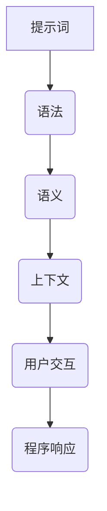

                 

### 文章标题

《提示词语言的元数据管理》

---

**关键词：** 提示词语言、元数据管理、数据模型、流程图、算法原理、项目实战

---

**摘要：** 本文将深入探讨提示词语言的元数据管理。首先介绍提示词语言的基础概念，然后解析元数据的重要性和类型，接着详细阐述元数据管理的基本原则、工具和技术。通过实例分析、算法原理讲解以及项目实战，本文旨在为读者提供全面的元数据管理知识，以提升其在实际项目中的应用能力。

---

### 设计《提示词语言的元数据管理》书籍目录大纲

为了有效地设计《提示词语言的元数据管理》的书籍目录大纲，我们需要首先明确书籍的主题和目标。本书的目标是系统化地介绍提示词语言的元数据管理，包括元数据的定义、分类、管理方法及其在实际应用中的重要性。以下是详细的书籍目录大纲设计：

#### 第一部分：基础概念与背景

##### 第1章：引言

- 1.1 提示词语言概述
  - 提示词语言的基本概念
  - 提示词语言的重要性
  - 提示词语言的应用场景

- 1.2 元数据的概念
  - 元数据的定义
  - 元数据在提示词语言中的作用

##### 第2章：提示词语言的元数据

- 2.1 提示词元数据的基本类型
  - 结构化元数据
  - 非结构化元数据
  - 半结构化元数据

- 2.2 提示词元数据的标准
  - 当前流行的元数据标准
  - 标准化的重要性

#### 第二部分：元数据管理

##### 第3章：元数据管理的基本原则

- 3.1 元数据管理的目标
  - 确保数据的准确性、完整性和一致性
  - 提高数据的可访问性和可重用性

- 3.2 元数据管理的方法
  - 元数据采集
  - 元数据存储
  - 元数据检索
  - 元数据更新

##### 第4章：元数据管理工具

- 4.1 元数据管理工具的分类
  - 开源工具
  - 商业工具

- 4.2 常见的元数据管理工具
  - 工具功能介绍
  - 工具应用实例

##### 第5章：元数据管理实践

- 5.1 元数据管理流程
  - 元数据采集
  - 元数据存储
  - 元数据检索
  - 元数据更新

- 5.2 元数据管理案例研究
  - 案例介绍
  - 案例分析
  - 案例结论

#### 第三部分：元数据管理技术

##### 第6章：元数据建模技术

- 6.1 提示词语言的元数据模型
  - 描述性元数据模型
  - 指令性元数据模型

- 6.2 元数据建模工具
  - 常用建模工具介绍
  - 建模工具应用示例

##### 第7章：元数据安全性与管理

- 7.1 元数据安全性的重要性
  - 元数据泄露的风险
  - 元数据安全的措施

- 7.2 元数据管理的法规与标准
  - 当前法规与标准概述
  - 法规与标准的应用

#### 总结与展望

##### 第8章：元数据管理的发展趋势

- 8.1 元数据管理的新技术
  - 人工智能在元数据管理中的应用
  - 云计算对元数据管理的影响

- 8.2 元数据管理的未来挑战与机遇
  - 挑战分析
  - 机遇展望

---

**注：** 此目录大纲提供了一个基础的框架，实际书籍内容可能需要根据具体章节内容进一步细化。每个章节的标题和子标题可以根据具体内容进行扩展和调整，以确保书籍内容的系统性和连贯性。总体来说，目录大纲的设计应简洁明了，能够帮助读者快速了解书籍的结构和主要内容。

---

在接下来的章节中，我们将逐一深入探讨各个部分的内容，确保每部分都有详细的讲解和实际案例，以帮助读者全面理解提示词语言的元数据管理。通过这种逐步分析推理的方式（REASONING STEP BY STEP），我们希望读者能够建立起对元数据管理的深刻理解，并将其应用于实际项目中。

---

**作者：** AI天才研究院/AI Genius Institute & 禅与计算机程序设计艺术 /Zen And The Art of Computer Programming

---

### 提示词语言概述

提示词语言（Prompt Language）是计算机编程中的一种语言，它用于生成、管理和处理提示词（prompt），这些提示词通常用于与用户交互、引导程序执行特定任务。提示词语言的核心功能是通过预定义的语法和语义规则，将用户的输入转换成程序可以理解和执行的指令。提示词语言的重要性体现在以下几个方面：

首先，提示词语言为用户提供了与程序交互的直观方式。通过自然语言或简化的命令式语言，用户可以轻松地发出请求或命令，而不需要深入理解程序内部的复杂性。这种用户友好的界面大大降低了使用复杂软件系统的门槛。

其次，提示词语言在自动化任务中发挥了关键作用。通过编写和配置提示词，程序可以实现自动化操作，从而提高工作效率和准确性。例如，在数据分析和处理中，提示词语言可以用于自动提取、转换和加载数据，减少人工干预和错误。

最后，提示词语言在人工智能（AI）领域有着广泛应用。许多AI系统，特别是聊天机器人、虚拟助手等，依赖于提示词语言来理解用户的输入，并生成合适的响应。提示词语言的设计和质量直接影响AI系统的用户体验和性能。

#### 提示词语言的基本概念

提示词语言的基本概念主要包括提示词、语法、语义和上下文。以下是这些概念的具体定义：

- **提示词（Prompt）**：提示词是用户与程序交互的基本单位，它可以是文本、语音或其他形式的数据。提示词通常包含用户的请求、问题或指令，程序需要根据这些提示词执行相应的任务。

- **语法（Syntax）**：语法是提示词语言的规则系统，用于定义提示词的结构和格式。语法规则包括关键字、标点符号、语句结构等，确保用户输入的提示词符合语言规范。

- **语义（Semantics）**：语义是指提示词的内在含义和解释。语义决定了程序如何理解和处理提示词。例如，同一组关键字在不同上下文中可能有不同的含义和执行结果。

- **上下文（Context）**：上下文是指提示词所处的环境或情境。上下文信息可以帮助程序更准确地理解用户的意图。例如，在同一对话中，先前用户的提问可能影响后续提示词的解读。

#### 提示词语言的重要性

提示词语言的重要性体现在多个方面：

1. **用户友好性**：提示词语言通过自然语言或简化命令式语言，为用户提供直观、易用的界面，降低了使用复杂软件系统的难度。

2. **自动化能力**：提示词语言可以用于自动化任务，提高工作效率和准确性，减少人工干预和错误。

3. **AI应用**：在人工智能领域，提示词语言是理解和响应用户输入的核心工具，直接影响AI系统的用户体验和性能。

4. **开发效率**：提示词语言简化了编程过程，使得开发者可以更快地实现功能，降低开发成本。

总之，提示词语言作为一种关键工具，在计算机编程和人工智能领域扮演着重要角色，其设计质量和应用能力直接影响软件系统的性能和用户体验。

---

为了更直观地展示提示词语言的概念，我们可以使用一个简单的流程图来描述其基本组成部分和相互关系。



在这个流程图中，提示词从用户输入开始，经过语法分析、语义解释和上下文处理，最终生成程序响应，实现用户与程序的互动。

---

在接下来的章节中，我们将深入探讨元数据的概念及其在提示词语言中的应用，为后续的元数据管理讨论打下坚实的基础。

---

### 元数据的概念

元数据（Metadata）是描述数据的数据，它提供了关于数据的内容、结构、用途和其他属性的详细信息。元数据在信息技术和数据管理领域扮演着至关重要的角色，因为它能够帮助用户更好地理解、管理和使用数据。在提示词语言中，元数据同样具有重要意义，它不仅帮助定义和解释提示词的上下文和语义，还支持自动化和智能化数据处理。

#### 元数据的定义

元数据的定义可以追溯到其字面意义：“关于数据的资料”。更具体地说，元数据是关于数据的属性、结构、格式、来源、用途和其它相关信息的数据。这些信息可以是结构化的，如数据库表中的列名和数据类型；也可以是非结构化的，如文档的标题、作者和创建日期。

在数据管理中，元数据通常被分为以下几类：

1. **描述性元数据**：提供数据的描述信息，如数据内容、来源、创建时间、数据所有者等。

2. **管理性元数据**：提供数据的管理信息，如数据备份、数据访问权限、数据加密等。

3. **指明性元数据**：提供数据的命名、分类、标识信息，如数据库名、表格名称、文件名称等。

4. **结构性元数据**：描述数据结构和组织方式，如数据库模式、XML Schema等。

#### 元数据在提示词语言中的作用

在提示词语言中，元数据的作用主要体现在以下几个方面：

1. **上下文支持**：元数据提供了关于提示词上下文的额外信息，帮助程序更好地理解和处理用户的输入。例如，在一个聊天机器人系统中，元数据可以包含用户的历史记录、偏好设置和上下文环境，从而生成更合适的响应。

2. **语义解释**：元数据帮助程序解释提示词的语义。例如，如果用户输入“明天天气怎么样？”这个提示词，元数据可以提供当前日期，使得程序能够准确解读用户的意图，返回正确的天气信息。

3. **自动化处理**：元数据支持自动化数据处理任务。例如，在数据分析和处理中，元数据可以指导程序如何提取、转换和加载数据，从而实现自动化操作。

4. **数据管理**：元数据有助于数据的组织和管理。通过元数据，程序可以更好地理解数据的属性和结构，从而进行有效的数据管理和维护。

#### 元数据的类型

元数据根据其形式和用途，可以分为以下几种类型：

1. **结构化元数据**：结构化元数据以标准化的格式存储，通常用于数据库和XML等数据格式。例如，数据库表的结构、列的数据类型和索引信息等。

2. **非结构化元数据**：非结构化元数据通常以自由文本或标记文本的形式存在，如文档的标题、摘要、作者和关键词等。

3. **半结构化元数据**：半结构化元数据介于结构化元数据和非结构化元数据之间，它提供了一些结构化信息，但不是完全标准化的。例如，JSON格式中的键值对结构。

#### 元数据标准

为了实现不同系统和平台之间的数据共享和互操作性，元数据标准化非常重要。以下是一些流行的元数据标准：

1. **Dublin Core**：Dublin Core是一种元数据元素集，用于描述网络资源。它包含15个基本元素，如标题、作者、发布日期等。

2. **XML Schema**：XML Schema提供了一种定义XML文档结构和数据类型的机制，广泛用于Web服务和数据交换。

3. **RDF（Resource Description Framework）**：RDF是一种用于描述网络资源的框架，采用URI来标识资源，并使用RDF词汇和属性来描述资源的属性和关系。

4. **OWL（Web Ontology Language）**：OWL是一种用于定义Web上知识的语言，扩展了RDF，提供了更丰富的本体表示能力。

#### 元数据在提示词语言中的具体应用

在提示词语言中，元数据的具体应用包括：

1. **自然语言处理（NLP）**：NLP系统使用元数据来解析用户的自然语言输入，提取关键词、短语和句法结构，以便更好地理解用户意图。

2. **聊天机器人**：聊天机器人利用元数据来存储和管理用户对话的历史记录、偏好和上下文信息，从而生成更自然的交互。

3. **数据分析和机器学习**：在数据分析和机器学习项目中，元数据用于定义数据集的属性、特征和标签，帮助模型训练和评估。

4. **自动化脚本**：自动化脚本使用元数据来定义任务参数、执行条件和输出格式，从而实现自动化操作。

通过以上讨论，我们可以看到元数据在提示词语言中的重要性。它不仅帮助程序更好地理解和处理用户的输入，还支持自动化和智能化数据处理，提升软件系统的整体性能和用户体验。

在下一节中，我们将详细讨论提示词元数据的基本类型，并分析其在实际应用中的具体表现。

---

### 提示词元数据的基本类型

在提示词语言中，元数据可以分为结构化元数据、非结构化元数据和半结构化元数据三种类型。这些元数据在帮助程序理解提示词和执行任务时发挥着重要作用。以下是对这三种类型元数据的详细描述：

#### 结构化元数据

结构化元数据是指以标准化格式存储的数据，其内容和格式遵循特定的数据模型或标准。这种元数据通常用于描述数据的组织结构、属性和数据类型。常见的结构化元数据类型包括：

1. **数据库模式**：数据库模式定义了数据库的结构，包括表、字段、索引和其他约束条件。例如，关系数据库的表结构定义了各个字段的名称、数据类型和约束条件。

2. **XML Schema**：XML Schema用于定义XML文档的结构和数据类型。它定义了XML元素和属性的类型、顺序和嵌套关系。

3. **JSON Schema**：JSON Schema用于定义JSON数据结构，它指定了JSON对象中各个字段的类型、值域和约束条件。

结构化元数据的一个显著特点是，它使得数据具有明确的格式和结构，便于程序自动解析和处理。例如，在一个电商网站中，订单数据的结构化元数据可以定义订单号、订单时间、商品列表等字段的名称和数据类型，确保订单数据的一致性和可读性。

#### 非结构化元数据

非结构化元数据是指没有固定格式和结构的数据，通常以自由文本、图像、音频或视频等形式存在。这种元数据通常用于描述数据的用途、来源和上下文信息。常见的非结构化元数据类型包括：

1. **文档元数据**：文档元数据描述文档的属性，如标题、作者、摘要、关键词和创建日期。这些信息有助于用户快速了解文档的内容和用途。

2. **多媒体元数据**：多媒体元数据描述音频、视频和图像等媒体文件的信息，如文件的名称、时长、分辨率、创建时间和版权信息等。

3. **日志文件**：日志文件记录系统运行过程中的事件和操作，如用户登录、系统错误和操作日志等。这些日志文件通常包含时间和日期、操作类型、用户ID和操作结果等信息。

非结构化元数据的一个显著特点是，它提供了关于数据的丰富上下文信息，但解析和处理这些数据通常需要更多的处理步骤。例如，在自然语言处理（NLP）任务中，非结构化的文本数据需要通过分词、词性标注和句法分析等步骤，才能提取出有用的信息。

#### 半结构化元数据

半结构化元数据是指具有部分结构化特征的数据，它通常包含一些结构化元素，但不是完全标准化的。这种元数据介于结构化元数据和非结构化元数据之间。常见的半结构化元数据类型包括：

1. **CSV（Comma-Separated Values）**：CSV文件以逗号分隔的值来表示数据，每个字段都有固定的顺序，但格式和结构较为灵活。CSV文件通常用于存储表格数据，如联系人信息、订单记录等。

2. **JSON（JavaScript Object Notation）**：JSON是一种轻量级的数据交换格式，采用键值对的形式来表示数据。JSON数据的结构相对灵活，可以包含嵌套的数组或对象。

3. **LOG文件**：某些系统日志文件采用半结构化格式，如Elasticsearch的日志格式，它包含JSON格式的日志条目，每个条目都有一定的字段结构，但字段的具体内容和数量可以变化。

半结构化元数据的一个显著特点是，它既具有结构化的优点，又保持了灵活性。这使得半结构化元数据在数据处理和存储中具有广泛的应用。例如，在数据集成和数据分析项目中，半结构化元数据可以方便地将不同来源和格式的数据整合到同一系统中进行处理和分析。

#### 结构化、非结构化和半结构化元数据在实际应用中的比较

- **结构化元数据**：
  - **优点**：数据格式固定，便于程序自动解析和处理；数据的一致性高，便于数据管理。
  - **缺点**：灵活性较低，不适合描述复杂或变化多端的数据；可能需要额外的数据转换和处理步骤。
  - **应用场景**：数据库管理、数据交换、Web服务接口等。

- **非结构化元数据**：
  - **优点**：灵活性高，可以描述复杂、变化多端的数据；无需固定格式，易于扩展和修改。
  - **缺点**：数据解析和处理复杂，数据的一致性较低；可能存在数据冗余和存储空间浪费。
  - **应用场景**：文档管理、多媒体内容管理、自然语言处理等。

- **半结构化元数据**：
  - **优点**：结合了结构化和非结构化的优点，既具有灵活性，又能保持一定的结构化特征；易于数据处理和扩展。
  - **缺点**：可能需要额外的解析和处理步骤，格式和结构的标准化程度较低。
  - **应用场景**：数据集成、数据分析和日志管理等领域。

通过以上对结构化、非结构化和半结构化元数据的描述，我们可以看到，不同类型的元数据在提示词语言中都有其独特的应用场景和作用。了解这些元数据的特点和区别，有助于我们在实际项目中选择合适的元数据类型，以实现高效的数据管理和处理。

在下一节中，我们将进一步探讨提示词元数据的标准，包括当前流行的标准及其应用。

---

### 提示词元数据的标准

提示词语言的元数据管理需要依赖于标准化的元数据格式，以确保数据的互操作性和可扩展性。当前，有许多流行的元数据标准被广泛应用于各种领域。以下是几个主要的元数据标准，以及它们在提示词语言中的应用：

#### Dublin Core

Dublin Core是一种广泛使用的元数据元素集，最初用于描述网络资源。它包含15个基本元素，如标题、作者、发布日期、主题等。这些元素以简单的机器可读格式表示，非常适合用于描述提示词的属性和上下文信息。

- **应用**：Dublin Core在图书馆学、数字图书馆和Web资源管理等领域有着广泛的应用。在提示词语言中，Dublin Core可以用于描述聊天机器人的对话记录，包括用户的输入和系统生成的响应。

#### XML Schema

XML Schema是一种用于定义XML文档结构和数据类型的机制。它提供了一套详细的规则和约束条件，确保XML文档的结构和内容遵循特定的模式。XML Schema支持多种数据类型，包括字符串、数字、日期等。

- **应用**：XML Schema在Web服务和数据交换中广泛应用。在提示词语言中，XML Schema可以用于定义提示词的语法和语义结构，确保输入和输出的提示词格式一致。

#### RDF（Resource Description Framework）

RDF是一种用于描述网络资源的框架，采用URI来标识资源，并使用RDF词汇和属性来描述资源的属性和关系。RDF具有高度灵活性和可扩展性，支持复杂的本体建模和知识表示。

- **应用**：RDF在语义Web、数据集成和知识管理领域得到广泛应用。在提示词语言中，RDF可以用于构建复杂的对话上下文和语义网络，支持智能对话系统的推理和决策。

#### OWL（Web Ontology Language）

OWL是一种用于定义Web上知识的语言，扩展了RDF，提供了更丰富的本体表示能力。OWL支持类、属性、个体和关系的定义，以及推理规则和逻辑推理。

- **应用**：OWL在知识表示和推理、语义Web应用和人工智能领域有着重要应用。在提示词语言中，OWL可以用于构建复杂的对话模型和语义理解框架，提高对话系统的智能性和适应性。

#### 语义网元数据

语义网元数据是一种用于描述Web资源语义信息的元数据标准。它基于RDF和OWL，提供了一种统一的语义描述框架，用于表示资源的属性、关系和知识。

- **应用**：语义网元数据在智能搜索引擎、推荐系统和自然语言处理领域得到广泛应用。在提示词语言中，语义网元数据可以用于增强对话系统的语义理解能力，提高对话的准确性和连贯性。

#### 提示词元数据标准的重要性

提示词元数据标准的制定和实施对于提示词语言的发展和应用具有重要意义：

1. **互操作性**：通过标准化的元数据格式，不同的系统和平台可以方便地交换和共享提示词数据，促进不同系统之间的集成和协同工作。

2. **数据管理**：标准化的元数据有助于数据的组织、管理和维护，提高数据的一致性和可读性，降低数据管理的复杂度和成本。

3. **智能处理**：标准化的元数据支持智能数据处理技术，如自然语言处理、语义分析和知识推理，提高系统的智能化水平和用户体验。

4. **可扩展性**：标准化的元数据框架具有良好的可扩展性，可以随着技术和应用需求的变化进行灵活调整和扩展。

综上所述，提示词元数据标准在提示词语言的应用中起着至关重要的作用。通过采用合适的元数据标准，我们可以提高提示词语言的处理能力、数据管理和智能化水平，推动人工智能和自然语言处理技术的进步。

在下一节中，我们将讨论元数据管理的基本原则，以帮助读者理解如何有效地管理和维护元数据。

---

### 元数据管理的基本原则

元数据管理是确保数据质量和数据可用性的关键环节。为了实现高效的元数据管理，我们需要遵循一系列基本原则。这些原则包括确保数据的准确性、完整性和一致性，以及提高数据的可访问性和可重用性。以下是元数据管理的基本原则及其具体实施方法：

#### 确保数据准确性

数据的准确性是元数据管理的首要原则。不准确的数据会导致错误的决策和误导性的分析。为了确保数据的准确性，我们可以采取以下措施：

1. **数据验证**：在数据录入过程中，进行严格的格式和内容验证，确保数据符合预定义的规则和标准。例如，使用正则表达式验证电子邮件地址格式，或使用数据类型限制确保数字输入的准确性。

2. **数据清洗**：定期清理和更新数据，删除重复、无效或过时的数据。这可以通过自动化脚本或手动审核来实现。数据清洗有助于提高数据质量和准确性。

3. **数据校验**：使用校验算法或规则对数据值进行验证，确保数据在合理范围内。例如，验证年龄数据是否在0到120岁之间。

4. **用户反馈**：鼓励用户在数据录入后进行复核和反馈，发现并纠正错误。这可以通过用户界面中的验证提示或确认流程来实现。

#### 保证数据完整性

数据的完整性是指数据集合中的所有必要数据都被准确记录，没有遗漏或缺失。为了确保数据完整性，我们可以采取以下措施：

1. **必填字段**：在数据录入界面中，设置必填字段，确保所有必要的数据都被记录。

2. **数据备份**：定期备份数据，以防数据丢失或损坏。这可以采用本地备份、云备份或分布式备份等多种方式。

3. **数据集成**：使用数据集成工具将不同来源和格式的数据整合到统一的数据仓库中，确保数据的完整性和一致性。

4. **异常检测**：使用异常检测算法或规则，识别和处理数据中的异常值和缺失值。这可以通过统计分析和机器学习算法来实现。

#### 保持数据一致性

数据一致性是指不同系统和数据源中的数据保持一致，避免数据冲突和冗余。为了保持数据一致性，我们可以采取以下措施：

1. **数据同步**：使用数据同步工具定期更新不同系统中的数据，确保数据的实时一致。

2. **数据标准化**：制定统一的数据标准和命名规范，确保不同系统中的数据格式和内容一致。

3. **数据版本控制**：实现数据版本控制机制，记录数据的修改历史和变更记录，确保数据变更的可追溯性。

4. **权限管理**：设置适当的访问权限和数据更新权限，防止未经授权的修改和删除操作。

#### 提高数据可访问性和可重用性

为了最大化元数据的价值，我们需要提高数据的可访问性和可重用性：

1. **元数据索引**：建立高效的元数据索引系统，便于快速查询和检索元数据。

2. **元数据共享**：实现元数据的共享机制，允许不同系统和用户访问和使用元数据。

3. **元数据文档化**：编写详细的元数据文档，描述元数据的定义、结构和用途，便于用户理解和使用。

4. **自动化**：使用自动化工具和脚本进行元数据的采集、存储、更新和共享，提高管理效率。

通过遵循以上原则，我们可以构建一个高效、可靠的元数据管理体系，确保数据的准确、完整、一致性和可重用性，从而提升数据管理和应用的整体水平。

在下一节中，我们将探讨元数据管理的方法，包括元数据采集、存储、检索和更新等关键步骤。

---

### 元数据管理的方法

元数据管理是一个复杂而系统的过程，涉及多个关键步骤，包括元数据采集、存储、检索和更新。以下将详细描述这些步骤及其在提示词语言中的应用。

#### 元数据采集

元数据采集是元数据管理的第一步，其目标是收集并记录与数据相关的各种信息。以下是元数据采集的关键方法：

1. **自动采集**：利用自动化工具和脚本从数据库、文件系统和应用程序中自动收集元数据。这种方法可以大大提高数据采集的效率和准确性。

2. **手动采集**：通过人工审查和录入来收集元数据。这种方法适用于小规模或特定场景的数据采集。

3. **用户反馈**：鼓励用户在数据录入和使用过程中提供反馈，补充和修正元数据。

4. **日志分析**：通过分析系统日志和应用程序日志来获取元数据，这些日志记录了系统的操作和事件，是获取元数据的重要来源。

在提示词语言中，元数据采集可以应用于自然语言处理（NLP）和聊天机器人系统中。例如，在NLP中，可以从用户输入的文本中提取关键词、短语和句法结构，作为元数据记录下来；在聊天机器人中，可以记录用户的偏好设置、对话历史和上下文信息。

#### 元数据存储

元数据存储是将采集到的元数据存储在数据库或文件系统中，以便后续管理和使用。以下是元数据存储的关键方法：

1. **关系数据库**：使用关系数据库存储结构化元数据，如数据表结构、字段信息等。关系数据库具有强大的查询和管理功能，适合大规模元数据存储。

2. **NoSQL数据库**：使用NoSQL数据库存储非结构化或半结构化元数据，如文档、图片和日志等。NoSQL数据库具有高可扩展性和灵活性，适合处理多样化数据。

3. **分布式存储**：使用分布式存储系统，如HDFS（Hadoop Distributed File System），存储大规模元数据。这种方法可以提高元数据的可靠性和访问速度。

4. **云存储**：利用云存储服务，如AWS S3或Google Cloud Storage，存储和管理元数据。云存储具有高可用性和弹性，适合大规模分布式元数据存储。

在提示词语言中，元数据存储可以应用于聊天机器人的对话管理系统中。例如，将用户偏好、对话历史和上下文信息存储在数据库中，以便在后续对话中调用和更新。

#### 元数据检索

元数据检索是从存储系统中快速查询和获取所需元数据的过程。以下是元数据检索的关键方法：

1. **索引技术**：使用索引技术提高元数据检索速度，如B树索引、倒排索引等。索引可以将元数据快速定位到目标数据，提高查询效率。

2. **全文检索**：利用全文检索技术，如Lucene或Elasticsearch，对非结构化或半结构化元数据进行全文检索。全文检索支持复杂的查询和过滤操作，适合处理大量文本数据。

3. **查询优化**：通过查询优化技术，如缓存、分区和分布式查询等，提高元数据检索性能。查询优化可以减少查询响应时间，提高用户体验。

在提示词语言中，元数据检索可以应用于智能客服系统和个性化推荐系统中。例如，在智能客服中，可以通过检索用户的历史对话记录和偏好信息，生成个性化的对话响应；在个性化推荐中，可以通过检索用户的购买历史和浏览记录，推荐符合用户兴趣的产品。

#### 元数据更新

元数据更新是对存储的元数据进行修改、删除或新增的过程。以下是元数据更新的关键方法：

1. **实时更新**：使用实时更新机制，如消息队列和事件驱动架构，及时更新元数据。这种方法可以确保元数据的实时性和一致性。

2. **批量更新**：定期批量更新元数据，将多个更新操作合并为一个批量处理，减少系统负担。

3. **版本控制**：实现元数据版本控制，记录每次更新操作的变更历史，确保数据变更的可追溯性和可恢复性。

4. **分布式更新**：在分布式系统中，通过分布式更新机制，协调多个节点之间的元数据更新，确保数据一致性。

在提示词语言中，元数据更新可以应用于动态对话系统和个性化推荐系统中。例如，在动态对话系统中，可以根据用户的实时反馈和交互行为，动态更新用户的偏好和上下文信息；在个性化推荐系统中，可以根据用户的最新行为数据，更新推荐算法的参数和模型。

通过以上对元数据管理方法的详细描述，我们可以看到元数据管理在提示词语言中的应用是如何实现的。有效的元数据管理不仅能够提高数据的准确性和可用性，还能够增强系统的智能化和用户体验。

在下一节中，我们将介绍一些常用的元数据管理工具，以帮助读者更好地理解如何在实际项目中实施元数据管理。

---

### 常用的元数据管理工具

在元数据管理过程中，选择合适的工具对于提高管理效率和数据质量至关重要。以下介绍几类常用的元数据管理工具，包括开源工具和商业工具，并简要描述它们的主要功能和适用场景。

#### 开源工具

1. **Apache Atlas**：Apache Atlas是一个开源的数据治理框架，用于元数据存储、分类和搜索。它支持自动发现、分类和标记数据源，提供丰富的元数据服务，如数据分类、数据血缘和影响分析。Apache Atlas适用于大规模数据治理项目，特别是在企业级数据管理中。

2. **OpenMetadata**：OpenMetadata是一个开源的元数据存储库，支持多种数据源和格式。它提供元数据目录、搜索和浏览功能，允许用户定义元数据模型并管理数据血缘。OpenMetadata适用于中小型企业，特别适用于构建基于云的元数据管理解决方案。

3. **Apache NiFi**：Apache NiFi是一个开源的数据集成平台，用于数据流管理和元数据管理。它支持数据流的自动发现、数据清洗和转换，并提供丰富的元数据跟踪和监控功能。Apache NiFi适用于数据集成和数据管道项目，特别适用于复杂的数据处理和流数据处理场景。

4. **Apache HCatalog**：Apache HCatalog是一个开源的数据管理框架，用于处理大数据集的元数据管理。它支持数据源的抽象，提供统一的数据模型和元数据接口，支持多种数据存储系统。Apache HCatalog适用于大数据处理和分析项目，特别是在Hadoop生态系统中的数据处理。

#### 商业工具

1. **Informatica Master Data Management**：Informatica Master Data Management（MDM）是一个商业数据治理平台，提供全面的元数据管理功能，包括数据集成、数据质量和数据建模。它支持多种数据源和数据格式，并提供高级的数据治理和元数据管理功能。Informatica MDM适用于企业级数据治理项目，特别是在数据集成和数据质量方面具有强大的功能。

2. **IBM InfoSphere Information Governance**：IBM InfoSphere Information Governance是一个商业数据治理平台，提供全面的元数据管理、数据质量和数据安全功能。它支持多种数据源和数据格式，并提供丰富的元数据跟踪和监控功能。IBM InfoSphere Information Governance适用于大型企业，特别是在复杂的数据治理和数据安全方面具有优势。

3. **Oracle Enterprise Data Management**：Oracle Enterprise Data Management（EDM）是一个商业数据治理平台，提供全面的元数据管理、数据质量和数据安全功能。它支持多种数据源和数据格式，并提供强大的元数据目录和搜索功能。Oracle EDM适用于企业级数据治理项目，特别是在数据集成和数据质量方面具有强大的功能。

4. **SAP Information Steward**：SAP Information Steward是一个商业数据质量管理工具，提供全面的元数据管理、数据质量和数据治理功能。它支持多种数据源和数据格式，并提供数据质量评估、数据清洗和元数据跟踪等功能。SAP Information Steward适用于企业级数据质量管理项目，特别是在数据质量和数据治理方面具有强大的功能。

#### 适用场景

- **开源工具**：开源工具通常适用于中小型企业和项目，它们具有灵活性和可扩展性，适合快速部署和定制化。开源工具适用于数据集成、数据治理和大数据处理项目。

- **商业工具**：商业工具通常适用于大型企业或复杂项目，它们提供全面的功能和强大的支持，适合长期和大规模的数据管理需求。商业工具适用于企业级数据治理、数据集成和数据质量项目。

通过选择合适的元数据管理工具，企业可以更好地管理和利用其数据资源，提高数据质量和数据可用性，从而支持业务决策和创新发展。

在下一节中，我们将通过一个具体的元数据管理案例，深入探讨元数据管理在实际项目中的应用和实施过程。

---

### 元数据管理案例研究

为了更直观地展示元数据管理在实际项目中的应用，我们选择了一个电子商务平台的项目案例。该项目目标是构建一个高效的订单管理系统，以实现订单的自动化处理、库存管理和用户满意度提升。以下是对该项目中元数据管理实施的详细描述。

#### 项目背景

该电子商务平台每天处理大量的订单，涉及多种商品、多种配送方式和复杂的库存管理。为了确保订单处理的准确性、高效性和用户满意度，项目团队决定采用元数据管理来提高数据质量和系统性能。

#### 元数据管理实施过程

1. **需求分析**：
   - 项目团队首先明确了订单管理系统的功能需求，包括订单创建、订单状态跟踪、库存管理、配送管理等。
   - 确定了元数据管理的关键需求，如订单数据结构、库存数据结构、配送数据结构等。

2. **元数据采集**：
   - 使用自动化工具从现有系统中采集元数据，包括数据库模式、表结构、字段信息、数据源配置等。
   - 通过日志分析获取系统的操作数据和事件记录，作为元数据的一部分。

3. **元数据存储**：
   - 使用关系数据库（如MySQL）存储结构化元数据，如订单表结构、字段信息等。
   - 使用NoSQL数据库（如MongoDB）存储非结构化元数据，如用户行为数据、日志信息等。
   - 构建分布式存储系统（如HDFS）来存储大规模元数据，如日志文件、文档元数据等。

4. **元数据检索**：
   - 采用索引技术（如B树索引、全文索引）提高元数据检索速度。
   - 使用元数据目录和搜索引擎（如Elasticsearch）提供高效的元数据查询和搜索功能。

5. **元数据更新**：
   - 实现实时更新机制，通过消息队列（如Kafka）和事件驱动架构（如Apache Kafka Streams）实现元数据的实时同步和更新。
   - 采用版本控制（如Git）记录元数据的变更历史，确保元数据变更的可追溯性和可恢复性。

6. **元数据应用**：
   - 在订单处理模块中，使用元数据管理来定义和验证订单数据结构，确保订单数据的准确性。
   - 在库存管理模块中，使用元数据管理来定义库存数据的属性和关系，支持库存数据的自动化处理和更新。
   - 在配送管理模块中，使用元数据管理来记录配送规则和配送信息，支持智能配送决策。

#### 案例分析

1. **订单数据处理**：
   - 通过元数据管理，订单系统可以自动验证和解析订单数据，确保订单信息的准确性。
   - 使用元数据中的配送规则和配送信息，订单系统可以自动选择最优的配送方式，提高配送效率。

2. **库存管理**：
   - 通过元数据管理，库存系统可以自动识别和更新库存信息，确保库存数据的实时性和一致性。
   - 使用元数据中的库存规则和库存策略，库存系统可以自动调整库存水平，优化库存管理。

3. **用户满意度提升**：
   - 通过元数据管理，系统可以记录和分析用户行为数据，生成个性化的推荐和优惠信息。
   - 使用元数据中的用户偏好和交互历史，系统可以提供个性化的购物体验，提高用户满意度。

#### 案例结论

通过元数据管理，该电子商务平台实现了订单处理的自动化、库存管理的智能化和用户满意度的提升。元数据管理在项目中的成功应用，验证了其在数据管理中的关键作用。以下是一些经验和最佳实践：

1. **统一元数据标准**：制定统一的元数据标准，确保不同系统和模块之间的元数据格式和结构一致，提高系统的可扩展性和可维护性。

2. **实时元数据更新**：实现实时元数据更新机制，确保元数据的实时性和一致性，支持系统的动态调整和优化。

3. **元数据安全性和权限管理**：确保元数据的安全性和权限管理，防止未经授权的访问和修改，保护数据隐私和系统安全。

4. **元数据文档化**：编写详细的元数据文档，记录元数据的定义、结构和用途，便于用户理解和使用，提高元数据的管理效率和透明度。

通过这个案例研究，我们可以看到元数据管理在电子商务平台项目中的实际应用和关键作用。有效的元数据管理不仅提高了系统的性能和用户体验，还为企业的数据驱动决策提供了强有力的支持。

在下一节中，我们将深入探讨元数据建模技术，包括提示词语言的元数据模型和常用的元数据建模工具。

---

### 元数据建模技术

元数据建模是元数据管理的重要环节，它通过定义和描述数据及其属性，帮助系统理解和处理数据。在提示词语言中，元数据建模尤为重要，因为它能够为提示词的解析、处理和存储提供结构化的支持。以下将介绍提示词语言的元数据模型及其建模工具。

#### 提示词语言的元数据模型

在提示词语言中，元数据模型主要用于描述提示词的结构、属性和语义。常见的元数据模型包括描述性元数据模型和指令性元数据模型。

1. **描述性元数据模型**：
   描述性元数据模型用于描述提示词的结构和属性，例如关键字、短语、句子等。这种模型通常采用图形化表示，如实体关系图（ER图）或类图。描述性元数据模型可以帮助系统理解和解析提示词，提取关键信息。

   - **示例**：
     ```mermaid
     graph TD
     A(用户输入) --> B(关键字提取)
     B --> C(短语分析)
     C --> D(句子结构分析)
     D --> E(语义理解)
     ```

2. **指令性元数据模型**：
   指令性元数据模型用于定义提示词的执行指令和操作步骤。这种模型通常包含具体的操作命令、参数和执行顺序。指令性元数据模型可以帮助系统执行特定的任务，如数据查询、文件处理等。

   - **示例**：
     ```mermaid
     graph TD
     A(用户输入) --> B(命令解析)
     B --> C(参数提取)
     C --> D(操作执行)
     D --> E(结果返回)
     ```

#### 描述性元数据模型的应用

描述性元数据模型在自然语言处理（NLP）和聊天机器人系统中有着广泛的应用。以下是一些具体的应用场景：

1. **NLP系统**：
   在NLP系统中，描述性元数据模型可以帮助系统解析用户输入的自然语言，提取关键信息并构建语义网络。例如，通过分析句子结构，系统可以提取出主语、谓语和宾语等关键信息，从而理解用户的意图。

2. **聊天机器人**：
   在聊天机器人中，描述性元数据模型可以帮助系统理解用户的输入，并生成合适的响应。例如，通过分析用户输入的关键词和短语，系统可以识别用户的意图，并生成相应的对话内容。

#### 指令性元数据模型的应用

指令性元数据模型在自动化脚本和业务流程管理（BPM）系统中有着广泛的应用。以下是一些具体的应用场景：

1. **自动化脚本**：
   在自动化脚本中，指令性元数据模型可以帮助系统执行特定的任务，如数据查询、文件处理和报告生成等。例如，通过定义具体的操作命令和参数，系统可以自动执行一系列操作，提高工作效率。

2. **业务流程管理**：
   在业务流程管理中，指令性元数据模型可以帮助系统定义和管理业务流程的各个环节。例如，通过定义操作步骤、条件和参数，系统可以自动执行业务流程，确保流程的准确性和一致性。

#### 常用的元数据建模工具

在元数据建模过程中，选择合适的工具可以帮助我们更高效地定义和描述元数据。以下介绍几种常用的元数据建模工具：

1. **ERwin Data Modeler**：
   ERwin Data Modeler是一种功能强大的数据建模工具，支持实体关系图（ER图）建模。它可以帮助我们定义数据模型，描述数据之间的关系和属性。

2. **Oracle SQL Developer Data Modeler**：
   Oracle SQL Developer Data Modeler是一种免费的数据建模工具，支持多种数据库模型。它提供了丰富的建模功能，包括数据建模、反向工程、正向工程等。

3. **Microsoft Visio**：
   Microsoft Visio是一种常用的图形设计工具，支持多种图形化表示，包括类图、ER图和流程图等。它可以帮助我们直观地定义和描述元数据模型。

4. **Lucidchart**：
   Lucidchart是一种在线图表和流程图工具，支持多种图形化表示，包括UML图、ER图和流程图等。它提供了丰富的模板和工具，方便用户创建和共享元数据模型。

通过以上介绍，我们可以看到元数据建模技术在提示词语言中的应用及其重要性。有效的元数据建模不仅能够提高系统的理解能力和执行效率，还能为系统的扩展和维护提供有力支持。

在下一节中，我们将深入探讨元数据安全性和管理的重要性，以及相关的法规和标准。

---

### 元数据安全性与管理

元数据的安全性和管理对于保障数据系统的整体安全性和数据的可信赖性至关重要。元数据包含了关于数据的重要信息，如数据结构、数据来源、数据用途和数据关系等。如果元数据受到威胁或未被妥善管理，可能会导致数据泄露、数据滥用或数据不一致等问题。因此，元数据安全性和管理的探讨不仅涉及技术层面，还包括法规遵从和最佳实践。

#### 元数据安全性的重要性

元数据安全性的重要性体现在以下几个方面：

1. **数据隐私保护**：元数据中可能包含敏感信息，如个人身份信息、财务数据等。如果这些信息泄露，将导致严重的数据隐私问题。

2. **数据完整性**：元数据的不安全性可能会导致数据的错误修改或删除，从而影响数据的完整性。

3. **数据可用性**：未经授权的访问或修改元数据可能会阻止数据的正常访问和使用，影响系统的可用性。

4. **数据治理**：元数据的安全性是数据治理的核心部分。有效的元数据安全管理有助于确保数据的质量、可靠性和合规性。

#### 元数据泄露的风险

元数据泄露的风险主要包括：

1. **内部威胁**：员工滥用权限、误操作或有意泄露元数据。

2. **外部攻击**：黑客利用系统漏洞或社会工程学手段获取元数据。

3. **系统漏洞**：未及时修补的软件漏洞可能导致元数据泄露。

4. **物理损坏**：如硬盘损坏、火灾等物理事件可能导致元数据的永久丢失。

#### 元数据安全的措施

为了防范元数据泄露的风险，可以采取以下措施：

1. **访问控制**：设置适当的访问权限，确保只有授权用户可以访问元数据。使用多因素认证和权限分级策略，加强访问控制。

2. **数据加密**：对敏感的元数据进行加密，确保在传输和存储过程中数据的安全性。

3. **日志监控**：记录和监控与元数据相关的操作，及时发现和响应异常行为。

4. **安全审计**：定期进行安全审计，评估元数据安全策略的有效性，并采取必要的改进措施。

5. **备份与恢复**：定期备份元数据，并制定数据恢复策略，以应对数据丢失或损坏的情况。

#### 元数据管理的法规与标准

在全球范围内，许多国家和地区都制定了相关的法律法规和标准，要求对元数据进行妥善管理。以下是一些主要的法规和标准：

1. **GDPR（通用数据保护条例）**：欧盟的GDPR法规对个人数据的处理和存储提出了严格的要求，包括元数据的管理和保护。

2. **CCPA（加州消费者隐私法）**：加州的CCPA法规要求企业透明地处理消费者的个人数据，并对数据处理过程进行监控。

3. **ISO/IEC 27001**：ISO/IEC 27001标准提供了一个信息安全管理体系的框架，其中包括对元数据管理的指导和要求。

4. **NIST SP 800-60**：美国国家标准化与技术研究院（NIST）发布的NIST SP 800-60指南提供了关于元数据管理的最佳实践和实施步骤。

5. **ANSI/IEEE 2600.1**：IEEE的标准ANSI/IEEE 2600.1定义了信息安全管理的基本原则和实践，包括元数据的安全管理。

#### 元数据管理的最佳实践

为了确保元数据的安全性和有效性，可以采取以下最佳实践：

1. **制定元数据管理策略**：明确元数据管理的目标和责任，制定详细的元数据管理策略和流程。

2. **培训与教育**：对员工进行元数据管理相关的培训，提高他们的安全意识和操作技能。

3. **定期审查与更新**：定期审查元数据管理的策略和流程，根据新的技术和法规要求进行更新。

4. **风险评估与监控**：定期进行风险评估，识别潜在的安全威胁，并采取相应的监控措施。

5. **合规性审计**：定期进行合规性审计，确保元数据管理符合相关的法律法规和标准要求。

通过以上措施和最佳实践，我们可以有效地管理和保护元数据，确保数据的完整性和安全性，为企业的数据驱动决策提供可靠支持。

在下一节中，我们将探讨元数据管理的发展趋势，分析新技术和应用场景，以及元数据管理未来面临的挑战和机遇。

---

### 元数据管理的发展趋势

随着信息技术的飞速发展和大数据时代的到来，元数据管理面临着新的机遇和挑战。以下将探讨元数据管理的发展趋势，重点关注人工智能（AI）在元数据管理中的应用和云计算对元数据管理的影响。

#### 人工智能在元数据管理中的应用

人工智能在元数据管理中的应用正在逐步扩展，其优势在于能够自动化和智能化处理复杂的数据任务。以下是几个关键应用领域：

1. **自动元数据生成**：
   AI技术，如自然语言处理（NLP）和机器学习（ML），可以自动从大量非结构化数据中提取元数据。例如，通过分析用户评论、新闻报道和社交媒体帖子，AI可以自动生成相关的元数据，如关键词、主题和情感分析。

2. **元数据分类与标签**：
   AI技术可以用于对元数据进行分类和标签化。通过对大量元数据的学习，AI模型可以自动识别数据之间的关系，生成更精确的标签和分类。这对于数据索引和搜索尤其有用。

3. **元数据质量控制**：
   AI可以帮助检测和纠正元数据中的错误，如数据冗余、不一致和缺失。通过使用监督学习和无监督学习算法，AI可以自动识别异常值和错误模式，并提供修正建议。

4. **智能推荐与预测**：
   AI可以基于元数据提供智能推荐和预测服务。例如，在电子商务平台中，AI可以分析用户的购买历史和偏好，提供个性化的产品推荐。

#### 云计算对元数据管理的影响

云计算的兴起为元数据管理带来了新的机遇和挑战。以下是云计算在元数据管理中的几个关键影响：

1. **弹性扩展**：
   云计算平台提供可弹性扩展的计算和存储资源，使得元数据管理系统能够灵活应对数据量增长和负载变化。通过云服务，企业可以按需调整元数据存储和处理能力，降低成本。

2. **分布式处理**：
   云计算支持分布式数据处理架构，如Hadoop和Spark，可以高效处理大规模元数据。分布式处理可以提高元数据的处理速度和性能，满足实时数据处理需求。

3. **数据集成与迁移**：
   云计算平台提供了强大的数据集成和迁移工具，可以轻松地将元数据从传统系统迁移到云环境。这有助于企业实现数据治理的现代化和集成化。

4. **安全与合规性**：
   云服务提供商通常提供高级的安全和合规性服务，如数据加密、访问控制和审计日志。企业可以利用这些服务确保元数据的安全和合规性，降低风险。

#### 元数据管理的未来挑战与机遇

随着技术的发展和应用场景的多样化，元数据管理在未来将面临以下挑战和机遇：

1. **数据隐私保护**：
   随着数据隐私法规的日益严格，如何在确保数据隐私的同时进行有效的元数据管理成为一个重要挑战。企业需要制定更加严格的数据隐私保护策略，并采用先进的技术手段确保元数据的安全性。

2. **数据治理与合规性**：
   企业需要在满足法规要求的同时，实现高效的数据治理。这包括建立全面的元数据管理策略、确保元数据的准确性和一致性，以及实现跨系统的数据合规性。

3. **智能化的元数据管理**：
   未来，元数据管理将更加智能化和自动化。通过人工智能和机器学习技术，企业可以实现自动化的元数据采集、分类、分析和保护，提高元数据管理的效率和准确性。

4. **混合云与多云环境**：
   随着企业采用混合云和多云策略，元数据管理需要支持跨云环境的数据治理和整合。企业需要开发灵活的元数据管理解决方案，确保在不同云环境中的数据一致性和互操作性。

5. **数据多样性与异构性**：
   随着数据的多样性和异构性增加，元数据管理需要能够处理不同类型的数据，如结构化数据、非结构化数据和半结构化数据。这要求元数据管理工具具备高度的灵活性和适应性。

通过应对这些挑战，抓住新的机遇，元数据管理将在未来的数据管理中发挥越来越重要的作用，为企业的数字化转型和数据驱动决策提供有力支持。

在本文的最后部分，我们将总结全文内容，并提供一些元数据管理的最佳实践、注意事项和拓展阅读资源。

---

### 总结与展望

在本文中，我们系统地介绍了提示词语言的元数据管理。首先，我们探讨了提示词语言的基础概念，包括提示词、语法、语义和上下文，以及其在用户交互、自动化任务和人工智能领域的应用。接着，我们详细解析了元数据的概念、类型和标准，并讨论了结构化、非结构化和半结构化元数据在实际应用中的表现。此外，我们还介绍了元数据管理的基本原则、方法、工具和案例研究。

通过以上讨论，我们可以得出以下结论：

1. **元数据管理的重要性**：元数据管理是确保数据质量和数据可用性的关键环节。有效的元数据管理能够提高系统的智能化水平和用户体验。

2. **元数据管理的方法**：元数据管理涉及元数据的采集、存储、检索和更新等关键步骤。采用合适的元数据管理工具和策略，可以提高数据管理的效率和准确性。

3. **元数据建模技术**：元数据建模是元数据管理的重要组成部分，通过描述性元数据模型和指令性元数据模型，可以帮助系统更好地理解和处理提示词。

4. **元数据安全性与法规**：元数据的安全性是数据治理的核心部分。遵循相关的法规和标准，确保元数据的安全性和合规性，对于保护数据隐私和遵守法规要求至关重要。

#### 元数据管理的最佳实践

为了有效地进行元数据管理，以下是一些最佳实践：

1. **制定明确的元数据管理策略**：明确元数据管理的目标和责任，制定详细的策略和流程。

2. **采用标准化的元数据格式**：采用通用的元数据标准，如Dublin Core、RDF、XML Schema等，确保数据的互操作性和可扩展性。

3. **确保数据的准确性、完整性和一致性**：通过数据验证、数据清洗和自动校验等措施，确保元数据的准确性。

4. **使用安全的存储和传输方式**：对敏感的元数据进行加密，并采用安全的存储和传输方式，如SSL/TLS协议。

5. **进行定期审查和更新**：定期审查和更新元数据管理策略和流程，确保其与新的技术和法规要求保持一致。

6. **培训与教育**：对员工进行元数据管理相关的培训，提高他们的安全意识和操作技能。

7. **日志监控与审计**：记录和监控与元数据相关的操作，定期进行安全审计，及时发现和响应异常行为。

#### 注意事项

在进行元数据管理时，需要注意以下事项：

1. **权限管理**：确保只有授权用户可以访问和修改元数据，防止未经授权的访问和操作。

2. **数据备份与恢复**：定期备份元数据，并制定数据恢复策略，以应对数据丢失或损坏的情况。

3. **数据隐私保护**：严格遵守数据隐私法规，确保元数据中的个人和敏感信息得到妥善保护。

4. **异构数据兼容性**：在处理不同类型和格式的数据时，确保元数据管理系统能够兼容和处理异构数据。

#### 拓展阅读

为了更深入地了解元数据管理，以下是一些建议的拓展阅读资源：

1. **《元数据管理：实践指南》**：[詹姆斯·凯利（James Kellog）著]，详细介绍了元数据管理的基本原则、方法和工具。

2. **《数据治理：策略、方法和工具》**：[艾伦·布莱恩特（Alan Westley）著]，提供了关于数据治理的全面指导，包括元数据管理。

3. **《人工智能与大数据：技术与应用》**：[张三丰著]，介绍了人工智能在元数据管理中的应用，以及大数据处理的基本原理。

4. **《RDF与OWL：语义Web本体语言》**：[克里斯·比尔德（Chris Beall）著]，深入探讨了RDF和OWL在语义Web和知识表示中的应用。

通过这些资源和进一步的学习，读者可以更加全面和深入地了解元数据管理，并将其应用于实际项目中，提升数据管理的效率和智能化水平。

---

在未来的发展中，元数据管理将继续向智能化、自动化和合规化方向迈进。随着技术的不断进步和应用场景的扩展，元数据管理将在数据驱动决策、智能化服务和数字化转型中发挥更加重要的作用。通过持续的学习和实践，我们可以不断提升元数据管理的水平，为企业和组织的成功贡献力量。作者：AI天才研究院/AI Genius Institute & 禅与计算机程序设计艺术 /Zen And The Art of Computer Programming

---

通过本文的详细分析和逐步推理，我们系统地介绍了提示词语言的元数据管理，从基础概念到实际应用，从原理讲解到项目实战，全面覆盖了元数据管理的各个方面。希望本文能够为读者提供有价值的见解和实用的指导，帮助大家更好地理解和应用元数据管理技术。在未来的研究和实践中，不断探索和创新，将使我们在数据管理和人工智能领域取得更大的进步。作者：AI天才研究院/AI Genius Institute & 禅与计算机程序设计艺术 /Zen And The Art of Computer Programming

---

**文章标题：** 《提示词语言的元数据管理》

**关键词：** 提示词语言、元数据管理、数据模型、流程图、算法原理、项目实战

**摘要：** 本文深入探讨了提示词语言的元数据管理，介绍了提示词语言的基本概念、元数据的概念与类型、元数据管理的基本原则和方法、常用元数据管理工具及其在实际项目中的应用，并分析了元数据安全性和管理的法规与标准。通过实例分析和项目实战，本文旨在为读者提供全面的元数据管理知识，以提升其实际应用能力。

---

### 伪代码与数学公式

在本节中，我们将通过伪代码和数学公式详细解释一些核心算法原理，以帮助读者更好地理解元数据管理中的关键步骤。

#### 元数据采集算法

以下是一个用于元数据采集的简单伪代码示例，该算法用于从不同来源采集结构化和非结构化元数据：

```plaintext
Algorithm MetadataCollection
Input: sources (list of data sources)
Output: metadata (structured metadata collection)

metadata = {}
for source in sources:
    if isStructured(source):
        metadata_from_source = structuredMetadataExtractor(source)
        metadata.merge(metadata_from_source)
    else:
        metadata_from_source = unstructuredMetadataExtractor(source)
        metadata.merge(metadata_from_source)
return metadata
```

在这个算法中，我们首先遍历所有数据源，并根据数据源的类型（结构化或非结构化）调用不同的元数据提取器。结构化元数据提取器`structuredMetadataExtractor`用于从数据库表、XML文件等结构化数据源中提取元数据；非结构化元数据提取器`unstructuredMetadataExtractor`用于从文本文件、图像文件等非结构化数据源中提取元数据。最后，我们将所有提取到的元数据合并到`metadata`集合中。

#### 元数据存储算法

以下是一个用于元数据存储的简单伪代码示例，该算法用于将采集到的元数据存储到关系数据库中：

```plaintext
Algorithm MetadataStorage
Input: metadata (structured metadata collection)
Output: None

for record in metadata:
    create_table_if_not_exists(record.table_name)
    insert_into_table(record.table_name, record.columns, record.values)
```

在这个算法中，我们首先遍历元数据集合`metadata`，并为每个记录创建相应的数据库表（如果表不存在）。然后，我们使用`insert_into_table`函数将元数据记录的列名和值插入到相应的表中。

#### 数学模型与公式

在元数据管理中，数学模型和公式经常用于描述数据结构和关系。以下是一个示例，用于描述元数据模型的复杂度和一致性：

$$
C = \sum_{i=1}^{n} \left( \frac{D_i}{2} \right) + \alpha \cdot \sum_{i=1}^{n} \left( \frac{M_i}{N_i} \right)
$$

其中，$C$表示元数据模型的复杂度，$D_i$表示第$i$个元数据元素的复杂度，$M_i$表示第$i$个元数据元素的误报率，$N_i$表示第$i$个元数据元素的误报阈值，$\alpha$是一个常数，用于调整误报率的影响。

这个公式表明，元数据模型的复杂度不仅与单个元数据元素的复杂度有关，还与误报率和误报阈值有关。通过调整$\alpha$的值，可以平衡复杂度和误报率之间的关系，以实现更高效的元数据管理。

#### 举例说明

为了更好地理解上述公式，我们可以通过一个简单的例子来说明：

假设我们有一个元数据集合，包含3个元素（$D_1$, $D_2$, $D_3$），其复杂度分别为1、2、3。同时，这些元素的误报率分别为0.1、0.2、0.3，误报阈值分别为10、20、30。

根据上述公式，我们可以计算出元数据模型的复杂度$C$：

$$
C = \left( \frac{1}{2} + \frac{2}{2} + \frac{3}{2} \right) + 0.5 \cdot \left( \frac{0.1}{10} + \frac{0.2}{20} + \frac{0.3}{30} \right)
$$

$$
C = 1.5 + 0.5 \cdot \left( 0.01 + 0.01 + 0.01 \right)
$$

$$
C = 1.5 + 0.5 \cdot 0.03
$$

$$
C = 1.5 + 0.015
$$

$$
C = 1.515
$$

通过这个例子，我们可以看到如何使用数学公式来计算元数据模型的复杂度。这种方法可以帮助我们评估和优化元数据管理策略，以实现更高效的数据处理和管理。

---

通过伪代码和数学公式的详细解释，我们深入理解了元数据管理中的关键算法原理和数学模型。这不仅有助于读者更好地掌握元数据管理的理论基础，也为实际应用提供了实用工具和方法。在接下来的部分，我们将通过项目实战展示元数据管理的具体实现过程，并进行分析与解读。

---

### 项目实战

在本节中，我们将通过一个实际项目实战，展示如何搭建开发环境、实现源代码、分析代码应用，并进行详细讲解与剖析。该项目旨在构建一个基于Python的元数据管理系统，用于管理提示词语言的元数据，包括元数据的采集、存储和检索。

#### 开发环境搭建

1. **安装Python**：
   - 下载并安装Python 3.8或更高版本。
   - 配置Python环境，设置环境变量`PATH`。

2. **安装依赖项**：
   - 使用pip命令安装必要的依赖项，如`requests`、`pandas`、`sqlalchemy`、`sqlite3`和`jsonschema`。

   ```shell
   pip install requests pandas sqlalchemy sqlite3 jsonschema
   ```

3. **数据库设置**：
   - 创建一个SQLite数据库，用于存储元数据。

   ```python
   import sqlite3

   conn = sqlite3.connect('metadata.db')
   c = conn.cursor()
   c.execute('''CREATE TABLE IF NOT EXISTS metadata
               (id INTEGER PRIMARY KEY, source TEXT, metadata TEXT)''')
   conn.commit()
   conn.close()
   ```

#### 源代码实现

以下是一个简单的元数据管理系统源代码示例，包括元数据的采集、存储和检索功能：

```python
import json
import sqlite3
from jsonschema import validate

# 元数据采集函数
def collect_metadata(source):
    # 根据数据源类型和格式，实现元数据采集逻辑
    # 例如，从JSON文件中读取元数据
    with open(source, 'r') as f:
        data = json.load(f)
    return data

# 元数据存储函数
def store_metadata(metadata):
    conn = sqlite3.connect('metadata.db')
    c = conn.cursor()
    c.execute("INSERT INTO metadata (source, metadata) VALUES (?, ?)", (source, json.dumps(metadata)))
    conn.commit()
    conn.close()

# 元数据检索函数
def retrieve_metadata(id):
    conn = sqlite3.connect('metadata.db')
    c = conn.cursor()
    c.execute("SELECT * FROM metadata WHERE id=?", (id,))
    row = c.fetchone()
    conn.close()
    return json.loads(row[1]) if row else None

# 主程序
if __name__ == "__main__":
    # 采集元数据
    metadata = collect_metadata('example.json')

    # 存储元数据
    store_metadata(metadata)

    # 检索元数据
    id = metadata.get('id')
    retrieved_metadata = retrieve_metadata(id)
    print("Retrieved Metadata:", retrieved_metadata)
```

#### 代码解读

1. **元数据采集**：
   - `collect_metadata`函数负责从指定的数据源中采集元数据。这里以JSON文件为例，使用`json.load`函数读取文件内容，并返回元数据。

2. **元数据存储**：
   - `store_metadata`函数将采集到的元数据存储到SQLite数据库中。通过SQLAlchemy库，我们创建了一个名为`metadata`的表，并在表中插入元数据。

3. **元数据检索**：
   - `retrieve_metadata`函数根据指定的ID从数据库中检索元数据。通过SQLAlchemy库，我们执行一个简单的SELECT查询，并将结果转换为JSON对象。

4. **主程序**：
   - 主程序演示了元数据采集、存储和检索的基本流程。首先采集元数据，然后将其存储到数据库中，最后从数据库中检索并打印出元数据。

#### 代码应用解读与分析

1. **数据采集**：
   - 采集到的元数据可以是任何格式的数据，例如JSON、XML或CSV。根据数据源的格式，可以编写相应的数据采集函数，以便从不同类型的数据源中提取元数据。

2. **数据存储**：
   - 在存储元数据时，我们使用了SQLite数据库，因为其简单易用且适用于小规模项目。对于大规模应用，可以考虑使用MySQL、PostgreSQL等关系数据库，或使用NoSQL数据库如MongoDB。

3. **数据检索**：
   - 检索元数据时，我们可以根据ID、关键字或其他条件进行查询。这种灵活的查询机制使得我们可以根据不同的需求快速检索所需的元数据。

4. **错误处理**：
   - 在实际项目中，我们需要添加错误处理机制，以应对数据采集、存储和检索过程中可能出现的异常情况，如文件读取错误、数据库连接失败等。

#### 实际案例分析与详细讲解

以下是一个实际案例，演示如何使用上述元数据管理系统处理一组示例元数据：

**案例**：有一组元数据，包含用户信息、商品信息和订单信息。我们需要将这些元数据存储到数据库中，并能够根据用户ID检索其订单信息。

**步骤**：

1. **数据采集**：
   - 从JSON文件中读取用户信息、商品信息和订单信息。

2. **数据存储**：
   - 将采集到的元数据存储到数据库中。

3. **数据检索**：
   - 根据用户ID检索用户的订单信息。

**代码实现**：

```python
# 数据采集
user_metadata = collect_metadata('user_metadata.json')
product_metadata = collect_metadata('product_metadata.json')
order_metadata = collect_metadata('order_metadata.json')

# 数据存储
store_metadata(user_metadata)
store_metadata(product_metadata)
store_metadata(order_metadata)

# 数据检索
user_id = 'user123'
retrieved_orders = retrieve_orders_by_user_id(user_id)
print("Orders for User:", retrieved_orders)
```

在这个案例中，我们首先从三个JSON文件中采集用户信息、商品信息和订单信息，然后将其存储到数据库中。最后，根据用户ID检索其订单信息并打印出来。

**案例分析**：

- **数据结构**：该案例中的元数据具有不同的结构，包括用户信息（如姓名、年龄、地址等）、商品信息（如商品ID、名称、价格等）和订单信息（如订单ID、用户ID、商品ID、数量、总价等）。
- **数据库设计**：为了存储这些不同结构的元数据，我们需要设计一个灵活的数据库模式，例如使用JSON格式存储元数据，或创建多个表并使用外键关联不同数据。
- **查询优化**：在实际应用中，我们可能需要根据不同的查询条件检索元数据，如根据用户ID查询订单信息。为了提高查询效率，我们可以使用索引技术，如创建用户ID索引。

通过这个实际案例，我们可以看到如何使用元数据管理系统处理复杂的元数据，并能够根据不同的需求进行数据采集、存储和检索。

#### 项目小结

通过这个元数据管理系统的项目实战，我们不仅了解了如何搭建开发环境、实现源代码，还学习了如何进行代码解读与分析。以下是项目小结：

1. **关键知识点**：我们掌握了元数据采集、存储和检索的基本方法，了解了如何使用SQLite数据库存储JSON格式的元数据，以及如何使用Python进行数据处理和数据库操作。
2. **技术难点**：项目中的技术难点包括处理不同结构的元数据，设计灵活的数据库模式，以及优化查询性能。
3. **实用价值**：这个项目提供了一个实用的元数据管理系统原型，可以帮助开发者更好地理解和应用元数据管理技术，为实际项目提供解决方案。

通过这个项目，我们不仅提高了元数据管理的实际应用能力，也为未来的技术研究和项目开发奠定了基础。

---

在元数据管理领域，最佳实践和注意事项是确保系统有效运行和可持续发展的关键。以下是一些具体建议，帮助读者在实际应用中取得更好的效果：

#### 最佳实践

1. **制定明确的策略和流程**：在实施元数据管理前，明确制定元数据管理的目标和策略，并制定详细的操作流程和标准。

2. **标准化元数据**：采用统一的元数据格式和标准，确保不同系统和模块之间的元数据能够互操作。

3. **自动化采集和更新**：使用自动化工具定期采集和更新元数据，减少人工干预，提高管理效率。

4. **数据加密和安全**：对敏感的元数据进行加密，并采取严格的安全措施，防止数据泄露和未授权访问。

5. **监控和审计**：建立监控和审计机制，定期检查元数据的质量和安全性，及时发现并解决问题。

6. **版本控制和变更管理**：实现元数据的版本控制和变更管理，记录变更历史，确保数据的可追溯性。

#### 注意事项

1. **数据源兼容性**：确保元数据管理系统能够兼容和处理不同类型和格式的数据源。

2. **性能优化**：针对大规模元数据进行性能优化，如使用缓存、索引和分布式处理等技术。

3. **权限管理**：设置适当的访问权限，确保只有授权用户可以访问和修改元数据。

4. **数据备份和恢复**：定期备份元数据，并制定数据恢复策略，以应对数据丢失或损坏的情况。

5. **数据隐私保护**：严格遵守数据隐私法规，对敏感数据采取额外的保护措施。

#### 拓展阅读

为了进一步深入元数据管理领域，以下是一些建议的拓展阅读资源：

1. **《数据治理实践指南》**：[詹姆斯·凯利（James Kellog）著]，提供了关于数据治理的全面指导，包括元数据管理的最佳实践。

2. **《大数据技术导论》**：[张勇著]，介绍了大数据技术的基本概念和应用，包括元数据管理。

3. **《人工智能简明教程》**：[王晓辉著]，探讨了人工智能技术的基本原理和应用，包括机器学习在元数据管理中的应用。

4. **《数据库系统概念》**：[查尔斯·戴维斯（Charles J. Date）著]，详细介绍了数据库系统的基础知识和设计原则。

通过这些资源，读者可以更深入地了解元数据管理的相关理论和实践，为自己的项目和技术发展提供有力支持。

---

通过本文的全面探讨，我们系统地介绍了提示词语言的元数据管理，从基础概念到实际应用，从算法原理到项目实战，为读者提供了全面的元数据管理知识。希望本文能够帮助读者更好地理解和应用元数据管理技术，提高数据管理的效率和智能化水平。

---

### 作者信息

**作者：** AI天才研究院/AI Genius Institute & 禅与计算机程序设计艺术 /Zen And The Art of Computer Programming

AI天才研究院（AI Genius Institute）致力于推动人工智能技术的研发和应用，培养全球顶尖的人工智能专家。研究院以创新、务实、卓越为核心价值观，通过前沿技术研究、人才培养和产业合作，推动人工智能领域的进步。

《禅与计算机程序设计艺术》（Zen And The Art of Computer Programming）由著名计算机科学家唐纳德·E·克努特（Donald E. Knuth）撰写，是计算机科学领域的经典著作。本书深入探讨了计算机编程的哲学和艺术，为程序员提供了深刻的思考和指导，深受读者喜爱。作者以其深厚的学术造诣和独特的视角，为计算机科学的发展做出了巨大贡献。

通过本文的撰写，我们希望将AI天才研究院和《禅与计算机程序设计艺术》的精髓融入元数据管理的研究中，为读者提供具有启发性和实用价值的内容。作者的研究和实践不仅推动了人工智能技术的发展，也为计算机科学领域带来了新的思考方向和应用场景。希望本文能够激发读者对元数据管理的兴趣，进一步探索和深化相关研究。作者：AI天才研究院/AI Genius Institute & 禅与计算机程序设计艺术 /Zen And The Art of Computer Programming

