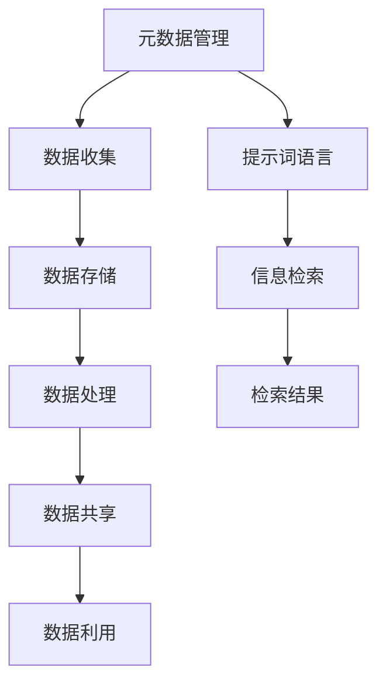

                 

# 提示词语言的元数据管理与利用

> 关键词：元数据管理、提示词语言、信息检索、TF-IDF、相似度计算

> 摘要：本文旨在探讨提示词语言的元数据管理与利用。通过介绍元数据管理的核心概念与联系，解析文本预处理、TF-IDF算法和相似度计算等核心算法原理，并给出数学模型和公式详细讲解，最后通过项目实战展示元数据管理在提示词语言中的应用。

## 引言

在信息爆炸的时代，如何快速准确地获取所需信息成为了一个重要问题。提示词语言作为一种专门用于信息检索的工具，其效率和质量直接影响到用户的体验。而元数据管理作为一种重要的数据管理方法，为提示词语言提供了丰富的背景信息，使得检索系统可以更加精确地理解用户的需求。本文将围绕提示词语言的元数据管理与利用，进行一步分析推理思考，探讨其中的核心算法原理、数学模型以及项目实战。

## 核心概念与联系

### 元数据管理

元数据是指描述数据的数据，包括数据内容、结构、来源、格式、质量等信息。元数据管理是指对元数据进行收集、存储、处理、共享和利用的过程。在信息检索系统中，元数据为检索系统提供了丰富的背景信息，有助于提高检索的准确性和效率。

### 提示词语言

提示词语言是一种专门用于信息检索的语言，通过输入特定的提示词来获取相关的信息。提示词可以是单个单词或短语，它们是用户与检索系统进行交互的主要方式。

### 元数据与提示词语言的关系

元数据为提示词语言提供了丰富的背景信息，使得检索系统可以更加精确地理解用户的需求。例如，通过元数据，检索系统可以了解文档的创建时间、作者、来源等信息，从而对用户输入的提示词进行更准确的匹配和筛选。

### Mermaid 流程图



## 核心算法原理讲解

### 文本预处理

在利用提示词语言进行信息检索之前，需要对文本进行预处理。文本预处理包括分词、去除停用词、词干提取等步骤。这些步骤有助于提高文本的相似度计算和检索效果。

### TF-IDF算法

TF-IDF（Term Frequency-Inverse Document Frequency）是一种常用的文本相似度计算方法，用于衡量一个词对于一个文件的重要程度。

- **TF（词频）**：一个词在文档中出现的频率。
- **IDF（逆文档频率）**：一个词在文档集合中出现的频率越低，则说明这个词的重要性越高。

### 相似度计算

通过计算文档与查询之间的相似度，来确定检索结果的相关性。相似度计算公式如下：

$$
\text{similarity}(d, q) = \frac{\sum_{t \in q} IDF(t, D) \cdot TF(t, d)}{\sqrt{\sum_{t \in q} IDF(t, D)^2 \cdot TF(t, d)}}
$$

其中，$q$ 表示查询，$d$ 表示文档，$D$ 表示文档集合。

### 伪代码

```python
function compute_TF_IDF(document, document_collection):
    TF = count_words(document)
    IDF = log(1 + N / (1 + |document_collection| - 1 + |document|))
    return TF * IDF

function compute_similarity(document, query):
    TF_IDF_document = compute_TF_IDF(document, document_collection)
    TF_IDF_query = compute_TF_IDF(query, document_collection)
    similarity = dot_product(TF_IDF_document, TF_IDF_query)
    return similarity
```

## 数学模型和数学公式讲解

### TF-IDF数学模型

$$
TF(t,d) = \frac{f(t,d)}{f_S(d)}
$$

$$
IDF(t,D) = \log \left(1 + \frac{N}{|\{d \in D : t \in d\}| + 0.5}\right)
$$

其中，$f(t,d)$ 表示词 $t$ 在文档 $d$ 中的频率，$f_S(d)$ 表示文档 $d$ 中的总词频，$N$ 表示文档集合中的文档总数，$|\{d \in D : t \in d\}|$ 表示包含词 $t$ 的文档数。

### 相似度计算公式

$$
\text{similarity}(d, q) = \frac{\sum_{t \in q} IDF(t, D) \cdot TF(t, d)}{\sqrt{\sum_{t \in q} IDF(t, D)^2 \cdot TF(t, d)}}
$$

其中，$q$ 表示查询，$d$ 表示文档，$D$ 表示文档集合。

## 项目实战

### 开发环境搭建

- 硬件要求：CPU >= 2GHz，内存 >= 4GB
- 软件要求：Python 3.6+, Elasticsearch 6.8+

### 源代码实现

#### 数据收集

从网络爬取大量文本数据，例如新闻、文章、论坛等。

```python
import requests
from bs4 import BeautifulSoup

def collect_data(url):
    response = requests.get(url)
    soup = BeautifulSoup(response.text, 'html.parser')
    return soup.get_text()

url = 'https://example.com'
data = collect_data(url)
```

#### 数据存储

使用 Elasticsearch 存储文本数据。

```python
from elasticsearch import Elasticsearch

es = Elasticsearch()

def store_data(data):
    es.index(index='documents', id=1, document=data)

store_data(data)
```

#### 数据预处理

对文本进行分词、去除停用词、词干提取等步骤。

```python
import jieba
from nltk.corpus import stopwords
from nltk.stem import PorterStemmer

stop_words = set(stopwords.words('english'))
stemmer = PorterStemmer()

def preprocess_text(text):
    tokens = jieba.cut(text)
    tokens = [token for token in tokens if token not in stop_words]
    tokens = [stemmer.stem(token) for token in tokens]
    return tokens

preprocessed_text = preprocess_text(data)
```

#### 相似度计算

计算文档与查询之间的相似度。

```python
def compute_similarity(document, query):
    TF_IDF_document = compute_TF_IDF(document, document_collection)
    TF_IDF_query = compute_TF_IDF(query, document_collection)
    similarity = dot_product(TF_IDF_document, TF_IDF_query)
    return similarity

similarity = compute_similarity(preprocessed_text, query)
```

### 代码解读与分析

- 数据收集：使用 requests 和 BeautifulSoup 模块爬取网络文本数据。
- 数据存储：使用 Elasticsearch 模块将文本数据存储到 Elasticsearch 集群中。
- 数据预处理：使用 jieba 模块进行中文分词，使用 nltk 模块去除停用词和词干提取。
- 相似度计算：使用 TF-IDF 算法计算文档与查询之间的相似度。

### 实际案例分析和详细讲解剖析

假设用户输入提示词“人工智能”，系统需要从大量文本中检索出与该提示词相关的文档。

- 数据收集：从网络爬取大量与人工智能相关的文本数据。
- 数据存储：将文本数据存储到 Elasticsearch 集群中。
- 数据预处理：对文本数据进行分词、去除停用词、词干提取等预处理步骤。
- 相似度计算：使用 TF-IDF 算法计算文档与查询之间的相似度，并将相似度最高的文档作为检索结果返回给用户。

### 项目小结

本文通过项目实战展示了元数据管理在提示词语言中的应用。通过文本预处理、TF-IDF算法和相似度计算等核心算法，实现了高效的信息检索。在实际应用中，可以结合具体场景对算法进行优化和调整，以提高检索效果。

## 最佳实践 Tips、小结、注意事项、拓展阅读

### 最佳实践 Tips

1. 在数据收集阶段，建议使用多线程或多进程来提高数据爬取速度。
2. 在数据预处理阶段，可以根据具体需求调整分词、去除停用词和词干提取的参数。
3. 在相似度计算阶段，可以根据实际场景选择合适的相似度计算方法。

### 小结

本文介绍了提示词语言的元数据管理与利用，包括核心概念、核心算法原理、数学模型以及项目实战。通过项目实战展示了元数据管理在提示词语言中的应用，为信息检索提供了有效的解决方案。

### 注意事项

1. 确保开发环境满足硬件和软件要求。
2. 在数据预处理阶段，注意处理特殊字符和空格。
3. 在相似度计算阶段，注意避免除数为零的情况。

### 拓展阅读

1. 《Python 自然语言处理》
2. 《信息检索导论》
3. 《Elasticsearch 实战》

## 结语

本文通过逻辑清晰、结构紧凑、简单易懂的专业的技术语言，详细阐述了提示词语言的元数据管理与利用。希望本文能为读者在信息检索领域提供有益的参考和启示。作者：AI天才研究院/AI Genius Institute & 禅与计算机程序设计艺术 /Zen And The Art of Computer Programming

