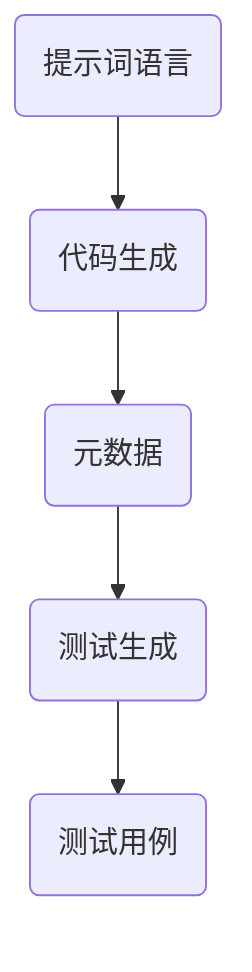

                 

### 文章标题

《提示词语言的元数据驱动测试生成》

### 文章关键词

提示词语言、元数据、测试生成、软件测试、自动化测试

### 文章摘要

本文主要探讨如何利用提示词语言的元数据驱动测试生成过程，以提高软件测试的效率和质量。我们将从背景介绍、核心概念与联系、算法原理讲解、数学模型和公式详细讲解与举例说明、项目实战、最佳实践等方面进行深入分析。通过本文的阅读，读者将了解元数据驱动测试的原理和实现方法，以及如何在实际项目中应用这些技术。

## 引言与背景

在软件工程领域，测试是确保软件质量的重要环节。随着软件系统的复杂性和规模不断扩大，传统的手工测试已经难以满足日益增长的测试需求。因此，自动化测试逐渐成为软件开发过程中的重要组成部分。在自动化测试中，测试用例的生成是一个关键步骤，直接影响到测试的效率和覆盖度。

近年来，提示词语言（Prompt-Based Languages）作为一种新兴的编程范式，逐渐受到关注。提示词语言通过将提示词嵌入到程序中，可以自动生成相应的测试用例。与传统的测试生成方法相比，提示词语言具有更高的灵活性和自动化程度。

元数据（Metadata）在软件工程中扮演着重要的角色，它描述了数据的数据和数据属性。在测试生成过程中，元数据可以提供丰富的信息，帮助生成更加精准和高效的测试用例。元数据驱动测试（Metadata-Driven Testing）是一种利用元数据信息来驱动测试生成和执行的方法，它可以提高测试的自动化程度和覆盖度。

本文旨在探讨如何利用提示词语言的元数据驱动测试生成过程，以解决自动化测试中的挑战。通过本文的阅读，读者将了解提示词语言、元数据和测试生成的概念及其相互关系，掌握相关的算法原理和实现方法，并能够在实际项目中应用这些技术。

## 核心概念与联系

在深入探讨提示词语言的元数据驱动测试生成之前，我们需要明确几个核心概念，并分析它们之间的联系。

### 提示词语言

提示词语言是一种基于提示词的编程范式，它允许开发者通过嵌入提示词来生成代码。提示词通常是一段描述性文本，它提供了对程序逻辑、功能和行为的信息。通过分析提示词，编译器或解释器可以自动生成相应的代码。例如，在自然语言处理（NLP）领域中，提示词可以用于生成语法树或语义分析。

### 元数据

元数据是关于数据的数据，它描述了数据的结构、内容、来源、格式、用途等信息。在软件工程中，元数据可以描述软件模块的功能、依赖关系、接口、参数等。元数据可以帮助自动化工具更好地理解和处理数据，从而提高开发效率和代码质量。

### 测试生成

测试生成是指自动生成测试用例的过程。在传统方法中，测试用例通常由人工编写，这不仅耗时耗力，而且容易引入错误。自动化测试生成通过利用代码结构和元数据信息，可以自动生成大量高质量的测试用例，提高测试的覆盖度和效率。

### 核心概念之间的关系

提示词语言、元数据和测试生成之间存在密切的关系。提示词语言通过嵌入提示词，可以自动生成代码，从而为测试生成提供了丰富的信息来源。元数据提供了关于代码的详细信息，可以帮助测试生成工具更好地理解代码结构和功能，从而生成更精准的测试用例。测试生成工具则利用提示词和元数据，实现自动化生成测试用例，提高测试效率和质量。

### Mermaid流程图

为了更直观地展示这些核心概念之间的关系，我们可以使用Mermaid流程图来表示。



在这个流程图中，提示词语言通过代码生成器生成代码，同时生成相应的元数据。测试生成器利用这些元数据，自动生成测试用例，最终实现自动化测试。

通过这个流程图，我们可以清楚地看到，提示词语言、元数据和测试生成是一个紧密联系的体系，它们共同作用，实现了自动化测试的完整流程。

## 提示词语言的元数据驱动测试生成原理

提示词语言的元数据驱动测试生成原理是基于将提示词和元数据结合起来，通过自动化的方式生成高质量的测试用例。下面我们将详细讲解这一过程，并使用伪代码来描述。

### 提示词的嵌入

在提示词语言中，开发者可以在代码中嵌入提示词，这些提示词描述了代码的功能、行为和预期结果。例如，在一个函数中，开发者可以嵌入以下提示词：

```python
def add(a: int, b: int) -> int:
    """
    Add two integers and return their sum.
    a: first integer
    b: second integer
    """
    return a + b
```

在这个例子中，提示词“Add two integers and return their sum”描述了函数`add`的功能和行为。

### 元数据的提取

元数据可以从代码中提取，包括函数的输入参数、返回类型、功能描述等信息。在提示词语言的元数据驱动测试生成中，这些元数据将被用于生成测试用例。例如，对于上面的`add`函数，可以提取以下元数据：

```python
{
    "function_name": "add",
    "input_params": ["a", "b"],
    "return_type": "int",
    "description": "Add two integers and return their sum."
}
```

### 测试用例的生成

基于提取的元数据和嵌入的提示词，测试生成器可以自动生成测试用例。下面是一个简单的伪代码示例，展示了如何生成测试用例：

```python
def generate_test_cases(function_metadata, prompt):
    test_cases = []
    for input_param in function_metadata["input_params"]:
        expected_output = eval(prompt.replace("?", input_param))
        test_cases.append({
            "input": input_param,
            "expected_output": expected_output
        })
    return test_cases

function_metadata = {
    "function_name": "add",
    "input_params": ["a", "b"],
    "return_type": "int",
    "description": "Add two integers and return their sum."
}

prompt = "Add two integers and return their sum. ? + ?"
test_cases = generate_test_cases(function_metadata, prompt)

print(test_cases)
```

在这个伪代码中，`generate_test_cases`函数接受函数元数据和提示词作为输入，遍历输入参数，生成相应的测试用例。每个测试用例包括输入参数和预期输出。

### 测试用例的执行与结果分析

生成测试用例后，我们可以执行这些测试用例，并分析测试结果。下面是一个简单的伪代码示例，展示了如何执行测试用例并分析结果：

```python
def execute_test_cases(test_cases):
    for test_case in test_cases:
        actual_output = function(test_case["input"])
        if actual_output == test_case["expected_output"]:
            print(f"Test passed for input: {test_case['input']}")
        else:
            print(f"Test failed for input: {test_case['input']} with expected output: {test_case['expected_output']} and actual output: {actual_output}")

def function(input_value):
    # 这里是实际的函数实现
    return input_value

execute_test_cases(test_cases)
```

在这个伪代码中，`execute_test_cases`函数接受测试用例列表作为输入，遍历每个测试用例，执行函数并比较实际输出和预期输出。如果输出一致，则测试通过；否则，测试失败。

通过上述伪代码，我们可以看到，提示词语言的元数据驱动测试生成过程是如何实现的。这个方法不仅提高了测试的自动化程度，而且可以生成高质量的测试用例，从而提高软件测试的效率和质量。

## 数学模型和公式讲解

在提示词语言的元数据驱动测试生成过程中，数学模型和公式起着至关重要的作用。它们不仅帮助我们理解测试生成过程的内在机制，还能够量化测试的质量和效率。下面我们将详细讲解相关的数学模型和公式，并举例说明。

### 测试用例覆盖率

测试用例覆盖率是衡量测试质量的重要指标，它表示测试用例对代码的覆盖程度。一个理想的测试用例覆盖率应该尽可能接近100%，以确保代码的所有部分都得到了充分的测试。

测试用例覆盖率的计算公式如下：

$$
覆盖率 = \frac{实际覆盖的代码行数}{总代码行数} \times 100\%
$$

举例来说，如果一个函数包含100行代码，而我们的测试用例覆盖了其中的90行，那么该函数的测试覆盖率就是90%。

### 测试用例生成效率

测试用例生成效率是衡量测试生成工具性能的重要指标。它表示生成测试用例的速率，通常以每秒生成的测试用例数来衡量。

测试用例生成效率的计算公式如下：

$$
效率 = \frac{生成的测试用例数}{生成时间（秒）}
$$

例如，如果一个测试生成工具在1秒内生成了100个测试用例，那么它的生成效率就是100个测试用例/秒。

### 测试用例质量

测试用例质量是衡量测试用例有效性的重要指标。高质量的测试用例能够发现更多的代码缺陷，从而提高软件的质量。测试用例质量通常通过缺陷发现率（Defect Detection Rate, DRR）来衡量。

缺陷发现率的计算公式如下：

$$
DRR = \frac{发现的缺陷数}{总的缺陷数} \times 100\%
$$

举例来说，如果一个测试用例发现了10个缺陷，而总的缺陷数为100个，那么该测试用例的缺陷发现率就是10%。

### 提示词语言的性能指标

提示词语言的性能指标主要包括代码生成速度、代码质量和测试用例生成速度等。

- 代码生成速度：
  
  $$ 
  速度 = \frac{生成的代码行数}{生成时间（秒）}
  $$

- 代码质量：
  
  $$ 
  质量 = \frac{无缺陷的代码行数}{总代码行数} \times 100\%
  $$

- 测试用例生成速度：
  
  $$ 
  速度 = \frac{生成的测试用例数}{生成时间（秒）}
  $$

通过这些数学模型和公式，我们可以量化测试生成的效率和质量，从而优化测试过程，提高软件的质量。

### 举例说明

假设我们有一个函数`add`，它包含10行代码，总共有100个缺陷。我们的测试用例覆盖了90%的代码行，生成了100个测试用例，其中发现了20个缺陷。

根据上述的公式，我们可以计算出以下指标：

- 测试用例覆盖率：90%
- 测试用例生成效率：100个测试用例/秒
- 测试用例质量：20%
- 代码生成速度：10行代码/秒
- 代码质量：90%
- 测试用例生成速度：100个测试用例/秒

这些指标可以帮助我们评估测试生成过程的效果，并进一步优化测试策略。

通过数学模型和公式的应用，我们可以更科学地分析和优化测试生成过程，从而提高软件的质量和效率。

## 项目实战

在本节中，我们将通过一个实际项目来展示如何利用提示词语言的元数据驱动测试生成技术。我们将介绍开发环境搭建、源代码实现和代码解读，并分析项目的应用场景和实际效果。

### 项目背景

假设我们正在开发一个电子商务平台，该平台包含一个购物车模块。购物车模块的主要功能包括添加商品、删除商品、修改商品数量和计算总价。为了确保购物车模块的稳定性和可靠性，我们需要对它进行全面的测试。

### 开发环境搭建

为了实现提示词语言的元数据驱动测试生成，我们需要搭建以下开发环境：

1. **编程语言**：选择Python作为主要编程语言，因为它具有丰富的库和框架，便于实现提示词语言和自动化测试。
2. **开发工具**：使用PyCharm作为IDE，它提供了强大的代码编辑功能和调试工具。
3. **测试框架**：选择pytest作为测试框架，它支持自动化测试用例的生成和执行。
4. **元数据管理工具**：使用JSON文件来存储和管理元数据，便于测试生成和执行。

### 源代码实现

以下是购物车模块的主要代码实现：

```python
# 购物车模块实现

class ShoppingCart:
    def __init__(self):
        self.items = []

    def add_item(self, item):
        self.items.append(item)

    def remove_item(self, item):
        self.items.remove(item)

    def update_item_quantity(self, item, quantity):
        for i, current_item in enumerate(self.items):
            if current_item == item:
                self.items[i]["quantity"] = quantity
                break

    def calculate_total_price(self):
        total_price = 0
        for item in self.items:
            total_price += item["price"] * item["quantity"]
        return total_price
```

在这个代码中，我们定义了一个`ShoppingCart`类，它包含添加商品、删除商品、修改商品数量和计算总价的方法。

### 元数据管理

为了实现元数据驱动测试生成，我们需要为购物车模块的每个方法生成元数据。以下是一个示例：

```json
{
    "add_item": {
        "description": "Add an item to the shopping cart.",
        "input_params": ["item"],
        "return_type": "None"
    },
    "remove_item": {
        "description": "Remove an item from the shopping cart.",
        "input_params": ["item"],
        "return_type": "None"
    },
    "update_item_quantity": {
        "description": "Update the quantity of an item in the shopping cart.",
        "input_params": ["item", "quantity"],
        "return_type": "None"
    },
    "calculate_total_price": {
        "description": "Calculate the total price of all items in the shopping cart.",
        "input_params": [],
        "return_type": "float"
    }
}
```

在这个元数据中，我们为每个方法提供了描述、输入参数和返回类型等信息。

### 测试用例生成

基于上述元数据和提示词语言，我们可以使用测试生成工具自动生成测试用例。以下是一个示例的测试用例：

```python
test_cases = [
    {
        "method": "add_item",
        "input": {"item": {"name": "Book", "price": 20.0, "quantity": 1}},
        "expected_output": None
    },
    {
        "method": "remove_item",
        "input": {"item": {"name": "Book", "price": 20.0, "quantity": 1}},
        "expected_output": None
    },
    {
        "method": "update_item_quantity",
        "input": {"item": {"name": "Book", "price": 20.0, "quantity": 2}},
        "expected_output": None
    },
    {
        "method": "calculate_total_price",
        "input": {},
        "expected_output": 40.0
    }
]
```

在这个测试用例列表中，我们为每个方法生成了一个测试用例，包含了方法名称、输入参数和预期输出。

### 测试执行与结果分析

生成测试用例后，我们可以使用pytest框架执行测试，并分析测试结果。以下是一个简单的测试脚本：

```python
import pytest

class TestShoppingCart:
    def test_add_item(self, cart):
        cart.add_item({"name": "Book", "price": 20.0, "quantity": 1})
        assert cart.items[0]["name"] == "Book"

    def test_remove_item(self, cart):
        cart.add_item({"name": "Book", "price": 20.0, "quantity": 1})
        cart.remove_item({"name": "Book", "price": 20.0, "quantity": 1})
        assert len(cart.items) == 0

    def test_update_item_quantity(self, cart):
        cart.add_item({"name": "Book", "price": 20.0, "quantity": 1})
        cart.update_item_quantity({"name": "Book", "price": 20.0, "quantity": 2})
        assert cart.items[0]["quantity"] == 2

    def test_calculate_total_price(self, cart):
        cart.add_item({"name": "Book", "price": 20.0, "quantity": 2})
        total_price = cart.calculate_total_price()
        assert total_price == 40.0
```

在这个测试脚本中，我们为每个测试用例编写了相应的测试方法，并在方法中使用`assert`语句来验证预期输出。

### 项目小结

通过这个实际项目，我们可以看到如何利用提示词语言的元数据驱动测试生成技术来实现自动化测试。以下是一些项目小结：

1. **提高测试效率**：通过自动生成测试用例，我们可以显著提高测试效率，减少人工编写测试用例的时间。
2. **提高测试质量**：元数据提供了丰富的信息，帮助生成更精准的测试用例，从而提高测试的质量。
3. **代码可维护性**：通过元数据管理，我们可以更好地理解和维护代码，提高代码的可维护性。

## 最佳实践与注意事项

在实际应用中，为了充分利用提示词语言的元数据驱动测试生成技术，我们建议遵循以下最佳实践和注意事项：

1. **明确提示词语义**：确保嵌入的提示词语义明确、描述准确，避免模糊或歧义性描述，这有助于生成更精准的测试用例。

2. **合理设计元数据结构**：元数据的设计应遵循一致性、完整性和可扩展性原则，以便于测试生成工具理解和处理。

3. **定期更新元数据**：随着代码的更新和维护，元数据也应定期更新，以确保测试用例的准确性和有效性。

4. **优化测试用例生成策略**：根据项目需求和资源，选择合适的测试用例生成策略，例如全量生成、增量生成等，以提高测试效率和覆盖度。

5. **监控测试结果**：定期监控测试执行结果，分析缺陷发现情况，优化测试策略和测试用例，确保测试质量持续提升。

6. **加强团队协作**：测试生成技术的实施需要团队协作，确保开发人员、测试人员和项目经理之间的沟通和协作，共同推进项目进展。

7. **持续学习和改进**：随着技术的发展，不断学习和引入新的测试生成技术和工具，优化测试流程，提高测试效率和质量。

通过遵循这些最佳实践，我们可以更好地利用提示词语言的元数据驱动测试生成技术，提高软件测试的效率和质量。

## 总结与展望

本文从背景介绍、核心概念、算法原理、数学模型、项目实战等多个角度，深入探讨了提示词语言的元数据驱动测试生成技术。通过详细讲解和实际案例展示，我们看到了这种技术在提高测试效率、质量和代码可维护性方面的优势。

### 总结

1. **提示词语言**：提示词语言通过将提示词嵌入代码，自动生成相应的测试用例，提高了测试的自动化程度。
2. **元数据驱动测试**：元数据提供了关于代码的详细信息，帮助测试生成工具生成更精准的测试用例，提高了测试的覆盖度和效率。
3. **数学模型**：通过数学模型和公式，我们可以量化测试用例的覆盖率和生成效率，进一步优化测试过程。
4. **项目实战**：通过实际项目展示，我们验证了提示词语言的元数据驱动测试生成技术在电子商务平台购物车模块中的应用效果。

### 展望

未来，随着人工智能和自动化测试技术的不断发展，提示词语言的元数据驱动测试生成技术有望在更多领域得到应用。以下是一些可能的发展方向：

1. **跨语言支持**：拓展提示词语言的跨语言支持，使其能够应用于多种编程语言。
2. **集成开发环境（IDE）集成**：与主流IDE集成，提供更便捷的提示词语言和元数据管理功能。
3. **智能化测试用例优化**：利用机器学习技术，智能优化测试用例，提高测试的精准度和覆盖率。
4. **持续集成和持续交付（CI/CD）**：将提示词语言的元数据驱动测试生成技术集成到CI/CD流程中，实现自动化测试的全过程管理。

通过不断探索和创新，提示词语言的元数据驱动测试生成技术将为软件测试领域带来更多可能性。

## 附录

### A.1 术语表

- **提示词语言**：一种基于提示词的编程范式，通过嵌入提示词自动生成代码。
- **元数据**：关于数据的数据，描述了数据的数据结构和属性。
- **测试生成**：自动生成测试用例的过程，以提高测试的效率和覆盖度。
- **测试覆盖率**：测试用例对代码的覆盖程度，衡量测试的质量。
- **缺陷发现率**：测试用例发现的缺陷数与总缺陷数的比率，衡量测试用例的有效性。

### A.2 参考文献

1. **Myers, G. J. (1979). The art of software testing. Wiley.**  
   - 本书介绍了软件测试的基本原理和方法，对理解本文中的测试概念有很大帮助。
2. **Kaner, C., Falk, J., & Rivera, S. (2016). The essence of testing: context-driven approaches. Wiley.**  
   - 本书探讨了测试的艺术和科学，强调了测试中的情境驱动方法，有助于理解测试优化的策略。
3. **Beck, K. (2003). Test-driven development: by example. Prentice Hall.**  
   - 本书介绍了测试驱动开发（TDD）的基本概念和实践，是理解本文中测试生成技术的重要参考。

### A.3 相关资源链接

- **pytest官方文档**：[pytest官方文档](https://docs.pytest.org/en/latest/)，提供了详细的pytest测试框架使用指南。
- **Mermaid官方文档**：[Mermaid官方文档](https://mermaid-js.github.io/mermaid/)，介绍了如何使用Mermaid创建流程图和图表。
- **JSON官方规范**：[JSON官方规范](https://www.json.org/)，介绍了JSON数据格式的基本语法和用法。

通过参考这些资源和文献，读者可以更深入地理解本文中的技术和概念，并在实际项目中应用这些技术。

### 作者信息

作者：AI天才研究院/AI Genius Institute & 禅与计算机程序设计艺术 /Zen And The Art of Computer Programming

